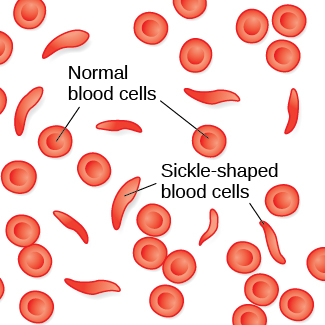
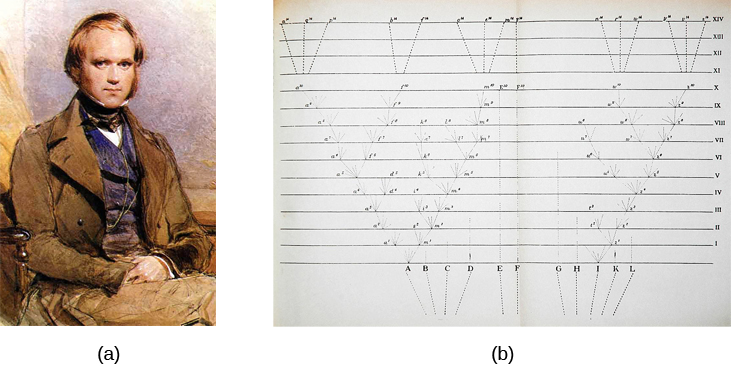
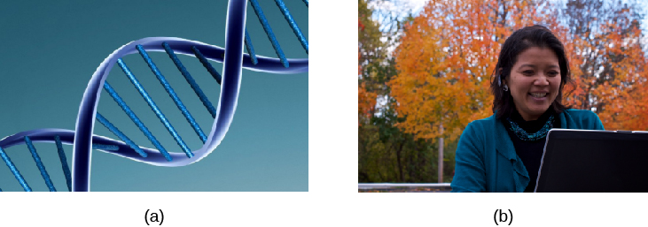
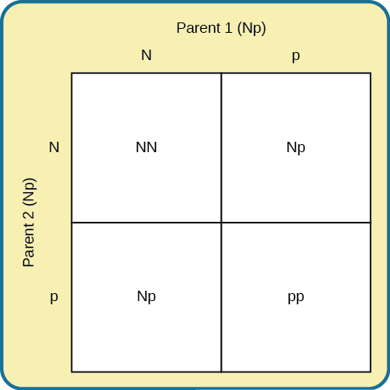
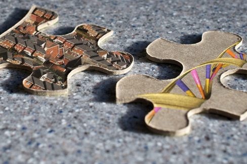

==============
Human Genetics
==============

.. contents::
   :depth: 3
..

.. container::

   By the end of this section, you will be able to: \* Explain the basic
   principles of the theory of evolution by natural selection \*
   Describe the differences between genotype and phenotype \* Discuss
   how gene-environment interactions are critical for expression of
   physical and psychological characteristics

Psychological researchers study genetics in order to better understand
the biological basis that contributes to certain behaviors. While all
humans share certain biological mechanisms, we are each unique. And
while our bodies have many of the same parts—brains and hormones and
cells with genetic codes—these are expressed in a wide variety of
behaviors, thoughts, and reactions.

Why do two people infected by the same disease have different outcomes:
one surviving and one succumbing to the ailment? How are genetic
diseases passed through family lines? Are there genetic components to
psychological disorders, such as depression or schizophrenia? To what
extent might there be a psychological basis to health conditions such as
childhood obesity?

To explore these questions, let’s start by focusing on a specific
disease, **sickle-cell anemia**\ {: data-type=“term” .no-emphasis}, and
how it might affect two infected sisters. Sickle-cell anemia is a
genetic condition in which red blood cells, which are normally round,
take on a crescent-like shape
(`[link] <#CNX_Psych_03_01_SickleCell>`__). The changed shape of these
cells affects how they function: sickle-shaped cells can clog blood
vessels and block blood flow, leading to high fever, severe pain,
swelling, and tissue damage.

|An illustration shows round and sickle-shaped blood cells.|\ {:
#CNX_Psych_03_01_SickleCell}

Many people with sickle-cell anemia—and the particular genetic mutation
that causes it—die at an early age. While the notion of “survival of the
fittest” may suggest that people suffering from this disease have a low
survival rate and therefore the disease will become less common, this is
not the case. Despite the negative evolutionary effects associated with
this genetic mutation, the sickle-cell gene remains relatively common
among people of African descent. Why is this? The explanation is
illustrated with the following scenario.

Imagine two young women—Luwi and Sena—sisters in rural Zambia, Africa.
Luwi carries the gene for sickle-cell anemia; Sena does not carry the
gene. Sickle-cell carriers have one copy of the sickle-cell gene but do
not have full-blown sickle-cell anemia. They experience symptoms only if
they are severely dehydrated or are deprived of oxygen (as in mountain
climbing). Carriers are thought to be immune from malaria (an often
deadly disease that is widespread in tropical climates) because changes
in their blood chemistry and immune functioning prevent the malaria
parasite from having its effects (Gong, Parikh, Rosenthal, & Greenhouse,
2013). However, full-blown sickle-cell anemia, with two copies of the
sickle-cell gene, does not provide immunity to malaria.

While walking home from school, both sisters are bitten by mosquitos
carrying the malaria parasite. Luwi does not get malaria because she
carries the sickle-cell mutation. Sena, on the other hand, develops
malaria and dies just two weeks later. Luwi survives and eventually has
children, to whom she may pass on the sickle-cell mutation.

.. container:: psychology link-to-learning

   Visit this `website <http://openstax.org/l/sickle1>`__ to learn more
   about how a mutation in DNA leads to sickle-cell anemia.

Malaria is rare in the United States, so the sickle-cell gene benefits
nobody: the gene manifests primarily in health problems—minor in
carriers, severe in the full-blown disease—with no health benefits for
carriers. However, the situation is quite different in other parts of
the world. In parts of Africa where malaria is prevalent, having the
sickle-cell mutation does provide health benefits for carriers
(protection from malaria).

This is precisely the situation that Charles **Darwin**\ {:
data-type=“term” .no-emphasis} describes in the **theory of evolution by
natural selection**\ {: data-type=“term”}
(`[link] <#CNX_Psych_03_01_Darwin>`__). In simple terms, the theory
states that organisms that are better suited for their environment will
survive and reproduce, while those that are poorly suited for their
environment will die off. In our example, we can see that as a carrier,
Luwi’s mutation is highly adaptive in her African homeland; however, if
she resided in the United States (where malaria is much less common),
her mutation could prove costly—with a high probability of the disease
in her descendants and minor health problems of her own.

|Image (a) is a painted portrait of Darwin. Image (b) is a sketch of
lines that split apart into branched structures.|\ {:
#CNX_Psych_03_01_Darwin}

.. container:: psychology dig-deeper

   .. container::

      Two Perspectives on Genetics and Behavior

   It’s easy to get confused about two fields that study the interaction
   of genes and the environment, such as the fields of **evolutionary
   psychology**\ {: data-type=“term” .no-emphasis} and **behavioral
   genetics**\ {: data-type=“term” .no-emphasis}. How can we tell them
   apart?

   In both fields, it is understood that genes not only code for
   particular traits, but also contribute to certain patterns of
   cognition and behavior. Evolutionary psychology focuses on how
   universal patterns of behavior and cognitive processes have evolved
   over time. Therefore, variations in cognition and behavior would make
   individuals more or less successful in reproducing and passing those
   genes to their offspring. Evolutionary psychologists study a variety
   of psychological phenomena that may have evolved as adaptations,
   including fear response, food preferences, mate selection, and
   cooperative behaviors (Confer et al., 2010).

   Whereas evolutionary psychologists focus on universal patterns that
   evolved over millions of years, behavioral geneticists study how
   individual differences arise, in the present, through the interaction
   of genes and the environment. When studying human behavior,
   behavioral geneticists often employ twin and adoption studies to
   research questions of interest. Twin studies compare the rates that a
   given behavioral trait is shared among identical and fraternal twins;
   adoption studies compare those rates among biologically related
   relatives and adopted relatives. Both approaches provide some insight
   into the relative importance of genes and environment for the
   expression of a given trait.

.. container:: psychology link-to-learning

   Watch this
   `interview <https://www.youtube.com/watch?v=xbRCFuet0Nk>`__ with
   renowned **evolutionary psychologist**\ {: data-type=“term”
   .no-emphasis} David Buss for an explanation of how a psychologist
   approaches evolution and how this approach fits within the field of
   social science.

Genetic Variation
=================

Genetic variation, the genetic difference between individuals, is what
contributes to a species’ adaptation to its environment. In humans,
genetic variation begins with an egg, about 100 million sperm, and
fertilization. Fertile women ovulate roughly once per month, releasing
an egg from follicles in the ovary. During the egg's journey from the
ovary through the fallopian tubes, to the uterus, a sperm may fertilize
an egg.

The egg and the sperm each contain 23 chromosomes. **Chromosomes**\ {:
data-type=“term”} are long strings of genetic material known as
**deoxyribonucleic acid (DNA)**\ {: data-type=“term”}. DNA is a
helix-shaped molecule made up of nucleotide base pairs. In each
chromosome, sequences of DNA make up **genes**\ {: data-type=“term”}
that control or partially control a number of visible characteristics,
known as traits, such as eye color, hair color, and so on. A single gene
may have multiple possible variations, or alleles. An **allele**\ {:
data-type=“term”} is a specific version of a gene. So, a given gene may
code for the trait of hair color, and the different alleles of that gene
affect which hair color an individual has.

When a sperm and egg fuse, their 23 chromosomes pair up and create a
zygote with 23 pairs of chromosomes. Therefore, each parent contributes
half the genetic information carried by the offspring; the resulting
physical characteristics of the offspring (called the phenotype) are
determined by the interaction of genetic material supplied by the
parents (called the genotype). A person’s **genotype**\ {:
data-type=“term”} is the genetic makeup of that individual.
**Phenotype**\ {: data-type=“term”}, on the other hand, refers to the
individual’s inherited physical characteristics, which are a combination
of genetic and environmental influences
(`[link] <#CNX_Psych_03_01_GenoPheno>`__).

|Image (a) shows the helical structure of DNA. Image (b) shows a
person’s face.|\ {: #CNX_Psych_03_01_GenoPheno}

Most traits are controlled by multiple genes, but some traits are
controlled by one gene. A characteristic like **cleft chin**\ {:
data-type=“term” .no-emphasis}, for example, is influenced by a single
gene from each parent. In this example, we will call the gene for cleft
chin “B,” and the gene for smooth chin “b.” Cleft chin is a dominant
trait, which means that having the **dominant allele**\ {:
data-type=“term”} either from one parent (Bb) or both parents (BB) will
always result in the phenotype associated with the dominant allele. When
someone has two copies of the same allele, they are said to be
**homozygous**\ {: data-type=“term”} for that allele. When someone has a
combination of alleles for a given gene, they are said to be
**heterozygous**\ {: data-type=“term”}. For example, smooth chin is a
recessive trait, which means that an individual will only display the
smooth chin phenotype if they are homozygous for that **recessive
allele**\ {: data-type=“term”} (bb).

Imagine that a woman with a cleft chin mates with a man with a smooth
chin. What type of chin will their child have? The answer to that
depends on which alleles each parent carries. If the woman is homozygous
for cleft chin (BB), her offspring will always have cleft chin. It gets
a little more complicated, however, if the mother is heterozygous for
this gene (Bb). Since the father has a smooth chin—therefore homozygous
for the recessive allele (bb)—we can expect the offspring to have a 50%
chance of having a cleft chin and a 50% chance of having a smooth chin
(`[link] <#CNX_Psych_03_01_Punnett1>`__).

|Image (a) is a Punnett square showing the four possible combinations
(Bb, bb, Bb, bb) resulting from the pairing of a bb father and a Bb
mother. Image (b) is a close-up photograph showing a cleft chin.|\ {:
#CNX_Psych_03_01_Punnett1}

Sickle-cell anemia is just one of many genetic disorders caused by the
pairing of two recessive genes. For example, **phenylketonuria**\ {:
data-type=“term” .no-emphasis} (PKU) is a condition in which individuals
lack an enzyme that normally converts harmful amino acids into harmless
byproducts. If someone with this condition goes untreated, he or she
will experience significant deficits in cognitive function, seizures,
and increased risk of various psychiatric disorders. Because PKU is a
recessive trait, each parent must have at least one copy of the
recessive allele in order to produce a child with the condition
(`[link] <#CNX_Psych_03_01_Punnett2>`__).

So far, we have discussed traits that involve just one gene, but few
human characteristics are controlled by a single gene. Most traits are
**polygenic**\ {: data-type=“term”}: controlled by more than one gene.
Height is one example of a polygenic trait, as are skin color and
weight.

|A Punnett square shows the four possible combinations (NN, Np, Np, pp)
resulting from the pairing of two Np parents.|\ {:
#CNX_Psych_03_01_Punnett2}

Where do harmful genes that contribute to diseases like PKU come from?
Gene mutations provide one source of harmful genes. A **mutation**\ {:
data-type=“term”} is a sudden, permanent change in a gene. While many
mutations can be harmful or lethal, once in a while, a mutation benefits
an individual by giving that person an advantage over those who do not
have the mutation. Recall that the theory of evolution asserts that
individuals best adapted to their particular environments are more
likely to reproduce and pass on their genes to future generations. In
order for this process to occur, there must be competition—more
technically, there must be variability in genes (and resultant traits)
that allow for variation in adaptability to the environment. If a
population consisted of identical individuals, then any dramatic changes
in the environment would affect everyone in the same way, and there
would be no variation in selection. In contrast, diversity in genes and
associated traits allows some individuals to perform slightly better
than others when faced with environmental change. This creates a
distinct advantage for individuals best suited for their environments in
terms of successful reproduction and genetic transmission.

Gene-Environment Interactions
=============================

Genes do not exist in a vacuum. Although we are all biological
organisms, we also exist in an environment that is incredibly important
in determining not only when and how our genes express themselves, but
also in what combination. Each of us represents a unique interaction
between our genetic makeup and our environment; range of reaction is one
way to describe this interaction. **Range of reaction**\ {:
data-type=“term”} asserts that our genes set the boundaries within which
we can operate, and our environment interacts with the genes to
determine where in that range we will fall. For example, if an
individual’s genetic makeup predisposes her to high levels of
intellectual potential and she is reared in a rich, stimulating
environment, then she will be more likely to achieve her full potential
than if she were raised under conditions of significant deprivation.
According to the concept of range of reaction, genes set definite limits
on potential, and environment determines how much of that potential is
achieved. Some disagree with this theory and argue that genes do not set
a limit on a person’s potential.

Another perspective on the interaction between genes and the environment
is the concept of **genetic environmental correlation**\ {:
data-type=“term”}. Stated simply, our genes influence our environment,
and our environment influences the expression of our genes
(`[link] <#CNX_Psych_03_01_GeneEnviro>`__). Not only do our genes and
environment interact, as in range of reaction, but they also influence
one another bidirectionally. For example, the child of an NBA player
would probably be exposed to basketball from an early age. Such exposure
might allow the child to realize his or her full genetic, athletic
potential. Thus, the parents’ genes, which the child shares, influence
the child’s environment, and that environment, in turn, is well suited
to support the child’s genetic potential.

|Two jigsaw puzzle pieces are shown; one depicts images of houses, and
the other depicts a helical DNA strand.|\ {:
#CNX_Psych_03_01_GeneEnviro}

In another approach to gene-environment interactions, the field of
**epigenetics**\ {: data-type=“term”} looks beyond the genotype itself
and studies how the same genotype can be expressed in different ways. In
other words, researchers study how the same genotype can lead to very
different phenotypes. As mentioned earlier, gene expression is often
influenced by environmental context in ways that are not entirely
obvious. For instance, identical twins share the same genetic
information (**identical twins**\ {: data-type=“term”} develop from a
single fertilized egg that split, so the genetic material is exactly the
same in each; in contrast, **fraternal twins**\ {: data-type=“term”}
develop from two different eggs fertilized by different sperm, so the
genetic material varies as with non-twin siblings). But even with
identical genes, there remains an incredible amount of variability in
how gene expression can unfold over the course of each twin’s life.
Sometimes, one twin will develop a disease and the other will not. In
one example, Tiffany, an identical twin, died from cancer at age 7, but
her twin, now 19 years old, has never had cancer. Although these
individuals share an identical genotype, their phenotypes differ as a
result of how that genetic information is expressed over time. The
epigenetic perspective is very different from range of reaction, because
here the genotype is not fixed and limited.

.. container:: psychology link-to-learning

   Visit this `site <http://openstax.org/l/twinstudy>`__ for an engaging
   video primer on the **epigenetics**\ {: data-type=“term”
   .no-emphasis} of twin studies.

**Genes**\ {: data-type=“term” .no-emphasis} affect more than our
physical characteristics. Indeed, scientists have found genetic linkages
to a number of behavioral characteristics, ranging from basic
personality traits to sexual orientation to spirituality (for examples,
see Mustanski et al., 2005; Comings, Gonzales, Saucier, Johnson, &
MacMurray, 2000). Genes are also associated with temperament and a
number of psychological disorders, such as depression and schizophrenia.
So while it is true that genes provide the biological blueprints for our
cells, tissues, organs, and body, they also have significant impact on
our experiences and our behaviors.

Let’s look at the following findings regarding schizophrenia in light of
our three views of gene-environment interactions. Which view do you
think best explains this evidence?

In a study of people who were given up for adoption, adoptees whose
biological mothers had schizophrenia *and* who had been raised in a
disturbed family environment were much more likely to develop
**schizophrenia**\ {: data-type=“term” .no-emphasis} or another
psychotic disorder than were any of the other groups in the study:

-  Of adoptees whose biological mothers had schizophrenia (high genetic
   risk) and who were raised in disturbed family environments, 36.8%
   were likely to develop schizophrenia.
-  Of adoptees whose biological mothers had schizophrenia (high genetic
   risk) and who were raised in healthy family environments, 5.8% were
   likely to develop schizophrenia.
-  Of adoptees with a low genetic risk (whose mothers did not have
   schizophrenia) and who were raised in disturbed family environments,
   5.3% were likely to develop schizophrenia.
-  Of adoptees with a low genetic risk (whose mothers did not have
   schizophrenia) and who were raised in healthy family environments,
   4.8% were likely to develop schizophrenia (Tienari et al., 2004).

The study shows that adoptees with high genetic risk were especially
likely to develop schizophrenia only if they were raised in disturbed
home environments. This research lends credibility to the notion that
both genetic vulnerability and environmental stress are necessary for
schizophrenia to develop, and that genes alone do not tell the full
tale.

Summary
=======

Genes are sequences of DNA that code for a particular trait. Different
versions of a gene are called alleles—sometimes alleles can be
classified as dominant or recessive. A dominant allele always results in
the dominant phenotype. In order to exhibit a recessive phenotype, an
individual must be homozygous for the recessive allele. Genes affect
both physical and psychological characteristics. Ultimately, how and
when a gene is expressed, and what the outcome will be—in terms of both
physical and psychological characteristics—is a function of the
interaction between our genes and our environments.

Review Questions
================

.. container::

   .. container::

      A(n) \_______\_ is a sudden, permanent change in a sequence of
      DNA.

      1. allele
      2. chromosome
      3. epigenetic
      4. mutation {: type=“a”}

   .. container::

      D

.. container::

   .. container::

      \_______\_ refers to a person’s genetic makeup, while \_______\_
      refers to a person’s physical characteristics.

      1. Phenotype; genotype
      2. Genotype; phenotype
      3. DNA; gene
      4. Gene; DNA {: type=“a”}

   .. container::

      B

.. container::

   .. container::

      \_______\_ is the field of study that focuses on genes and their
      expression.

      1. Social psychology
      2. Evolutionary psychology
      3. Epigenetics
      4. Behavioral neuroscience {: type=“a”}

   .. container::

      C

.. container::

   .. container::

      Humans have \_______\_ pairs of chromosomes.

      1. 15
      2. 23
      3. 46
      4. 78 {: type=“a”}

   .. container::

      B

Critical Thinking Questions
===========================

.. container::

   .. container::

      The theory of evolution by natural selection requires variability
      of a given trait. Why is variability necessary and where does it
      come from?

   .. container::

      Variability is essential for natural selection to work. If all
      individuals are the same on a given trait, there will be no
      relative difference in their reproductive success because everyone
      will be equally adapted to their environments on that trait.
      Mutations are one source of variability, but sexual reproduction
      is another important source of variation given that individuals
      inherit half of their genetic makeup from each of their parents.

Personal Application Questions
==============================

.. container::

   .. container::

      You share half of your genetic makeup with each of your parents,
      but you are no doubt very different from both of them. Spend a few
      minutes jotting down the similarities and differences between you
      and your parents. How do you think your unique environment and
      experiences have contributed to some of the differences you see?

.. container::

   .. rubric:: Glossary
      :name: glossary

   {: data-type=“glossary-title”}

   allele
      specific version of a gene ^
   chromosome
      long strand of genetic information ^
   deoxyribonucleic acid (DNA)
      helix-shaped molecule made of nucleotide base pairs ^
   dominant allele
      allele whose phenotype will be expressed in an individual that
      possesses that allele ^
   epigenetics
      study of gene-environment interactions, such as how the same
      genotype leads to different phenotypes ^
   fraternal twins
      twins who develop from two different eggs fertilized by different
      sperm, so their genetic material varies the same as in non-twin
      siblings ^
   gene
      sequence of DNA that controls or partially controls physical
      characteristics ^
   genetic environmental correlation
      view of gene-environment interaction that asserts our genes affect
      our environment, and our environment influences the expression of
      our genes ^
   genotype
      genetic makeup of an individual ^
   heterozygous
      consisting of two different alleles ^
   homozygous
      consisting of two identical alleles ^
   identical twins
      twins that develop from the same sperm and egg ^
   mutation
      sudden, permanent change in a gene ^
   phenotype
      individual’s inheritable physical characteristics ^
   polygenic
      multiple genes affecting a given trait ^
   range of reaction
      asserts our genes set the boundaries within which we can operate,
      and our environment interacts with the genes to determine where in
      that range we will fall ^
   recessive allele
      allele whose phenotype will be expressed only if an individual is
      homozygous for that allele ^
   theory of evolution by natural selection
      states that organisms that are better suited for their
      environments will survive and reproduce compared to those that are
      poorly suited for their environments

.. |Image (a) is a Punnett square showing the four possible combinations (Bb, bb, Bb, bb) resulting from the pairing of a bb father and a Bb mother. Image (b) is a close-up photograph showing a cleft chin.| image:: ../resources/CNX_Psych_03_01_Punnett1n.jpg

