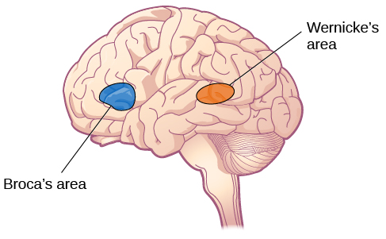
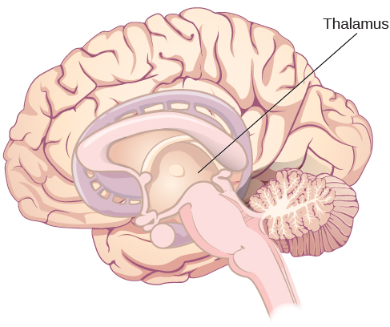
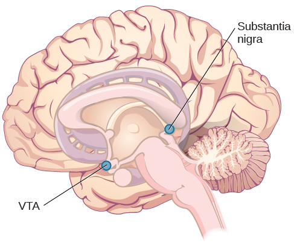
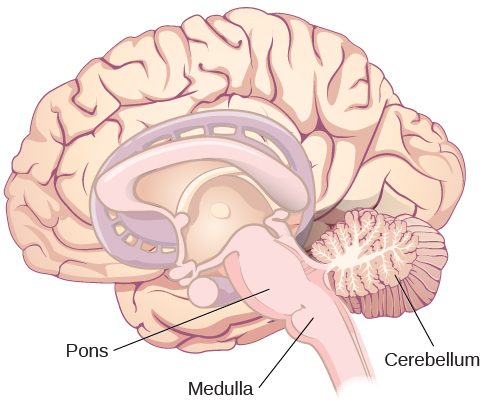
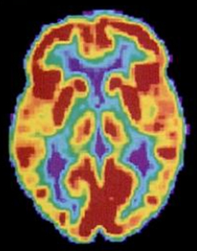
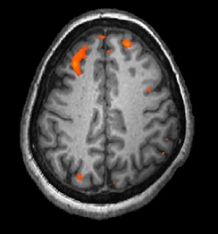

=========================
The Brain and Spinal Cord
=========================

.. contents::
   :depth: 3
..

.. container::

   By the end of this section, you will be able to: \* Explain the
   functions of the spinal cord \* Identify the hemispheres and lobes of
   the brain \* Describe the types of techniques available to clinicians
   and researchers to image or scan the brain

The brain is a remarkably complex organ comprised of billions of
interconnected neurons and glia. It is a bilateral, or two-sided,
structure that can be separated into distinct lobes. Each lobe is
associated with certain types of functions, but, ultimately, all of the
areas of the brain interact with one another to provide the foundation
for our thoughts and behaviors. In this section, we discuss the overall
organization of the brain and the functions associated with different
brain areas, beginning with what can be seen as an extension of the
brain, the spinal cord.

The Spinal Cord
===============

It can be said that the **spinal cord**\ {: data-type=“term”
.no-emphasis} is what connects the brain to the outside world. Because
of it, the brain can act. The spinal cord is like a relay station, but a
very smart one. It not only routes messages to and from the brain, but
it also has its own system of automatic processes, called reflexes.

The top of the spinal cord merges with the brain stem, where the basic
processes of life are controlled, such as breathing and digestion. In
the opposite direction, the spinal cord ends just below the
ribs—contrary to what we might expect, it does not extend all the way to
the base of the spine.

The spinal cord is functionally organized in 30 segments, corresponding
with the vertebrae. Each segment is connected to a specific part of the
body through the peripheral nervous system. Nerves branch out from the
spine at each vertebra. Sensory nerves bring messages in; motor nerves
send messages out to the muscles and organs. Messages travel to and from
the brain through every segment.

Some sensory messages are immediately acted on by the spinal cord,
without any input from the brain. Withdrawal from heat and knee jerk are
two examples. When a sensory message meets certain parameters, the
spinal cord initiates an automatic reflex. The signal passes from the
sensory nerve to a simple processing center, which initiates a motor
command. Seconds are saved, because messages don’t have to go the brain,
be processed, and get sent back. In matters of survival, the spinal
reflexes allow the body to react extraordinarily fast.

The spinal cord is protected by bony vertebrae and cushioned in
cerebrospinal fluid, but injuries still occur. When the spinal cord is
damaged in a particular segment, all lower segments are cut off from the
brain, causing paralysis. Therefore, the lower on the spine damage is,
the fewer functions an injured individual loses.

The Two Hemispheres
===================

The surface of the brain, known as the **cerebral cortex**\ {:
data-type=“term”}, is very uneven, characterized by a distinctive
pattern of folds or bumps, known as **gyri**\ {: data-type=“term”}
(singular: gyrus), and grooves, known as **sulci**\ {: data-type=“term”}
(singular: sulcus), shown in `[link] <#CNX_Psych_03_04_Cortex>`__. These
gyri and sulci form important landmarks that allow us to separate the
brain into functional centers. The most prominent sulcus, known as the
**longitudinal fissure**\ {: data-type=“term”}, is the deep groove that
separates the brain into two halves or **hemispheres**\ {:
data-type=“term”}: the left hemisphere and the right hemisphere.

|An illustration of the brain’s exterior surface shows the ridges and
depressions, and the deep fissure that runs through the center.|\ {:
#CNX_Psych_03_04_Cortex}

There is evidence of some specialization of function—referred to as
**lateralization**\ {: data-type=“term”}—in each hemisphere, mainly
regarding differences in language ability. Beyond that, however, the
differences that have been found have been minor. What we do know is
that the left hemisphere controls the right half of the body, and the
right hemisphere controls the left half of the body.

The two hemispheres are connected by a thick band of neural fibers known
as the **corpus callosum**\ {: data-type=“term”}, consisting of about
200 million axons. The corpus callosum allows the two hemispheres to
communicate with each other and allows for information being processed
on one side of the brain to be shared with the other side.

Normally, we are not aware of the different roles that our two
hemispheres play in day-to-day functions, but there are people who come
to know the capabilities and functions of their two hemispheres quite
well. In some cases of severe epilepsy, doctors elect to sever the
corpus callosum as a means of controlling the spread of seizures
(`[link] <#CNX_Psych_03_04_CorpusCall>`__). While this is an effective
treatment option, it results in individuals who have split brains. After
surgery, these split-brain patients show a variety of interesting
behaviors. For instance, a split-brain patient is unable to name a
picture that is shown in the patient’s left visual field because the
information is only available in the largely nonverbal right hemisphere.
However, they are able to recreate the picture with their left hand,
which is also controlled by the right hemisphere. When the more verbal
left hemisphere sees the picture that the hand drew, the patient is able
to name it (assuming the left hemisphere can interpret what was drawn by
the left hand).

|Illustrations (a) and (b) show the corpus callosum’s location in the
brain in front and side views. Photograph (c) shows the corpus callosum
in a dissected brain.|\ {: #CNX_Psych_03_04_CorpusCall}

.. container:: psychology link-to-learning

   This `interactive animation <http://openstax.org/l/nobelanimation>`__
   on the Nobel Prize website walks users through the hemispheres of the
   brain.

Much of what we know about the functions of different areas of the brain
comes from studying changes in the behavior and ability of individuals
who have suffered damage to the brain. For example, researchers study
the behavioral changes caused by strokes to learn about the functions of
specific brain areas. A stroke, caused by an interruption of blood flow
to a region in the brain, causes a loss of brain function in the
affected region. The damage can be in a small area, and, if it is, this
gives researchers the opportunity to link any resulting behavioral
changes to a specific area. The types of deficits displayed after a
stroke will be largely dependent on where in the brain the damage
occurred.

Consider Theona, an intelligent, self-sufficient woman, who is 62 years
old. Recently, she suffered a stroke in the front portion of her right
hemisphere. As a result, she has great difficulty moving her left leg.
(As you learned earlier, the right hemisphere controls the left side of
the body; also, the brain’s main motor centers are located at the front
of the head, in the frontal lobe.) Theona has also experienced
behavioral changes. For example, while in the produce section of the
grocery store, she sometimes eats grapes, strawberries, and apples
directly from their bins before paying for them. This behavior—which
would have been very embarrassing to her before the stroke—is consistent
with damage in another region in the frontal lobe—the prefrontal cortex,
which is associated with judgment, reasoning, and impulse control.

Forebrain Structures
====================

The two hemispheres of the cerebral cortex are part of the
**forebrain**\ {: data-type=“term”}
(`[link] <#CNX_Psych_03_04_FMHBrain>`__), which is the largest part of
the brain. The forebrain contains the cerebral cortex and a number of
other structures that lie beneath the cortex (called subcortical
structures): thalamus, hypothalamus, pituitary gland, and the limbic
system (collection of structures). The cerebral cortex, which is the
outer surface of the brain, is associated with higher level processes
such as consciousness, thought, emotion, reasoning, language, and
memory. Each cerebral hemisphere can be subdivided into four lobes, each
associated with different functions.

|An illustration shows the position and size of the forebrain (the
largest portion), midbrain (a small central portion), and hindbrain (a
portion in the lower back part of the brain).|\ {:
#CNX_Psych_03_04_FMHBrain}

Lobes of the Brain
------------------

The four lobes of the brain are the frontal, parietal, temporal, and
occipital lobes (`[link] <#CNX_Psych_03_04_Lobes>`__). The **frontal
lobe**\ {: data-type=“term”} is located in the forward part of the
brain, extending back to a fissure known as the central sulcus. The
frontal lobe is involved in reasoning, motor control, emotion, and
language. It contains the **motor cortex**\ {: data-type=“term”}, which
is involved in planning and coordinating movement; the **prefrontal
cortex**\ {: data-type=“term”}, which is responsible for higher-level
cognitive functioning; and **Broca’s area**\ {: data-type=“term”}, which
is essential for language production.

|An illustration shows the four lobes of the brain.|\ {:
#CNX_Psych_03_04_Lobes}

People who suffer damage to Broca’s area have great difficulty producing
language of any form (`[link] <#CNX_Psych_03_04_Lobes>`__). For example,
Padma was an electrical engineer who was socially active and a caring,
involved mother. About twenty years ago, she was in a car accident and
suffered damage to her Broca’s area. She completely lost the ability to
speak and form any kind of meaningful language. There is nothing wrong
with her mouth or her vocal cords, but she is unable to produce words.
She can follow directions but can’t respond verbally, and she can read
but no longer write. She can do routine tasks like running to the market
to buy milk, but she could not communicate verbally if a situation
called for it.

Probably the most famous case of frontal lobe damage is that of a man by
the name of Phineas **Gage**\ {: data-type=“term” .no-emphasis}. On
September 13, 1848, Gage (age 25) was working as a railroad foreman in
Vermont. He and his crew were using an iron rod to tamp explosives down
into a blasting hole to remove rock along the railway’s path.
Unfortunately, the iron rod created a spark and caused the rod to
explode out of the blasting hole, into Gage’s face, and through his
skull (`[link] <#CNX_Psych_03_04_GageSkull>`__). Although lying in a
pool of his own blood with brain matter emerging from his head, Gage was
conscious and able to get up, walk, and speak. But in the months
following his accident, people noticed that his personality had changed.
Many of his friends described him as no longer being himself. Before the
accident, it was said that Gage was a well-mannered, soft-spoken man,
but he began to behave in odd and inappropriate ways after the accident.
Such changes in personality would be consistent with loss of impulse
control—a frontal lobe function.

Beyond the damage to the frontal lobe itself, subsequent investigations
into the rod's path also identified probable damage to pathways between
the frontal lobe and other brain structures, including the limbic
system. With connections between the planning functions of the frontal
lobe and the emotional processes of the limbic system severed, Gage had
difficulty controlling his emotional impulses.

However, there is some evidence suggesting that the dramatic changes in
Gage’s personality were exaggerated and embellished. Gage's case
occurred in the midst of a 19th century debate over
localization—regarding whether certain areas of the brain are associated
with particular functions. On the basis of extremely limited information
about Gage, the extent of his injury, and his life before and after the
accident, scientists tended to find support for their own views, on
whichever side of the debate they fell (Macmillan, 1999).

|Image (a) is a photograph of Phineas Gage holding a metal rod. Image
(b) is an illustration of a skull with a metal rod passing through it
from the cheek area to the top of the skull.|\ {:
#CNX_Psych_03_04_GageSkull}

The brain’s **parietal lobe**\ {: data-type=“term”} is located
immediately behind the frontal lobe, and is involved in processing
information from the body’s senses. It contains the **somatosensory
cortex**\ {: data-type=“term”}, which is essential for processing
sensory information from across the body, such as touch, temperature,
and pain. The somatosensory cortex is organized topographically, which
means that spatial relationships that exist in the body are maintained
on the surface of the somatosensory cortex
(`[link] <#CNX_Psych_03_04_BrainOrg>`__). For example, the portion of
the cortex that processes sensory information from the hand is adjacent
to the portion that processes information from the wrist.

|A diagram shows the organization in the somatosensory cortex, with
functions for these parts in this proximal sequential order: toes,
ankles, knees, hips, trunk, shoulders, elbows, wrists, hands, fingers,
thumbs, neck, eyebrows and eyelids, eyeballs, face, lips, jaw, tongue,
salivation, chewing, and swallowing.|\ {: #CNX_Psych_03_04_BrainOrg}

The **temporal lobe**\ {: data-type=“term”} is located on the side of
the head (temporal means “near the temples”), and is associated with
hearing, memory, emotion, and some aspects of language. The **auditory
cortex**\ {: data-type=“term”}, the main area responsible for processing
auditory information, is located within the temporal lobe. **Wernicke’s
area**\ {: data-type=“term”}, important for speech comprehension, is
also located here. Whereas individuals with damage to Broca’s area have
difficulty producing language, those with damage to Wernicke’s area can
produce sensible language, but they are unable to understand it
(`[link] <#CNX_Psych_03_04_Broca>`__).

|An illustration shows the locations of Broca’s and Wernicke’s
areas.|\ {: #CNX_Psych_03_04_Broca}

The **occipital lobe**\ {: data-type=“term”} is located at the very back
of the brain, and contains the primary visual cortex, which is
responsible for interpreting incoming visual information. The occipital
cortex is organized retinotopically, which means there is a close
relationship between the position of an object in a person’s visual
field and the position of that object’s representation on the cortex.
You will learn much more about how visual information is processed in
the occipital lobe when you study sensation and perception.

Other Areas of the Forebrain
----------------------------

Other areas of the **forebrain**\ {: data-type=“term” .no-emphasis},
located beneath the cerebral cortex, include the thalamus and the limbic
system. The **thalamus**\ {: data-type=“term”} is a sensory relay for
the brain. All of our senses, with the exception of smell, are routed
through the thalamus before being directed to other areas of the brain
for processing (`[link] <#CNX_Psych_03_04_Thalamus>`__).

|An illustration shows the location of the thalamus in the brain.|\ {:
#CNX_Psych_03_04_Thalamus}

The **limbic system**\ {: data-type=“term”} is involved in processing
both emotion and memory. Interestingly, the sense of smell projects
directly to the limbic system; therefore, not surprisingly, smell can
evoke emotional responses in ways that other sensory modalities cannot.
The limbic system is made up of a number of different structures, but
three of the most important are the hippocampus, the amygdala, and the
hypothalamus (`[link] <#CNX_Psych_03_04_Limbic>`__). The
**hippocampus**\ {: data-type=“term”} is an essential structure for
learning and memory. The **amygdala**\ {: data-type=“term”} is involved
in our experience of emotion and in tying emotional meaning to our
memories. The **hypothalamus**\ {: data-type=“term”} regulates a number
of homeostatic processes, including the regulation of body temperature,
appetite, and blood pressure. The hypothalamus also serves as an
interface between the nervous system and the endocrine system and in the
regulation of sexual motivation and behavior.

|An illustration shows the locations of parts of the brain involved in
the limbic system: the hypothalamus, amygdala, and hippocampus.|\ {:
#CNX_Psych_03_04_Limbic}

The Case of Henry Molaison (H.M.)
---------------------------------

In 1953, Henry Gustav **Molaison**\ {: data-type=“term” .no-emphasis}
(H. M.) was a 27-year-old man who experienced severe seizures. In an
attempt to control his seizures, H. M. underwent brain surgery to remove
his hippocampus and amygdala. Following the surgery, H.M’s seizures
became much less severe, but he also suffered some unexpected—and
devastating—consequences of the surgery: he lost his ability to form
many types of new memories. For example, he was unable to learn new
facts, such as who was president of the United States. He was able to
learn new skills, but afterward he had no recollection of learning them.
For example, while he might learn to use a computer, he would have no
conscious memory of ever having used one. He could not remember new
faces, and he was unable to remember events, even immediately after they
occurred. Researchers were fascinated by his experience, and he is
considered one of the most studied cases in medical and psychological
history (Hardt, Einarsson, & Nader, 2010; Squire, 2009). Indeed, his
case has provided tremendous insight into the role that the hippocampus
plays in the consolidation of new learning into explicit memory.

.. container:: psychology link-to-learning

   Clive Wearing, an accomplished musician, lost the ability to form new
   memories when his hippocampus was damaged through illness. Check out
   the first few minutes of this `documentary
   video <http://openstax.org/l/wearing>`__ for an introduction to this
   man and his condition.

Midbrain and Hindbrain Structures
=================================

The **midbrain**\ {: data-type=“term”} is comprised of structures
located deep within the brain, between the forebrain and the hindbrain.
The **reticular formation**\ {: data-type=“term”} is centered in the
midbrain, but it actually extends up into the forebrain and down into
the hindbrain. The reticular formation is important in regulating the
sleep/wake cycle, arousal, alertness, and motor activity.

The **substantia nigra**\ {: data-type=“term”} (Latin for “black
substance”) and the **ventral tegmental area (VTA)**\ {:
data-type=“term”} are also located in the midbrain
(`[link] <#CNX_Psych_03_04_Midbrain>`__). Both regions contain cell
bodies that produce the neurotransmitter dopamine, and both are critical
for movement. Degeneration of the substantia nigra and VTA is involved
in Parkinson’s disease. In addition, these structures are involved in
mood, reward, and addiction (Berridge & Robinson, 1998; Gardner, 2011;
George, Le Moal, & Koob, 2012).

|An illustration shows the location of the substantia negra and VTA in
the brain.|\ {: #CNX_Psych_03_04_Midbrain}

The **hindbrain**\ {: data-type=“term”} is located at the back of the
head and looks like an extension of the spinal cord. It contains the
medulla, pons, and cerebellum (`[link] <#CNX_Psych_03_04_Hindbrain>`__).
The **medulla**\ {: data-type=“term”} controls the automatic processes
of the autonomic nervous system, such as breathing, blood pressure, and
heart rate. The word pons literally means “bridge,” and as the name
suggests, the **pons**\ {: data-type=“term”} serves to connect the brain
and spinal cord. It also is involved in regulating brain activity during
sleep. The medulla, pons, and midbrain together are known as the
brainstem.

|An illustration shows the location of the pons, medulla, and
cerebellum.|\ {: #CNX_Psych_03_04_Hindbrain}

The **cerebellum**\ {: data-type=“term”} (Latin for “little brain”)
receives messages from muscles, tendons, joints, and structures in our
ear to control balance, coordination, movement, and motor skills. The
cerebellum is also thought to be an important area for processing some
types of memories. In particular, procedural memory, or memory involved
in learning and remembering how to perform tasks, is thought to be
associated with the cerebellum. Recall that H. M. was unable to form new
explicit memories, but he could learn new tasks. This is likely due to
the fact that H. M.’s cerebellum remained intact.

.. container:: psychology what-do-you-think

   .. container::

      Brain Dead and on Life Support

   What would you do if your spouse or loved one was declared brain dead
   but his or her body was being kept alive by medical equipment? Whose
   decision should it be to remove a feeding tube? Should medical care
   costs be a factor?

   On February 25, 1990, a Florida woman named Terri **Schiavo**\ {:
   data-type=“term” .no-emphasis} went into cardiac arrest, apparently
   triggered by a bulimic episode. She was eventually revived, but her
   brain had been deprived of oxygen for a long time. Brain scans
   indicated that there was no activity in her cerebral cortex, and she
   suffered from severe and permanent cerebral atrophy. Basically,
   Schiavo was in a vegetative state. Medical professionals determined
   that she would never again be able to move, talk, or respond in any
   way. To remain alive, she required a feeding tube, and there was no
   chance that her situation would ever improve.

   On occasion, Schiavo’s eyes would move, and sometimes she would
   groan. Despite the doctors’ insistence to the contrary, her parents
   believed that these were signs that she was trying to communicate
   with them.

   After 12 years, Schiavo’s husband argued that his wife would not have
   wanted to be kept alive with no feelings, sensations, or brain
   activity. Her parents, however, were very much against removing her
   feeding tube. Eventually, the case made its way to the courts, both
   in the state of Florida and at the federal level. By 2005, the courts
   found in favor of Schiavo’s husband, and the feeding tube was removed
   on March 18, 2005. Schiavo died 13 days later.

   Why did Schiavo’s eyes sometimes move, and why did she groan?
   Although the parts of her brain that control thought, voluntary
   movement, and feeling were completely damaged, her brainstem was
   still intact. Her medulla and pons maintained her breathing and
   caused involuntary movements of her eyes and the occasional groans.
   Over the 15-year period that she was on a feeding tube, Schiavo’s
   medical costs may have topped $7 million (Arnst, 2003).

   These questions were brought to popular conscience 25 years ago in
   the case of Terri Schiavo, and they persist today. In 2013, a
   13-year-old girl who suffered complications after tonsil surgery was
   declared brain dead. There was a battle between her family, who
   wanted her to remain on life support, and the hospital’s policies
   regarding persons declared brain dead. In another complicated 2013–14
   case in Texas, a pregnant EMT professional declared brain dead was
   kept alive for weeks, despite her spouse’s directives, which were
   based on her wishes should this situation arise. In this case, state
   laws designed to protect an unborn fetus came into consideration
   until doctors determined the fetus unviable.

   Decisions surrounding the medical response to patients declared brain
   dead are complex. What do you think about these issues?

Brain Imaging
=============

You have learned how brain injury can provide information about the
functions of different parts of the brain. Increasingly, however, we are
able to obtain that information using **brain imaging**\ {:
data-type=“term” .no-emphasis} techniques on individuals who have not
suffered brain injury. In this section, we take a more in-depth look at
some of the techniques that are available for imaging the brain,
including techniques that rely on radiation, magnetic fields, or
electrical activity within the brain.

Techniques Involving Radiation
------------------------------

A **computerized tomography (CT) scan**\ {: data-type=“term”} involves
taking a number of x-rays of a particular section of a person’s body or
brain (`[link] <#CNX_Psych_03_04_CT>`__). The x-rays pass through
tissues of different densities at different rates, allowing a computer
to construct an overall image of the area of the body being scanned. A
CT scan is often used to determine whether someone has a tumor, or
significant brain atrophy.

|Image (a) shows a brain scan where the brain matter’s appearance is
fairly uniform. Image (b) shows a section of the brain that looks
different from the surrounding tissue and is labeled “tumor.”|\ {:
#CNX_Psych_03_04_CT}

**Positron emission tomography (PET)**\ {: data-type=“term”} scans
create pictures of the living, active brain
(`[link] <#CNX_Psych_03_04_PET>`__). An individual receiving a PET scan
drinks or is injected with a mildly radioactive substance, called a
tracer. Once in the bloodstream, the amount of tracer in any given
region of the brain can be monitored. As brain areas become more active,
more blood flows to that area. A computer monitors the movement of the
tracer and creates a rough map of active and inactive areas of the brain
during a given behavior. PET scans show little detail, are unable to
pinpoint events precisely in time, and require that the brain be exposed
to radiation; therefore, this technique has been replaced by the fMRI as
an alternative diagnostic tool. However, combined with CT, PET
technology is still being used in certain contexts. For example, CT/PET
scans allow better imaging of the activity of neurotransmitter receptors
and open new avenues in schizophrenia research. In this hybrid CT/PET
technology, CT contributes clear images of brain structures, while PET
shows the brain’s activity.

|A brain scan shows different parts of the brain in different
colors.|\ {: #CNX_Psych_03_04_PET}

Techniques Involving Magnetic Fields
------------------------------------

In **magnetic resonance imaging (MRI)**\ {: data-type=“term”}, a person
is placed inside a machine that generates a strong magnetic field. The
magnetic field causes the hydrogen atoms in the body’s cells to move.
When the magnetic field is turned off, the hydrogen atoms emit
electromagnetic signals as they return to their original positions.
Tissues of different densities give off different signals, which a
computer interprets and displays on a monitor. **Functional magnetic
resonance imaging (fMRI)**\ {: data-type=“term”} operates on the same
principles, but it shows changes in brain activity over time by tracking
blood flow and oxygen levels. The fMRI provides more detailed images of
the brain’s structure, as well as better accuracy in time, than is
possible in PET scans (`[link] <#CNX_Psych_03_04_fMRI>`__). With their
high level of detail, MRI and fMRI are often used to compare the brains
of healthy individuals to the brains of individuals diagnosed with
psychological disorders. This comparison helps determine what structural
and functional differences exist between these populations.

|A brain scan shows brain tissue in gray with some small areas
highlighted red.|\ {: #CNX_Psych_03_04_fMRI}

.. container:: psychology link-to-learning

   Visit this `virtual lab <http://openstax.org/l/mri>`__ to learn more
   about MRI and fMRI.

Techniques Involving Electrical Activity
----------------------------------------

In some situations, it is helpful to gain an understanding of the
overall activity of a person’s brain, without needing information on the
actual location of the activity. **Electroencephalography (EEG)**\ {:
data-type=“term”} serves this purpose by providing a measure of a
brain’s electrical activity. An array of electrodes is placed around a
person’s head (`[link] <#CNX_Psych_03_04_EEG>`__). The signals received
by the electrodes result in a printout of the electrical activity of his
or her brain, or brainwaves, showing both the frequency (number of waves
per second) and amplitude (height) of the recorded brainwaves, with an
accuracy within milliseconds. Such information is especially helpful to
researchers studying sleep patterns among individuals with sleep
disorders.

|A photograph depicts a person looking at a computer screen and using
the keyboard and mouse. The person wears a white cap covered in
electrodes and wires.|\ {: #CNX_Psych_03_04_EEG}

Summary
=======

The brain consists of two hemispheres, each controlling the opposite
side of the body. Each hemisphere can be subdivided into different
lobes: frontal, parietal, temporal, and occipital. In addition to the
lobes of the cerebral cortex, the forebrain includes the thalamus
(sensory relay) and limbic system (emotion and memory circuit). The
midbrain contains the reticular formation, which is important for sleep
and arousal, as well as the substantia nigra and ventral tegmental area.
These structures are important for movement, reward, and addictive
processes. The hindbrain contains the structures of the brainstem
(medulla, pons, and midbrain), which control automatic functions like
breathing and blood pressure. The hindbrain also contains the
cerebellum, which helps coordinate movement and certain types of
memories.

Individuals with brain damage have been studied extensively to provide
information about the role of different areas of the brain, and recent
advances in technology allow us to glean similar information by imaging
brain structure and function. These techniques include CT, PET, MRI,
fMRI, and EEG.

Review Questions
================

.. container::

   .. container::

      The \_______\_ is a sensory relay station where all sensory
      information, except for smell, goes before being sent to other
      areas of the brain for further processing.

      1. amygdala
      2. hippocampus
      3. hypothalamus
      4. thalamus {: type=“a”}

   .. container::

      D

.. container::

   .. container::

      Damage to the \_______\_ disrupts one’s ability to comprehend
      language, but it leaves one’s ability to produce words intact.

      1. amygdala
      2. Broca’s Area
      3. Wernicke’s Area
      4. occipital lobe {: type=“a”}

   .. container::

      C

.. container::

   .. container::

      A(n) \_______\_ uses magnetic fields to create pictures of a given
      tissue.

      1. EEG
      2. MRI
      3. PET scan
      4. CT scan {: type=“a”}

   .. container::

      B

.. container::

   .. container::

      Which of the following is **not** a structure of the forebrain?

      1. thalamus
      2. hippocampus
      3. amygdala
      4. substantia nigra {: type=“a”}

   .. container::

      D

Critical Thinking Questions
===========================

.. container::

   .. container::

      Before the advent of modern imaging techniques, scientists and
      clinicians relied on autopsies of people who suffered brain injury
      with resultant change in behavior to determine how different areas
      of the brain were affected. What are some of the limitations
      associated with this kind of approach?

   .. container::

      The same limitations associated with any case study would apply
      here. In addition, it is possible that the damage caused changes
      in other areas of the brain, which might contribute to the
      behavioral deficits. Such changes would not necessarily be obvious
      to someone performing an autopsy, as they may be functional in
      nature, rather than structural.

.. container::

   .. container::

      Which of the techniques discussed would be viable options for you
      to determine how activity in the reticular formation is related to
      sleep and wakefulness? Why?

   .. container::

      The most viable techniques are fMRI and PET because of their
      ability to provide information about brain activity and structure
      simultaneously.

Personal Application Questions
==============================

.. container::

   .. container::

      You read about H. M.’s memory deficits following the bilateral
      removal of his hippocampus and amygdala. Have you encountered a
      character in a book, television program, or movie that suffered
      memory deficits? How was that character similar to and different
      from H. M.?

.. container::

   .. rubric:: Glossary
      :name: glossary

   {: data-type=“glossary-title”}

   amygdala
      structure in the limbic system involved in our experience of
      emotion and tying emotional meaning to our memories ^
   auditory cortex
      strip of cortex in the temporal lobe that is responsible for
      processing auditory information ^
   Broca’s area
      region in the left hemisphere that is essential for language
      production ^
   cerebellum
      hindbrain structure that controls our balance, coordination,
      movement, and motor skills, and it is thought to be important in
      processing some types of memory ^
   cerebral cortex
      surface of the brain that is associated with our highest mental
      capabilities ^
   computerized tomography (CT) scan
      imaging technique in which a computer coordinates and integrates
      multiple x-rays of a given area ^
   corpus callosum
      thick band of neural fibers connecting the brain’s two hemispheres
      ^
   electroencephalography (EEG)
      recording the electrical activity of the brain via electrodes on
      the scalp ^
   forebrain
      largest part of the brain, containing the cerebral cortex, the
      thalamus, and the limbic system, among other structures ^
   frontal lobe
      part of the cerebral cortex involved in reasoning, motor control,
      emotion, and language; contains motor cortex ^
   functional magnetic resonance imaging (fMRI)
      MRI that shows changes in metabolic activity over time ^
   gyrus
      (plural: gyri) bump or ridge on the cerebral cortex ^
   hemisphere
      left or right half of the brain ^
   hindbrain
      division of the brain containing the medulla, pons, and cerebellum
      ^
   hippocampus
      structure in the temporal lobe associated with learning and memory
      ^
   hypothalamus
      forebrain structure that regulates sexual motivation and behavior
      and a number of homeostatic processes; serves as an interface
      between the nervous system and the endocrine system ^
   lateralization
      concept that each hemisphere of the brain is associated with
      specialized functions ^
   limbic system
      collection of structures involved in processing emotion and memory
      ^
   longitudinal fissure
      deep groove in the brain’s cortex ^
   magnetic resonance imaging (MRI)
      magnetic fields used to produce a picture of the tissue being
      imaged ^
   medulla
      hindbrain structure that controls automated processes like
      breathing, blood pressure, and heart rate ^
   midbrain
      division of the brain located between the forebrain and the
      hindbrain; contains the reticular formation ^
   motor cortex
      strip of cortex involved in planning and coordinating movement ^
   occipital lobe
      part of the cerebral cortex associated with visual processing;
      contains the primary visual cortex ^
   parietal lobe
      part of the cerebral cortex involved in processing various sensory
      and perceptual information; contains the primary somatosensory
      cortex ^
   pons
      hindbrain structure that connects the brain and spinal cord;
      involved in regulating brain activity during sleep ^
   positron emission tomography (PET) scan
      involves injecting individuals with a mildly radioactive substance
      and monitoring changes in blood flow to different regions of the
      brain ^
   prefrontal cortex
      area in the frontal lobe responsible for higher-level cognitive
      functioning ^
   reticular formation
      midbrain structure important in regulating the sleep/wake cycle,
      arousal, alertness, and motor activity ^
   somatosensory cortex
      essential for processing sensory information from across the body,
      such as touch, temperature, and pain ^
   substantia nigra
      midbrain structure where dopamine is produced; involved in control
      of movement ^
   sulcus
      (plural: sulci) depressions or grooves in the cerebral cortex ^
   temporal lobe
      part of cerebral cortex associated with hearing, memory, emotion,
      and some aspects of language; contains primary auditory cortex ^
   thalamus
      sensory relay for the brain ^
   ventral tegmental area (VTA)
      midbrain structure where dopamine is produced: associated with
      mood, reward, and addiction ^
   Wernicke’s area
      important for speech comprehension

.. |An illustration of the brain’s exterior surface shows the ridges and depressions, and the deep fissure that runs through the center.| image:: ../resources/CNX_Psych_03_04_Cortexn.jpg
.. |Illustrations (a) and (b) show the corpus callosum’s location in the brain in front and side views. Photograph (c) shows the corpus callosum in a dissected brain.| image:: ../resources/CNX_Psych_03_04_CorpusCall.jpg
.. |An illustration shows the position and size of the forebrain (the largest portion), midbrain (a small central portion), and hindbrain (a portion in the lower back part of the brain).| image:: ../resources/CNX_Psych_03_04_FMHBrain.jpg
.. |An illustration shows the four lobes of the brain.| image:: ../resources/CNX_Psych_03_04_Lobes.jpg
.. |Image (a) is a photograph of Phineas Gage holding a metal rod. Image (b) is an illustration of a skull with a metal rod passing through it from the cheek area to the top of the skull.| image:: ../resources/CNX_Psych_03_04_GageSkull.jpg
.. |A diagram shows the organization in the somatosensory cortex, with functions for these parts in this proximal sequential order: toes, ankles, knees, hips, trunk, shoulders, elbows, wrists, hands, fingers, thumbs, neck, eyebrows and eyelids, eyeballs, face, lips, jaw, tongue, salivation, chewing, and swallowing.| image:: ../resources/CNX_Psych_03_04_BrainOrg.jpg

.. |An illustration shows the locations of parts of the brain involved in the limbic system: the hypothalamus, amygdala, and hippocampus.| image:: ../resources/CNX_Psych_03_04_Limbic.jpg

.. |Image (a) shows a brain scan where the brain matter’s appearance is fairly uniform. Image (b) shows a section of the brain that looks different from the surrounding tissue and is labeled “tumor.”| image:: ../resources/CNX_Psych_03_04_CT.jpg

.. |A photograph depicts a person looking at a computer screen and using the keyboard and mouse. The person wears a white cap covered in electrodes and wires.| image:: ../resources/CNX_Psych_03_04_EEG.jpg
