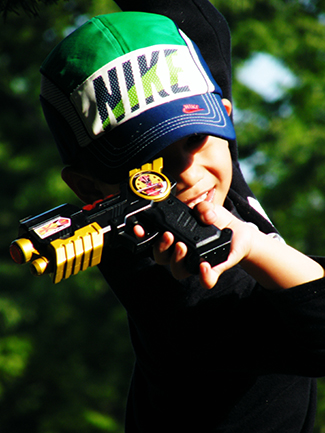
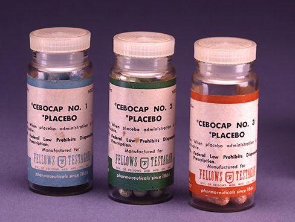
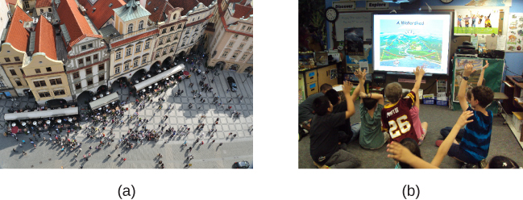
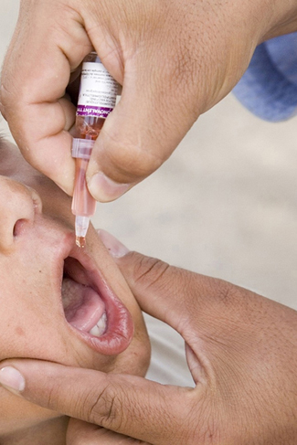

==================
Analyzing Findings
==================

.. contents::
   :depth: 3
..

.. container::

   By the end of this section, you will be able to: \* Explain what a
   correlation coefficient tells us about the relationship between
   variables \* Recognize that correlation does not indicate a
   cause-and-effect relationship between variables \* Discuss our
   tendency to look for relationships between variables that do not
   really exist \* Explain random sampling and assignment of
   participants into experimental and control groups \* Discuss how
   experimenter or participant bias could affect the results of an
   experiment \* Identify independent and dependent variables

Did you know that as sales in ice cream increase, so does the overall
rate of crime? Is it possible that indulging in your favorite flavor of
ice cream could send you on a crime spree? Or, after committing crime do
you think you might decide to treat yourself to a cone? There is no
question that a relationship exists between ice cream and crime (e.g.,
Harper, 2013), but it would be pretty foolish to decide that one thing
actually caused the other to occur.

It is much more likely that both ice cream sales and crime rates are
related to the temperature outside. When the temperature is warm, there
are lots of people out of their houses, interacting with each other,
getting annoyed with one another, and sometimes committing crimes. Also,
when it is warm outside, we are more likely to seek a cool treat like
ice cream. How do we determine if there is indeed a relationship between
two things? And when there is a relationship, how can we discern whether
it is attributable to coincidence or causation?

CORRELATIONAL RESEARCH
======================

**Correlation**\ {: data-type=“term”} means that there is a relationship
between two or more variables (such as ice cream consumption and crime),
but this relationship does not necessarily imply cause and effect. When
two variables are correlated, it simply means that as one variable
changes, so does the other. We can measure correlation by calculating a
statistic known as a correlation coefficient. A **correlation
coefficient**\ {: data-type=“term”} is a number from -1 to +1 that
indicates the strength and direction of the relationship between
variables. The correlation coefficient is usually represented by the
letter *r*.

The number portion of the correlation coefficient indicates the strength
of the relationship. The closer the number is to 1 (be it negative or
positive), the more strongly related the variables are, and the more
predictable changes in one variable will be as the other variable
changes. The closer the number is to zero, the weaker the relationship,
and the less predictable the relationships between the variables
becomes. For instance, a correlation coefficient of 0.9 indicates a far
stronger relationship than a correlation coefficient of 0.3. If the
variables are not related to one another at all, the correlation
coefficient is 0. The example above about ice cream and crime is an
example of two variables that we might expect to have no relationship to
each other.

The sign—positive or negative—of the correlation coefficient indicates
the direction of the relationship
(`[link] <#CNX_Psych_02_04_scatter>`__). A **positive correlation**\ {:
data-type=“term”} means that the variables move in the same direction.
Put another way, it means that as one variable increases so does the
other, and conversely, when one variable decreases so does the other. A
**negative correlation**\ {: data-type=“term”} means that the variables
move in opposite directions. If two variables are negatively correlated,
a decrease in one variable is associated with an increase in the other
and vice versa.

The example of ice cream and crime rates is a positive correlation
because both variables increase when temperatures are warmer. Other
examples of positive correlations are the relationship between an
individual’s height and weight or the relationship between a person’s
age and number of wrinkles. One might expect a negative correlation to
exist between someone’s tiredness during the day and the number of hours
they slept the previous night: the amount of sleep decreases as the
feelings of tiredness increase. In a real-world example of negative
correlation, student researchers at the University of Minnesota found a
weak negative correlation (*r* = -0.29) between the average number of
days per week that students got fewer than 5 hours of sleep and their
GPA (Lowry, Dean, & Manders, 2010). Keep in mind that a negative
correlation is not the same as no correlation. For example, we would
probably find no correlation between hours of sleep and shoe size.

As mentioned earlier, correlations have predictive value. Imagine that
you are on the admissions committee of a major university. You are faced
with a huge number of applications, but you are able to accommodate only
a small percentage of the applicant pool. How might you decide who
should be admitted? You might try to correlate your current students’
college GPA with their scores on standardized tests like the SAT or ACT.
By observing which correlations were strongest for your current
students, you could use this information to predict relative success of
those students who have applied for admission into the university.

|Three scatterplots are shown. Scatterplot (a) is labeled “positive
correlation” and shows scattered dots forming a rough line from the
bottom left to the top right; the x-axis is labeled “weight” and the
y-axis is labeled “height.” Scatterplot (b) is labeled “negative
correlation” and shows scattered dots forming a rough line from the top
left to the bottom right; the x-axis is labeled “tiredness” and the
y-axis is labeled “hours of sleep.” Scatterplot (c) is labeled “no
correlation” and shows scattered dots having no pattern; the x-axis is
labeled “shoe size” and the y-axis is labeled “hours of sleep.”|\ {:
#CNX_Psych_02_04_scatter}

.. container:: psychology link-to-learning

   Manipulate this `interactive
   scatterplot <http://openstax.org/l/scatplot>`__ to practice your
   understanding of positive and negative correlation.

Correlation Does Not Indicate Causation
---------------------------------------

Correlational research is useful because it allows us to discover the
strength and direction of relationships that exist between two
variables. However, correlation is limited because establishing the
existence of a relationship tells us little about **cause and
effect**\ {: data-type=“term”}. While variables are sometimes correlated
because one does cause the other, it could also be that some other
factor, a **confounding variable**\ {: data-type=“term”}, is actually
causing the systematic movement in our variables of interest. In the ice
cream/crime rate example mentioned earlier, temperature is a confounding
variable that could account for the relationship between the two
variables.

Even when we cannot point to clear confounding variables, we should not
assume that a correlation between two variables implies that one
variable causes changes in another. This can be frustrating when a
cause-and-effect relationship seems clear and intuitive. Think back to
our discussion of the research done by the American Cancer Society and
how their research projects were some of the first demonstrations of the
link between smoking and cancer. It seems reasonable to assume that
smoking causes cancer, but if we were limited to **correlational
research**\ {: data-type=“term” .no-emphasis}, we would be overstepping
our bounds by making this assumption.

Unfortunately, people mistakenly make claims of causation as a function
of correlations all the time. Such claims are especially common in
advertisements and news stories. For example, recent research found that
people who eat cereal on a regular basis achieve healthier weights than
those who rarely eat cereal (Frantzen, Treviño, Echon, Garcia-Dominic, &
DiMarco, 2013; Barton et al., 2005). Guess how the cereal companies
report this finding. Does eating cereal really cause an individual to
maintain a healthy weight, or are there other possible explanations,
such as, someone at a healthy weight is more likely to regularly eat a
healthy breakfast than someone who is obese or someone who avoids meals
in an attempt to diet (`[link] <#CNX_Psych_02_04_cereal>`__)? While
correlational research is invaluable in identifying relationships among
variables, a major limitation is the inability to establish causality.
Psychologists want to make statements about cause and effect, but the
only way to do that is to conduct an experiment to answer a research
question. The next section describes how scientific experiments
incorporate methods that eliminate, or control for, alternative
explanations, which allow researchers to explore how changes in one
variable cause changes in another variable.

|A photograph shows a bowl of cereal.|\ {: #CNX_Psych_02_04_cereal}

Illusory Correlations
---------------------

The temptation to make erroneous cause-and-effect statements based on
correlational research is not the only way we tend to misinterpret data.
We also tend to make the mistake of illusory correlations, especially
with unsystematic observations. **Illusory correlations**\ {:
data-type=“term”}, or false correlations, occur when people believe that
relationships exist between two things when no such relationship exists.
One well-known illusory correlation is the supposed effect that the
moon’s phases have on human behavior. Many people passionately assert
that human behavior is affected by the phase of the moon, and
specifically, that people act strangely when the moon is full
(`[link] <#CNX_Psych_02_04_moon>`__).

|A photograph shows the moon.|\ {: #CNX_Psych_02_04_moon}

There is no denying that the moon exerts a powerful influence on our
planet. The ebb and flow of the ocean’s tides are tightly tied to the
gravitational forces of the moon. Many people believe, therefore, that
it is logical that we are affected by the moon as well. After all, our
bodies are largely made up of water. A meta-analysis of nearly 40
studies consistently demonstrated, however, that the relationship
between the moon and our behavior does not exist (Rotton & Kelly, 1985).
While we may pay more attention to odd behavior during the full phase of
the moon, the rates of odd behavior remain constant throughout the lunar
cycle.

Why are we so apt to believe in illusory correlations like this? Often
we read or hear about them and simply accept the information as valid.
Or, we have a hunch about how something works and then look for evidence
to support that hunch, ignoring evidence that would tell us our hunch is
false; this is known as **confirmation bias**\ {: data-type=“term”}.
Other times, we find illusory correlations based on the information that
comes most easily to mind, even if that information is severely limited.
And while we may feel confident that we can use these relationships to
better understand and predict the world around us, illusory correlations
can have significant drawbacks. For example, research suggests that
illusory correlations—in which certain behaviors are inaccurately
attributed to certain groups—are involved in the formation of
prejudicial attitudes that can ultimately lead to discriminatory
behavior (Fiedler, 2004).

CAUSALITY: CONDUCTING EXPERIMENTS AND USING THE DATA
====================================================

As you’ve learned, the only way to establish that there is a
cause-and-effect relationship between two variables is to conduct a
scientific **experiment**\ {: data-type=“term” .no-emphasis}. Experiment
has a different meaning in the scientific context than in everyday life.
In everyday conversation, we often use it to describe trying something
for the first time, such as experimenting with a new hair style or a new
food. However, in the scientific context, an experiment has precise
requirements for design and implementation.

The Experimental Hypothesis
---------------------------

In order to conduct an experiment, a researcher must have a specific
**hypothesis**\ {: data-type=“term” .no-emphasis} to be tested. As
you’ve learned, hypotheses can be formulated either through direct
observation of the real world or after careful review of previous
research. For example, if you think that children should not be allowed
to watch violent programming on television because doing so would cause
them to behave more violently, then you have basically formulated a
hypothesis—namely, that watching violent television programs causes
children to behave more violently. How might you have arrived at this
particular hypothesis? You may have younger relatives who watch cartoons
featuring characters using martial arts to save the world from
evildoers, with an impressive array of punching, kicking, and defensive
postures. You notice that after watching these programs for a while,
your young relatives mimic the fighting behavior of the characters
portrayed in the cartoon (`[link] <#CNX_Psych_02_05_toygun>`__).

|A photograph shows a child pointing a toy gun.|\ {:
#CNX_Psych_02_05_toygun}

These sorts of personal observations are what often lead us to formulate
a specific hypothesis, but we cannot use limited personal observations
and anecdotal evidence to rigorously test our hypothesis. Instead, to
find out if real-world data supports our hypothesis, we have to conduct
an experiment.

Designing an Experiment
-----------------------

The most basic experimental design involves two groups: the experimental
group and the control group. The two groups are designed to be the same
except for one difference— experimental manipulation. The **experimental
group**\ {: data-type=“term”} gets the experimental manipulation—that
is, the treatment or variable being tested (in this case, violent TV
images)—and the **control group**\ {: data-type=“term”} does not. Since
experimental manipulation is the only difference between the
experimental and control groups, we can be sure that any differences
between the two are due to experimental manipulation rather than chance.

In our example of how violent television programming might affect
violent behavior in children, we have the experimental group view
violent television programming for a specified time and then measure
their violent behavior. We measure the violent behavior in our control
group after they watch nonviolent television programming for the same
amount of time. It is important for the control group to be treated
similarly to the experimental group, with the exception that the control
group does not receive the experimental manipulation. Therefore, we have
the control group watch non-violent television programming for the same
amount of time as the experimental group.

We also need to precisely define, or operationalize, what is considered
violent and nonviolent. An **operational definition**\ {:
data-type=“term”} is a description of how we will measure our variables,
and it is important in allowing others understand exactly how and what a
researcher measures in a particular experiment. In operationalizing
violent behavior, we might choose to count only physical acts like
kicking or punching as instances of this behavior, or we also may choose
to include angry verbal exchanges. Whatever we determine, it is
important that we operationalize violent behavior in such a way that
anyone who hears about our study for the first time knows exactly what
we mean by violence. This aids peoples’ ability to interpret our data as
well as their capacity to repeat our experiment should they choose to do
so.

Once we have operationalized what is considered violent television
programming and what is considered violent behavior from our experiment
participants, we need to establish how we will run our experiment. In
this case, we might have participants watch a 30-minute television
program (either violent or nonviolent, depending on their group
membership) before sending them out to a playground for an hour where
their behavior is observed and the number and type of violent acts is
recorded.

Ideally, the people who observe and record the children’s behavior are
unaware of who was assigned to the experimental or control group, in
order to control for experimenter bias. **Experimenter bias**\ {:
data-type=“term”} refers to the possibility that a researcher’s
expectations might skew the results of the study. Remember, conducting
an experiment requires a lot of planning, and the people involved in the
research project have a vested interest in supporting their hypotheses.
If the observers knew which child was in which group, it might influence
how much attention they paid to each child’s behavior as well as how
they interpreted that behavior. By being blind to which child is in
which group, we protect against those biases. This situation is a
**single-blind study**\ {: data-type=“term”}, meaning that one of the
groups (participants) are unaware as to which group they are in
(experiment or control group) while the researcher who developed the
experiment knows which participants are in each group.

In a **double-blind study**\ {: data-type=“term”}, both the researchers
and the participants are blind to group assignments. Why would a
researcher want to run a study where no one knows who is in which group?
Because by doing so, we can control for both experimenter and
participant expectations. If you are familiar with the phrase **placebo
effect**\ {: data-type=“term”}, you already have some idea as to why
this is an important consideration. The placebo effect occurs when
people's expectations or beliefs influence or determine their experience
in a given situation. In other words, simply expecting something to
happen can actually make it happen.

The placebo effect is commonly described in terms of testing the
effectiveness of a new medication. Imagine that you work in a
pharmaceutical company, and you think you have a new drug that is
effective in treating depression. To demonstrate that your medication is
effective, you run an experiment with two groups: The experimental group
receives the medication, and the control group does not. But you don’t
want participants to know whether they received the drug or not.

Why is that? Imagine that you are a participant in this study, and you
have just taken a pill that you think will improve your mood. Because
you expect the pill to have an effect, you might feel better simply
because you took the pill and not because of any drug actually contained
in the pill—this is the placebo effect.

To make sure that any effects on mood are due to the drug and not due to
expectations, the control group receives a placebo (in this case a sugar
pill). Now everyone gets a pill, and once again neither the researcher
nor the experimental participants know who got the drug and who got the
sugar pill. Any differences in mood between the experimental and control
groups can now be attributed to the drug itself rather than to
experimenter bias or participant expectations
(`[link] <#CNX_Psych_02_05_placebo>`__).

|A photograph shows three glass bottles of pills labeled as
placebos.|\ {: #CNX_Psych_02_05_placebo}

Independent and Dependent Variables
-----------------------------------

In a research experiment, we strive to study whether changes in one
thing cause changes in another. To achieve this, we must pay attention
to two important variables, or things that can be changed, in any
experimental study: the independent variable and the dependent variable.
An **independent variable**\ {: data-type=“term”} is manipulated or
controlled by the experimenter. In a well-designed experimental study,
the independent variable is the only important difference between the
experimental and control groups. In our example of how violent
television programs affect children’s display of violent behavior, the
independent variable is the type of program—violent or nonviolent—viewed
by participants in the study (`[link] <#CNX_Psych_02_05_variables>`__).
A **dependent variable**\ {: data-type=“term”} is what the researcher
measures to see how much effect the independent variable had. In our
example, the dependent variable is the number of violent acts displayed
by the experimental participants.

|A box labeled “independent variable: type of television programming
viewed” contains a photograph of a person shooting an automatic weapon.
An arrow labeled “influences change in the…” leads to a second box. The
second box is labeled “dependent variable: violent behavior displayed”
and has a photograph of a child pointing a toy gun.|\ {:
#CNX_Psych_02_05_variables}

We expect that the dependent variable will change as a function of the
independent variable. In other words, the dependent variable *depends*
on the independent variable. A good way to think about the relationship
between the independent and dependent variables is with this question:
What effect does the independent variable have on the dependent
variable? Returning to our example, what effect does watching a half
hour of violent television programming or nonviolent television
programming have on the number of incidents of physical aggression
displayed on the playground?

Selecting and Assigning Experimental Participants
-------------------------------------------------

Now that our study is designed, we need to obtain a sample of
individuals to include in our experiment. Our study involves human
participants so we need to determine who to include.
**Participants**\ {: data-type=“term”} are the subjects of psychological
research, and as the name implies, individuals who are involved in
psychological research actively participate in the process. Often,
psychological research projects rely on college students to serve as
participants. In fact, the vast majority of research in psychology
subfields has historically involved students as research participants
(Sears, 1986; Arnett, 2008). But are college students truly
representative of the general population? College students tend to be
younger, more educated, more liberal, and less diverse than the general
population. Although using students as test subjects is an accepted
practice, relying on such a limited pool of research participants can be
problematic because it is difficult to generalize findings to the larger
population.

Our hypothetical experiment involves children, and we must first
generate a sample of child participants. Samples are used because
populations are usually too large to reasonably involve every member in
our particular experiment (`[link] <#CNX_Psych_02_05_sample>`__). If
possible, we should use a random sample (there are other types of
samples, but for the purposes of this chapter, we will focus on random
samples). A **random sample**\ {: data-type=“term”} is a subset of a
larger population in which every member of the population has an equal
chance of being selected. Random samples are preferred because if the
sample is large enough we can be reasonably sure that the participating
individuals are representative of the larger population. This means that
the percentages of characteristics in the sample—sex, ethnicity,
socioeconomic level, and any other characteristics that might affect the
results—are close to those percentages in the larger population.

In our example, let’s say we decide our population of interest is fourth
graders. But all fourth graders is a very large population, so we need
to be more specific; instead we might say our population of interest is
all fourth graders in a particular city. We should include students from
various income brackets, family situations, races, ethnicities,
religions, and geographic areas of town. With this more manageable
population, we can work with the local schools in selecting a random
sample of around 200 fourth graders who we want to participate in our
experiment.

In summary, because we cannot test all of the fourth graders in a city,
we want to find a group of about 200 that reflects the composition of
that city. With a representative group, we can generalize our findings
to the larger population without fear of our sample being biased in some
way.

|(a) A photograph shows an aerial view of crowds on a street. (b) A
photograph shows s small group of children.|\ {:
#CNX_Psych_02_05_sample}

Now that we have a sample, the next step of the experimental process is
to split the participants into experimental and control groups through
random assignment. With **random assignment**\ {: data-type=“term”}, all
participants have an equal chance of being assigned to either group.
There is statistical software that will randomly assign each of the
fourth graders in the sample to either the experimental or the control
group.

Random assignment is critical for sound **experimental design**\ {:
data-type=“term” .no-emphasis}. With sufficiently large samples, random
assignment makes it unlikely that there are systematic differences
between the groups. So, for instance, it would be very unlikely that we
would get one group composed entirely of males, a given ethnic identity,
or a given religious ideology. This is important because if the groups
were systematically different before the experiment began, we would not
know the origin of any differences we find between the groups: Were the
differences preexisting, or were they caused by manipulation of the
independent variable? Random assignment allows us to assume that any
differences observed between experimental and control groups result from
the manipulation of the independent variable.

.. container:: psychology link-to-learning

   Use this `online tool <https://www.randomizer.org/>`__ to instantly
   generate randomized numbers and to learn more about random sampling
   and assignments.

Issues to Consider
------------------

While experiments allow scientists to make cause-and-effect claims, they
are not without problems. True experiments require the experimenter to
manipulate an independent variable, and that can complicate many
questions that psychologists might want to address. For instance,
imagine that you want to know what effect sex (the independent variable)
has on spatial memory (the dependent variable). Although you can
certainly look for differences between males and females on a task that
taps into spatial memory, you cannot directly control a person’s sex. We
categorize this type of research approach as quasi-experimental and
recognize that we cannot make cause-and-effect claims in these
circumstances.

Experimenters are also limited by ethical constraints. For instance, you
would not be able to conduct an experiment designed to determine if
experiencing abuse as a child leads to lower levels of self-esteem among
adults. To conduct such an experiment, you would need to randomly assign
some experimental participants to a group that receives abuse, and that
experiment would be unethical.

Interpreting Experimental Findings
----------------------------------

Once data is collected from both the experimental and the control
groups, a **statistical analysis**\ {: data-type=“term”} is conducted to
find out if there are meaningful differences between the two groups. A
statistical analysis determines how likely any difference found is due
to chance (and thus not meaningful). In psychology, group differences
are considered meaningful, or significant, if the odds that these
differences occurred by chance alone are 5 percent or less. Stated
another way, if we repeated this experiment 100 times, we would expect
to find the same results at least 95 times out of 100.

The greatest strength of experiments is the ability to assert that any
significant differences in the findings are caused by the independent
variable. This occurs because random selection, random assignment, and a
design that limits the effects of both experimenter bias and participant
expectancy should create groups that are similar in composition and
treatment. Therefore, any difference between the groups is attributable
to the independent variable, and now we can finally make a causal
statement. If we find that watching a violent television program results
in more violent behavior than watching a nonviolent program, we can
safely say that watching violent television programs causes an increase
in the display of violent behavior.

Reporting Research
------------------

When psychologists complete a research project, they generally want to
share their findings with other scientists. The American Psychological
Association (APA) publishes a manual detailing how to write a paper for
submission to scientific journals. Unlike an article that might be
published in a magazine like Psychology Today, which targets a general
audience with an interest in psychology, scientific journals generally
publish **peer-reviewed journal articles**\ {: data-type=“term”} aimed
at an audience of professionals and scholars who are actively involved
in research themselves.

.. container:: psychology link-to-learning

   The `Online Writing Lab (OWL) <http://openstax.org/l/owl>`__ at
   Purdue University can walk you through the APA writing guidelines.

A peer-reviewed journal article is read by several other scientists
(generally anonymously) with expertise in the subject matter. These peer
reviewers provide feedback—to both the author and the journal
editor—regarding the quality of the draft. Peer reviewers look for a
strong rationale for the research being described, a clear description
of how the research was conducted, and evidence that the research was
conducted in an ethical manner. They also look for flaws in the study's
design, methods, and statistical analyses. They check that the
conclusions drawn by the authors seem reasonable given the observations
made during the research. Peer reviewers also comment on how valuable
the research is in advancing the discipline’s knowledge. This helps
prevent unnecessary duplication of research findings in the scientific
literature and, to some extent, ensures that each research article
provides new information. Ultimately, the journal editor will compile
all of the peer reviewer feedback and determine whether the article will
be published in its current state (a rare occurrence), published with
revisions, or not accepted for publication.

Peer review provides some degree of quality control for psychological
research. Poorly conceived or executed studies can be weeded out, and
even well-designed research can be improved by the revisions suggested.
Peer review also ensures that the research is described clearly enough
to allow other scientists to **replicate**\ {: data-type=“term”} it,
meaning they can repeat the experiment using different samples to
determine reliability. Sometimes replications involve additional
measures that expand on the original finding. In any case, each
replication serves to provide more evidence to support the original
research findings. Successful replications of published research make
scientists more apt to adopt those findings, while repeated failures
tend to cast doubt on the legitimacy of the original article and lead
scientists to look elsewhere. For example, it would be a major
advancement in the medical field if a published study indicated that
taking a new drug helped individuals achieve a healthy weight without
changing their diet. But if other scientists could not replicate the
results, the original study’s claims would be questioned.

.. container:: psychology dig-deeper

   .. container::

      The Vaccine-Autism Myth and Retraction of Published Studies

   Some scientists have claimed that routine childhood vaccines cause
   some children to develop autism, and, in fact, several peer-reviewed
   publications published research making these claims. Since the
   initial reports, large-scale epidemiological research has suggested
   that vaccinations are not responsible for causing autism and that it
   is much safer to have your child vaccinated than not. Furthermore,
   several of the original studies making this claim have since been
   retracted.

   A published piece of work can be rescinded when data is called into
   question because of falsification, fabrication, or serious research
   design problems. Once rescinded, the scientific community is informed
   that there are serious problems with the original publication.
   Retractions can be initiated by the researcher who led the study, by
   research collaborators, by the institution that employed the
   researcher, or by the editorial board of the journal in which the
   article was originally published. In the vaccine-autism case, the
   retraction was made because of a significant conflict of interest in
   which the leading researcher had a financial interest in establishing
   a link between childhood vaccines and autism (Offit, 2008).
   Unfortunately, the initial studies received so much media attention
   that many parents around the world became hesitant to have their
   children vaccinated (`[link] <#CNX_Psych_02_05_vaccine>`__). For more
   information about how the vaccine/autism story unfolded, as well as
   the repercussions of this story, take a look at Paul Offit’s book,
   *Autism’s False Prophets: Bad Science, Risky Medicine, and the Search
   for a Cure.*

   |A photograph shows a child being given an oral vaccine.|\ {:
   #CNX_Psych_02_05_vaccine}

RELIABILITY AND VALIDITY
========================

Reliability and validity are two important considerations that must be
made with any type of data collection. **Reliability**\ {:
data-type=“term”} refers to the ability to consistently produce a given
result. In the context of psychological research, this would mean that
any instruments or tools used to collect data do so in consistent,
reproducible ways.

Unfortunately, being consistent in measurement does not necessarily mean
that you have measured something correctly. To illustrate this concept,
consider a kitchen scale that would be used to measure the weight of
cereal that you eat in the morning. If the scale is not properly
calibrated, it may consistently under- or overestimate the amount of
cereal that’s being measured. While the scale is highly reliable in
producing consistent results (e.g., the same amount of cereal poured
onto the scale produces the same reading each time), those results are
incorrect. This is where validity comes into play. **Validity**\ {:
data-type=“term”} refers to the extent to which a given instrument or
tool accurately measures what it’s supposed to measure. While any valid
measure is by necessity reliable, the reverse is not necessarily true.
Researchers strive to use instruments that are both highly reliable and
valid.

.. container:: psychology everyday-connection

   .. container::

      How Valid Is the SAT?

   Standardized tests like the SAT are supposed to measure an
   individual’s aptitude for a college education, but how reliable and
   valid are such tests? Research conducted by the College Board
   suggests that scores on the SAT have high predictive validity for
   first-year college students’ GPA (Kobrin, Patterson, Shaw, Mattern, &
   Barbuti, 2008). In this context, predictive validity refers to the
   test’s ability to effectively predict the GPA of college freshmen.
   Given that many institutions of higher education require the SAT for
   admission, this high degree of predictive validity might be
   comforting.

   However, the emphasis placed on SAT scores in college admissions has
   generated some controversy on a number of fronts. For one, some
   researchers assert that the SAT is a biased test that places minority
   students at a disadvantage and unfairly reduces the likelihood of
   being admitted into a college (Santelices & Wilson, 2010).
   Additionally, some research has suggested that the predictive
   validity of the SAT is grossly exaggerated in how well it is able to
   predict the GPA of first-year college students. In fact, it has been
   suggested that the SAT’s predictive validity may be overestimated by
   as much as 150% (Rothstein, 2004). Many institutions of higher
   education are beginning to consider de-emphasizing the significance
   of SAT scores in making admission decisions (Rimer, 2008).

   In 2014, College Board president David Coleman expressed his
   awareness of these problems, recognizing that college success is more
   accurately predicted by high school grades than by SAT scores. To
   address these concerns, he has called for significant changes to the
   SAT exam (Lewin, 2014).

Summary
=======

A correlation is described with a correlation coefficient, *r*, which
ranges from -1 to 1. The correlation coefficient tells us about the
nature (positive or negative) and the strength of the relationship
between two or more variables. Correlations do not tell us anything
about causation—regardless of how strong the relationship is between
variables. In fact, the only way to demonstrate causation is by
conducting an experiment. People often make the mistake of claiming that
correlations exist when they really do not.

Researchers can test cause-and-effect hypotheses by conducting
experiments. Ideally, experimental participants are randomly selected
from the population of interest. Then, the participants are randomly
assigned to their respective groups. Sometimes, the researcher and the
participants are blind to group membership to prevent their expectations
from influencing the results.

In ideal experimental design, the only difference between the
experimental and control groups is whether participants are exposed to
the experimental manipulation. Each group goes through all phases of the
experiment, but each group will experience a different level of the
independent variable: the experimental group is exposed to the
experimental manipulation, and the control group is not exposed to the
experimental manipulation. The researcher then measures the changes that
are produced in the dependent variable in each group. Once data is
collected from both groups, it is analyzed statistically to determine if
there are meaningful differences between the groups.

Psychologists report their research findings in peer-reviewed journal
articles. Research published in this format is checked by several other
psychologists who serve as a filter separating ideas that are supported
by evidence from ideas that are not. Replication has an important role
in ensuring the legitimacy of published research. In the long run, only
those findings that are capable of being replicated consistently will
achieve consensus in the scientific community.

Review Questions
================

.. container::

   .. container::

      Height and weight are positively correlated. This means that:

      1. There is no relationship between height and weight.
      2. Usually, the taller someone is, the thinner they are.
      3. Usually, the shorter someone is, the heavier they are.
      4. As height increases, typically weight increases. {: type=“a”}

   .. container::

      D

.. container::

   .. container::

      Which of the following correlation coefficients indicates the
      strongest relationship between two variables?

      1. -.90
      2. -.50
      3. +.80
      4. +.25 {: type=“a”}

   .. container::

      A

.. container::

   .. container::

      Which statement best illustrates a negative correlation between
      the number of hours spent watching TV the week before an exam and
      the grade on that exam?

      1. Watching too much television leads to poor exam performance.
      2. Smart students watch less television.
      3. Viewing television interferes with a student’s ability to
         prepare for the upcoming exam.
      4. Students who watch more television perform more poorly on their
         exams. {: type=“a”}

   .. container::

      D

.. container::

   .. container::

      The correlation coefficient indicates the weakest relationship
      when \________.

      1. it is closest to 0
      2. it is closest to -1
      3. it is positive
      4. it is negative {: type=“a”}

   .. container::

      A

.. container::

   .. container::

      \_______\_ means that everyone in the population has the same
      likelihood of being asked to participate in the study.

      1. operationalizing
      2. placebo effect
      3. random assignment
      4. random sampling {: type=“a”}

   .. container::

      D

.. container::

   .. container::

      The \_______\_ is controlled by the experimenter, while the
      \_______\_ represents the information collected and statistically
      analyzed by the experimenter.

      1. dependent variable; independent variable
      2. independent variable; dependent variable
      3. placebo effect; experimenter bias
      4. experiment bias; placebo effect {: type=“a”}

   .. container::

      B

.. container::

   .. container::

      Researchers must \_______\_ important concepts in their studies so
      others would have a clear understanding of exactly how those
      concepts were defined.

      1. randomly assign
      2. randomly select
      3. operationalize
      4. generalize {: type=“a”}

   .. container::

      C

.. container::

   .. container::

      Sometimes, researchers will administer a(n) \_______\_ to
      participants in the control group to control for the effects that
      participant expectation might have on the experiment.

      1. dependent variable
      2. independent variable
      3. statistical analysis
      4. placebo {: type=“a”}

   .. container::
      :name: eip-idp3728800

      D

Critical Thinking Questions
===========================

.. container::

   .. container::

      Earlier in this section, we read about research suggesting that
      there is a correlation between eating cereal and weight. Cereal
      companies that present this information in their advertisements
      could lead someone to believe that eating more cereal causes
      healthy weight. Why would they make such a claim and what
      arguments could you make to counter this cause-and-effect claim?

   .. container::

      The cereal companies are trying to make a profit, so framing the
      research findings in this way would improve their bottom line.
      However, it could be that people who forgo more fatty options for
      breakfast are health conscious and engage in a variety of other
      behaviors that help them maintain a healthy weight.

.. container::

   .. container::

      Recently a study was published in the journal, *Nutrition and
      Cancer*, which established a negative correlation between coffee
      consumption and breast cancer. Specifically, it was found that
      women consuming more than 5 cups of coffee a day were less likely
      to develop breast cancer than women who never consumed coffee
      (Lowcock, Cotterchio, Anderson, Boucher, & El-Sohemy, 2013).
      Imagine you see a newspaper story about this research that says,
      “Coffee Protects Against Cancer.” Why is this headline misleading
      and why would a more accurate headline draw less interest?

   .. container::

      Using the word protects seems to suggest causation as a function
      of correlation. If the headline were more accurate, it would be
      less interesting because indicating that two things are associated
      is less powerful than indicating that doing one thing causes a
      change in the other.

.. container::

   .. container::

      Sometimes, true random sampling can be very difficult to obtain.
      Many researchers make use of convenience samples as an
      alternative. For example, one popular convenience sample would
      involve students enrolled in Introduction to Psychology courses.
      What are the implications of using this sampling technique?

   .. container::

      If research is limited to students enrolled in Introduction to
      Psychology courses, then our ability to generalize to the larger
      population would be dramatically reduced. One could also argue
      that students enrolled in Introduction to Psychology courses may
      not be representative of the larger population of college students
      at their school, much less the larger general population.

.. container::

   .. container::

      Peer review is an important part of publishing research findings
      in many scientific disciplines. This process is normally conducted
      anonymously; in other words, the author of the article being
      reviewed does not know who is reviewing the article, and the
      reviewers are unaware of the author’s identity. Why would this be
      an important part of this process?

   .. container::

      Anonymity protects against personal biases interfering with the
      reviewer’s opinion of the research. Allowing the reviewer to
      remain anonymous would mean that they can be honest in their
      appraisal of the manuscript without fear of reprisal.

Personal Application Questions
==============================

.. container::

   .. container::

      We all have a tendency to make illusory correlations from time to
      time. Try to think of an illusory correlation that is held by you,
      a family member, or a close friend. How do you think this illusory
      correlation came about and what can be done in the future to
      combat them?

.. container::

   .. container::

      Are there any questions about human or animal behavior that you
      would really like to answer? Generate a hypothesis and briefly
      describe how you would conduct an experiment to answer your
      question.

.. container::

   .. rubric:: Glossary
      :name: glossary

   {: data-type=“glossary-title”}

   cause-and-effect relationship
      changes in one variable cause the changes in the other variable;
      can be determined only through an experimental research design ^
   confirmation bias
      tendency to ignore evidence that disproves ideas or beliefs ^
   confounding variable
      unanticipated outside factor that affects both variables of
      interest, often giving the false impression that changes in one
      variable causes changes in the other variable, when, in actuality,
      the outside factor causes changes in both variables ^
   control group
      serves as a basis for comparison and controls for chance factors
      that might influence the results of the study—by holding such
      factors constant across groups so that the experimental
      manipulation is the only difference between groups ^
   correlation
      relationship between two or more variables; when two variables are
      correlated, one variable changes as the other does ^
   correlation coefficient
      number from -1 to +1, indicating the strength and direction of the
      relationship between variables, and usually represented by *r* ^
   dependent variable
      variable that the researcher measures to see how much effect the
      independent variable had ^
   double-blind study
      experiment in which both the researchers and the participants are
      blind to group assignments ^
   experimental group
      group designed to answer the research question; experimental
      manipulation is the only difference between the experimental and
      control groups, so any differences between the two are due to
      experimental manipulation rather than chance ^
   experimenter bias
      researcher expectations skew the results of the study ^
   illusory correlation
      seeing relationships between two things when in reality no such
      relationship exists ^
   independent variable
      variable that is influenced or controlled by the experimenter; in
      a sound experimental study, the independent variable is the only
      important difference between the experimental and control group ^
   negative correlation
      two variables change in different directions, with one becoming
      larger as the other becomes smaller; a negative correlation is not
      the same thing as no correlation ^
   operational definition
      description of what actions and operations will be used to measure
      the dependent variables and manipulate the independent variables ^
   participants
      subjects of psychological research ^
   peer-reviewed journal article
      article read by several other scientists (usually anonymously)
      with expertise in the subject matter, who provide feedback
      regarding the quality of the manuscript before it is accepted for
      publication ^
   placebo effect
      people's expectations or beliefs influencing or determining their
      experience in a given situation ^
   positive correlation
      two variables change in the same direction, both becoming either
      larger or smaller ^
   random assignment
      method of experimental group assignment in which all participants
      have an equal chance of being assigned to either group ^
   random sample
      subset of a larger population in which every member of the
      population has an equal chance of being selected ^
   reliability
      consistency and reproducibility of a given result ^
   replicate
      repeating an experiment using different samples to determine the
      research’s reliability ^
   single-blind study
      experiment in which the researcher knows which participants are in
      the experimental group and which are in the control group ^
   statistical analysis
      determines how likely any difference between experimental groups
      is due to chance ^
   validity
      accuracy of a given result in measuring what it is designed to
      measure

.. |Three scatterplots are shown. Scatterplot (a) is labeled “positive correlation” and shows scattered dots forming a rough line from the bottom left to the top right; the x-axis is labeled “weight” and the y-axis is labeled “height.” Scatterplot (b) is labeled “negative correlation” and shows scattered dots forming a rough line from the top left to the bottom right; the x-axis is labeled “tiredness” and the y-axis is labeled “hours of sleep.” Scatterplot (c) is labeled “no correlation” and shows scattered dots having no pattern; the x-axis is labeled “shoe size” and the y-axis is labeled “hours of sleep.”| image:: ../resources/CNX_Psych_02_04_scatter.jpg

.. |A box labeled “independent variable: type of television programming viewed” contains a photograph of a person shooting an automatic weapon. An arrow labeled “influences change in the…” leads to a second box. The second box is labeled “dependent variable: violent behavior displayed” and has a photograph of a child pointing a toy gun.| image:: ../resources/CNX_Psych_02_05_variables.jpg

