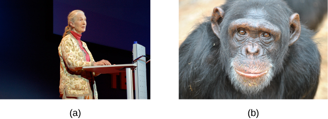
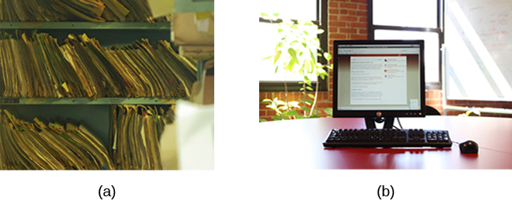

======================
Approaches to Research
======================

.. contents::
   :depth: 3
..

.. container::

   By the end of this section, you will be able to: \* Describe the
   different research methods used by psychologists \* Discuss the
   strengths and weaknesses of case studies, naturalistic observation,
   surveys, and archival research \* Compare longitudinal and
   cross-sectional approaches to research

There are many research methods available to psychologists in their
efforts to understand, describe, and explain behavior and the cognitive
and biological processes that underlie it. Some methods rely on
observational techniques. Other approaches involve interactions between
the researcher and the individuals who are being studied—ranging from a
series of simple questions to extensive, in-depth interviews—to
well-controlled experiments.

Each of these research methods has unique strengths and weaknesses, and
each method may only be appropriate for certain types of research
questions. For example, studies that rely primarily on observation
produce incredible amounts of information, but the ability to apply this
information to the larger population is somewhat limited because of
small sample sizes. Survey research, on the other hand, allows
researchers to easily collect data from relatively large samples. While
this allows for results to be generalized to the larger population more
easily, the information that can be collected on any given survey is
somewhat limited and subject to problems associated with any type of
self-reported data. Some researchers conduct archival research by using
existing records. While this can be a fairly inexpensive way to collect
data that can provide insight into a number of research questions,
researchers using this approach have no control on how or what kind of
data was collected. All of the methods described thus far are
correlational in nature. This means that researchers can speak to
important relationships that might exist between two or more variables
of interest. However, correlational data cannot be used to make claims
about cause-and-effect relationships.

Correlational research can find a relationship between two variables,
but the only way a researcher can claim that the relationship between
the variables is cause and effect is to perform an experiment. In
experimental research, which will be discussed later in this chapter,
there is a tremendous amount of control over variables of interest.
While this is a powerful approach, experiments are often conducted in
very artificial settings. This calls into question the validity of
experimental findings with regard to how they would apply in real-world
settings. In addition, many of the questions that psychologists would
like to answer cannot be pursued through experimental research because
of ethical concerns.

CLINICAL OR CASE STUDIES
========================

In 2011, the *New York Times* published a feature story on Krista and
Tatiana Hogan, Canadian twin girls. These particular twins are unique
because Krista and Tatiana are conjoined twins, connected at the head.
There is evidence that the two girls are connected in a part of the
brain called the thalamus, which is a major sensory relay center. Most
incoming sensory information is sent through the thalamus before
reaching higher regions of the cerebral cortex for processing.

.. container:: psychology link-to-learning

   To learn more about Krista and Tatiana, watch this `New York Times
   video <http://openstax.org/l/hogans>`__ about their lives.

The implications of this potential connection mean that it might be
possible for one twin to experience the sensations of the other twin.
For instance, if Krista is watching a particularly funny television
program, Tatiana might smile or laugh even if she is not watching the
program. This particular possibility has piqued the interest of many
neuroscientists who seek to understand how the brain uses sensory
information.

These twins represent an enormous resource in the study of the brain,
and since their condition is very rare, it is likely that as long as
their family agrees, scientists will follow these girls very closely
throughout their lives to gain as much information as possible (Dominus,
2011).

In observational research, scientists are conducting a **clinical**\ {:
data-type=“term”} or **case study**\ {: data-type=“term”} when they
focus on one person or just a few individuals. Indeed, some scientists
spend their entire careers studying just 10–20 individuals. Why would
they do this? Obviously, when they focus their attention on a very small
number of people, they can gain a tremendous amount of insight into
those cases. The richness of information that is collected in clinical
or case studies is unmatched by any other single research method. This
allows the researcher to have a very deep understanding of the
individuals and the particular phenomenon being studied.

If clinical or case studies provide so much information, why are they
not more frequent among researchers? As it turns out, the major benefit
of this particular approach is also a weakness. As mentioned earlier,
this approach is often used when studying individuals who are
interesting to researchers because they have a rare characteristic.
Therefore, the individuals who serve as the focus of case studies are
not like most other people. If scientists ultimately want to explain all
behavior, focusing attention on such a special group of people can make
it difficult to generalize any observations to the larger population as
a whole. **Generalizing**\ {: data-type=“term”} refers to the ability to
apply the findings of a particular research project to larger segments
of society. Again, case studies provide enormous amounts of information,
but since the cases are so specific, the potential to apply what’s
learned to the average person may be very limited.

NATURALISTIC OBSERVATION
========================

If you want to understand how behavior occurs, one of the best ways to
gain information is to simply observe the behavior in its natural
context. However, people might change their behavior in unexpected ways
if they know they are being observed. How do researchers obtain accurate
information when people tend to hide their natural behavior? As an
example, imagine that your professor asks everyone in your class to
raise their hand if they always wash their hands after using the
restroom. Chances are that almost everyone in the classroom will raise
their hand, but do you think hand washing after every trip to the
restroom is really that universal?

This is very similar to the phenomenon mentioned earlier in this
chapter: many individuals do not feel comfortable answering a question
honestly. But if we are committed to finding out the facts about hand
washing, we have other options available to us.

Suppose we send a classmate into the restroom to actually watch whether
everyone washes their hands after using the restroom. Will our observer
blend into the restroom environment by wearing a white lab coat, sitting
with a clipboard, and staring at the sinks? We want our researcher to be
inconspicuous—perhaps standing at one of the sinks pretending to put in
contact lenses while secretly recording the relevant information. This
type of observational study is called **naturalistic observation**\ {:
data-type=“term”}: observing behavior in its natural setting. To better
understand peer exclusion, Suzanne Fanger collaborated with colleagues
at the University of Texas to observe the behavior of preschool children
on a playground. How did the observers remain inconspicuous over the
duration of the study? They equipped a few of the children with wireless
microphones (which the children quickly forgot about) and observed while
taking notes from a distance. Also, the children in that particular
preschool (a “laboratory preschool”) were accustomed to having observers
on the playground (Fanger, Frankel, & Hazen, 2012).

It is critical that the observer be as unobtrusive and as inconspicuous
as possible: when people know they are being watched, they are less
likely to behave naturally. If you have any doubt about this, ask
yourself how your driving behavior might differ in two situations: In
the first situation, you are driving down a deserted highway during the
middle of the day; in the second situation, you are being followed by a
police car down the same deserted highway
(`[link] <#CNX_Psych_02_02_policecar>`__).

|A photograph shows two police cars driving, one with its lights
flashing.|\ {: #CNX_Psych_02_02_policecar}

It should be pointed out that naturalistic observation is not limited to
research involving humans. Indeed, some of the best-known examples of
naturalistic observation involve researchers going into the field to
observe various kinds of animals in their own environments. As with
human studies, the researchers maintain their distance and avoid
interfering with the animal subjects so as not to influence their
natural behaviors. Scientists have used this technique to study social
hierarchies and interactions among animals ranging from ground squirrels
to gorillas. The information provided by these studies is invaluable in
understanding how those animals organize socially and communicate with
one another. The anthropologist Jane **Goodall**\ {: data-type=“term”
.no-emphasis}, for example, spent nearly five decades observing the
behavior of chimpanzees in Africa
(`[link] <#CNX_Psych_02_02_goodall>`__). As an illustration of the types
of concerns that a researcher might encounter in naturalistic
observation, some scientists criticized Goodall for giving the chimps
names instead of referring to them by numbers—using names was thought to
undermine the emotional detachment required for the objectivity of the
study (McKie, 2010).

|(a) A photograph shows Jane Goodall speaking from a lectern. (b) A
photograph shows a chimpanzee’s face.|\ {: #CNX_Psych_02_02_goodall}

The greatest benefit of naturalistic observation is the **validity**\ {:
data-type=“term” .no-emphasis}, or accuracy, of information collected
unobtrusively in a natural setting. Having individuals behave as they
normally would in a given situation means that we have a higher degree
of ecological validity, or realism, than we might achieve with other
research approaches. Therefore, our ability to generalize the findings
of the research to real-world situations is enhanced. If done correctly,
we need not worry about people or animals modifying their behavior
simply because they are being observed. Sometimes, people may assume
that reality programs give us a glimpse into authentic human behavior.
However, the principle of inconspicuous observation is violated as
reality stars are followed by camera crews and are interviewed on camera
for personal confessionals. Given that environment, we must doubt how
natural and realistic their behaviors are.

The major downside of naturalistic observation is that they are often
difficult to set up and control. In our restroom study, what if you
stood in the restroom all day prepared to record people’s hand washing
behavior and no one came in? Or, what if you have been closely observing
a troop of gorillas for weeks only to find that they migrated to a new
place while you were sleeping in your tent? The benefit of realistic
data comes at a cost. As a researcher you have no control of when (or
if) you have behavior to observe. In addition, this type of
observational research often requires significant investments of time,
money, and a good dose of luck.

Sometimes studies involve structured observation. In these cases, people
are observed while engaging in set, specific tasks. An excellent example
of structured observation comes from Strange Situation by Mary Ainsworth
(you will read more about this in the chapter on lifespan development).
The Strange Situation is a procedure used to evaluate attachment styles
that exist between an infant and caregiver. In this scenario, caregivers
bring their infants into a room filled with toys. The Strange Situation
involves a number of phases, including a stranger coming into the room,
the caregiver leaving the room, and the caregiver’s return to the room.
The infant’s behavior is closely monitored at each phase, but it is the
behavior of the infant upon being reunited with the caregiver that is
most telling in terms of characterizing the infant’s attachment style
with the caregiver.

Another potential problem in observational research is **observer
bias**\ {: data-type=“term”}. Generally, people who act as observers are
closely involved in the research project and may unconsciously skew
their observations to fit their research goals or expectations. To
protect against this type of bias, researchers should have clear
criteria established for the types of behaviors recorded and how those
behaviors should be classified. In addition, researchers often compare
observations of the same event by multiple observers, in order to test
**inter-rater reliability**\ {: data-type=“term”}: a measure of
reliability that assesses the consistency of observations by different
observers.

SURVEYS
=======

Often, psychologists develop surveys as a means of gathering data.
**Surveys**\ {: data-type=“term”} are lists of questions to be answered
by research participants, and can be delivered as paper-and-pencil
questionnaires, administered electronically, or conducted verbally
(`[link] <#CNX_Psych_02_03_survey>`__). Generally, the survey itself can
be completed in a short time, and the ease of administering a survey
makes it easy to collect data from a large number of people.

Surveys allow researchers to gather data from larger samples than may be
afforded by other research methods\ **.** A **sample**\ {:
data-type=“term”} is a subset of individuals selected from a
**population**\ {: data-type=“term”}, which is the overall group of
individuals that the researchers are interested in. Researchers study
the sample and seek to generalize their findings to the population.

|A sample online survey reads, “Dear visitor, your opinion is important
to us. We would like to invite you to participate in a short survey to
gather your opinions and feedback on your news consumption habits. The
survey will take approximately 10-15 minutes. Simply click the “Yes”
button below to launch the survey. Would you like to participate?” Two
buttons are labeled “yes” and “no.”|\ {: #CNX_Psych_02_03_survey}

There is both strength and weakness of the survey in comparison to case
studies. By using surveys, we can collect information from a larger
sample of people. A larger sample is better able to reflect the actual
diversity of the population, thus allowing better generalizability.
Therefore, if our sample is sufficiently large and diverse, we can
assume that the data we collect from the survey can be generalized to
the larger population with more certainty than the information collected
through a case study. However, given the greater number of people
involved, we are not able to collect the same depth of information on
each person that would be collected in a case study.

Another potential weakness of surveys is something we touched on earlier
in this chapter: People don't always give accurate responses. They may
lie, misremember, or answer questions in a way that they think makes
them look good. For example, people may report drinking less alcohol
than is actually the case.

Any number of research questions can be answered through the use of
surveys. One real-world example is the research conducted by Jenkins,
Ruppel, Kizer, Yehl, and Griffin (2012) about the backlash against the
US Arab-American community following the terrorist attacks of September
11, 2001. Jenkins and colleagues wanted to determine to what extent
these negative attitudes toward Arab-Americans still existed nearly a
decade after the attacks occurred. In one study, 140 research
participants filled out a survey with 10 questions, including questions
asking directly about the participant’s overt prejudicial attitudes
toward people of various ethnicities. The survey also asked indirect
questions about how likely the participant would be to interact with a
person of a given ethnicity in a variety of settings (such as, “How
likely do you think it is that you would introduce yourself to a person
of Arab-American descent?”). The results of the research suggested that
participants were unwilling to report prejudicial attitudes toward any
ethnic group. However, there were significant differences between their
pattern of responses to questions about social interaction with
Arab-Americans compared to other ethnic groups: they indicated less
willingness for social interaction with Arab-Americans compared to the
other ethnic groups. This suggested that the participants harbored
subtle forms of prejudice against Arab-Americans, despite their
assertions that this was not the case (Jenkins et al., 2012).

ARCHIVAL RESEARCH
=================

Some researchers gain access to large amounts of data without
interacting with a single research participant. Instead, they use
existing records to answer various research questions. This type of
research approach is known as **archival research**\ {:
data-type=“term”}. Archival research relies on looking at past records
or data sets to look for interesting patterns or relationships.

For example, a researcher might access the academic records of all
individuals who enrolled in college within the past ten years and
calculate how long it took them to complete their degrees, as well as
course loads, grades, and extracurricular involvement. Archival research
could provide important information about who is most likely to complete
their education, and it could help identify important risk factors for
struggling students (`[link] <#CNX_Psych_02_03_records>`__).

|(a) A photograph shows stacks of paper files on shelves. (b) A
photograph shows a computer.|\ {: #CNX_Psych_02_03_records}

In comparing archival research to other research methods, there are
several important distinctions. For one, the researcher employing
archival research never directly interacts with research participants.
Therefore, the investment of time and money to collect data is
considerably less with archival research. Additionally, researchers have
no control over what information was originally collected. Therefore,
research questions have to be tailored so they can be answered within
the structure of the existing data sets. There is also no guarantee of
consistency between the records from one source to another, which might
make comparing and contrasting different data sets problematic.

LONGITUDINAL AND CROSS-SECTIONAL RESEARCH
=========================================

Sometimes we want to see how people change over time, as in studies of
human development and lifespan. When we test the same group of
individuals repeatedly over an extended period of time, we are
conducting longitudinal research. **Longitudinal research**\ {:
data-type=“term”} is a research design in which data-gathering is
administered repeatedly over an extended period of time. For example, we
may survey a group of individuals about their dietary habits at age 20,
retest them a decade later at age 30, and then again at age 40.

Another approach is cross-sectional research. In **cross-sectional
research**\ {: data-type=“term”}, a researcher compares multiple
segments of the population at the same time. Using the dietary habits
example above, the researcher might directly compare different groups of
people by age. Instead a group of people for 20 years to see how their
dietary habits changed from decade to decade, the researcher would study
a group of 20-year-old individuals and compare them to a group of
30-year-old individuals and a group of 40-year-old individuals. While
cross-sectional research requires a shorter-term investment, it is also
limited by differences that exist between the different generations (or
cohorts) that have nothing to do with age per se, but rather reflect the
social and cultural experiences of different generations of individuals
make them different from one another.

To illustrate this concept, consider the following survey findings. In
recent years there has been significant growth in the popular support of
same-sex marriage. Many studies on this topic break down survey
participants into different age groups. In general, younger people are
more supportive of same-sex marriage than are those who are older
(Jones, 2013). Does this mean that as we age we become less open to the
idea of same-sex marriage, or does this mean that older individuals have
different perspectives because of the social climates in which they grew
up? Longitudinal research is a powerful approach because the same
individuals are involved in the research project over time, which means
that the researchers need to be less concerned with differences among
cohorts affecting the results of their study.

Often longitudinal studies are employed when researching various
diseases in an effort to understand particular risk factors. Such
studies often involve tens of thousands of individuals who are followed
for several decades. Given the enormous number of people involved in
these studies, researchers can feel confident that their findings can be
generalized to the larger population. The Cancer Prevention Study-3
(CPS-3) is one of a series of longitudinal studies sponsored by the
American Cancer Society aimed at determining predictive risk factors
associated with cancer. When participants enter the study, they complete
a survey about their lives and family histories, providing information
on factors that might cause or prevent the development of cancer. Then
every few years the participants receive additional surveys to complete.
In the end, hundreds of thousands of participants will be tracked over
20 years to determine which of them develop cancer and which do not.

Clearly, this type of research is important and potentially very
informative. For instance, earlier longitudinal studies sponsored by the
American Cancer Society provided some of the first scientific
demonstrations of the now well-established links between increased rates
of cancer and smoking (American Cancer Society, n.d.)
(`[link] <#CNX_Psych_02_03_cigarettes>`__).

|A photograph shows pack of cigarettes and cigarettes in an ashtray. The
pack of cigarettes reads, “Surgeon general’s warning: smoking causes
lung cancer, heart disease, emphysema, and may complicate
pregnancy.”|\ {: #CNX_Psych_02_03_cigarettes}

As with any research strategy, longitudinal research is not without
limitations. For one, these studies require an incredible time
investment by the researcher and research participants. Given that some
longitudinal studies take years, if not decades, to complete, the
results will not be known for a considerable period of time. In addition
to the time demands, these studies also require a substantial financial
investment. Many researchers are unable to commit the resources
necessary to see a longitudinal project through to the end.

Research participants must also be willing to continue their
participation for an extended period of time, and this can be
problematic. People move, get married and take new names, get ill, and
eventually die. Even without significant life changes, some people may
simply choose to discontinue their participation in the project. As a
result, the **attrition**\ {: data-type=“term”} rates, or reduction in
the number of research participants due to dropouts, in longitudinal
studies are quite high and increases over the course of a project. For
this reason, researchers using this approach typically recruit many
participants fully expecting that a substantial number will drop out
before the end. As the study progresses, they continually check whether
the sample still represents the larger population, and make adjustments
as necessary.

Summary
=======

The clinical or case study involves studying just a few individuals for
an extended period of time. While this approach provides an incredible
depth of information, the ability to generalize these observations to
the larger population is problematic. Naturalistic observation involves
observing behavior in a natural setting and allows for the collection of
valid, true-to-life information from realistic situations. However,
naturalistic observation does not allow for much control and often
requires quite a bit of time and money to perform. Researchers strive to
ensure that their tools for collecting data are both reliable
(consistent and replicable) and valid (accurate).

Surveys can be administered in a number of ways and make it possible to
collect large amounts of data quickly. However, the depth of information
that can be collected through surveys is somewhat limited compared to a
clinical or case study.

Archival research involves studying existing data sets to answer
research questions.

Longitudinal research has been incredibly helpful to researchers who
need to collect data on how people change over time. Cross-sectional
research compares multiple segments of a population at a single time.

Review Questions
================

.. container::

   .. container::

      Sigmund Freud developed his theory of human personality by
      conducting in-depth interviews over an extended period of time
      with a few clients. This type of research approach is known as
      a(n): \________.

      1. archival research
      2. case study
      3. naturalistic observation
      4. survey {: type=“a”}

   .. container::

      B

.. container::

   .. container::

      \_______\_ involves observing behavior in individuals in their
      natural environments.

      1. archival research
      2. case study
      3. naturalistic observation
      4. survey {: type=“a”}

   .. container::

      C

.. container::

   .. container::

      The major limitation of case studies is \________.

      1. the superficial nature of the information collected in this
         approach
      2. the lack of control that the researcher has in this approach
      3. the inability to generalize the findings from this approach to
         the larger population
      4. the absence of inter-rater reliability {: type=“a”}

   .. container::

      C

.. container::

   .. container::

      The benefit of naturalistic observation studies is \________.

      1. the honesty of the data that is collected in a realistic
         setting
      2. how quick and easy these studies are to perform
      3. the researcher’s capacity to make sure that data is collected
         as efficiently as possible
      4. the ability to determine cause and effect in this particular
         approach {: type=“a”}

   .. container::

      A

.. container::

   .. container::

      Using existing records to try to answer a research question is
      known as \________.

      1. naturalistic observation
      2. survey research
      3. longitudinal research
      4. archival research {: type=“a”}

   .. container::

      D

.. container::

   .. container::

      \_______\_ involves following a group of research participants for
      an extended period of time.

      1. archival research
      2. longitudinal research
      3. naturalistic observation
      4. cross-sectional research {: type=“a”}

   .. container::

      B

.. container::

   .. container::

      A(n) \_______\_ is a list of questions developed by a researcher
      that can be administered in paper form.

      1. archive
      2. case Study
      3. naturalistic observation
      4. survey {: type=“a”}

   .. container::

      D

.. container::

   .. container::

      Longitudinal research is complicated by high rates of \________.

      1. deception
      2. observation
      3. attrition
      4. generalization {: type=“a”}

   .. container::

      C

Critical Thinking Questions
===========================

.. container::

   .. container::

      In this section, conjoined twins, Krista and Tatiana, were
      described as being potential participants in a case study. In what
      other circumstances would you think that this particular research
      approach would be especially helpful and why?

   .. container::

      Case studies might prove especially helpful using individuals who
      have rare conditions. For instance, if one wanted to study
      multiple personality disorder then the case study approach with
      individuals diagnosed with multiple personality disorder would be
      helpful.

.. container::

   .. container::

      Presumably, reality television programs aim to provide a realistic
      portrayal of the behavior displayed by the characters featured in
      such programs. This section pointed out why this is not really the
      case. What changes could be made in the way that these programs
      are produced that would result in more honest portrayals of
      realistic behavior?

   .. container::

      The behavior displayed on these programs would be more realistic
      if the cameras were mounted in hidden locations, or if the people
      who appear on these programs did not know when they were being
      recorded.

.. container::

   .. container::

      Which of the research methods discussed in this section would be
      best suited to research the effectiveness of the D.A.R.E. program
      in preventing the use of alcohol and other drugs? Why?

   .. container::

      Longitudinal research would be an excellent approach in studying
      the effectiveness of this program because it would follow students
      as they aged to determine if their choices regarding alcohol and
      drugs were affected by their participation in the program.

.. container::

   .. container::

      Aside from biomedical research, what other areas of research could
      greatly benefit by both longitudinal and archival research?

   .. container::

      Answers will vary. Possibilities include research on hiring
      practices based on human resource records, and research that
      follows former prisoners to determine if the time that they were
      incarcerated provided any sort of positive influence on their
      likelihood of engaging in criminal behavior in the future.

Personal Application Questions
==============================

.. container::

   .. container::

      A friend of yours is working part-time in a local pet store. Your
      friend has become increasingly interested in how dogs normally
      communicate and interact with each other, and is thinking of
      visiting a local veterinary clinic to see how dogs interact in the
      waiting room. After reading this section, do you think this is the
      best way to better understand such interactions? Do you have any
      suggestions that might result in more valid data?

.. container::

   .. container::

      As a college student, you are no doubt concerned about the grades
      that you earn while completing your coursework. If you wanted to
      know how overall GPA is related to success in life after college,
      how would you choose to approach this question and what kind of
      resources would you need to conduct this research?

.. container::

   .. rubric:: Glossary
      :name: glossary

   {: data-type=“glossary-title”}

   archival research
      method of research using past records or data sets to answer
      various research questions, or to search for interesting patterns
      or relationships ^
   attrition
      reduction in number of research participants as some drop out of
      the study over time ^
   clinical or case study
      observational research study focusing on one or a few people ^
   cross-sectional research
      compares multiple segments of a population at a single time ^
   generalize
      inferring that the results for a sample apply to the larger
      population ^
   inter-rater reliability
      measure of agreement among observers on how they record and
      classify a particular event ^
   longitudinal research
      studies in which the same group of individuals is surveyed or
      measured repeatedly over an extended period of time ^
   naturalistic observation
      observation of behavior in its natural setting ^
   observer bias
      when observations may be skewed to align with observer
      expectations ^
   population
      overall group of individuals that the researchers are interested
      in ^
   sample
      subset of individuals selected from the larger population ^
   survey
      list of questions to be answered by research participants—given as
      paper-and-pencil questionnaires, administered electronically, or
      conducted verbally—allowing researchers to collect data from a
      large number of people

.. |A sample online survey reads, “Dear visitor, your opinion is important to us. We would like to invite you to participate in a short survey to gather your opinions and feedback on your news consumption habits. The survey will take approximately 10-15 minutes. Simply click the “Yes” button below to launch the survey. Would you like to participate?” Two buttons are labeled “yes” and “no.”| image:: ../resources/CNX_Psych_02_03_surveyn.jpg

.. |A photograph shows pack of cigarettes and cigarettes in an ashtray. The pack of cigarettes reads, “Surgeon general’s warning: smoking causes lung cancer, heart disease, emphysema, and may complicate pregnancy.”| image:: ../resources/CNX_Psych_02_03_cigarettes.jpg
