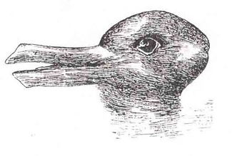
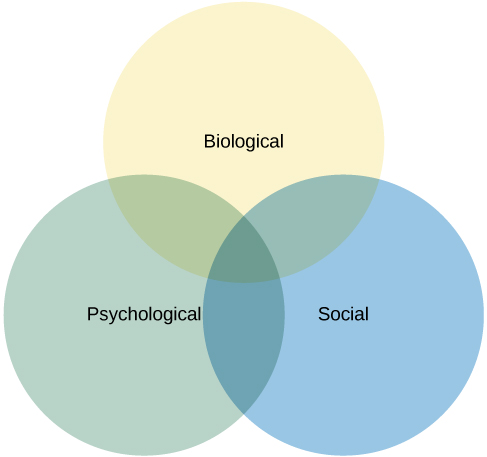

=======================
Contemporary Psychology
=======================

.. contents::
   :depth: 3
..

.. container::

   By the end of this section, you will be able to: \* Appreciate the
   diversity of interests and foci within psychology \* Understand basic
   interests and applications in each of the described areas of
   psychology \* Demonstrate familiarity with some of the major concepts
   or important figures in each of the described areas of psychology

Contemporary psychology is a diverse field that is influenced by all of
the historical perspectives described in the preceding section.
Reflective of the discipline’s diversity is the diversity seen within
the **American Psychological Association (APA)**\ {: data-type=“term”}.
The APA is a professional organization representing psychologists in the
United States. The APA is the largest organization of psychologists in
the world, and its mission is to advance and disseminate psychological
knowledge for the betterment of people. There are 56 divisions within
the APA, representing a wide variety of specialties that range from
Societies for the Psychology of Religion and Spirituality to Exercise
and Sport Psychology to Behavioral Neuroscience and Comparative
Psychology. Reflecting the diversity of the field of psychology itself,
members, affiliate members, and associate members span the spectrum from
students to doctoral-level psychologists, and come from a variety of
places including educational settings, criminal justice, hospitals, the
armed forces, and industry (American Psychological Association, 2014).
The Association for Psychological Science (APS) was founded in 1988 and
seeks to advance the scientific orientation of psychology. Its founding
resulted from disagreements between members of the scientific and
clinical branches of psychology within the APA. The APS publishes five
research journals and engages in education and advocacy with funding
agencies. A significant proportion of its members are international,
although the majority is located in the United States. Other
organizations provide networking and collaboration opportunities for
professionals of several ethnic or racial groups working in psychology,
such as the National Latina/o Psychological Association (NLPA), the
Asian American Psychological Association (AAPA), the Association of
Black Psychologists (ABPsi), and the Society of Indian Psychologists
(SIP). Most of these groups are also dedicated to studying psychological
and social issues within their specific communities.

This section will provide an overview of the major subdivisions within
psychology today in the order in which they are introduced throughout
the remainder of this textbook. This is not meant to be an exhaustive
listing, but it will provide insight into the major areas of research
and practice of modern-day psychologists.

.. container:: psychology link-to-learning

   Please visit this `website <http://openstax.org/l/biopsychology>`__
   to learn about the divisions within the APA.

   Student `resources <http://openstax.org/l/studentresource>`__ are
   also provided by the APA.

BIOPSYCHOLOGY AND EVOLUTIONARY PSYCHOLOGY
=========================================

As the name suggests, **biopsychology**\ {: data-type=“term”} explores
how our biology influences our behavior. While biological psychology is
a broad field, many biological psychologists want to understand how the
structure and function of the nervous system is related to behavior
(`[link] <#CNX_Psych_01_03_NervSystem>`__). As such, they often combine
the research strategies of both psychologists and physiologists to
accomplish this goal (as discussed in Carlson, 2013).

|An illustrated outline of a human body labeled “central nervous system”
shows the location of the “brain” and “spinal cord.” An illustrated
outline of the human body labeled “peripheral nervous system” shows many
“nerves” inside the body.|\ {: #CNX_Psych_01_03_NervSystem}

The research interests of biological psychologists span a number of
domains, including but not limited to, sensory and motor systems, sleep,
drug use and abuse, ingestive behavior, reproductive behavior,
neurodevelopment, plasticity of the nervous system, and biological
correlates of psychological disorders. Given the broad areas of interest
falling under the purview of biological psychology, it will probably
come as no surprise that individuals from all sorts of backgrounds are
involved in this research, including biologists, medical professionals,
physiologists, and chemists. This interdisciplinary approach is often
referred to as neuroscience, of which biological psychology is a
component (Carlson, 2013).

While biopsychology typically focuses on the immediate causes of
behavior based in the physiology of a human or other animal,
evolutionary psychology seeks to study the ultimate biological causes of
behavior. To the extent that a behavior is impacted by genetics, a
behavior, like any anatomical characteristic of a human or animal, will
demonstrate adaption to its surroundings. These surroundings include the
physical environment and, since interactions between organisms can be
important to survival and reproduction, the social environment. The
study of behavior in the context of evolution has its origins with
Charles Darwin, the co-discoverer of the theory of evolution by natural
selection. Darwin was well aware that behaviors should be adaptive and
wrote books titled, *The Descent of Man* (1871) and *The Expression of
the Emotions in Man and Animals* (1872), to explore this field.

Evolutionary psychology, and specifically, the **evolutionary
psychology**\ {: data-type=“term” .no-emphasis} of humans, has enjoyed a
resurgence in recent decades. To be subject to evolution by natural
selection, a behavior must have a significant genetic cause. In general,
we expect all human cultures to express a behavior if it is caused
genetically, since the genetic differences among human groups are small.
The approach taken by most evolutionary psychologists is to predict the
outcome of a behavior in a particular situation based on evolutionary
theory and then to make observations, or conduct experiments, to
determine whether the results match the theory. It is important to
recognize that these types of studies are not strong evidence that a
behavior is adaptive, since they lack information that the behavior is
in some part genetic and not entirely cultural (Endler, 1986).
Demonstrating that a trait, especially in humans, is naturally selected
is extraordinarily difficult; perhaps for this reason, some evolutionary
psychologists are content to assume the behaviors they study have
genetic determinants (Confer et al., 2010).

One other drawback of evolutionary psychology is that the traits that we
possess now evolved under environmental and social conditions far back
in human history, and we have a poor understanding of what these
conditions were. This makes predictions about what is adaptive for a
behavior difficult. Behavioral traits need not be adaptive under current
conditions, only under the conditions of the past when they evolved,
about which we can only hypothesize.

There are many areas of human behavior for which evolution can make
predictions. Examples include memory, mate choice, relationships between
kin, friendship and cooperation, parenting, social organization, and
status (Confer et al., 2010).

Evolutionary psychologists have had success in finding experimental
correspondence between observations and expectations. In one example, in
a study of mate preference differences between men and women that
spanned 37 cultures, Buss (1989) found that women valued earning
potential factors greater than men, and men valued potential
reproductive factors (youth and attractiveness) greater than women in
their prospective mates. In general, the predictions were in line with
the predictions of evolution, although there were deviations in some
cultures.

SENSATION AND PERCEPTION
========================

Scientists interested in both physiological aspects of sensory systems
as well as in the psychological experience of sensory information work
within the area of **sensation**\ {: data-type=“term” .no-emphasis} and
**perception**\ {: data-type=“term” .no-emphasis}
(`[link] <#CNX_Psych_01_03_DuckRabbit>`__). As such, sensation and
perception research is also quite interdisciplinary. Imagine walking
between buildings as you move from one class to another. You are
inundated with sights, sounds, touch sensations, and smells. You also
experience the temperature of the air around you and maintain your
balance as you make your way. These are all factors of interest to
someone working in the domain of sensation and perception.

|An ambiguous drawing looks like a duck facing to the left but also
looks like a rabbit facing to the right.|\ {:
#CNX_Psych_01_03_DuckRabbit}

As described in a later chapter that focuses on the results of studies
in sensation and perception, our experience of our world is not as
simple as the sum total of all of the sensory information (or
sensations) together. Rather, our experience (or perception) is complex
and is influenced by where we focus our attention, our previous
experiences, and even our cultural backgrounds.

COGNITIVE PSYCHOLOGY
====================

As mentioned in the previous section, the cognitive revolution created
an impetus for psychologists to focus their attention on better
understanding the mind and mental processes that underlie behavior.
Thus, **cognitive psychology**\ {: data-type=“term”} is the area of
psychology that focuses on studying cognitions, or thoughts, and their
relationship to our experiences and our actions. Like biological
psychology, cognitive psychology is broad in its scope and often
involves collaborations among people from a diverse range of
disciplinary backgrounds. This has led some to coin the term cognitive
science to describe the interdisciplinary nature of this area of
research (Miller, 2003).

Cognitive psychologists have research interests that span a spectrum of
topics, ranging from attention to problem solving to language to memory.
The approaches used in studying these topics are equally diverse. Given
such diversity, cognitive psychology is not captured in one chapter of
this text per se; rather, various concepts related to cognitive
psychology will be covered in relevant portions of the chapters in this
text on sensation and perception, thinking and intelligence, memory,
lifespan development, social psychology, and therapy.

.. container:: psychology link-to-learning

   View a `brief video <http://openstax.org/l/cogpsys>`__ recapping some
   of the major concepts explored by cognitive psychologists.

DEVELOPMENTAL PSYCHOLOGY
========================

**Developmental psychology**\ {: data-type=“term”} is the scientific
study of development across a lifespan. Developmental psychologists are
interested in processes related to physical maturation. However, their
focus is not limited to the physical changes associated with aging, as
they also focus on changes in cognitive skills, moral reasoning, social
behavior, and other psychological attributes.

Early developmental psychologists focused primarily on changes that
occurred through reaching adulthood, providing enormous insight into the
differences in physical, cognitive, and social capacities that exist
between very young children and adults. For instance, research by Jean
**Piaget**\ {: data-type=“term” .no-emphasis}
(`[link] <#CNX_Psych_01_03_Piaget>`__) demonstrated that very young
children do not demonstrate object permanence. Object permanence refers
to the understanding that physical things continue to exist, even if
they are hidden from us. If you were to show an adult a toy, and then
hide it behind a curtain, the adult knows that the toy still exists.
However, very young infants act as if a hidden object no longer exists.
The age at which object permanence is achieved is somewhat controversial
(Munakata, McClelland, Johnson, and Siegler, 1997).

|A photograph shows Jean Piaget.|\ {: #CNX_Psych_01_03_Piaget}

While Piaget was focused on cognitive changes during infancy and
childhood as we move to adulthood, there is an increasing interest in
extending research into the changes that occur much later in life. This
may be reflective of changing population demographics of developed
nations as a whole. As more and more people live longer lives, the
number of people of advanced age will continue to increase. Indeed, it
is estimated that there were just over 40 million people aged 65 or
older living in the United States in 2010. However, by 2020, this number
is expected to increase to about 55 million. By the year 2050, it is
estimated that nearly 90 million people in this country will be 65 or
older (Department of Health and Human Services, n.d.).

PERSONALITY PSYCHOLOGY
======================

**Personality psychology**\ {: data-type=“term”} focuses on patterns of
thoughts and behaviors that make each individual unique. Several
individuals (e.g., Freud and Maslow) that we have already discussed in
our historical overview of psychology, and the American psychologist
Gordon Allport, contributed to early theories of personality. These
early theorists attempted to explain how an individual’s personality
develops from his or her given perspective. For example, Freud proposed
that personality arose as conflicts between the conscious and
unconscious parts of the mind were carried out over the lifespan.
Specifically, Freud theorized that an individual went through various
psychosexual stages of development. According to Freud, adult
personality would result from the resolution of various conflicts that
centered on the migration of erogenous (or sexual pleasure-producing)
zones from the oral (mouth) to the anus to the phallus to the genitals.
Like many of Freud’s theories, this particular idea was controversial
and did not lend itself to experimental tests (Person, 1980).

More recently, the study of personality has taken on a more quantitative
approach. Rather than explaining how personality arises, research is
focused on identifying **personality traits**\ {: data-type=“term”},
measuring these traits, and determining how these traits interact in a
particular context to determine how a person will behave in any given
situation. Personality traits are relatively consistent patterns of
thought and behavior, and many have proposed that five trait dimensions
are sufficient to capture the variations in personality seen across
individuals. These five dimensions are known as the “Big Five” or the
**Five Factor model**\ {: data-type=“term” .no-emphasis}, and include
dimensions of conscientiousness, agreeableness, neuroticism, openness,
and extraversion (`[link] <#CNX_Psych_01_03_BigFive>`__). Each of these
traits has been demonstrated to be relatively stable over the lifespan
(e.g., Rantanen, Metsäpelto, Feldt, Pulkinnen, and Kokko, 2007; Soldz &
Vaillant, 1999; McCrae & Costa, 2008) and is influenced by genetics
(e.g., Jang, Livesly, and Vernon, 1996).

|A diagram includes five vertically stacked arrows, which point to the
left and right. A dimension's first letter, name, and description are
included inside of each arrow. A box to the left of each arrow includes
traits associated with a low score for that arrow's dimension. A box to
the right of each arrow includes traits associated with a high score for
that arrow's dimension. The top arrow includes the trait “openness,”
which is described with the words, “imagination,” “feelings,” “actions,”
and “ideas.” The box to the left of that arrow includes the words,
“practical,” “conventional,” and “prefers routine,” while the box to the
right of that arrow includes the words, “curious,” “wide range of
interests,” and “independent.” The next arrow includes the trait
“conscientiousness,” which is described with the words, “competence,”
“self-discipline,” “thoughtfulness,” and “goal-driven.” The box to the
left of that arrow includes the words, “impulsive,” “careless,” and
“disorganized,” while the box to the right of that arrow includes the
words, “hardworking,” “dependable,” and “organized.” The next arrow
includes the trait “extroversion,” which is described with the words,
“sociability,” “assertiveness,” and “emotional expression.” The box to
the left of that arrow includes the words, “quiet,” “reserved,” and
“withdrawn,” while the box to the right of that arrow includes the
words, “outgoing,” “warm,” and “seeks adventure.” The next arrow
includes the trait “agreeableness,” which is described with the words,
“cooperative,” “trustworthy,” and “good-natured.” The box to the left of
that arrow includes the words, “critical,” “uncooperative,” and
“suspicious,” while the box to the right of that arrow includes the
words, “helpful,” “trusting,” and “empathetic.” The next arrow includes
the trait “neuroticism,” which is described as “tendency toward unstable
emotions.” The box to the left of that arrow includes the words, “calm,”
“even-tempered,” and “secure,” while the box to the right of that arrow
includes the words, “anxious,” “unhappy,” and “prone to negative
emotions.”|\ {: #CNX_Psych_01_03_BigFive}

SOCIAL PSYCHOLOGY
=================

**Social psychology**\ {: data-type=“term” .no-emphasis} focuses on how
we interact with and relate to others. Social psychologists conduct
research on a wide variety of topics that include differences in how we
explain our own behavior versus how we explain the behaviors of others,
prejudice, and attraction, and how we resolve interpersonal conflicts.
Social psychologists have also sought to determine how being among other
people changes our own behavior and patterns of thinking.

There are many interesting examples of social psychological research,
and you will read about many of these in a later chapter of this
textbook. Until then, you will be introduced to one of the most
controversial psychological studies ever conducted. Stanley
**Milgram**\ {: data-type=“term” .no-emphasis} was an American social
psychologist who is most famous for research that he conducted on
obedience. After the holocaust, in 1961, a Nazi war criminal, Adolf
Eichmann, who was accused of committing mass atrocities, was put on
trial. Many people wondered how German soldiers were capable of
torturing prisoners in concentration camps, and they were unsatisfied
with the excuses given by soldiers that they were simply following
orders. At the time, most psychologists agreed that few people would be
willing to inflict such extraordinary pain and suffering, simply because
they were obeying orders. Milgram decided to conduct research to
determine whether or not this was true
(`[link] <#CNX_Psych_01_03_Milgram>`__). As you will read later in the
text, Milgram found that nearly two-thirds of his participants were
willing to deliver what they believed to be lethal shocks to another
person, simply because they were instructed to do so by an authority
figure (in this case, a man dressed in a lab coat). This was in spite of
the fact that participants received payment for simply showing up for
the research study and could have chosen not to inflict pain or more
serious consequences on another person by withdrawing from the study. No
one was actually hurt or harmed in any way, Milgram’s experiment was a
clever ruse that took advantage of research confederates, those who
pretend to be participants in a research study who are actually working
for the researcher and have clear, specific directions on how to behave
during the research study (Hock, 2009). Milgram’s and others’ studies
that involved deception and potential emotional harm to study
participants catalyzed the development of ethical guidelines for
conducting psychological research that discourage the use of deception
of research subjects, unless it can be argued not to cause harm and, in
general, requiring informed consent of participants.

|An advertisement reads: “Public Announcement. We will pay you $4.00 for
one hour of your time. Persons Needed for a Study of Memory. We will pay
five hundred New Haven men to help us complete a scientific study of
memory and learning. The study is being done at Yale University. Each
person who participates will be paid $4.00 (plus 50 cents carfare) for
approximately 1 hour’s time. We need you for only one hour: there are no
further obligations. You may choose the time you would like to come
(evenings, weekdays, or weekends). No special training, education, or
experience is needed. We want: factory workers, city employees,
laborers, barbers, businessmen, clerks, professional people, telephone
workers, construction workers, salespeople, white-collar workers, and
others. All persons must be between the ages of 20 and 50. High school
and college students cannot be used. If you meet these qualifications,
fill out the coupon below and mail it now to Professor Stanley Milgram,
Department of Psychology, Yale University, New Haven. You will be
notified later of the specific time and place of the study. We reserve
the right to decline any application. You will be paid $4.00 (plus 50
cents carfare) as soon as you arrive at the laboratory.” There is a
dotted line and the below section reads: “TO: PROF. STANLEY MILGRAM,
DEPARTMENT OF PSYCHOLOGY, YALE UNIVERSITY, NEW HAVEN, CONN. I want to
take part in this study of memory and learning. I am between the ages of
20 and 50. I will be paid $4.00 (plus 50 cents carfare) if I
participate.” Below this is a section to be filled out by the applicant.
The fields are NAME (Please Print), ADDRESS, TELEPHONE NO. Best time to
call you, AGE, OCCUPATION, SEX, CAN YOU COME: WEEKDAYS, EVENINGS,
WEEKENDS.|\ {: #CNX_Psych_01_03_Milgram}

INDUSTRIAL-ORGANIZATIONAL PSYCHOLOGY
====================================

**Industrial-Organizational psychology**\ {: data-type=“term”
.no-emphasis} (I-O psychology) is a subfield of psychology that applies
psychological theories, principles, and research findings in industrial
and organizational settings. I-O psychologists are often involved in
issues related to personnel management, organizational structure, and
workplace environment. Businesses often seek the aid of I-O
psychologists to make the best hiring decisions as well as to create an
environment that results in high levels of employee productivity and
efficiency. In addition to its applied nature, I-O psychology also
involves conducting scientific research on behavior within I-O settings
(Riggio, 2013).

HEALTH PSYCHOLOGY
=================

**Health psychology**\ {: data-type=“term” .no-emphasis} focuses on how
health is affected by the interaction of biological, psychological, and
sociocultural factors. This particular approach is known as the
**biopsychosocial model**\ {: data-type=“term”}
(`[link] <#CNX_Psych_01_03_BioPsych>`__). Health psychologists are
interested in helping individuals achieve better health through public
policy, education, intervention, and research. Health psychologists
might conduct research that explores the relationship between one’s
genetic makeup, patterns of behavior, relationships, psychological
stress, and health. They may research effective ways to motivate people
to address patterns of behavior that contribute to poorer health
(MacDonald, 2013).

|Three circles overlap in the middle. The circles are labeled
Biological, Psychological, and Social.|\ {: #CNX_Psych_01_03_BioPsych}

SPORT AND EXERCISE PSYCHOLOGY
=============================

Researchers in **sport and exercise psychology**\ {: data-type=“term”}
study the psychological aspects of sport performance, including
motivation and performance anxiety, and the effects of sport on mental
and emotional wellbeing. Research is also conducted on similar topics as
they relate to physical exercise in general. The discipline also
includes topics that are broader than sport and exercise but that are
related to interactions between mental and physical performance under
demanding conditions, such as fire fighting, military operations,
artistic performance, and surgery.

CLINICAL PSYCHOLOGY
===================

**Clinical psychology**\ {: data-type=“term”} is the area of psychology
that focuses on the diagnosis and treatment of psychological disorders
and other problematic patterns of behavior. As such, it is generally
considered to be a more applied area within psychology; however, some
clinicians are also actively engaged in scientific research.
**Counseling psychology**\ {: data-type=“term”} is a similar discipline
that focuses on emotional, social, vocational, and health-related
outcomes in individuals who are considered psychologically healthy.

As mentioned earlier, both Freud and Rogers provided perspectives that
have been influential in shaping how clinicians interact with people
seeking psychotherapy. While aspects of the psychoanalytic theory are
still found among some of today’s therapists who are trained from a
psychodynamic perspective, Roger’s ideas about client-centered
**therapy**\ {: data-type=“term” .no-emphasis} have been especially
influential in shaping how many clinicians operate. Furthermore, both
behaviorism and the cognitive revolution have shaped clinical practice
in the forms of behavioral therapy, cognitive therapy, and
cognitive-behavioral therapy (`[link] <#CNX_Psych_01_03_CogBehav>`__).
Issues related to the diagnosis and treatment of psychological disorders
and problematic patterns of behavior will be discussed in detail in
later chapters of this textbook.

|The points of an equilateral triangle are labeled “thoughts,”
“behaviors,” and “emotions.” There are arrows running along the sides of
the triangle with points on both ends, pointing to the labels.|\ {:
#CNX_Psych_01_03_CogBehav}

By far, this is the area of psychology that receives the most attention
in popular media, and many people mistakenly assume that all psychology
is clinical psychology.

FORENSIC PSYCHOLOGY
===================

**Forensic psychology**\ {: data-type=“term”} is a branch of psychology
that deals questions of psychology as they arise in the context of the
justice system. For example, forensic psychologists (and forensic
psychiatrists) will assess a person’s competency to stand trial, assess
the state of mind of a defendant, act as consultants on child custody
cases, consult on sentencing and treatment recommendations, and advise
on issues such as eyewitness testimony and children’s testimony
(American Board of Forensic Psychology, 2014). In these capacities, they
will typically act as expert witnesses, called by either side in a court
case to provide their research- or experience-based opinions. As expert
witnesses, forensic psychologists must have a good understanding of the
law and provide information in the context of the legal system rather
than just within the realm of psychology. Forensic psychologists are
also used in the jury selection process and witness preparation. They
may also be involved in providing psychological treatment within the
criminal justice system. Criminal profilers are a relatively small
proportion of psychologists that act as consultants to law enforcement.

.. container:: psychology link-to-learning

   The APA provides `career
   information <http://openstax.org/l/careers>`__ about various areas of
   psychology.

Summary
=======

Psychology is a diverse discipline that is made up of several major
subdivisions with unique perspectives. Biological psychology involves
the study of the biological bases of behavior. Sensation and perception
refer to the area of psychology that is focused on how information from
our sensory modalities is received, and how this information is
transformed into our perceptual experiences of the world around us.
Cognitive psychology is concerned with the relationship that exists
between thought and behavior, and developmental psychologists study the
physical and cognitive changes that occur throughout one’s lifespan.
Personality psychology focuses on individuals’ unique patterns of
behavior, thought, and emotion. Industrial and organizational
psychology, health psychology, sport and exercise psychology, forensic
psychology, and clinical psychology are all considered applied areas of
psychology. Industrial and organizational psychologists apply
psychological concepts to I-O settings. Health psychologists look for
ways to help people live healthier lives, and clinical psychology
involves the diagnosis and treatment of psychological disorders and
other problematic behavioral patterns. Sport and exercise psychologists
study the interactions between thoughts, emotions, and physical
performance in sports, exercise, and other activities. Forensic
psychologists carry out activities related to psychology in association
with the justice system.

Review Questions
================

.. container::

   .. container::

      A researcher interested in how changes in the cells of the
      hippocampus (a structure in the brain related to learning and
      memory) are related to memory formation would be most likely to
      identify as a(n) \_______\_ psychologist.

      1. biological
      2. health
      3. clinical
      4. social {: type=“a”}

   .. container::

      A

.. container::

   .. container::

      An individual’s consistent pattern of thought and behavior is
      known as a(n) \________.

      1. psychosexual stage
      2. object permanence
      3. personality
      4. perception {: type=“a”}

   .. container::

      C

.. container::

   .. container::

      In Milgram’s controversial study on obedience, nearly \_______\_
      of the participants were willing to administer what appeared to be
      lethal electrical shocks to another person because they were told
      to do so by an authority figure.

      1. 1/3
      2. 2/3
      3. 3/4
      4. 4/5 {: type=“a”}

   .. container::

      B

.. container::

   .. container::

      A researcher interested in what factors make an employee best
      suited for a given job would most likely identify as a(n)
      \_______\_ psychologist.

      1. personality
      2. clinical
      3. social
      4. I-O {: type=“a”}

   .. container::

      D

Critical Thinking Questions
===========================

.. container::

   .. container::

      Given the incredible diversity among the various areas of
      psychology that were described in this section, how do they all
      fit together?

   .. container::

      Although the different perspectives all operate on different
      levels of analyses, have different foci of interests, and
      different methodological approaches, all of these areas share a
      focus on understanding and/or correcting patterns of thought
      and/or behavior.

.. container::

   .. container::

      What are the potential ethical concerns associated with Milgram’s
      research on obedience?

   .. container::

      Many people have questioned how ethical this particular research
      was. Although no one was actually harmed in Milgram’s study, many
      people have questioned how the knowledge that you would be willing
      to inflict incredible pain and/or death to another person, simply
      because someone in authority told you to do so, would affect
      someone’s self-concept and psychological health. Furthermore, the
      degree to which deception was used in this particular study raises
      a few eyebrows.

Personal Application Question
=============================

.. container::

   .. container::

      Now that you’ve been briefly introduced to some of the major areas
      within psychology, which are you most interested in learning more
      about? Why?

.. container::

   .. rubric:: Glossary
      :name: glossary

   {: data-type=“glossary-title”}

   American Psychological Association
      professional organization representing psychologists in the United
      States ^
   biopsychology
      study of how biology influences behavior ^
   biopsychosocial model
      perspective that asserts that biology, psychology, and social
      factors interact to determine an individual’s health ^
   clinical psychology
      area of psychology that focuses on the diagnosis and treatment of
      psychological disorders and other problematic patterns of behavior
      ^
   cognitive psychology
      study of cognitions, or thoughts, and their relationship to
      experiences and actions ^
   counseling psychology
      area of psychology that focuses on improving emotional, social,
      vocational, and other aspects of the lives of psychologically
      healthy individuals ^
   developmental psychology
      scientific study of development across a lifespan ^
   forensic psychology
      area of psychology that applies the science and practice of
      psychology to issues within and related to the justice system ^
   personality psychology
      study of patterns of thoughts and behaviors that make each
      individual unique ^
   personality trait
      consistent pattern of thought and behavior ^
   sport and exercise psychology
      area of psychology that focuses on the interactions between mental
      and emotional factors and physical performance in sports,
      exercise, and other activities

.. |An illustrated outline of a human body labeled “central nervous system” shows the location of the “brain” and “spinal cord.” An illustrated outline of the human body labeled “peripheral nervous system” shows many “nerves” inside the body.| image:: ../resources/CNX_Psych_01_03_NervSystem.jpg

.. |A photograph shows Jean Piaget.| image:: ../resources/CNX_Psych_01_03_Piaget.jpg
.. |A diagram includes five vertically stacked arrows, which point to the left and right. A dimension's first letter, name, and description are included inside of each arrow. A box to the left of each arrow includes traits associated with a low score for that arrow's dimension. A box to the right of each arrow includes traits associated with a high score for that arrow's dimension. The top arrow includes the trait “openness,” which is described with the words, “imagination,” “feelings,” “actions,” and “ideas.” The box to the left of that arrow includes the words, “practical,” “conventional,” and “prefers routine,” while the box to the right of that arrow includes the words, “curious,” “wide range of interests,” and “independent.” The next arrow includes the trait “conscientiousness,” which is described with the words, “competence,” “self-discipline,” “thoughtfulness,” and “goal-driven.” The box to the left of that arrow includes the words, “impulsive,” “careless,” and “disorganized,” while the box to the right of that arrow includes the words, “hardworking,” “dependable,” and “organized.” The next arrow includes the trait “extroversion,” which is described with the words, “sociability,” “assertiveness,” and “emotional expression.” The box to the left of that arrow includes the words, “quiet,” “reserved,” and “withdrawn,” while the box to the right of that arrow includes the words, “outgoing,” “warm,” and “seeks adventure.” The next arrow includes the trait “agreeableness,” which is described with the words, “cooperative,” “trustworthy,” and “good-natured.” The box to the left of that arrow includes the words, “critical,” “uncooperative,” and “suspicious,” while the box to the right of that arrow includes the words, “helpful,” “trusting,” and “empathetic.” The next arrow includes the trait “neuroticism,” which is described as “tendency toward unstable emotions.” The box to the left of that arrow includes the words, “calm,” “even-tempered,” and “secure,” while the box to the right of that arrow includes the words, “anxious,” “unhappy,” and “prone to negative emotions.”| image:: ../resources/CNX_Psych_01_03_BigFive.jpg
.. |An advertisement reads: “Public Announcement. We will pay you $4.00 for one hour of your time. Persons Needed for a Study of Memory. We will pay five hundred New Haven men to help us complete a scientific study of memory and learning. The study is being done at Yale University. Each person who participates will be paid $4.00 (plus 50 cents carfare) for approximately 1 hour’s time. We need you for only one hour: there are no further obligations. You may choose the time you would like to come (evenings, weekdays, or weekends). No special training, education, or experience is needed. We want: factory workers, city employees, laborers, barbers, businessmen, clerks, professional people, telephone workers, construction workers, salespeople, white-collar workers, and others. All persons must be between the ages of 20 and 50. High school and college students cannot be used. If you meet these qualifications, fill out the coupon below and mail it now to Professor Stanley Milgram, Department of Psychology, Yale University, New Haven. You will be notified later of the specific time and place of the study. We reserve the right to decline any application. You will be paid $4.00 (plus 50 cents carfare) as soon as you arrive at the laboratory.” There is a dotted line and the below section reads: “TO: PROF. STANLEY MILGRAM, DEPARTMENT OF PSYCHOLOGY, YALE UNIVERSITY, NEW HAVEN, CONN. I want to take part in this study of memory and learning. I am between the ages of 20 and 50. I will be paid $4.00 (plus 50 cents carfare) if I participate.” Below this is a section to be filled out by the applicant. The fields are NAME (Please Print), ADDRESS, TELEPHONE NO. Best time to call you, AGE, OCCUPATION, SEX, CAN YOU COME: WEEKDAYS, EVENINGS, WEEKENDS.| image:: ../resources/CNX_Psych_01_03_Milgram.jpg

.. |The points of an equilateral triangle are labeled “thoughts,” “behaviors,” and “emotions.” There are arrows running along the sides of the triangle with points on both ends, pointing to the labels.| image:: ../resources/CNX_Psych_01_03_CogBehav.jpg
