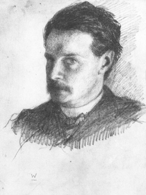
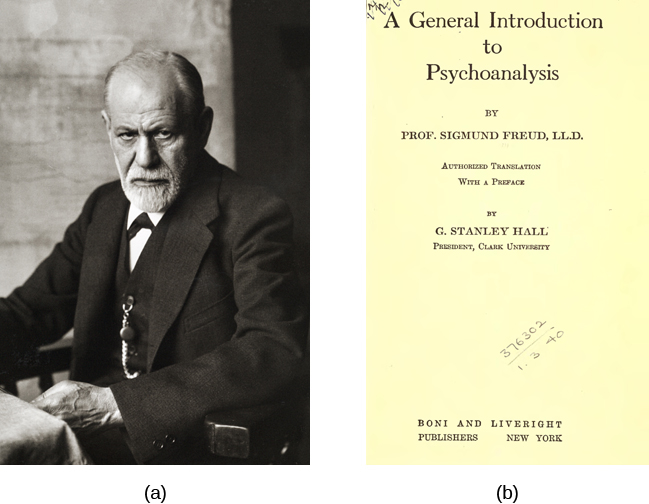
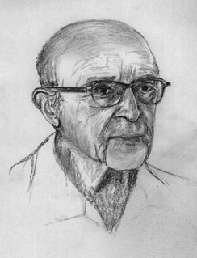

=====================
History of Psychology
=====================

.. contents::
   :depth: 3
..

.. container::

   By the end of this section, you will be able to: \* Understand the
   importance of Wundt and James in the development of psychology \*
   Appreciate Freud’s influence on psychology \* Understand the basic
   tenets of Gestalt psychology \* Appreciate the important role that
   behaviorism played in psychology’s history \* Understand basic tenets
   of humanism \* Understand how the cognitive revolution shifted
   psychology’s focus back to the mind

Psychology is a relatively young science with its experimental roots in
the 19th century, compared, for example, to human physiology, which
dates much earlier. As mentioned, anyone interested in exploring issues
related to the mind generally did so in a philosophical context prior to
the 19th century. Two men, working in the 19th century, are generally
credited as being the founders of psychology as a science and academic
discipline that was distinct from philosophy. Their names were Wilhelm
Wundt and William James. This section will provide an overview of the
shifts in paradigms that have influenced psychology from Wundt and James
through today.

WUNDT AND STRUCTURALISM
=======================

Wilhelm **Wundt**\ {: data-type=“term” .no-emphasis} (1832–1920) was a
German scientist who was the first person to be referred to as a
psychologist. His famous book entitled *Principles of Physiological
Psychology* was published in 1873. Wundt viewed psychology as a
scientific study of conscious experience, and he believed that the goal
of psychology was to identify components of consciousness and how those
components combined to result in our conscious experience. Wundt used
**introspection**\ {: data-type=“term”} (he called it “internal
perception”), a process by which someone examines their own conscious
experience as objectively as possible, making the human mind like any
other aspect of nature that a scientist observed. Wundt’s version of
introspection used only very specific experimental conditions in which
an external stimulus was designed to produce a scientifically observable
(repeatable) experience of the mind (Danziger, 1980). The first
stringent requirement was the use of “trained” or practiced observers,
who could immediately observe and report a reaction. The second
requirement was the use of repeatable stimuli that always produced the
same experience in the subject and allowed the subject to expect and
thus be fully attentive to the inner reaction. These experimental
requirements were put in place to eliminate “interpretation” in the
reporting of internal experiences and to counter the argument that there
is no way to know that an individual is observing their mind or
consciousness accurately, since it cannot be seen by any other person.
This attempt to understand the structure or characteristics of the mind
was known as **structuralism**\ {: data-type=“term”}. Wundt established
his psychology laboratory at the University at Leipzig in 1879
(`[link] <#CNX_Psych_01_02_Wundt>`__). In this laboratory, Wundt and his
students conducted experiments on, for example, reaction times. A
subject, sometimes in a room isolated from the scientist, would receive
a stimulus such as a light, image, or sound. The subject’s reaction to
the stimulus would be to push a button, and an apparatus would record
the time to reaction. Wundt could measure reaction time to
one-thousandth of a second (Nicolas & Ferrand, 1999).

|Photograph A shows Wilhelm Wundt. Photograph B shows Wundt and five
other people gathered around a desk with equipment on top of it.|\ {:
#CNX_Psych_01_02_Wundt}

However, despite his efforts to train individuals in the process of
introspection, this process remained highly subjective, and there was
very little agreement between individuals. As a result, structuralism
fell out of favor with the passing of Wundt’s student, Edward Titchener,
in 1927 (Gordon, 1995).

JAMES AND FUNCTIONALISM
=======================

William **James**\ {: data-type=“term” .no-emphasis} (1842–1910) was the
first American psychologist who espoused a different perspective on how
psychology should operate (`[link] <#CNX_Psych_01_02_James>`__). James
was introduced to Darwin’s theory of evolution by natural selection and
accepted it as an explanation of an organism’s characteristics. Key to
that theory is the idea that natural selection leads to organisms that
are adapted to their environment, including their behavior. Adaptation
means that a trait of an organism has a function for the survival and
reproduction of the individual, because it has been naturally selected.
As James saw it, psychology’s purpose was to study the function of
behavior in the world, and as such, his perspective was known as
**functionalism**\ {: data-type=“term”}. Functionalism focused on how
mental activities helped an organism fit into its environment.
Functionalism has a second, more subtle meaning in that functionalists
were more interested in the operation of the whole mind rather than of
its individual parts, which were the focus of structuralism. Like Wundt,
James believed that introspection could serve as one means by which
someone might study mental activities, but James also relied on more
objective measures, including the use of various recording devices, and
examinations of concrete products of mental activities and of anatomy
and physiology (Gordon, 1995).

|A drawing depicts the William James.|\ {: #CNX_Psych_01_02_James}

FREUD AND PSYCHOANALYTIC THEORY
===============================

Perhaps one of the most influential and well-known figures in
psychology’s history was Sigmund **Freud**\ {: data-type=“term”
.no-emphasis} (`[link] <#CNX_Psych_01_02_Freud>`__). Freud (1856–1939)
was an Austrian neurologist who was fascinated by patients suffering
from “hysteria” and neurosis. Hysteria was an ancient diagnosis for
disorders, primarily of women with a wide variety of symptoms, including
physical symptoms and emotional disturbances, none of which had an
apparent physical cause. Freud theorized that many of his patients’
problems arose from the unconscious mind. In Freud’s view, the
unconscious mind was a repository of feelings and urges of which we have
no awareness. Gaining access to the unconscious, then, was crucial to
the successful resolution of the patient’s problems. According to Freud,
the unconscious mind could be accessed through dream analysis, by
examinations of the first words that came to people’s minds, and through
seemingly innocent slips of the tongue. **Psychoanalytic theory**\ {:
data-type=“term”} focuses on the role of a person’s unconscious, as well
as early childhood experiences, and this particular perspective
dominated clinical psychology for several decades (Thorne & Henley,
2005).

|Photograph A shows Sigmund Freud. Image B shows the title page of his
book, A General Introduction to Psychoanalysis.|\ {:
#CNX_Psych_01_02_Freud}

Freud’s ideas were influential, and you will learn more about them when
you study lifespan development, personality, and therapy. For instance,
many therapists believe strongly in the unconscious and the impact of
early childhood experiences on the rest of a person’s life. The method
of psychoanalysis, which involves the patient talking about their
experiences and selves, while not invented by Freud, was certainly
popularized by him and is still used today. Many of Freud’s other ideas,
however, are controversial. Drew Westen (1998) argues that many of the
criticisms of Freud’s ideas are misplaced, in that they attack his older
ideas without taking into account later writings. Westen also argues
that critics fail to consider the success of the broad ideas that Freud
introduced or developed, such as the importance of childhood experiences
in adult motivations, the role of unconscious versus conscious
motivations in driving our behavior, the fact that motivations can cause
conflicts that affect behavior, the effects of mental representations of
ourselves and others in guiding our interactions, and the development of
personality over time. Westen identifies subsequent research support for
all of these ideas.

More modern iterations of Freud’s clinical approach have been
empirically demonstrated to be effective (Knekt et al., 2008; Shedler,
2010). Some current practices in psychotherapy involve examining
unconscious aspects of the self and relationships, often through the
relationship between the therapist and the client. Freud’s historical
significance and contributions to clinical practice merit his inclusion
in a discussion of the historical movements within psychology.

WERTHEIMER, KOFFKA, KÖHLER, AND GESTALT PSYCHOLOGY
==================================================

Max Wertheimer (1880–1943), Kurt Koffka (1886–1941), and Wolfgang Köhler
(1887–1967) were three German psychologists who immigrated to the United
States in the early 20th century to escape Nazi Germany. These men are
credited with introducing psychologists in the United States to various
Gestalt principles. The word **Gestalt**\ {: data-type=“term”
.no-emphasis} roughly translates to “whole;” a major emphasis of Gestalt
psychology deals with the fact that although a sensory experience can be
broken down into individual parts, how those parts relate to each other
as a whole is often what the individual responds to in perception. For
example, a song may be made up of individual notes played by different
instruments, but the real nature of the song is perceived in the
combinations of these notes as they form the melody, rhythm, and
harmony. In many ways, this particular perspective would have directly
contradicted Wundt’s ideas of structuralism (Thorne & Henley, 2005).

Unfortunately, in moving to the United States, these men were forced to
abandon much of their work and were unable to continue to conduct
research on a large scale. These factors along with the rise of
behaviorism (described next) in the United States prevented principles
of Gestalt psychology from being as influential in the United States as
they had been in their native Germany (Thorne & Henley, 2005). Despite
these issues, several Gestalt principles are still very influential
today. Considering the human individual as a whole rather than as a sum
of individually measured parts became an important foundation in
humanistic theory late in the century. The ideas of Gestalt have
continued to influence research on sensation and perception.

Structuralism, Freud, and the Gestalt psychologists were all concerned
in one way or another with describing and understanding inner
experience. But other researchers had concerns that inner experience
could be a legitimate subject of scientific inquiry and chose instead to
exclusively study behavior, the objectively observable outcome of mental
processes.

PAVLOV, WATSON, SKINNER, AND BEHAVIORISM
========================================

Early work in the field of behavior was conducted by the Russian
physiologist Ivan **Pavlov**\ {: data-type=“term” .no-emphasis}
(1849–1936). Pavlov studied a form of learning behavior called a
conditioned reflex, in which an animal or human produced a reflex
(unconscious) response to a stimulus and, over time, was conditioned to
produce the response to a different stimulus that the experimenter
associated with the original stimulus. The reflex Pavlov worked with was
salivation in response to the presence of food. The salivation reflex
could be elicited using a second stimulus, such as a specific sound,
that was presented in association with the initial food stimulus several
times. Once the response to the second stimulus was “learned,” the food
stimulus could be omitted. Pavlov’s “classical conditioning” is only one
form of learning behavior studied by behaviorists.

John B. **Watson**\ {: data-type=“term” .no-emphasis} (1878–1958) was an
influential American psychologist whose most famous work occurred during
the early 20th century at Johns Hopkins University
(`[link] <#CNX_Psych_01_02_Watson>`__). While Wundt and James were
concerned with understanding conscious experience, Watson thought that
the study of consciousness was flawed. Because he believed that
objective analysis of the mind was impossible, Watson preferred to focus
directly on observable behavior and try to bring that behavior under
control. Watson was a major proponent of shifting the focus of
psychology from the mind to behavior, and this approach of observing and
controlling behavior came to be known as **behaviorism**\ {:
data-type=“term”}. A major object of study by behaviorists was learned
behavior and its interaction with inborn qualities of the organism.
Behaviorism commonly used animals in experiments under the assumption
that what was learned using animal models could, to some degree, be
applied to human behavior. Indeed, Tolman (1938) stated, “I believe that
everything important in psychology (except … such matters as involve
society and words) can be investigated in essence through the continued
experimental and theoretical analysis of the determiners of rat behavior
at a choice-point in a maze.”

|A photograph shows John B. Watson.|\ {: #CNX_Psych_01_02_Watson}

Behaviorism dominated experimental psychology for several decades, and
its influence can still be felt today (Thorne & Henley, 2005).
Behaviorism is largely responsible for establishing psychology as a
scientific discipline through its objective methods and especially
experimentation. In addition, it is used in behavioral and
cognitive-behavioral therapy. Behavior modification is commonly used in
classroom settings. Behaviorism has also led to research on
environmental influences on human behavior.

B. F. **Skinner**\ {: data-type=“term” .no-emphasis} (1904–1990) was an
American psychologist (`[link] <#CNX_Psych_01_02_Skinner>`__). Like
Watson, Skinner was a behaviorist, and he concentrated on how behavior
was affected by its consequences. Therefore, Skinner spoke of
reinforcement and punishment as major factors in driving behavior. As a
part of his research, Skinner developed a chamber that allowed the
careful study of the principles of modifying behavior through
reinforcement and punishment. This device, known as an operant
conditioning chamber (or more familiarly, a Skinner box), has remained a
crucial resource for researchers studying behavior (Thorne & Henley,
2005).

|Photograph A shows B.F. Skinner. Illustration B shows a rat in a
Skinner box: a chamber with a speaker, lights, a lever, and a food
dispenser.|\ {: #CNX_Psych_01_02_Skinner}

The **Skinner box**\ {: data-type=“term” .no-emphasis} is a chamber that
isolates the subject from the external environment and has a behavior
indicator such as a lever or a button. When the animal pushes the button
or lever, the box is able to deliver a positive reinforcement of the
behavior (such as food) or a punishment (such as a noise) or a token
conditioner (such as a light) that is correlated with either the
positive reinforcement or punishment.

Skinner’s focus on positive and negative reinforcement of learned
behaviors had a lasting influence in psychology that has waned somewhat
since the growth of research in cognitive psychology. Despite this,
conditioned learning is still used in human behavioral modification.
Skinner’s two widely read and controversial popular science books about
the value of operant conditioning for creating happier lives remain as
thought-provoking arguments for his approach (Greengrass, 2004).

MASLOW, ROGERS, AND HUMANISM
============================

During the early 20th century, American psychology was dominated by
behaviorism and psychoanalysis. However, some psychologists were
uncomfortable with what they viewed as limited perspectives being so
influential to the field. They objected to the pessimism and determinism
(all actions driven by the unconscious) of Freud. They also disliked the
reductionism, or simplifying nature, of behaviorism. Behaviorism is also
deterministic at its core, because it sees human behavior as entirely
determined by a combination of genetics and environment. Some
psychologists began to form their own ideas that emphasized personal
control, intentionality, and a true predisposition for “good” as
important for our self-concept and our behavior. Thus, humanism emerged.
**Humanism**\ {: data-type=“term”} is a perspective within psychology
that emphasizes the potential for good that is innate to all humans. Two
of the most well-known proponents of humanistic psychology are Abraham
Maslow and Carl Rogers (O’Hara, n.d.).

Abraham **Maslow**\ {: data-type=“term” .no-emphasis} (1908–1970) was an
American psychologist who is best known for proposing a hierarchy of
human needs in motivating behavior
(`[link] <#CNX_Psych_01_02_Maslow>`__). Although this concept will be
discussed in more detail in a later chapter, a brief overview will be
provided here. Maslow asserted that so long as basic needs necessary for
survival were met (e.g., food, water, shelter), higher-level needs
(e.g., social needs) would begin to motivate behavior. According to
Maslow, the highest-level needs relate to self-actualization, a process
by which we achieve our full potential. Obviously, the focus on the
positive aspects of human nature that are characteristic of the
humanistic perspective is evident (Thorne & Henley, 2005). Humanistic
psychologists rejected, on principle, the research approach based on
reductionist experimentation in the tradition of the physical and
biological sciences, because it missed the “whole” human being.
Beginning with Maslow and Rogers, there was an insistence on a
humanistic research program. This program has been largely qualitative
(not measurement-based), but there exist a number of quantitative
research strains within humanistic psychology, including research on
happiness, self-concept, meditation, and the outcomes of humanistic
psychotherapy (Friedman, 2008).

|A triangle is divided vertically into five sections with corresponding
labels inside and outside of the triangle for each section. From top to
bottom, the triangle's sections are labeled: self-actualization
corresponds to “Inner fulfillment” esteem corresponds to “Self-worth,
accomplishment, confidence”; social corresponds to “Family, friendship,
intimacy, belonging” security corresponds to “Safety, employment,
assets”; “physiological corresponds to Food, water, shelter,
warmth.”|\ {: #CNX_Psych_01_02_Maslow}

Carl **Rogers**\ {: data-type=“term” .no-emphasis} (1902–1987) was also
an American psychologist who, like Maslow, emphasized the potential for
good that exists within all people
(`[link] <#CNX_Psych_01_02_Rogers>`__). Rogers used a therapeutic
technique known as client-centered therapy in helping his clients deal
with problematic issues that resulted in their seeking psychotherapy.
Unlike a psychoanalytic approach in which the therapist plays an
important role in interpreting what conscious behavior reveals about the
unconscious mind, client-centered therapy involves the patient taking a
lead role in the therapy session. Rogers believed that a therapist
needed to display three features to maximize the effectiveness of this
particular approach: unconditional positive regard, genuineness, and
empathy. Unconditional positive regard refers to the fact that the
therapist accepts their client for who they are, no matter what he or
she might say. Provided these factors, Rogers believed that people were
more than capable of dealing with and working through their own issues
(Thorne & Henley, 2005).

|A drawing depicts Carl Rogers.|\ {: #CNX_Psych_01_02_Rogers}

Humanism has been influential to psychology as a whole. Both Maslow and
Rogers are well-known names among students of psychology (you will read
more about both men later in this text), and their ideas have influenced
many scholars. Furthermore, Rogers’ client-centered approach to therapy
is still commonly used in psychotherapeutic settings today (O’hara,
n.d.)

.. container:: psychology link-to-learning

   View a brief `video <http://openstax.org/l/crogers1>`__ of Carl
   Rogers describing his therapeutic approach.

THE COGNITIVE REVOLUTION
========================

Behaviorism’s emphasis on objectivity and focus on external behavior had
pulled psychologists’ attention away from the mind for a prolonged
period of time. The early work of the humanistic psychologists
redirected attention to the individual human as a whole, and as a
conscious and self-aware being. By the 1950s, new disciplinary
perspectives in linguistics, neuroscience, and computer science were
emerging, and these areas revived interest in the mind as a focus of
scientific inquiry. This particular perspective has come to be known as
the cognitive revolution (Miller, 2003). By 1967, Ulric Neisser
published the first textbook entitled *Cognitive Psychology*, which
served as a core text in cognitive psychology courses around the country
(Thorne & Henley, 2005).

Although no one person is entirely responsible for starting the
cognitive revolution, Noam Chomsky was very influential in the early
days of this movement (`[link] <#CNX_Psych_01_02_Chomsky>`__). Chomsky
(1928–), an American linguist, was dissatisfied with the influence that
behaviorism had had on psychology. He believed that psychology’s focus
on behavior was short-sighted and that the field had to re-incorporate
mental functioning into its purview if it were to offer any meaningful
contributions to understanding behavior (Miller, 2003).

|A photograph shows a mural on the side of a building. The mural
includes Chomsky's face, along with some newspapers, televisions, and
cleaning products. At the top of the mural, it reads “Noam Chomsky.” At
the bottom of the mural, it reads “the most important intellectual
alive.”|\ {: #CNX_Psych_01_02_Chomsky}

European psychology had never really been as influenced by behaviorism
as had American psychology; and thus, the cognitive revolution helped
reestablish lines of communication between European psychologists and
their American counterparts. Furthermore, psychologists began to
cooperate with scientists in other fields, like anthropology,
linguistics, computer science, and neuroscience, among others. This
interdisciplinary approach often was referred to as the cognitive
sciences, and the influence and prominence of this particular
perspective resonates in modern-day psychology (Miller, 2003).

.. container:: psychology dig-deeper

   .. container::

      Feminist Psychology

   The science of psychology has had an impact on human wellbeing, both
   positive and negative. The dominant influence of Western, white, and
   male academics in the early history of psychology meant that
   psychology developed with the biases inherent in those individuals,
   which often had negative consequences for members of society that
   were not white or male. Women, members of ethnic minorities in both
   the United States and other countries, and individuals with sexual
   orientations other than heterosexual had difficulties entering the
   field of psychology and therefore influencing its development. They
   also suffered from the attitudes of white, male psychologists, who
   were not immune to the nonscientific attitudes prevalent in the
   society in which they developed and worked. Until the 1960s, the
   science of psychology was largely a “womanless” psychology (Crawford
   & Marecek, 1989), meaning that few women were able to practice
   psychology, so they had little influence on what was studied. In
   addition, the experimental subjects of psychology were mostly men,
   which resulted from underlying assumptions that gender had no
   influence on psychology and that women were not of sufficient
   interest to study.

   An article by Naomi Weisstein, first published in 1968 (Weisstein,
   1993), stimulated a feminist revolution in psychology by presenting a
   critique of psychology as a science. She also specifically criticized
   male psychologists for constructing the psychology of women entirely
   out of their own cultural biases and without careful experimental
   tests to verify any of their characterizations of women. Weisstein
   used, as examples, statements by prominent psychologists in the
   1960s, such as this quote by Bruno Bettleheim: “. . . we must start
   with the realization that, as much as women want to be good
   scientists or engineers, they want first and foremost to be womanly
   companions of men and to be mothers.” Weisstein’s critique formed the
   foundation for the subsequent development of a feminist psychology
   that attempted to be free of the influence of male cultural biases on
   our knowledge of the psychology of women and, indeed, of both
   genders.

   Crawford & Marecek (1989) identify several feminist approaches to
   psychology that can be described as feminist psychology. These
   include re-evaluating and discovering the contributions of women to
   the history of psychology, studying psychological gender differences,
   and questioning the male bias present across the practice of the
   scientific approach to knowledge.

MULTICULTURAL PSYCHOLOGY
========================

Culture has important impacts on individuals and social psychology, yet
the effects of **culture**\ {: data-type=“term” .no-emphasis} on
psychology are under-studied. There is a risk that psychological
theories and data derived from white, American settings could be assumed
to apply to individuals and social groups from other cultures and this
is unlikely to be true (Betancourt & López, 1993). One weakness in the
field of cross-cultural psychology is that in looking for differences in
psychological attributes across cultures, there remains a need to go
beyond simple descriptive statistics (Betancourt & López, 1993). In this
sense, it has remained a descriptive science, rather than one seeking to
determine cause and effect. For example, a study of characteristics of
individuals seeking treatment for a binge eating disorder in Hispanic
American, African American, and Caucasian American individuals found
significant differences between groups (Franko et al., 2012). The study
concluded that results from studying any one of the groups could not be
extended to the other groups, and yet potential causes of the
differences were not measured.

This history of multicultural psychology in the United States is a long
one. The role of African American psychologists in researching the
cultural differences between African American individual and social
psychology is but one example. In 1920, Cecil Sumner was the first
African American to receive a PhD in psychology in the United States.
Sumner established a psychology degree program at Howard University,
leading to the education of a new generation of African American
psychologists (Black, Spence, and Omari, 2004). Much of the work of
early African American psychologists (and a general focus of much work
in first half of the 20th century in psychology in the United States)
was dedicated to testing and intelligence testing in particular (Black
et al., 2004). That emphasis has continued, particularly because of the
importance of testing in determining opportunities for children, but
other areas of exploration in African-American psychology research
include learning style, sense of community and belonging, and
spiritualism (Black et al., 2004).

The American Psychological Association has several ethnically based
organizations for professional psychologists that facilitate
interactions among members. Since psychologists belonging to specific
ethnic groups or cultures have the most interest in studying the
psychology of their communities, these organizations provide an
opportunity for the growth of research on the impact of culture on
individual and social psychology.

.. container:: psychology link-to-learning

   Read a `news story <http://openstax.org/l/crogers2>`__ about the
   influence of an African American’s psychology research on the
   historic *Brown v. Board of Education* civil rights case.

Summary
=======

Before the time of Wundt and James, questions about the mind were
considered by philosophers. However, both Wundt and James helped create
psychology as a distinct scientific discipline. Wundt was a
structuralist, which meant he believed that our cognitive experience was
best understood by breaking that experience into its component parts. He
thought this was best accomplished by introspection.

William James was the first American psychologist, and he was a
proponent of functionalism. This particular perspective focused on how
mental activities served as adaptive responses to an organism’s
environment. Like Wundt, James also relied on introspection; however,
his research approach also incorporated more objective measures as well.

Sigmund Freud believed that understanding the unconscious mind was
absolutely critical to understand conscious behavior. This was
especially true for individuals that he saw who suffered from various
hysterias and neuroses. Freud relied on dream analysis, slips of the
tongue, and free association as means to access the unconscious.
Psychoanalytic theory remained a dominant force in clinical psychology
for several decades.

Gestalt psychology was very influential in Europe. Gestalt psychology
takes a holistic view of an individual and his experiences. As the Nazis
came to power in Germany, Wertheimer, Koffka, and Köhler immigrated to
the United States. Although they left their laboratories and their
research behind, they did introduce America to Gestalt ideas. Some of
the principles of Gestalt psychology are still very influential in the
study of sensation and perception.

One of the most influential schools of thought within psychology’s
history was behaviorism. Behaviorism focused on making psychology an
objective science by studying overt behavior and deemphasizing the
importance of unobservable mental processes. John Watson is often
considered the father of behaviorism, and B. F. Skinner’s contributions
to our understanding of principles of operant conditioning cannot be
underestimated.

As behaviorism and psychoanalytic theory took hold of so many aspects of
psychology, some began to become dissatisfied with psychology’s picture
of human nature. Thus, a humanistic movement within psychology began to
take hold. Humanism focuses on the potential of all people for good.
Both Maslow and Rogers were influential in shaping humanistic
psychology.

During the 1950s, the landscape of psychology began to change. A science
of behavior began to shift back to its roots of focus on mental
processes. The emergence of neuroscience and computer science aided this
transition. Ultimately, the cognitive revolution took hold, and people
came to realize that cognition was crucial to a true appreciation and
understanding of behavior.

Review Questions
================

.. container::

   .. container::

      Based on your reading, which theorist would have been most likely
      to agree with this statement: Perceptual phenomena are best
      understood as a combination of their components.

      1. William James
      2. Max Wertheimer
      3. Carl Rogers
      4. Noam Chomsky {: type=“a”}

   .. container::

      B

.. container::

   .. container::

      \_______\_ is most well-known for proposing his hierarchy of
      needs.

      1. Noam Chomsky
      2. Carl Rogers
      3. Abraham Maslow
      4. Sigmund Freud {: type=“a”}

   .. container::

      C

.. container::

   .. container::

      Rogers believed that providing genuineness, empathy, and
      \_______\_ in the therapeutic environment for his clients was
      critical to their being able to deal with their problems.

      1. structuralism
      2. functionalism
      3. Gestalt
      4. unconditional positive regard {: type=“a”}

   .. container::

      D

.. container::

   .. container::

      The operant conditioning chamber (aka \_______\_ box) is a device
      used to study the principles of operant conditioning.

      1. Skinner
      2. Watson
      3. James
      4. Koffka {: type=“a”}

   .. container::

      A

Critical Thinking Questions
===========================

.. container::

   .. container::

      How did the object of study in psychology change over the history
      of the field since the 19th century?

   .. container::

      In its early days, psychology could be defined as the scientific
      study of mind or mental processes. Over time, psychology began to
      shift more towards the scientific study of behavior. However, as
      the cognitive revolution took hold, psychology once again began to
      focus on mental processes as necessary to the understanding of
      behavior.

.. container::

   .. container::

      In part, what aspect of psychology was the behaviorist approach to
      psychology a reaction to?

   .. container::

      Behaviorists studied objectively observable behavior partly in
      reaction to the psychologists of the mind who were studying things
      that were not directly observable.

Personal Application Questions
==============================

.. container::

   .. container::

      Freud is probably one of the most well-known historical figures in
      psychology. Where have you encountered references to Freud or his
      ideas about the role that the unconscious mind plays in
      determining conscious behavior?

.. container::

   .. rubric:: Glossary
      :name: glossary

   {: data-type=“glossary-title”}

   behaviorism
      focus on observing and controlling behavior ^
   functionalism
      focused on how mental activities helped an organism adapt to its
      environment ^
   humanism
      perspective within psychology that emphasizes the potential for
      good that is innate to all humans ^
   introspection
      process by which someone examines their own conscious experience
      in an attempt to break it into its component parts ^
   psychoanalytic theory
      focus on the role of the unconscious in affecting conscious
      behavior ^
   structuralism
      understanding the conscious experience through introspection

.. |Photograph A shows Wilhelm Wundt. Photograph B shows Wundt and five other people gathered around a desk with equipment on top of it.| image:: ../resources/CNX_Psych_01_02_Wundt.jpg

.. |A photograph shows John B. Watson.| image:: ../resources/CNX_Psych_01_02_Watson.jpg
.. |Photograph A shows B.F. Skinner. Illustration B shows a rat in a Skinner box: a chamber with a speaker, lights, a lever, and a food dispenser.| image:: ../resources/CNX_Psych_01_02_Skinner.jpg
.. |A triangle is divided vertically into five sections with corresponding labels inside and outside of the triangle for each section. From top to bottom, the triangle's sections are labeled: self-actualization corresponds to “Inner fulfillment” esteem corresponds to “Self-worth, accomplishment, confidence”; social corresponds to “Family, friendship, intimacy, belonging” security corresponds to “Safety, employment, assets”; “physiological corresponds to Food, water, shelter, warmth.”| image:: ../resources/CNX_Psych_01_02_Maslow.jpg

.. |A photograph shows a mural on the side of a building. The mural includes Chomsky's face, along with some newspapers, televisions, and cleaning products. At the top of the mural, it reads “Noam Chomsky.” At the bottom of the mural, it reads “the most important intellectual alive.”| image:: ../resources/CNX_Psych_01_02_Chomsky.jpg
