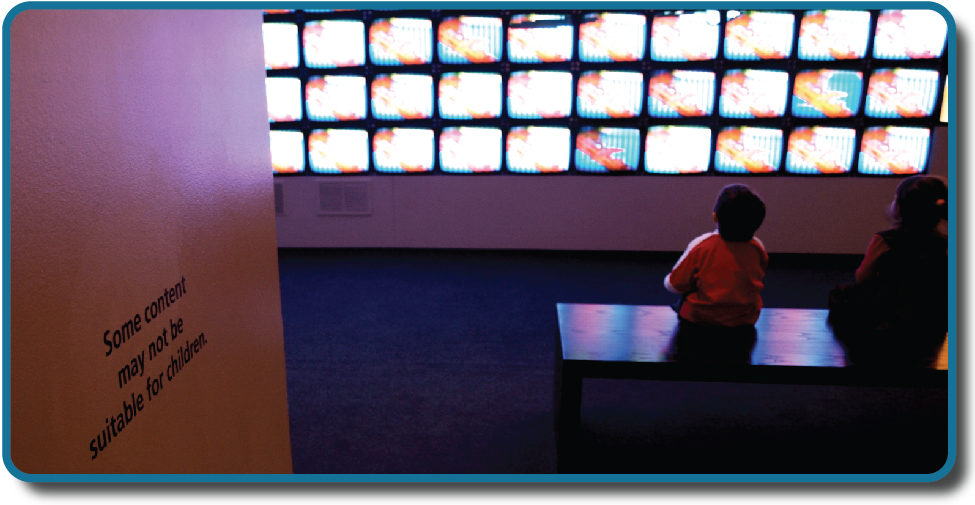

============
Introduction
============

.. contents::
   :depth: 3
..

class=“introduction”

class=“summary” title=“Summary”

class=“review-questions” title=“Review Questions”

class=“critical-thinking” title=“Critical Thinking Questions”

class=“personal-application” title=“Personal Application Questions”

class=“references” title=“References”

|Children sit in front of a bank of television screens. A sign on the
wall says, “Some content may not be suitable for children.”|\ {:}

Have you ever wondered whether the violence you see on television
affects your behavior? Are you more likely to behave aggressively in
real life after watching people behave violently in dramatic situations
on the screen? Or, could seeing fictional violence actually get
aggression out of your system, causing you to be more peaceful? How are
children influenced by the media they are exposed to? A psychologist
interested in the relationship between behavior and exposure to violent
images might ask these very questions.

The topic of violence in the media today is contentious. Since ancient
times, humans have been concerned about the effects of new technologies
on our behaviors and thinking processes. The Greek philosopher Socrates,
for example, worried that writing—a new technology at that time—would
diminish people’s ability to remember because they could rely on written
records rather than committing information to memory. In our world of
quickly changing technologies, questions about the effects of media
continue to emerge. Many of us find ourselves with a strong opinion on
these issues, only to find the person next to us bristling with the
opposite view.

How can we go about finding answers that are supported not by mere
opinion, but by evidence that we can all agree on? The findings of
psychological research can help us navigate issues like this.

References
==========

American Academy of Pediatrics, American Academy of Child & Adolescent
Psychiatry, American Psychological Association, American Medical
Association, American Academy of Family Physicians, American Psychiatric
Association. (2000). *Joint statement on the impact of entertainment
violence on children*. Retrieved from
http://www2.aap.org/advocacy/releases/jstmtevc.htm.

American Cancer Society. (n.d.). History of the cancer prevention
studies\ *.* Retrieved from
http://www.cancer.org/research/researchtopreventcancer/history-cancer-prevention-study

American Psychological Association. (2009). *Publication Manual of the
American Psychological Association* (6th ed.). Washington, DC: Author.

American Psychological Association. (n.d.). Research with animals in
psychology. Retrieved from
https://www.apa.org/research/responsible/research-animals.pdf

Arnett, J. (2008). The neglected 95%: Why American psychology needs to
become less American. *American Psychologist, 63*\ (7), 602–614.

Barton, B. A., Eldridge, A. L., Thompson, D., Affenito, S. G.,
Striegel-Moore, R. H., Franko, D. L., . . . Crockett, S. J. (2005). The
relationship of breakfast and cereal consumption to nutrient intake and
body mass index: The national heart, lung, and blood institute growth
and health study. *Journal of the American Dietetic Association,
105*\ (9), 1383–1389. Retrieved from
http://dx.doi.org/10.1016/j.jada.2005.06.003

Chwalisz, K., Diener, E., & Gallagher, D. (1988). Autonomic arousal
feedback and emotional experience: Evidence from the spinal cord
injured. *Journal of Personality and Social Psychology, 54*, 820–828.

Clayton, R. R., Cattarello, A. M., & Johnstone, B. M. (1996). The
effectiveness of Drug Abuse Resistance Education (Project DARE): 5-year
follow-up results. *Preventive Medicine: An International Journal
Devoted to Practice and Theory, 25*\ (3), 307–318.
doi:10.1006/pmed.1996.0061

D.A.R.E. (n.d\ *.*). D.A.R.E. is substance abuse prevention education
and much more! [About page] Retrieved from
http://www.dare.org/about-d-a-r-e/

Dominus, S. (2011, May 25). Could conjoined twins share a mind? New York
Times Sunday Magazine. Retrieved from
http://www.nytimes.com/2011/05/29/magazine/could-conjoined-twins-share-a-mind.html?\_r=5&hp&

Ennett, S. T., Tobler, N. S., Ringwalt, C. L., & Flewelling, R. L.
(1994). How effective is drug abuse resistance education? A
meta-analysis of Project DARE outcome evaluations. *American Journal of
Public Health, 84*\ (9), 1394–1401. doi:10.2105/AJPH.84.9.1394

Fanger, S. M., Frankel, L. A., & Hazen, N. (2012). Peer exclusion in
preschool children’s play: Naturalistic observations in a playground
setting. *Merrill-Palmer Quarterly*, 58, 224–254.

Fiedler, K. (2004). Illusory correlation. In R. F. Pohl (Ed.),
*Cognitive illusions: A handbook on fallacies and biases in thinking,
judgment and memory* (pp. 97–114). New York, NY: Psychology Press.

Frantzen, L. B., Treviño, R. P., Echon, R. M., Garcia-Dominic, O., &
DiMarco, N. (2013). Association between frequency of ready-to-eat cereal
consumption, nutrient intakes, and body mass index in fourth- to
sixth-grade low-income minority children. *Journal of the Academy of
Nutrition and Dietetics, 113*\ (4), 511–519.

Harper, J. (2013, July 5). Ice cream and crime: Where cold cuisine and
hot disputes intersect. The Times-Picaune. Retrieved from
http://www.nola.com/crime/index.ssf/2013/07/ice\_cream\_and\_crime\_where\_hot.html

Jenkins, W. J., Ruppel, S. E., Kizer, J. B., Yehl, J. L., & Griffin, J.
L. (2012). An examination of post 9-11 attitudes towards Arab Americans.
*North American Journal of Psychology, 14*, 77–84.

Jones, J. M. (2013, May 13). Same-sex marriage support solidifies above
50% in U.S. Gallup Politics. Retrieved from
http://www.gallup.com/poll/162398/sex-marriage-support-solidifies-above.aspx

Kobrin, J. L., Patterson, B. F., Shaw, E. J., Mattern, K. D., & Barbuti,
S. M. (2008). *Validity of the SAT for predicting first-year college
grade point average* (Research Report No. 2008-5). Retrieved from
https://research.collegeboard.org/sites/default/files/publications/2012/7/researchreport-2008-5-validity-sat-predicting-first-year-college-grade-point-average.pdf

Lewin, T. (2014, March 5). A new SAT aims to realign with schoolwork.
*New York Times*. Retreived from
http://www.nytimes.com/2014/03/06/education/major-changes-in-sat-announced-by-college-board.html.

Lowcock, E. C., Cotterchio, M., Anderson, L. N., Boucher, B. A., &
El-Sohemy, A. (2013). High coffee intake, but not caffeine, is
associated with reduced estrogen receptor negative and postmenopausal
breast cancer risk with no effect modification by CYP1A2 genotype.
*Nutrition and Cancer, 65*\ (3), 398–409.
doi:10.1080/01635581.2013.768348

Lowry, M., Dean, K., & Manders, K. (2010). The link between sleep
quantity and academic performance for the college student. *Sentience:
The University of Minnesota Undergraduate Journal of Psychology,*
*3*\ (Spring), 16–19. Retrieved from
http://www.psych.umn.edu/sentience/files/SENTIENCE\_Vol3.pdf

Lynam, D. R., Milich, R., Zimmerman, R., Novak, S. P., Logan, T. K.,
Martin, C., . . . Clayton, R. (1999). Project DARE: No effects at
10-year follow-up. *Journal of Consulting and Clinical Psychology,
67*\ (4), 590–593. doi:10.1037/0022-006X.67.4.590

McKie, R. (2010, June 26). Chimps with everything: Jane Goodall’s 50
years in the jungle. *The Guardian*. Retrieved from
http://www.theguardian.com/science/2010/jun/27/jane-goodall-chimps-africa-interview

Offit, P. (2008). *Autism's false prophets: Bad science, risky medicine,
and the search for a cure*. New York: Columbia University Press.

Perkins, H. W., Haines, M. P., & Rice, R. (2005). Misperceiving the
college drinking norm and related problems: A nationwide study of
exposure to prevention information, perceived norms and student alcohol
misuse. *J. Stud. Alcohol, 66*\ (4), 470–478.

Rimer, S. (2008, September 21). College panel calls for less focus on
SATs. *The New York Times.* Retrieved from
http://www.nytimes.com/2008/09/22/education/22admissions.html?\_r=0

Ringwalt, C., Ennett, S. T., & Holt, K. D. (1991). An outcome evaluation
of Project DARE (Drug Abuse Resistance Education). *Health Education
Research, 6*\ (3), 327–337. doi:10.1093/her/6.3.327

Rothstein, J. M. (2004). College performance predictions and the SAT.
*Journal of Econometrics, 121*, 297–317.

Rotton, J., & Kelly, I. W. (1985). Much ado about the full moon: A
meta-analysis of lunar-lunacy research. *Psychological Bulletin,
97*\ (2), 286–306. doi:10.1037/0033-2909.97.2.286

Santelices, M. V., & Wilson, M. (2010). Unfair treatment? The case of
Freedle, the SAT, and the standardization approach to differential item
functioning. *Harvard Education Review, 80*, 106–134.

Sears, D. O. (1986). College sophomores in the laboratory: Influences of
a narrow data base on social psychology’s view of human nature. *Journal
of Personality and Social Psychology, 51*, 515–530.

Tuskegee University. (n.d.). *About the USPHS Syphilis Study*. Retrieved
from
http://www.tuskegee.edu/about\_us/centers\_of\_excellence/bioethics\_center/about\_the\_usphs\_syphilis\_study.aspx.

