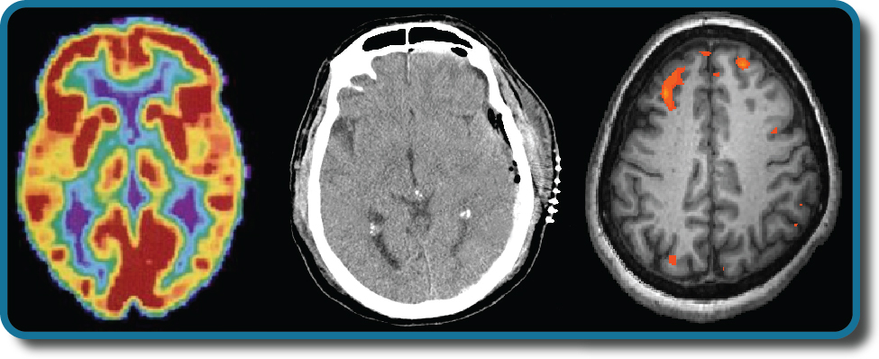

============
Introduction
============

.. contents::
   :depth: 3
..

class=“introduction”

class=“summary” title=“Summary”

class=“review-questions” title=“Review Questions”

class=“critical-thinking” title=“Critical Thinking Questions”

class=“personal-application” title=“Personal Application Questions”

class=“references” title=“References”

|Three brain-imaging scans are shown.|\ {:}

Have you ever taken a device apart to find out how it works? Many of us
have done so, whether to attempt a repair or simply to satisfy our
curiosity. A device’s internal workings are often distinct from its user
interface on the outside. For example, we don’t think about microchips
and circuits when we turn up the volume on a mobile phone; instead, we
think about getting the volume just right. Similarly, the inner workings
of the human body are often distinct from the external expression of
those workings. It is the job of psychologists to find the connection
between these—for example, to figure out how the firings of millions of
neurons become a thought.

This chapter strives to explain the biological mechanisms that underlie
behavior. These physiological and anatomical foundations are the basis
for many areas of psychology. In this chapter, you will learn how
genetics influence both physiological and psychological traits. You will
become familiar with the structure and function of the nervous system.
And, finally, you will learn how the nervous system interacts with the
endocrine system.

References
==========

Arnst, C. (2003, November). Commentary: Getting rational about
health-care rationing. *Bloomberg Businessweek Magazine*. Retrieved from
http://www.businessweek.com/stories/2003-11-16/commentary-getting-rational-about-health-care-rationing

Berridge, K. C., & Robinson, T. E. (1998). What is the role of dopamine
in reward: Hedonic impact, reward learning, or incentive salience?
*Brain Research Reviews, 28*, 309–369.

Chandola, T., Brunner, E., & Marmot, M. (2006). Chronic stress at work
and the metabolic syndrome: A prospective study. *BMJ, 332*, 521–524.

Comings, D. E., Gonzales, N., Saucier, G., Johnson, J. P., & MacMurray,
J. P. (2000). The DRD4 gene and the spiritual transcendence scale of the
character temperament index. *Psychiatric Genetics, 10*, 185–189.

Confer, J. C., Easton, J. A., Fleischman, D. S., Goetz, C. D., Lewis, D.
M. G, Perilloux, C., & Buss, D. M. (2010). Evolutionary psychology:
Controversies, questions, prospects, and limitations. *American
Psychologist, 65*, 110–126.

Gaines, C. (2013, August). An A-Rod suspension would save the Yankees as
much as $37.5 million in 2014 alone. *Business Insider*. Retrieved from
http://www.businessinsider.com/an-a-rod-suspension-would-save-the-yankees-as-much-as-375-million-in-2014-2013-8

Gardner, E. L. (2011). Addiction and brain reward and antireward
pathways. *Advances in Psychosomatic Medicine, 30*, 22–60.

George, O., Le Moal, M., & Koob, G. F. (2012). Allostasis and addiction:
Role of the dopamine and corticotropin-releasing factor systems.
*Physiology & Behavior, 106*, 58–64.

Glaser, R., & Kiecolt-Glaser, J. K. (2005). Stress-induced immune
dysfunction: Implications for health. *Nature Reviews Immunology, 5*,
243–251.

Gong, L., Parikh, S., Rosenthal, P. J., & Greenhouse, B. (2013).
Biochemical and immunological mechanisms by which sickle cell trait
protects against malaria. *Malaria Journal*. Advance online publication.
doi:10.1186/1475-2875-12-317

Hardt, O., Einarsson, E. Ö., & Nader, K. (2010). A bridge over troubled
water: Reconsolidation as a link between cognitive and neuroscientific
memory research traditions. *Annual Review of Psychology, 61*, 141–167.

Macmillan, M. (1999). The Phineas Gage Information Page. Retrieved from
http://www.uakron.edu/gage

March, J. S., Silva, S., Petrycki, S., Curry, J., Wells, K., Fairbank,
J., … Severe, J. (2007). The treatment for adolescents with depression
study (TADS): Long-term effectiveness and safety outcomes. *Arch Gen
Psychiatry, 64*, 1132–1143.

Mustanski, B. S., DuPree, M. G., Nievergelt, C. M., Bocklandt, S.,
Schork, N. J., & Hamer, D. H. (2005). A genome wide scan of male sexual
orientation. *Human Genetics, 116*, 272–278.

National Institute on Drug Abuse. (2001, July). Anabolic steroid abuse:
What are the health consequences of steroid abuse? *National Institutes
of Health*. Retrieved from
http://www.drugabuse.gov/publications/research-reports/anabolic-steroid-abuse/what-are-health-consequences-steroid-abuse

Squire, L. R. (2009). The legacy of patient H. M. for neuroscience.
*Neuron, 61*, 6–9.

Tienari, P., Wynne, L. C., Sorri, A., et al. (2004).
Genotype–environment interaction in schizophrenia spectrum disorder:
long-term follow-up study of Finnish adoptees. *British Journal of
Psychiatry, 184*, 216–222.

University of Utah Genetic Science Learning Center. (n.d.). What are
genetic disorders? Retrieved from
http://learn.genetics.utah.edu/content/disorders/whataregd/

