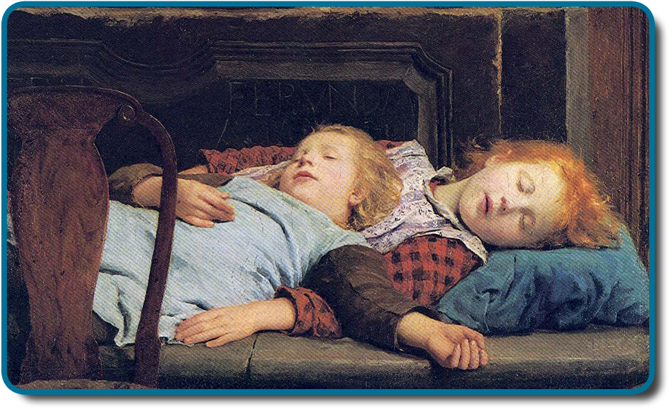

============
Introduction
============

.. contents::
   :depth: 3
..

class=“introduction”

class=“summary” title=“Summary”

class=“review-questions” title=“Review Questions”

class=“critical-thinking” title=“Critical Thinking Questions”

class=“personal-application” title=“Personal Application Questions”

class=“references” title=“References”

|A painting shows two children sleeping.|\ {:}

Our lives involve regular, dramatic changes in the degree to which we
are aware of our surroundings and our internal states. While awake, we
feel alert and aware of the many important things going on around us.
Our experiences change dramatically while we are in deep sleep and once
again when we are dreaming.

This chapter will discuss states of consciousness with a particular
emphasis on sleep. The different stages of sleep will be identified, and
sleep disorders will be described. The chapter will close with
discussions of altered states of consciousness produced by psychoactive
drugs, hypnosis, and meditation.

References
==========

Aggarwal, S. K., Carter, G. T., Sullivan, M. D., ZumBrunnen, C.,
Morrill, R., & Mayer, J. D. (2009). Medicinal use of cannabis in the
United States: Historical perspectives, current trends, and future
directions. *Journal of Opioid Management, 5*, 153–168.

Alhola, P. & Polo-Kantola, P. (2007). Sleep Deprivation: Impact on
cognitive performance. *Neuropsychiatric Disease and Treatment, 3*,
553–557.

Alladin, A. (2012). Cognitive hypnotherapy for major depressive
disorder. *The American Journal of Clinical Hypnosis, 54*, 275–293.

American Psychiatric Association. (2013). Diagnostic and statistical
manual of mental disorders (5th ed.). Arlington, VA: Author.

Aquina, C. T., Marques-Baptista, A., Bridgeman, P., & Merlin, M. A.
(2009). Oxycontin abuse and overdose. *Postgraduate Medicine, 121*,
163–167.

Arnulf, I. (2012). REM sleep behavior disorder: Motor manifestations and
pathophysiology. *Movement Disorders, 27*, 677–689.

Augustinova, M., & Ferrand, L. (2012). Suggestion does not de-automatize
word reading: Evidence from the semantically based Stroop task.
*Psychonomic Bulletin & Review, 19*, 521–527.

Banks, S., & Dinges, D. F. (2007). Behavioral and physiological
consequences of sleep restriction. *Journal of Clinical Sleep Medicine,
3*, 519–528.

Bartke, A., Sun, L. Y., & Longo, V. (2013). Somatotropic signaling:
Trade-offs between growth, reproductive development, and longevity.
*Physiological Reviews, 93*, 571–598.

Berkowitz, C. D. (2012). Sudden infant death syndrome, sudden unexpected
infant death, and apparent life-threatening events. *Advances in
Pediatrics, 59*, 183–208.

Berry, R. B., Kryger, M. H., & Massie, C. A. (2011). A novel nasal
excitatory positive airway pressure (EPAP) device for the treatment of
obstructive sleep apnea: A randomized controlled trial. *Sleep, 34*,
479–485.

Bixler, E. O., Kales, A., Soldatos, C. R., Kales, J. D., & Healey, S.
(1979). Prevalence of sleep disorders in the Los Angeles metropolitan
area. *American Journal of Psychiatry, 136*, 1257–1262.

Bostwick, J. M. (2012). Blurred boundaries: The therapeutics and
politics of medical marijuana. *Mayo Clinic Proceedings, 87*, 172–186.

Brook, R. D., Appel, L. J., Rubenfire, M., Ogedegbe, G., Bisognano, J.
D., Elliott, W. K., . . . Rajagopalan, S. (2013). Beyond medications and
diet: Alternative approaches to lowering blood pressure: A scientific
statement from the American Heart Association. *Hypertension, 61*,
1360–1383.

Broughton, R., Billings, R., Cartwright, R., Doucette, D., Edmeads, J.,
Edwardh, M., . . . Turrell, G. (1994). Homicidal somnambulism: A case
report. *Sleep, 17*, 253–264.

Brown, L. K. (2012). Can sleep deprivation studies explain why human
adults sleep? *Current Opinion in Pulmonary Medicine, 18*, 541–545.

Burgess, C. R., & Scammell, T. E. (2012). Narcolepsy: Neural mechanisms
of sleepiness and cataplexy. *Journal of Neuroscience, 32*, 12305–12311.

Cai, D. J., Mednick, S. A., Harrison, E. M., Kanady, J. C., & Mednick,
S. C. (2009). REM, not incubation, improves creativity by priming
associative networks. *Proceedings of the National Academy of Sciences,
USA, 106*, 10130–10134.

Caldwell, K., Harrison, M., Adams, M., Quin, R. H., & Greeson, J.
(2010). Developing mindfulness in college students through movement
based courses: Effects on self-regulatory self-efficacy, mood, stress,
and sleep quality. *Journal of American College Health, 58*, 433–442.

Capellini, I., Barton, R. A., McNamara, P., Preston, B. T., & Nunn, C.
L. (2008). Phylogenetic analysis of the ecology and evolution of
mammalian sleep. *Evolution, 62*, 1764–1776.

Cartwright, R. (2004). Sleepwalking violence: A sleep disorder, a legal
dilemma, and a psychological challenge. *American Journal of Psychiatry,
161*, 1149–1158.

Cartwright, R., Agargun, M. Y., Kirkby, J., & Friedman, J. K. (2006).
Relation of dreams to waking concerns. *Psychiatry Research, 141*,
261–270.

Casati, A., Sedefov, R., & Pfeiffer-Gerschel, T. (2012). Misuse of
medications in the European Union: A systematic review of the
literature. *European Addiction Research, 18*, 228–245.

Chen, K. W., Berger, C. C., Manheimer, E., Forde, D., Magidson, J.,
Dachman, L., & Lejuez, C. W. (2013). Meditative therapies for reducing
anxiety: A systematic review and meta-analysis of randomized controlled
trials. *Depression and Anxiety, 29*, 545–562.

Chokroverty, S. (2010). Overview of sleep & sleep disorders. *Indian
Journal of Medical Research, 131*, 126–140.

Christensen, A., Bentley, G. E., Cabrera, R., Ortega, H. H., Perfito,
N., Wu, T. J., & Micevych, P. (2012). Hormonal regulation of female
reproduction. *Hormone and Metabolic Research, 44*, 587–591.

CNN. (1999, June 25). ‘Sleepwalker’ convicted of murder. Retrieved from
http://www.cnn.com/US/9906/25/sleepwalker.01/

Cropley, M., Theadom, A., Pravettoni, G., & Webb, G. (2008). The
effectiveness of smoking cessation interventions prior to surgery: A
systematic review. *Nicotine and Tobacco Research, 10*, 407–412.

De la Herrán-Arita, A. K., & Drucker-Colín, R. (2012). Models for
narcolepsy with cataplexy drug discovery. *Expert Opinion on Drug
Discovery, 7*, 155–164.

Del Casale, A., Ferracuti, S., Rapinesi, C., Serata, D., Sani, G.,
Savoja, V., . . . Girardi, P. (2012). Neurocognition under hypnosis:
Findings from recent functional neuroimaging studies. *International
Journal of Clinical and Experimental Hypnosis, 60*, 286–317.

Elkins, G., Johnson, A., & Fisher, W. (2012). Cognitive hypnotherapy for
pain management. *The American Journal of Clinical Hypnosis, 54*,
294–310.

Ellenbogen, J. M., Hu, P. T., Payne, J. D., Titone, D., & Walker, M. P.
(2007). Human relational memory requires time and sleep. *Proceedings of
the National Academy of Sciences, USA, 104*, 7723–7728.

Fell, J., Axmacher, N., & Haupt, S. (2010). From alpha to gamma:
Electrophysiological correlates meditation-related states of
consciousness. *Medical Hypotheses, 75*, 218–224.

Fenn, K. M., Nusbaum, H. C., & Margoliash, D. (2003). Consolidation
during sleep of perceptual learning of spoken language. *Nature, 425*,
614–616.

Ferini-Strambi, L. (2011). Does idiopathic REM sleep behavior disorder
(iRBD) really exist? What are the potential markers of neurodegeneration
in iRBD [Supplemental material]? *Sleep Medicine, 12*\ (2 Suppl.),
S43–S49.

Fiorentini, A., Volonteri, L.S., Dragogna, F., Rovera, C., Maffini, M.,
Mauri, M. C., & Altamura, C. A. (2011). Substance-induced psychoses: A
critical review of the literature. *Current Drug Abuse Reviews, 4*,
228–240.

Fogel, S. M., & Smith, C. T. (2011). The function of the sleep spindle:
A physiological index of intelligence and a mechanism for
sleep-dependent memory consolidation. *Neuroscience and Biobehavioral
Reviews, 35*, 1154–1165.

Frank, M. G. (2006). The mystery of sleep function: Current perspectives
and future directions. *Reviews in the Neurosciences, 17*, 375–392.

Freeman, M. P., Fava, M., Lake, J., Trivedi, M. H., Wisner, K. L., &
Mischoulon, D. (2010). Complementary and alternative medicine in major
depressive disorder: The American Psychiatric Association task force
report. *The Journal of Clinical Psychiatry, 71*, 669–681.

Giedke, H., & Schwärzler, F. (2002). Therapeutic use of sleep
deprivation in depression. *Sleep Medicine Reviews, 6*, 361–377.

Gold, D. R., Rogacz, S. R., Bock, N., Tosteson, T. D., Baum, T. M.,
Speizer, F. M., & Czeisler, C. A. (1992). Rotating shift work, sleep,
and accidents related to sleepiness in hospital nurses. *American
Journal of Public Health, 82*, 1011–1014.

Golden, W. L. (2012). Cognitive hypnotherapy for anxiety disorders. *The
American Journal of Clinical Hypnosis, 54*, 263–274.

Gómez, R. L., Bootzin, R. R., & Nadel, L. (2006). Naps promote
abstraction in language-learning infants. *Psychological Science, 17*,
670–674.

Guilleminault, C., Kirisoglu, C., Bao, G., Arias, V., Chan, A., & Li, K.
K. (2005). Adult chronic sleepwalking and its treatment based on
polysomnography. *Brain, 128*, 1062–1069.

Gujar, N., Yoo, S., Hu, P., & Walker, M. P. (2011). Sleep deprivation
amplifies reactivity of brain reward networks, biasing the appraisal of
positive emotional experiences. *The Journal of Neuroscience, 31*,
4466–4474.

Guldenmund, P., Vanhaudenhuyse, A., Boly, M., Laureys, S., & Soddu, A.
(2012). A default mode of brain function in altered states of
consciousness. *Archives Italiennes de Biologie, 150*, 107–121.

Halász, P. (1993). Arousals without awakening—Dynamic aspect of sleep.
*Physiology and Behavior, 54*, 795–802.

Han, F. (2012). Sleepiness that cannot be overcome: Narcolepsy and
cataplexy. *Respirology, 17*, 1157–1165.

Hardeland, R., Pandi-Perumal, S. R., & Cardinali, D. P. (2006).
Melatonin. *International Journal of Biochemistry & Cell Biology, 38*,
313–316.

Haasen, C., & Krausz, M. (2001). Myths versus experience with respect to
cocaine and crack: Learning from the US experience. *European Addiction
Research, 7*, 159–160.

Henry, D., & Rosenthal, L. (2013). “Listening for his breath:” The
significance of gender and partner reporting on the diagnosis,
management, and treatment of obstructive sleep apnea. *Social Science &
Medicine, 79*, 48–56.

Hicks, R. A., Fernandez, C., & Pelligrini, R. J. (2001). The changing
sleep habits of university students: An update. *Perceptual and Motor
Skills, 93*, 648.

Hicks, R. A., Johnson, C., & Pelligrini, R. J. (1992). Changes in the
self-reported consistency of normal habitual sleep duration of college
students (1978 and 1992). *Perceptual and Motor Skills, 75*, 1168–1170.

Hilgard, E. R., & Hilgard, J. R. (1994). *Hypnosis in the Relief of
Pain*. New York: Brunner/Mazel.

Hishikawa, Y., & Shimizu, T. (1995). Physiology of REM sleep, cataplexy,
and sleep paralysis. *Advances in Neurology, 67*, 245–271.

Herman, A., & Herman, A. P. (2013). Caffeine’s mechanism of action and
its cosmetic use. *Skin Pharmacology and Physiology, 26*, 8–14.

Hobson, J. A. (2009). REM sleep and dreaming: Towards a theory of
protoconsciousness. *Nature Reviews Neuroscience, 10*, 803–814.

Horikawa,T., Tamaki, M., Miyawaki, Y. & Kamitani, Y. (2013). Neural
Decoding of Visual Imagery During Sleep. Science, 340(6132), 639–642.
doi:10.1126/science.1234330

Hossain, J. L., & Shapiro, C. M. (2002). The prevalence, cost
implications, and management of sleep disorders: An overview. *Sleep and
Breathing, 6*, 85–102.

Huang, L. B., Tsai, M. C., Chen, C. Y., & Hsu, S. C. (2013). The
effectiveness of light/dark exposure to treat insomnia in female nurses
undertaking shift work during the evening/night shift. *Journal of
Clinical Sleep Medicine, 9*, 641–646.

Huber, R., Ghilardi, M. F., Massimini, M., & Tononi, G. (2004). Local
sleep and learning. *Nature, 430*, 78–81.

Jayanthi, L. D., & Ramamoorthy, S. (2005). Regulation of monoamine
transporters: Influence of psychostimulants and therapeutic
antidepressants. *The AAPS Journal, 7*, E728–738.

Julien, R. M. (2005). Opioid analgesics. In A primer of drug action: A
comprehensive guide to the actions, uses, and side effects of
psychoactive drugs (pp. 461–500). Portland, OR: Worth.

Kihlstrom, J. F. (2013). Neuro-hypnotism: Prospects for hypnosis and
neuroscience. *Cortex, 49*, 365–374.

Klein, D. C., Moore, R. Y., & Reppert, S. M. (Eds.). (1991).
*Suprachiasmatic nucleus: The mind’s clock*. New York, NY: Oxford
University Press.

Kogan, N. M., & Mechoulam, R. (2007). Cannabinoids in health and
disease. *Dialogues in Clinical Neuroscience, 9*, 413–430.

Kromann, C. B., & Nielson, C. T. (2012). A case of cola dependency in a
woman with recurrent depression. *BMC Research Notes, 5*, 692.

Lang, A. J., Strauss, J. L., Bomeya, J., Bormann, J. E., Hickman, S. D.,
Good, R. C., & Essex, M. (2012). The theoretical and empirical basis for
meditation as an intervention for PTSD. *Behavior Modification, 36*,
759–786.

LaBerge, S. (1990). Lucid dreaming: Psychophysiological studies of
consciousness during REM sleep. In R. R. Bootzen, J. F. Kihlstrom, & D.
L. Schacter (Eds.), Sleep and cognition (pp. 109–126). Washington, DC:
American Psychological Association.

Lesku, J. A., Roth, T. C., 2nd, Amlaner, C. J., & Lima, S. L. (2006). A
phylogenetic analysis of sleep architecture in mammals: The integration
of anatomy, physiology, and ecology. *The American Naturalist, 168*,
441–453.

Levitt, C., Shaw, E., Wong, S., & Kaczorowski, J. (2007). Systematic
review of the literature on postpartum care: Effectiveness of
interventions for smoking relapse prevention, cessation, and reduction
in postpartum women. *Birth, 34*, 341–347.

Lifshitz, M., Aubert Bonn, N., Fischer, A., Kashem, I. F., & Raz, A.
(2013). Using suggestion to modulate automatic processes: From Stroop to
McGurk and beyond. *Cortex, 49*, 463–473.

Luppi, P. H., Clément, O., Sapin, E., Gervasoni, D., Peyron, C., Léger,
L., . . . Fort, P. (2011). The neuronal network responsible for
paradoxical sleep and its dysfunctions causing narcolepsy and rapid eye
movement (REM) behavior disorder. *Sleep Medicine Reviews, 15*, 153–163.

Mage, D. T., & Donner, M. (2006). Female resistance to hypoxia: Does it
explain the sex difference in mortality rates? *Journal of Women’s
Health, 15*, 786–794.

Mahowald, M. W., & Schenck, C. H. (2000). Diagnosis and management of
parasomnias. *Clinical Cornerstone, 2*, 48–54.

Mahowald, M. W., Schenck, C. H., & Cramer Bornemann, M. A. (2005).
Sleep-related violence. *Current Neurology and Neuroscience Reports, 5*,
153–158.

Mayo Clinic. (n.d.). *Sleep terrors (night terrors)*. Retrieved from
http://www.mayoclinic.org/diseases-conditions/night-terrors/basics/treatment/con-20032552

Mather, L. E., Rauwendaal, E. R., Moxham-Hall, V. L., & Wodak, A. D.
(2013). (Re)introducing medical cannabis. *The Medical Journal of
Australia, 199*, 759–761.

Maxwell, J. C. (2006). *Trends in the abuse of prescription drugs. Gulf
Coast Addiction Technology Transfer Center*. Retrieved from
http://asi.nattc.org/userfiles/file/GulfCoast/PrescriptionTrends\_Web.pdf

McCarty, D. E. (2010). A case of narcolepsy with strictly unilateral
cataplexy. *Journal of Clinical Sleep Medicine, 15*, 75–76.

McDaid, C., Durée, K. H., Griffin, S. C., Weatherly, H. L., Stradling,
J. R., Davies, R. J., . . . Westwood, M. E. (2009). A systematic review
of continuous positive airway pressure for obstructive sleep
apnoea-hypopnoea syndrome. *Sleep Medicine Reviews, 13*, 427–436.

McKim, W. A., & Hancock, S. D. (2013). Drugs and behavior: An
introduction to behavioral pharmacology, 7th edition. Boston, MA:
Pearson.

Mignot, E. J. M. (2012). A practical guide to the therapy of narcolepsy
and hypersomnia syndromes. *Neurotherapeutics, 9*, 739–752.

Miller, N. L., Shattuck, L. G., & Matsangas, P. (2010). Longitudinal
study of sleep patterns of United States Military Academy cadets.
*Sleep, 33*, 1623–1631.

Mitchell, E. A. (2009). SIDS: Past, present and future. *Acta
Paediatrica, 98*, 1712–1719.

Montgomery, G. H., Schnur, J. B., & Kravits, K. (2012). Hypnosis for
cancer care: Over 200 years young. *CA: A Cancer Journal for Clinicians,
63*, 31–44.

National Institutes of Health. (n.d.). *Information about sleep*.
Retrieved from
http://science.education.nih.gov/supplements/nih3/sleep/guide/info-sleep.htm

National Research Council. (1994). *Learning, remembering, believing:
Enhancing human performance*. Washington, DC: The National Academies
Press.

National Sleep Foundation. (n.d.). *How much sleep do we really need?*
Retrieved from
http://sleepfoundation.org/how-sleep-works/how-much-sleep-do-we-really-need

Ohayon, M. M. (1997). Prevalence of DSM-IV diagnostic criteria of
insomnia: Distinguishing insomnia related to mental disorders from sleep
disorders. *Journal of Psychiatric Research, 31*, 333–346.

Ohayon, M. M. (2002). Epidemiology of insomnia: What we know and what we
still need to learn. *Sleep Medicine Reviews, 6*, 97–111.

Ohayon, M. M., Carskadon, M. A., Guilleminault, C., & Vitiello, M. V.
(2004). Meta-analysis of quantitative sleep parameters from childhood to
old age in healthy individuals: Developing normative sleep values across
the human lifespan. *Sleep, 27*, 1255–1273.

Ohayon, M. M., & Roth, T. (2002). Prevalence of restless legs syndrome
and periodic limb movement disorder in the general population. *Journal
of Psychosomatic Research, 53*, 547–554.

Poe, G. R., Walsh, C. M., & Bjorness, T. E. (2010). Cognitive
neuroscience of sleep. *Progress in Brain Research, 185*, 1–19.

Porkka-Heiskanen, T. (2011). Methylxanthines and sleep. *Handbook of
Experimental Pharmacology, 200*, 331–348.

Presser, H. B. (1995). Job, family, and gender: Determinants of
nonstandard work schedules among employed Americans in 1991.
*Demography, 32*, 577–598.

Pressman, M. R. (2007). Disorders of arousal from sleep and violent
behavior: The role of physical contact and proximity. *Sleep, 30*,
1039–1047.

Provini, F., Tinuper, P., Bisulli, F., & Lagaresi, E. (2011). Arousal
disorders [Supplemental material]. *Sleep Medicine, 12*\ (2 Suppl.),
S22–S26.

Rattenborg, N. C., Lesku, J. A., Martinez-Gonzalez, D., & Lima, S. L.
(2007). The non-trivial functions of sleep. *Sleep Medicine Reviews,
11*, 405–409.

Raz, A. (2011). Hypnosis: A twilight zone of the top-down variety: Few
have never heard of hypnosis but most know little about the potential of
this mind-body regulation technique for advancing science. *Trends in
Cognitive Sciences, 15*, 555–557.

Raz, A., Shapiro, T., Fan, J., & Posner, M. I. (2002). Hypnotic
suggestion and the modulation of Stroop interference. *Archives of
General Psychiatry, 59*, 1151–1161.

Reiner, K., Tibi, L., & Lipsitz, J. D. (2013). Do mindfulness-based
interventions reduce pain intensity? A critical review of the
literature. *Pain Medicine, 14*, 230–242.

Restless Legs Syndrome Foundation. (n.d.). *Restless legs syndrome:
Causes, diagnosis, and treatment for the patient living with Restless
legs syndrome (RSL)*. Retrieved from www.rls.org

Rial, R. V., Nicolau, M. C., Gamundí, A., Akaârir, M., Aparicio, S.,
Garau, C., . . . Esteban, S. (2007). The trivial function of sleep.
*Sleep Medicine Reviews, 11*, 311–325.

Riemann, D., Berger, M., & Volderholzer, U. (2001). Sleep and
depression—Results from psychobiological studies: An overview.
*Biological Psychology, 57*, 67–103.

Reinerman, C. (2007, October 14). 5 myths about that demon crack.
Washington Post. Retrieved from
http://www.washingtonpost.com/wp-dyn/content/article/2007/10/09/AR2007100900751.html

Reissig, C. J., Strain, E. C., & Griffiths, R. R. (2009). Caffeinated
energy drinks—A growing problem. *Drug and Alcohol Dependence, 99*,
1–10.

Robson, P. J. (2014). Therapeutic potential of cannabinoid medicines.
*Drug Testing and Analysis, 6*, 24–30.

Roth, T. (2007). Insomnia: Definition, prevalence, etiology, and
consequences [Supplemental material]. *Journal of Clinical Sleep
Medicine, 3*\ (5 Suppl.), S7–S10.

Rothman, R. B., Blough, B. E., & Baumann, M. H. (2007). Dual
dopamine/serotonin releasers as potential medications for stimulant and
alcohol addictions. *The AAPS Journal, 9*, E1–10.

Sánchez-de-la-Torre, M., Campos-Rodriguez, F., & Barbé, F. (2012).
Obstructive sleep apnoea and cardiovascular disease. *The Lancet
Respiratory Medicine, 1*, 31–72.

Savard, J., Simard, S., Ivers, H., & Morin, C. M. (2005). Randomized
study on the efficacy of cognitive-behavioral therapy for insomnia
secondary to breast cancer, part I: Sleep and psychological effects.
*Journal of Clinical Oncology, 23*, 6083–6096.

Schicho, R., & Storr, M. (2014). Cannabis finds its way into treatment
of Crohn’s disease. *Pharmacology, 93*, 1–3.

Shukla, R. K, Crump, J. L., & Chrisco, E. S. (2012). An evolving
problem: Methamphetamine production and trafficking in the United
States. *International Journal of Drug Policy, 23*, 426–435.

Siegel, J. M. (2008). Do all animals sleep? *Trends in Neuroscience,
31*, 208–213.

Siegel, J. M. (2001). The REM sleep-memory consolidation hypothesis.
*Science, 294*, 1058–1063.

Singh, G. K., & Siahpush, M. (2006). Widening socioeconomic inequalities
in US life expectancy, 1980–2000. *International Journal of
Epidemiology, 35*, 969–979.

Smedslund, G., Fisher, K. J., Boles, S. M., & Lichtenstein, E. (2004).
The effectiveness of workplace smoking cessation programmes: A
meta-analysis of recent studies. *Tobacco Control, 13*, 197–204.

Sofikitis, N., Giotitsas, N., Tsounapi, P., Baltogiannis, D., Giannakis,
D., & Pardalidis, N. (2008). Hormonal regulation of spermatogenesis and
spermiogenesis. *Journal of Steroid Biochemistry and Molecular Biology,
109*, 323–330.

Steriade, M., & Amzica, F. (1998). Slow sleep oscillation, rhythmic
K-complexes, and their paroxysmal developments [Supplemental material].
*Journal of Sleep Research, 7*\ (1 Suppl.), 30–35.

Stickgold, R. (2005). Sleep-dependent memory consolidation. *Nature,
437*, 1272–1278.

Stone, K. C., Taylor, D. J., McCrae, C. S., Kalsekar, A., & Lichstein,
K. L. (2008). Nonrestorative sleep. *Sleep Medicine Reviews, 12*,
275–288.

Suchecki, D., Tiba, P. A., & Machado, R. B. (2012). REM sleep rebound as
an adaptive response to stressful situations. Frontiers in Neuroscience,
3. doi: 10.3389/fneur.2012.00041

Task Force on Sudden Infant Death Syndrome. (2011). SIDS and other
sleep-related infant deaths: Expansion of recommendations for a safe
infant sleeping environment. *Pediatrics, 128*, 1030–1039.

Taillard, J., Philip, P., Coste, O., Sagaspe, P., & Bioulac, B. (2003).
The circadian and homeostatic modulation of sleep pressure during
wakefulness differs between morning and evening chronotypes. *Journal of
Sleep Research, 12*, 275–282.

Thach, B. T. (2005). The role of respiratory control disorders in SIDS.
*Respiratory Physiology & Neurobiology, 149*, 343–353.

U.S. Food and Drug Administration. (2013, October 24). *Statement on
Proposed Hydrocodone Reclassification from Janet Woodcock, M.D.,
Director, Center for Drug Evaluation and Research*. Retrieved from
http://www.fda.gov/drugs/drugsafety/ucm372089.htm

Vogel, G. W. (1975). A review of REM sleep deprivation. *Archives of
General Psychiatry, 32*, 749–761.

Vøllestad, J., Nielsen, M. B., & Nielsen, G. H. (2012). Mindfulness- and
acceptance-based interventions for anxiety disorders: A systematic
review and meta-analysis. *The British Journal of Clinical Psychology,
51*, 239–260.

Wagner, U., Gais, S., & Born, J. (2001). Emotional memory formation is
enhanced across sleep intervals with high amounts of rapid eye movement
sleep. *Learning & Memory, 8*, 112–119.

Wagner, U., Gais, S., Haider, H., Verleger, R., & Born, J. (2004). Sleep
improves insight. *Nature, 427*, 352–355.

Walker, M. P. (2009). The role of sleep in cognition and emotion.
*Annals of the New York Academy of Sciences, 1156*, 168–197.

Wark, D. M. (2011). Traditional and alert hypnosis for education: A
literature review. *The American Journal of Clinical Hypnosis, 54*\ (2),
96–106.

Waterhouse. J., Fukuda, Y., & Morita, T. (2012). Daily rhythms of the
sleep-wake cycle [Special issue]. *Journal of Physiological
Anthropology,* *31*\ (5). doi:10.1186/1880-6805-31-5

Welsh, D. K. Takahashi, J. S., & Kay, S. A. (2010). Suprachiasmatic
nucleus: Cell autonomy and network properties. *Annual Review of
Physiology, 72*, 551–577.

West, S., Boughton, M., & Byrnes, M. (2009). Juggling multiple
temporalities: The shift work story of mid-life nurses. *Journal of
Nursing Management, 17*, 110–119.

White, D. P. (2005). Pathogenesis of obstructive and central sleep
apnea. *American Journal of Respiratory and Critical Care Medicine,
172*, 1363–1370.

Williams, J., Roth, A., Vatthauer, K., & McCrae, C. S. (2013). Cognitive
behavioral treatment of insomnia. *Chest, 143*, 554–565.

Williamson, A. M., & Feyer, A. M. (2000). Moderate sleep deprivation
produces impairments in cognitive and motor performance equivalent to
legally prescribed levels of alcohol intoxication. *Occupational and
Environmental Medicine, 57*, 649–655.

Wolt, B. J., Ganetsky, M., & Babu, K. M. (2012). Toxicity of energy
drinks. *Current Opinion in Pediatrics, 24*, 243–251.

Zangini, S., Calandra-Buonaura, G., Grimaldi, D., & Cortelli, P. (2011).
REM behaviour disorder and neurodegenerative diseases [Supplemental
material]. *Sleep Medicine, 12*\ (2 Suppl.), S54–S58.

Zeidan, F., Grant, J. A., Brown, C. A., McHaffie, J. G., & Coghill, R.
C. (2012). Mindfulness meditation-related pain relief: Evidence for
unique brain mechanisms in the regulation of pain. *Neuroscience
Letters, 520*, 165–173.

