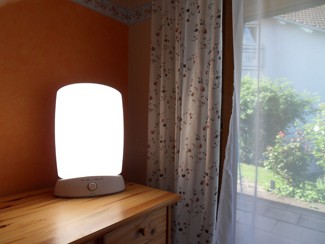

======================
What Is Consciousness?
======================

.. contents::
   :depth: 3
..

.. container::

   By the end of this section, you will be able to: \* Understand what
   is meant by consciousness \* Explain how circadian rhythms are
   involved in regulating the sleep-wake cycle, and how circadian cycles
   can be disrupted \* Discuss the concept of sleep debt

**Consciousness**\ {: data-type=“term”} describes our awareness of
internal and external stimuli. Awareness of internal stimuli includes
feeling pain, hunger, thirst, sleepiness, and being aware of our
thoughts and emotions. Awareness of external stimuli includes seeing the
light from the sun, feeling the warmth of a room, and hearing the voice
of a friend.

We experience different states of consciousness and different levels of
awareness on a regular basis. We might even describe consciousness as a
continuum that ranges from full awareness to a deep sleep. **Sleep**\ {:
data-type=“term”} is a state marked by relatively low levels of physical
activity and reduced sensory awareness that is distinct from periods of
rest that occur during wakefulness. **Wakefulness**\ {:
data-type=“term”} is characterized by high levels of sensory awareness,
thought, and behavior. In between these extremes are states of
consciousness related to daydreaming, intoxication as a result of
alcohol or other drug use, meditative states, hypnotic states, and
altered states of consciousness following sleep deprivation. We might
also experience unconscious states of being via drug-induced anesthesia
for medical purposes. Often, we are not completely aware of our
surroundings, even when we are fully awake. For instance, have you ever
daydreamed while driving home from work or school without really
thinking about the drive itself? You were capable of engaging in the all
of the complex tasks involved with operating a motor vehicle even though
you were not aware of doing so. Many of these processes, like much of
psychological behavior, are rooted in our biology.

BIOLOGICAL RHYTHMS
==================

**Biological rhythms**\ {: data-type=“term”} are internal rhythms of
biological activity. A woman’s menstrual cycle is an example of a
biological rhythm—a recurring, cyclical pattern of bodily changes. One
complete menstrual cycle takes about 28 days—a lunar month—but many
biological cycles are much shorter. For example, body temperature
fluctuates cyclically over a 24-hour period
(`[link] <#Figure_04_01_Rhythms>`__). Alertness is associated with
higher body temperatures, and sleepiness with lower body temperatures.

|A line graph is titled “Circadian Change in Body Temperature (Source:
Waterhouse et al., 2012).” The y-axis, is labeled “temperature (degrees
Fahrenheit),” ranges from 97.2 to 99.3. The x-axis, which is labeled
“time,” begins at 12:00 A.M. and ends at 4:00 A.M. the following day.
The subjects slept from 12:00 A.M. until 8:00 A.M. during which time
their average body temperatures dropped from around 98.8 degrees at
midnight to 97.6 degrees at 4:00 A.M. and then gradually rose back to
nearly the same starting temperature by 8:00 A.M. The average body
temperature fluctuated slightly throughout the day with an upward tilt,
until the next sleep cycle where the temperature again dropped.|\ {:
#Figure_04_01_Rhythms}

This pattern of temperature fluctuation, which repeats every day, is one
example of a circadian rhythm. A **circadian rhythm**\ {:
data-type=“term”} is a biological rhythm that takes place over a period
of about 24 hours. Our sleep-wake cycle, which is linked to our
environment’s natural light-dark cycle, is perhaps the most obvious
example of a circadian rhythm, but we also have daily fluctuations in
heart rate, blood pressure, blood sugar, and body temperature. Some
circadian rhythms play a role in changes in our state of consciousness.

If we have biological rhythms, then is there some sort of **biological
clock**\ {: data-type=“term” .no-emphasis}? In the brain, the
hypothalamus, which lies above the pituitary gland, is a main center of
homeostasis. **Homeostasis**\ {: data-type=“term”} is the tendency to
maintain a balance, or optimal level, within a biological system.

The brain’s clock mechanism is located in an area of the hypothalamus
known as the **suprachiasmatic nucleus (SCN)**\ {: data-type=“term”}.
The axons of light-sensitive neurons in the retina provide information
to the SCN based on the amount of light present, allowing this internal
clock to be synchronized with the outside world (Klein, Moore, &
Reppert, 1991; Welsh, Takahashi, & Kay, 2010)
(`[link] <#Figure_04_01_SCN>`__).

|In this graphic, the outline of a person’s head facing left is situated
to the right of a picture of the sun, which is labeled ”light” with an
arrow pointing to a location in the brain where light input is
processed. Inside the head is an illustration of a brain with the
following parts’ locations identified: Suprachiasmatic nucleus (SCN),
Hypothalamus, Pituitary gland, Pineal gland, and Output rhythms:
Physiology and Behavior.|\ {: #Figure_04_01_SCN}

PROBLEMS WITH CIRCADIAN RHYTHMS
===============================

Generally, and for most people, our circadian cycles are aligned with
the outside world. For example, most people sleep during the night and
are awake during the day. One important regulator of sleep-wake cycles
is the hormone **melatonin**\ {: data-type=“term”}. The **pineal
gland**\ {: data-type=“term”}, an endocrine structure located inside the
brain that releases melatonin, is thought to be involved in the
regulation of various biological rhythms and of the immune system during
sleep (Hardeland, Pandi-Perumal, & Cardinali, 2006). Melatonin release
is stimulated by darkness and inhibited by light.

There are individual differences with regards to our sleep-wake cycle.
For instance, some people would say they are morning people, while
others would consider themselves to be night owls. These individual
differences in circadian patterns of activity are known as a person’s
chronotype, and research demonstrates that morning larks and night owls
differ with regard to sleep regulation (Taillard, Philip, Coste,
Sagaspe, & Bioulac, 2003). **Sleep regulation**\ {: data-type=“term”}
refers to the brain’s control of switching between sleep and wakefulness
as well as coordinating this cycle with the outside world.

.. container:: psychology link-to-learning

   Watch this brief `video <http://openstax.org/l/circadian>`__
   describing circadian rhythms and how they affect sleep.

Disruptions of Normal Sleep
---------------------------

Whether lark, owl, or somewhere in between, there are situations in
which a person’s circadian clock gets out of synchrony with the external
environment. One way that this happens involves traveling across
multiple time zones. When we do this, we often experience jet lag. **Jet
lag**\ {: data-type=“term”} is a collection of symptoms that results
from the mismatch between our internal circadian cycles and our
environment. These symptoms include fatigue, sluggishness, irritability,
and **insomnia**\ {: data-type=“term”} (i.e., a consistent difficulty in
falling or staying asleep for at least three nights a week over a
month’s time) (Roth, 2007).

Individuals who do rotating shift work are also likely to experience
disruptions in circadian cycles. **Rotating shift work**\ {:
data-type=“term”} refers to a work schedule that changes from early to
late on a daily or weekly basis. For example, a person may work from
7:00 a.m. to 3:00 p.m. on Monday, 3:00 a.m. to 11:00 a.m. on Tuesday,
and 11:00 a.m. to 7:00 p.m. on Wednesday. In such instances, the
individual’s schedule changes so frequently that it becomes difficult
for a normal circadian rhythm to be maintained. This often results in
sleeping problems, and it can lead to signs of depression and anxiety.
These kinds of schedules are common for individuals working in health
care professions and service industries, and they are associated with
persistent feelings of exhaustion and agitation that can make someone
more prone to making mistakes on the job (Gold et al., 1992; Presser,
1995).

Rotating shift work has pervasive effects on the lives and experiences
of individuals engaged in that kind of work, which is clearly
illustrated in stories reported in a qualitative study that researched
the experiences of middle-aged nurses who worked rotating shifts (West,
Boughton & Byrnes, 2009). Several of the nurses interviewed commented
that their work schedules affected their relationships with their
family. One of the nurses said,

   If you’ve had a partner who does work regular job 9 to 5 office hours
   . . . the ability to spend time, good time with them when you’re not
   feeling absolutely exhausted . . . that would be one of the problems
   that I’ve encountered. (West et al., 2009, p. 114)

While disruptions in circadian rhythms can have negative consequences,
there are things we can do to help us realign our biological clocks with
the external environment. Some of these approaches, such as using a
bright light as shown in `[link] <#Figure_04_01_BrightLight>`__, have
been shown to alleviate some of the problems experienced by individuals
suffering from jet lag or from the consequences of rotating shift work.
Because the biological clock is driven by light, exposure to bright
light during working shifts and dark exposure when not working can help
combat insomnia and symptoms of anxiety and depression (Huang, Tsai,
Chen, & Hsu, 2013).

|A photograph shows a bright lamp.|\ {: #Figure_04_01_BrightLight}

.. container:: psychology link-to-learning

   Watch this `video <https://www.youtube.com/watch?v=sbNkAcfNhh0>`__ to
   hear tips on how to overcome jet lag.

Insufficient Sleep
------------------

When people have difficulty getting sleep due to their work or the
demands of day-to-day life, they accumulate a sleep debt. A person with
a **sleep debt**\ {: data-type=“term”} does not get sufficient sleep on
a chronic basis. The consequences of sleep debt include decreased levels
of alertness and mental efficiency. Interestingly, since the advent of
electric light, the amount of sleep that people get has declined. While
we certainly welcome the convenience of having the darkness lit up, we
also suffer the consequences of reduced amounts of sleep because we are
more active during the nighttime hours than our ancestors were. As a
result, many of us sleep less than 7–8 hours a night and accrue a sleep
debt. While there is tremendous variation in any given individual’s
sleep needs, the National Sleep Foundation (n.d.) cites research to
estimate that newborns require the most sleep (between 12 and 18 hours a
night) and that this amount declines to just 7–9 hours by the time we
are adults.

If you lie down to take a nap and fall asleep very easily, chances are
you may have sleep debt. Given that college students are notorious for
suffering from significant sleep debt (Hicks, Fernandez, & Pelligrini,
2001; Hicks, Johnson, & Pelligrini, 1992; Miller, Shattuck, & Matsangas,
2010), chances are you and your classmates deal with sleep debt-related
issues on a regular basis. In 2015, the National Sleep Foundation
updated their sleep duration hours, to better accommodate individual
differences. `[link] <#Table_04_01_01>`__ shows the new recommendations,
which describe sleep durations that are “recommended”, “may be
appropriate”, and “not recommended”.

.. raw:: html

   <table id="Table_04_01_01" summary="This table has two columns and eight rows. The first row is a header row, and it labels the first column, “age,” and the second column “nightly sleep needs.” In the “age” column, the second row reads “0–3 months.” In the “nightly sleep needs” column, the second row reads “12–18 hours.” In the “age” column, the third row reads “3 months–1 year.” In the “nightly sleep needs” column, the third row reads “14–15 hours.” In the “age” column, the fourth row reads “1–3 years.” In the “nightly sleep needs” column, the fourth row reads “12–14 hours.” In the “age” column, the fifth row reads “3–5 years.” In the “nightly sleep needs” column, the fifth row reads “11–13 hours.” In the “age” column, the sixth row reads “5–10 years.” In the “nightly sleep needs” column, the sixth row reads “10–11 hours.” In the “age” column, the seventh row reads “10–18 years.” In the “nightly sleep needs” column, the seventh row reads “8–10 hours.” In the “age” column, the eighth row reads “18 and older.” In the “nightly sleep needs” column, the eighth row reads “7–9 hours.”">

.. raw:: html

   <caption>

Sleep Needs at Different Ages

.. raw:: html

   </caption>

.. raw:: html

   <thead>

.. raw:: html

   <tr>

.. raw:: html

   <th>

Age

.. raw:: html

   </th>

.. raw:: html

   <th>

Recommended

.. raw:: html

   </th>

.. raw:: html

   <th>

May be appropriate

.. raw:: html

   </th>

.. raw:: html

   <th>

Not recommended

.. raw:: html

   </th>

.. raw:: html

   </tr>

.. raw:: html

   </thead>

.. raw:: html

   <tbody>

.. raw:: html

   <tr>

.. raw:: html

   <td>

0–3 months

.. raw:: html

   </td>

.. raw:: html

   <td>

14–17 hours

.. raw:: html

   </td>

.. raw:: html

   <td>

11–13 hours

.. raw:: html

   

18–19 hours

.. raw:: html

   </td>

.. raw:: html

   <td>

Less than 11 hours

.. raw:: html

   

More than 19 hours

.. raw:: html

   </td>

.. raw:: html

   </tr>

.. raw:: html

   <tr>

.. raw:: html

   <td>

4–11 months

.. raw:: html

   </td>

.. raw:: html

   <td>

12–15 hours

.. raw:: html

   </td>

.. raw:: html

   <td>

10–11 hours

.. raw:: html

   

16–18 hours

.. raw:: html

   </td>

.. raw:: html

   <td>

Less than 10 hours

.. raw:: html

   

More than 18 hours

.. raw:: html

   </td>

.. raw:: html

   </tr>

.. raw:: html

   <tr>

.. raw:: html

   <td>

1–2 years

.. raw:: html

   </td>

.. raw:: html

   <td>

11–14 hours

.. raw:: html

   </td>

.. raw:: html

   <td>

9–10 hours

.. raw:: html

   

15–16 hours

.. raw:: html

   </td>

.. raw:: html

   <td>

Less than 9 hours

.. raw:: html

   

More than 16 hours

.. raw:: html

   </td>

.. raw:: html

   </tr>

.. raw:: html

   <tr>

.. raw:: html

   <td>

3–5 years

.. raw:: html

   </td>

.. raw:: html

   <td>

10–13 hours

.. raw:: html

   </td>

.. raw:: html

   <td>

8–9 hours

.. raw:: html

   

14 hours

.. raw:: html

   </td>

.. raw:: html

   <td>

Less than 8 hours

.. raw:: html

   

More than 14 hours

.. raw:: html

   </td>

.. raw:: html

   </tr>

.. raw:: html

   <tr>

.. raw:: html

   <td>

6–13 years

.. raw:: html

   </td>

.. raw:: html

   <td>

9–11 hours

.. raw:: html

   </td>

.. raw:: html

   <td>

7–8 hours

.. raw:: html

   

12 hours

.. raw:: html

   </td>

.. raw:: html

   <td>

Less than 7 hours

.. raw:: html

   

More than 12 hours

.. raw:: html

   </td>

.. raw:: html

   </tr>

.. raw:: html

   <tr>

.. raw:: html

   <td>

14–17 years

.. raw:: html

   </td>

.. raw:: html

   <td>

8–10 hours

.. raw:: html

   </td>

.. raw:: html

   <td>

7 hours

.. raw:: html

   

11 hours

.. raw:: html

   </td>

.. raw:: html

   <td>

Less than 7 hours

.. raw:: html

   

More than 11 hours

.. raw:: html

   </td>

.. raw:: html

   </tr>

.. raw:: html

   <tr>

.. raw:: html

   <td>

18–25 years

.. raw:: html

   </td>

.. raw:: html

   <td>

7–9 hours

.. raw:: html

   </td>

.. raw:: html

   <td>

6 hours

.. raw:: html

   

10–11 hours

.. raw:: html

   </td>

.. raw:: html

   <td>

Less than 6 hours

.. raw:: html

   

More than 11 hours

.. raw:: html

   </td>

.. raw:: html

   </tr>

.. raw:: html

   <tr>

.. raw:: html

   <td>

26–64 years

.. raw:: html

   </td>

.. raw:: html

   <td>

7–9 hours

.. raw:: html

   </td>

.. raw:: html

   <td>

6 hours

.. raw:: html

   

10 hours

.. raw:: html

   </td>

.. raw:: html

   <td>

Less than 6 hours

.. raw:: html

   

More than 10 hours

.. raw:: html

   </td>

.. raw:: html

   </tr>

.. raw:: html

   <tr>

.. raw:: html

   <td>

≥65 years

.. raw:: html

   </td>

.. raw:: html

   <td>

7–8 hours

.. raw:: html

   </td>

.. raw:: html

   <td>

5–6 hours

.. raw:: html

   

9 hours

.. raw:: html

   </td>

.. raw:: html

   <td>

Less than 5 hours

.. raw:: html

   

More than 9 hours

.. raw:: html

   </td>

.. raw:: html

   </tr>

.. raw:: html

   </tbody>

.. raw:: html

   </table>

Sleep debt and sleep deprivation have significant negative psychological
and physiological consequences `[link] <#Figure_04_01_Sleepless>`__. As
mentioned earlier, lack of sleep can result in decreased mental
alertness and cognitive function. In addition, sleep deprivation often
results in depression-like symptoms. These effects can occur as a
function of accumulated sleep debt or in response to more acute periods
of sleep deprivation. It may surprise you to know that sleep deprivation
is associated with obesity, increased blood pressure, increased levels
of stress hormones, and reduced immune functioning (Banks & Dinges,
2007). A sleep deprived individual generally will fall asleep more
quickly than if she were not sleep deprived. Some sleep-deprived
individuals have difficulty staying awake when they stop moving (example
sitting and watching television or driving a car). That is why
individuals suffering from sleep deprivation can also put themselves and
others at risk when they put themselves behind the wheel of a car or
work with dangerous machinery. Some research suggests that sleep
deprivation affects cognitive and motor function as much as, if not more
than, alcohol intoxication (Williamson & Feyer, 2000).

|An illustration of the top half of a human body identifies the
locations in the body that correspond with various adverse affects of
sleep deprivation. The brain is labeled with Irritability,” “Cognitive
impairment,” “Memory lapses or loss,” “Impaired moral judgement,”
“Severe yawning,” “Hallucinations,” and “Symptoms similar to ADHD.” The
heart is labeled with Increased heart rate variability and Risk of heart
disease. The muscles are labeled with Increased reaction time, Decreased
accuracy, Tremors, and Aches. There is an organ near the stomach labeled
Risk of diabetes Type 2. Other risks include Growth suppression, Risk of
obesity, Decreased temperature, and Impaired immune system.|\ {:
#Figure_04_01_Sleepless}

.. container:: psychology link-to-learning

   To assess your own sleeping habits, read this
   `article <http://openstax.org/l/sleephabits>`__ about sleep needs.

The amount of sleep we get varies across the lifespan. When we are very
young, we spend up to 16 hours a day sleeping. As we grow older, we
sleep less. In fact, a **meta-analysis**\ {: data-type=“term”}, which is
a study that combines the results of many related studies, conducted
within the last decade indicates that by the time we are 65 years old,
we average fewer than 7 hours of sleep per day (Ohayon, Carskadon,
Guilleminault, & Vitiello, 2004). As the amount of time we sleep varies
over our lifespan, presumably the sleep debt would adjust accordingly.

Summary
=======

States of consciousness vary over the course of the day and throughout
our lives. Important factors in these changes are the biological
rhythms, and, more specifically, the circadian rhythms generated by the
suprachiasmatic nucleus (SCN). Typically, our biological clocks are
aligned with our external environment, and light tends to be an
important cue in setting this clock. When people travel across multiple
time zones or work rotating shifts, they can experience disruptions of
their circadian cycles that can lead to insomnia, sleepiness, and
decreased alertness. Bright light therapy has shown to be promising in
dealing with circadian disruptions. If people go extended periods of
time without sleep, they will accrue a sleep debt and potentially
experience a number of adverse psychological and physiological
consequences.

Review Questions
================

.. container::

   .. container::

      The body’s biological clock is located in the \________.

      1. hippocampus
      2. thalamus
      3. hypothalamus
      4. pituitary gland {: type=“a”}

   .. container::

      C

.. container::

   .. container::

      \_______\_ occurs when there is a chronic deficiency in sleep.

      1. jet lag
      2. rotating shift work
      3. circadian rhythm
      4. sleep debt {: type=“a”}

   .. container::

      D

.. container::

   .. container::

      \_______\_ cycles occur roughly once every 24 hours.

      1. biological
      2. circadian
      3. rotating
      4. conscious {: type=“a”}

   .. container::

      B

.. container::

   .. container::

      \_______\_ is one way in which people can help reset their
      biological clocks.

      1. Light-dark exposure
      2. coffee consumption
      3. alcohol consumption
      4. napping {: type=“a”}

   .. container::

      A

Critical Thinking Questions
===========================

.. container::

   .. container::

      Healthcare professionals often work rotating shifts. Why is this
      problematic? What can be done to deal with potential problems?

   .. container::

      Given that rotating shift work can lead to exhaustion and
      decreased mental efficiency, individuals working under these
      conditions are more likely to make mistakes on the job. The
      implications for this in the health care professions are obvious.
      Those in health care professions could be educated about the
      benefits of light-dark exposure to help alleviate such problems.

.. container::

   .. container::

      Generally, humans are considered diurnal which means we are awake
      during the day and asleep during the night. Many rodents, on the
      other hand, are nocturnal. Why do you think different animals have
      such different sleep-wake cycles?

   .. container::

      Different species have different evolutionary histories, and they
      have adapted to their environments in different ways. There are a
      number of different possible explanations as to why a given
      species is diurnal or nocturnal. Perhaps humans would be most
      vulnerable to threats during the evening hours when light levels
      are low. Therefore, it might make sense to be in shelter during
      this time. Rodents, on the other hand, are faced with a number of
      predatory threats, so perhaps being active at night minimizes the
      risk from predators such as birds that use their visual senses to
      locate prey.

Personal Application Questions
==============================

.. container::

   .. container::

      We experience shifts in our circadian clocks in the fall and
      spring of each year with time changes associated with daylight
      saving time. Is springing ahead or falling back easier for you to
      adjust to, and why do you think that is?

.. container::

   .. container::

      What do you do to adjust to the differences in your daily schedule
      throughout the week? Are you running a sleep debt when daylight
      saving time begins or ends?

.. container::

   .. rubric:: Glossary
      :name: glossary

   {: data-type=“glossary-title”}

   biological rhythm
      internal cycle of biological activity ^
   circadian rhythm
      biological rhythm that occurs over approximately 24 hours ^
   consciousness
      awareness of internal and external stimuli ^
   homeostasis
      tendency to maintain a balance, or optimal level, within a
      biological system ^
   insomnia
      consistent difficulty in falling or staying asleep for at least
      three nights a week over a month’s time ^
   jet lag
      collection of symptoms brought on by travel from one time zone to
      another that results from the mismatch between our internal
      circadian cycles and our environment ^
   melatonin
      hormone secreted by the endocrine gland that serves as an
      important regulator of the sleep-wake cycle ^
   meta-analysis
      study that combines the results of several related studies ^
   pineal gland
      endocrine structure located inside the brain that releases
      melatonin ^
   rotating shift work
      work schedule that changes from early to late on a daily or weekly
      basis ^
   sleep
      state marked by relatively low levels of physical activity and
      reduced sensory awareness that is distinct from periods of rest
      that occur during wakefulness ^
   sleep debt
      result of insufficient sleep on a chronic basis ^
   sleep regulation
      brain’s control of switching between sleep and wakefulness as well
      as coordinating this cycle with the outside world ^
   suprachiasmatic nucleus (SCN)
      area of the hypothalamus in which the body’s biological clock is
      located ^
   wakefulness
      characterized by high levels of sensory awareness, thought, and
      behavior

.. |A line graph is titled “Circadian Change in Body Temperature (Source: Waterhouse et al., 2012).” The y-axis, is labeled “temperature (degrees Fahrenheit),” ranges from 97.2 to 99.3. The x-axis, which is labeled “time,” begins at 12:00 A.M. and ends at 4:00 A.M. the following day. The subjects slept from 12:00 A.M. until 8:00 A.M. during which time their average body temperatures dropped from around 98.8 degrees at midnight to 97.6 degrees at 4:00 A.M. and then gradually rose back to nearly the same starting temperature by 8:00 A.M. The average body temperature fluctuated slightly throughout the day with an upward tilt, until the next sleep cycle where the temperature again dropped.| image:: ../resources/CNX_Psych_04_01_Rhythmsn.jpg
.. |In this graphic, the outline of a person’s head facing left is situated to the right of a picture of the sun, which is labeled ”light” with an arrow pointing to a location in the brain where light input is processed. Inside the head is an illustration of a brain with the following parts’ locations identified: Suprachiasmatic nucleus (SCN), Hypothalamus, Pituitary gland, Pineal gland, and Output rhythms: Physiology and Behavior.| image:: ../resources/CNX_Psych_04_01_SCN.jpg

.. |An illustration of the top half of a human body identifies the locations in the body that correspond with various adverse affects of sleep deprivation. The brain is labeled with Irritability,” “Cognitive impairment,” “Memory lapses or loss,” “Impaired moral judgement,” “Severe yawning,” “Hallucinations,” and “Symptoms similar to ADHD.” The heart is labeled with Increased heart rate variability and Risk of heart disease. The muscles are labeled with Increased reaction time, Decreased accuracy, Tremors, and Aches. There is an organ near the stomach labeled Risk of diabetes Type 2. Other risks include Growth suppression, Risk of obesity, Decreased temperature, and Impaired immune system.| image:: ../resources/CNX_Psych_04_01_Sleepless.jpg
