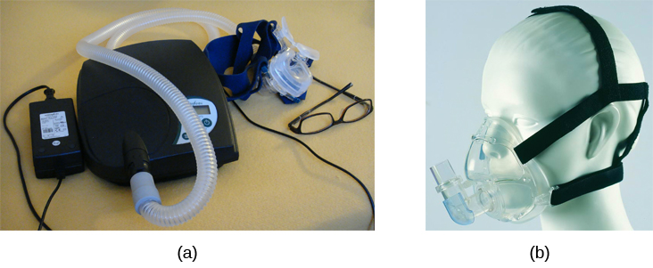
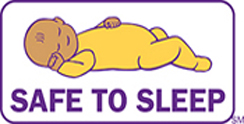

============================
Sleep Problems and Disorders
============================

.. contents::
   :depth: 3
..

.. container::

   By the end of this section, you will be able to: \* Describe the
   symptoms and treatments of insomnia \* Recognize the symptoms of
   several parasomnias \* Describe the symptoms and treatments for sleep
   apnea \* Recognize risk factors associated with sudden infant death
   syndrome (SIDS) and steps to prevent it \* Describe the symptoms and
   treatments for narcolepsy

Many people experience disturbances in their sleep at some point in
their lives. Depending on the population and sleep disorder being
studied, between 30% and 50% of the population suffers from a sleep
disorder at some point in their lives (Bixler, Kales, Soldatos, Kaels, &
Healey, 1979; Hossain & Shapiro, 2002; Ohayon, 1997, 2002; Ohayon &
Roth, 2002). This section will describe several sleep disorders as well
as some of their treatment options.

INSOMNIA
========

Insomnia, a consistent difficulty in falling or staying asleep, is the
most common of the sleep disorders. Individuals with insomnia often
experience long delays between the times that they go to bed and
actually fall asleep. In addition, these individuals may wake up several
times during the night only to find that they have difficulty getting
back to sleep. As mentioned earlier, one of the criteria for insomnia
involves experiencing these symptoms for at least three nights a week
for at least one month’s time (Roth, 2007).

It is not uncommon for people suffering from insomnia to experience
increased levels of anxiety about their inability to fall asleep. This
becomes a self-perpetuating cycle because increased anxiety leads to
increased arousal, and higher levels of arousal make the prospect of
falling asleep even more unlikely. Chronic insomnia is almost always
associated with feeling overtired and may be associated with symptoms of
depression.

There may be many factors that contribute to insomnia, including age,
drug use, exercise, mental status, and bedtime routines. Not
surprisingly, insomnia treatment may take one of several different
approaches. People who suffer from insomnia might limit their use of
stimulant drugs (such as caffeine) or increase their amount of physical
exercise during the day. Some people might turn to over-the-counter
(OTC) or prescribed sleep medications to help them sleep, but this
should be done sparingly because many sleep medications result in
dependence and alter the nature of the sleep cycle, and they can
increase insomnia over time. Those who continue to have insomnia,
particularly if it affects their quality of life, should seek
professional treatment.

Some forms of psychotherapy, such as cognitive-behavioral therapy, can
help sufferers of insomnia. **Cognitive-behavioral therapy**\ {:
data-type=“term”} is a type of psychotherapy that focuses on cognitive
processes and problem behaviors. The treatment of insomnia likely would
include stress management techniques and changes in problematic
behaviors that could contribute to insomnia (e.g., spending more waking
time in bed). Cognitive-behavioral therapy has been demonstrated to be
quite effective in treating insomnia (Savard, Simard, Ivers, & Morin,
2005; Williams, Roth, Vatthauer, & McCrae, 2013).

PARASOMNIAS
===========

A **parasomnia**\ {: data-type=“term”} is one of a group of sleep
disorders in which unwanted, disruptive motor activity and/or
experiences during sleep play a role. Parasomnias can occur in either
REM or NREM phases of sleep. Sleepwalking, restless leg syndrome, and
night terrors are all examples of parasomnias (Mahowald & Schenck,
2000).

Sleepwalking
------------

In **sleepwalking**\ {: data-type=“term”}, or somnambulism, the sleeper
engages in relatively complex behaviors ranging from wandering about to
driving an automobile. During periods of sleepwalking, sleepers often
have their eyes open, but they are not responsive to attempts to
communicate with them. Sleepwalking most often occurs during slow-wave
sleep, but it can occur at any time during a sleep period in some
affected individuals (Mahowald & Schenck, 2000).

Historically, somnambulism has been treated with a variety of
pharmacotherapies ranging from benzodiazepines to antidepressants.
However, the success rate of such treatments is questionable.
Guilleminault et al. (2005) found that sleepwalking was not alleviated
with the use of benzodiazepines. However, all of their somnambulistic
patients who also suffered from sleep-related breathing problems showed
a marked decrease in sleepwalking when their breathing problems were
effectively treated.

.. container:: psychology dig-deeper

   .. container::

      A Sleepwalking Defense?

   On January 16, 1997, Scott Falater sat down to dinner with his wife
   and children and told them about difficulties he was experiencing on
   a project at work. After dinner, he prepared some materials to use in
   leading a church youth group the following morning, and then he
   attempted repair the family’s swimming pool pump before retiring to
   bed. The following morning, he awoke to barking dogs and unfamiliar
   voices from downstairs. As he went to investigate what was going on,
   he was met by a group of police officers who arrested him for the
   murder of his wife (Cartwright, 2004; CNN, 1999).

   Yarmila Falater’s body was found in the family’s pool with 44 stab
   wounds. A neighbor called the police after witnessing Falater
   standing over his wife’s body before dragging her into the pool. Upon
   a search of the premises, police found blood-stained clothes and a
   bloody knife in the trunk of Falater’s car, and he had blood stains
   on his neck.

   Remarkably, Falater insisted that he had no recollection of hurting
   his wife in any way. His children and his wife’s parents all agreed
   that Falater had an excellent relationship with his wife and they
   couldn’t think of a reason that would provide any sort of motive to
   murder her (Cartwright, 2004).

   Scott Falater had a history of regular episodes of sleepwalking as a
   child, and he had even behaved violently toward his sister once when
   she tried to prevent him from leaving their home in his pajamas
   during a sleepwalking episode. He suffered from no apparent
   anatomical brain anomalies or psychological disorders. It appeared
   that Scott Falater had killed his wife in his sleep, or at least,
   that is the defense he used when he was tried for his wife’s murder
   (Cartwright, 2004; CNN, 1999). In Falater’s case, a jury found him
   guilty of first degree murder in June of 1999 (CNN, 1999); however,
   there are other murder cases where the sleepwalking defense has been
   used successfully. As scary as it sounds, many sleep researchers
   believe that homicidal sleepwalking is possible in individuals
   suffering from the types of sleep disorders described below
   (Broughton et al., 1994; Cartwright, 2004; Mahowald, Schenck, &
   Cramer Bornemann, 2005; Pressman, 2007).

REM Sleep Behavior Disorder (RBD)
---------------------------------

**REM sleep behavior disorder (RBD)**\ {: data-type=“term”} occurs when
the muscle paralysis associated with the REM sleep phase does not occur.
Individuals who suffer from RBD have high levels of physical activity
during REM sleep, especially during disturbing dreams. These behaviors
vary widely, but they can include kicking, punching, scratching,
yelling, and behaving like an animal that has been frightened or
attacked. People who suffer from this disorder can injure themselves or
their sleeping partners when engaging in these behaviors. Furthermore,
these types of behaviors ultimately disrupt sleep, although affected
individuals have no memories that these behaviors have occurred (Arnulf,
2012).

This disorder is associated with a number of neurodegenerative diseases
such as Parkinson’s disease. In fact, this relationship is so robust
that some view the presence of RBD as a potential aid in the diagnosis
and treatment of a number of neurodegenerative diseases (Ferini-Strambi,
2011). Clonazepam, an anti-anxiety medication with sedative properties,
is most often used to treat RBD. It is administered alone or in
conjunction with doses of melatonin (the hormone secreted by the pineal
gland). As part of treatment, the sleeping environment is often modified
to make it a safer place for those suffering from RBD (Zangini,
Calandra-Buonaura, Grimaldi, & Cortelli, 2011).

Other Parasomnias
-----------------

A person with **restless leg syndrome**\ {: data-type=“term”} has
uncomfortable sensations in the legs during periods of inactivity or
when trying to fall asleep. This discomfort is relieved by deliberately
moving the legs, which, not surprisingly, contributes to difficulty in
falling or staying asleep. Restless leg syndrome is quite common and has
been associated with a number of other medical diagnoses, such as
chronic kidney disease and diabetes (Mahowald & Schenck, 2000). There
are a variety of drugs that treat restless leg syndrome:
benzodiazepines, opiates, and anticonvulsants (Restless Legs Syndrome
Foundation, n.d.).

**Night terrors**\ {: data-type=“term”} result in a sense of panic in
the sufferer and are often accompanied by screams and attempts to escape
from the immediate environment (Mahowald & Schenck, 2000). Although
individuals suffering from night terrors appear to be awake, they
generally have no memories of the events that occurred, and attempts to
console them are ineffective. Typically, individuals suffering from
night terrors will fall back asleep again within a short time. Night
terrors apparently occur during the NREM phase of sleep (Provini,
Tinuper, Bisulli, & Lagaresi, 2011). Generally, treatment for night
terrors is unnecessary unless there is some underlying medical or
psychological condition that is contributing to the night terrors (Mayo
Clinic, n.d.).

SLEEP APNEA
===========

**Sleep apnea**\ {: data-type=“term”} is defined by episodes during
which a sleeper’s breathing stops. These episodes can last 10–20 seconds
or longer and often are associated with brief periods of arousal. While
individuals suffering from sleep apnea may not be aware of these
repeated disruptions in sleep, they do experience increased levels of
fatigue. Many individuals diagnosed with sleep apnea first seek
treatment because their sleeping partners indicate that they snore
loudly and/or stop breathing for extended periods of time while sleeping
(Henry & Rosenthal, 2013). Sleep apnea is much more common in overweight
people and is often associated with loud snoring. Surprisingly, sleep
apnea may exacerbate cardiovascular disease (Sánchez-de-la-Torre,
Campos-Rodriguez, & Barbé, 2012). While sleep apnea is less common in
thin people, anyone, regardless of their weight, who snores loudly or
gasps for air while sleeping, should be checked for sleep apnea.

While people are often unaware of their sleep apnea, they are keenly
aware of some of the adverse consequences of insufficient sleep.
Consider a patient who believed that as a result of his sleep apnea he
“had three car accidents in six weeks. They were ALL my fault. Two of
them I didn’t even know I was involved in until afterwards” (Henry &
Rosenthal, 2013, p. 52). It is not uncommon for people suffering from
undiagnosed or untreated sleep apnea to fear that their careers will be
affected by the lack of sleep, illustrated by this statement from
another patient, “I’m in a job where there’s a premium on being mentally
alert. I was really sleepy… and having trouble concentrating…. It was
getting to the point where it was kind of scary” (Henry & Rosenthal,
2013, p. 52).

There are two types of sleep apnea: obstructive sleep apnea and central
sleep apnea. **Obstructive sleep apnea**\ {: data-type=“term”} occurs
when an individual’s airway becomes blocked during sleep, and air is
prevented from entering the lungs. In **central sleep apnea**\ {:
data-type=“term”}, disruption in signals sent from the brain that
regulate breathing cause periods of interrupted breathing (White, 2005).

One of the most common treatments for sleep apnea involves the use of a
special device during sleep. A **continuous positive airway pressure
(CPAP)**\ {: data-type=“term”} device includes a mask that fits over the
sleeper’s nose and mouth, which is connected to a pump that pumps air
into the person’s airways, forcing them to remain open, as shown in
`[link] <#Figure_04_04_CPAP>`__. Some newer CPAP masks are smaller and
cover only the nose. This treatment option has proven to be effective
for people suffering from mild to severe cases of sleep apnea (McDaid et
al., 2009). However, alternative treatment options are being explored
because consistent compliance by users of CPAP devices is a problem.
Recently, a new EPAP (expiratory positive air pressure) device has shown
promise in double-blind trials as one such alternative (Berry, Kryger, &
Massie, 2011).

|Photograph A shows a CPAP device. Photograph B shows a clear full face
CPAP mask attached to a mannequin's head with straps.|\ {:
#Figure_04_04_CPAP}

SIDS
----

In **sudden infant death syndrome (SIDS)**\ {: data-type=“term”} an
infant stops breathing during sleep and dies. Infants younger than 12
months appear to be at the highest risk for SIDS, and boys have a
greater risk than girls. A number of risk factors have been associated
with SIDS including premature birth, smoking within the home, and
hyperthermia. There may also be differences in both brain structure and
function in infants that die from SIDS (Berkowitz, 2012; Mage & Donner,
2006; Thach, 2005).

The substantial amount of research on SIDS has led to a number of
recommendations to parents to protect their children
(`[link] <#Figure_04_04_SIDS>`__). For one, research suggests that
infants should be placed on their backs when put down to sleep, and
their cribs should not contain any items which pose suffocation threats,
such as blankets, pillows or padded crib bumpers (cushions that cover
the bars of a crib). Infants should not have caps placed on their heads
when put down to sleep in order to prevent overheating, and people in
the child’s household should abstain from smoking in the home.
Recommendations like these have helped to decrease the number of infant
deaths from SIDS in recent years (Mitchell, 2009; Task Force on Sudden
Infant Death Syndrome, 2011).

|The “Safe to Sleep” campaign logo shows a baby sleeping and the words
“safe to sleep.”|\ {: #Figure_04_04_SIDS}

NARCOLEPSY
==========

Unlike the other sleep disorders described in this section, a person
with **narcolepsy**\ {: data-type=“term”} cannot resist falling asleep
at inopportune times. These sleep episodes are often associated with
**cataplexy**\ {: data-type=“term”}, which is a lack of muscle tone or
muscle weakness, and in some cases involves complete paralysis of the
voluntary muscles. This is similar to the kind of paralysis experienced
by healthy individuals during REM sleep (Burgess & Scammell, 2012;
Hishikawa & Shimizu, 1995; Luppi et al., 2011). Narcoleptic episodes
take on other features of REM sleep. For example, around one third of
individuals diagnosed with narcolepsy experience vivid, dream-like
hallucinations during narcoleptic attacks (Chokroverty, 2010).

Surprisingly, narcoleptic episodes are often triggered by states of
heightened arousal or stress. The typical episode can last from a minute
or two to half an hour. Once awakened from a narcoleptic attack, people
report that they feel refreshed (Chokroverty, 2010). Obviously, regular
narcoleptic episodes could interfere with the ability to perform one’s
job or complete schoolwork, and in some situations, narcolepsy can
result in significant harm and injury (e.g., driving a car or operating
machinery or other potentially dangerous equipment).

Generally, narcolepsy is treated using psychomotor stimulant drugs, such
as amphetamines (Mignot, 2012). These drugs promote increased levels of
neural activity. Narcolepsy is associated with reduced levels of the
signaling molecule hypocretin in some areas of the brain (De la
Herrán-Arita & Drucker-Colín, 2012; Han, 2012), and the traditional
stimulant drugs do not have direct effects on this system. Therefore, it
is quite likely that new medications that are developed to treat
narcolepsy will be designed to target the hypocretin system.

There is a tremendous amount of variability among sufferers, both in
terms of how symptoms of narcolepsy manifest and the effectiveness of
currently available treatment options. This is illustrated by McCarty’s
(2010) case study of a 50-year-old woman who sought help for the
excessive sleepiness during normal waking hours that she had experienced
for several years. She indicated that she had fallen asleep at
inappropriate or dangerous times, including while eating, while
socializing with friends, and while driving her car. During periods of
emotional arousal, the woman complained that she felt some weakness in
the right side of her body. Although she did not experience any
dream-like hallucinations, she was diagnosed with narcolepsy as a result
of sleep testing. In her case, the fact that her cataplexy was confined
to the right side of her body was quite unusual. Early attempts to treat
her condition with a stimulant drug alone were unsuccessful. However,
when a stimulant drug was used in conjunction with a popular
antidepressant, her condition improved dramatically.

Summary
=======

Many individuals suffer from some type of sleep disorder or disturbance
at some point in their lives. Insomnia is a common experience in which
people have difficulty falling or staying asleep. Parasomnias involve
unwanted motor behavior or experiences throughout the sleep cycle and
include RBD, sleepwalking, restless leg syndrome, and night terrors.
Sleep apnea occurs when individuals stop breathing during their sleep,
and in the case of sudden infant death syndrome, infants will stop
breathing during sleep and die. Narcolepsy involves an irresistible urge
to fall asleep during waking hours and is often associated with
cataplexy and hallucination.

Review Questions
================

.. container::

   .. container::

      \_______\_ is loss of muscle tone or control that is often
      associated with narcolepsy.

      1. RBD
      2. CPAP
      3. cataplexy
      4. insomnia {: type=“a”}

   .. container::

      C

.. container::

   .. container::

      An individual may suffer from \_______\_ if there is a disruption
      in the brain signals that are sent to the muscles that regulate
      breathing.

      1. central sleep apnea
      2. obstructive sleep apnea
      3. narcolepsy
      4. SIDS {: type=“a”}

   .. container::

      A

.. container::

   .. container::

      The most common treatment for \_______\_ involves the use of
      amphetamine-like medications.

      1. sleep apnea
      2. RBD
      3. SIDS
      4. narcolepsy {: type=“a”}

   .. container::

      D

.. container::

   .. container::

      \_______\_ is another word for sleepwalking.

      1. insomnia
      2. somnambulism
      3. cataplexy
      4. narcolepsy {: type=“a”}

   .. container::

      B

Critical Thinking Questions
===========================

.. container::

   .. container::

      One of the recommendations that therapists will make to people who
      suffer from insomnia is to spend less waking time in bed. Why do
      you think spending waking time in bed might interfere with the
      ability to fall asleep later?

   .. container::

      Answers will vary. One possible explanation might invoke
      principles of associative learning. If the bed represents a place
      for socializing, studying, eating, and so on, then it is possible
      that it will become a place that elicits higher levels of arousal,
      which would make falling asleep at the appropriate time more
      difficult. Answers could also consider self-perpetuating cycle
      referred to when describing insomnia. If an individual is having
      trouble falling asleep and that generates anxiety, it might make
      sense to remove him from the context where sleep would normally
      take place to try to avoid anxiety being associated with that
      context.

.. container::

   .. container::

      How is narcolepsy with cataplexy similar to and different from REM
      sleep?

   .. container::

      Similarities include muscle atony and the hypnagogic
      hallucinations associated with narcoleptic episodes. The
      differences involve the uncontrollable nature of narcoleptic
      attacks and the fact that these come on in situations that would
      normally not be associated with sleep of any kind (e.g., instances
      of heightened arousal or emotionality).

Personal Application Question
=============================

.. container::

   .. container::

      What factors might contribute to your own experiences with
      insomnia?

.. container::

   .. rubric:: Glossary
      :name: glossary

   {: data-type=“glossary-title”}

   cataplexy
      lack of muscle tone or muscle weakness, and in some cases complete
      paralysis of the voluntary muscles ^
   central sleep apnea
      sleep disorder with periods of interrupted breathing due to a
      disruption in signals sent from the brain that regulate breathing
      ^
   cognitive-behavioral therapy
      psychotherapy that focuses on cognitive processes and problem
      behaviors that is sometimes used to treat sleep disorders such as
      insomnia ^
   continuous positive airway pressure (CPAP)
      device used to treat sleep apnea; includes a mask that fits over
      the sleeper’s nose and mouth, which is connected to a pump that
      pumps air into the person’s airways, forcing them to remain open ^
   narcolepsy
      sleep disorder in which the sufferer cannot resist falling to
      sleep at inopportune times ^
   night terror
      sleep disorder in which the sleeper experiences a sense of panic
      and may scream or attempt to escape from the immediate environment
      ^
   obstructive sleep apnea
      sleep disorder defined by episodes when breathing stops during
      sleep as a result of blockage of the airway ^
   parinsomnia
      one of a group of sleep disorders characterized by unwanted,
      disruptive motor activity and/or experiences during sleep ^
   REM sleep behavior disorder (RBD)
      sleep disorder in which the muscle paralysis associated with the
      REM sleep phase does not occur; sleepers have high levels of
      physical activity during REM sleep, especially during disturbing
      dreams ^
   restless leg syndrome
      sleep disorder in which the sufferer has uncomfortable sensations
      in the legs when trying to fall asleep that are relieved by moving
      the legs ^
   sleep apnea
      sleep disorder defined by episodes during which breathing stops
      during sleep ^
   sleepwalking
      (also, somnambulism) sleep disorder in which the sleeper engages
      in relatively complex behaviors ^
   sudden infant death syndrome (SIDS)
      infant (one year old or younger) with no apparent medical
      condition suddenly dies during sleep

