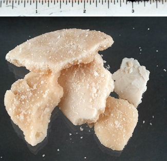
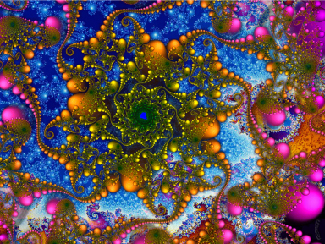
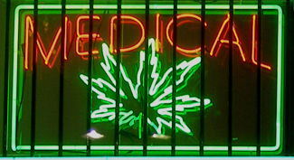

=======================
Substance Use and Abuse
=======================

.. contents::
   :depth: 3
..

.. container::

   By the end of this section, you will be able to: \* Describe the
   diagnostic criteria for substance use disorders \* Identify the
   neurotransmitter systems impacted by various categories of drugs \*
   Describe how different categories of drugs affect behavior and
   experience

While we all experience altered states of consciousness in the form of
sleep on a regular basis, some people use drugs and other substances
that result in altered states of consciousness as well. This section
will present information relating to the use of various psychoactive
drugs and problems associated with such use. This will be followed by
brief descriptions of the effects of some of the more well-known drugs
commonly used today.

SUBSTANCE USE DISORDERS
=======================

The fifth edition of the **Diagnostic and Statistical Manual of Mental
Disorders**\ {: data-type=“term” .no-emphasis}, *Fifth Edition* (DSM-5)
is used by clinicians to diagnose individuals suffering from various
psychological disorders. Drug use disorders are addictive disorders, and
the criteria for specific substance (drug) use disorders are described
in DSM-5. A person who has a substance use disorder often uses more of
the substance than they originally intended to and continues to use that
substance despite experiencing significant adverse consequences. In
individuals diagnosed with a substance use disorder, there is a
compulsive pattern of drug use that is often associated with both
physical and psychological dependence.

**Physical dependence**\ {: data-type=“term”} involves changes in normal
bodily functions—the user will experience withdrawal from the drug upon
cessation of use. In contrast, a person who has **psychological
dependence**\ {: data-type=“term”} has an emotional, rather than
physical, need for the drug and may use the drug to relieve
psychological distress. **Tolerance**\ {: data-type=“term”} is linked to
physiological dependence, and it occurs when a person requires more and
more drug to achieve effects previously experienced at lower doses.
Tolerance can cause the user to increase the amount of drug used to a
dangerous level—even to the point of overdose and death.

Drug **withdrawal**\ {: data-type=“term”} includes a variety of negative
symptoms experienced when drug use is discontinued. These symptoms
usually are opposite of the effects of the drug. For example, withdrawal
from sedative drugs often produces unpleasant arousal and agitation. In
addition to withdrawal, many individuals who are diagnosed with
substance use disorders will also develop tolerance to these substances.
Psychological dependence, or drug craving, is a recent addition to the
diagnostic criteria for substance use disorder in DSM-5. This is an
important factor because we can develop tolerance and experience
withdrawal from any number of drugs that we do not abuse. In other
words, physical dependence in and of itself is of limited utility in
determining whether or not someone has a substance use disorder.

DRUG CATEGORIES
===============

The effects of all psychoactive drugs occur through their interactions
with our endogenous neurotransmitter systems. Many of these drugs, and
their relationships, are shown in `[link] <#Figure_04_05_DrugChart>`__.
As you have learned, drugs can act as agonists or antagonists of a given
neurotransmitter system. An agonist facilitates the activity of a
neurotransmitter system, and antagonists impede neurotransmitter
activity.

|Four main drug categories are identified by differently colored circles
showing overlaps: the four main drug categories are “antipsychotics,”
“stimulants,” “depressants,” and “hallucinogens.” The circle titled
“Antipsychotics” includes the drug names “Haldol,” “Risperdal,” and
“Seroquel.” The circle titled “Stimulants” contains a subcircle titled
“Psychmotor stimulants” with the drug names “Amphetamines,” “Khat,”
“Ritalin,” and “Cocaine.” The “Stimulants” circle contains another
subcircle titled “Methylxanthines” with the drug names “Caffeine,”
“Theophylline,” and “Theobromine.” The circle titled “Depressants”
contains a subcircle titled “Sedative Hypnotics” with the drug names
“Alcohol,” “Barbituates,” “Ether,” and “GHB”; within that circle is a
subcircle titled “Minor tranquilizers” with the drug names “Ativan,”
“Valium,” and “Xanax.” “Nicotine” falls in the overlap between the
“Stimulants” and “Depressants” circles. The circle titled “Depressants”
also contains a subcircle titled “Narcotic Analgesics” with the drug
names “Opium,” “Codeine,” “Morphine,” “Heroin,” and “DXM.” “DXM” falls
in the overlap between the “Depressants” circle and the “Dissociatives”
subcircle of the “Hallucinogens” circle. The circle titled
“Hallucinogens” contains a subcircle labeled “Dissociatives” including
the drug names ”Ketamine,” “PCP,” “Nitrous,” “Amanitas,” and
“Salvinorum.” Within that subcircle, “Ketamine,” “PCP,” and “Nitrous”
overlap with with the “depressants” circle The circle titled
“Hallucinogens” also contains a subcircle titled “Psychadelics”
including the drug names “MDMA,” “Mescaline,” “LSD,” “Psilocybin,”
“AMT,” “DMT,” and “Ibogaine.” Within that subcircle, “MDMA,”
“Mescaline,” “LSD,” “Psilocybin,” and “AMT” fall within the overlap
between the “Hallucinogens” and “Stimulants” circles. “Ibogaine” falls
within the overlap between the “Psychadelics” and “Dissociatives”
subcircles. Outside of all subcircles, “Marijuana” falls within the
overlap between the “Stimulants,” “Depressants,” and “Hallucinogens”
circles.|\ {: #Figure_04_05_DrugChart}

Alcohol and Other Depressants
-----------------------------

Ethanol, which we commonly refer to as alcohol, is in a class of
psychoactive drugs known as depressants
(`[link] <#Figure_04_05_Drugtypes>`__). A **depressant**\ {:
data-type=“term”} is a drug that tends to suppress central nervous
system activity. Other depressants include barbiturates and
benzodiazepines. These drugs share in common their ability to serve as
agonists of the gamma-Aminobutyric acid (GABA) neurotransmitter system.
Because GABA has a quieting effect on the brain, GABA agonists also have
a quieting effect; these types of drugs are often prescribed to treat
both anxiety and insomnia.

|An illustration of a GABA-gated chloride channel in a cell membrane
shows receptor sites for barbiturate, benzodiazepine, GABA, alcohol, and
neurosteroids, as well as three negatively-charged chloride ions passing
through the channel. Each drug type has a specific shape, such as
triangular, rectangular or square, which corresponds to a similarly
shaped receptor spot.|\ {: #Figure_04_05_Drugtypes}

Acute alcohol administration results in a variety of changes to
consciousness. At rather low doses, alcohol use is associated with
feelings of euphoria. As the dose increases, people report feeling
sedated. Generally, alcohol is associated with decreases in reaction
time and visual acuity, lowered levels of alertness, and reduction in
behavioral control. With excessive alcohol use, a person might
experience a complete loss of consciousness and/or difficulty
remembering events that occurred during a period of intoxication (McKim
& Hancock, 2013). In addition, if a pregnant woman consumes alcohol, her
infant may be born with a cluster of birth defects and symptoms
collectively called fetal alcohol spectrum disorder (FASD) or fetal
alcohol syndrome (FAS).

With repeated use of many central nervous system depressants, such as
alcohol, a person becomes physically dependent upon the substance and
will exhibit signs of both tolerance and withdrawal. Psychological
dependence on these drugs is also possible. Therefore, the abuse
potential of central nervous system depressants is relatively high.

Drug withdrawal is usually an aversive experience, and it can be a
life-threatening process in individuals who have a long history of very
high doses of alcohol and/or barbiturates. This is of such concern that
people who are trying to overcome addiction to these substances should
only do so under medical supervision.

Stimulants
----------

**Stimulants**\ {: data-type=“term”} are drugs that tend to increase
overall levels of neural activity. Many of these drugs act as agonists
of the dopamine neurotransmitter system. Dopamine activity is often
associated with reward and craving; therefore, drugs that affect
dopamine neurotransmission often have abuse liability. Drugs in this
category include cocaine, amphetamines (including methamphetamine),
cathinones (i.e., bath salts), MDMA (ecstasy), nicotine, and caffeine.

Cocaine can be taken in multiple ways. While many users snort cocaine,
intravenous injection and ingestion are also common. The freebase
version of cocaine, known as crack, is a potent, smokable version of the
drug. Like many other stimulants, cocaine agonizes the dopamine
neurotransmitter system by blocking the reuptake of dopamine in the
neuronal synapse.

.. container:: psychology dig-deeper

   .. container::

      Crack Cocaine

   Crack (`[link] <#Figure_04_05_Crackrock>`__) is often considered to
   be more addictive than cocaine itself because it is smokable and
   reaches the brain very quickly. Crack is often less expensive than
   other forms of cocaine; therefore, it tends to be a more accessible
   drug for individuals from impoverished segments of society. During
   the 1980s, many drug laws were rewritten to punish crack users more
   severely than cocaine users. This led to discriminatory sentencing
   with low-income, inner-city minority populations receiving the
   harshest punishments. The wisdom of these laws has recently been
   called into question, especially given research that suggests crack
   may not be more addictive than other forms of cocaine, as previously
   thought (Haasen & Krausz, 2001; Reinerman, 2007).

   |A photograph shows crack rocks. A ruler indicates that each crack
   rock is approximately 1–2 inches wide.|\ {: #Figure_04_05_Crackrock}

.. container:: psychology link-to-learning

   Read this interesting `newspaper
   article <http://openstax.org/l/crack>`__ describing myths about crack
   cocaine.

Amphetamines have a mechanism of action quite similar to cocaine in that
they block the reuptake of dopamine in addition to stimulating its
release (`[link] <#Figure_04_05_Stimulants>`__). While amphetamines are
often abused, they are also commonly prescribed to children diagnosed
with attention deficit hyperactivity disorder (ADHD). It may seem
counterintuitive that stimulant medications are prescribed to treat a
disorder that involves hyperactivity, but the therapeutic effect comes
from increases in neurotransmitter activity within certain areas of the
brain associated with impulse control.

|An illustration of a presynaptic cell and a postsynaptic cell shows
these cells’ interactions with cocaine and dopamine molecules. The
presynaptic cell contains two cylinder-shaped channels, one on each side
near where it faces the postsynaptic cell. The postsynaptic cell
contains several receptors, side-by-side across the area that faces the
presynaptic cell. In the space between the two cells, there are both
cocaine and dopamine molecules. One of the cocaine molecules attaches to
one of the presynaptic cell’s channels. This cocaine molecule is labeled
“bound cocaine.” An X-shape is shown over the top of the bound cocaine
and the channel to indicate that the cocaine does not enter the
presynaptic cell. A dopamine molecule is shown inside of the presynaptic
cell’s other channel. Arrows connect this dopamine molecule to several
others inside of the presynaptic cell. More arrows connect to more
dopamine molecules, tracing their paths from the channel into the
presynaptic cell, and out into the space between the presynaptic cell
and the postsynaptic cell. Arrows extend from two of the dopamine
molecules in this in-between space to the postsynaptic cell’s receptors.
Only the dopamine molecules are shown binding to the postsynaptic cell’s
receptors.|\ {: #Figure_04_05_Stimulants}

In recent years, methamphetamine (meth) use has become increasingly
widespread. **Methamphetamine**\ {: data-type=“term”} is a type of
amphetamine that can be made from ingredients that are readily available
(e.g., medications containing pseudoephedrine, a compound found in many
over-the-counter cold and flu remedies). Despite recent changes in laws
designed to make obtaining pseudoephedrine more difficult,
methamphetamine continues to be an easily accessible and relatively
inexpensive drug option (Shukla, Crump, & Chrisco, 2012).

The cocaine, amphetamine, cathinones, and MDMA users seek a **euphoric
high**\ {: data-type=“term”}, feelings of intense elation and pleasure,
especially in those users who take the drug via intravenous injection or
smoking. Repeated use of these stimulants can have significant adverse
consequences. Users can experience physical symptoms that include
nausea, elevated blood pressure, and increased heart rate. In addition,
these drugs can cause feelings of anxiety, hallucinations, and paranoia
(Fiorentini et al., 2011). Normal brain functioning is altered after
repeated use of these drugs. For example, repeated use can lead to
overall depletion among the monoamine neurotransmitters (dopamine,
norepinephrine, and serotonin). People may engage in compulsive use of
these stimulant substances in part to try to reestablish normal levels
of these neurotransmitters (Jayanthi & Ramamoorthy, 2005; Rothman,
Blough, & Baumann, 2007).

Caffeine is another stimulant drug. While it is probably the most
commonly used drug in the world, the potency of this particular drug
pales in comparison to the other stimulant drugs described in this
section. Generally, people use caffeine to maintain increased levels of
alertness and arousal. Caffeine is found in many common medicines (such
as weight loss drugs), beverages, foods, and even cosmetics (Herman &
Herman, 2013). While caffeine may have some indirect effects on dopamine
neurotransmission, its primary mechanism of action involves antagonizing
adenosine activity (Porkka-Heiskanen, 2011).

While **caffeine**\ {: data-type=“term” .no-emphasis} is generally
considered a relatively safe drug, high blood levels of caffeine can
result in insomnia, agitation, muscle twitching, nausea, irregular
heartbeat, and even death (Reissig, Strain, & Griffiths, 2009; Wolt,
Ganetsky, & Babu, 2012). In 2012, Kromann and Nielson reported on a case
study of a 40-year-old woman who suffered significant ill effects from
her use of caffeine. The woman used caffeine in the past to boost her
mood and to provide energy, but over the course of several years, she
increased her caffeine consumption to the point that she was consuming
three liters of soda each day. Although she had been taking a
prescription antidepressant, her symptoms of depression continued to
worsen and she began to suffer physically, displaying significant
warning signs of cardiovascular disease and diabetes. Upon admission to
an outpatient clinic for treatment of mood disorders, she met all of the
diagnostic criteria for substance dependence and was advised to
dramatically limit her caffeine intake. Once she was able to limit her
use to less than 12 ounces of soda a day, both her mental and physical
health gradually improved. Despite the prevalence of caffeine use and
the large number of people who confess to suffering from caffeine
addiction, this was the first published description of soda dependence
appearing in scientific literature.

Nicotine is highly addictive, and the use of tobacco products is
associated with increased risks of heart disease, stroke, and a variety
of cancers. Nicotine exerts its effects through its interaction with
acetylcholine receptors. Acetylcholine functions as a neurotransmitter
in motor neurons. In the central nervous system, it plays a role in
arousal and reward mechanisms. Nicotine is most commonly used in the
form of tobacco products like cigarettes or chewing tobacco; therefore,
there is a tremendous interest in developing effective smoking cessation
techniques. To date, people have used a variety of **nicotine**\ {:
data-type=“term” .no-emphasis} replacement therapies in addition to
various psychotherapeutic options in an attempt to discontinue their use
of tobacco products. In general, smoking cessation programs may be
effective in the short term, but it is unclear whether these effects
persist (Cropley, Theadom, Pravettoni, & Webb, 2008; Levitt, Shaw, Wong,
& Kaczorowski, 2007; Smedslund, Fisher, Boles, & Lichtenstein, 2004).

Opioids
-------

An **opioid**\ {: data-type=“term”} is one of a category of drugs that
includes heroin, morphine, methadone, and codeine. Opioids have
analgesic properties; that is, they decrease pain. Humans have an
endogenous opioid neurotransmitter system—the body makes small
quantities of opioid compounds that bind to opioid receptors reducing
pain and producing euphoria. Thus, opioid drugs, which mimic this
endogenous painkilling mechanism, have an extremely high potential for
abuse. Natural opioids, called **opiates**\ {: data-type=“term”}, are
derivatives of opium, which is a naturally occurring compound found in
the poppy plant. There are now several synthetic versions of opiate
drugs (correctly called opioids) that have very potent painkilling
effects, and they are often abused. For example, the National Institutes
of Drug Abuse has sponsored research that suggests the misuse and abuse
of the prescription pain killers hydrocodone and oxycodone are
significant public health concerns (Maxwell, 2006). In 2013, the U.S.
Food and Drug Administration recommended tighter controls on their
medical use.

Historically, heroin has been a major opioid drug of abuse
(`[link] <#Figure_04_05_Heroin>`__). Heroin can be snorted, smoked, or
injected intravenously. Like the stimulants described earlier, the use
of heroin is associated with an initial feeling of euphoria followed by
periods of agitation. Because heroin is often administered via
intravenous injection, users often bear needle track marks on their arms
and, like all abusers of intravenous drugs, have an increased risk for
contraction of both tuberculosis and HIV.

|Photograph A shows various paraphernalia spread out on a black surface.
The items include a tourniquet, three syringes of varying widths, three
cotton-balls, a tiny cooking vessel, a condom, a capsule of sterile
water, and an alcohol swab. Photograph B shows a hand holding a spoon
containing heroin tar above a small candle.|\ {: #Figure_04_05_Heroin}

Aside from their utility as analgesic drugs, opioid-like compounds are
often found in cough suppressants, anti-nausea, and anti-diarrhea
medications. Given that withdrawal from a drug often involves an
experience opposite to the effect of the drug, it should be no surprise
that opioid withdrawal resembles a severe case of the flu. While opioid
withdrawal can be extremely unpleasant, it is not life-threatening
(Julien, 2005). Still, people experiencing opioid withdrawal may be
given methadone to make withdrawal from the drug less difficult.
**Methadone**\ {: data-type=“term”} is a synthetic opioid that is less
euphorigenic than heroin and similar drugs. **Methadone clinics**\ {:
data-type=“term”} help people who previously struggled with opioid
addiction manage withdrawal symptoms through the use of methadone. Other
drugs, including the opioid buprenorphine, have also been used to
alleviate symptoms of opiate withdrawal.

**Codeine**\ {: data-type=“term”} is an opioid with relatively low
potency. It is often prescribed for minor pain, and it is available
over-the-counter in some other countries. Like all opioids, codeine does
have abuse potential. In fact, abuse of prescription opioid medications
is becoming a major concern worldwide (Aquina, Marques-Baptista,
Bridgeman, & Merlin, 2009; Casati, Sedefov, & Pfeiffer-Gerschel, 2012).

Hallucinogens
-------------

A **hallucinogen**\ {: data-type=“term”} is one of a class of drugs that
results in profound alterations in sensory and perceptual experiences
(`[link] <#Figure_04_05_Psychedelic>`__). In some cases, users
experience vivid visual hallucinations. It is also common for these
types of drugs to cause hallucinations of body sensations (e.g., feeling
as if you are a giant) and a skewed perception of the passage of time.

|An illustration shows a colorful spiral pattern.|\ {:
#Figure_04_05_Psychedelic}

As a group, hallucinogens are incredibly varied in terms of the
neurotransmitter systems they affect. Mescaline and LSD are serotonin
agonists, and PCP (angel dust) and ketamine (an animal anesthetic) act
as antagonists of the NMDA glutamate receptor. In general, these drugs
are not thought to possess the same sort of abuse potential as other
classes of drugs discussed in this section.

.. container:: psychology link-to-learning

   To learn more about some of the most commonly abused prescription and
   street drugs, check out the `Commonly Abused Drugs
   Chart <http://openstax.org/l/drugabuse>`__ and the `Commonly Abused
   Prescription Drugs Chart <http://openstax.org/l/Rxabuse>`__ from the
   National Institute on Drug Abuse.

.. container:: psychology dig-deeper

   .. container::

      Medical Marijuana

   While the possession and use of marijuana is illegal in most states,
   it is now legal in Washington and Colorado to possess limited
   quantities of marijuana for recreational use
   (`[link] <#Figure_04_05_Marijuana>`__). In contrast, medical
   marijuana use is now legal in nearly half of the United States and in
   the District of Columbia. Medical marijuana is marijuana that is
   prescribed by a doctor for the treatment of a health condition. For
   example, people who undergo chemotherapy will often be prescribed
   marijuana to stimulate their appetites and prevent excessive weight
   loss resulting from the side effects of chemotherapy treatment.
   Marijuana may also have some promise in the treatment of a variety of
   medical conditions (Mather, Rauwendaal, Moxham-Hall, & Wodak, 2013;
   Robson, 2014; Schicho & Storr, 2014).

   |A photograph shows a window with a neon sign. The sign includes the
   word “medical” above the shape of a marijuana leaf.|\ {:
   #Figure_04_05_Marijuana}

   While medical marijuana laws have been passed on a state-by-state
   basis, federal laws still classify this as an illicit substance,
   making conducting research on the potentially beneficial medicinal
   uses of marijuana problematic. There is quite a bit of controversy
   within the scientific community as to the extent to which marijuana
   might have medicinal benefits due to a lack of large-scale,
   controlled research (Bostwick, 2012). As a result, many scientists
   have urged the federal government to allow for relaxation of current
   marijuana laws and classifications in order to facilitate a more
   widespread study of the drug’s effects (Aggarwal et al., 2009;
   Bostwick, 2012; Kogan & Mechoulam, 2007).

   Until recently, the United States Department of Justice routinely
   arrested people involved and seized marijuana used in medicinal
   settings. In the latter part of 2013, however, the United States
   Department of Justice issued statements indicating that they would
   not continue to challenge state medical marijuana laws. This shift in
   policy may be in response to the scientific community’s
   recommendations and/or reflect changing public opinion regarding
   marijuana.

Summary
=======

Substance use disorder is defined in DSM-5 as a compulsive pattern of
drug use despite negative consequences. Both physical and psychological
dependence are important parts of this disorder. Alcohol, barbiturates,
and benzodiazepines are central nervous system depressants that affect
GABA neurotransmission. Cocaine, amphetamine, cathinones, and MDMA are
all central nervous stimulants that agonize dopamine neurotransmission,
while nicotine and caffeine affect acetylcholine and adenosine,
respectively. Opiate drugs serve as powerful analgesics through their
effects on the endogenous opioid neurotransmitter system, and
hallucinogenic drugs cause pronounced changes in sensory and perceptual
experiences. The hallucinogens are variable with regards to the specific
neurotransmitter systems they affect.

Review Questions
================

.. container::

   .. container::

      \_______\_ occurs when a drug user requires more and more of a
      given drug in order to experience the same effects of the drug.

      1. withdrawal
      2. psychological dependence
      3. tolerance
      4. reuptake {: type=“a”}

   .. container::

      C

.. container::

   .. container::

      Cocaine blocks the reuptake of \________.

      1. GABA
      2. glutamate
      3. acetylcholine
      4. dopamine {: type=“a”}

   .. container::

      D

.. container::

   .. container::

      \_______\_ refers to drug craving.

      1. psychological dependence
      2. antagonism
      3. agonism
      4. physical dependence {: type=“a”}

   .. container::

      A

.. container::

   .. container::

      LSD affects \_______\_ neurotransmission.

      1. dopamine
      2. serotonin
      3. acetylcholine
      4. norepinephrine {: type=“a”}

   .. container::

      B

Critical Thinking Questions
===========================

.. container::

   .. container::

      The negative health consequences of both alcohol and tobacco
      products are well-documented. A drug like marijuana, on the other
      hand, is generally considered to be as safe, if not safer than
      these legal drugs. Why do you think marijuana use continues to be
      illegal in many parts of the United States?

   .. container::

      One possibility involves the cultural acceptance and long history
      of alcohol and tobacco use in our society. No doubt, money comes
      into play as well. Growing tobacco and producing alcohol on a
      large scale is a well-regulated and taxed process. Given that
      marijuana is essentially a weed that requires little care to grow,
      it would be much more difficult to regulate its production. Recent
      events suggest that cultural attitudes regarding marijuana are
      changing, and it is quite likely that its illicit status will be
      adapted accordingly.

.. container::

   .. container::

      Why are programs designed to educate people about the dangers of
      using tobacco products just as important as developing tobacco
      cessation programs?

   .. container::

      Given that currently available programs designed to help people
      quit using tobacco products are not necessarily effective in the
      long term, programs designed to prevent people from using these
      products in the first place may be the best hope for dealing with
      the enormous public health concerns associated with tobacco use.

Personal Application Question
=============================

.. container::

   .. container::

      Many people experiment with some sort of psychoactive substance at
      some point in their lives. Why do you think people are motivated
      to use substances that alter consciousness?

.. container::

   .. rubric:: Glossary
      :name: glossary

   {: data-type=“glossary-title”}

   codeine
      opiate with relatively low potency often prescribed for minor pain
      ^
   depressant
      drug that tends to suppress central nervous system activity ^
   euphoric high
      feelings of intense elation and pleasure from drug use ^
   hallucinogen
      one of a class of drugs that results in profound alterations in
      sensory and perceptual experiences, often with vivid
      hallucinations ^
   methadone
      synthetic opioid that is less euphorogenic than heroin and similar
      drugs; used to manage withdrawal symptoms in opiate users ^
   methadone clinic
      uses methadone to treat withdrawal symptoms in opiate users ^
   methamphetamine
      type of amphetamine that can be made from pseudoephedrine, an
      over-the-counter drug; widely manufactured and abused ^
   opiate/opioid
      one of a category of drugs that has strong analgesic properties;
      opiates are produced from the resin of the opium poppy; includes
      heroin, morphine, methadone, and codeine ^
   physical dependence
      changes in normal bodily functions that cause a drug user to
      experience withdrawal symptoms upon cessation of use ^
   psychological dependence
      emotional, rather than a physical, need for a drug which may be
      used to relieve psychological distress ^
   stimulant
      drug that tends to increase overall levels of neural activity;
      includes caffeine, nicotine, amphetamines, and cocaine ^
   tolerance
      state of requiring increasing quantities of the drug to gain the
      desired effect ^
   withdrawal
      variety of negative symptoms experienced when drug use is
      discontinued

.. |Four main drug categories are identified by differently colored circles showing overlaps: the four main drug categories are “antipsychotics,” “stimulants,” “depressants,” and “hallucinogens.” The circle titled “Antipsychotics” includes the drug names “Haldol,” “Risperdal,” and “Seroquel.” The circle titled “Stimulants” contains a subcircle titled “Psychmotor stimulants” with the drug names “Amphetamines,” “Khat,” “Ritalin,” and “Cocaine.” The “Stimulants” circle contains another subcircle titled “Methylxanthines” with the drug names “Caffeine,” “Theophylline,” and “Theobromine.” The circle titled “Depressants” contains a subcircle titled “Sedative Hypnotics” with the drug names “Alcohol,” “Barbituates,” “Ether,” and “GHB”; within that circle is a subcircle titled “Minor tranquilizers” with the drug names “Ativan,” “Valium,” and “Xanax.” “Nicotine” falls in the overlap between the “Stimulants” and “Depressants” circles. The circle titled “Depressants” also contains a subcircle titled “Narcotic Analgesics” with the drug names “Opium,” “Codeine,” “Morphine,” “Heroin,” and “DXM.” “DXM” falls in the overlap between the “Depressants” circle and the “Dissociatives” subcircle of the “Hallucinogens” circle. The circle titled “Hallucinogens” contains a subcircle labeled “Dissociatives” including the drug names ”Ketamine,” “PCP,” “Nitrous,” “Amanitas,” and “Salvinorum.” Within that subcircle, “Ketamine,” “PCP,” and “Nitrous” overlap with with the “depressants” circle The circle titled “Hallucinogens” also contains a subcircle titled “Psychadelics” including the drug names “MDMA,” “Mescaline,” “LSD,” “Psilocybin,” “AMT,” “DMT,” and “Ibogaine.” Within that subcircle, “MDMA,” “Mescaline,” “LSD,” “Psilocybin,” and “AMT” fall within the overlap between the “Hallucinogens” and “Stimulants” circles. “Ibogaine” falls within the overlap between the “Psychadelics” and “Dissociatives” subcircles. Outside of all subcircles, “Marijuana” falls within the overlap between the “Stimulants,” “Depressants,” and “Hallucinogens” circles.| image:: ../resources/CNX_Psych_04_05_Drugchart.jpg
.. |An illustration of a GABA-gated chloride channel in a cell membrane shows receptor sites for barbiturate, benzodiazepine, GABA, alcohol, and neurosteroids, as well as three negatively-charged chloride ions passing through the channel. Each drug type has a specific shape, such as triangular, rectangular or square, which corresponds to a similarly shaped receptor spot.| image:: ../resources/CNX_Psych_04_05_Drugtypes.jpg

.. |An illustration of a presynaptic cell and a postsynaptic cell shows these cells’ interactions with cocaine and dopamine molecules. The presynaptic cell contains two cylinder-shaped channels, one on each side near where it faces the postsynaptic cell. The postsynaptic cell contains several receptors, side-by-side across the area that faces the presynaptic cell. In the space between the two cells, there are both cocaine and dopamine molecules. One of the cocaine molecules attaches to one of the presynaptic cell’s channels. This cocaine molecule is labeled “bound cocaine.” An X-shape is shown over the top of the bound cocaine and the channel to indicate that the cocaine does not enter the presynaptic cell. A dopamine molecule is shown inside of the presynaptic cell’s other channel. Arrows connect this dopamine molecule to several others inside of the presynaptic cell. More arrows connect to more dopamine molecules, tracing their paths from the channel into the presynaptic cell, and out into the space between the presynaptic cell and the postsynaptic cell. Arrows extend from two of the dopamine molecules in this in-between space to the postsynaptic cell’s receptors. Only the dopamine molecules are shown binding to the postsynaptic cell’s receptors.| image:: ../resources/CNX_Psych_04_05_Stimulants_n.jpg
.. |Photograph A shows various paraphernalia spread out on a black surface. The items include a tourniquet, three syringes of varying widths, three cotton-balls, a tiny cooking vessel, a condom, a capsule of sterile water, and an alcohol swab. Photograph B shows a hand holding a spoon containing heroin tar above a small candle.| image:: ../resources/CNX_Psych_04_05_Heroin.jpg

