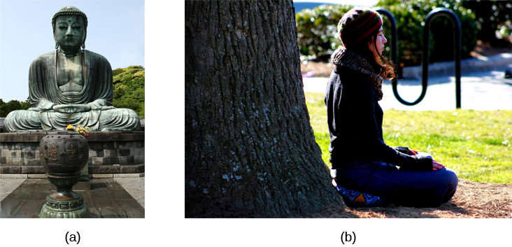

=============================
Other States of Consciousness
=============================

.. contents::
   :depth: 3
..

.. container::

   By the end of this section, you will be able to: \* Define hypnosis
   and meditation \* Understand the similarities and differences of
   hypnosis and meditation

Our states of consciousness change as we move from wakefulness to sleep.
We also alter our consciousness through the use of various psychoactive
drugs. This final section will consider hypnotic and meditative states
as additional examples of altered states of consciousness experienced by
some individuals.

HYPNOSIS
========

**Hypnosis**\ {: data-type=“term”} is a state of extreme self-focus and
attention in which minimal attention is given to external stimuli. In
the therapeutic setting, a clinician may use relaxation and suggestion
in an attempt to alter the thoughts and perceptions of a patient.
Hypnosis has also been used to draw out information believed to be
buried deeply in someone’s memory. For individuals who are especially
open to the power of suggestion, hypnosis can prove to be a very
effective technique, and brain imaging studies have demonstrated that
hypnotic states are associated with global changes in brain functioning
(Del Casale et al., 2012; Guldenmund, Vanhaudenhuyse, Boly, Laureys, &
Soddu, 2012).

Historically, hypnosis has been viewed with some suspicion because of
its portrayal in popular media and entertainment
(`[link] <#Figure_04_06_Hypnotist>`__). Therefore, it is important to
make a distinction between hypnosis as an empirically based therapeutic
approach versus as a form of entertainment. Contrary to popular belief,
individuals undergoing hypnosis usually have clear memories of the
hypnotic experience and are in control of their own behaviors. While
hypnosis may be useful in enhancing memory or a skill, such enhancements
are very modest in nature (Raz, 2011).

|A poster titled “Barnum the Hypnotist” shows illustrations of a person
performing hypnotism.|\ {: #Figure_04_06_Hypnotist}

How exactly does a hypnotist bring a participant to a state of hypnosis?
While there are variations, there are four parts that appear consistent
in bringing people into the state of suggestibility associated with
hypnosis (National Research Council, 1994). These components include:

-  The participant is guided to focus on one thing, such as the
   hypnotist’s words or a ticking watch.
-  The participant is made comfortable and is directed to be relaxed and
   sleepy.
-  The participant is told to be open to the process of hypnosis, trust
   the hypnotist and let go.
-  The participant is encouraged to use his or her imagination.

These steps are conducive to being open to the heightened suggestibility
of hypnosis.

People vary in terms of their ability to be hypnotized, but a review of
available research suggests that most people are at least moderately
hypnotizable (Kihlstrom, 2013). Hypnosis in conjunction with other
techniques is used for a variety of therapeutic purposes and has shown
to be at least somewhat effective for pain management, treatment of
depression and anxiety, smoking cessation, and weight loss (Alladin,
2012; Elkins, Johnson, & Fisher, 2012; Golden, 2012; Montgomery, Schnur,
& Kravits, 2012).

Some scientists are working to determine whether the power of suggestion
can affect cognitive processes such as learning, with a view to using
hypnosis in educational settings (Wark, 2011). Furthermore, there is
some evidence that hypnosis can alter processes that were once thought
to be automatic and outside the purview of voluntary control, such as
reading (Lifshitz, Aubert Bonn, Fischer, Kashem, & Raz, 2013; Raz,
Shapiro, Fan, & Posner, 2002). However, it should be noted that others
have suggested that the automaticity of these processes remains intact
(Augustinova & Ferrand, 2012).

How does hypnosis work? Two theories attempt to answer this question:
One theory views hypnosis as dissociation and the other theory views it
as the performance of a social role. According to the dissociation view,
hypnosis is effectively a dissociated state of consciousness, much like
our earlier example where you may drive to work, but you are only
minimally aware of the process of driving because your attention is
focused elsewhere. This theory is supported by Ernest Hilgard’s research
into hypnosis and pain. In Hilgard’s experiments, he induced
participants into a state of hypnosis, and placed their arms into ice
water. Participants were told they would not feel pain, but they could
press a button if they did; while they reported not feeling pain, they
did, in fact, press the button, suggesting a dissociation of
consciousness while in the hypnotic state (Hilgard & Hilgard, 1994).

Taking a different approach to explain hypnosis, the social-cognitive
theory of hypnosis sees people in hypnotic states as performing the
social role of a hypnotized person. As you will learn when you study
social roles, people’s behavior can be shaped by their expectations of
how they should act in a given situation. Some view a hypnotized
person’s behavior not as an altered or dissociated state of
consciousness, but as their fulfillment of the social expectations for
that role.

MEDITATION
==========

**Meditation**\ {: data-type=“term”} is the act of focusing on a single
target (such as the breath or a repeated sound) to increase awareness of
the moment. While hypnosis is generally achieved through the interaction
of a therapist and the person being treated, an individual can perform
meditation alone. Often, however, people wishing to learn to meditate
receive some training in techniques to achieve a meditative state. A
meditative state, as shown by EEG recordings of newly-practicing
meditators, is not an altered state of consciousness per se; however,
patterns of brain waves exhibited by expert meditators may represent a
unique state of consciousness (Fell, Axmacher, & Haupt, 2010).

Although there are a number of different techniques in use, the central
feature of all meditation is clearing the mind in order to achieve a
state of relaxed awareness and focus (Chen et al., 2013; Lang et al.,
2012). Mindfulness meditation has recently become popular. In the
variation of meditation, the meditator’s attention is focused on some
internal process or an external object (Zeidan, Grant, Brown, McHaffie,
& Coghill, 2012).

Meditative techniques have their roots in religious practices
(`[link] <#Figure_04_06_Buddha>`__), but their use has grown in
popularity among practitioners of alternative medicine. Research
indicates that meditation may help reduce blood pressure, and the
American Heart Association suggests that meditation might be used in
conjunction with more traditional treatments as a way to manage
hypertension, although there is not sufficient data for a recommendation
to be made (Brook et al., 2013). Like hypnosis, meditation also shows
promise in stress management, sleep quality (Caldwell, Harrison, Adams,
Quin, & Greeson, 2010), treatment of mood and anxiety disorders (Chen et
al., 2013; Freeman et al., 2010; Vøllestad, Nielsen, & Nielsen, 2012),
and pain management (Reiner, Tibi, & Lipsitz, 2013).

|Photograph A shows a statue of Buddha with eyes closed and legs
crisscrossed. Photograph B shows a person in a similar position.|\ {:
#Figure_04_06_Buddha}

.. container:: psychology link-to-learning

   Feeling stressed? Think meditation might help? This `instructional
   video <https://www.youtube.com/watch?v=Lkb1YWEPCxw>`__ teaches how to
   use Buddhist meditation techniques to alleviate stress.

.. container:: psychology link-to-learning

   Watch this `video <http://openstax.org/l/brainimaging>`__ describe
   the results of a brain imaging study in individuals who underwent
   specific mindfulness-meditative techniques.

Summary
=======

Hypnosis is a focus on the self that involves suggested changes of
behavior and experience. Meditation involves relaxed, yet focused,
awareness. Both hypnotic and meditative states may involve altered
states of consciousness that have potential application for the
treatment of a variety of physical and psychological disorders.

Review Questions
================

.. container::

   .. container::

      \_______\_ is most effective in individuals that are very open to
      the power of suggestion.

      1. hypnosis
      2. meditation
      3. mindful awareness
      4. cognitive therapy {: type=“a”}

   .. container::

      A

.. container::

   .. container::

      \_______\_ has its roots in religious practice.

      1. hypnosis
      2. meditation
      3. cognitive therapy
      4. behavioral therapy {: type=“a”}

   .. container::

      B

.. container::

   .. container::

      Meditation may be helpful in \________.

      1. pain management
      2. stress control
      3. treating the flu
      4. both a and b {: type=“a”}

   .. container::

      D

.. container::

   .. container::

      Research suggests that cognitive processes, such as learning, may
      be affected by \________.

      1. hypnosis
      2. meditation
      3. mindful awareness
      4. progressive relaxation {: type=“a”}

   .. container::

      A

Critical Thinking Questions
===========================

.. container::

   .. container::

      What advantages exist for researching the potential health
      benefits of hypnosis?

   .. container::

      Healthcare and pharmaceutical costs continue to skyrocket. If
      alternative approaches to dealing with these problems could be
      developed that would be relatively inexpensive, then the potential
      benefits are many.

.. container::

   .. container::

      What types of studies would be most convincing regarding the
      effectiveness of meditation in the treatment for some type of
      physical or mental disorder?

   .. container::

      Ideally, double-blind experimental trials would be best suited to
      speak to the effectiveness of meditation. At the very least, some
      sort of randomized control trial would be very informative.

Personal Application Question
=============================

.. container::

   .. container::

      Under what circumstances would you be willing to consider hypnosis
      and/or meditation as a treatment option? What kind of information
      would you need before you made a decision to use these techniques?

.. container::

   .. rubric:: Glossary
      :name: glossary

   {: data-type=“glossary-title”}

   hypnosis
      state of extreme self-focus and attention in which minimal
      attention is given to external stimuli ^
   meditation
      clearing the mind in order to achieve a state of relaxed awareness
      and focus

