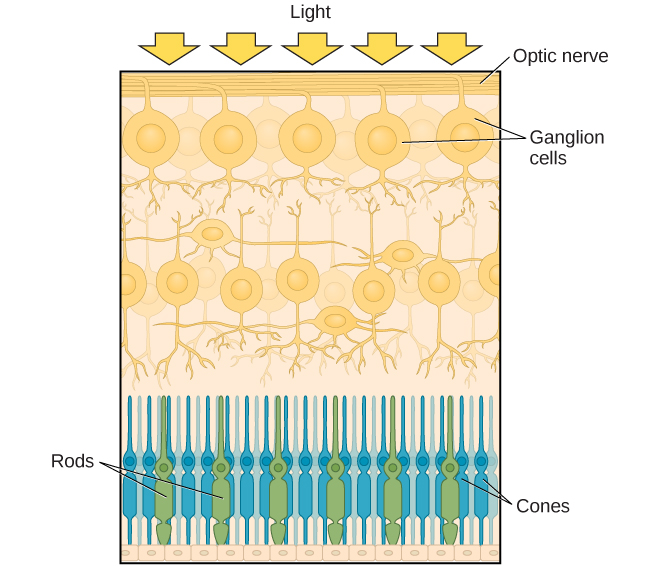

======
Vision
======

.. contents::
   :depth: 3
..

.. container::

   By the end of this section, you will be able to: \* Describe the
   basic anatomy of the visual system \* Discuss how rods and cones
   contribute to different aspects of vision \* Describe how monocular
   and binocular cues are used in the perception of depth

The visual system constructs a mental representation of the world around
us (`[link] <#Figure_05_03_Eyes>`__). This contributes to our ability to
successfully navigate through physical space and interact with important
individuals and objects in our environments. This section will provide
an overview of the basic anatomy and function of the visual system. In
addition, we will explore our ability to perceive color and depth.

|Several photographs of peoples’ eyes are shown.|\ {:
#Figure_05_03_Eyes}

ANATOMY OF THE VISUAL SYSTEM
============================

The eye is the major sensory organ involved in **vision**\ {:
data-type=“term” .no-emphasis} (`[link] <#Figure_05_03_Eye>`__). Light
waves are transmitted across the cornea and enter the eye through the
pupil. The **cornea**\ {: data-type=“term”} is the transparent covering
over the eye. It serves as a barrier between the inner eye and the
outside world, and it is involved in focusing light waves that enter the
eye. The **pupil**\ {: data-type=“term”} is the small opening in the eye
through which light passes, and the size of the pupil can change as a
function of light levels as well as emotional arousal. When light levels
are low, the pupil will become dilated, or expanded, to allow more light
to enter the eye. When light levels are high, the pupil will constrict,
or become smaller, to reduce the amount of light that enters the eye.
The pupil’s size is controlled by muscles that are connected to the
**iris**\ {: data-type=“term”}, which is the colored portion of the eye.

|Different parts of the eye are labeled in this illustration. The
cornea, pupil, iris, and lens are situated toward the front of the eye,
and at the back are the optic nerve, fovea, and retina.|\ {:
#Figure_05_03_Eye}

After passing through the pupil, light crosses the **lens**\ {:
data-type=“term”}, a curved, transparent structure that serves to
provide additional focus. The lens is attached to muscles that can
change its shape to aid in focusing light that is reflected from near or
far objects. In a normal-sighted individual, the lens will focus images
perfectly on a small indentation in the back of the eye known as the
**fovea**\ {: data-type=“term”}, which is part of the **retina**\ {:
data-type=“term”}, the light-sensitive lining of the eye. The fovea
contains densely packed specialized photoreceptor cells
(`[link] <#Figure_05_03_RodsCones>`__). These **photoreceptor**\ {:
data-type=“term”} cells, known as cones, are light-detecting cells. The
**cones**\ {: data-type=“term”} are specialized types of photoreceptors
that work best in bright light conditions. Cones are very sensitive to
acute detail and provide tremendous spatial resolution. They also are
directly involved in our ability to perceive color.

While cones are concentrated in the fovea, where images tend to be
focused, rods, another type of photoreceptor, are located throughout the
remainder of the retina. **Rods**\ {: data-type=“term”} are specialized
photoreceptors that work well in low light conditions, and while they
lack the spatial resolution and color function of the cones, they are
involved in our vision in dimly lit environments as well as in our
perception of movement on the periphery of our visual field.

|This illustration shows light reaching the optic nerve, beneath which
are Ganglion cells, and then rods and cones.|\ {:
#Figure_05_03_RodsCones}

We have all experienced the different sensitivities of rods and cones
when making the transition from a brightly lit environment to a dimly
lit environment. Imagine going to see a blockbuster movie on a clear
summer day. As you walk from the brightly lit lobby into the dark
theater, you notice that you immediately have difficulty seeing much of
anything. After a few minutes, you begin to adjust to the darkness and
can see the interior of the theater. In the bright environment, your
vision was dominated primarily by cone activity. As you move to the dark
environment, rod activity dominates, but there is a delay in
transitioning between the phases. If your rods do not transform light
into nerve impulses as easily and efficiently as they should, you will
have difficulty seeing in dim light, a condition known as night
blindness.

Rods and cones are connected (via several interneurons) to retinal
ganglion cells. Axons from the retinal ganglion cells converge and exit
through the back of the eye to form the **optic nerve**\ {:
data-type=“term”}. The optic nerve carries visual information from the
retina to the brain. There is a point in the visual field called the
**blind spot**\ {: data-type=“term”}: Even when light from a small
object is focused on the blind spot, we do not see it. We are not
consciously aware of our blind spots for two reasons: First, each eye
gets a slightly different view of the visual field; therefore, the blind
spots do not overlap. Second, our visual system fills in the blind spot
so that although we cannot respond to visual information that occurs in
that portion of the visual field, we are also not aware that information
is missing.

The optic nerve from each eye merges just below the brain at a point
called the **optic chiasm**\ {: data-type=“term”}. As
`[link] <#Figure_05_03_OpticChias>`__ shows, the optic chiasm is an
X-shaped structure that sits just below the cerebral cortex at the front
of the brain. At the point of the optic chiasm, information from the
right visual field (which comes from both eyes) is sent to the left side
of the brain, and information from the left visual field is sent to the
right side of the brain.

|An illustration shows the location of the occipital lobe, optic chiasm,
optic nerve, and the eyes in relation to their position in the brain and
head.|\ {: #Figure_05_03_OpticChias}

Once inside the brain, visual information is sent via a number of
structures to the occipital lobe at the back of the brain for
processing. Visual information might be processed in parallel pathways
which can generally be described as the “what pathway” and the
“where/how” pathway. The “what pathway” is involved in object
recognition and identification, while the “where/how pathway” is
involved with location in space and how one might interact with a
particular visual stimulus (Milner & Goodale, 2008; Ungerleider & Haxby,
1994). For example, when you see a ball rolling down the street, the
“what pathway” identifies what the object is, and the “where/how
pathway” identifies its location or movement in space.

COLOR AND DEPTH PERCEPTION
==========================

We do not see the world in black and white; neither do we see it as
two-dimensional (2-D) or flat (just height and width, no depth). Let’s
look at how color vision works and how we perceive three dimensions
(height, width, and depth).

Color Vision
------------

Normal-sighted individuals have three different types of cones that
mediate **color vision**\ {: data-type=“term” .no-emphasis}. Each of
these cone types is maximally sensitive to a slightly different
wavelength of light. According to the **trichromatic theory of color
vision**\ {: data-type=“term”}, shown in
`[link] <#Figure_05_03_Trichrom>`__, all colors in the spectrum can be
produced by combining red, green, and blue. The three types of cones are
each receptive to one of the colors.

|A graph is shown with “sensitivity” plotted on the y-axis and
“Wavelength” in nanometers plotted along the x-axis with measurements of
400, 500, 600, and 700. Three lines in different colors move from the
base to the peak of the y axis, and back to the base. The blue line
begins at 400 nm and hits its peak of sensitivity around 455 nanometers,
before the sensitivity drops off at roughly the same rate at which it
increased, returning to the lowest sensitivity around 530 nm . The green
line begins at 400 nm and reaches its peak of sensitivity around 535
nanometers. Its sensitivity then decreases at roughly the same rate at
which it increased, returning to the lowest sensitivity around 650 nm.
The red line follows the same pattern as the first two, beginning at 400
nm, increasing and decreasing at the same rate, and it hits its height
of sensitivity around 580 nanometers. Below this graph is a horizontal
bar showing the colors of the visible spectrum.|\ {:
#Figure_05_03_Trichrom}

The trichromatic theory of color vision is not the only theory—another
major theory of color vision is known as the **opponent-process
theory**\ {: data-type=“term”}. According to this theory, color is coded
in opponent pairs: black-white, yellow-blue, and green-red. The basic
idea is that some cells of the visual system are excited by one of the
opponent colors and inhibited by the other. So, a cell that was excited
by wavelengths associated with green would be inhibited by wavelengths
associated with red, and vice versa. One of the implications of opponent
processing is that we do not experience greenish-reds or yellowish-blues
as colors. Another implication is that this leads to the experience of
negative afterimages. An **afterimage**\ {: data-type=“term”} describes
the continuation of a visual sensation after removal of the stimulus.
For example, when you stare briefly at the sun and then look away from
it, you may still perceive a spot of light although the stimulus (the
sun) has been removed. When color is involved in the stimulus, the color
pairings identified in the opponent-process theory lead to a negative
afterimage. You can test this concept using the flag in
`[link] <#Figure_05_03_Afterimage>`__.

|An illustration shows a green flag with a thick, black-bordered yellow
lines meeting slightly to the left of the center. A small white dot sits
within the yellow space in the exact center of the flag.|\ {:
#Figure_05_03_Afterimage}

But these two theories—the trichromatic theory of color vision and the
opponent-process theory—are not mutually exclusive. Research has shown
that they just apply to different levels of the nervous system. For
visual processing on the retina, trichromatic theory applies: the cones
are responsive to three different wavelengths that represent red, blue,
and green. But once the signal moves past the retina on its way to the
brain, the cells respond in a way consistent with opponent-process
theory (Land, 1959; Kaiser, 1997).

.. container:: psychology link-to-learning

   Watch this `video <https://www.youtube.com/watch?v=1IqXyu14kpY>`__ to
   learn about color vision in more detail.

Depth Perception
----------------

Our ability to perceive spatial relationships in three-dimensional (3-D)
space is known as **depth perception**\ {: data-type=“term”}. With depth
perception, we can describe things as being in front, behind, above,
below, or to the side of other things.

Our world is three-dimensional, so it makes sense that our mental
representation of the world has three-dimensional properties. We use a
variety of cues in a visual scene to establish our sense of depth. Some
of these are **binocular**\ {: data-type=“term”} **cues**\ {:
data-type=“term”}, which means that they rely on the use of both eyes.
One example of a binocular depth cue is **binocular disparity**\ {:
data-type=“term”}, the slightly different view of the world that each of
our eyes receives. To experience this slightly different view, do this
simple exercise: extend your arm fully and extend one of your fingers
and focus on that finger. Now, close your left eye without moving your
head, then open your left eye and close your right eye without moving
your head. You will notice that your finger seems to shift as you
alternate between the two eyes because of the slightly different view
each eye has of your finger.

A 3-D movie works on the same principle: the special glasses you wear
allow the two slightly different images projected onto the screen to be
seen separately by your left and your right eye. As your brain processes
these images, you have the illusion that the leaping animal or running
person is coming right toward you.

Although we rely on binocular cues to experience depth in our 3-D world,
we can also perceive depth in 2-D arrays. Think about all the paintings
and photographs you have seen. Generally, you pick up on depth in these
images even though the visual stimulus is 2-D. When we do this, we are
relying on a number of **monocular cues**\ {: data-type=“term”}, or cues
that require only one eye. If you think you can’t see depth with one
eye, note that you don’t bump into things when using only one eye while
walking—and, in fact, we have more monocular cues than binocular cues.

An example of a monocular cue would be what is known as linear
perspective. **Linear perspective**\ {: data-type=“term”} refers to the
fact that we perceive depth when we see two parallel lines that seem to
converge in an image (`[link] <#Figure_05_03_LinPerspec>`__). Some other
monocular depth cues are interposition, the partial overlap of objects,
and the relative size and closeness of images to the horizon.

|A photograph shows an empty road that continues toward the
horizon.|\ {: #Figure_05_03_LinPerspec}

.. container:: dig-deeper

   .. container::

      Stereoblindness

   Bruce Bridgeman was born with an extreme case of lazy eye that
   resulted in him being stereoblind, or unable to respond to binocular
   cues of depth. He relied heavily on monocular depth cues, but he
   never had a true appreciation of the 3-D nature of the world around
   him. This all changed one night in 2012 while Bruce was seeing a
   movie with his wife.

   The movie the couple was going to see was shot in 3-D, and even
   though he thought it was a waste of money, Bruce paid for the 3-D
   glasses when he purchased his ticket. As soon as the film began,
   Bruce put on the glasses and experienced something completely new.
   For the first time in his life he appreciated the true depth of the
   world around him. Remarkably, his ability to perceive depth persisted
   outside of the movie theater.

   There are cells in the nervous system that respond to binocular depth
   cues. Normally, these cells require activation during early
   development in order to persist, so experts familiar with Bruce’s
   case (and others like his) assume that at some point in his
   development, Bruce must have experienced at least a fleeting moment
   of binocular vision. It was enough to ensure the survival of the
   cells in the visual system tuned to binocular cues. The mystery now
   is why it took Bruce nearly 70 years to have these cells activated
   (Peck, 2012).

Summary
-------

Light waves cross the cornea and enter the eye at the pupil. The eye’s
lens focuses this light so that the image is focused on a region of the
retina known as the fovea. The fovea contains cones that possess high
levels of visual acuity and operate best in bright light conditions.
Rods are located throughout the retina and operate best under dim light
conditions. Visual information leaves the eye via the optic nerve.
Information from each visual field is sent to the opposite side of the
brain at the optic chiasm. Visual information then moves through a
number of brain sites before reaching the occipital lobe, where it is
processed.

Two theories explain color perception. The trichromatic theory asserts
that three distinct cone groups are tuned to slightly different
wavelengths of light, and it is the combination of activity across these
cone types that results in our perception of all the colors we see. The
opponent-process theory of color vision asserts that color is processed
in opponent pairs and accounts for the interesting phenomenon of a
negative afterimage. We perceive depth through a combination of
monocular and binocular depth cues.

Review Questions
================

.. container::

   .. container::

      The \_______\_ is a small indentation of the retina that contains
      cones.

      1. optic chiasm
      2. optic nerve
      3. fovea
      4. iris {: type=“a”}

   .. container::

      C

.. container::

   .. container::

      \_______\_ operate best under bright light conditions.

      1. cones
      2. rods
      3. retinal ganglion cells
      4. striate cortex {: type=“a”}

   .. container::

      A

.. container::

   .. container::

      \_______\_ depth cues require the use of both eyes.

      1. monocular
      2. binocular
      3. linear perspective
      4. accommodating {: type=“a”}

   .. container::

      B

.. container::

   .. container::

      If you were to stare at a green dot for a relatively long period
      of time and then shift your gaze to a blank white screen, you
      would see a \_______\_ negative afterimage.

      1. blue
      2. yellow
      3. black
      4. red {: type=“a”}

   .. container::

      D

Critical Thinking Question
==========================

.. container::

   .. container::

      Compare the two theories of color perception. Are they completely
      different?

   .. container::

      The trichromatic theory of color vision and the opponent-process
      theory are not mutually exclusive. Research has shown they apply
      to different levels of the nervous system. For visual processing
      on the retina, trichromatic theory applies: the cones are
      responsive to three different wavelengths that represent red,
      blue, and green. But once the signal moves past the retina on its
      way to the brain, the cells respond in a way consistent with
      opponent-process theory.

.. container::

   .. container::

      Color is not a physical property of our environment. What function
      (if any) do you think color vision serves?

   .. container::

      Color vision probably serves multiple adaptive purposes. One
      popular hypothesis suggests that seeing in color allowed our
      ancestors to differentiate ripened fruits and vegetables more
      easily.

Personal Application Question
=============================

.. container::

   .. container::

      Take a look at a few of your photos or personal works of art. Can
      you find examples of linear perspective as a potential depth cue?

.. container::

   .. rubric:: Glossary
      :name: glossary

   {: data-type=“glossary-title”}

   afterimage
      continuation of a visual sensation after removal of the stimulus ^
   binocular cue
      cue that relies on the use of both eyes ^
   binocular disparity
      slightly different view of the world that each eye receives ^
   blind spot
      point where we cannot respond to visual information in that
      portion of the visual field ^
   cone
      specialized photoreceptor that works best in bright light
      conditions and detects color ^
   cornea
      transparent covering over the eye ^
   depth perception
      ability to perceive depth ^
   fovea
      small indentation in the retina that contains cones ^
   iris
      colored portion of the eye ^
   lens
      curved, transparent structure that provides additional focus for
      light entering the eye ^
   linear perspective
      perceive depth in an image when two parallel lines seem to
      converge ^
   monocular cue
      cue that requires only one eye ^
   opponent-process theory of color perception
      color is coded in opponent pairs: black-white, yellow-blue, and
      red-green ^
   optic chiasm
      X-shaped structure that sits just below the brain’s ventral
      surface; represents the merging of the optic nerves from the two
      eyes and the separation of information from the two sides of the
      visual field to the opposite side of the brain ^
   optic nerve
      carries visual information from the retina to the brain ^
   photoreceptor
      light-detecting cell ^
   pupil
      small opening in the eye through which light passes ^
   retina
      light-sensitive lining of the eye ^
   rod
      specialized photoreceptor that works well in low light conditions
      ^
   trichromatic theory of color perception
      color vision is mediated by the activity across the three groups
      of cones

.. |Different parts of the eye are labeled in this illustration. The cornea, pupil, iris, and lens are situated toward the front of the eye, and at the back are the optic nerve, fovea, and retina.| image:: ../resources/CNX_Psych_05_03_Eye.jpg

.. |An illustration shows the location of the occipital lobe, optic chiasm, optic nerve, and the eyes in relation to their position in the brain and head.| image:: ../resources/CNX_Psych_05_03_OpticChias.jpg
.. |A graph is shown with “sensitivity” plotted on the y-axis and “Wavelength” in nanometers plotted along the x-axis with measurements of 400, 500, 600, and 700. Three lines in different colors move from the base to the peak of the y axis, and back to the base. The blue line begins at 400 nm and hits its peak of sensitivity around 455 nanometers, before the sensitivity drops off at roughly the same rate at which it increased, returning to the lowest sensitivity around 530 nm . The green line begins at 400 nm and reaches its peak of sensitivity around 535 nanometers. Its sensitivity then decreases at roughly the same rate at which it increased, returning to the lowest sensitivity around 650 nm. The red line follows the same pattern as the first two, beginning at 400 nm, increasing and decreasing at the same rate, and it hits its height of sensitivity around 580 nanometers. Below this graph is a horizontal bar showing the colors of the visible spectrum.| image:: ../resources/CNX_Psych_05_03_Trichrom.jpg
.. |An illustration shows a green flag with a thick, black-bordered yellow lines meeting slightly to the left of the center. A small white dot sits within the yellow space in the exact center of the flag.| image:: ../resources/CNX_Psych_05_03_Afterimage.jpg

