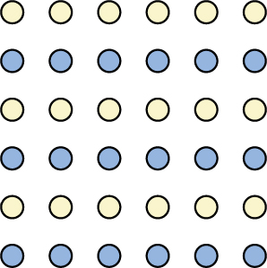
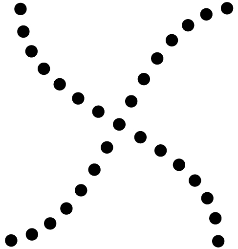
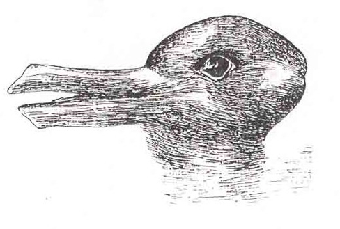

================================
Gestalt Principles of Perception
================================

.. contents::
   :depth: 3
..

.. container::

   By the end of this section, you will be able to: \* Explain the
   figure-ground relationship \* Define Gestalt principles of grouping
   \* Describe how perceptual set is influenced by an individual’s
   characteristics and mental state

In the early part of the 20th century, Max Wertheimer published a paper
demonstrating that individuals perceived motion in rapidly flickering
static images—an insight that came to him as he used a child’s toy
tachistoscope. Wertheimer, and his assistants Wolfgang Köhler and Kurt
Koffka, who later became his partners, believed that perception involved
more than simply combining sensory stimuli. This belief led to a new
movement within the field of psychology known as **Gestalt
psychology**\ {: data-type=“term”}. The word gestalt literally means
form or pattern, but its use reflects the idea that the whole is
different from the sum of its parts. In other words, the brain creates a
perception that is more than simply the sum of available sensory inputs,
and it does so in predictable ways. Gestalt psychologists translated
these predictable ways into principles by which we organize sensory
information. As a result, Gestalt psychology has been extremely
influential in the area of sensation and perception (Rock & Palmer,
1990).

One Gestalt principle is the **figure-ground relationship**\ {:
data-type=“term”}. According to this principle, we tend to segment our
visual world into figure and ground. Figure is the object or person that
is the focus of the visual field, while the ground is the background. As
`[link] <#Figure_05_06_FacesVase>`__ shows, our perception can vary
tremendously, depending on what is perceived as figure and what is
perceived as ground. Presumably, our ability to interpret sensory
information depends on what we label as figure and what we label as
ground in any particular case, although this assumption has been called
into question (Peterson & Gibson, 1994; Vecera & O’Reilly, 1998).

|An illustration shows two identical black face-like shapes that face
towards one another, and one white vase-like shape that occupies all of
the space in between them. Depending on which part of the illustration
is focused on, either the black shapes or the white shape may appear to
be the object of the illustration, leaving the other(s) perceived as
negative space.|\ {: #Figure_05_06_FacesVase}

Another Gestalt principle for organizing sensory stimuli into meaningful
perception is **proximity**\ {: data-type=“term”}. This principle
asserts that things that are close to one another tend to be grouped
together, as `[link] <#Figure_05_06_Proximity>`__ illustrates.

|Illustration A shows thirty-six dots in six evenly-spaced rows and
columns. Illustration B shows thirty-six dots in six evenly-spaced rows
but with the columns separated into three sets of two columns.|\ {:
#Figure_05_06_Proximity}

How we read something provides another illustration of the proximity
concept. For example, we read this sentence like this, notl iket hiso rt
hat. We group the letters of a given word together because there are no
spaces between the letters, and we perceive words because there are
spaces between each word. Here are some more examples: Cany oum akes
enseo ft hiss entence? What doth es e wor dsmea n?

We might also use the principle of **similarity**\ {: data-type=“term”}
to group things in our visual fields. According to this principle,
things that are alike tend to be grouped together
(`[link] <#Figure_05_06_Similarity>`__). For example, when watching a
football game, we tend to group individuals based on the colors of their
uniforms. When watching an offensive drive, we can get a sense of the
two teams simply by grouping along this dimension.

|An illustration shows six rows of six dots each. The rows of dots
alternate between blue and white colored dots.|\ {:
#Figure_05_06_Similarity}

Two additional Gestalt principles are the law of continuity (or **good
continuation**\ {: data-type=“term”}) and **closure**\ {:
data-type=“term”}. The law of continuity suggests that we are more
likely to perceive continuous, smooth flowing lines rather than jagged,
broken lines (`[link] <#Figure_05_06_Continuity>`__). The **principle of
closure**\ {: data-type=“term”} states that we organize our perceptions
into complete objects rather than as a series of parts
(`[link] <#Figure_05_06_Closure>`__).

|An illustration shows two lines of diagonal dots that cross in the
middle in the general shape of an “X.”|\ {: #Figure_05_06_Continuity}

|An illustration shows fragmented lines that would form a circle if they
were connected. Another illustration shows fragmented lines that would
form a square if they were connected.|\ {: #Figure_05_06_Closure}

.. container:: psychology link-to-learning

   Watch this `video <http://openstax.org/l/gestalt>`__ showing real
   world illustrations of Gestalt principles.

According to Gestalt theorists, **pattern perception**\ {:
data-type=“term”}, or our ability to discriminate among different
figures and shapes, occurs by following the principles described above.
You probably feel fairly certain that your perception accurately matches
the real world, but this is not always the case. Our perceptions are
based on **perceptual hypotheses**\ {: data-type=“term”}: educated
guesses that we make while interpreting sensory information. These
hypotheses are informed by a number of factors, including our
personalities, experiences, and expectations. We use these hypotheses to
generate our perceptual set. For instance, research has demonstrated
that those who are given verbal priming produce a biased interpretation
of complex ambiguous figures (Goolkasian & Woodbury, 2010).

.. container:: psychology dig-deeper

   .. container::

      The Depths of Perception: Bias, Prejudice, and Cultural Factors

   In this chapter, you have learned that perception is a complex
   process. Built from sensations, but influenced by our own
   experiences, biases, prejudices, and **cultures**\ {:
   data-type=“term” .no-emphasis}, perceptions can be very different
   from person to person. Research suggests that implicit racial
   **prejudice**\ {: data-type=“term” .no-emphasis} and
   **stereotypes**\ {: data-type=“term” .no-emphasis} affect perception.
   For instance, several studies have demonstrated that non-Black
   participants identify weapons faster and are more likely to identify
   non-weapons as weapons when the image of the weapon is paired with
   the image of a Black person (Payne, 2001; Payne, Shimizu, & Jacoby,
   2005). Furthermore, White individuals’ decisions to shoot an armed
   target in a video game is made more quickly when the target is Black
   (Correll, Park, Judd, & Wittenbrink, 2002; Correll, Urland, & Ito,
   2006). This research is important, considering the number of very
   high-profile cases in the last few decades in which young Blacks were
   killed by people who claimed to believe that the unarmed individuals
   were armed and/or represented some threat to their personal safety.

Summary
=======

Gestalt theorists have been incredibly influential in the areas of
sensation and perception. Gestalt principles such as figure-ground
relationship, grouping by proximity or similarity, the law of good
continuation, and closure are all used to help explain how we organize
sensory information. Our perceptions are not infallible, and they can be
influenced by bias, prejudice, and other factors.

Review Questions
================

.. container::

   .. container::

      According to the principle of \________, objects that occur close
      to one another tend to be grouped together.

      1. similarity
      2. good continuation
      3. proximity
      4. closure {: type=“a”}

   .. container::

      C

.. container::

   .. container::

      Our tendency to perceive things as complete objects rather than as
      a series of parts is known as the principle of \________.

      1. closure
      2. good continuation
      3. proximity
      4. similarity {: type=“a”}

   .. container::

      A

.. container::

   .. container::

      According to the law of \________, we are more likely to perceive
      smoothly flowing lines rather than choppy or jagged lines.

      1. closure
      2. good continuation
      3. proximity
      4. similarity {: type=“a”}

   .. container::

      B

.. container::

   .. container::

      The main point of focus in a visual display is known as the
      \________.

      1. closure
      2. perceptual set
      3. ground
      4. figure {: type=“a”}

   .. container::

      D

Critical Thinking Question
==========================

.. container::

   .. container::

      The central tenet of Gestalt psychology is that the whole is
      different from the sum of its parts. What does this mean in the
      context of perception?

   .. container::

      This means that perception cannot be understood completely simply
      by combining the parts. Rather, the relationship that exists among
      those parts (which would be established according to the
      principles described in this chapter) is important in organizing
      and interpreting sensory information into a perceptual set.

.. container::

   .. container::

      Take a look at the following figure. How might you influence
      whether people see a duck or a rabbit?

      |A drawing appears to be a duck when viewed horizontally and a
      rabbit when viewed vertically.|\ {: #Figure_05_06_DuckRabbit}

   .. container::

      Playing on their expectations could be used to influence what they
      were most likely to see. For instance, telling a story about Peter
      Rabbit and then presenting this image would bias perception along
      rabbit lines.

Personal Application Question
=============================

.. container::

   .. container::

      Have you ever listened to a song on the radio and sung along only
      to find out later that you have been singing the wrong lyrics?
      Once you found the correct lyrics, did your perception of the song
      change?

.. container::

   .. rubric:: Glossary
      :name: glossary

   {: data-type=“glossary-title”}

   closure
      organizing our perceptions into complete objects rather than as a
      series of parts ^
   figure-ground relationship
      segmenting our visual world into figure and ground ^
   Gestalt psychology
      field of psychology based on the idea that the whole is different
      from the sum of its parts ^
   good continuation
      (also, continuity) we are more likely to perceive continuous,
      smooth flowing lines rather than jagged, broken lines ^
   pattern perception
      ability to discriminate among different figures and shapes ^
   perceptual hypothesis
      educated guess used to interpret sensory information ^
   principle of closure
      organize perceptions into complete objects rather than as a series
      of parts ^
   proximity
      things that are close to one another tend to be grouped together ^
   similarity
      things that are alike tend to be grouped together

.. |An illustration shows two identical black face-like shapes that face towards one another, and one white vase-like shape that occupies all of the space in between them. Depending on which part of the illustration is focused on, either the black shapes or the white shape may appear to be the object of the illustration, leaving the other(s) perceived as negative space.| image:: ../resources/CNX_Psych_05_06_FacesVase.jpg
.. |Illustration A shows thirty-six dots in six evenly-spaced rows and columns. Illustration B shows thirty-six dots in six evenly-spaced rows but with the columns separated into three sets of two columns.| image:: ../resources/CNX_Psych_05_06_Proximity.jpg

.. |An illustration shows fragmented lines that would form a circle if they were connected. Another illustration shows fragmented lines that would form a square if they were connected.| image:: ../resources/CNX_Psych_05_06_Closure.jpg

