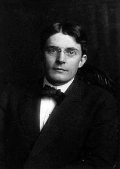

======================
Classical Conditioning
======================

.. contents::
   :depth: 3
..

.. container::

   By the end of this section, you will be able to: \* Explain how
   classical conditioning occurs \* Summarize the processes of
   acquisition, extinction, spontaneous recovery, generalization, and
   discrimination

Does the name Ivan **Pavlov**\ {: data-type=“term” .no-emphasis} ring a
bell? Even if you are new to the study of psychology, chances are that
you have heard of Pavlov and his famous dogs.

Pavlov (1849–1936), a Russian scientist, performed extensive research on
dogs and is best known for his experiments in classical
**conditioning**\ {: data-type=“term” .no-emphasis}
(`[link] <#Figure06_02_Pavlov>`__). As we discussed briefly in the
previous section, **classical conditioning**\ {: data-type=“term”} is a
process by which we learn to associate stimuli and, consequently, to
anticipate events.

|A portrait shows Ivan Pavlov.|\ {: #Figure06_02_Pavlov}

Pavlov came to his conclusions about how learning occurs completely by
accident. Pavlov was a physiologist, not a psychologist. Physiologists
study the life processes of organisms, from the molecular level to the
level of cells, organ systems, and entire organisms. Pavlov’s area of
interest was the digestive system (Hunt, 2007). In his studies with
dogs, Pavlov surgically implanted tubes inside dogs’ cheeks to collect
saliva. He then measured the amount of saliva produced in response to
various foods. Over time, Pavlov (1927) observed that the dogs began to
salivate not only at the taste of food, but also at the sight of food,
at the sight of an empty food bowl, and even at the sound of the
laboratory assistants' footsteps. Salivating to food in the mouth is
reflexive, so no learning is involved. However, dogs don’t naturally
salivate at the sight of an empty bowl or the sound of footsteps.

These unusual responses intrigued Pavlov, and he wondered what accounted
for what he called the dogs' “psychic secretions” (Pavlov, 1927). To
explore this phenomenon in an objective manner, Pavlov designed a series
of carefully controlled experiments to see which stimuli would cause the
dogs to salivate. He was able to train the dogs to salivate in response
to stimuli that clearly had nothing to do with food, such as the sound
of a bell, a light, and a touch on the leg. Through his experiments,
Pavlov realized that an organism has two types of responses to its
environment: (1) unconditioned (unlearned) responses, or reflexes, and
(2) conditioned (learned) responses.

In Pavlov’s experiments, the dogs salivated each time meat powder was
presented to them. The meat powder in this situation was an
**unconditioned stimulus (UCS)**\ {: data-type=“term”}: a stimulus that
elicits a reflexive response in an organism. The dogs’ salivation was an
**unconditioned response (UCR)**\ {: data-type=“term”}: a natural
(unlearned) reaction to a given stimulus. Before conditioning, think of
the dogs’ stimulus and response like this:

.. container::

   Meat powder (UCS) → Salivation (UCR)

In classical conditioning, a neutral stimulus is presented immediately
before an unconditioned stimulus. Pavlov would sound a tone (like
ringing a bell) and then give the dogs the meat powder
(`[link] <#Figure06_02_Classical>`__). The tone was the **neutral
stimulus (NS)**\ {: data-type=“term”}, which is a stimulus that does not
naturally elicit a response. Prior to conditioning, the dogs did not
salivate when they just heard the tone because the tone had no
association for the dogs. Quite simply this pairing means:

.. container::

   Tone (NS) + Meat Powder (UCS) → Salivation (UCR)

When Pavlov paired the tone with the meat powder over and over again,
the previously neutral stimulus (the tone) also began to elicit
salivation from the dogs. Thus, the neutral stimulus became the
**conditioned stimulus (CS)**\ {: data-type=“term”}, which is a stimulus
that elicits a response after repeatedly being paired with an
unconditioned stimulus. Eventually, the dogs began to salivate to the
tone alone, just as they previously had salivated at the sound of the
assistants’ footsteps. The behavior caused by the conditioned stimulus
is called the **conditioned response (CR)**\ {: data-type=“term”}. In
the case of Pavlov’s dogs, they had learned to associate the tone (CS)
with being fed, and they began to salivate (CR) in anticipation of food.

.. container::

   Tone (CS) → Salivation (CR)

|Two illustrations are labeled “before conditioning” and show a dog
salivating over a dish of food, and a dog not salivating while a bell is
rung. An illustration labeled “during conditioning” shows a dog
salivating over a bowl of food while a bell is rung. An illustration
labeled “after conditioning” shows a dog salivating while a bell is
rung.|\ {: #Figure06_02_Classical}

.. container:: psychology link-to-learning

   Now that you have learned about the process of classical
   conditioning, do you think you can condition Pavlov’s dog? Visit this
   `website <http://openstax.org/l/pavlov1>`__ to play the game.

.. container:: psychology link-to-learning

   View this `video <http://openstax.org/l/pavlov2>`__ to learn more
   about Pavlov and his dogs.

REAL WORLD APPLICATION OF CLASSICAL CONDITIONING
================================================

How does classical conditioning work in the real world? Let’s say you
have a cat named Tiger, who is quite spoiled. You keep her food in a
separate cabinet, and you also have a special electric can opener that
you use only to open cans of cat food. For every meal, Tiger hears the
distinctive sound of the electric can opener (“zzhzhz”) and then gets
her food. Tiger quickly learns that when she hears “zzhzhz” she is about
to get fed. What do you think Tiger does when she hears the electric can
opener? She will likely get excited and run to where you are preparing
her food. This is an example of classical conditioning. In this case,
what are the UCS, CS, UCR, and CR?

What if the cabinet holding Tiger’s food becomes squeaky? In that case,
Tiger hears “squeak” (the cabinet), “zzhzhz” (the electric can opener),
and then she gets her food. Tiger will learn to get excited when she
hears the “squeak” of the cabinet. Pairing a new neutral stimulus
(“squeak”) with the conditioned stimulus (“zzhzhz”) is called
**higher-order conditioning**\ {: data-type=“term”}, or **second-order
conditioning**\ {: data-type=“term”}. This means you are using the
conditioned stimulus of the can opener to condition another stimulus:
the squeaky cabinet (`[link] <#Figure06_02_SecondOrdr>`__). It is hard
to achieve anything above second-order conditioning. For example, if you
ring a bell, open the cabinet (“squeak”), use the can opener (“zzhzhz”),
and then feed Tiger, Tiger will likely never get excited when hearing
the bell alone.

|A diagram is labeled “Higher-Order / Second-Order Conditioning” and has
three rows. The first row shows an electric can opener labeled
“conditioned stimulus” followed by a plus sign and then a dish of food
labeled “unconditioned stimulus,” followed by an equal sign and a
picture of a salivating cat labeled “unconditioned response.” The second
row shows a squeaky cabinet door labeled “second-order stimulus”
followed by a plus sign and then an electric can opener labeled
“conditioned stimulus,” followed by an equal sign and a picture of a
salivating cat labeled “conditioned response.” The third row shows a
squeaky cabinet door labeled “second-order stimulus” followed by an
equal sign and a picture of a salivating cat labeled “conditioned
response.”|\ {: #Figure06_02_SecondOrdr}

.. container:: psychology everyday-connection

   .. container::

      Classical Conditioning at Stingray City

   Kate and her husband Scott recently vacationed in the Cayman Islands,
   and booked a boat tour to Stingray City, where they could feed and
   swim with the southern stingrays. The boat captain explained how the
   normally solitary stingrays have become accustomed to interacting
   with humans. About 40 years ago, fishermen began to clean fish and
   conch (unconditioned stimulus) at a particular sandbar near a barrier
   reef, and large numbers of stingrays would swim in to eat
   (unconditioned response) what the fishermen threw into the water;
   this continued for years. By the late 1980s, word of the large group
   of stingrays spread among scuba divers, who then started feeding them
   by hand. Over time, the southern stingrays in the area were
   classically conditioned much like Pavlov’s dogs. When they hear the
   sound of a boat engine (neutral stimulus that becomes a conditioned
   stimulus), they know that they will get to eat (conditioned
   response).

   As soon as Kate and Scott reached Stingray City, over two dozen
   stingrays surrounded their tour boat. The couple slipped into the
   water with bags of squid, the stingrays’ favorite treat. The swarm of
   stingrays bumped and rubbed up against their legs like hungry cats
   (`[link] <#Figure06_02_Stingray>`__). Kate and Scott were able to
   feed, pet, and even kiss (for luck) these amazing creatures. Then all
   the squid was gone, and so were the stingrays.

   |A photograph shows a woman standing in the ocean holding a
   stingray.|\ {: #Figure06_02_Stingray}

Classical conditioning also applies to humans, even babies. For example,
Sara buys formula in blue canisters for her six-month-old daughter,
Angelina. Whenever Sara takes out a formula container, Angelina gets
excited, tries to reach toward the food, and most likely salivates. Why
does Angelina get excited when she sees the formula canister? What are
the UCS, CS, UCR, and CR here?

So far, all of the examples have involved food, but classical
conditioning extends beyond the basic need to be fed. Consider our
earlier example of a dog whose owners install an invisible electric dog
fence. A small electrical shock (unconditioned stimulus) elicits
discomfort (unconditioned response). When the unconditioned stimulus
(shock) is paired with a neutral stimulus (the edge of a yard), the dog
associates the discomfort (unconditioned response) with the edge of the
yard (conditioned stimulus) and stays within the set boundaries. In this
example, the edge of the yard elicits fear and anxiety in the dog. Fear
and anxiety are the conditioned response.

.. container:: psychology link-to-learning

   For a humorous look at conditioning, watch this `video
   clip <http://openstax.org/l/theoffice>`__ from the television show
   *The Office*, where Jim conditions Dwight to expect a breath mint
   every time Jim’s computer makes a specific sound.

GENERAL PROCESSES IN CLASSICAL CONDITIONING
===========================================

Now that you know how classical conditioning works and have seen several
examples, let’s take a look at some of the general processes involved.
In classical conditioning, the initial period of learning is known as
**acquisition**\ {: data-type=“term”}, when an organism learns to
connect a neutral stimulus and an unconditioned stimulus. During
acquisition, the neutral stimulus begins to elicit the conditioned
response, and eventually the neutral stimulus becomes a conditioned
stimulus capable of eliciting the conditioned response by itself. Timing
is important for conditioning to occur. Typically, there should only be
a brief interval between presentation of the conditioned stimulus and
the unconditioned stimulus. Depending on what is being conditioned,
sometimes this interval is as little as five seconds (Chance, 2009).
However, with other types of conditioning, the interval can be up to
several hours.

**Taste aversion**\ {: data-type=“term” .no-emphasis} is a type of
conditioning in which an interval of several hours may pass between the
conditioned stimulus (something ingested) and the unconditioned stimulus
(nausea or illness). Here’s how it works. Between classes, you and a
friend grab a quick lunch from a food cart on campus. You share a dish
of chicken curry and head off to your next class. A few hours later, you
feel nauseous and become ill. Although your friend is fine and you
determine that you have intestinal flu (the food is not the culprit),
you’ve developed a taste aversion; the next time you are at a restaurant
and someone orders curry, you immediately feel ill. While the chicken
dish is not what made you sick, you are experiencing taste aversion:
you’ve been conditioned to be averse to a food after a single, negative
experience.

How does this occur—conditioning based on a single instance and
involving an extended time lapse between the event and the negative
stimulus? Research into taste aversion suggests that this response may
be an evolutionary adaptation designed to help organisms quickly learn
to avoid harmful foods (Garcia & Rusiniak, 1980; Garcia & Koelling,
1966). Not only may this contribute to species survival via natural
selection, but it may also help us develop strategies for challenges
such as helping cancer patients through the nausea induced by certain
treatments (Holmes, 1993; Jacobsen et al., 1993; Hutton, Baracos, &
Wismer, 2007; Skolin et al., 2006).

Once we have established the connection between the unconditioned
stimulus and the conditioned stimulus, how do we break that connection
and get the dog, cat, or child to stop responding? In Tiger’s case,
imagine what would happen if you stopped using the electric can opener
for her food and began to use it only for human food. Now, Tiger would
hear the can opener, but she would not get food. In classical
conditioning terms, you would be giving the conditioned stimulus, but
not the unconditioned stimulus. Pavlov explored this scenario in his
experiments with dogs: sounding the tone without giving the dogs the
meat powder. Soon the dogs stopped responding to the tone.
**Extinction**\ {: data-type=“term”} is the decrease in the conditioned
response when the unconditioned stimulus is no longer presented with the
conditioned stimulus. When presented with the conditioned stimulus
alone, the dog, cat, or other organism would show a weaker and weaker
response, and finally no response. In classical conditioning terms,
there is a gradual weakening and disappearance of the conditioned
response.

What happens when learning is not used for a while—when what was learned
lies dormant? As we just discussed, Pavlov found that when he repeatedly
presented the bell (conditioned stimulus) without the meat powder
(unconditioned stimulus), extinction occurred; the dogs stopped
salivating to the bell. However, after a couple of hours of resting from
this extinction training, the dogs again began to salivate when Pavlov
rang the bell. What do you think would happen with Tiger’s behavior if
your electric can opener broke, and you did not use it for several
months? When you finally got it fixed and started using it to open
Tiger’s food again, Tiger would remember the association between the can
opener and her food—she would get excited and run to the kitchen when
she heard the sound. The behavior of Pavlov’s dogs and Tiger illustrates
a concept Pavlov called **spontaneous recovery**\ {: data-type=“term”}:
the return of a previously extinguished conditioned response following a
rest period (`[link] <#Figure06_02_Recovery>`__).

|A chart has an x-axis labeled “time” and a y-axis labeled “strength of
CR;” there are four columns of graphed data. The first column is labeled
“acquisition (CS + UCS) and the line rises steeply from the bottom to
the top. The second column is labeled “Extinction (CS alone)” and the
line drops rapidly from the top to the bottom. The third column is
labeled “Pause” and has no line. The fourth column has a line that
begins midway and drops sharply to the bottom. At the point where the
line begins, it is labeled “Spontaneous recovery of CR”; the halfway
point on the line is labeled “Extinction (CS alone).”|\ {:
#Figure06_02_Recovery}

Of course, these processes also apply in humans. For example, let’s say
that every day when you walk to campus, an ice cream truck passes your
route. Day after day, you hear the truck’s music (neutral stimulus), so
you finally stop and purchase a chocolate ice cream bar. You take a bite
(unconditioned stimulus) and then your mouth waters (unconditioned
response). This initial period of learning is known as acquisition, when
you begin to connect the neutral stimulus (the sound of the truck) and
the unconditioned stimulus (the taste of the chocolate ice cream in your
mouth). During acquisition, the conditioned response gets stronger and
stronger through repeated pairings of the conditioned stimulus and
unconditioned stimulus. Several days (and ice cream bars) later, you
notice that your mouth begins to water (conditioned response) as soon as
you hear the truck’s musical jingle—even before you bite into the ice
cream bar. Then one day you head down the street. You hear the truck’s
music (conditioned stimulus), and your mouth waters (conditioned
response). However, when you get to the truck, you discover that they
are all out of ice cream. You leave disappointed. The next few days you
pass by the truck and hear the music, but don’t stop to get an ice cream
bar because you’re running late for class. You begin to salivate less
and less when you hear the music, until by the end of the week, your
mouth no longer waters when you hear the tune. This illustrates
extinction. The conditioned response weakens when only the conditioned
stimulus (the sound of the truck) is presented, without being followed
by the unconditioned stimulus (chocolate ice cream in the mouth). Then
the weekend comes. You don’t have to go to class, so you don’t pass the
truck. Monday morning arrives and you take your usual route to campus.
You round the corner and hear the truck again. What do you think
happens? Your mouth begins to water again. Why? After a break from
conditioning, the conditioned response reappears, which indicates
spontaneous recovery.

Acquisition and extinction involve the strengthening and weakening,
respectively, of a learned association. Two other learning
processes—stimulus discrimination and stimulus generalization—are
involved in distinguishing which stimuli will trigger the learned
association. Animals (including humans) need to distinguish between
stimuli—for example, between sounds that predict a threatening event and
sounds that do not—so that they can respond appropriately (such as
running away if the sound is threatening). When an organism learns to
respond differently to various stimuli that are similar, it is called
**stimulus discrimination**\ {: data-type=“term”}. In classical
conditioning terms, the organism demonstrates the conditioned response
only to the conditioned stimulus. Pavlov’s dogs discriminated between
the basic tone that sounded before they were fed and other tones (e.g.,
the doorbell), because the other sounds did not predict the arrival of
food. Similarly, Tiger, the cat, discriminated between the sound of the
can opener and the sound of the electric mixer. When the electric mixer
is going, Tiger is not about to be fed, so she does not come running to
the kitchen looking for food.

On the other hand, when an organism demonstrates the conditioned
response to stimuli that are similar to the condition stimulus, it is
called **stimulus generalization**\ {: data-type=“term”}, the opposite
of stimulus discrimination. The more similar a stimulus is to the
condition stimulus, the more likely the organism is to give the
conditioned response. For instance, if the electric mixer sounds very
similar to the electric can opener, Tiger may come running after hearing
its sound. But if you do not feed her following the electric mixer
sound, and you continue to feed her consistently after the electric can
opener sound, she will quickly learn to discriminate between the two
sounds (provided they are sufficiently dissimilar that she can tell them
apart).

Sometimes, classical conditioning can lead to habituation.
**Habituation**\ {: data-type=“term”} occurs when we learn not to
respond to a stimulus that is presented repeatedly without change. As
the stimulus occurs over and over, we learn not to focus our attention
on it. For example, imagine that your neighbor or roommate constantly
has the television blaring. This background noise is distracting and
makes it difficult for you to focus when you’re studying. However, over
time, you become accustomed to the stimulus of the television noise, and
eventually you hardly notice it any longer.

BEHAVIORISM
===========

John B. **Watson**\ {: data-type=“term” .no-emphasis}, shown in
`[link] <#Figure06_02_Watson>`__, is considered the founder of
behaviorism. Behaviorism is a school of thought that arose during the
first part of the 20th century, which incorporates elements of Pavlov’s
classical conditioning (Hunt, 2007). In stark contrast with Freud, who
considered the reasons for behavior to be hidden in the unconscious,
Watson championed the idea that all behavior can be studied as a simple
stimulus-response reaction, without regard for internal processes.
Watson argued that in order for psychology to become a legitimate
science, it must shift its concern away from internal mental processes
because mental processes cannot be seen or measured. Instead, he
asserted that psychology must focus on outward observable behavior that
can be measured.

|A photograph shows John B. Watson.|\ {: #Figure06_02_Watson}

Watson’s ideas were influenced by Pavlov’s work. According to Watson,
human behavior, just like animal behavior, is primarily the result of
conditioned responses. Whereas Pavlov’s work with dogs involved the
conditioning of reflexes, Watson believed the same principles could be
extended to the conditioning of human emotions (Watson, 1919). Thus
began Watson’s work with his graduate student Rosalie Rayner and a baby
called Little Albert. Through their experiments with Little Albert,
Watson and Rayner (1920) demonstrated how fears can be conditioned.

In 1920, Watson was the chair of the psychology department at Johns
Hopkins University. Through his position at the university he came to
meet Little Albert’s mother, Arvilla Merritte, who worked at a campus
hospital (DeAngelis, 2010). Watson offered her a dollar to allow her son
to be the subject of his experiments in classical conditioning. Through
these experiments, Little Albert was exposed to and conditioned to fear
certain things. Initially he was presented with various neutral stimuli,
including a rabbit, a dog, a monkey, masks, cotton wool, and a white
rat. He was not afraid of any of these things. Then Watson, with the
help of Rayner, conditioned Little Albert to associate these stimuli
with an emotion—fear. For example, Watson handed Little Albert the white
rat, and Little Albert enjoyed playing with it. Then Watson made a loud
sound, by striking a hammer against a metal bar hanging behind Little
Albert’s head, each time Little Albert touched the rat. Little Albert
was frightened by the sound—demonstrating a reflexive fear of sudden
loud noises—and began to cry. Watson repeatedly paired the loud sound
with the white rat. Soon Little Albert became frightened by the white
rat alone. In this case, what are the UCS, CS, UCR, and CR? Days later,
Little Albert demonstrated stimulus generalization—he became afraid of
other furry things: a rabbit, a furry coat, and even a Santa Claus mask
(`[link] <#Figure06_02_Santaclaus>`__). Watson had succeeded in
conditioning a fear response in Little Albert, thus demonstrating that
emotions could become conditioned responses. It had been Watson’s
intention to produce a phobia—a persistent, excessive fear of a specific
object or situation— through conditioning alone, thus countering Freud’s
view that phobias are caused by deep, hidden conflicts in the mind.
However, there is no evidence that Little Albert experienced phobias in
later years. Little Albert’s mother moved away, ending the experiment,
and Little Albert himself died a few years later of unrelated causes.
While Watson’s research provided new insight into conditioning, it would
be considered unethical by today’s standards.

|A photograph shows a man wearing a mask with a white beard; his face is
close to a baby who is crawling away. A caption reads, “Now he fears
even Santa Claus.”|\ {: #Figure06_02_Santaclaus}

.. container:: psychology link-to-learning

   View scenes from `John Watson’s
   experiment <http://openstax.org/l/Watson1>`__ in which Little Albert
   was conditioned to respond in fear to furry objects.

   As you watch the video, look closely at Little Albert’s reactions and
   the manner in which Watson and Rayner present the stimuli before and
   after conditioning. Based on what you see, would you come to the same
   conclusions as the researchers?

.. container:: psychology everyday-connection

   .. container::

      Advertising and Associative Learning

   Advertising executives are pros at applying the principles of
   associative learning. Think about the car commercials you have seen
   on television. Many of them feature an attractive model. By
   associating the model with the car being advertised, you come to see
   the car as being desirable (Cialdini, 2008). You may be asking
   yourself, does this advertising technique actually work? According to
   Cialdini (2008), men who viewed a car commercial that included an
   attractive model later rated the car as being faster, more appealing,
   and better designed than did men who viewed an advertisement for the
   same car minus the model.

   Have you ever noticed how quickly advertisers cancel contracts with a
   famous athlete following a scandal? As far as the advertiser is
   concerned, that athlete is no longer associated with positive
   feelings; therefore, the athlete cannot be used as an unconditioned
   stimulus to condition the public to associate positive feelings (the
   unconditioned response) with their product (the conditioned
   stimulus).

   Now that you are aware of how associative learning works, see if you
   can find examples of these types of advertisements on television, in
   magazines, or on the Internet.

Summary
=======

Pavlov’s pioneering work with dogs contributed greatly to what we know
about learning. His experiments explored the type of associative
learning we now call classical conditioning. In classical conditioning,
organisms learn to associate events that repeatedly happen together, and
researchers study how a reflexive response to a stimulus can be mapped
to a different stimulus—by training an association between the two
stimuli. Pavlov’s experiments show how stimulus-response bonds are
formed. Watson, the founder of behaviorism, was greatly influenced by
Pavlov’s work. He tested humans by conditioning fear in an infant known
as Little Albert. His findings suggest that classical conditioning can
explain how some fears develop.

Review Questions
================

.. container::

   .. container::

      A stimulus that does not initially elicit a response in an
      organism is a(n) \________.

      1. unconditioned stimulus
      2. neutral stimulus
      3. conditioned stimulus
      4. unconditioned response {: type=“a”}

   .. container::

      B

.. container::

   .. container::

      In Watson and Rayner’s experiments, Little Albert was conditioned
      to fear a white rat, and then he began to be afraid of other furry
      white objects. This demonstrates \________.

      1. higher order conditioning
      2. acquisition
      3. stimulus discrimination
      4. stimulus generalization {: type=“a”}

   .. container::

      D

.. container::

   .. container::

      Extinction occurs when \________.

      1. the conditioned stimulus is presented repeatedly without being
         paired with an unconditioned stimulus
      2. the unconditioned stimulus is presented repeatedly without
         being paired with a conditioned stimulus
      3. the neutral stimulus is presented repeatedly without being
         paired with an unconditioned stimulus
      4. the neutral stimulus is presented repeatedly without being
         paired with a conditioned stimulus {: type=“a”}

   .. container::

      A

.. container::

   .. container::

      In Pavlov’s work with dogs, the psychic secretions were \________.

      1. unconditioned responses
      2. conditioned responses
      3. unconditioned stimuli
      4. conditioned stimuli {: type=“a”}

   .. container::

      B

Critical Thinking Questions
===========================

.. container::

   .. container::

      If the sound of your toaster popping up toast causes your mouth to
      water, what are the UCS, CS, and CR?

   .. container::

      The food being toasted is the UCS; the sound of the toaster
      popping up is the CS; salivating to the sound of the toaster is
      the CR.

.. container::

   .. container::

      Explain how the processes of stimulus generalization and stimulus
      discrimination are considered opposites.

   .. container::

      In stimulus generalization, an organism responds to new stimuli
      that are similar to the original conditioned stimulus. For
      example, a dog barks when the doorbell rings. He then barks when
      the oven timer dings because it sounds very similar to the
      doorbell. On the other hand, stimulus discrimination occurs when
      an organism learns a response to a specific stimulus, but does not
      respond the same way to new stimuli that are similar. In this
      case, the dog would bark when he hears the doorbell, but he would
      not bark when he hears the oven timer ding because they sound
      different; the dog is able to distinguish between the two sounds.

.. container::

   .. container::

      How does a neutral stimulus become a conditioned stimulus?

   .. container::

      This occurs through the process of acquisition. A human or an
      animal learns to connect a neutral stimulus and an unconditioned
      stimulus. During the acquisition phase, the neutral stimulus
      begins to elicit the conditioned response. The neutral stimulus is
      becoming the conditioned stimulus. At the end of the acquisition
      phase, learning has occurred and the neutral stimulus becomes a
      conditioned stimulus capable of eliciting the conditioned response
      by itself.

Personal Application Question
=============================

.. container::

   .. container::

      Can you think of an example in your life of how classical
      conditioning has produced a positive emotional response, such as
      happiness or excitement? How about a negative emotional response,
      such as fear, anxiety, or anger?

.. container::

   .. rubric:: Glossary
      :name: glossary

   {: data-type=“glossary-title”}

   acquisition
      period of initial learning in classical conditioning in which a
      human or an animal begins to connect a neutral stimulus and an
      unconditioned stimulus so that the neutral stimulus will begin to
      elicit the conditioned response ^
   classical conditioning
      learning in which the stimulus or experience occurs before the
      behavior and then gets paired or associated with the behavior ^
   conditioned response (CR)
      response caused by the conditioned stimulus ^
   conditioned stimulus (CS)
      stimulus that elicits a response due to its being paired with an
      unconditioned stimulus ^
   extinction
      decrease in the conditioned response when the unconditioned
      stimulus is no longer paired with the conditioned stimulus ^
   habituation
      when we learn not to respond to a stimulus that is presented
      repeatedly without change ^
   higher-order conditioning
      (also, second-order conditioning) using a conditioned stimulus to
      condition a neutral stimulus ^
   neutral stimulus (NS)
      stimulus that does not initially elicit a response ^
   spontaneous recovery
      return of a previously extinguished conditioned response ^
   stimulus discrimination
      ability to respond differently to similar stimuli ^
   stimulus generalization
      demonstrating the conditioned response to stimuli that are similar
      to the conditioned stimulus ^
   unconditioned response (UCR)
      natural (unlearned) behavior to a given stimulus ^
   unconditioned stimulus (UCS)
      stimulus that elicits a reflexive response

.. |Two illustrations are labeled “before conditioning” and show a dog salivating over a dish of food, and a dog not salivating while a bell is rung. An illustration labeled “during conditioning” shows a dog salivating over a bowl of food while a bell is rung. An illustration labeled “after conditioning” shows a dog salivating while a bell is rung.| image:: ../resources/CNX_Psych_06_02_Classical.jpg
.. |A diagram is labeled “Higher-Order / Second-Order Conditioning” and has three rows. The first row shows an electric can opener labeled “conditioned stimulus” followed by a plus sign and then a dish of food labeled “unconditioned stimulus,” followed by an equal sign and a picture of a salivating cat labeled “unconditioned response.” The second row shows a squeaky cabinet door labeled “second-order stimulus” followed by a plus sign and then an electric can opener labeled “conditioned stimulus,” followed by an equal sign and a picture of a salivating cat labeled “conditioned response.” The third row shows a squeaky cabinet door labeled “second-order stimulus” followed by an equal sign and a picture of a salivating cat labeled “conditioned response.”| image:: ../resources/CNX_Psych_06_02_SecondOrdrn.jpg

.. |A chart has an x-axis labeled “time” and a y-axis labeled “strength of CR;” there are four columns of graphed data. The first column is labeled “acquisition (CS + UCS) and the line rises steeply from the bottom to the top. The second column is labeled “Extinction (CS alone)” and the line drops rapidly from the top to the bottom. The third column is labeled “Pause” and has no line. The fourth column has a line that begins midway and drops sharply to the bottom. At the point where the line begins, it is labeled “Spontaneous recovery of CR”; the halfway point on the line is labeled “Extinction (CS alone).”| image:: ../resources/CNX_Psych_06_02_Recovery.jpg

.. |A photograph shows a man wearing a mask with a white beard; his face is close to a baby who is crawling away. A caption reads, “Now he fears even Santa Claus.”| image:: ../resources/CNX_Psych_06_02_Santaclaus.jpg
