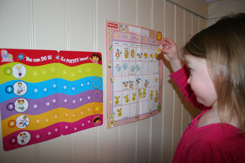
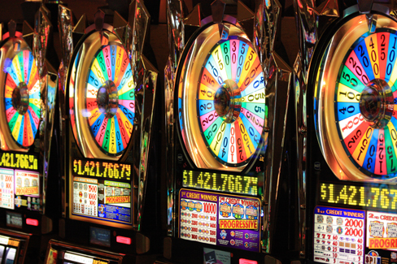
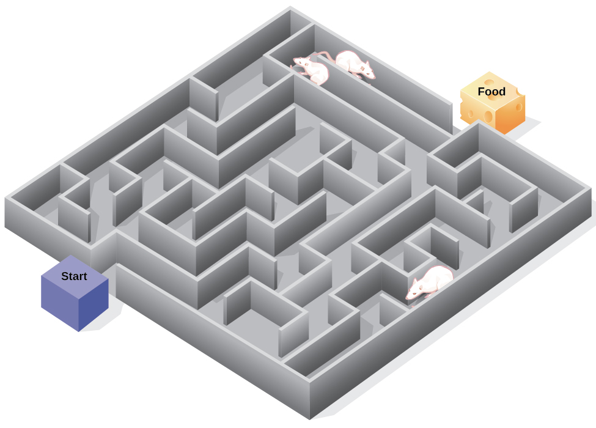

====================
Operant Conditioning
====================

.. contents::
   :depth: 3
..

.. container::

   By the end of this section, you will be able to: \* Define operant
   conditioning \* Explain the difference between reinforcement and
   punishment \* Distinguish between reinforcement schedules

The previous section of this chapter focused on the type of associative
learning known as classical conditioning. Remember that in classical
conditioning, something in the environment triggers a reflex
automatically, and researchers train the organism to react to a
different stimulus. Now we turn to the second type of associative
learning, **operant conditioning**\ {: data-type=“term”}. In operant
conditioning, organisms learn to associate a behavior and its
consequence (`[link] <#fs-idp18763408>`__). A pleasant consequence makes
that behavior more likely to be repeated in the future. For example,
Spirit, a dolphin at the National Aquarium in Baltimore, does a flip in
the air when her trainer blows a whistle. The consequence is that she
gets a fish.

.. raw:: html

   <table summary="This table has three columns and three rows. The first row is a header row; the first column has no heading; the second column is labeled “reinforcement” and the third column is labeled “punishment.” The second row is labeled “positive” and the third row is labeled “negative.” The cell under “reinforcement” and “positive” reads, “Something is added to increase the likelihood of a behavior.” The cell under “punishment” and “positive” reads, “Something is added to decrease the likelihood of a behavior.” The cell under “reinforcement” and “negative” reads, “Something is removed to increase the likelihood of a behavior.” The cell under “punishment” and “negative” reads, “Something is removed to decrease the likelihood of a behavior.”">

.. raw:: html

   <caption>

Classical and Operant Conditioning Compared

.. raw:: html

   </caption>

.. raw:: html

   <colgroup>

.. raw:: html

   <col data-width="150" />

.. raw:: html

   <col data-width="250" />

.. raw:: html

   <col data-width="250" />

.. raw:: html

   </colgroup>

.. raw:: html

   <thead>

.. raw:: html

   <tr>

.. raw:: html

   <th />

.. raw:: html

   <th>

Classical Conditioning

.. raw:: html

   </th>

.. raw:: html

   <th>

Operant Conditioning

.. raw:: html

   </th>

.. raw:: html

   </tr>

.. raw:: html

   </thead>

.. raw:: html

   <tbody>

.. raw:: html

   <tr>

.. raw:: html

   <td>

Conditioning approach

.. raw:: html

   </td>

.. raw:: html

   <td>

An unconditioned stimulus (such as food) is paired with a neutral
stimulus (such as a bell). The neutral stimulus eventually becomes the
conditioned stimulus, which brings about the conditioned response
(salivation).

.. raw:: html

   </td>

.. raw:: html

   <td>

The target behavior is followed by reinforcement or punishment to either
strengthen or weaken it, so that the learner is more likely to exhibit
the desired behavior in the future.

.. raw:: html

   </td>

.. raw:: html

   </tr>

.. raw:: html

   <tr>

.. raw:: html

   <td>

Stimulus timing

.. raw:: html

   </td>

.. raw:: html

   <td>

The stimulus occurs immediately before the response.

.. raw:: html

   </td>

.. raw:: html

   <td>

The stimulus (either reinforcement or punishment) occurs soon after the
response.

.. raw:: html

   </td>

.. raw:: html

   </tr>

.. raw:: html

   </tbody>

.. raw:: html

   </table>

Psychologist B. F. **Skinner**\ {: data-type=“term” .no-emphasis} saw
that classical conditioning is limited to existing behaviors that are
reflexively elicited, and it doesn’t account for new behaviors such as
riding a bike. He proposed a theory about how such behaviors come about.
Skinner believed that behavior is motivated by the consequences we
receive for the behavior: the reinforcements and punishments. His idea
that learning is the result of consequences is based on the law of
effect, which was first proposed by psychologist Edward
**Thorndike**\ {: data-type=“term” .no-emphasis}. According to the **law
of effect**\ {: data-type=“term”}, behaviors that are followed by
consequences that are satisfying to the organism are more likely to be
repeated, and behaviors that are followed by unpleasant consequences are
less likely to be repeated (Thorndike, 1911). Essentially, if an
organism does something that brings about a desired result, the organism
is more likely to do it again. If an organism does something that does
not bring about a desired result, the organism is less likely to do it
again. An example of the law of effect is in employment. One of the
reasons (and often the main reason) we show up for work is because we
get paid to do so. If we stop getting paid, we will likely stop showing
up—even if we love our job.

Working with Thorndike’s law of effect as his foundation, Skinner began
conducting scientific experiments on animals (mainly rats and pigeons)
to determine how organisms learn through operant conditioning (Skinner,
1938). He placed these animals inside an operant conditioning chamber,
which has come to be known as a “Skinner box”
(`[link] <#Figure06_03_Skinnerbox>`__). A Skinner box contains a lever
(for rats) or disk (for pigeons) that the animal can press or peck for a
food reward via the dispenser. Speakers and lights can be associated
with certain behaviors. A recorder counts the number of responses made
by the animal.

|A photograph shows B.F. Skinner. An illustration shows a rat in a
Skinner box: a chamber with a speaker, lights, a lever, and a food
dispenser.|\ {: #Figure06_03_Skinnerbox}

.. container:: psychology link-to-learning

   Watch this brief `video clip <http://openstax.org/l/skinner1>`__ to
   learn more about operant conditioning: Skinner is interviewed, and
   operant conditioning of pigeons is demonstrated.

In discussing operant conditioning, we use several everyday
words—positive, negative, reinforcement, and punishment—in a specialized
manner. In operant conditioning, positive and negative do not mean good
and bad. Instead, *positive* means you are adding something, and
*negative* means you are taking something away. *Reinforcement* means
you are increasing a behavior, and *punishment* means you are decreasing
a behavior. Reinforcement can be positive or negative, and punishment
can also be positive or negative. All reinforcers (positive or negative)
*increase* the likelihood of a behavioral response. All punishers
(positive or negative) *decrease* the likelihood of a behavioral
response. Now let’s combine these four terms: positive reinforcement,
negative reinforcement, positive punishment, and negative punishment
(`[link] <#fs-idm23618624>`__).

.. raw:: html

   <table summary="This table has three columns and three rows. The first row is a header row; the first column has no heading; the second column is labeled “reinforcement” and the third column is labeled “punishment.” The second row is labeled “positive” and the third row is labeled “negative.” The cell under “reinforcement” and “positive” reads, “Something is added to increase the likelihood of a behavior.” The cell under “punishment” and “positive” reads, “Something is added to decrease the likelihood of a behavior.” The cell under “reinforcement” and “negative” reads, “Something is removed to increase the likelihood of a behavior.” The cell under “punishment” and “negative” reads, “Something is removed to decrease the likelihood of a behavior.”">

.. raw:: html

   <caption>

Positive and Negative Reinforcement and Punishment

.. raw:: html

   </caption>

.. raw:: html

   <colgroup>

.. raw:: html

   <col data-width="150" />

.. raw:: html

   <col data-width="250" />

.. raw:: html

   <col data-width="250" />

.. raw:: html

   </colgroup>

.. raw:: html

   <thead>

.. raw:: html

   <tr>

.. raw:: html

   <th />

.. raw:: html

   <th>

Reinforcement

.. raw:: html

   </th>

.. raw:: html

   <th>

Punishment

.. raw:: html

   </th>

.. raw:: html

   </tr>

.. raw:: html

   </thead>

.. raw:: html

   <tbody>

.. raw:: html

   <tr>

.. raw:: html

   <td>

Positive

.. raw:: html

   </td>

.. raw:: html

   <td>

Something is added to increase the likelihood of a behavior.

.. raw:: html

   </td>

.. raw:: html

   <td>

Something is added to decrease the likelihood of a behavior.

.. raw:: html

   </td>

.. raw:: html

   </tr>

.. raw:: html

   <tr>

.. raw:: html

   <td>

Negative

.. raw:: html

   </td>

.. raw:: html

   <td>

Something is removed to increase the likelihood of a behavior.

.. raw:: html

   </td>

.. raw:: html

   <td>

Something is removed to decrease the likelihood of a behavior.

.. raw:: html

   </td>

.. raw:: html

   </tr>

.. raw:: html

   </tbody>

.. raw:: html

   </table>

REINFORCEMENT
=============

The most effective way to teach a person or animal a new behavior is
with positive reinforcement. In **positive reinforcement**\ {:
data-type=“term”}, a desirable stimulus is added to increase a behavior.

For example, you tell your five-year-old son, Jerome, that if he cleans
his room, he will get a toy. Jerome quickly cleans his room because he
wants a new art set. Let’s pause for a moment. Some people might say,
“Why should I reward my child for doing what is expected?” But in fact
we are constantly and consistently rewarded in our lives. Our paychecks
are rewards, as are high grades and acceptance into our preferred
school. Being praised for doing a good job and for passing a driver’s
test is also a reward. Positive reinforcement as a learning tool is
extremely effective. It has been found that one of the most effective
ways to increase achievement in school districts with below-average
reading scores was to pay the children to read. Specifically,
second-grade students in Dallas were paid $2 each time they read a book
and passed a short quiz about the book. The result was a significant
increase in reading comprehension (Fryer, 2010). What do you think about
this program? If Skinner were alive today, he would probably think this
was a great idea. He was a strong proponent of using operant
conditioning principles to influence students’ behavior at school. In
fact, in addition to the Skinner box, he also invented what he called a
teaching machine that was designed to reward small steps in learning
(Skinner, 1961)—an early forerunner of computer-assisted learning. His
teaching machine tested students’ knowledge as they worked through
various school subjects. If students answered questions correctly, they
received immediate positive reinforcement and could continue; if they
answered incorrectly, they did not receive any reinforcement. The idea
was that students would spend additional time studying the material to
increase their chance of being reinforced the next time (Skinner, 1961).

In **negative reinforcement**\ {: data-type=“term”}, an undesirable
stimulus is removed to increase a behavior. For example, car
manufacturers use the principles of negative reinforcement in their
seatbelt systems, which go “beep, beep, beep” until you fasten your
seatbelt. The annoying sound stops when you exhibit the desired
behavior, increasing the likelihood that you will buckle up in the
future. Negative reinforcement is also used frequently in horse
training. Riders apply pressure—by pulling the reins or squeezing their
legs—and then remove the pressure when the horse performs the desired
behavior, such as turning or speeding up. The pressure is the negative
stimulus that the horse wants to remove.

PUNISHMENT
==========

Many people confuse negative reinforcement with punishment in operant
conditioning, but they are two very different mechanisms. Remember that
reinforcement, even when it is negative, always increases a behavior. In
contrast, **punishment**\ {: data-type=“term”} always decreases a
behavior. In **positive punishment**\ {: data-type=“term”}, you add an
undesirable stimulus to decrease a behavior. An example of positive
punishment is scolding a student to get the student to stop texting in
class. In this case, a stimulus (the reprimand) is added in order to
decrease the behavior (texting in class). In **negative punishment**\ {:
data-type=“term”}, you remove a pleasant stimulus to decrease behavior.
For example, when a child misbehaves, a parent can take away a favorite
toy. In this case, a stimulus (the toy) is removed in order to decrease
the behavior.

Punishment, especially when it is immediate, is one way to decrease
undesirable behavior. For example, imagine your four-year-old son,
Brandon, hit his younger brother. You have Brandon write 100 times “I
will not hit my brother" (positive punishment). Chances are he won’t
repeat this behavior. While strategies like this are common today, in
the past children were often subject to physical punishment, such as
spanking. It’s important to be aware of some of the drawbacks in using
physical punishment on children. First, punishment may teach fear.
Brandon may become fearful of the street, but he also may become fearful
of the person who delivered the punishment—you, his parent. Similarly,
children who are punished by teachers may come to fear the teacher and
try to avoid school (Gershoff et al., 2010). Consequently, most schools
in the United States have banned corporal punishment. Second, punishment
may cause children to become more aggressive and prone to antisocial
behavior and delinquency (Gershoff, 2002). They see their parents resort
to spanking when they become angry and frustrated, so, in turn, they may
act out this same behavior when they become angry and frustrated. For
example, because you spank Brenda when you are angry with her for her
misbehavior, she might start hitting her friends when they won’t share
their toys.

While positive punishment can be effective in some cases, Skinner
suggested that the use of punishment should be weighed against the
possible negative effects. Today’s psychologists and parenting experts
favor reinforcement over punishment—they recommend that you catch your
child doing something good and reward her for it.

Shaping
-------

In his operant conditioning experiments, Skinner often used an approach
called shaping. Instead of rewarding only the target behavior, in
**shaping**\ {: data-type=“term”}, we reward successive approximations
of a target behavior. Why is shaping needed? Remember that in order for
reinforcement to work, the organism must first display the behavior.
Shaping is needed because it is extremely unlikely that an organism will
display anything but the simplest of behaviors spontaneously. In
shaping, behaviors are broken down into many small, achievable steps.
The specific steps used in the process are the following:

1. Reinforce any response that resembles the desired behavior.
2. Then reinforce the response that more closely resembles the desired
   behavior. You will no longer reinforce the previously reinforced
   response.
3. Next, begin to reinforce the response that even more closely
   resembles the desired behavior.
4. Continue to reinforce closer and closer approximations of the desired
   behavior.
5. Finally, only reinforce the desired behavior. {: type=“1”}

Shaping is often used in teaching a complex behavior or chain of
behaviors. Skinner used shaping to teach pigeons not only such
relatively simple behaviors as pecking a disk in a Skinner box, but also
many unusual and entertaining behaviors, such as turning in circles,
walking in figure eights, and even playing ping pong; the technique is
commonly used by animal trainers today. An important part of shaping is
stimulus discrimination. Recall Pavlov’s dogs—he trained them to respond
to the tone of a bell, and not to similar tones or sounds. This
discrimination is also important in operant conditioning and in shaping
behavior.

.. container:: psychology link-to-learning

   Here is a `brief video <http://openstax.org/l/pingpong>`__ of
   Skinner’s pigeons playing ping pong.

It’s easy to see how shaping is effective in teaching behaviors to
animals, but how does shaping work with humans? Let’s consider parents
whose goal is to have their child learn to clean his room. They use
shaping to help him master steps toward the goal. Instead of performing
the entire task, they set up these steps and reinforce each step. First,
he cleans up one toy. Second, he cleans up five toys. Third, he chooses
whether to pick up ten toys or put his books and clothes away. Fourth,
he cleans up everything except two toys. Finally, he cleans his entire
room.

PRIMARY AND SECONDARY REINFORCERS
=================================

Rewards such as stickers, praise, money, toys, and more can be used to
reinforce learning. Let’s go back to Skinner’s rats again. How did the
rats learn to press the lever in the Skinner box? They were rewarded
with food each time they pressed the lever. For animals, food would be
an obvious reinforcer.

What would be a good reinforce for humans? For your daughter Sydney, it
was the promise of a toy if she cleaned her room. How about Joaquin, the
soccer player? If you gave Joaquin a piece of candy every time he made a
goal, you would be using a **primary reinforcer**\ {: data-type=“term”}.
Primary reinforcers are reinforcers that have innate reinforcing
qualities. These kinds of reinforcers are not learned. Water, food,
sleep, shelter, sex, and touch, among others, are primary reinforcers.
Pleasure is also a primary reinforcer. Organisms do not lose their drive
for these things. For most people, jumping in a cool lake on a very hot
day would be reinforcing and the cool lake would be innately
reinforcing—the water would cool the person off (a physical need), as
well as provide pleasure.

A **secondary reinforcer**\ {: data-type=“term”} has no inherent value
and only has reinforcing qualities when linked with a primary
reinforcer. Praise, linked to affection, is one example of a secondary
reinforcer, as when you called out “Great shot!” every time Joaquin made
a goal. Another example, money, is only worth something when you can use
it to buy other things—either things that satisfy basic needs (food,
water, shelter—all primary reinforcers) or other secondary reinforcers.
If you were on a remote island in the middle of the Pacific Ocean and
you had stacks of money, the money would not be useful if you could not
spend it. What about the stickers on the behavior chart? They also are
secondary reinforcers.

Sometimes, instead of stickers on a sticker chart, a token is used.
Tokens, which are also secondary reinforcers, can then be traded in for
rewards and prizes. Entire behavior management systems, known as token
economies, are built around the use of these kinds of token reinforcers.
Token economies have been found to be very effective at modifying
behavior in a variety of settings such as schools, prisons, and mental
hospitals. For example, a study by Cangi and Daly (2013) found that use
of a token economy increased appropriate social behaviors and reduced
inappropriate behaviors in a group of autistic school children. Autistic
children tend to exhibit disruptive behaviors such as pinching and
hitting. When the children in the study exhibited appropriate behavior
(not hitting or pinching), they received a “quiet hands” token. When
they hit or pinched, they lost a token. The children could then exchange
specified amounts of tokens for minutes of playtime.

.. container:: psychology everyday-connection

   .. container::

      Behavior Modification in Children

   Parents and teachers often use behavior modification to change a
   child’s behavior. Behavior modification uses the principles of
   operant conditioning to accomplish behavior change so that
   undesirable behaviors are switched for more socially acceptable ones.
   Some teachers and parents create a sticker chart, in which several
   behaviors are listed (`[link] <#Figure06_03_Stickers>`__). Sticker
   charts are a form of token economies, as described in the text. Each
   time children perform the behavior, they get a sticker, and after a
   certain number of stickers, they get a prize, or reinforcer. The goal
   is to increase acceptable behaviors and decrease misbehavior.
   Remember, it is best to reinforce desired behaviors, rather than to
   use punishment. In the classroom, the teacher can reinforce a wide
   range of behaviors, from students raising their hands, to walking
   quietly in the hall, to turning in their homework. At home, parents
   might create a behavior chart that rewards children for things such
   as putting away toys, brushing their teeth, and helping with dinner.
   In order for behavior modification to be effective, the reinforcement
   needs to be connected with the behavior; the reinforcement must
   matter to the child and be done consistently.

   |A photograph shows a child placing stickers on a chart hanging on
   the wall.|\ {: #Figure06_03_Stickers}

   Time-out is another popular technique used in behavior modification
   with children. It operates on the principle of negative punishment.
   When a child demonstrates an undesirable behavior, she is removed
   from the desirable activity at hand
   (`[link] <#Figure06_03_Timeout>`__). For example, say that Sophia and
   her brother Mario are playing with building blocks. Sophia throws
   some blocks at her brother, so you give her a warning that she will
   go to time-out if she does it again. A few minutes later, she throws
   more blocks at Mario. You remove Sophia from the room for a few
   minutes. When she comes back, she doesn’t throw blocks.

   There are several important points that you should know if you plan
   to implement time-out as a behavior modification technique. First,
   make sure the child is being removed from a desirable activity and
   placed in a less desirable location. If the activity is something
   undesirable for the child, this technique will backfire because it is
   more enjoyable for the child to be removed from the activity. Second,
   the length of the time-out is important. The general rule of thumb is
   one minute for each year of the child’s age. Sophia is five;
   therefore, she sits in a time-out for five minutes. Setting a timer
   helps children know how long they have to sit in time-out. Finally,
   as a caregiver, keep several guidelines in mind over the course of a
   time-out: remain calm when directing your child to time-out; ignore
   your child during time-out (because caregiver attention may reinforce
   misbehavior); and give the child a hug or a kind word when time-out
   is over.

   |Photograph A shows several children climbing on playground
   equipment. Photograph B shows a child sitting alone at a table
   looking at the playground.|\ {: #Figure06_03_Timeout}

REINFORCEMENT SCHEDULES
=======================

Remember, the best way to teach a person or animal a behavior is to use
positive reinforcement. For example, Skinner used positive reinforcement
to teach rats to press a lever in a Skinner box. At first, the rat might
randomly hit the lever while exploring the box, and out would come a
pellet of food. After eating the pellet, what do you think the hungry
rat did next? It hit the lever again, and received another pellet of
food. Each time the rat hit the lever, a pellet of food came out. When
an organism receives a reinforcer each time it displays a behavior, it
is called **continuous reinforcement**\ {: data-type=“term”}. This
reinforcement schedule is the quickest way to teach someone a behavior,
and it is especially effective in training a new behavior. Let’s look
back at the dog that was learning to sit earlier in the chapter. Now,
each time he sits, you give him a treat. Timing is important here: you
will be most successful if you present the reinforcer immediately after
he sits, so that he can make an association between the target behavior
(sitting) and the consequence (getting a treat).

.. container:: psychology link-to-learning

   Watch this `video
   clip <https://drsophiayin.com/videos/entry/teaching-a-dog-to-sit-politely-rather-than-jump>`__
   where veterinarian Dr. Sophia Yin shapes a dog’s behavior using the
   steps outlined above.

Once a behavior is trained, researchers and trainers often turn to
another type of reinforcement schedule—partial reinforcement. In
**partial reinforcement**\ {: data-type=“term”}, also referred to as
intermittent reinforcement, the person or animal does not get reinforced
every time they perform the desired behavior. There are several
different types of partial reinforcement schedules
(`[link] <#fs-idp66772976>`__). These schedules are described as either
fixed or variable, and as either interval or ratio. *Fixed* refers to
the number of responses between reinforcements, or the amount of time
between reinforcements, which is set and unchanging. *Variable* refers
to the number of responses or amount of time between reinforcements,
which varies or changes. *Interval* means the schedule is based on the
time between reinforcements, and *ratio* means the schedule is based on
the number of responses between reinforcements.

.. raw:: html

   <table summary="This table has four columns and five rows. The first row is a header row with these headings: “reinforcement schedule,” “description,” “result,” and “example.” Row 1 is labeled “fixed interval”; the “description” reads “Reinforcement is delivered at predictable time intervals (e.g., after 5, 10, 15, and 20 minutes)”; the “result” reads “Moderate response rate with significant pauses after reinforcement”; the “example” reads “Hospital patient uses patient-controlled, doctor-timed pain relief.” Row 2 is labeled “fixed interval”; the “description” reads “Reinforcement is delivered at unpredictable time intervals (e.g., after 5, 7, 10, and 20 minutes)”; the “result” reads “Moderate yet steady response rate”; the “example” reads “Checking Facebook.” Row 3 is labeled “fixed ratio”; the “description” reads “Reinforcement is delivered after a predictable number of responses (e.g., after 2, 4, 6, and 8 responses)”; the “result” reads “High response rate with pauses after reinforcement”; the “example” reads “Piecework—factory worker getting paid for every x number of items manufactured.” Row 4 is labeled “variable ratio”; the “description” reads “Reinforcement is delivered after an unpredictable number of responses (e.g., after 1, 4, 5, and 9 responses).”; the “result” reads “High and steady response rate”; the “example” reads “Gambling.”">

.. raw:: html

   <caption>

Reinforcement Schedules

.. raw:: html

   </caption>

.. raw:: html

   <colgroup>

.. raw:: html

   <col data-width="100" />

.. raw:: html

   <col data-width="200" />

.. raw:: html

   <col data-width="200" />

.. raw:: html

   <col data-width="200" />

.. raw:: html

   </colgroup>

.. raw:: html

   <thead>

.. raw:: html

   <tr>

.. raw:: html

   <th>

Reinforcement Schedule

.. raw:: html

   </th>

.. raw:: html

   <th data-valign="top">

Description

.. raw:: html

   </th>

.. raw:: html

   <th data-valign="top">

Result

.. raw:: html

   </th>

.. raw:: html

   <th data-valign="top">

Example

.. raw:: html

   </th>

.. raw:: html

   </tr>

.. raw:: html

   </thead>

.. raw:: html

   <tbody>

.. raw:: html

   <tr>

.. raw:: html

   <td>

Fixed interval

.. raw:: html

   </td>

.. raw:: html

   <td>

Reinforcement is delivered at predictable time intervals (e.g., after 5,
10, 15, and 20 minutes).

.. raw:: html

   </td>

.. raw:: html

   <td>

Moderate response rate with significant pauses after reinforcement

.. raw:: html

   </td>

.. raw:: html

   <td>

Hospital patient uses patient-controlled, doctor-timed pain relief

.. raw:: html

   </td>

.. raw:: html

   </tr>

.. raw:: html

   <tr>

.. raw:: html

   <td>

Variable interval

.. raw:: html

   </td>

.. raw:: html

   <td>

Reinforcement is delivered at unpredictable time intervals (e.g., after
5, 7, 10, and 20 minutes).

.. raw:: html

   </td>

.. raw:: html

   <td>

Moderate yet steady response rate

.. raw:: html

   </td>

.. raw:: html

   <td>

Checking Facebook

.. raw:: html

   </td>

.. raw:: html

   </tr>

.. raw:: html

   <tr>

.. raw:: html

   <td>

Fixed ratio

.. raw:: html

   </td>

.. raw:: html

   <td>

Reinforcement is delivered after a predictable number of responses
(e.g., after 2, 4, 6, and 8 responses).

.. raw:: html

   </td>

.. raw:: html

   <td>

High response rate with pauses after reinforcement

.. raw:: html

   </td>

.. raw:: html

   <td>

Piecework—factory worker getting paid for every x number of items
manufactured

.. raw:: html

   </td>

.. raw:: html

   </tr>

.. raw:: html

   <tr>

.. raw:: html

   <td>

Variable ratio

.. raw:: html

   </td>

.. raw:: html

   <td>

Reinforcement is delivered after an unpredictable number of responses
(e.g., after 1, 4, 5, and 9 responses).

.. raw:: html

   </td>

.. raw:: html

   <td>

High and steady response rate

.. raw:: html

   </td>

.. raw:: html

   <td>

Gambling

.. raw:: html

   </td>

.. raw:: html

   </tr>

.. raw:: html

   </tbody>

.. raw:: html

   </table>

Now let’s combine these four terms. A **fixed interval reinforcement
schedule**\ {: data-type=“term”} is when behavior is rewarded after a
set amount of time. For example, June undergoes major surgery in a
hospital. During recovery, she is expected to experience pain and will
require prescription medications for pain relief. June is given an IV
drip with a patient-controlled painkiller. Her doctor sets a limit: one
dose per hour. June pushes a button when pain becomes difficult, and she
receives a dose of medication. Since the reward (pain relief) only
occurs on a fixed interval, there is no point in exhibiting the behavior
when it will not be rewarded.

With a **variable interval reinforcement schedule**\ {:
data-type=“term”}, the person or animal gets the reinforcement based on
varying amounts of time, which are unpredictable. Say that Manuel is the
manager at a fast-food restaurant. Every once in a while someone from
the quality control division comes to Manuel’s restaurant. If the
restaurant is clean and the service is fast, everyone on that shift
earns a $20 bonus. Manuel never knows when the quality control person
will show up, so he always tries to keep the restaurant clean and
ensures that his employees provide prompt and courteous service. His
productivity regarding prompt service and keeping a clean restaurant are
steady because he wants his crew to earn the bonus.

With a **fixed ratio reinforcement schedule**\ {: data-type=“term”},
there are a set number of responses that must occur before the behavior
is rewarded. Carla sells glasses at an eyeglass store, and she earns a
commission every time she sells a pair of glasses. She always tries to
sell people more pairs of glasses, including prescription sunglasses or
a backup pair, so she can increase her commission. She does not care if
the person really needs the prescription sunglasses, Carla just wants
her bonus. The quality of what Carla sells does not matter because her
commission is not based on quality; it’s only based on the number of
pairs sold. This distinction in the quality of performance can help
determine which reinforcement method is most appropriate for a
particular situation. Fixed ratios are better suited to optimize the
quantity of output, whereas a fixed interval, in which the reward is not
quantity based, can lead to a higher quality of output.

In a **variable ratio reinforcement schedule**\ {: data-type=“term”},
the number of responses needed for a reward varies. This is the most
powerful partial reinforcement schedule. An example of the variable
ratio reinforcement schedule is gambling. Imagine that Sarah—generally a
smart, thrifty woman—visits Las Vegas for the first time. She is not a
gambler, but out of curiosity she puts a quarter into the slot machine,
and then another, and another. Nothing happens. Two dollars in quarters
later, her curiosity is fading, and she is just about to quit. But then,
the machine lights up, bells go off, and Sarah gets 50 quarters back.
That’s more like it! Sarah gets back to inserting quarters with renewed
interest, and a few minutes later she has used up all her gains and is
$10 in the hole. Now might be a sensible time to quit. And yet, she
keeps putting money into the slot machine because she never knows when
the next reinforcement is coming. She keeps thinking that with the next
quarter she could win $50, or $100, or even more. Because the
reinforcement schedule in most types of gambling has a variable ratio
schedule, people keep trying and hoping that the next time they will win
big. This is one of the reasons that gambling is so addictive—and so
resistant to extinction.

In operant conditioning, extinction of a reinforced behavior occurs at
some point after reinforcement stops, and the speed at which this
happens depends on the reinforcement schedule. In a variable ratio
schedule, the point of extinction comes very slowly, as described above.
But in the other reinforcement schedules, extinction may come quickly.
For example, if June presses the button for the pain relief medication
before the allotted time her doctor has approved, no medication is
administered. She is on a fixed interval reinforcement schedule (dosed
hourly), so extinction occurs quickly when reinforcement doesn’t come at
the expected time. Among the reinforcement schedules, variable ratio is
the most productive and the most resistant to extinction. Fixed interval
is the least productive and the easiest to extinguish
(`[link] <#Figure06_03_Response>`__).

|A graph has an x-axis labeled “Time” and a y-axis labeled “Cumulative
number of responses.” Two lines labeled “Variable Ratio” and “Fixed
Ratio” have similar, steep slopes. The variable ratio line remains
straight and is marked in random points where reinforcement occurs. The
fixed ratio line has consistently spaced marks indicating where
reinforcement has occurred, but after each reinforcement, there is a
small drop in the line before it resumes its overall slope. Two lines
labeled “Variable Interval” and “Fixed Interval” have similar slopes at
roughly a 45-degree angle. The variable interval line remains straight
and is marked in random points where reinforcement occurs. The fixed
interval line has consistently spaced marks indicating where
reinforcement has occurred, but after each reinforcement, there is a
drop in the line.|\ {: #Figure06_03_Response}

.. container:: psychology connect-the-concepts

   .. container::

      Gambling and the Brain

   Skinner (1953) stated, “If the gambling establishment cannot persuade
   a patron to turn over money with no return, it may achieve the same
   effect by returning part of the patron's money on a variable-ratio
   schedule” (p. 397).

   Skinner uses gambling as an example of the power and effectiveness of
   conditioning behavior based on a variable ratio reinforcement
   schedule. In fact, Skinner was so confident in his knowledge of
   gambling addiction that he even claimed he could turn a pigeon into a
   pathological gambler (“Skinner’s Utopia,” 1971). Beyond the power of
   variable ratio reinforcement, gambling seems to work on the brain in
   the same way as some addictive drugs. The Illinois Institute for
   Addiction Recovery (n.d.) reports evidence suggesting that
   pathological gambling is an addiction similar to a chemical addiction
   (`[link] <#Figure06_03_Gambling>`__). Specifically, gambling may
   activate the reward centers of the brain, much like cocaine does.
   Research has shown that some pathological gamblers have lower levels
   of the neurotransmitter (brain chemical) known as norepinephrine than
   do normal gamblers (Roy, et al., 1988). According to a study
   conducted by Alec Roy and colleagues, norepinephrine is secreted when
   a person feels stress, arousal, or thrill; pathological gamblers use
   gambling to increase their levels of this neurotransmitter. Another
   researcher, neuroscientist Hans Breiter, has done extensive research
   on gambling and its effects on the brain. Breiter (as cited in
   Franzen, 2001) reports that “Monetary reward in a gambling-like
   experiment produces brain activation very similar to that observed in
   a cocaine addict receiving an infusion of cocaine” (para. 1).
   Deficiencies in serotonin (another neurotransmitter) might also
   contribute to compulsive behavior, including a gambling addiction.

   It may be that pathological gamblers’ brains are different than those
   of other people, and perhaps this difference may somehow have led to
   their gambling addiction, as these studies seem to suggest. However,
   it is very difficult to ascertain the cause because it is impossible
   to conduct a true experiment (it would be unethical to try to turn
   randomly assigned participants into problem gamblers). Therefore, it
   may be that causation actually moves in the opposite
   direction—perhaps the act of gambling somehow changes
   neurotransmitter levels in some gamblers’ brains. It also is possible
   that some overlooked factor, or confounding variable, played a role
   in both the gambling addiction and the differences in brain
   chemistry.

   |A photograph shows four digital gaming machines.|\ {:
   #Figure06_03_Gambling}

COGNITION AND LATENT LEARNING
=============================

Although strict behaviorists such as Skinner and Watson refused to
believe that cognition (such as thoughts and expectations) plays a role
in learning, another behaviorist, Edward C. **Tolman**\ {:
data-type=“term” .no-emphasis}, had a different opinion. Tolman’s
experiments with rats demonstrated that organisms can learn even if they
do not receive immediate reinforcement (Tolman & Honzik, 1930; Tolman,
Ritchie, & Kalish, 1946). This finding was in conflict with the
prevailing idea at the time that reinforcement must be immediate in
order for learning to occur, thus suggesting a cognitive aspect to
learning.

In the experiments, Tolman placed hungry rats in a maze with no reward
for finding their way through it. He also studied a comparison group
that was rewarded with food at the end of the maze. As the unreinforced
rats explored the maze, they developed a **cognitive map**\ {:
data-type=“term”}: a mental picture of the layout of the maze
(`[link] <#Figure06_03_Ratmaze>`__). After 10 sessions in the maze
without reinforcement, food was placed in a goal box at the end of the
maze. As soon as the rats became aware of the food, they were able to
find their way through the maze quickly, just as quickly as the
comparison group, which had been rewarded with food all along. This is
known as **latent learning**\ {: data-type=“term”}: learning that occurs
but is not observable in behavior until there is a reason to demonstrate
it.

|An illustration shows three rats in a maze, with a starting point and
food at the end.|\ {: #Figure06_03_Ratmaze}

Latent learning also occurs in humans. Children may learn by watching
the actions of their parents but only demonstrate it at a later date,
when the learned material is needed. For example, suppose that Ravi’s
dad drives him to school every day. In this way, Ravi learns the route
from his house to his school, but he’s never driven there himself, so he
has not had a chance to demonstrate that he’s learned the way. One
morning Ravi’s dad has to leave early for a meeting, so he can’t drive
Ravi to school. Instead, Ravi follows the same route on his bike that
his dad would have taken in the car. This demonstrates latent learning.
Ravi had learned the route to school, but had no need to demonstrate
this knowledge earlier.

.. container:: psychology everyday-connection

   .. container::

      This Place Is Like a Maze

   Have you ever gotten lost in a building and couldn’t find your way
   back out? While that can be frustrating, you’re not alone. At one
   time or another we’ve all gotten lost in places like a museum,
   hospital, or university library. Whenever we go someplace new, we
   build a mental representation—or cognitive map—of the location, as
   Tolman’s rats built a cognitive map of their maze. However, some
   buildings are confusing because they include many areas that look
   alike or have short lines of sight. Because of this, it’s often
   difficult to predict what’s around a corner or decide whether to turn
   left or right to get out of a building. Psychologist Laura Carlson
   (2010) suggests that what we place in our cognitive map can impact
   our success in navigating through the environment. She suggests that
   paying attention to specific features upon entering a building, such
   as a picture on the wall, a fountain, a statue, or an escalator, adds
   information to our cognitive map that can be used later to help find
   our way out of the building.

.. container:: psychology link-to-learning

   Watch this `video <http://openstax.org/l/carlsonmaps>`__ to learn
   more about Carlson’s studies on cognitive maps and navigation in
   buildings.

Summary
=======

Operant conditioning is based on the work of B. F. Skinner. Operant
conditioning is a form of learning in which the motivation for a
behavior happens *after* the behavior is demonstrated. An animal or a
human receives a consequence after performing a specific behavior. The
consequence is either a reinforcer or a punisher. All reinforcement
(positive or negative) *increases* the likelihood of a behavioral
response. All punishment (positive or negative) *decreases* the
likelihood of a behavioral response. Several types of reinforcement
schedules are used to reward behavior depending on either a set or
variable period of time.

Review Questions
================

.. container::

   .. container::

      \_______\_ is when you take away a pleasant stimulus to stop a
      behavior.

      1. positive reinforcement
      2. negative reinforcement
      3. positive punishment
      4. negative punishment {: type=“a”}

   .. container::

      D

.. container::

   .. container::

      Which of the following is *not* an example of a primary
      reinforcer?

      1. food
      2. money
      3. water
      4. sex {: type=“a”}

   .. container::

      B

.. container::

   .. container::

      Rewarding successive approximations toward a target behavior is
      \________.

      1. shaping
      2. extinction
      3. positive reinforcement
      4. negative reinforcement {: type=“a”}

   .. container::

      A

.. container::

   .. container::

      Slot machines reward gamblers with money according to which
      reinforcement schedule?

      1. fixed ratio
      2. variable ratio
      3. fixed interval
      4. variable interval {: type=“a”}

   .. container::

      B

Critical Thinking Questions
===========================

.. container::

   .. container::

      What is a Skinner box and what is its purpose?

   .. container::

      A Skinner box is an operant conditioning chamber used to train
      animals such as rats and pigeons to perform certain behaviors,
      like pressing a lever. When the animals perform the desired
      behavior, they receive a reward: food or water.

.. container::

   .. container::

      What is the difference between negative reinforcement and
      punishment?

   .. container::

      In negative reinforcement you are taking away an undesirable
      stimulus in order to increase the frequency of a certain behavior
      (e.g., buckling your seat belt stops the annoying beeping sound in
      your car and increases the likelihood that you will wear your
      seatbelt). Punishment is designed to reduce a behavior (e.g., you
      scold your child for running into the street in order to decrease
      the unsafe behavior.)

.. container::

   .. container::

      What is shaping and how would you use shaping to teach a dog to
      roll over?

   .. container::

      Shaping is an operant conditioning method in which you reward
      closer and closer approximations of the desired behavior. If you
      want to teach your dog to roll over, you might reward him first
      when he sits, then when he lies down, and then when he lies down
      and rolls onto his back. Finally, you would reward him only when
      he completes the entire sequence: lying down, rolling onto his
      back, and then continuing to roll over to his other side.

Personal Application Questions
==============================

.. container::

   .. container::

      Explain the difference between negative reinforcement and
      punishment, and provide several examples of each based on your own
      experiences.

.. container::

   .. container::

      Think of a behavior that you have that you would like to change.
      How could you use behavior modification, specifically positive
      reinforcement, to change your behavior? What is your positive
      reinforcer?

.. container::

   .. rubric:: Glossary
      :name: glossary

   {: data-type=“glossary-title”}

   cognitive map
      mental picture of the layout of the environment ^
   continuous reinforcement
      rewarding a behavior every time it occurs ^
   fixed interval reinforcement schedule
      behavior is rewarded after a set amount of time ^
   fixed ratio reinforcement schedule
      set number of responses must occur before a behavior is rewarded ^
   latent learning
      learning that occurs, but it may not be evident until there is a
      reason to demonstrate it ^
   law of effect
      behavior that is followed by consequences satisfying to the
      organism will be repeated and behaviors that are followed by
      unpleasant consequences will be discouraged ^
   negative punishment
      taking away a pleasant stimulus to decrease or stop a behavior ^
   negative reinforcement
      taking away an undesirable stimulus to increase a behavior ^
   operant conditioning
      form of learning in which the stimulus/experience happens after
      the behavior is demonstrated ^
   partial reinforcement
      rewarding behavior only some of the time ^
   positive punishment
      adding an undesirable stimulus to stop or decrease a behavior ^
   positive reinforcement
      adding a desirable stimulus to increase a behavior ^
   primary reinforcer
      has innate reinforcing qualities (e.g., food, water, shelter, sex)
      ^
   punishment
      implementation of a consequence in order to decrease a behavior ^
   reinforcement
      implementation of a consequence in order to increase a behavior ^
   secondary reinforcer
      has no inherent value unto itself and only has reinforcing
      qualities when linked with something else (e.g., money, gold
      stars, poker chips) ^
   shaping
      rewarding successive approximations toward a target behavior ^
   variable interval reinforcement schedule
      behavior is rewarded after unpredictable amounts of time have
      passed ^
   variable ratio reinforcement schedule
      number of responses differ before a behavior is rewarded

.. |A photograph shows B.F. Skinner. An illustration shows a rat in a Skinner box: a chamber with a speaker, lights, a lever, and a food dispenser.| image:: ../resources/CNX_Psych_06_03_Skinnerbox_n.jpg

.. |Photograph A shows several children climbing on playground equipment. Photograph B shows a child sitting alone at a table looking at the playground.| image:: ../resources/CNX_Psych_06_03_Timeout.jpg
.. |A graph has an x-axis labeled “Time” and a y-axis labeled “Cumulative number of responses.” Two lines labeled “Variable Ratio” and “Fixed Ratio” have similar, steep slopes. The variable ratio line remains straight and is marked in random points where reinforcement occurs. The fixed ratio line has consistently spaced marks indicating where reinforcement has occurred, but after each reinforcement, there is a small drop in the line before it resumes its overall slope. Two lines labeled “Variable Interval” and “Fixed Interval” have similar slopes at roughly a 45-degree angle. The variable interval line remains straight and is marked in random points where reinforcement occurs. The fixed interval line has consistently spaced marks indicating where reinforcement has occurred, but after each reinforcement, there is a drop in the line.| image:: ../resources/CNX_Psych_06_03_Response.jpg

