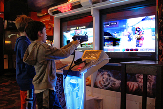

=================================
Observational Learning (Modeling)
=================================

.. contents::
   :depth: 3
..

.. container::

   By the end of this section, you will be able to: \* Define
   observational learning \* Discuss the steps in the modeling process
   \* Explain the prosocial and antisocial effects of observational
   learning

Previous sections of this chapter focused on classical and operant
conditioning, which are forms of associative learning. In
**observational learning**\ {: data-type=“term”}, we learn by watching
others and then imitating, or modeling, what they do or say. The
individuals performing the imitated behavior are called **models**\ {:
data-type=“term”}. Research suggests that this imitative learning
involves a specific type of neuron, called a mirror neuron (Hickock,
2010; Rizzolatti, Fadiga, Fogassi, & Gallese, 2002; Rizzolatti, Fogassi,
& Gallese, 2006).

Humans and other animals are capable of observational learning. As you
will see, the phrase “monkey see, monkey do” really is accurate
(`[link] <#Figure06_04_Monkey>`__). The same could be said about other
animals. For example, in a study of social learning in chimpanzees,
researchers gave juice boxes with straws to two groups of captive
chimpanzees. The first group dipped the straw into the juice box, and
then sucked on the small amount of juice at the end of the straw. The
second group sucked through the straw directly, getting much more juice.
When the first group, the “dippers,” observed the second group, “the
suckers,” what do you think happened? All of the “dippers” in the first
group switched to sucking through the straws directly. By simply
observing the other chimps and modeling their behavior, they learned
that this was a more efficient method of getting juice (Yamamoto, Humle,
and Tanaka, 2013).

|A photograph shows a person drinking from a water bottle, and a monkey
next to the person drinking water from a bottle in the same manner.|\ {:
#Figure06_04_Monkey}

Imitation is much more obvious in humans, but is **imitation**\ {:
data-type=“term” .no-emphasis} really the sincerest form of flattery?
Consider Claire’s experience with observational learning. Claire’s
nine-year-old son, Jay, was getting into trouble at school and was
defiant at home. Claire feared that Jay would end up like her brothers,
two of whom were in prison. One day, after yet another bad day at school
and another negative note from the teacher, Claire, at her wit’s end,
beat her son with a belt to get him to behave. Later that night, as she
put her children to bed, Claire witnessed her four-year-old daughter,
Anna, take a belt to her teddy bear and whip it. Claire was horrified,
realizing that Anna was imitating her mother. It was then that Claire
knew she wanted to discipline her children in a different manner.

Like Tolman, whose experiments with rats suggested a cognitive component
to learning, psychologist Albert Bandura’s ideas about learning were
different from those of strict behaviorists. Bandura and other
researchers proposed a brand of behaviorism called social learning
theory, which took cognitive processes into account. According to
**Bandura**\ {: data-type=“term” .no-emphasis}, pure behaviorism could
not explain why learning can take place in the absence of external
reinforcement. He felt that internal mental states must also have a role
in learning and that observational learning involves much more than
imitation. In imitation, a person simply copies what the model does.
Observational learning is much more complex. According to Lefrançois
(2012) there are several ways that observational learning can occur:

1. You learn a new response. After watching your coworker get chewed out
   by your boss for coming in late, you start leaving home 10 minutes
   earlier so that you won’t be late.
2. You choose whether or not to imitate the model depending on what you
   saw happen to the model. Remember Julian and his father? When
   learning to surf, Julian might watch how his father pops up
   successfully on his surfboard and then attempt to do the same thing.
   On the other hand, Julian might learn not to touch a hot stove after
   watching his father get burned on a stove.
3. You learn a general rule that you can apply to other situations. {:
   type=“1”}

Bandura identified three kinds of models: live, verbal, and symbolic. A
live model demonstrates a behavior in person, as when Ben stood up on
his surfboard so that Julian could see how he did it. A verbal
instructional model does not perform the behavior, but instead explains
or describes the behavior, as when a soccer coach tells his young
players to kick the ball with the side of the foot, not with the toe. A
symbolic model can be fictional characters or real people who
demonstrate behaviors in books, movies, television shows, video games,
or Internet sources (`[link] <#Figure06_04_Yoga>`__).

|Photograph A shows a yoga instructor demonstrating a yoga pose while a
group of students observes her and copies the pose. Photo B shows a
child watching television.|\ {: #Figure06_04_Yoga}

.. container:: psychology link-to-learning

   Latent learning and modeling are used all the time in the world of
   marketing and advertising. `This
   commercial <http://openstax.org/l/jeter>`__ played for months across
   the New York, New Jersey, and Connecticut areas, Derek Jeter, an
   award-winning baseball player for the New York Yankees, is
   advertising a Ford. The commercial aired in a part of the country
   where Jeter is an incredibly well-known athlete. He is wealthy, and
   considered very loyal and good looking. What message are the
   advertisers sending by having him featured in the ad? How effective
   do you think it is?

STEPS IN THE MODELING PROCESS
=============================

Of course, we don’t learn a behavior simply by observing a model.
Bandura described specific steps in the process of modeling that must be
followed if learning is to be successful: attention, retention,
reproduction, and motivation. First, you must be focused on what the
model is doing—you have to pay attention. Next, you must be able to
retain, or remember, what you observed; this is retention. Then, you
must be able to perform the behavior that you observed and committed to
memory; this is reproduction. Finally, you must have motivation. You
need to want to copy the behavior, and whether or not you are motivated
depends on what happened to the model. If you saw that the model was
reinforced for her behavior, you will be more motivated to copy her.
This is known as **vicarious reinforcement**\ {: data-type=“term”}. On
the other hand, if you observed the model being punished, you would be
less motivated to copy her. This is called **vicarious punishment**\ {:
data-type=“term”}. For example, imagine that four-year-old Allison
watched her older sister Kaitlyn playing in their mother’s makeup, and
then saw Kaitlyn get a time out when their mother came in. After their
mother left the room, Allison was tempted to play in the make-up, but
she did not want to get a time-out from her mother. What do you think
she did? Once you actually demonstrate the new behavior, the
reinforcement you receive plays a part in whether or not you will repeat
the behavior.

Bandura researched modeling behavior, particularly children’s modeling
of adults’ aggressive and violent behaviors (Bandura, Ross, & Ross,
1961). He conducted an experiment with a five-foot inflatable doll that
he called a Bobo doll. In the experiment, children’s aggressive behavior
was influenced by whether the teacher was punished for her behavior. In
one scenario, a teacher acted aggressively with the doll, hitting,
throwing, and even punching the doll, while a child watched. There were
two types of responses by the children to the teacher’s behavior. When
the teacher was punished for her bad behavior, the children decreased
their tendency to act as she had. When the teacher was praised or
ignored (and not punished for her behavior), the children imitated what
she did, and even what she said. They punched, kicked, and yelled at the
doll.

.. container:: psychology link-to-learning

   Watch this `video clip <http://openstax.org/l/bobodoll>`__ to see a
   portion of the famous Bobo doll experiment, including an interview
   with Albert Bandura.

What are the implications of this study? Bandura concluded that we watch
and learn, and that this learning can have both **prosocial**\ {:
data-type=“term” .no-emphasis} and **antisocial**\ {: data-type=“term”
.no-emphasis} effects. Prosocial (positive) models can be used to
encourage socially acceptable behavior. Parents in particular should
take note of this finding. If you want your children to read, then read
to them. Let them see you reading. Keep books in your home. Talk about
your favorite books. If you want your children to be healthy, then let
them see you eat right and exercise, and spend time engaging in physical
fitness activities together. The same holds true for qualities like
kindness, courtesy, and honesty. The main idea is that children observe
and learn from their parents, even their parents’ morals, so be
consistent and toss out the old adage “Do as I say, not as I do,”
because children tend to copy what you do instead of what you say.
Besides parents, many public figures, such as Martin Luther King,
Jr. and Mahatma Gandhi, are viewed as prosocial models who are able to
inspire global social change. Can you think of someone who has been a
prosocial model in your life?

The antisocial effects of observational learning are also worth
mentioning. As you saw from the example of Claire at the beginning of
this section, her daughter viewed Claire’s aggressive behavior and
copied it. Research suggests that this may help to explain why abused
children often grow up to be abusers themselves (Murrell, Christoff, &
Henning, 2007). In fact, about 30% of abused children become abusive
parents (U.S. Department of Health & Human Services, 2013). We tend to
do what we know. Abused children, who grow up witnessing their parents
deal with anger and frustration through violent and aggressive acts,
often learn to behave in that manner themselves. Sadly, it’s a vicious
cycle that’s difficult to break.

Some studies suggest that violent television shows, movies, and video
games may also have antisocial effects
(`[link] <#Figure06_04_Videogames>`__) although further research needs
to be done to understand the correlational and causational aspects of
media violence and behavior. Some studies have found a link between
viewing violence and aggression seen in children (Anderson & Gentile,
2008; Kirsch, 2010; Miller, Grabell, Thomas, Bermann, & Graham-Bermann,
2012). These findings may not be surprising, given that a child
graduating from high school has been exposed to around 200,000 violent
acts including murder, robbery, torture, bombings, beatings, and rape
through various forms of media (Huston et al., 1992). Not only might
viewing media violence affect aggressive behavior by teaching people to
act that way in real life situations, but it has also been suggested
that repeated exposure to violent acts also desensitizes people to it.
Psychologists are working to understand this dynamic.

|A photograph shows two children playing a video game and pointing a
gun-like object toward a screen.|\ {: #Figure06_04_Videogames}

.. container:: psychology link-to-learning

   View this `video <http://openstax.org/l/videogamevio>`__ to hear Brad
   Bushman, a psychologist who has published extensively on human
   aggression and violence, discuss his research.

Summary
=======

According to Bandura, learning can occur by watching others and then
modeling what they do or say. This is known as observational learning.
There are specific steps in the process of modeling that must be
followed if learning is to be successful. These steps include attention,
retention, reproduction, and motivation. Through modeling, Bandura has
shown that children learn many things both good and bad simply by
watching their parents, siblings, and others.

Review Questions
================

.. container::

   .. container::

      The person who performs a behavior that serves as an example is
      called a \________.

      1. teacher
      2. model
      3. instructor
      4. coach {: type=“a”}

   .. container::

      B

.. container::

   .. container::

      In Bandura’s Bobo doll study, when the children who watched the
      aggressive model were placed in a room with the doll and other
      toys, they \________.

      1. ignored the doll
      2. played nicely with the doll
      3. played with tinker toys
      4. kicked and threw the doll {: type=“a”}

   .. container::

      D

.. container::

   .. container::

      Which is the correct order of steps in the modeling process?

      1. attention, retention, reproduction, motivation
      2. motivation, attention, reproduction, retention
      3. attention, motivation, retention, reproduction
      4. motivation, attention, retention, reproduction {: type=“a”}

   .. container::

      A

.. container::

   .. container::

      Who proposed observational learning?

      1. Ivan Pavlov
      2. John Watson
      3. Albert Bandura
      4. B. F. Skinner {: type=“a”}

   .. container::

      C

Critical Thinking Questions
===========================

.. container::

   .. container::

      What is the effect of prosocial modeling and antisocial modeling?

   .. container::

      Prosocial modeling can prompt others to engage in helpful and
      healthy behaviors, while antisocial modeling can prompt others to
      engage in violent, aggressive, and unhealthy behaviors.

.. container::

   .. container::

      Cara is 17 years old. Cara’s mother and father both drink alcohol
      every night. They tell Cara that drinking is bad and she shouldn’t
      do it. Cara goes to a party where beer is being served. What do
      you think Cara will do? Why?

   .. container::

      Cara is more likely to drink at the party because she has observed
      her parents drinking regularly. Children tend to follow what a
      parent does rather than what they say.

Personal Application Question
=============================

.. container::

   .. container::

      What is something you have learned how to do after watching
      someone else?

.. container::

   .. rubric:: Glossary
      :name: glossary

   {: data-type=“glossary-title”}

   model
      person who performs a behavior that serves as an example (in
      observational learning) ^
   observational learning
      type of learning that occurs by watching others ^
   vicarious punishment
      process where the observer sees the model punished, making the
      observer less likely to imitate the model’s behavior ^
   vicarious reinforcement
      process where the observer sees the model rewarded, making the
      observer more likely to imitate the model’s behavior

.. |A photograph shows a person drinking from a water bottle, and a monkey next to the person drinking water from a bottle in the same manner.| image:: ../resources/CNX_Psych_06_04_Monkey.jpg
.. |Photograph A shows a yoga instructor demonstrating a yoga pose while a group of students observes her and copies the pose. Photo B shows a child watching television.| image:: ../resources/CNX_Psych_06_04_Yoga.jpg

