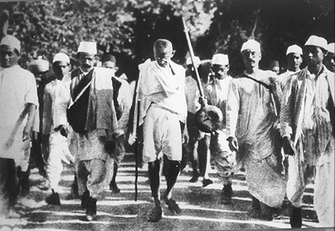
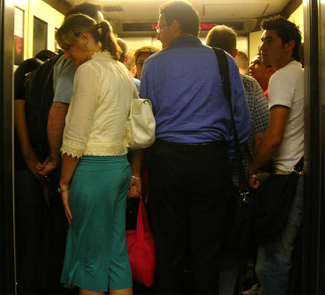
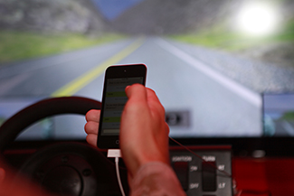

==================
What Is Cognition?
==================

.. contents::
   :depth: 3
..

.. container::

   By the end of this section, you will be able to: \* Describe
   cognition \* Distinguish concepts and prototypes \* Explain the
   difference between natural and artificial concepts

Imagine all of your thoughts as if they were physical entities, swirling
rapidly inside your mind. How is it possible that the brain is able to
move from one thought to the next in an organized, orderly fashion? The
brain is endlessly perceiving, processing, planning, organizing, and
remembering—it is always active. Yet, you don’t notice most of your
brain’s activity as you move throughout your daily routine. This is only
one facet of the complex processes involved in cognition. Simply put,
**cognition**\ {: data-type=“term”} is thinking, and it encompasses the
processes associated with perception, knowledge, problem solving,
judgment, language, and memory. Scientists who study cognition are
searching for ways to understand how we integrate, organize, and utilize
our conscious cognitive experiences without being aware of all of the
unconscious work that our brains are doing (for example, Kahneman,
2011).

COGNITION
=========

Upon waking each morning, you begin thinking—contemplating the tasks
that you must complete that day. In what order should you run your
errands? Should you go to the bank, the cleaners, or the grocery store
first? Can you get these things done before you head to class or will
they need to wait until school is done? These thoughts are one example
of cognition at work. Exceptionally complex, cognition is an essential
feature of human consciousness, yet not all aspects of cognition are
consciously experienced.

**Cognitive psychology**\ {: data-type=“term”} is the field of
psychology dedicated to examining how people think. It attempts to
explain how and why we think the way we do by studying the interactions
among human thinking, emotion, creativity, language, and problem
solving, in addition to other cognitive processes. Cognitive
psychologists strive to determine and measure different types of
intelligence, why some people are better at problem solving than others,
and how emotional intelligence affects success in the workplace, among
countless other topics. They also sometimes focus on how we organize
thoughts and information gathered from our environments into meaningful
categories of thought, which will be discussed later.

CONCEPTS AND PROTOTYPES
=======================

The human nervous system is capable of handling endless streams of
information. The senses serve as the interface between the mind and the
external environment, receiving stimuli and translating it into nervous
impulses that are transmitted to the brain. The brain then processes
this information and uses the relevant pieces to create thoughts, which
can then be expressed through language or stored in memory for future
use. To make this process more complex, the brain does not gather
information from external environments only. When thoughts are formed,
the brain also pulls information from emotions and memories
(`[link] <#Figure_07_01_Brain>`__). Emotion and memory are powerful
influences on both our thoughts and behaviors.

|The outline of a human head is shown. There is a box containing
“Information, sensations” in front of the head. An arrow from this box
points to another box containing “Emotions, memories” located where the
person’s brain would be. An arrow from this second box points to a third
box containing “Thoughts” behind the head.|\ {: #Figure_07_01_Brain}

In order to organize this staggering amount of information, the brain
has developed a file cabinet of sorts in the mind. The different files
stored in the file cabinet are called concepts. **Concepts**\ {:
data-type=“term”} are categories or groupings of linguistic information,
images, ideas, or memories, such as life experiences. Concepts are, in
many ways, big ideas that are generated by observing details, and
categorizing and combining these details into cognitive structures. You
use concepts to see the relationships among the different elements of
your experiences and to keep the information in your mind organized and
accessible.

Concepts are informed by our semantic memory (you will learn more about
semantic memory in a later chapter) and are present in every aspect of
our lives; however, one of the easiest places to notice concepts is
inside a classroom, where they are discussed explicitly. When you study
United States history, for example, you learn about more than just
individual events that have happened in America’s past. You absorb a
large quantity of information by listening to and participating in
discussions, examining maps, and reading first-hand accounts of people’s
lives. Your brain analyzes these details and develops an overall
understanding of American history. In the process, your brain gathers
details that inform and refine your understanding of related concepts
like democracy, power, and freedom.

Concepts can be complex and abstract, like justice, or more concrete,
like types of birds. In psychology, for example, Piaget’s stages of
development are abstract concepts. Some concepts, like tolerance, are
agreed upon by many people, because they have been used in various ways
over many years. Other concepts, like the characteristics of your ideal
friend or your family’s birthday traditions, are personal and
individualized. In this way, concepts touch every aspect of our lives,
from our many daily routines to the guiding principles behind the way
governments function.

Another technique used by your brain to organize information is the
identification of prototypes for the concepts you have developed. A
**prototype**\ {: data-type=“term”} is the best example or
representation of a concept. For example, for the category of civil
disobedience, your prototype could be Rosa Parks. Her peaceful
resistance to segregation on a city bus in Montgomery, Alabama, is a
recognizable example of civil disobedience. Or your prototype could be
Mohandas Gandhi, sometimes called Mahatma Gandhi (“Mahatma” is an
honorific title) (`[link] <#Figure_07_01_Gandhi>`__).

|A photograph of Mohandas Gandhi is shown. There are several people
walking with him.|\ {: #Figure_07_01_Gandhi}

Mohandas Gandhi served as a nonviolent force for independence for India
while simultaneously demanding that Buddhist, Hindu, Muslim, and
Christian leaders—both Indian and British—collaborate peacefully.
Although he was not always successful in preventing violence around him,
his life provides a steadfast example of the civil disobedience
prototype (Constitutional Rights Foundation, 2013). Just as concepts can
be abstract or concrete, we can make a distinction between concepts that
are functions of our direct experience with the world and those that are
more artificial in nature.

NATURAL AND ARTIFICIAL CONCEPTS
===============================

In psychology, concepts can be divided into two categories, natural and
artificial. **Natural concepts**\ {: data-type=“term”} are created
“naturally” through your experiences and can be developed from either
direct or indirect experiences. For example, if you live in Essex
Junction, Vermont, you have probably had a lot of direct experience with
snow. You’ve watched it fall from the sky, you’ve seen lightly falling
snow that barely covers the windshield of your car, and you’ve shoveled
out 18 inches of fluffy white snow as you’ve thought, “This is perfect
for skiing.” You’ve thrown snowballs at your best friend and gone
sledding down the steepest hill in town. In short, you know snow. You
know what it looks like, smells like, tastes like, and feels like. If,
however, you’ve lived your whole life on the island of Saint Vincent in
the Caribbean, you may never have actually seen snow, much less tasted,
smelled, or touched it. You know snow from the indirect experience of
seeing pictures of falling snow—or from watching films that feature snow
as part of the setting. Either way, snow is a natural concept because
you can construct an understanding of it through direct observations or
experiences of snow (`[link] <#Figure_07_01_SnowShapes>`__).

|Photograph A shows a snow covered landscape with the sun shining over
it. Photograph B shows a sphere shaped object perched atop the corner of
a cube shaped object. There is also a triangular object shown.|\ {:
#Figure_07_01_SnowShapes}

An **artificial concept**\ {: data-type=“term”}, on the other hand, is a
concept that is defined by a specific set of characteristics. Various
properties of geometric shapes, like squares and triangles, serve as
useful examples of artificial concepts. A triangle always has three
angles and three sides. A square always has four equal sides and four
right angles. Mathematical formulas, like the equation for area (length
× width) are artificial concepts defined by specific sets of
characteristics that are always the same. Artificial concepts can
enhance the understanding of a topic by building on one another. For
example, before learning the concept of “area of a square” (and the
formula to find it), you must understand what a square is. Once the
concept of “area of a square” is understood, an understanding of area
for other geometric shapes can be built upon the original understanding
of area. The use of artificial concepts to define an idea is crucial to
communicating with others and engaging in complex thought. According to
Goldstone and Kersten (2003), concepts act as building blocks and can be
connected in countless combinations to create complex thoughts.

SCHEMATA
========

A **schema**\ {: data-type=“term”} is a mental construct consisting of a
cluster or collection of related concepts (Bartlett, 1932). There are
many different types of schemata, and they all have one thing in common:
schemata are a method of organizing information that allows the brain to
work more efficiently. When a schema is activated, the brain makes
immediate assumptions about the person or object being observed.

There are several types of schemata. A **role schema**\ {:
data-type=“term”} makes assumptions about how individuals in certain
roles will behave (Callero, 1994). For example, imagine you meet someone
who introduces himself as a firefighter. When this happens, your brain
automatically activates the “firefighter schema” and begins making
assumptions that this person is brave, selfless, and community-oriented.
Despite not knowing this person, already you have unknowingly made
judgments about him. Schemata also help you fill in gaps in the
information you receive from the world around you. While schemata allow
for more efficient information processing, there can be problems with
schemata, regardless of whether they are accurate: Perhaps this
particular firefighter is not brave, he just works as a firefighter to
pay the bills while studying to become a children’s librarian.

An **event schema**\ {: data-type=“term”}, also known as a **cognitive
script**\ {: data-type=“term”}, is a set of behaviors that can feel like
a routine. Think about what you do when you walk into an elevator
(`[link] <#Figure_07_01_Elevator>`__). First, the doors open and you
wait to let exiting passengers leave the elevator car. Then, you step
into the elevator and turn around to face the doors, looking for the
correct button to push. You never face the back of the elevator, do you?
And when you’re riding in a crowded elevator and you can’t face the
front, it feels uncomfortable, doesn’t it? Interestingly, event schemata
can vary widely among different cultures and countries. For example,
while it is quite common for people to greet one another with a
handshake in the United States, in Tibet, you greet someone by sticking
your tongue out at them, and in Belize, you bump fists (Cairns Regional
Council, n.d.)

|A crowded elevator is shown. There are many people standing close to
one another.|\ {: #Figure_07_01_Elevator}

Because event schemata are automatic, they can be difficult to change.
Imagine that you are driving home from work or school. This event schema
involves getting in the car, shutting the door, and buckling your
seatbelt before putting the key in the ignition. You might perform this
script two or three times each day. As you drive home, you hear your
phone’s ring tone. Typically, the event schema that occurs when you hear
your phone ringing involves locating the phone and answering it or
responding to your latest text message. So without thinking, you reach
for your phone, which could be in your pocket, in your bag, or on the
passenger seat of the car. This powerful event schema is informed by
your pattern of behavior and the pleasurable stimulation that a phone
call or text message gives your brain. Because it is a schema, it is
extremely challenging for us to stop reaching for the phone, even though
we know that we endanger our own lives and the lives of others while we
do it (Neyfakh, 2013) (`[link] <#Figure_07_01_Texting>`__).

|A person’s right hand is holding a cellular phone. The person is in the
driver’s seat of an automobile while on the road.|\ {:
#Figure_07_01_Texting}

Remember the elevator? It feels almost impossible to walk in and not
face the door. Our powerful event schema dictates our behavior in the
elevator, and it is no different with our phones. Current research
suggests that it is the habit, or event schema, of checking our phones
in many different situations that makes refraining from checking them
while driving especially difficult (Bayer & Campbell, 2012). Because
texting and driving has become a dangerous epidemic in recent years,
psychologists are looking at ways to help people interrupt the “phone
schema” while driving. Event schemata like these are the reason why many
habits are difficult to break once they have been acquired. As we
continue to examine thinking, keep in mind how powerful the forces of
concepts and schemata are to our understanding of the world.

Summary
=======

In this section, you were introduced to cognitive psychology, which is
the study of cognition, or the brain’s ability to think, perceive, plan,
analyze, and remember. Concepts and their corresponding prototypes help
us quickly organize our thinking by creating categories into which we
can sort new information. We also develop schemata, which are clusters
of related concepts. Some schemata involve routines of thought and
behavior, and these help us function properly in various situations
without having to “think twice” about them. Schemata show up in social
situations and routines of daily behavior.

Review Questions
================

.. container::

   .. container::

      Cognitive psychology is the branch of psychology that focuses on
      the study of \________.

      1. human development
      2. human thinking
      3. human behavior
      4. human society {: type=“a”}

   .. container::

      B

.. container::

   .. container::

      Which of the following is an example of a prototype for the
      concept of leadership on an athletic team?

      1. the equipment manager
      2. the scorekeeper
      3. the team captain
      4. the quietest member of the team {: type=“a”}

   .. container::

      B

.. container::

   .. container::

      Which of the following is an example of an artificial concept?

      1. mammals
      2. a triangle’s area
      3. gemstones
      4. teachers {: type=“a”}

   .. container::

      B

.. container::

   .. container::

      An event schema is also known as a cognitive \________.

      1. stereotype
      2. concept
      3. script
      4. prototype {: type=“a”}

   .. container::

      C

Critical Thinking Questions
===========================

.. container::

   .. container::

      Describe an event schema that you would notice at a sporting
      event.

   .. container::

      Answers will vary. When attending a basketball game, it is typical
      to support your team by wearing the team colors and sitting behind
      their bench.

.. container::

   .. container::

      Explain why event schemata have so much power over human behavior.

   .. container::

      Event schemata are rooted in the social fabric of our communities.
      We expect people to behave in certain ways in certain types of
      situations, and we hold ourselves to the same social standards. It
      is uncomfortable to go against an event schema—it feels almost
      like we are breaking the rules.

Personal Application Question
=============================

.. container::

   .. container::

      Describe a natural concept that you know fully but that would be
      difficult for someone else to understand and explain why it would
      be difficult.

.. container::

   .. rubric:: Glossary
      :name: glossary

   {: data-type=“glossary-title”}

   artificial concept
      concept that is defined by a very specific set of characteristics
      ^
   cognition
      thinking, including perception, learning, problem solving,
      judgment, and memory ^
   cognitive psychology
      field of psychology dedicated to studying every aspect of how
      people think ^
   concept
      category or grouping of linguistic information, objects, ideas, or
      life experiences ^
   cognitive script
      set of behaviors that are performed the same way each time; also
      referred to as an event schema ^
   event schema
      set of behaviors that are performed the same way each time; also
      referred to as a cognitive script ^
   natural concept
      mental groupings that are created “naturally” through your
      experiences ^
   prototype
      best representation of a concept ^
   role schema
      set of expectations that define the behaviors of a person
      occupying a particular role ^
   schema
      (plural = schemata) mental construct consisting of a cluster or
      collection of related concepts

.. |The outline of a human head is shown. There is a box containing “Information, sensations” in front of the head. An arrow from this box points to another box containing “Emotions, memories” located where the person’s brain would be. An arrow from this second box points to a third box containing “Thoughts” behind the head.| image:: ../resources/CNX_Psych_07_01_Concepts.jpg

.. |Photograph A shows a snow covered landscape with the sun shining over it. Photograph B shows a sphere shaped object perched atop the corner of a cube shaped object. There is also a triangular object shown.| image:: ../resources/CNX_Psych_07_01_SnowShapes.jpg

