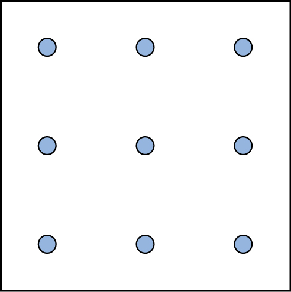

===============
Problem Solving
===============

.. contents::
   :depth: 3
..

.. container::

   By the end of this section, you will be able to: \* Describe problem
   solving strategies \* Define algorithm and heuristic \* Explain some
   common roadblocks to effective problem solving

People face problems every day—usually, multiple problems throughout the
day. Sometimes these problems are straightforward: To double a recipe
for pizza dough, for example, all that is required is that each
ingredient in the recipe be doubled. Sometimes, however, the problems we
encounter are more complex. For example, say you have a work deadline,
and you must mail a printed copy of a report to your supervisor by the
end of the business day. The report is time-sensitive and must be sent
overnight. You finished the report last night, but your printer will not
work today. What should you do? First, you need to identify the problem
and then apply a strategy for solving the problem.

PROBLEM-SOLVING STRATEGIES
==========================

When you are presented with a problem—whether it is a complex
mathematical problem or a broken printer, how do you solve it? Before
finding a solution to the problem, the problem must first be clearly
identified. After that, one of many problem solving strategies can be
applied, hopefully resulting in a solution.

A **problem-solving strategy**\ {: data-type=“term”} is a plan of action
used to find a solution. Different strategies have different action
plans associated with them (`[link] <#Table_07_03_01>`__). For example,
a well-known strategy is **trial and error**\ {: data-type=“term”}. The
old adage, “If at first you don’t succeed, try, try again” describes
trial and error. In terms of your broken printer, you could try checking
the ink levels, and if that doesn’t work, you could check to make sure
the paper tray isn’t jammed. Or maybe the printer isn’t actually
connected to your laptop. When using trial and error, you would continue
to try different solutions until you solved your problem. Although trial
and error is not typically one of the most time-efficient strategies, it
is a commonly used one.

.. raw:: html

   <table id="Table_07_03_01" summary="A three column table describes problem solving strategies. From left to right the columns are labeled “Method; Description; and Example.” The first row, respectively, reads: “trial and error; continue trying different solutions until problem is solved; and restarting phone, turning off wifi, turning off Bluetooth in order to determine why your phone is malfunctioning.” The second row reads: “algorithm; step-by-step problem-solving formula; and instruction manual for installing new software on your computer.” The third row reads: “heuristic; general problem-solving framework; and working backwards, breaking a task into steps.”">

.. raw:: html

   <caption>

Problem-Solving Strategies

.. raw:: html

   </caption>

.. raw:: html

   <thead>

.. raw:: html

   <tr>

.. raw:: html

   <th>

Method

.. raw:: html

   </th>

.. raw:: html

   <th>

Description

.. raw:: html

   </th>

.. raw:: html

   <th>

Example

.. raw:: html

   </th>

.. raw:: html

   </tr>

.. raw:: html

   </thead>

.. raw:: html

   <tbody>

.. raw:: html

   <tr>

.. raw:: html

   <td>

Trial and error

.. raw:: html

   </td>

.. raw:: html

   <td>

Continue trying different solutions until problem is solved

.. raw:: html

   </td>

.. raw:: html

   <td>

Restarting phone, turning off WiFi, turning off bluetooth in order to
determine why your phone is malfunctioning

.. raw:: html

   </td>

.. raw:: html

   </tr>

.. raw:: html

   <tr>

.. raw:: html

   <td>

Algorithm

.. raw:: html

   </td>

.. raw:: html

   <td>

Step-by-step problem-solving formula

.. raw:: html

   </td>

.. raw:: html

   <td>

Instruction manual for installing new software on your computer

.. raw:: html

   </td>

.. raw:: html

   </tr>

.. raw:: html

   <tr>

.. raw:: html

   <td>

Heuristic

.. raw:: html

   </td>

.. raw:: html

   <td>

General problem-solving framework

.. raw:: html

   </td>

.. raw:: html

   <td>

Working backwards; breaking a task into steps

.. raw:: html

   </td>

.. raw:: html

   </tr>

.. raw:: html

   </tbody>

.. raw:: html

   </table>

Another type of strategy is an algorithm. An **algorithm**\ {:
data-type=“term”} is a problem-solving formula that provides you with
step-by-step instructions used to achieve a desired outcome (Kahneman,
2011). You can think of an algorithm as a recipe with highly detailed
instructions that produce the same result every time they are performed.
Algorithms are used frequently in our everyday lives, especially in
computer science. When you run a search on the Internet, search engines
like Google use algorithms to decide which entries will appear first in
your list of results. Facebook also uses algorithms to decide which
posts to display on your newsfeed. Can you identify other situations in
which algorithms are used?

A heuristic is another type of problem solving strategy. While an
algorithm must be followed exactly to produce a correct result, a
**heuristic**\ {: data-type=“term”} is a general problem-solving
framework (Tversky & Kahneman, 1974). You can think of these as mental
shortcuts that are used to solve problems. A “rule of thumb” is an
example of a heuristic. Such a rule saves the person time and energy
when making a decision, but despite its time-saving characteristics, it
is not always the best method for making a rational decision. Different
types of heuristics are used in different types of situations, but the
impulse to use a heuristic occurs when one of five conditions is met
(Pratkanis, 1989):

-  When one is faced with too much information
-  When the time to make a decision is limited
-  When the decision to be made is unimportant
-  When there is access to very little information to use in making the
   decision
-  When an appropriate heuristic happens to come to mind in the same
   moment

**Working backwards**\ {: data-type=“term”} is a useful heuristic in
which you begin solving the problem by focusing on the end result.
Consider this example: You live in Washington, D.C. and have been
invited to a wedding at 4 PM on Saturday in Philadelphia. Knowing that
Interstate 95 tends to back up any day of the week, you need to plan
your route and time your departure accordingly. If you want to be at the
wedding service by 3:30 PM, and it takes 2.5 hours to get to
Philadelphia without traffic, what time should you leave your house? You
use the working backwards heuristic to plan the events of your day on a
regular basis, probably without even thinking about it.

Another useful heuristic is the practice of accomplishing a large goal
or task by breaking it into a series of smaller steps. Students often
use this common method to complete a large research project or long
essay for school. For example, students typically brainstorm, develop a
thesis or main topic, research the chosen topic, organize their
information into an outline, write a rough draft, revise and edit the
rough draft, develop a final draft, organize the references list, and
proofread their work before turning in the project. The large task
becomes less overwhelming when it is broken down into a series of small
steps.

.. container:: psychology everyday-connection

   .. container::

      Solving Puzzles

   Problem-solving abilities can improve with practice. Many people
   challenge themselves every day with puzzles and other mental
   exercises to sharpen their problem-solving skills. Sudoku puzzles
   appear daily in most newspapers. Typically, a sudoku puzzle is a 9×9
   grid. The simple sudoku below (`[link] <#Figure_07_03_Sudoku>`__) is
   a 4×4 grid. To solve the puzzle, fill in the empty boxes with a
   single digit: 1, 2, 3, or 4. Here are the rules: The numbers must
   total 10 in each bolded box, each row, and each column; however, each
   digit can only appear once in a bolded box, row, and column. Time
   yourself as you solve this puzzle and compare your time with a
   classmate.

   |A four column by four row Sudoku puzzle is shown. The top left cell
   contains the number 3. The top right cell contains the number 2. The
   bottom right cell contains the number 1. The bottom left cell
   contains the number 4. The cell at the intersection of the second row
   and the second column contains the number 4. The cell to the right of
   that contains the number 1. The cell below the cell containing the
   number 1 contains the number 2. The cell to the left of the cell
   containing the number 2 contains the number 3.|\ {:
   #Figure_07_03_Sudoku}

   Here is another popular type of puzzle
   (`[link] <#Figure_07_03_DotsAndLines>`__) that challenges your
   spatial reasoning skills. Connect all nine dots with four connecting
   straight lines without lifting your pencil from the paper:

   |A square shaped outline contains three rows and three columns of
   dots with equal space between them.|\ {: #Figure_07_03_DotsAndLines}

   Take a look at the “Puzzling Scales” logic puzzle below
   (`[link] <#Figure_07_03_SamLoyd>`__). Sam Loyd, a well-known puzzle
   master, created and refined countless puzzles throughout his lifetime
   (Cyclopedia of Puzzles, n.d.).

   |A puzzle involving a scale is shown. At the top of the figure it
   reads: “Sam Loyds Puzzling Scales.” The first row of the puzzle shows
   a balanced scale with 3 blocks and a top on the left and 12 marbles
   on the right. Below this row it reads: “Since the scales now
   balance.” The next row of the puzzle shows a balanced scale with just
   the top on the left, and 1 block and 8 marbles on the right. Below
   this row it reads: “And balance when arranged this way.” The third
   row shows an unbalanced scale with the top on the left side, which is
   much lower than the right side. The right side is empty. Below this
   row it reads: “Then how many marbles will it require to balance with
   that top?”|\ {: #Figure_07_03_SamLoyd}

PITFALLS TO PROBLEM SOLVING
===========================

Not all problems are successfully solved, however. What challenges stop
us from successfully solving a problem? Albert Einstein once said,
“Insanity is doing the same thing over and over again and expecting a
different result.” Imagine a person in a room that has four doorways.
One doorway that has always been open in the past is now locked. The
person, accustomed to exiting the room by that particular doorway, keeps
trying to get out through the same doorway even though the other three
doorways are open. The person is stuck—but she just needs to go to
another doorway, instead of trying to get out through the locked
doorway. A **mental set**\ {: data-type=“term”} is where you persist in
approaching a problem in a way that has worked in the past but is
clearly not working now.

**Functional fixedness**\ {: data-type=“term”} is a type of mental set
where you cannot perceive an object being used for something other than
what it was designed for. During the *Apollo 13* mission to the moon,
NASA engineers at Mission Control had to overcome functional fixedness
to save the lives of the astronauts aboard the spacecraft. An explosion
in a module of the spacecraft damaged multiple systems. The astronauts
were in danger of being poisoned by rising levels of carbon dioxide
because of problems with the carbon dioxide filters. The engineers found
a way for the astronauts to use spare plastic bags, tape, and air hoses
to create a makeshift air filter, which saved the lives of the
astronauts.

.. container:: psychology link-to-learning

   Check out this `Apollo 13 scene <http://openstax.org/l/Apollo13>`__
   where the group of NASA engineers are given the task of overcoming
   functional fixedness.

Researchers have investigated whether functional fixedness is affected
by culture. In one experiment, individuals from the Shuar group in
Ecuador were asked to use an object for a purpose other than that for
which the object was originally intended. For example, the participants
were told a story about a bear and a rabbit that were separated by a
river and asked to select among various objects, including a spoon, a
cup, erasers, and so on, to help the animals. The spoon was the only
object long enough to span the imaginary river, but if the spoon was
presented in a way that reflected its normal usage, it took participants
longer to choose the spoon to solve the problem. (German & Barrett,
2005). The researchers wanted to know if exposure to highly specialized
tools, as occurs with individuals in industrialized nations, affects
their ability to transcend functional fixedness. It was determined that
functional fixedness is experienced in both industrialized and
nonindustrialized cultures (German & Barrett, 2005).

In order to make good decisions, we use our knowledge and our reasoning.
Often, this knowledge and reasoning is sound and solid. Sometimes,
however, we are swayed by biases or by others manipulating a situation.
For example, let’s say you and three friends wanted to rent a house and
had a combined target budget of $1,600. The realtor shows you only very
run-down houses for $1,600 and then shows you a very nice house for
$2,000. Might you ask each person to pay more in rent to get the $2,000
home? Why would the realtor show you the run-down houses and the nice
house? The realtor may be challenging your anchoring bias. An
**anchoring bias**\ {: data-type=“term”} occurs when you focus on one
piece of information when making a decision or solving a problem. In
this case, you’re so focused on the amount of money you are willing to
spend that you may not recognize what kinds of houses are available at
that price point.

The **confirmation bias**\ {: data-type=“term”} is the tendency to focus
on information that confirms your existing beliefs. For example, if you
think that your professor is not very nice, you notice all of the
instances of rude behavior exhibited by the professor while ignoring the
countless pleasant interactions he is involved in on a daily basis.
**Hindsight bias**\ {: data-type=“term”} leads you to believe that the
event you just experienced was predictable, even though it really
wasn’t. In other words, you knew all along that things would turn out
the way they did. **Representative bias**\ {: data-type=“term”}
describes a faulty way of thinking, in which you unintentionally
stereotype someone or something; for example, you may assume that your
professors spend their free time reading books and engaging in
intellectual conversation, because the idea of them spending their time
playing volleyball or visiting an amusement park does not fit in with
your stereotypes of professors.

Finally, the **availability heuristic**\ {: data-type=“term”} is a
heuristic in which you make a decision based on an example, information,
or recent experience that is that readily available to you, even though
it may not be the best example to inform your decision\ **.** Biases
tend to “preserve that which is already established—to maintain our
preexisting knowledge, beliefs, attitudes, and hypotheses” (Aronson,
1995; Kahneman, 2011). These biases are summarized in
`[link] <#Table_07_03_02>`__.

.. raw:: html

   <table id="Table_07_03_02" summary="A two-column table summarizes various decision biases. The left column is titled “Bias” and the right column is titled “Description.” Respectively, the first row contains: “anchoring” and “tendency to focus on one particular piece of information when making decisions or problem-solving.” The second row contains: “confirmation” and “focuses on information that confirms existing beliefs.” The third row contains: “hindsight” and “belief that the event just experienced was predictable.” The fourth row contains: “representative” and “unintentional stereotyping of someone or something.” The fifth row contains: “availability” and “decision is based on an available precedent or example that may be faulty.”">

.. raw:: html

   <caption>

Summary of Decision Biases

.. raw:: html

   </caption>

.. raw:: html

   <thead>

.. raw:: html

   <tr>

.. raw:: html

   <th>

Bias

.. raw:: html

   </th>

.. raw:: html

   <th>

Description

.. raw:: html

   </th>

.. raw:: html

   </tr>

.. raw:: html

   </thead>

.. raw:: html

   <tbody>

.. raw:: html

   <tr>

.. raw:: html

   <td>

Anchoring

.. raw:: html

   </td>

.. raw:: html

   <td>

Tendency to focus on one particular piece of information when making
decisions or problem-solving

.. raw:: html

   </td>

.. raw:: html

   </tr>

.. raw:: html

   <tr>

.. raw:: html

   <td>

Confirmation

.. raw:: html

   </td>

.. raw:: html

   <td>

Focuses on information that confirms existing beliefs

.. raw:: html

   </td>

.. raw:: html

   </tr>

.. raw:: html

   <tr>

.. raw:: html

   <td>

Hindsight

.. raw:: html

   </td>

.. raw:: html

   <td>

Belief that the event just experienced was predictable

.. raw:: html

   </td>

.. raw:: html

   </tr>

.. raw:: html

   <tr>

.. raw:: html

   <td>

Representative

.. raw:: html

   </td>

.. raw:: html

   <td>

Unintentional stereotyping of someone or something

.. raw:: html

   </td>

.. raw:: html

   </tr>

.. raw:: html

   <tr>

.. raw:: html

   <td>

Availability

.. raw:: html

   </td>

.. raw:: html

   <td>

Decision is based upon either an available precedent or an example that
may be faulty

.. raw:: html

   </td>

.. raw:: html

   </tr>

.. raw:: html

   </tbody>

.. raw:: html

   </table>

.. container:: psychology link-to-learning

   Please visit this `site <http://openstax.org/l/CogBias>`__ to see a
   clever music video that a high school teacher made to explain these
   and other cognitive biases to his AP psychology students.

Were you able to determine how many marbles are needed to balance the
scales in `[link] <#Figure_07_03_SamLoyd>`__? You need nine. Were you
able to solve the problems in `[link] <#Figure_07_03_Sudoku>`__ and
`[link] <#Figure_07_03_DotsAndLines>`__? Here are the answers
(`[link] <#Figure_07_03_Solutions>`__).

|The first puzzle is a Sudoku grid of 16 squares (4 rows of 4 squares)
is shown. Half of the numbers were supplied to start the puzzle and are
colored blue, and half have been filled in as the puzzle’s solution and
are colored red. The numbers in each row of the grid, left to right, are
as follows. Row 1: blue 3, red 1, red 4, blue 2. Row 2: red 2, blue 4,
blue 1, red 3. Row 3: red 1, blue 3, blue 2, red 4. Row 4: blue 4, red
2, red 3, blue 1.The second puzzle consists of 9 dots arranged in 3 rows
of 3 inside of a square. The solution, four straight lines made without
lifting the pencil, is shown in a red line with arrows indicating the
direction of movement. In order to solve the puzzle, the lines must
extend beyond the borders of the box. The four connecting lines are
drawn as follows. Line 1 begins at the top left dot, proceeds through
the middle and right dots of the top row, and extends to the right
beyond the border of the square. Line 2 extends from the end of line 1,
through the right dot of the horizontally centered row, through the
middle dot of the bottom row, and beyond the square’s border ending in
the space beneath the left dot of the bottom row. Line 3 extends from
the end of line 2 upwards through the left dots of the bottom, middle,
and top rows. Line 4 extends from the end of line 3 through the middle
dot in the middle row and ends at the right dot of the bottom row.|\ {:
#Figure_07_03_Solutions}

Summary
=======

Many different strategies exist for solving problems. Typical strategies
include trial and error, applying algorithms, and using heuristics. To
solve a large, complicated problem, it often helps to break the problem
into smaller steps that can be accomplished individually, leading to an
overall solution. Roadblocks to problem solving include a mental set,
functional fixedness, and various biases that can cloud decision making
skills.

Review Questions
================

.. container::

   .. container::

      A specific formula for solving a problem is called \________.

      1. an algorithm
      2. a heuristic
      3. a mental set
      4. trial and error {: type=“a”}

   .. container::

      A

.. container::

   .. container::

      A mental shortcut in the form of a general problem-solving
      framework is called \________.

      1. an algorithm
      2. a heuristic
      3. a mental set
      4. trial and error {: type=“a”}

   .. container::

      B

.. container::

   .. container::

      Which type of bias involves becoming fixated on a single trait of
      a problem?

      1. anchoring bias
      2. confirmation bias
      3. representative bias
      4. availability bias {: type=“a”}

   .. container::

      A

.. container::

   .. container::

      Which type of bias involves relying on a false stereotype to make
      a decision?

      1. anchoring bias
      2. confirmation bias
      3. representative bias
      4. availability bias {: type=“a”}

   .. container::

      C

Critical Thinking Questions
===========================

.. container::

   .. container::

      What is functional fixedness and how can overcoming it help you
      solve problems?

   .. container::

      Functional fixedness occurs when you cannot see a use for an
      object other than the use for which it was intended. For example,
      if you need something to hold up a tarp in the rain, but only have
      a pitchfork, you must overcome your expectation that a pitchfork
      can only be used for garden chores before you realize that you
      could stick it in the ground and drape the tarp on top of it to
      hold it up.

.. container::

   .. container::

      How does an algorithm save you time and energy when solving a
      problem?

   .. container::

      An algorithm is a proven formula for achieving a desired outcome.
      It saves time because if you follow it exactly, you will solve the
      problem without having to figure out how to solve the problem. It
      is a bit like not reinventing the wheel.

Personal Application Question
=============================

.. container::

   .. container::

      Which type of bias do you recognize in your own decision making
      processes? How has this bias affected how you’ve made decisions in
      the past and how can you use your awareness of it to improve your
      decisions making skills in the future?

.. container::

   .. rubric:: Glossary
      :name: glossary

   {: data-type=“glossary-title”}

   algorithm
      problem-solving strategy characterized by a specific set of
      instructions ^
   anchoring bias
      faulty heuristic in which you fixate on a single aspect of a
      problem to find a solution ^
   availability heuristic
      faulty heuristic in which you make a decision based on information
      readily available to you ^
   confirmation bias
      faulty heuristic in which you focus on information that confirms
      your beliefs ^
   functional fixedness
      inability to see an object as useful for any other use other than
      the one for which it was intended ^
   heuristic
      mental shortcut that saves time when solving a problem ^
   hindsight bias
      belief that the event just experienced was predictable, even
      though it really wasn’t ^
   mental set
      continually using an old solution to a problem without results ^
   problem-solving strategy
      method for solving problems ^
   representative bias
      faulty heuristic in which you stereotype someone or something
      without a valid basis for your judgment ^
   trial and error
      problem-solving strategy in which multiple solutions are attempted
      until the correct one is found ^
   working backwards
      heuristic in which you begin to solve a problem by focusing on the
      end result

.. |A four column by four row Sudoku puzzle is shown. The top left cell contains the number 3. The top right cell contains the number 2. The bottom right cell contains the number 1. The bottom left cell contains the number 4. The cell at the intersection of the second row and the second column contains the number 4. The cell to the right of that contains the number 1. The cell below the cell containing the number 1 contains the number 2. The cell to the left of the cell containing the number 2 contains the number 3.| image:: ../resources/CNX_Psych_07_03_Sudoko.jpg

.. |A puzzle involving a scale is shown. At the top of the figure it reads: “Sam Loyds Puzzling Scales.” The first row of the puzzle shows a balanced scale with 3 blocks and a top on the left and 12 marbles on the right. Below this row it reads: “Since the scales now balance.” The next row of the puzzle shows a balanced scale with just the top on the left, and 1 block and 8 marbles on the right. Below this row it reads: “And balance when arranged this way.” The third row shows an unbalanced scale with the top on the left side, which is much lower than the right side. The right side is empty. Below this row it reads: “Then how many marbles will it require to balance with that top?”| image:: ../resources/CNX_Psych_07_03_SamLoyd.jpg
.. |The first puzzle is a Sudoku grid of 16 squares (4 rows of 4 squares) is shown. Half of the numbers were supplied to start the puzzle and are colored blue, and half have been filled in as the puzzle’s solution and are colored red. The numbers in each row of the grid, left to right, are as follows. Row 1: blue 3, red 1, red 4, blue 2. Row 2: red 2, blue 4, blue 1, red 3. Row 3: red 1, blue 3, blue 2, red 4. Row 4: blue 4, red 2, red 3, blue 1.The second puzzle consists of 9 dots arranged in 3 rows of 3 inside of a square. The solution, four straight lines made without lifting the pencil, is shown in a red line with arrows indicating the direction of movement. In order to solve the puzzle, the lines must extend beyond the borders of the box. The four connecting lines are drawn as follows. Line 1 begins at the top left dot, proceeds through the middle and right dots of the top row, and extends to the right beyond the border of the square. Line 2 extends from the end of line 1, through the right dot of the horizontally centered row, through the middle dot of the bottom row, and beyond the square’s border ending in the space beneath the left dot of the bottom row. Line 3 extends from the end of line 2 upwards through the left dots of the bottom, middle, and top rows. Line 4 extends from the end of line 3 through the middle dot in the middle row and ends at the right dot of the bottom row.| image:: ../resources/CNX_Psych_07_06_Solutions.jpg
