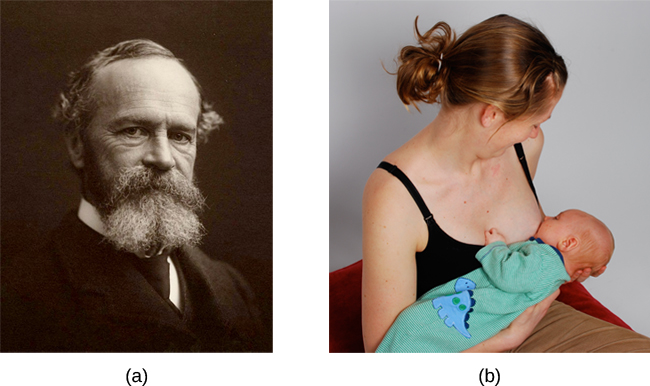

==========
Motivation
==========

.. contents::
   :depth: 3
..

.. container::

   By the end of this section, you will be able to: \* Define intrinsic
   and extrinsic motivation \* Understand that instincts, drive
   reduction, self-efficacy, and social motives have all been proposed
   as theories of motivation \* Explain the basic concepts associated
   with Maslow’s hierarchy of needs

Why do we do the things we do? What motivations underlie our behaviors?
**Motivation**\ {: data-type=“term”} describes the wants or needs that
direct behavior toward a goal. In addition to biological motives,
motivations can be **intrinsic**\ {: data-type=“term”} (arising from
internal factors) or **extrinsic**\ {: data-type=“term”} (arising from
external factors) (`[link] <#Figure_10_01_Motivation>`__). Intrinsically
motivated behaviors are performed because of the sense of personal
satisfaction that they bring, while extrinsically motivated behaviors
are performed in order to receive something from others.

|An illustration shows a person’s upper torso. An arrow on the left
begins at the person’s chest and curves around to point inside the head;
inside the curve of the arrow are the words “intrinsic motivation (from
within)” and three bullet points: “autonomy,” “mastery,” “purpose.” An
arrow on the right begins in empty space and curves to a point inside
the head. Above the arrow are the words “extrinsic motivation (from
outside)” and three bullet points: “compensation,” “punishment,” and
“reward.”|\ {: #Figure_10_01_Motivation}

Think about why you are currently in college. Are you here because you
enjoy learning and want to pursue an education to make yourself a more
well-rounded individual? If so, then you are intrinsically motivated.
However, if you are here because you want to get a college degree to
make yourself more marketable for a high-paying career or to satisfy the
demands of your parents, then your motivation is more extrinsic in
nature.

In reality, our motivations are often a mix of both intrinsic and
extrinsic factors, but the nature of the mix of these factors might
change over time (often in ways that seem counter-intuitive). There is
an old adage: “Choose a job that you love, and you will never have to
work a day in your life,” meaning that if you enjoy your occupation,
work doesn’t seem like . . . well, work. Some research suggests that
this isn’t necessarily the case (Daniel & Esser, 1980; Deci, 1972; Deci,
Koestner, & Ryan, 1999). According to this research, receiving some sort
of extrinsic reinforcement (i.e., getting paid) for engaging in
behaviors that we enjoy leads to those behaviors being thought of as
work no longer providing that same enjoyment. As a result, we might
spend less time engaging in these reclassified behaviors in the absence
of any extrinsic reinforcement. For example, Odessa loves baking, so in
her free time, she bakes for fun. Oftentimes, after stocking shelves at
her grocery store job, she often whips up pastries in the evenings
because she enjoys baking. When a coworker in the store’s bakery
department leaves his job, Odessa applies for his position and gets
transferred to the bakery department. Although she enjoys what she does
in her new job, after a few months, she no longer has much desire to
concoct tasty treats in her free time. Baking has become work in a way
that changes her motivation to do it
(`[link] <#Figure_10_01_Bakery>`__). What Odessa has experienced is
called the overjustification effect—intrinsic motivation is diminished
when extrinsic motivation is given. This can lead to extinguishing the
intrinsic motivation and creating a dependence on extrinsic rewards for
continued performance (Deci et al., 1999).

|A photograph shows several chefs preparing food together in a
kitchen.|\ {: #Figure_10_01_Bakery}

Other studies suggest that intrinsic motivation may not be so vulnerable
to the effects of extrinsic reinforcements, and in fact, reinforcements
such as verbal praise might actually increase intrinsic motivation
(Arnold, 1976; Cameron & Pierce, 1994). In that case, Odessa’s
motivation to bake in her free time might remain high if, for example,
customers regularly compliment her baking or cake decorating skills.

These apparent discrepancies in the researchers’ findings may be
understood by considering several factors. For one, physical
reinforcement (such as money) and verbal reinforcement (such as praise)
may affect an individual in very different ways. In fact, tangible
rewards (i.e., money) tend to have more negative effects on intrinsic
motivation than do intangible rewards (i.e., praise). Furthermore, the
expectation of the extrinsic motivator by an individual is crucial: If
the person expects to receive an extrinsic reward, then intrinsic
motivation for the task tends to be reduced. If, however, there is no
such expectation, and the extrinsic motivation is presented as a
surprise, then intrinsic motivation for the task tends to persist (Deci
et al., 1999).

In educational settings, students are more likely to experience
intrinsic motivation to learn when they feel a sense of belonging and
respect in the classroom. This internalization can be enhanced if the
evaluative aspects of the classroom are de-emphasized and if students
feel that they exercise some control over the learning environment.
Furthermore, providing students with activities that are challenging,
yet doable, along with a rationale for engaging in various learning
activities can enhance intrinsic motivation for those tasks (Niemiec &
Ryan, 2009). Consider Hakim, a first-year law student with two courses
this semester: Family Law and Criminal Law. The Family Law professor has
a rather intimidating classroom: He likes to put students on the spot
with tough questions, which often leaves students feeling belittled or
embarrassed. Grades are based exclusively on quizzes and exams, and the
instructor posts results of each test on the classroom door. In
contrast, the Criminal Law professor facilitates classroom discussions
and respectful debates in small groups. The majority of the course grade
is not exam-based, but centers on a student-designed research project on
a crime issue of the student’s choice. Research suggests that Hakim will
be less intrinsically motivated in his Family Law course, where students
are intimidated in the classroom setting, and there is an emphasis on
teacher-driven evaluations. Hakim is likely to experience a higher level
of intrinsic motivation in his Criminal Law course, where the class
setting encourages inclusive collaboration and a respect for ideas, and
where students have more influence over their learning activities.

THEORIES ABOUT MOTIVATION
=========================

William **James**\ {: data-type=“term” .no-emphasis} (1842–1910) was an
important contributor to early research into motivation, and he is often
referred to as the father of psychology in the United States. James
theorized that behavior was driven by a number of instincts, which aid
survival (`[link] <#Figure_10_01_WilliamJ>`__). From a biological
perspective, an **instinct**\ {: data-type=“term”} is a species-specific
pattern of behavior that is not learned. There was, however,
considerable controversy among James and his contemporaries over the
exact definition of instinct. James proposed several dozen special human
instincts, but many of his contemporaries had their own lists that
differed. A mother’s protection of her baby, the urge to lick sugar, and
hunting prey were among the human behaviors proposed as true instincts
during James’s era. This view—that human behavior is driven by
instincts—received a fair amount of criticism because of the undeniable
role of learning in shaping all sorts of human behavior. In fact, as
early as the 1900s, some instinctive behaviors were experimentally
demonstrated to result from associative learning (recall when you
learned about Watson’s conditioning of fear response in “Little Albert”)
(Faris, 1921).

|Photograph A shows William James. Photograph B shows a person
breastfeeding a baby.|\ {: #Figure_10_01_WilliamJ}

Another early theory of motivation proposed that the maintenance of
homeostasis is particularly important in directing behavior. You may
recall from your earlier reading that homeostasis is the tendency to
maintain a balance, or optimal level, within a biological system. In a
body system, a control center (which is often part of the brain)
receives input from receptors (which are often complexes of neurons).
The control center directs effectors (which may be other neurons) to
correct any imbalance detected by the control center.

According to the **drive theory**\ {: data-type=“term”} of motivation,
deviations from homeostasis create physiological needs. These needs
result in psychological drive states that direct behavior to meet the
need and, ultimately, bring the system back to homeostasis. For example,
if it’s been a while since you ate, your blood sugar levels will drop
below normal. This low blood sugar will induce a physiological need and
a corresponding drive state (i.e., hunger) that will direct you to seek
out and consume food (`[link] <#Figure_10_01_Eating>`__). Eating will
eliminate the hunger, and, ultimately, your blood sugar levels will
return to normal. Interestingly, drive theory also emphasizes the role
that habits play in the type of behavioral response in which we engage.
A **habit**\ {: data-type=“term”} is a pattern of behavior in which we
regularly engage. Once we have engaged in a behavior that successfully
reduces a drive, we are more likely to engage in that behavior whenever
faced with that drive in the future (Graham & Weiner, 1996).

|Photograph “left” shows a child eating watermelon. Photograph “center”
shows a young person eating sushi. Photograph “right” shows an elderly
person eating food.|\ {: #Figure_10_01_Eating}

Extensions of drive theory take into account levels of arousal as
potential motivators. As you recall from your study of learning, these
theories assert that there is an optimal level of arousal that we all
try to maintain (`[link] <#Figure_10_01_Arousal>`__). If we are
underaroused, we become bored and will seek out some sort of
stimulation. On the other hand, if we are overaroused, we will engage in
behaviors to reduce our arousal (Berlyne, 1960). Most students have
experienced this need to maintain optimal levels of arousal over the
course of their academic career. Think about how much stress students
experience toward the end of spring semester. They feel overwhelmed with
seemingly endless exams, papers, and major assignments that must be
completed on time. They probably yearn for the rest and relaxation that
awaits them over the extended summer break. However, once they finish
the semester, it doesn’t take too long before they begin to feel bored.
Generally, by the time the next semester is beginning in the fall, many
students are quite happy to return to school. This is an example of how
arousal theory works.

|A line graph has an x-axis labeled “arousal level” with an arrow
indicating “low” to “high” and a y-axis labeled “performance quality”
with an arrow indicating “low” to “high.” A curve charts optimal
arousal. Where arousal level and performance quality are both “low,” the
curve is low and labeled “boredom or apathy.” Where arousal level is
“medium” and “performance quality is “medium,” the curve peaks and is
labeled “optimal level.” Where the arousal level is “high” and the
performance quality is “low,” the curve is low and is labeled “high
anxiety.”|\ {: #Figure_10_01_Arousal}

So what is the optimal level of arousal? What level leads to the best
performance? Research shows that moderate arousal is generally best;
when arousal is very high or very low, performance tends to suffer
(Yerkes & Dodson, 1908). Think of your arousal level regarding taking an
exam for this class. If your level is very low, such as boredom and
apathy, your performance will likely suffer. Similarly, a very high
level, such as extreme anxiety, can be paralyzing and hinder
performance. Consider the example of a softball team facing a
tournament. They are favored to win their first game by a large margin,
so they go into the game with a lower level of arousal and get beat by a
less skilled team.

But optimal arousal level is more complex than a simple answer that the
middle level is always best. Researchers Robert Yerkes (pronounced
“Yerk-EES”) and John Dodson discovered that the optimal arousal level
depends on the complexity and difficulty of the task to be performed
(`[link] <#Figure_10_01_YerkesDod>`__). This relationship is known as
**Yerkes-Dodson law**\ {: data-type=“term”}, which holds that a simple
task is performed best when arousal levels are relatively high and
complex tasks are best performed when arousal levels are lower.

|A line graph has an x-axis labeled “arousal level” with an arrow
indicating “low” to “high” and a y-axis labeled “performance quality”
with an arrow indicating “low” to “high.” Two curves charts optimal
arousal, one for difficult tasks and the other for easy tasks. The
optimal level for easy tasks is reached with slightly higher arousal
levels than for difficult tasks.|\ {: #Figure_10_01_YerkesDod}

Self-efficacy and Social Motives
--------------------------------

**Self-efficacy**\ {: data-type=“term”} is an individual’s belief in her
own capability to complete a task, which may include a previous
successful completion of the exact task or a similar task. Albert
**Bandura**\ {: data-type=“term” .no-emphasis} (1994) theorized that an
individual’s sense of self-efficacy plays a pivotal role in motivating
behavior. Bandura argues that motivation derives from expectations that
we have about the consequences of our behaviors, and ultimately, it is
the appreciation of our capacity to engage in a given behavior that will
determine what we do and the future goals that we set for ourselves. For
example, if you have a sincere belief in your ability to achieve at the
highest level, you are more likely to take on challenging tasks and to
not let setbacks dissuade you from seeing the task through to the end.

A number of theorists have focused their research on understanding
social motives (McAdams & Constantian, 1983; McClelland & Liberman,
1949; Murray et al., 1938). Among the motives they describe are needs
for achievement, affiliation, and intimacy. It is the need for
achievement that drives accomplishment and performance. The need for
affiliation encourages positive interactions with others, and the need
for intimacy causes us to seek deep, meaningful relationships. Henry
Murray et al. (1938) categorized these needs into domains. For example,
the need for achievement and recognition falls under the domain of
ambition. Dominance and aggression were recognized as needs under the
domain of human power, and play was a recognized need in the domain of
interpersonal affection.

Maslow’s Hierarchy of Needs
---------------------------

While the theories of motivation described earlier relate to basic
biological drives, individual characteristics, or social contexts,
Abraham **Maslow**\ {: data-type=“term” .no-emphasis} (1943) proposed a
**hierarchy of needs**\ {: data-type=“term”} that spans the spectrum of
motives ranging from the biological to the individual to the social.
These needs are often depicted as a pyramid
(`[link] <#Figure_10_01_Maslow>`__).

|A triangle is divided vertically into five sections with corresponding
labels inside and outside of the triangle for each section. From top to
bottom, the triangle's sections are labeled: “self-actualization”
corresponds to “Inner fulfillment” “esteem” corresponds to “Self-worth,
accomplishment, confidence”; “social” corresponds to “Family,
friendship, intimacy, belonging”’ “security” corresponds to “Safety,
employment, assets”; ““physiological” corresponds to “Food, water,
shelter, warmth.”|\ {: #Figure_10_01_Maslow}

At the base of the pyramid are all of the physiological needs that are
necessary for survival. These are followed by basic needs for security
and safety, the need to be loved and to have a sense of belonging, and
the need to have self-worth and confidence. The top tier of the pyramid
is self-actualization, which is a need that essentially equates to
achieving one’s full potential, and it can only be realized when needs
lower on the pyramid have been met. To Maslow and humanistic theorists,
self-actualization reflects the humanistic emphasis on positive aspects
of human nature. Maslow suggested that this is an ongoing, life-long
process and that only a small percentage of people actually achieve a
self-actualized state (Francis & Kritsonis, 2006; Maslow, 1943).

According to Maslow (1943), one must satisfy lower-level needs before
addressing those needs that occur higher in the pyramid. So, for
example, if someone is struggling to find enough food to meet his
nutritional requirements, it is quite unlikely that he would spend an
inordinate amount of time thinking about whether others viewed him as a
good person or not. Instead, all of his energies would be geared toward
finding something to eat. However, it should be pointed out that
Maslow’s theory has been criticized for its subjective nature and its
inability to account for phenomena that occur in the real world
(Leonard, 1982). Other research has more recently addressed that late in
life, Maslow proposed a self-transcendence level above
self-actualization—to represent striving for meaning and purpose beyond
the concerns of oneself (Koltko-Rivera, 2006). For example, people
sometimes make self-sacrifices in order to make a political statement or
in an attempt to improve the conditions of others. Mohandas K. Gandhi, a
world-renowned advocate for independence through nonviolent protest, on
several occasions went on hunger strikes to protest a particular
situation. People may starve themselves or otherwise put themselves in
danger displaying higher-level motives beyond their own needs.

.. container:: psychology link-to-learning

   Check out this `interactive
   exercise <http://openstax.org/l/hierneeds>`__ that illustrates some
   of the important concepts in Maslow’s hierarchy of needs.

Summary
=======

Motivation to engage in a given behavior can come from internal and/or
external factors. Multiple theories have been put forward regarding
motivation. More biologically oriented theories deal with the ways that
instincts and the need to maintain bodily homeostasis motivate behavior.
Bandura postulated that our sense of self-efficacy motivates behaviors,
and there are a number of theories that focus on a variety of social
motives. Abraham Maslow’s hierarchy of needs is a model that shows the
relationship among multiple motives that range from lower-level
physiological needs to the very high level of self-actualization.

Review Questions
================

.. container::

   .. container::

      Need for \_______\_ refers to maintaining positive relationships
      with others.

      1. achievement
      2. affiliation
      3. intimacy
      4. power {: type=“A”}

   .. container::

      B

.. container::

   .. container::

      \_______\_ proposed the hierarchy of needs.

      1. William James
      2. David McClelland
      3. Abraham Maslow
      4. Albert Bandura {: type=“A”}

   .. container::

      C

.. container::

   .. container::

      \_______\_ is an individual’s belief in her capability to complete
      some task.

      1. physiological needs
      2. self-esteem
      3. self-actualization
      4. self-efficacy {: type=“A”}

   .. container::

      D

.. container::

   .. container::

      Carl mows the yard of his elderly neighbor each week for $20. What
      type of motivation is this?

      1. extrinsic
      2. intrinsic
      3. drive
      4. biological {: type=“A”}

   .. container::

      A

Critical Thinking Questions
===========================

.. container::

   .. container::

      How might someone espousing an arousal theory of motivation
      explain visiting an amusement park?

   .. container::

      The idea of optimal levels of arousal is similar to a drive theory
      of motivation. Presumably, we all seek to maintain some
      intermediate level of arousal. If we are underaroused, we are
      bored. If we are overaroused, we experience stress. The rides at
      an amusement park would provide higher arousal (however, we would
      hope that these rides don’t actually pose significant threats to
      personal safety that would lead to a state of panic) to push us
      toward our own optimal level of arousal. Individuals at the park
      would choose different rides based on their specific arousal
      thresholds; for example, one person might find a simple water ride
      optimally arousing and an extreme roller coaster overarousing,
      while others would find the extreme roller coaster optimally
      arousing.

.. container::

   .. container::

      Schools often use concrete rewards to increase adaptive behaviors.
      How might this be a disadvantage for students intrinsically
      motivated to learn? What are educational implications of the
      potential for concrete rewards to diminish intrinsic motivation
      for a given task?

   .. container::

      We would expect to see a shift from learning for the sake of
      learning to learning to earn some reward. This would undermine the
      foundation upon which traditional institutions of higher education
      are built. For a student motivated by extrinsic rewards,
      dependence on those may pose issues later in life (post-school)
      when there are not typically extrinsic rewards for learning.

Personal Application Question
=============================

.. container::

   .. container::

      Can you think of recent examples of how Maslow’s hierarchy of
      needs might have affected your behavior in some way?

.. container::

   .. rubric:: Glossary
      :name: glossary

   {: data-type=“glossary-title”}

   drive theory
      deviations from homeostasis create physiological needs that result
      in psychological drive states that direct behavior to meet the
      need and ultimately bring the system back to homeostasis ^
   extrinsic motivation
      motivation that arises from external factors or rewards ^
   habit
      pattern of behavior in which we regularly engage ^
   hierarchy of needs
      spectrum of needs ranging from basic biological needs to social
      needs to self-actualization ^
   instinct
      species-specific pattern of behavior that is unlearned ^
   intrinsic motivation
      motivation based on internal feelings rather than external rewards
      ^
   motivation
      wants or needs that direct behavior toward some goal ^
   self-efficacy
      individual’s belief in his own capabilities or capacities to
      complete a task ^
   Yerkes-Dodson law
      simple tasks are performed best when arousal levels are relatively
      high, while complex tasks are best performed when arousal is lower

.. |An illustration shows a person’s upper torso. An arrow on the left begins at the person’s chest and curves around to point inside the head; inside the curve of the arrow are the words “intrinsic motivation (from within)” and three bullet points: “autonomy,” “mastery,” “purpose.” An arrow on the right begins in empty space and curves to a point inside the head. Above the arrow are the words “extrinsic motivation (from outside)” and three bullet points: “compensation,” “punishment,” and “reward.”| image:: ../resources/CNX_Psych_10_01_Motivation_n.jpg

.. |Photograph “left” shows a child eating watermelon. Photograph “center” shows a young person eating sushi. Photograph “right” shows an elderly person eating food.| image:: ../resources/CNX_Psych_10_01_Eating.jpg
.. |A line graph has an x-axis labeled “arousal level” with an arrow indicating “low” to “high” and a y-axis labeled “performance quality” with an arrow indicating “low” to “high.” A curve charts optimal arousal. Where arousal level and performance quality are both “low,” the curve is low and labeled “boredom or apathy.” Where arousal level is “medium” and “performance quality is “medium,” the curve peaks and is labeled “optimal level.” Where the arousal level is “high” and the performance quality is “low,” the curve is low and is labeled “high anxiety.”| image:: ../resources/CNX_Psych_10_01_Arousal.jpg
.. |A line graph has an x-axis labeled “arousal level” with an arrow indicating “low” to “high” and a y-axis labeled “performance quality” with an arrow indicating “low” to “high.” Two curves charts optimal arousal, one for difficult tasks and the other for easy tasks. The optimal level for easy tasks is reached with slightly higher arousal levels than for difficult tasks.| image:: ../resources/CNX_Psych_10_01_YerkesDod.jpg
.. |A triangle is divided vertically into five sections with corresponding labels inside and outside of the triangle for each section. From top to bottom, the triangle's sections are labeled: “self-actualization” corresponds to “Inner fulfillment” “esteem” corresponds to “Self-worth, accomplishment, confidence”; “social” corresponds to “Family, friendship, intimacy, belonging”’ “security” corresponds to “Safety, employment, assets”; ““physiological” corresponds to “Food, water, shelter, warmth.”| image:: ../resources/CNX_Psych_10_01_Maslow.jpg
