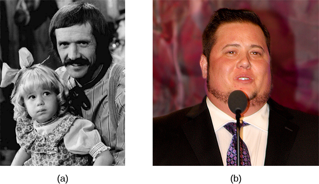

===============
Sexual Behavior
===============

.. contents::
   :depth: 3
..

.. container::

   By the end of this section, you will be able to: \* Understand basic
   biological mechanisms regulating sexual behavior and motivation \*
   Appreciate the importance of Alfred Kinsey’s research on human
   sexuality \* Recognize the contributions that William Masters and
   Virginia Johnson’s research made to our understanding of the sexual
   response cycle \* Define sexual orientation and gender identity

Like food, sex is an important part of our lives. From an evolutionary
perspective, the reason is obvious—perpetuation of the species. Sexual
behavior in humans, however, involves much more than reproduction. This
section provides an overview of research that has been conducted on
human sexual behavior and motivation. This section will close with a
discussion of issues related to gender and sexual orientation.

PHYSIOLOGICAL MECHANISMS OF SEXUAL BEHAVIOR AND MOTIVATION
==========================================================

Much of what we know about the physiological mechanisms that underlie
sexual behavior and motivation comes from animal research. As you’ve
learned, the hypothalamus plays an important role in motivated
behaviors, and sex is no exception. In fact, lesions to an area of the
hypothalamus called the medial preoptic area completely disrupt a male
rat’s ability to engage in sexual behavior. Surprisingly, medial
preoptic lesions do not change how hard a male rat is willing to work to
gain access to a sexually receptive female
(`[link] <#Figure_10_03_Rats>`__). This suggests that the ability to
engage in sexual behavior and the motivation to do so may be mediated by
neural systems distinct from one another.

|A photograph shows two rats.|\ {: #Figure_10_03_Rats}

Animal research suggests that limbic system structures such as the
amygdala and nucleus accumbens are especially important for sexual
motivation. Damage to these areas results in a decreased motivation to
engage in sexual behavior, while leaving the ability to do so intact
(`[link] <#Figure_10_03_SexBrain>`__) (Everett, 1990). Similar
dissociations of sexual motivation and sexual ability have also been
observed in the female rat (Becker, Rudick, & Jenkins, 2001; Jenkins &
Becker, 2001).

|An illustration of the brain labels the locations of the “nucleus
accumbeus,” “hypothalamus,” “medial preoptic area,” and “amygdala.”|\ {:
#Figure_10_03_SexBrain}

Although human sexual behavior is much more complex than that seen in
rats, some parallels between animals and humans can be drawn from this
research. The worldwide popularity of drugs used to treat erectile
dysfunction (Conrad, 2005) speaks to the fact that sexual motivation and
the ability to engage in sexual behavior can also be dissociated in
humans. Moreover, disorders that involve abnormal hypothalamic function
are often associated with hypogonadism (reduced function of the gonads)
and reduced sexual function (e.g., Prader-Willi syndrome). Given the
hypothalamus’s role in endocrine function, it is not surprising that
hormones secreted by the endocrine system also play important roles in
sexual motivation and behavior. For example, many animals show no sign
of sexual motivation in the absence of the appropriate combination of
sex hormones from their gonads. While this is not the case for humans,
there is considerable evidence that sexual motivation for both men and
women varies as a function of circulating testosterone levels (Bhasin,
Enzlin, Coviello, & Basson, 2007; Carter, 1992; Sherwin, 1988).

KINSEY’S RESEARCH
=================

Before the late 1940s, access to reliable, empirically-based information
on sex was limited. Physicians were considered authorities on all issues
related to sex, despite the fact that they had little to no training in
these issues, and it is likely that most of what people knew about sex
had been learned either through their own experiences or by talking with
their peers. Convinced that people would benefit from a more open
dialogue on issues related to human sexuality, Dr. Alfred **Kinsey**\ {:
data-type=“term” .no-emphasis} of Indiana University initiated
large-scale survey research on the topic
(`[link] <#Figure_10_03_Kinsey>`__). The results of some of these
efforts were published in two books—Sexual Behavior in the Human Male
and *Sexual Behavior in the Human Female*—which were published in 1948
and 1953, respectively (Bullough, 1998).

|A photograph shows Morrison Hall, the building that houses the Kinsey
Institute for Research in Sex, Gender, and Reproduction.|\ {:
#Figure_10_03_Kinsey}

At the time, the Kinsey reports were quite sensational. Never before had
the American public seen its private sexual behavior become the focus of
scientific scrutiny on such a large scale. The books, which were filled
with statistics and scientific lingo, sold remarkably well to the
general public, and people began to engage in open conversations about
human sexuality. As you might imagine, not everyone was happy that this
information was being published. In fact, these books were banned in
some countries. Ultimately, the controversy resulted in Kinsey losing
funding that he had secured from the Rockefeller Foundation to continue
his research efforts (Bancroft, 2004).

Although Kinsey’s research has been widely criticized as being riddled
with sampling and statistical errors (Jenkins, 2010), there is little
doubt that this research was very influential in shaping future research
on human sexual behavior and motivation. Kinsey described a remarkably
diverse range of sexual behaviors and experiences reported by the
volunteers participating in his research. Behaviors that had once been
considered exceedingly rare or problematic were demonstrated to be much
more common and innocuous than previously imagined (Bancroft, 2004;
Bullough, 1998).

.. container:: psychology link-to-learning

   Watch this `trailer <http://openstax.org/l/Kinsey>`__ from the 2004
   film Kinsey that depicts Alfred Kinsey’s life and research.

Among the results of Kinsey’s research were the findings that women are
as interested and experienced in sex as their male counterparts, that
both males and females masturbate without adverse health consequences,
and that homosexual acts are fairly common (Bancroft, 2004). Kinsey also
developed a continuum known as the Kinsey scale that is still commonly
used today to categorize an individual’s sexual orientation (Jenkins,
2010). **Sexual orientation**\ {: data-type=“term”} is an individual’s
emotional and erotic attractions to same-sexed individuals
(**homosexual**\ {: data-type=“term”}), opposite-sexed individuals
(**heterosexual**\ {: data-type=“term”}), or both (**bisexual**\ {:
data-type=“term”}).

MASTERS AND JOHNSON’S RESEARCH
==============================

In 1966, William **Masters**\ {: data-type=“term” .no-emphasis} and
Virginia **Johnson**\ {: data-type=“term” .no-emphasis} published a book
detailing the results of their observations of nearly 700 people who
agreed to participate in their study of physiological responses during
sexual behavior. Unlike Kinsey, who used personal interviews and surveys
to collect data, Masters and Johnson observed people having intercourse
in a variety of positions, and they observed people masturbating,
manually or with the aid of a device. While this was occurring,
researchers recorded measurements of physiological variables, such as
blood pressure and respiration rate, as well as measurements of sexual
arousal, such as vaginal lubrication and penile tumescence (swelling
associated with an erection). In total, Masters and Johnson observed
nearly 10,000 sexual acts as a part of their research (Hock, 2008).

Based on these observations, Masters and Johnson divided the **sexual
response cycle**\ {: data-type=“term”} into four phases that are fairly
similar in men and women: excitement, plateau, orgasm, and resolution
(`[link] <#Figure_10_03_SexReponse>`__). The **excitement**\ {:
data-type=“term”} phase is the arousal phase of the sexual response
cycle, and it is marked by erection of the penis or clitoris and
lubrication and expansion of the vaginal canal. During **plateau**\ {:
data-type=“term”}, women experience further swelling of the vagina and
increased blood flow to the labia minora, and men experience full
erection and often exhibit pre-ejaculatory fluid. Both men and women
experience increases in muscle tone during this time. **Orgasm**\ {:
data-type=“term”} is marked in women by rhythmic contractions of the
pelvis and uterus along with increased muscle tension. In men, pelvic
contractions are accompanied by a buildup of seminal fluid near the
urethra that is ultimately forced out by contractions of genital
muscles, (i.e., ejaculation). **Resolution**\ {: data-type=“term”} is
the relatively rapid return to an unaroused state accompanied by a
decrease in blood pressure and muscular relaxation. While many women can
quickly repeat the sexual response cycle, men must pass through a longer
refractory period as part of resolution. The **refractory period**\ {:
data-type=“term”} is a period of time that follows an orgasm during
which an individual is incapable of experiencing another orgasm. In men,
the duration of the refractory period can vary dramatically from
individual to individual with some refractory periods as short as
several minutes and others as long as a day. As men age, their
refractory periods tend to span longer periods of time.

|A graph titled “Sexual response cycle” has an x-axis labeled “time” and
a y-axis labeled “arousal.” Four phases are depicted. In the
“excitement” phase the arousal level increases from the bottom to midway
on the graph. In the “plateau” phase the arousal level remains mostly
steady at the midpoint of the graph and then begins to rise at the end
of the plateau phase. At the “orgasm” phase, the arousal level sharply
increases, peaks at the top of the graph, and then declines to the
midway point. In the “resolution” phase the graph drops from the midway
point to the bottom.|\ {: #Figure_10_03_SexReponse}

In addition to the insights that their research provided with regards to
the sexual response cycle and the multi-orgasmic potential of women,
Masters and Johnson also collected important information about
reproductive anatomy. Their research demonstrated the oft-cited
statistic of the average size of a flaccid and an erect penis (3 and 6
inches, respectively) as well as dispelling long-held beliefs about
relationships between the size of a man’s erect penis and his ability to
provide sexual pleasure to his female partner. Furthermore, they
determined that the vagina is a very elastic structure that can conform
to penises of various sizes (Hock, 2008).

SEXUAL ORIENTATION
==================

As mentioned earlier, a person’s sexual orientation is their emotional
and erotic attraction toward another individual
(`[link] <#Figure_10_03_GayMales>`__). While the majority of people
identify as heterosexual, there is a sizable population of people within
the United States who identify as either homosexual or bisexual.
Research suggests that somewhere between 3% and 10% of the population
identifies as homosexual (Kinsey, Pomeroy, & Martin, 1948; LeVay, 1996;
Pillard & Bailey, 1995).

|A photograph shows two people holding hands.|\ {:
#Figure_10_03_GayMales}

Issues of sexual orientation have long fascinated scientists interested
in determining what causes one individual to be heterosexual while
another is homosexual. For many years, people believed that these
differences arose because of different socialization and familial
experiences. However, research has consistently demonstrated that the
family backgrounds and experiences are very similar among heterosexuals
and homosexuals (Bell, Weinberg, & Hammersmith, 1981; Ross & Arrindell,
1988).

Genetic and biological mechanisms have also been proposed, and the
balance of research evidence suggests that sexual orientation has an
underlying biological component. For instance, over the past 25 years,
research has demonstrated gene-level contributions to sexual orientation
(Bailey & Pillard, 1991; Hamer, Hu, Magnuson, Hu, & Pattatucci, 1993;
Rodriguez-Larralde & Paradisi, 2009), with some researchers estimating
that genes account for at least half of the variability seen in human
sexual orientation (Pillard & Bailey, 1998). Other studies report
differences in brain structure and function between heterosexuals and
homosexuals (Allen & Gorski, 1992; Byne et al., 2001; Hu et al., 2008;
LeVay, 1991; Ponseti et al., 2006; Rahman & Wilson, 2003a; Swaab &
Hofman, 1990), and even differences in basic body structure and function
have been observed (Hall & Kimura, 1994; Lippa, 2003; Loehlin &
McFadden, 2003; McFadden & Champlin, 2000; McFadden & Pasanen, 1998;
Rahman & Wilson, 2003b). In aggregate, the data suggest that to a
significant extent, sexual orientations are something with which we are
born.

Misunderstandings about Sexual Orientation
------------------------------------------

Regardless of how sexual orientation is determined, research has made
clear that sexual orientation is not a choice, but rather it is a
relatively stable characteristic of a person that cannot be changed.
Claims of successful gay conversion therapy have received wide criticism
from the research community due to significant concerns with research
design, recruitment of experimental participants, and interpretation of
data. As such, there is no credible scientific evidence to suggest that
individuals can change their sexual orientation (Jenkins, 2010).

Dr. Robert Spitzer, the author of one of the most widely-cited examples
of successful conversion therapy, apologized to both the scientific
community and the gay community for his mistakes, and he publically
recanted his own paper in a public letter addressed to the editor of
Archives of Sexual Behavior in the spring of 2012 (Carey, 2012). In this
letter, Spitzer wrote,

   I was considering writing something that would acknowledge that I now
   judge the major critiques of the study as largely correct. . . . I
   believe I owe the gay community an apology for my study making
   unproven claims of the efficacy of reparative therapy. I also
   apologize to any gay person who wasted time or energy undergoing some
   form of reparative therapy because they believed that I had proven
   that reparative therapy works with some “highly motivated”
   individuals. (Becker, 2012, pars. 2, 5)

Citing research that suggests not only that gay conversion therapy is
ineffective, but also potentially harmful, legislative efforts to make
such therapy illegal have either been enacted (e.g., it is now illegal
in California) or are underway across the United States, and many
professional organizations have issued statements against this practice
(Human Rights Campaign, n.d.)

.. container:: psychology link-to-learning

   Read this `draft <http://openstax.org/l/spitzer>`__ of Dr. Spitzer’s
   letter.

GENDER IDENTITY
===============

Many people conflate sexual orientation with gender identity because of
stereotypical attitudes that exist about homosexuality. In reality,
these are two related, but different, issues. **Gender identity**\ {:
data-type=“term”} refers to one’s sense of being male or female.
Generally, our gender identities correspond to our chromosomal and
phenotypic sex, but this is not always the case. When individuals do not
feel comfortable identifying with the gender associated with their
biological sex, then they experience gender dysphoria. **Gender
dysphoria**\ {: data-type=“term”} is a diagnostic category in the fifth
edition of the *Diagnostic and Statistical Manual of Mental Disorders*
(DSM-5) that describes individuals who do not identify as the gender
that most people would assume they are. This dysphoria must persist for
at least six months and result in significant distress or dysfunction to
meet DSM-5 diagnostic criteria. In order for children to be assigned
this diagnostic category, they must verbalize their desire to become the
other gender.

Many people who are classified as gender dysphoric seek to live their
lives in ways that are consistent with their own gender identity. This
involves dressing in opposite-sex clothing and assuming an opposite-sex
identity. These individuals may also undertake **transgender hormone
therapy**\ {: data-type=“term”} in an attempt to make their bodies look
more like the opposite sex, and in some cases, they elect to have
surgeries to alter the appearance of their external genitalia to
resemble that of their gender identity
(`[link] <#Figure_10_03_Transgend>`__). While these may sound like
drastic changes, gender dysphoric individuals take these steps because
their bodies seem to them to be a mistake of nature, and they seek to
correct this mistake.

|Photograph A shows Chaz Bono as a child. Photograph B shows Chaz Bono
as an adult.|\ {: #Figure_10_03_Transgend}

.. container:: psychology link-to-learning

   Hear firsthand about the transgender experience and the disconnect
   that occurs when one’s self-identity is betrayed by one’s body. In
   this brief `video <http://openstax.org/l/Cher>`__, Chaz Bono
   discusses the difficulties of growing up identifying as male, while
   living in a female body.

CULTURAL FACTORS IN SEXUAL ORIENTATION AND GENDER IDENTITY
==========================================================

Issues related to sexual orientation and gender identity are very much
influenced by sociocultural factors. Even the ways in which we define
sexual orientation and gender vary from one culture to the next. While
in the United States exclusive heterosexuality is viewed as the norm,
there are societies that have different attitudes regarding homosexual
behavior. In fact, in some instances, periods of exclusively homosexual
behavior are socially prescribed as a part of normal development and
maturation. For example, in parts of New Guinea, young boys are expected
to engage in sexual behavior with other boys for a given period of time
because it is believed that doing so is necessary for these boys to
become men (Baldwin & Baldwin, 1989).

There is a two-gendered culture in the United States. We tend to
classify an individual as either male or female. However, in some
cultures there are additional gender variants resulting in more than two
gender categories. For example, in Thailand, you can be male, female, or
kathoey. A kathoey is an individual who would be described as intersexed
or transgendered in the United States (Tangmunkongvorakul, Banwell,
Carmichael, Utomo, & Sleigh, 2010).

.. container:: psychology dig-deeper

   .. container::

      The Case of David Reimer

   In August of 1965, Janet and Ronald Reimer of Winnipeg, Canada,
   welcomed the birth of their twin sons, Bruce and Brian. Within a few
   months, the twins were experiencing urinary problems; doctors
   recommended the problems could be alleviated by having the boys
   circumcised. A malfunction of the medical equipment used to perform
   the circumcision resulted in Bruce’s penis being irreparably damaged.
   Distraught, Janet and Ronald looked to expert advice on what to do
   with their baby boy. By happenstance, the couple became aware of
   Dr. John Money at Johns Hopkins University and his theory of
   psychosexual neutrality (Colapinto, 2000).

   Dr. Money had spent a considerable amount of time researching
   transgendered individuals and individuals born with ambiguous
   genitalia. As a result of this work, he developed a theory of
   psychosexual neutrality. His theory asserted that we are essentially
   neutral at birth with regard to our gender identity and that we don’t
   assume a concrete gender identity until we begin to master language.
   Furthermore, Dr. Money believed that the way in which we are
   socialized in early life is ultimately much more important than our
   biology in determining our gender identity (Money, 1962).

   Dr. Money encouraged Janet and Ronald to bring the twins to Johns
   Hopkins University, and he convinced them that they should raise
   Bruce as a girl. Left with few other options at the time, Janet and
   Ronald agreed to have Bruce’s testicles removed and to raise him as a
   girl. When they returned home to Canada, they brought with them Brian
   and his “sister,” Brenda, along with specific instructions to never
   reveal to Brenda that she had been born a boy (Colapinto, 2000).

   Early on, Dr. Money shared with the scientific community the great
   success of this natural experiment that seemed to fully support his
   theory of psychosexual neutrality (Money, 1975). Indeed, in early
   interviews with the children it appeared that Brenda was a typical
   little girl who liked to play with “girly” toys and do “girly”
   things.

   However, Dr. Money was less than forthcoming with information that
   seemed to argue against the success of the case. In reality, Brenda’s
   parents were constantly concerned that their little girl wasn’t
   really behaving as most girls did, and by the time Brenda was nearing
   adolescence, it was painfully obvious to the family that she was
   really having a hard time identifying as a female. In addition,
   Brenda was becoming increasingly reluctant to continue her visits
   with Dr. Money to the point that she threatened suicide if her
   parents made her go back to see him again.

   At that point, Janet and Ronald disclosed the true nature of Brenda’s
   early childhood to their daughter. While initially shocked, Brenda
   reported that things made sense to her now, and ultimately, by the
   time she was an adolescent, Brenda had decided to identify as a male.
   Thus, she became David Reimer.

   David was quite comfortable in his masculine role. He made new
   friends and began to think about his future. Although his castration
   had left him infertile, he still wanted to be a father. In 1990,
   David married a single mother and loved his new role as a husband and
   father. In 1997, David was made aware that Dr. Money was continuing
   to publicize his case as a success supporting his theory of
   psychosexual neutrality. This prompted David and his brother to go
   public with their experiences in attempt to discredit the doctor’s
   publications. While this revelation created a firestorm in the
   scientific community for Dr. Money, it also triggered a series of
   unfortunate events that ultimately led to David committing suicide in
   2004 (O’Connell, 2004).

   This sad story speaks to the complexities involved in gender
   identity. While the Reimer case had earlier been paraded as a
   hallmark of how socialization trumped biology in terms of gender
   identity, the truth of the story made the scientific and medical
   communities more cautious in dealing with cases that involve intersex
   children and how to deal with their unique circumstances. In fact,
   stories like this one have prompted measures to prevent unnecessary
   harm and suffering to children who might have issues with gender
   identity. For example, in 2013, a law took effect in Germany allowing
   parents of intersex children to classify their children as
   indeterminate so that children can self-assign the appropriate gender
   once they have fully developed their own gender identities
   (Paramaguru, 2013).

.. container:: psychology link-to-learning

   Watch this `news story <http://openstax.org/l/reimer>`__ about the
   experiences of David Reimer and his family.

Summary
=======

The hypothalamus and structures of the limbic system are important in
sexual behavior and motivation. There is evidence to suggest that our
motivation to engage in sexual behavior and our ability to do so are
related, but separate, processes. Alfred Kinsey conducted large-scale
survey research that demonstrated the incredible diversity of human
sexuality. William Masters and Virginia Johnson observed individuals
engaging in sexual behavior in developing their concept of the sexual
response cycle. While often confused, sexual orientation and gender
identity are related, but distinct, concepts.

Review Questions
================

.. container::

   .. container::

      Animal research suggests that in male rats the \_______\_ is
      critical for the ability to engage in sexual behavior, but not for
      the motivation to do so.

      1. nucleus accumbens
      2. amygdala
      3. medial preoptic area of the hypothalamus
      4. hippocampus {: type=“A”}

   .. container::

      C

.. container::

   .. container::

      During the \_______\_ phase of the sexual response cycle,
      individuals experience rhythmic contractions of the pelvis that
      are accompanied by uterine contractions in women and ejaculation
      in men.

      1. excitement
      2. plateau
      3. orgasm
      4. resolution {: type=“A”}

   .. container::

      C

.. container::

   .. container::

      Which of the following findings was not a result of the Kinsey
      study?

      1. Sexual desire and sexual ability can be separate functions.
      2. Females enjoy sex as much as males.
      3. Homosexual behavior is fairly common.
      4. Masturbation has no adverse consequences. {: type=“A”}

   .. container::

      A

.. container::

   .. container::

      If someone is uncomfortable identifying with the gender normally
      associated with their biological sex, then he could be classified
      as experiencing \________.

      1. homosexuality
      2. bisexuality
      3. heterosexuality
      4. gender dysphoria {: type=“A”}

   .. container::

      D

Critical Thinking Questions
===========================

.. container::

   .. container::

      While much research has been conducted on how an individual
      develops a given sexual orientation, many people question the
      validity of this research citing that the participants used may
      not be representative. Why do you think this might be a legitimate
      concern?

   .. container::

      Given the stigma associated with being non-heterosexual,
      participants who openly identify as homosexual or bisexual in
      research projects may not be entirely representative of the
      non-heterosexual population as a whole.

.. container::

   .. container::

      There is no reliable scientific evidence that gay conversion
      therapy actually works. What kinds of evidence would you need to
      see in order to be convinced by someone arguing that she had
      successfully converted her sexual orientation?

   .. container::

      Answers will vary, but it should be indicated that something more
      than self-reports of successful conversion would be necessary to
      support such a claim. Longitudinal, objective demonstrations of a
      real switch in both erotic attraction and the actual behavior in
      which the individual engaged would need to be presented in
      addition to assurances that this type of therapy was safe.

Personal Application Question
=============================

.. container::

   .. container::

      Issues related to sexual orientation have been at the forefront of
      the current political landscape. What do you think about current
      debates on legalizing same-sex marriage?

.. container::

   .. rubric:: Glossary
      :name: glossary

   {: data-type=“glossary-title”}

   bisexual
      emotional and erotic attractions to both same-sexed individuals
      and opposite-sexed individuals ^
   excitement
      phase of the sexual response cycle that involves sexual arousal ^
   gender dysphoria
      diagnostic category in DSM-5 for individuals who do not identify
      as the gender associated with their biological sex ^
   gender identity
      individual’s sense of being male or female ^
   heterosexual
      emotional and erotic attractions to opposite-sexed individuals ^
   homosexual
      emotional and erotic attractions to same-sexed individuals ^
   orgasm
      peak phase of the sexual response cycle associated with rhythmic
      muscle contractions (and ejaculation) ^
   plateau
      phase of the sexual response cycle that falls between excitement
      and orgasm ^
   refractory period
      time immediately following an orgasm during which an individual is
      incapable of experiencing another orgasm ^
   resolution
      phase of the sexual response cycle following orgasm during which
      the body returns to its unaroused state ^
   sexual orientation
      emotional and erotic attraction to same-sexed individuals,
      opposite-sexed individuals, or both ^
   sexual response cycle
      divided into 4 phases including excitement, plateau, orgasm, and
      resolution ^
   transgender hormone therapy
      use of hormones to make one’s body look more like the opposite-sex

.. |An illustration of the brain labels the locations of the “nucleus accumbeus,” “hypothalamus,” “medial preoptic area,” and “amygdala.”| image:: ../resources/CNX_Psych_10_03_SexBrain.jpg

.. |A graph titled “Sexual response cycle” has an x-axis labeled “time” and a y-axis labeled “arousal.” Four phases are depicted. In the “excitement” phase the arousal level increases from the bottom to midway on the graph. In the “plateau” phase the arousal level remains mostly steady at the midpoint of the graph and then begins to rise at the end of the plateau phase. At the “orgasm” phase, the arousal level sharply increases, peaks at the top of the graph, and then declines to the midway point. In the “resolution” phase the graph drops from the midway point to the bottom.| image:: ../resources/CNX_Psych_10_03_SexResponse.jpg

