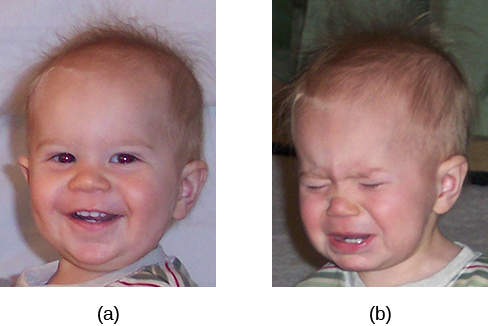
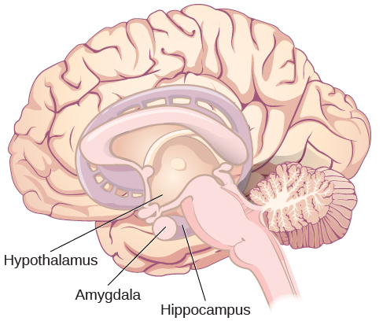
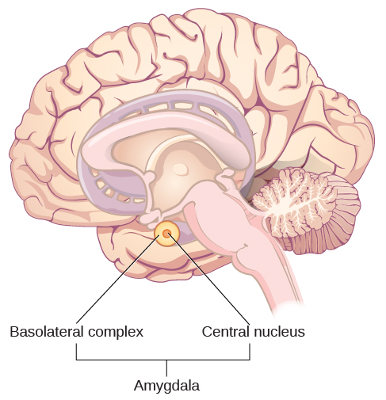

=======
Emotion
=======

.. contents::
   :depth: 3
..

.. container::

   By the end of this section, you will be able to: \* Explain the major
   theories of emotion \* Describe the role that limbic structures play
   in emotional processing \* Understand the ubiquitous nature of
   producing and recognizing emotional expression

As we move through our daily lives, we experience a variety of emotions.
An **emotion**\ {: data-type=“term”} is a subjective state of being that
we often describe as our feelings. The words emotion and mood are
sometimes used interchangeably, but psychologists use these words to
refer to two different things. Typically, the word emotion indicates a
subjective, affective state that is relatively intense and that occurs
in response to something we experience
(`[link] <#Figure_10_04_HappySad>`__). Emotions are often thought to be
consciously experienced and intentional. **Mood**\ {: data-type=“term”
.no-emphasis}, on the other hand, refers to a prolonged, less intense,
affective state that does not occur in response to something we
experience. Mood states may not be consciously recognized and do not
carry the intentionality that is associated with emotion (Beedie, Terry,
Lane, & Devonport, 2011). Here we will focus on emotion, and you will
learn more about mood in the chapter that covers psychological
disorders.

|Photograph A shows a toddler laughing. Photograph B shows the same
toddler crying.|\ {: #Figure_10_04_HappySad}

We can be at the heights of joy or in the depths of despair. We might
feel angry when we are betrayed, fear when we are threatened, and
surprised when something unexpected happens. This section will outline
some of the most well-known theories explaining our emotional experience
and provide insight into the biological bases of emotion. This section
closes with a discussion of the ubiquitous nature of facial expressions
of emotion and our abilities to recognize those expressions in others.

THEORIES OF EMOTION
===================

Our emotional states are combinations of physiological arousal,
psychological appraisal, and subjective experiences. Together, these are
known as the **components of emotion**\ {: data-type=“term”}. These
appraisals are informed by our experiences, backgrounds, and cultures.
Therefore, different people may have different emotional experiences
even when faced with similar circumstances. Over time, several different
theories of emotion, shown in `[link] <#Figure_10_04_Theories>`__, have
been proposed to explain how the various components of emotion interact
with one another.

The **James-Lange theory**\ {: data-type=“term”} of emotion asserts that
emotions arise from physiological arousal. Recall what you have learned
about the sympathetic nervous system and our fight or flight response
when threatened. If you were to encounter some threat in your
environment, like a venomous snake in your backyard, your sympathetic
nervous system would initiate significant physiological arousal, which
would make your heart race and increase your respiration rate. According
to the James-Lange theory of emotion, you would only experience a
feeling of fear after this physiological arousal had taken place.
Furthermore, different arousal patterns would be associated with
different feelings.

Other theorists, however, doubted that the physiological arousal that
occurs with different types of emotions is distinct enough to result in
the wide variety of emotions that we experience. Thus, the **Cannon-Bard
theory**\ {: data-type=“term”} of emotion was developed. According to
this view, physiological arousal and emotional experience occur
simultaneously, yet independently (Lang, 1994). So, when you see the
venomous snake, you feel fear at exactly the same time that your body
mounts its fight or flight response. This emotional reaction would be
separate and independent of the physiological arousal, even though they
co-occur.

The James-Lange and Cannon-Bard theories have each garnered some
empirical support in various research paradigms. For instance, Chwalisz,
Diener, and Gallagher (1988) conducted a study of the emotional
experiences of people who had spinal cord injuries. They reported that
individuals who were incapable of receiving autonomic feedback because
of their injuries still experienced emotion; however, there was a
tendency for people with less awareness of autonomic arousal to
experience less intense emotions. More recently, research investigating
the facial feedback hypothesis suggested that suppression of facial
expression of emotion lowered the intensity of some emotions experienced
by participants (Davis, Senghas, & Ochsner, 2009). In both of these
examples, neither theory is fully supported because physiological
arousal does not seem to be necessary for the emotional experience, but
this arousal does appear to be involved in enhancing the intensity of
the emotional experience.

The **Schachter-Singer two-factor theory**\ {: data-type=“term”} of
emotion is another variation on theories of emotions that takes into
account both physiological arousal and the emotional experience.
According to this theory, emotions are composed of two factors:
physiological and cognitive. In other words, physiological arousal is
interpreted in context to produce the emotional experience. In
revisiting our example involving the venomous snake in your backyard,
the two-factor theory maintains that the snake elicits sympathetic
nervous system activation that is labeled as fear given the context, and
our experience is that of fear.

|A diagram shows a photograph of a snake on the left and a photograph of
a frightened person on the right, with an arrow labeled “time.” Beneath
the photos are flow diagrams of four theories of emotion. In the
“James-Lange theory,” a box labeled “arousal (snake)” leads to a box
labeled “heart pounding, sweating,” which leads to a box labeled “fear
(emotion).” In the “Cannon-Bard theory,” a box labeled “arousal (snake)”
splits into two boxes labeled “heart pounding, sweating,” and “fear
(emotion).” In the “Schachter-Singer Two-Factor theory,” a box labeled
“arousal (snake)” leads to two boxes labeled “heart pounding, sweating”
and cognitive label (“I’m scared)” which then lead to a single box
labeled “fear (emotion).” In the “Lazarus’ Cognitive-mediational
theory,” a box labeled “arousal (snake)” leads to a box labeled
“appraisal,” which leads to a box labeled “fear/heart pounding,
sweating.”|\ {: #Figure_10_04_Theories}

It is important to point out that Schachter and Singer believed that
physiological arousal is very similar across the different types of
emotions that we experience, and therefore, the cognitive appraisal of
the situation is critical to the actual emotion experienced. In fact, it
might be possible to misattribute arousal to an emotional experience if
the circumstances were right (Schachter & Singer, 1962).

To test their idea, Schachter and Singer performed a clever experiment.
Male participants were randomly assigned to one of several groups. Some
of the participants received injections of epinephrine that caused
bodily changes that mimicked the fight-or-flight response of the
sympathetic nervous system; however, only some of these men were told to
expect these reactions as side effects of the injection. The other men
that received injections of epinephrine were told either that the
injection would have no side effects or that it would result in a side
effect unrelated to a sympathetic response, such as itching feet or
headache. After receiving these injections, participants waited in a
room with someone else they thought was another subject in the research
project. In reality, the other person was a confederate of the
researcher. The confederate engaged in scripted displays of euphoric or
angry behavior (Schachter & Singer, 1962).

When those subjects who were told that they should expect to feel
symptoms of physiological arousal were asked about any emotional changes
that they had experienced related to either euphoria or anger (depending
on how their confederate behaved), they reported none. However, the men
who weren’t expecting physiological arousal as a function of the
injection were more likely to report that they experienced euphoria or
anger as a function of their assigned confederate’s behavior. While
everyone that received an injection of epinephrine experienced the same
physiological arousal, only those who were not expecting the arousal
used context to interpret the arousal as a change in emotional state
(Schachter & Singer, 1962).

Strong emotional responses are associated with strong physiological
arousal. This has led some to suggest that the signs of physiological
arousal, which include increased heart rate, respiration rate, and
sweating, might serve as a tool to determine whether someone is telling
the truth or not. The assumption is that most of us would show signs of
physiological arousal if we were being dishonest with someone. A
**polygraph**\ {: data-type=“term”}, or lie detector test, measures the
physiological arousal of an individual responding to a series of
questions. Someone trained in reading these tests would look for answers
to questions that are associated with increased levels of arousal as
potential signs that the respondent may have been dishonest on those
answers. While polygraphs are still commonly used, their validity and
accuracy are highly questionable because there is no evidence that lying
is associated with any particular pattern of physiological arousal (Saxe
& Ben-Shakhar, 1999).

The relationship between our experiencing of emotions and our cognitive
processing of them, and the order in which these occur, remains a topic
of research and debate. Lazarus (1991) developed the
**cognitive-mediational theory**\ {: data-type=“term”} that asserts our
emotions are determined by our appraisal of the stimulus. This appraisal
mediates between the stimulus and the emotional response, and it is
immediate and often unconscious. In contrast to the Schachter-Singer
model, the appraisal precedes a cognitive label. You will learn more
about Lazarus’s appraisal concept when you study stress, health, and
lifestyle.

Two other prominent views arise from the work of Robert Zajonc and
Joseph LeDoux. Zajonc asserted that some emotions occur separately from
or prior to our cognitive interpretation of them, such as feeling fear
in response to an unexpected loud sound (Zajonc, 1998). He also believed
in what we might casually refer to as a gut feeling—that we can
experience an instantaneous and unexplainable like or dislike for
someone or something (Zajonc, 1980). LeDoux also views some emotions as
requiring no cognition: some emotions completely bypass contextual
interpretation. His research into the neuroscience of emotion has
demonstrated the amygdala’s primary role in fear (Cunha, Monfils, &
LeDoux, 2010; LeDoux 1996, 2002). A fear stimulus is processed by the
brain through one of two paths: from the thalamus (where it is
perceived) directly to the amygdala or from the thalamus through the
cortex and then to the amygdala. The first path is quick, while the
second enables more processing about details of the stimulus. In the
following section, we will look more closely at the neuroscience of
emotional response.

THE BIOLOGY OF EMOTIONS
=======================

Earlier, you learned about the **limbic system**\ {: data-type=“term”
.no-emphasis}, which is the area of the brain involved in emotion and
memory (`[link] <#Figure_10_04_Limbic>`__). The limbic system includes
the hypothalamus, thalamus, amygdala, and the hippocampus. The
hypothalamus plays a role in the activation of the sympathetic nervous
system that is a part of any given emotional reaction. The thalamus
serves as a sensory relay center whose neurons project to both the
amygdala and the higher cortical regions for further processing. The
amygdala plays a role in processing emotional information and sending
that information on to cortical structures (Fossati, 2012).The
hippocampus integrates emotional experience with cognition (Femenía,
Gómez-Galán, Lindskog, & Magara, 2012).

|An illustration of the brain labels the locations of the
“hypothalamus,” “amygdala,” and “hippocampus.”|\ {:
#Figure_10_04_Limbic}

.. container:: psychology link-to-learning

   Work through this Open Colleges `interactive 3D brain
   simulator <http://openstax.org/l/bparts1>`__ for a refresher on the
   brain's parts and their functions. To begin, click the “Start
   Exploring” button. To access the limbic system, click the plus sign
   in the right-hand menu (set of three tabs).

Amygdala
--------

The **amygdala**\ {: data-type=“term” .no-emphasis} has received a great
deal of attention from researchers interested in understanding the
biological basis for emotions, especially fear and anxiety (Blackford &
Pine, 2012; Goosens & Maren, 2002; Maren, Phan, & Liberzon, 2013). The
amygdala is composed of various subnuclei, including the basolateral
complex and the central nucleus (`[link] <#Figure_10_04_Amygdala>`__).
The **basolateral complex**\ {: data-type=“term”} has dense connections
with a variety of sensory areas of the brain. It is critical for
classical conditioning and for attaching emotional value to learning
processes and memory. The **central nucleus**\ {: data-type=“term”}
plays a role in attention, and it has connections with the hypothalamus
and various brainstem areas to regulate the autonomic nervous and
endocrine systems’ activity (Pessoa, 2010).

|An illustration of the brain labels the locations of the “basolateral
complex” and “central nucleus” within the “amygdala.”|\ {:
#Figure_10_04_Amygdala}

Animal research has demonstrated that there is increased activation of
the amygdala in rat pups that have odor cues paired with electrical
shock when their mother is absent. This leads to an aversion to the odor
cue that suggests the rats learned to fear the odor cue. Interestingly,
when the mother was present, the rats actually showed a preference for
the odor cue despite its association with an electrical shock. This
preference was associated with no increases in amygdala activation. This
suggests a differential effect on the amygdala by the *context* (the
presence or absence of the mother) determined whether the pups learned
to fear the odor or to be attracted to it (Moriceau & Sullivan, 2006).

Raineki, Cortés, Belnoue, and Sullivan (2012) demonstrated that, in
rats, negative early life experiences could alter the function of the
amygdala and result in adolescent patterns of behavior that mimic human
mood disorders. In this study, rat pups received either abusive or
normal treatment during postnatal days 8–12. There were two forms of
abusive treatment. The first form of abusive treatment had an
insufficient bedding condition. The mother rat had insufficient bedding
material in her cage to build a proper nest that resulted in her
spending more time away from her pups trying to construct a nest and
less times nursing her pups. The second form of abusive treatment had an
associative learning task that involved pairing odors and an electrical
stimulus in the absence of the mother, as described above. The control
group was in a cage with sufficient bedding and was left undisturbed
with their mothers during the same time period. The rat pups that
experienced abuse were much more likely to exhibit depressive-like
symptoms during adolescence when compared to controls. These
depressive-like behaviors were associated with increased activation of
the amygdala.

Human research also suggests a relationship between the amygdala and
psychological disorders of mood or anxiety. Changes in amygdala
structure and function have been demonstrated in adolescents who are
either at-risk or have been diagnosed with various mood and/or anxiety
disorders (Miguel-Hidalgo, 2013; Qin et al., 2013). It has also been
suggested that functional differences in the amygdala could serve as a
biomarker to differentiate individuals suffering from bipolar disorder
from those suffering from major depressive disorder (Fournier, Keener,
Almeida, Kronhaus, & Phillips, 2013).

Hippocampus
-----------

As mentioned earlier, the **hippocampus**\ {: data-type=“term”
.no-emphasis} is also involved in emotional processing. Like the
amygdala, research has demonstrated that hippocampal structure and
function are linked to a variety of mood and anxiety disorders.
Individuals suffering from posttraumatic stress disorder (PTSD) show
marked reductions in the volume of several parts of the hippocampus,
which may result from decreased levels of neurogenesis and dendritic
branching (the generation of new neurons and the generation of new
dendrites in existing neurons, respectively) (Wang et al., 2010). While
it is impossible to make a causal claim with correlational research like
this, studies have demonstrated behavioral improvements and hippocampal
volume increases following either pharmacological or
cognitive-behavioral therapy in individuals suffering from PTSD (Bremner
& Vermetten, 2004; Levy-Gigi, Szabó, Kelemen, & Kéri, 2013).

.. container:: psychology link-to-learning

   Watch this `video <http://openstax.org/l/traumaticexp>`__ about
   research that demonstrates how the volume of the hippocampus can vary
   as a function of traumatic experiences.

FACIAL EXPRESSION AND RECOGNITION OF EMOTIONS
=============================================

Culture can impact the way in which people display emotion. A **cultural
display rule**\ {: data-type=“term”} is one of a collection of
culturally specific standards that govern the types and frequencies of
displays of emotions that are acceptable (Malatesta & Haviland, 1982).
Therefore, people from varying cultural backgrounds can have very
different cultural display rules of emotion. For example, research has
shown that individuals from the United States express negative emotions
like fear, anger, and disgust both alone and in the presence of others,
while Japanese individuals only do so while alone (Matsumoto, 1990).
Furthermore, individuals from cultures that tend to emphasize social
cohesion are more likely to engage in suppression of emotional reaction
so they can evaluate which response is most appropriate in a given
context (Matsumoto, Yoo, & Nakagawa, 2008).

Other distinct cultural characteristics might be involved in
emotionality. For instance, there may be gender differences involved in
emotional processing. While research into gender differences in
emotional display is equivocal, there is some evidence that men and
women may differ in regulation of emotions (McRae, Ochsner, Mauss,
Gabrieli, & Gross, 2008).

Despite different emotional display rules, our ability to recognize and
produce facial expressions of emotion appears to be universal. In fact,
even congenitally blind individuals produce the same facial expression
of emotions, despite their never having the opportunity to observe these
facial displays of emotion in other people. This would seem to suggest
that the pattern of activity in facial muscles involved in generating
emotional expressions is universal, and indeed, this idea was suggested
in the late 19th century in Charles Darwin’s book *The Expression of
Emotions in Man and Animals* (1872). In fact, there is substantial
evidence for seven **universal emotions**\ {: data-type=“term”
.no-emphasis} that are each associated with distinct facial expressions.
These include: happiness, surprise, sadness, fright, disgust, contempt,
and anger (`[link] <#Figure_10_04_Expressions>`__) (Ekman & Keltner,
1997).

|Each of seven photographs includes a person demonstrating a different
facial expression: happiness, surprise, sadness, fright, disgust,
contempt, and anger.|\ {: #Figure_10_04_Expressions}

Does smiling make you happy? Or does being happy make you smile? The
**facial feedback hypothesis**\ {: data-type=“term”} asserts that facial
expressions are capable of influencing our emotions, meaning that
smiling can make you feel happier (Buck, 1980; Soussignan, 2001; Strack,
Martin, & Stepper, 1988). Recent research explored how Botox, which
paralyzes facial muscles and limits facial expression, might affect
emotion. Havas, Glenberg, Gutowski, Lucarelli, and Davidson (2010)
discovered that depressed individuals reported less depression after
paralysis of their frowning muscles with Botox injections.

Of course, emotion is not only displayed through facial expression. We
also use the tone of our voices, various behaviors, and body language to
communicate information about our emotional states. **Body
language**\ {: data-type=“term”} is the expression of emotion in terms
of body position or movement. Research suggests that we are quite
sensitive to the emotional information communicated through body
language, even if we’re not consciously aware of it (de Gelder, 2006;
Tamietto et al., 2009).

.. container:: psychology link-to-learning

   Watch this short `CNN
   video <https://www.youtube.com/watch?v=XqiRRIRhZoM>`__ about body
   language to see how it plays out in the tense situation of a
   political debate. To apply these same concepts to the more everyday
   situations most of us face, check out these tips from an interview on
   the show `Today <http://openstax.org/l/todayshow>`__ with body
   language expert Janine Driver.

.. container:: psychology connect-the-concepts

   .. container::

      Autism Spectrum Disorder and Expression of Emotions

   Autism spectrum disorder (ASD) is a set of neurodevelopmental
   disorders characterized by repetitive behaviors and communication and
   social problems. Children who have autism spectrum disorders have
   difficulty recognizing the emotional states of others, and research
   has shown that this may stem from an inability to distinguish various
   nonverbal expressions of emotion (i.e., facial expressions) from one
   another (Hobson, 1986). In addition, there is evidence to suggest
   that autistic individuals also have difficulty expressing emotion
   through tone of voice and by producing facial expressions (Macdonald
   et al., 1989). Difficulties with emotional recognition and expression
   may contribute to the impaired social interaction and communication
   that characterize autism; therefore, various therapeutic approaches
   have been explored to address these difficulties. Various educational
   curricula, cognitive-behavioral therapies, and pharmacological
   therapies have shown some promise in helping autistic individuals
   process emotionally relevant information (Bauminger, 2002; Golan &
   Baron-Cohen, 2006; Guastella et al., 2010).

Summary
=======

Emotions are subjective experiences that consist of physiological
arousal and cognitive appraisal. Various theories have been put forward
to explain our emotional experiences. The James-Lange theory asserts
that emotions arise as a function of physiological arousal. The
Cannon-Bard theory maintains that emotional experience occurs
simultaneous to and independent of physiological arousal. The
Schachter-Singer two-factor theory suggests that physiological arousal
receives cognitive labels as a function of the relevant context and that
these two factors together result in an emotional experience.

The limbic system is the brain’s emotional circuit, which includes the
amygdala and the hippocampus. Both of these structures are implicated in
playing a role in normal emotional processing as well as in
psychological mood and anxiety disorders. Increased amygdala activity is
associated with learning to fear, and it is seen in individuals who are
at risk for or suffering from mood disorders. The volume of the
hippocampus has been shown to be reduced in individuals suffering from
posttraumatic stress disorder.

The ability to produce and recognize facial expressions of emotions
seems to be universal regardless of cultural background. However, there
are cultural display rules which influence how often and under what
circumstances various emotions can be expressed. Tone of voice and body
language also serve as a means by which we communicate information about
our emotional states.

Review Questions
================

.. container::

   .. container::

      Individuals suffering from posttraumatic stress disorder have been
      shown to have reduced volumes of the \________.

      1. amygdala
      2. hippocampus
      3. hypothalamus
      4. thalamus {: type=“A”}

   .. container::

      B

.. container::

   .. container::

      According to the \_______\_ theory of emotion, emotional
      experiences arise from physiological arousal.

      1. James-Lange
      2. Cannon-Bard
      3. Schachter-Singer two-factor
      4. Darwinian {: type=“A”}

   .. container::

      A

.. container::

   .. container::

      Which of the following is not one of the seven universal emotions
      described in this chapter?

      1. contempt
      2. disgust
      3. melancholy
      4. anger {: type=“A”}

   .. container::

      C

.. container::

   .. container::

      Which of the following theories of emotion would suggest that
      polygraphs should be quite accurate at differentiating one emotion
      from another?

      1. Cannon-Bard theory
      2. James-Lange theory
      3. Schachter-Singer two-factor theory
      4. Darwinian theory {: type=“A”}

   .. container::

      B

Critical Thinking Questions
===========================

.. container::

   .. container::

      Imagine you find a venomous snake crawling up your leg just after
      taking a drug that prevented sympathetic nervous system
      activation. What would the James-Lange theory predict about your
      experience?

   .. container::

      The James-Lange theory would predict that I would not feel fear
      because I haven’t had the physiological arousal necessary to
      induce that emotional state.

.. container::

   .. container::

      Why can we not make causal claims regarding the relationship
      between the volume of the hippocampus and PTSD?

   .. container::

      The research that exists is correlational in nature. It could be
      the case that reduced hippocampal volume predisposes people to
      develop PTSD or the decreased volume could result from PTSD.
      Causal claims can only be made when performing an experiment.

Personal Application Question
=============================

.. container::

   .. container::

      Think about times in your life when you have been absolutely
      elated (e.g., perhaps your school’s basketball team just won a
      closely contested ballgame for the national championship) and very
      fearful (e.g., you are about to give a speech in your public
      speaking class to a roomful of 100 strangers). How would you
      describe how your arousal manifested itself physically? Were there
      marked differences in physiological arousal associated with each
      emotional state?

.. container::

   .. rubric:: Glossary
      :name: glossary

   {: data-type=“glossary-title”}

   basolateral complex
      part of the brain with dense connections with a variety of sensory
      areas of the brain; it is critical for classical conditioning and
      attaching emotional value to memory ^
   body language
      emotional expression through body position or movement ^
   Cannon-Bard theory of emotion
      physiological arousal and emotional experience occur at the same
      time ^
   central nucleus
      part of the brain involved in attention and has connections with
      the hypothalamus and various brainstem areas to regulate the
      autonomic nervous and endocrine systems’ activity ^
   cognitive-mediational theory
      our emotions are determined by our appraisal of the stimulus ^
   components of emotion
      physiological arousal, psychological appraisal, and subjective
      experience ^
   cultural display rule
      one of the culturally specific standards that govern the types and
      frequencies of emotions that are acceptable ^
   emotion
      subjective state of being often described as feelings ^
   facial feedback hypothesis
      facial expressions are capable of influencing our emotions ^
   James-Lange theory of emotion
      emotions arise from physiological arousal ^
   polygraph
      lie detector test that measures physiological arousal of
      individuals as they answer a series of questions ^
   Schachter-Singer two-factor theory of emotion
      emotions consist of two factors: physiological and cognitive

.. |A diagram shows a photograph of a snake on the left and a photograph of a frightened person on the right, with an arrow labeled “time.” Beneath the photos are flow diagrams of four theories of emotion. In the “James-Lange theory,” a box labeled “arousal (snake)” leads to a box labeled “heart pounding, sweating,” which leads to a box labeled “fear (emotion).” In the “Cannon-Bard theory,” a box labeled “arousal (snake)” splits into two boxes labeled “heart pounding, sweating,” and “fear (emotion).” In the “Schachter-Singer Two-Factor theory,” a box labeled “arousal (snake)” leads to two boxes labeled “heart pounding, sweating” and cognitive label (“I’m scared)” which then lead to a single box labeled “fear (emotion).” In the “Lazarus’ Cognitive-mediational theory,” a box labeled “arousal (snake)” leads to a box labeled “appraisal,” which leads to a box labeled “fear/heart pounding, sweating.”| image:: ../resources/CNX_Psych_10_04_Theories.jpg

.. |Each of seven photographs includes a person demonstrating a different facial expression: happiness, surprise, sadness, fright, disgust, contempt, and anger.| image:: ../resources/CNX_Psych_10_04_Expressions.jpg
