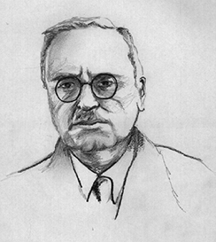
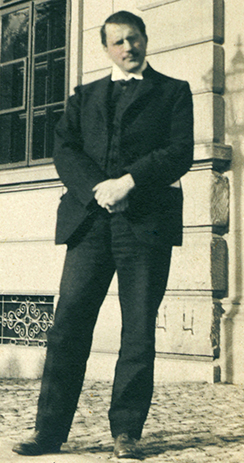

===============================================
Neo-Freudians: Adler, Erikson, Jung, and Horney
===============================================

.. contents::
   :depth: 3
..

.. container::

   By the end of this section, you will be able to: \* Discuss the
   concept of the inferiority complex \* Discuss the core differences
   between Erikson’s and Freud’s views on personality \* Discuss Jung’s
   ideas of the collective unconscious and archetypes \* Discuss the
   work of Karen Horney, including her revision of Freud’s “penis envy”

Freud attracted many followers who modified his ideas to create new
theories about personality. These theorists, referred to as
neo-Freudians, generally agreed with Freud that childhood experiences
matter, but deemphasized sex, focusing more on the social environment
and effects of culture on personality. Four notable neo-Freudians
include Alfred Adler, Erik Erikson, Carl Jung (pronounced “Yoong”), and
Karen Horney (pronounced “HORN-eye”).

ALFRED ADLER
============

Alfred **Adler**\ {: data-type=“term” .no-emphasis}, a colleague of
Freud’s and the first president of the Vienna Psychoanalytical Society
(Freud’s inner circle of colleagues), was the first major theorist to
break away from Freud (`[link] <#CNX_Psych_11_03_Adler>`__). He
subsequently founded a school of psychology called **individual
psychology**\ {: data-type=“term”}, which focuses on our drive to
compensate for feelings of inferiority. Adler (1937, 1956) proposed the
concept of the **inferiority complex**\ {: data-type=“term”}. An
inferiority complex refers to a person’s feelings that they lack worth
and don’t measure up to the standards of others or of society. Adler’s
ideas about inferiority represent a major difference between his
thinking and Freud’s. Freud believed that we are motivated by sexual and
aggressive urges, but Adler (1930, 1961) believed that feelings of
inferiority in childhood are what drive people to attempt to gain
superiority and that this striving is the force behind all of our
thoughts, emotions, and behaviors.

|An illustration shows Alfred Adler.|\ {: #CNX_Psych_11_03_Adler}

Adler also believed in the importance of social connections, seeing
childhood development emerging through social development rather than
the sexual stages Freud outlined. Adler noted the inter-relatedness of
humanity and the need to work together for the betterment of all. He
said, “The happiness of mankind lies in working together, in living as
if each individual had set himself the task of contributing to the
common welfare” (Adler, 1964, p. 255) with the main goal of psychology
being “to recognize the equal rights and equality of others” (Adler,
1961, p. 691).

With these ideas, Adler identified three fundamental social tasks that
all of us must experience: occupational tasks (careers), societal tasks
(friendship), and love tasks (finding an intimate partner for a
long-term relationship). Rather than focus on sexual or aggressive
motives for behavior as Freud did, Adler focused on social motives. He
also emphasized conscious rather than unconscious motivation, since he
believed that the three fundamental social tasks are explicitly known
and pursued. That is not to say that Adler did not also believe in
unconscious processes—he did—but he felt that conscious processes were
more important.

One of Adler’s major contributions to personality psychology was the
idea that our birth order shapes our personality. He proposed that older
siblings, who start out as the focus of their parents’ attention but
must share that attention once a new child joins the family, compensate
by becoming overachievers. The youngest children, according to Adler,
may be spoiled, leaving the middle child with the opportunity to
minimize the negative dynamics of the youngest and oldest children.
Despite popular attention, research has not conclusively confirmed
Adler’s hypotheses about birth order.

.. container:: psychology link-to-learning

   One of Adler’s major contributions to personality psychology was the
   idea that our birth order shapes our personality. Follow `this
   link <http://openstax.org/l/best>`__ to view a summary of birth order
   theory.

ERIK ERIKSON
============

As an art school dropout with an uncertain future, young Erik
**Erikson**\ {: data-type=“term” .no-emphasis} met Freud’s daughter,
Anna Freud, while he was tutoring the children of an American couple
undergoing psychoanalysis in Vienna. It was Anna Freud who encouraged
Erikson to study psychoanalysis. Erikson received his diploma from the
Vienna Psychoanalytic Institute in 1933, and as Nazism spread across
Europe, he fled the country and immigrated to the United States that
same year. As you learned when you studied lifespan development, Erikson
later proposed a psychosocial theory of development, suggesting that an
individual’s personality develops throughout the lifespan—a departure
from Freud’s view that personality is fixed in early life. In his
theory, Erikson emphasized the social relationships that are important
at each stage of personality development, in contrast to Freud’s
emphasis on sex. Erikson identified eight stages, each of which
represents a conflict or developmental task
(`[link] <#Table_11_03_01>`__). The development of a healthy personality
and a sense of competence depend on the successful completion of each
task.

.. raw:: html

   <table id="Table_11_03_01" summary="A table outlines Erikson’s Psychosocial Stages of Development. It contains four columns which are labeled “Stage; Age (years); Developmental Task; and Description.” Each of the following eight rows corresponds to Erikson’s eight psychosocial stages of development. From left to right, the first row reads: “1; 0–1; trust vs. mistrust; and trust (or mistrust) that basic needs, such as nourishment and affection, will be met.” The second row reads: “2; 1–3; autonomy vs. shame/doubt; and sense of independence in many tasks develops.” The third row reads: “3; 3–6; initiative vs. guilt; and take initiative on some activities, may develop guilt when success not met or boundaries overstepped.” The fourth row reads: “4; 7–11; industry vs. inferiority; and develop self-confidence in abilities when competent or sense of inferiority when not.” The fifth row reads: “5; 12–18; identity vs. confusion; and experiment with and develop identity and roles.” The sixth row reads: “6; 19–29; intimacy vs. isolation; and establish intimacy and relationships with others.” The seventh row reads: “7; 30–64; generativity vs. stagnation; and contribute to society and be part of a family.” The eighth row reads: “8; 65–; integrity vs. despair; and assess and make sense of life and meaning of contributions.”">

.. raw:: html

   <caption>

Erikson’s Psychosocial Stages of Development

.. raw:: html

   </caption>

.. raw:: html

   <thead>

.. raw:: html

   <tr>

.. raw:: html

   <th>

Stage

.. raw:: html

   </th>

.. raw:: html

   <th>

Age (years)

.. raw:: html

   </th>

.. raw:: html

   <th>

Developmental Task

.. raw:: html

   </th>

.. raw:: html

   <th>

Description

.. raw:: html

   </th>

.. raw:: html

   </tr>

.. raw:: html

   </thead>

.. raw:: html

   <tbody>

.. raw:: html

   <tr>

.. raw:: html

   <td>

1

.. raw:: html

   </td>

.. raw:: html

   <td>

0–1

.. raw:: html

   </td>

.. raw:: html

   <td>

Trust vs. mistrust

.. raw:: html

   </td>

.. raw:: html

   <td>

Trust (or mistrust) that basic needs, such as nourishment and affection,
will be met

.. raw:: html

   </td>

.. raw:: html

   </tr>

.. raw:: html

   <tr>

.. raw:: html

   <td>

2

.. raw:: html

   </td>

.. raw:: html

   <td>

1–3

.. raw:: html

   </td>

.. raw:: html

   <td>

Autonomy vs. shame/doubt

.. raw:: html

   </td>

.. raw:: html

   <td>

Sense of independence in many tasks develops

.. raw:: html

   </td>

.. raw:: html

   </tr>

.. raw:: html

   <tr>

.. raw:: html

   <td>

3

.. raw:: html

   </td>

.. raw:: html

   <td>

3–6

.. raw:: html

   </td>

.. raw:: html

   <td>

Initiative vs. guilt

.. raw:: html

   </td>

.. raw:: html

   <td>

Take initiative on some activities, may develop guilt when success not
met or boundaries overstepped

.. raw:: html

   </td>

.. raw:: html

   </tr>

.. raw:: html

   <tr>

.. raw:: html

   <td>

4

.. raw:: html

   </td>

.. raw:: html

   <td>

7–11

.. raw:: html

   </td>

.. raw:: html

   <td>

Industry vs. inferiority

.. raw:: html

   </td>

.. raw:: html

   <td>

Develop self-confidence in abilities when competent or sense of
inferiority when not

.. raw:: html

   </td>

.. raw:: html

   </tr>

.. raw:: html

   <tr>

.. raw:: html

   <td>

5

.. raw:: html

   </td>

.. raw:: html

   <td>

12–18

.. raw:: html

   </td>

.. raw:: html

   <td>

Identity vs. confusion

.. raw:: html

   </td>

.. raw:: html

   <td>

Experiment with and develop identity and roles

.. raw:: html

   </td>

.. raw:: html

   </tr>

.. raw:: html

   <tr>

.. raw:: html

   <td>

6

.. raw:: html

   </td>

.. raw:: html

   <td>

19–29

.. raw:: html

   </td>

.. raw:: html

   <td>

Intimacy vs. isolation

.. raw:: html

   </td>

.. raw:: html

   <td>

Establish intimacy and relationships with others

.. raw:: html

   </td>

.. raw:: html

   </tr>

.. raw:: html

   <tr>

.. raw:: html

   <td>

7

.. raw:: html

   </td>

.. raw:: html

   <td>

30–64

.. raw:: html

   </td>

.. raw:: html

   <td>

Generativity vs. stagnation

.. raw:: html

   </td>

.. raw:: html

   <td>

Contribute to society and be part of a family

.. raw:: html

   </td>

.. raw:: html

   </tr>

.. raw:: html

   <tr>

.. raw:: html

   <td>

8

.. raw:: html

   </td>

.. raw:: html

   <td>

65–

.. raw:: html

   </td>

.. raw:: html

   <td>

Integrity vs. despair

.. raw:: html

   </td>

.. raw:: html

   <td>

Assess and make sense of life and meaning of contributions

.. raw:: html

   </td>

.. raw:: html

   </tr>

.. raw:: html

   </tbody>

.. raw:: html

   </table>

CARL JUNG
=========

Carl **Jung**\ {: data-type=“term” .no-emphasis}
(`[link] <#CNX_Psych_11_03_Jung>`__) was a Swiss psychiatrist and
protégé of Freud, who later split off from Freud and developed his own
theory, which he called **analytical psychology**\ {: data-type=“term”}.
The focus of analytical psychology is on working to balance opposing
forces of conscious and unconscious thought, and experience within one’s
personality. According to Jung, this work is a continuous learning
process—mainly occurring in the second half of life—of becoming aware of
unconscious elements and integrating them into consciousness.

|A photograph shows Carl Jung.|\ {: #CNX_Psych_11_03_Jung}

Jung’s split from Freud was based on two major disagreements. First,
Jung, like Adler and Erikson, did not accept that sexual drive was the
primary motivator in a person’s mental life. Second, although Jung
agreed with Freud’s concept of a personal unconscious, he thought it to
be incomplete. In addition to the personal unconscious, Jung focused on
the collective unconscious.

The **collective unconscious**\ {: data-type=“term”} is a universal
version of the personal unconscious, holding mental patterns, or memory
traces, which are common to all of us (Jung, 1928). These ancestral
memories, which Jung called **archetypes**\ {: data-type=“term”}, are
represented by universal themes in various cultures, as expressed
through literature, art, and dreams (Jung). Jung said that these themes
reflect common experiences of people the world over, such as facing
death, becoming independent, and striving for mastery. Jung (1964)
believed that through biology, each person is handed down the same
themes and that the same types of symbols—such as the hero, the maiden,
the sage, and the trickster—are present in the folklore and fairy tales
of every culture. In Jung’s view, the task of integrating these
unconscious archetypal aspects of the self is part of the
self-realization process in the second half of life. With this
orientation toward self-realization, Jung parted ways with Freud’s
belief that personality is determined solely by past events and
anticipated the humanistic movement with its emphasis on
self-actualization and orientation toward the future.

Jung also proposed two attitudes or approaches toward life: extroversion
and introversion (Jung, 1923) (`[link] <#Table_11_03_02>`__). These
ideas are considered Jung’s most important contributions to the field of
personality psychology, as almost all models of personality now include
these concepts. If you are an extrovert, then you are a person who is
energized by being outgoing and socially oriented: You derive your
energy from being around others. If you are an introvert, then you are a
person who may be quiet and reserved, or you may be social, but your
energy is derived from your inner psychic activity. Jung believed a
balance between extroversion and introversion best served the goal of
self-realization.

.. raw:: html

   <table id="Table_11_03_02" summary="A two column table shows some differences between introverts and extroverts. The left column is labeled “Introvert” and the right column is labeled “Extrovert.” From left to right the first row contains “Energized by being alone” and “Energized by being with others.” The second row contains “Avoids attention” and “Seeks attention.” The third row contains “Speaks slowly and softly” and “Speaks quickly and loudly.” The fourth row contains “Thinks before speaking” and “Thinks out loud.” The fifth row contains “Stays on one topic” and “Jumps from topic to topic.” The sixth row contains “Prefers written communication” and “Prefers verbal communication.” The seventh row contains “Pays attention easily” and “Distractible.” The eighth row contains “Cautious” and “Acts first, thinks later.”">

.. raw:: html

   <caption>

Introverts and Extroverts

.. raw:: html

   </caption>

.. raw:: html

   <thead>

.. raw:: html

   <tr>

.. raw:: html

   <th>

Introvert

.. raw:: html

   </th>

.. raw:: html

   <th>

Extrovert

.. raw:: html

   </th>

.. raw:: html

   </tr>

.. raw:: html

   </thead>

.. raw:: html

   <tbody>

.. raw:: html

   <tr>

.. raw:: html

   <td>

Energized by being alone

.. raw:: html

   </td>

.. raw:: html

   <td>

Energized by being with others

.. raw:: html

   </td>

.. raw:: html

   </tr>

.. raw:: html

   <tr>

.. raw:: html

   <td>

Avoids attention

.. raw:: html

   </td>

.. raw:: html

   <td>

Seeks attention

.. raw:: html

   </td>

.. raw:: html

   </tr>

.. raw:: html

   <tr>

.. raw:: html

   <td>

Speaks slowly and softly

.. raw:: html

   </td>

.. raw:: html

   <td>

Speaks quickly and loudly

.. raw:: html

   </td>

.. raw:: html

   </tr>

.. raw:: html

   <tr>

.. raw:: html

   <td>

Thinks before speaking

.. raw:: html

   </td>

.. raw:: html

   <td>

Thinks out loud

.. raw:: html

   </td>

.. raw:: html

   </tr>

.. raw:: html

   <tr>

.. raw:: html

   <td>

Stays on one topic

.. raw:: html

   </td>

.. raw:: html

   <td>

Jumps from topic to topic

.. raw:: html

   </td>

.. raw:: html

   </tr>

.. raw:: html

   <tr>

.. raw:: html

   <td>

Prefers written communication

.. raw:: html

   </td>

.. raw:: html

   <td>

Prefers verbal communication

.. raw:: html

   </td>

.. raw:: html

   </tr>

.. raw:: html

   <tr>

.. raw:: html

   <td>

Pays attention easily

.. raw:: html

   </td>

.. raw:: html

   <td>

Distractible

.. raw:: html

   </td>

.. raw:: html

   </tr>

.. raw:: html

   <tr>

.. raw:: html

   <td>

Cautious

.. raw:: html

   </td>

.. raw:: html

   <td>

Acts first, thinks later

.. raw:: html

   </td>

.. raw:: html

   </tr>

.. raw:: html

   </tbody>

.. raw:: html

   </table>

Another concept proposed by Jung was the persona, which he referred to
as a mask that we adopt. According to Jung, we consciously create this
persona; however, it is derived from both our conscious experiences and
our collective unconscious. What is the purpose of the persona? Jung
believed that it is a compromise between who we really are (our true
self) and what society expects us to be. We hide those parts of
ourselves that are not aligned with society’s expectations.

.. container:: psychology link-to-learning

   Jung’s view of extroverted and introverted types serves as a basis of
   the Myers-Briggs Type Indicator (MBTI). This questionnaire describes
   a person’s degree of introversion versus extroversion, thinking
   versus feeling, intuition versus sensation, and judging versus
   perceiving. This `site <http://openstax.org/l/myersbriggs>`__
   provides a modified questionnaire based on the MBTI.

.. container:: psychology connect-the-concepts

   .. container::

      Are Archetypes Genetically Based?

   Jung proposed that human responses to archetypes are similar to
   instinctual responses in animals. One criticism of Jung is that there
   is no evidence that archetypes are biologically based or similar to
   animal instincts (Roesler, 2012). Jung formulated his ideas about 100
   years ago, and great advances have been made in the field of genetics
   since that time. We’ve found that human babies are born with certain
   capacities, including the ability to acquire language. However, we’ve
   also found that symbolic information (such as archetypes) is not
   encoded on the genome and that babies cannot decode symbolism,
   refuting the idea of a biological basis to archetypes. Rather than
   being seen as purely biological, more recent research suggests that
   archetypes emerge directly from our experiences and are reflections
   of linguistic or cultural characteristics (Young-Eisendrath, 1995).
   Today, most Jungian scholars believe that the collective unconscious
   and archetypes are based on both innate and environmental influences,
   with the differences being in the role and degree of each
   (Sotirova-Kohli et al., 2013).

KAREN HORNEY
============

Karen **Horney**\ {: data-type=“term” .no-emphasis} was one of the first
women trained as a Freudian psychoanalyst. During the Great Depression,
Horney moved from Germany to the United States, and subsequently moved
away from Freud’s teachings. Like Jung, Horney believed that each
individual has the potential for self-realization and that the goal of
psychoanalysis should be moving toward a healthy self rather than
exploring early childhood patterns of dysfunction. Horney also disagreed
with the Freudian idea that girls have penis envy and are jealous of
male biological features. According to Horney, any jealousy is most
likely culturally based, due to the greater privileges that males often
have, meaning that the differences between men’s and women’s
personalities are culturally based, not biologically based. She further
suggested that men have womb envy, because they cannot give birth.

Horney’s theories focused on the role of unconscious anxiety. She
suggested that normal growth can be blocked by basic anxiety stemming
from needs not being met, such as childhood experiences of loneliness
and/or isolation. How do children learn to handle this anxiety? Horney
suggested three styles of coping (`[link] <#Table_11_03_03>`__). The
first coping style, *moving toward people*, relies on affiliation and
dependence. These children become dependent on their parents and other
caregivers in an effort to receive attention and affection, which
provides relief from anxiety (Burger, 2008). When these children grow
up, they tend to use this same coping strategy to deal with
relationships, expressing an intense need for love and acceptance
(Burger, 2008). The second coping style, *moving against people*, relies
on aggression and assertiveness. Children with this coping style find
that fighting is the best way to deal with an unhappy home situation,
and they deal with their feelings of insecurity by bullying other
children (Burger, 2008). As adults, people with this coping style tend
to lash out with hurtful comments and exploit others (Burger, 2008). The
third coping style, *moving away from people*, centers on detachment and
isolation. These children handle their anxiety by withdrawing from the
world. They need privacy and tend to be self-sufficient. When these
children are adults, they continue to avoid such things as love and
friendship, and they also tend to gravitate toward careers that require
little interaction with others (Burger, 2008).

.. raw:: html

   <table id="Table_11_03_03" summary="A three column table identifies Horney’s coping styles. The columns are labeled “Coping Style; Description; and Example.” From left to right, the first row reads: “moving toward people; affiliation and dependence; and child seeking positive attention and affection from parent; adult needing love.” The second row reads: “moving against people; aggression and manipulation; and child fighting or bullying other children; adult who is abrasive and verbally hurtful, or who exploits others.” The third row reads: “moving away from people; detachment and isolation; and child withdrawn from the world and isolated; adult loner.”">

.. raw:: html

   <caption>

Horney’s Coping Styles

.. raw:: html

   </caption>

.. raw:: html

   <thead>

.. raw:: html

   <tr>

.. raw:: html

   <th>

Coping Style

.. raw:: html

   </th>

.. raw:: html

   <th>

Description

.. raw:: html

   </th>

.. raw:: html

   <th>

Example

.. raw:: html

   </th>

.. raw:: html

   </tr>

.. raw:: html

   </thead>

.. raw:: html

   <tbody>

.. raw:: html

   <tr>

.. raw:: html

   <td>

Moving toward people

.. raw:: html

   </td>

.. raw:: html

   <td>

Affiliation and dependence

.. raw:: html

   </td>

.. raw:: html

   <td>

Child seeking positive attention and affection from parent; adult
needing love

.. raw:: html

   </td>

.. raw:: html

   </tr>

.. raw:: html

   <tr>

.. raw:: html

   <td>

Moving against people

.. raw:: html

   </td>

.. raw:: html

   <td>

Aggression and manipulation

.. raw:: html

   </td>

.. raw:: html

   <td>

Child fighting or bullying other children; adult who is abrasive and
verbally hurtful, or who exploits others

.. raw:: html

   </td>

.. raw:: html

   </tr>

.. raw:: html

   <tr>

.. raw:: html

   <td>

Moving away from people

.. raw:: html

   </td>

.. raw:: html

   <td>

Detachment and isolation

.. raw:: html

   </td>

.. raw:: html

   <td>

Child withdrawn from the world and isolated; adult loner

.. raw:: html

   </td>

.. raw:: html

   </tr>

.. raw:: html

   </tbody>

.. raw:: html

   </table>

Horney believed these three styles are ways in which people typically
cope with day-to-day problems; however, the three coping styles can
become neurotic strategies if they are used rigidly and compulsively,
leading a person to become alienated from others.

Summary
=======

The neo-Freudians were psychologists whose work followed from Freud’s.
They generally agreed with Freud that childhood experiences matter, but
they decreased the emphasis on sex and focused more on the social
environment and effects of culture on personality. Some of the notable
neo-Freudians are Alfred Adler, Carl Jung, Erik Erikson, and Karen
Horney. The neo-Freudian approaches have been criticized, because they
tend to be philosophical rather than based on sound scientific research.
For example, Jung’s conclusions about the existence of the collective
unconscious are based on myths, legends, dreams, and art. In addition,
as with Freud’s psychoanalytic theory, the neo-Freudians based much of
their theories of personality on information from their patients.

Review Questions
================

.. container::

   .. container::

      The universal bank of ideas, images, and concepts that have been
      passed down through the generations from our ancestors refers to
      \________.

      1. archetypes
      2. intuition
      3. collective unconscious
      4. personality types {: type=“a”}

   .. container::

      C

Critical Thinking Questions
===========================

.. container::

   .. container::

      Describe the difference between extroverts and introverts in terms
      of what is energizing to each.

   .. container::

      Extroverts are energized by social engagement. Introverts are
      recharged by solitary time.

.. container::

   .. container::

      Discuss Horney’s perspective on Freud’s concept of penis envy.

   .. container::

      Horney disagreed with the Freudian idea that women had penis envy
      and were jealous of a man’s biological features. Horney discussed
      that the jealousy was more likely culturally based, due to the
      greater privileges that males often have, and that differences
      between men and women’s personalities were cultural, not
      biologically based. Horney also suggested that men may have womb
      envy, because men cannot give birth.

Personal Application Questions
==============================

.. container::

   .. container::

      What is your birth order? Do you agree or disagree with Adler’s
      description of your personality based on his birth order theory,
      as described in the Link to Learning? Provide examples for
      support.

.. container::

   .. container::

      Would you describe yourself as an extrovert or an introvert? Does
      this vary based on the situation? Provide examples to support your
      points.

.. container::

   .. container::

      Select an epic story that is popular in contemporary society (such
      as *Harry Potter* or *Star Wars*) and explain it terms of Jung’s
      concept of archetypes.

.. container::

   .. rubric:: Glossary
      :name: glossary

   {: data-type=“glossary-title”}

   analytical psychology
      Jung’s theory focusing on the balance of opposing forces within
      one’s personality and the significance of the collective
      unconscious ^
   archetype
      pattern that exists in our collective unconscious across cultures
      and societies ^
   collective unconscious
      common psychological tendencies that have been passed down from
      one generation to the next ^
   individual psychology
      school of psychology proposed by Adler that focuses on our drive
      to compensate for feelings of inferiority ^
   inferiority complex
      refers to a person’s feelings that they lack worth and don’t
      measure up to others’ or to society’s standards

