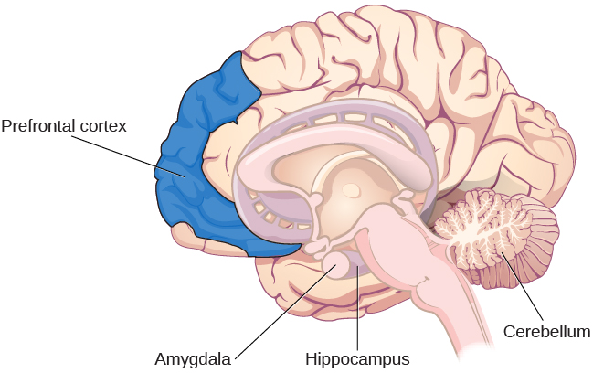

=======================================
Parts of the Brain Involved with Memory
=======================================

.. contents::
   :depth: 3
..

.. container::

   By the end of this section, you will be able to: \* Explain the brain
   functions involved in memory \* Recognize the roles of the
   hippocampus, amygdala, and cerebellum

Are memories stored in just one part of the brain, or are they stored in
many different parts of the brain? Karl Lashley began exploring this
problem, about 100 years ago, by making lesions in the brains of animals
such as rats and monkeys. He was searching for evidence of the
**engram**\ {: data-type=“term”}: the group of neurons that serve as the
“physical representation of memory” (Josselyn, 2010). First, Lashley
(1950) trained rats to find their way through a maze. Then, he used the
tools available at the time—in this case a soldering iron—to create
lesions in the rats’ brains, specifically in the cerebral cortex. He did
this because he was trying to erase the engram, or the original memory
trace that the rats had of the maze.

Lashley did not find evidence of the engram, and the rats were still
able to find their way through the maze, regardless of the size or
location of the lesion. Based on his creation of lesions and the
animals’ reaction, he formulated the **equipotentiality hypothesis**\ {:
data-type=“term”}: if part of one area of the brain involved in memory
is damaged, another part of the same area can take over that memory
function (Lashley, 1950). Although Lashley’s early work did not confirm
the existence of the engram, modern psychologists are making progress
locating it. Eric Kandel, for example, spent decades working on the
synapse, the basic structure of the brain, and its role in controlling
the flow of information through neural circuits needed to store memories
(Mayford, Siegelbaum, & Kandel, 2012).

Many scientists believe that the entire brain is involved with memory.
However, since Lashley’s research, other scientists have been able to
look more closely at the brain and memory. They have argued that memory
is located in specific parts of the brain, and specific neurons can be
recognized for their involvement in forming memories. The main parts of
the brain involved with memory are the amygdala, the hippocampus, the
cerebellum, and the prefrontal cortex
(`[link] <#Figure_08_02_Brain>`__).

|An illustration of a brain shows the location of the amygdala,
hippocampus, cerebellum, and prefrontal cortex.|\ {:
#Figure_08_02_Brain}

THE AMYGDALA
============

First, let’s look at the role of the **amygdala**\ {: data-type=“term”
.no-emphasis} in memory formation. The main job of the amygdala is to
regulate emotions, such as fear and aggression
(`[link] <#Figure_08_02_Brain>`__). The amygdala plays a part in how
memories are stored because storage is influenced by stress hormones.
For example, one researcher experimented with rats and the fear response
(Josselyn, 2010). Using Pavlovian conditioning, a neutral tone was
paired with a foot shock to the rats. This produced a fear memory in the
rats. After being conditioned, each time they heard the tone, they would
freeze (a defense response in rats), indicating a memory for the
impending shock. Then the researchers induced cell death in neurons in
the lateral amygdala, which is the specific area of the brain
responsible for fear memories. They found the fear memory faded (became
extinct). Because of its role in processing emotional information, the
amygdala is also involved in memory consolidation: the process of
transferring new learning into long-term memory. The amygdala seems to
facilitate encoding memories at a deeper level when the event is
emotionally arousing.

.. container:: psychology link-to-learning

   In this TED Talk called `“A Mouse. A Laser Beam. A Manipulated
   Memory,” <http://openstax.org/l/mousebeam>`__ Steve Ramirez and Xu
   Liu from MIT talk about using laser beams to manipulate fear memory
   in rats. Find out why their work caused a media frenzy once it was
   published in *Science*.

THE HIPPOCAMPUS
===============

Another group of researchers also experimented with rats to learn how
the **hippocampus**\ {: data-type=“term” .no-emphasis} functions in
memory processing (`[link] <#Figure_08_02_Brain>`__). They created
lesions in the hippocampi of the rats, and found that the rats
demonstrated memory impairment on various tasks, such as object
recognition and maze running. They concluded that the hippocampus is
involved in memory, specifically normal recognition memory as well as
spatial memory (when the memory tasks are like recall tests) (Clark,
Zola, & Squire, 2000). Another job of the hippocampus is to project
information to cortical regions that give memories meaning and connect
them with other connected memories. It also plays a part in memory
consolidation: the process of transferring new learning into long-term
memory.

Injury to this area leaves us unable to process new declarative
memories. One famous patient, known for years only as H. M., had both
his left and right temporal lobes (hippocampi) removed in an attempt to
help control the seizures he had been suffering from for years (Corkin,
Amaral, González, Johnson, & Hyman, 1997). As a result, his declarative
memory was significantly affected, and he could not form new semantic
knowledge. He lost the ability to form new memories, yet he could still
remember information and events that had occurred prior to the surgery.

.. container:: psychology link-to-learning

   For a closer look at how memory works, view this
   `video <http://openstax.org/l/HMbrain>`__ on quirks of memory, and
   read more in this `article <http://openstax.org/l/HMbrain2>`__ about
   patient HM.

THE CEREBELLUM AND PREFRONTAL CORTEX
====================================

Although the hippocampus seems to be more of a processing area for
explicit memories, you could still lose it and be able to create
implicit memories (procedural memory, motor learning, and classical
conditioning), thanks to your **cerebellum**\ {: data-type=“term”
.no-emphasis} (`[link] <#Figure_08_02_Brain>`__). For example, one
classical conditioning experiment is to accustom subjects to blink when
they are given a puff of air. When researchers damaged the cerebellums
of rabbits, they discovered that the rabbits were not able to learn the
conditioned eye-blink response (Steinmetz, 1999; Green & Woodruff-Pak,
2000).

Other researchers have used brain scans, including positron emission
tomography (PET) scans, to learn how people process and retain
information. From these studies, it seems the prefrontal cortex is
involved. In one study, participants had to complete two different
tasks: either looking for the letter *a* in words (considered a
perceptual task) or categorizing a noun as either living or non-living
(considered a semantic task) (Kapur et al., 1994). Participants were
then asked which words they had previously seen. Recall was much better
for the semantic task than for the perceptual task. According to PET
scans, there was much more activation in the left inferior prefrontal
cortex in the semantic task. In another study, encoding was associated
with left frontal activity, while retrieval of information was
associated with the right frontal region (Craik et al., 1999).

NEUROTRANSMITTERS
=================

There also appear to be specific neurotransmitters involved with the
process of memory, such as epinephrine, dopamine, serotonin, glutamate,
and acetylcholine (Myhrer, 2003). There continues to be discussion and
debate among researchers as to which **neurotransmitter**\ {:
data-type=“term” .no-emphasis} plays which specific role (Blockland,
1996). Although we don’t yet know which role each neurotransmitter plays
in memory, we do know that communication among neurons via
neurotransmitters is critical for developing new memories. Repeated
activity by neurons leads to increased neurotransmitters in the synapses
and more efficient and more synaptic connections. This is how memory
consolidation occurs.

It is also believed that strong emotions trigger the formation of strong
memories, and weaker emotional experiences form weaker memories; this is
called **arousal theory**\ {: data-type=“term”} (Christianson, 1992).
For example, strong emotional experiences can trigger the release of
neurotransmitters, as well as hormones, which strengthen memory;
therefore, our memory for an emotional event is usually better than our
memory for a non-emotional event. When humans and animals are stressed,
the brain secretes more of the neurotransmitter glutamate, which helps
them remember the stressful event (McGaugh, 2003). This is clearly
evidenced by what is known as the flashbulb memory phenomenon.

A **flashbulb memory**\ {: data-type=“term”} is an exceptionally clear
recollection of an important event (`[link] <#Figure_08_02_911>`__).
Where were you when you first heard about the 9/11 terrorist attacks?
Most likely you can remember where you were and what you were doing. In
fact, a Pew Research Center (2011) survey found that for those Americans
who were age 8 or older at the time of the event, 97% can recall the
moment they learned of this event, even a decade after it happened.

|A photograph shows the World Trade Center buildings, shortly after two
planes were flown into them on the morning of September 11, 2001. Thick,
black clouds of smoke stream from both buildings.|\ {:
#Figure_08_02_911}

.. container:: psychology dig-deeper

   .. container::

      Inaccurate and False Memories

   Even flashbulb memories can have decreased accuracy with the passage
   of time, even with very important events. For example, on at least
   three occasions, when asked how he heard about the terrorist attacks
   of 9/11, President George W. Bush responded inaccurately. In January
   2002, less than 4 months after the attacks, the then sitting
   President Bush was asked how he heard about the attacks. He
   responded:

   I was sitting there, and my Chief of Staff—well, first of all, when
   we walked into the classroom, I had seen this plane fly into the
   first building. There was a TV set on. And you know, I thought it was
   pilot error and I was amazed that anybody could make such a terrible
   mistake. (Greenberg, 2004, p. 2)

   Contrary to what President Bush recalled, no one saw the first plane
   hit, except people on the ground near the twin towers. The first
   plane was not videotaped because it was a normal Tuesday morning in
   New York City, until the first plane hit.

   Some people attributed Bush’s wrong recall of the event to conspiracy
   theories. However, there is a much more benign explanation: human
   memory, even flashbulb memories, can be frail. In fact, memory can be
   so frail that we can convince a person an event happened to them,
   even when it did not. In studies, research participants will recall
   hearing a word, even though they never heard the word. For example,
   participants were given a list of 15 sleep-related words, but the
   word “sleep” was not on the list. Participants recalled hearing the
   word “sleep” even though they did not actually hear it (Roediger &
   McDermott, 2000). The researchers who discovered this named the
   theory after themselves and a fellow researcher, calling it the
   Deese-Roediger-McDermott paradigm.

Summary
=======

Beginning with Karl Lashley, researchers and psychologists have been
searching for the engram, which is the physical trace of memory. Lashley
did not find the engram, but he did suggest that memories are
distributed throughout the entire brain rather than stored in one
specific area. Now we know that three brain areas do play significant
roles in the processing and storage of different types of memories:
cerebellum, hippocampus, and amygdala. The cerebellum’s job is to
process procedural memories; the hippocampus is where new memories are
encoded; the amygdala helps determine what memories to store, and it
plays a part in determining where the memories are stored based on
whether we have a strong or weak emotional response to the event. Strong
emotional experiences can trigger the release of neurotransmitters, as
well as hormones, which strengthen memory, so that memory for an
emotional event is usually stronger than memory for a non-emotional
event. This is shown by what is known as the flashbulb memory
phenomenon: our ability to remember significant life events. However,
our memory for life events (autobiographical memory) is not always
accurate.

Review Questions
================

.. container::

   .. container::

      This physical trace of memory is known as the \________.

      1. engram
      2. Lashley effect
      3. Deese-Roediger-McDermott Paradigm
      4. flashbulb memory effect {: type=“a”}

   .. container::

      A

.. container::

   .. container::

      An exceptionally clear recollection of an important event is a
      (an) \________.

      1. engram
      2. arousal theory
      3. flashbulb memory
      4. equipotentiality hypothesis {: type=“a”}

   .. container::

      C

Critical Thinking Questions
===========================

.. container::

   .. container::

      What might happen to your memory system if you sustained damage to
      your hippocampus?

   .. container::

      Because your hippocampus seems to be more of a processing area for
      your explicit memories, injury to this area could leave you unable
      to process new declarative (explicit) memories; however, even with
      this loss, you would be able to create implicit memories
      (procedural memory, motor learning and classical conditioning).

Personal Application Questions
==============================

.. container::

   .. container::

      Describe a flashbulb memory of a significant event in your life.

.. container::

   .. rubric:: Glossary
      :name: glossary

   {: data-type=“glossary-title”}

   arousal theory
      strong emotions trigger the formation of strong memories and
      weaker emotional experiences form weaker memories ^
   engram
      physical trace of memory ^
   equipotentiality hypothesis
      some parts of the brain can take over for damaged parts in forming
      and storing memories ^
   flashbulb memory
      exceptionally clear recollection of an important event

.. |A photograph shows the World Trade Center buildings, shortly after two planes were flown into them on the morning of September 11, 2001. Thick, black clouds of smoke stream from both buildings.| image:: ../resources/CNX_Psych_08_02_911n.jpg
