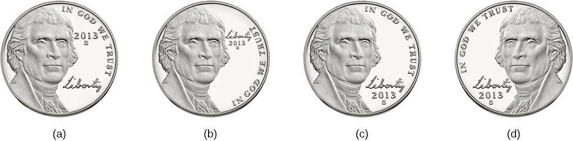
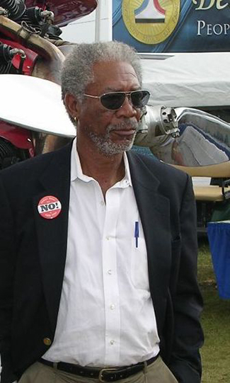

====================
Problems with Memory
====================

.. contents::
   :depth: 3
..

.. container::

   By the end of this section, you will be able to: \* Compare and
   contrast the two types of amnesia \* Discuss the unreliability of
   eyewitness testimony \* Discuss encoding failure \* Discuss the
   various memory errors \* Compare and contrast the two types of
   interference

You may pride yourself on your amazing ability to remember the
birthdates and ages of all of your friends and family members, or you
may be able recall vivid details of your 5th birthday party at Chuck E.
Cheese’s. However, all of us have at times felt frustrated, and even
embarrassed, when our memories have failed us. There are several reasons
why this happens.

AMNESIA
=======

**Amnesia**\ {: data-type=“term”} is the loss of long-term memory that
occurs as the result of disease, physical trauma, or psychological
trauma. Psychologist Tulving (2002) and his colleagues at the University
of Toronto studied K. C. for years. K. C. suffered a traumatic head
injury in a motorcycle accident and then had severe amnesia. Tulving
writes,

the outstanding fact about K.C.'s mental make-up is his utter inability
to remember any events, circumstances, or situations from his own life.
His episodic amnesia covers his whole life, from birth to the present.
The only exception is the experiences that, at any time, he has had in
the last minute or two. (Tulving, 2002, p. 14)

Anterograde Amnesia
-------------------

There are two common types of amnesia: anterograde amnesia and
retrograde amnesia (`[link] <#Figure_08_03_AntRet>`__). Anterograde
amnesia is commonly caused by brain trauma, such as a blow to the head.
With **anterograde amnesia**\ {: data-type=“term”}, you cannot remember
new information, although you can remember information and events that
happened prior to your injury. The hippocampus is usually affected
(McLeod, 2011). This suggests that damage to the brain has resulted in
the inability to transfer information from short-term to long-term
memory; that is, the inability to consolidate memories.

Many people with this form of amnesia are unable to form new episodic or
semantic memories, but are still able to form new procedural memories
(Bayley & Squire, 2002). This was true of H. M., which was discussed
earlier. The brain damage caused by his surgery resulted in anterograde
amnesia. H. M. would read the same magazine over and over, having no
memory of ever reading it—it was always new to him. He also could not
remember people he had met after his surgery. If you were introduced to
H. M. and then you left the room for a few minutes, he would not know
you upon your return and would introduce himself to you again. However,
when presented the same puzzle several days in a row, although he did
not remember having seen the puzzle before, his speed at solving it
became faster each day (because of relearning) (Corkin, 1965, 1968).

|A single-line flow diagram compares two types of amnesia. In the center
is a box labeled “event” with arrows extending from both sides.
Extending to the left is an arrow pointing left to the word “past”; the
arrow is labeled “retrograde amnesia.” Extending to the right is an
arrow pointing right to the word “present”; the arrow is labeled
“anterograde amnesia.”|\ {: #Figure_08_03_AntRet}

Retrograde Amnesia
------------------

**Retrograde amnesia**\ {: data-type=“term”} is loss of memory for
events that occurred prior to the trauma. People with retrograde amnesia
cannot remember some or even all of their past. They have difficulty
remembering episodic memories. What if you woke up in the hospital one
day and there were people surrounding your bed claiming to be your
spouse, your children, and your parents? The trouble is you don’t
recognize any of them. You were in a car accident, suffered a head
injury, and now have retrograde amnesia. You don’t remember anything
about your life prior to waking up in the hospital. This may sound like
the stuff of Hollywood movies, and Hollywood has been fascinated with
the amnesia plot for nearly a century, going all the way back to the
film *Garden of Lies* from 1915 to more recent movies such as the Jason
Bourne spy thrillers. However, for real-life sufferers of retrograde
amnesia, like former NFL football player Scott Bolzan, the story is not
a Hollywood movie. Bolzan fell, hit his head, and deleted 46 years of
his life in an instant. He is now living with one of the most extreme
cases of retrograde amnesia on record.

.. container:: psychology link-to-learning

   View the `video story <http://openstax.org/l/bolzan>`__ profiling
   Scott Bolzan’s amnesia and his attempts to get his life back.

MEMORY CONSTRUCTION AND RECONSTRUCTION
======================================

The formulation of new memories is sometimes called **construction**\ {:
data-type=“term”}, and the process of bringing up old memories is called
**reconstruction**\ {: data-type=“term”}. Yet as we retrieve our
memories, we also tend to alter and modify them. A memory pulled from
long-term storage into short-term memory is flexible. New events can be
added and we can change what we think we remember about past events,
resulting in inaccuracies and distortions. People may not intend to
distort facts, but it can happen in the process of retrieving old
memories and combining them with new memories (Roediger and DeSoto, in
press).

Suggestibility
--------------

When someone witnesses a crime, that person’s memory of the details of
the crime is very important in catching the suspect. Because memory is
so fragile, witnesses can be easily (and often accidentally) misled due
to the problem of suggestibility. **Suggestibility**\ {:
data-type=“term”} describes the effects of misinformation from external
sources that leads to the creation of false memories. In the fall of
2002, a sniper in the DC area shot people at a gas station, leaving Home
Depot, and walking down the street. These attacks went on in a variety
of places for over three weeks and resulted in the deaths of ten people.
During this time, as you can imagine, people were terrified to leave
their homes, go shopping, or even walk through their neighborhoods.
Police officers and the FBI worked frantically to solve the crimes, and
a tip hotline was set up. Law enforcement received over 140,000 tips,
which resulted in approximately 35,000 possible suspects (Newseum,
n.d.).

Most of the tips were dead ends, until a white van was spotted at the
site of one of the shootings. The police chief went on national
television with a picture of the white van. After the news conference,
several other eyewitnesses called to say that they too had seen a white
van fleeing from the scene of the shooting. At the time, there were more
than 70,000 white vans in the area. Police officers, as well as the
general public, focused almost exclusively on white vans because they
believed the eyewitnesses. Other tips were ignored. When the suspects
were finally caught, they were driving a blue sedan.

As illustrated by this example, we are vulnerable to the power of
suggestion, simply based on something we see on the news. Or we can
claim to remember something that in fact is only a suggestion someone
made. It is the suggestion that is the cause of the false memory.

Eyewitness Misidentification
----------------------------

Even though memory and the process of reconstruction can be fragile,
police officers, prosecutors, and the courts often rely on eyewitness
identification and testimony in the prosecution of criminals. However,
faulty eyewitness identification and testimony can lead to wrongful
convictions (`[link] <#Figure_08_03_Eyewitness>`__).

|A bar graph is titled “Leading cause of wrongful conviction in DNA
exoneration cases (source: Innocence Project).” The x-axis is labeled
“leading cause,” and the y-axis is labeled “percentage of wrongful
convictions (first 239 DNA exonerations).” Four bars show data:
“eyewitness misidentification” is the leading cause in about 75% of
cases, “forensic science” in about 49% of cases, “false confession” in
about 23% of cases, and “informant” in about 18% of cases.|\ {:
#Figure_08_03_Eyewitness}

How does this happen? In 1984, Jennifer Thompson, then a 22-year-old
college student in North Carolina, was brutally raped at knifepoint. As
she was being raped, she tried to memorize every detail of her rapist’s
face and physical characteristics, vowing that if she survived, she
would help get him convicted. After the police were contacted, a
composite sketch was made of the suspect, and Jennifer was shown six
photos. She chose two, one of which was of Ronald Cotton. After looking
at the photos for 4–5 minutes, she said, “Yeah. This is the one,” and
then she added, “I think this is the guy.” When questioned about this by
the detective who asked, “You’re sure? Positive?” She said that it was
him. Then she asked the detective if she did OK, and he reinforced her
choice by telling her she did great. These kinds of unintended cues and
suggestions by police officers can lead witnesses to identify the wrong
suspect. The district attorney was concerned about her lack of certainty
the first time, so she viewed a lineup of seven men. She said she was
trying to decide between numbers 4 and 5, finally deciding that Cotton,
number 5, “Looks most like him.” He was 22 years old.

By the time the trial began, Jennifer Thompson had absolutely no doubt
that she was raped by Ronald Cotton. She testified at the court hearing,
and her testimony was compelling enough that it helped convict him. How
did she go from, “I think it’s the guy” and it “Looks most like him,” to
such certainty? Gary Wells and Deah Quinlivan (2009) assert it’s
suggestive police identification procedures, such as stacking lineups to
make the defendant stand out, telling the witness which person to
identify, and confirming witnesses choices by telling them “Good
choice,” or “You picked the guy.”

After Cotton was convicted of the rape, he was sent to prison for life
plus 50 years. After 4 years in prison, he was able to get a new trial.
Jennifer Thompson once again testified against him. This time Ronald
Cotton was given two life sentences. After serving 11 years in prison,
DNA evidence finally demonstrated that Ronald Cotton did not commit the
rape, was innocent, and had served over a decade in prison for a crime
he did not commit.

.. container:: psychology link-to-learning

   To learn more about Ronald Cotton and the fallibility of memory,
   watch these excellent `Part 1 <http://openstax.org/l/Cotton1>`__ and
   `Part 2 <http://openstax.org/l/Cotton2>`__ videos by 60 Minutes.

Ronald Cotton’s story, unfortunately, is not unique. There are also
people who were convicted and placed on death row, who were later
exonerated. The Innocence Project is a non-profit group that works to
exonerate falsely convicted people, including those convicted by
eyewitness testimony. To learn more, you can visit
http://www.innocenceproject.org.

.. container:: psychology dig-deeper

   .. container::

      Preserving Eyewitness Memory: The Elizabeth Smart Case

   Contrast the Cotton case with what happened in the Elizabeth
   **Smart**\ {: data-type=“term” .no-emphasis} case. When Elizabeth was
   14 years old and fast asleep in her bed at home, she was abducted at
   knifepoint. Her nine-year-old sister, Mary Katherine, was sleeping in
   the same bed and watched, terrified, as her beloved older sister was
   abducted. Mary Katherine was the sole eyewitness to this crime and
   was very fearful. In the coming weeks, the Salt Lake City police and
   the FBI proceeded with caution with Mary Katherine. They did not want
   to implant any false memories or mislead her in any way. They did not
   show her police line-ups or push her to do a composite sketch of the
   abductor. They knew if they corrupted her memory, Elizabeth might
   never be found. For several months, there was little or no progress
   on the case. Then, about 4 months after the kidnapping, Mary
   Katherine first recalled that she had heard the abductor’s voice
   prior to that night (he had worked one time as a handyman at the
   family’s home) and then she was able to name the person whose voice
   it was. The family contacted the press and others recognized
   him—after a total of nine months, the suspect was caught and
   Elizabeth Smart was returned to her family.

The Misinformation Effect
-------------------------

Cognitive psychologist Elizabeth Loftus has conducted extensive research
on memory. She has studied false memories as well as recovered memories
of childhood sexual abuse. Loftus also developed the **misinformation
effect paradigm**\ {: data-type=“term”}, which holds that after exposure
to incorrect information, a person may misremember the original event.

According to Loftus, an eyewitness’s memory of an event is very flexible
due to the misinformation effect. To test this theory, Loftus and John
Palmer (1974) asked 45 U.S. college students to estimate the speed of
cars using different forms of questions
(`[link] <#Figure_08_03_CarCrash>`__). The participants were shown films
of car accidents and were asked to play the role of the eyewitness and
describe what happened. They were asked, “About how fast were the cars
going when they (smashed, collided, bumped, hit, contacted) each other?”
The participants estimated the speed of the cars based on the verb used.

Participants who heard the word “smashed” estimated that the cars were
traveling at a much higher speed than participants who heard the word
“contacted.” The implied information about speed, based on the verb they
heard, had an effect on the participants’ memory of the accident. In a
follow-up one week later, participants were asked if they saw any broken
glass (none was shown in the accident pictures). Participants who had
been in the “smashed” group were more than twice as likely to indicate
that they did remember seeing glass. Loftus and Palmer demonstrated that
a leading question encouraged them to not only remember the cars were
going faster, but to also falsely remember that they saw broken glass.

|Photograph A shows two cars that have crashed into each other. Part B
is a bar graph titled “perceived speed based on questioner’s verb
(source: Loftus and Palmer, 1974).” The x-axis is labeled “questioner’s
verb, and the y-axis is labeled “perceived speed (mph).” Five bars share
data: “smashed” was perceived at about 41 mph, “collided” at about 39
mph, “bumped” at about 37 mph, “hit” at about 34 mph, and “contacted” at
about 32 mph.|\ {: #Figure_08_03_CarCrash}

Controversies over Repressed and Recovered Memories
---------------------------------------------------

Other researchers have described how whole events, not just words, can
be falsely recalled, even when they did not happen. The idea that
memories of traumatic events could be repressed has been a theme in the
field of psychology, beginning with Sigmund Freud, and the controversy
surrounding the idea continues today.

Recall of false autobiographical memories is called **false memory
syndrome**\ {: data-type=“term”}. This syndrome has received a lot of
publicity, particularly as it relates to memories of events that do not
have independent witnesses—often the only witnesses to the abuse are the
perpetrator and the victim (e.g., sexual abuse).

On one side of the debate are those who have recovered memories of
childhood abuse years after it occurred. These researchers argue that
some children’s experiences have been so traumatizing and distressing
that they must lock those memories away in order to lead some semblance
of a normal life. They believe that repressed memories can be locked
away for decades and later recalled intact through hypnosis and guided
imagery techniques (Devilly, 2007).

Research suggests that having no memory of childhood sexual abuse is
quite common in adults. For instance, one large-scale study conducted by
John Briere and Jon Conte (1993) revealed that 59% of 450 men and women
who were receiving treatment for sexual abuse that had occurred before
age 18 had forgotten their experiences. Ross Cheit (2007) suggested that
repressing these memories created psychological distress in adulthood.
The Recovered Memory Project was created so that victims of childhood
sexual abuse can recall these memories and allow the healing process to
begin (Cheit, 2007; Devilly, 2007).

On the other side, Loftus has challenged the idea that individuals can
repress memories of traumatic events from childhood, including sexual
abuse, and then recover those memories years later through therapeutic
techniques such as hypnosis, guided visualization, and age regression.

Loftus is not saying that childhood sexual abuse doesn’t happen, but she
does question whether or not those memories are accurate, and she is
skeptical of the questioning process used to access these memories,
given that even the slightest suggestion from the therapist can lead to
misinformation effects. For example, researchers Stephen Ceci and Maggie
Brucks (1993, 1995) asked three-year-old children to use an anatomically
correct doll to show where their pediatricians had touched them during
an exam. Fifty-five percent of the children pointed to the genital/anal
area on the dolls, even when they had not received any form of genital
exam.

Ever since Loftus published her first studies on the suggestibility of
eyewitness testimony in the 1970s, social scientists, police officers,
therapists, and legal practitioners have been aware of the flaws in
interview practices. Consequently, steps have been taken to decrease
suggestibility of witnesses. One way is to modify how witnesses are
questioned. When interviewers use neutral and less leading language,
children more accurately recall what happened and who was involved
(Goodman, 2006; Pipe, 1996; Pipe, Lamb, Orbach, & Esplin, 2004). Another
change is in how police lineups are conducted. It’s recommended that a
blind photo lineup be used. This way the person administering the lineup
doesn’t know which photo belongs to the suspect, minimizing the
possibility of giving leading cues. Additionally, judges in some states
now inform jurors about the possibility of misidentification. Judges can
also suppress eyewitness testimony if they deem it unreliable.

FORGETTING
==========

“I’ve a grand memory for forgetting,” quipped Robert Louis Stevenson.
**Forgetting**\ {: data-type=“term”} refers to loss of information from
long-term memory. We all forget things, like a loved one’s birthday,
someone’s name, or where we put our car keys. As you’ve come to see,
memory is fragile, and forgetting can be frustrating and even
embarrassing. But why do we forget? To answer this question, we will
look at several perspectives on forgetting.

Encoding Failure
----------------

Sometimes memory loss happens before the actual memory process begins,
which is encoding failure. We can’t remember something if we never
stored it in our memory in the first place. This would be like trying to
find a book on your e-reader that you never actually purchased and
downloaded. Often, in order to remember something, we must pay attention
to the details and actively work to process the information (effortful
encoding). Lots of times we don’t do this. For instance, think of how
many times in your life you’ve seen a penny. Can you accurately recall
what the front of a U.S. penny looks like? When researchers Raymond
Nickerson and Marilyn Adams (1979) asked this question, they found that
most Americans don’t know which one it is. The reason is most likely
encoding failure. Most of us never encode the details of the penny. We
only encode enough information to be able to distinguish it from other
coins. If we don’t encode the information, then it’s not in our
long-term memory, so we will not be able to remember it.

|Four illustrations of nickels have minor differences in the placement
and orientation of text.|\ {: #Figure_08_03_Coins}

Memory Errors
-------------

Psychologist Daniel Schacter (2001), a well-known memory researcher,
offers seven ways our memories fail us. He calls them the seven sins of
memory and categorizes them into three groups: forgetting, distortion,
and intrusion (`[link] <#Table_08_03_01>`__).

.. raw:: html

   <table id="Table_08_03_01" summary="A table is titled “Schacter’s seven sins of memory” and has four columns labeled “sin,” type,” description,” and “example.” The sin of  “transcience” is the “forgetting” type; it is described as “accessibility of memory decreases over time,” and the example is “forget events that occurred long ago.” The sin of  “absentmindedness” is the “forgetting” type; it is described as “Forgetting caused by lapses in attention,” and the example is “Forget where your phone is.” The sin of  “Blocking” is the “forgetting” type; it is described as “Accessibility of information is temporarily blocked,” and the example is “Tip of the tongue.” The sin of  “Misattribution” is the “Distortion” type; it is described as “Source of memory is confused,” and the example is “Recalling a dream memory as a waking memory.” The sin of  “Suggestibility” is the “Distortion” type; it is described as “False memories,” and the example is “Result from leading questions.” The sin of  “Bias” is the “Distortion” type; it is described as “Memories distorted by current belief system,” and the example is “Align memories to current beliefs.” The sin of  “Persistence” is the “Intrusion” type; it is described as “Inability to forget undesirable memories,” and the example is “Traumatic events.”">

.. raw:: html

   <caption>

Schacter’s Seven Sins of Memory

.. raw:: html

   </caption>

.. raw:: html

   <thead>

.. raw:: html

   <tr>

.. raw:: html

   <th>

Sin

.. raw:: html

   </th>

.. raw:: html

   <th>

Type

.. raw:: html

   </th>

.. raw:: html

   <th>

Description

.. raw:: html

   </th>

.. raw:: html

   <th>

Example

.. raw:: html

   </th>

.. raw:: html

   </tr>

.. raw:: html

   </thead>

.. raw:: html

   <tbody>

.. raw:: html

   <tr>

.. raw:: html

   <td>

Transience

.. raw:: html

   </td>

.. raw:: html

   <td>

Forgetting

.. raw:: html

   </td>

.. raw:: html

   <td>

Accessibility of memory decreases over time

.. raw:: html

   </td>

.. raw:: html

   <td>

Forget events that occurred long ago

.. raw:: html

   </td>

.. raw:: html

   </tr>

.. raw:: html

   <tr>

.. raw:: html

   <td>

absentmindedness

.. raw:: html

   </td>

.. raw:: html

   <td>

Forgetting

.. raw:: html

   </td>

.. raw:: html

   <td>

Forgetting caused by lapses in attention

.. raw:: html

   </td>

.. raw:: html

   <td>

Forget where your phone is

.. raw:: html

   </td>

.. raw:: html

   </tr>

.. raw:: html

   <tr>

.. raw:: html

   <td>

Blocking

.. raw:: html

   </td>

.. raw:: html

   <td>

Forgetting

.. raw:: html

   </td>

.. raw:: html

   <td>

Accessibility of information is temporarily blocked

.. raw:: html

   </td>

.. raw:: html

   <td>

Tip of the tongue

.. raw:: html

   </td>

.. raw:: html

   </tr>

.. raw:: html

   <tr>

.. raw:: html

   <td>

Misattribution

.. raw:: html

   </td>

.. raw:: html

   <td>

Distortion

.. raw:: html

   </td>

.. raw:: html

   <td>

Source of memory is confused

.. raw:: html

   </td>

.. raw:: html

   <td>

Recalling a dream memory as a waking memory

.. raw:: html

   </td>

.. raw:: html

   </tr>

.. raw:: html

   <tr>

.. raw:: html

   <td>

Suggestibility

.. raw:: html

   </td>

.. raw:: html

   <td>

Distortion

.. raw:: html

   </td>

.. raw:: html

   <td>

False memories

.. raw:: html

   </td>

.. raw:: html

   <td>

Result from leading questions

.. raw:: html

   </td>

.. raw:: html

   </tr>

.. raw:: html

   <tr>

.. raw:: html

   <td>

Bias

.. raw:: html

   </td>

.. raw:: html

   <td>

Distortion

.. raw:: html

   </td>

.. raw:: html

   <td>

Memories distorted by current belief system

.. raw:: html

   </td>

.. raw:: html

   <td>

Align memories to current beliefs

.. raw:: html

   </td>

.. raw:: html

   </tr>

.. raw:: html

   <tr>

.. raw:: html

   <td>

Persistence

.. raw:: html

   </td>

.. raw:: html

   <td>

Intrusion

.. raw:: html

   </td>

.. raw:: html

   <td>

Inability to forget undesirable memories

.. raw:: html

   </td>

.. raw:: html

   <td>

Traumatic events

.. raw:: html

   </td>

.. raw:: html

   </tr>

.. raw:: html

   </tbody>

.. raw:: html

   </table>

Let’s look at the first sin of the forgetting errors: **transience**\ {:
data-type=“term”}, which means that memories can fade over time. Here’s
an example of how this happens. Nathan’s English teacher has assigned
his students to read the novel *To Kill a Mockingbird*. Nathan comes
home from school and tells his mom he has to read this book for class.
“Oh, I loved that book!” she says. Nathan asks her what the book is
about, and after some hesitation she says, “Well . . . I know I read the
book in high school, and I remember that one of the main characters is
named Scout, and her father is an attorney, but I honestly don’t
remember anything else.” Nathan wonders if his mother actually read the
book, and his mother is surprised she can’t recall the plot. What is
going on here is storage decay: unused information tends to fade with
the passage of time.

In 1885, German psychologist Hermann **Ebbinghaus**\ {: data-type=“term”
.no-emphasis} analyzed the process of memorization. First, he memorized
lists of nonsense syllables. Then he measured how much he learned
(retained) when he attempted to relearn each list. He tested himself
over different periods of time from 20 minutes later to 30 days later.
The result is his famous forgetting curve
(`[link] <#Figure_08_03_Ebbinghaus>`__). Due to storage decay, an
average person will lose 50% of the memorized information after 20
minutes and 70% of the information after 24 hours (Ebbinghaus,
1885/1964). Your memory for new information decays quickly and then
eventually levels out.

|A line graph has an x-axis labeled “elapsed time since learning” with a
scale listing these intervals: 0, 20, and 60 minutes; 9, 24, and 48
hours; and 6 and 31 days. The y-axis is labeled “retention (%)” with a
scale of zero to 100. The line reflects these approximate data points: 0
minutes is 100%, 20 minutes is 55%, 60 minutes is 40%, 9 hours is 37%,
24 hours is 30%, 48 hours is 25%, 6 days is 20%, and 31 days is
10%.|\ {: #Figure_08_03_Ebbinghaus}

Are you constantly losing your cell phone? Have you ever driven back
home to make sure you turned off the stove? Have you ever walked into a
room for something, but forgotten what it was? You probably answered yes
to at least one, if not all, of these examples—but don’t worry, you are
not alone. We are all prone to committing the memory error known as
**absentmindedness**\ {: data-type=“term”}. These lapses in memory are
caused by breaks in attention or our focus being somewhere else.

Cynthia, a psychologist, recalls a time when she recently committed the
memory error of absentmindedness.

When I was completing court-ordered psychological evaluations, each time
I went to the court, I was issued a temporary identification card with a
magnetic strip which would open otherwise locked doors. As you can
imagine, in a courtroom, this identification is valuable and important
and no one wanted it to be lost or be picked up by a criminal. At the
end of the day, I would hand in my temporary identification. One day,
when I was almost done with an evaluation, my daughter’s day care called
and said she was sick and needed to be picked up. It was flu season, I
didn’t know how sick she was, and I was concerned. I finished up the
evaluation in the next ten minutes, packed up my tools, and rushed to
drive to my daughter’s day care. After I picked up my daughter, I could
not remember if I had handed back my identification or if I had left it
sitting out on a table. I immediately called the court to check. It
turned out that I had handed back my identification. Why could I not
remember that? (personal communication, September 5, 2013)

When have you experienced absentmindedness?

“I just went and saw this movie called *Oblivion*, and it had that
famous actor in it. Oh, what’s his name? He’s been in all of those
movies, like *The Shawshank Redemption* and *The Dark Knight* trilogy. I
think he’s even won an Oscar. Oh gosh, I can picture his face in my
mind, and hear his distinctive voice, but I just can’t think of his
name! This is going to bug me until I can remember it!” This particular
error can be so frustrating because you have the information right on
the tip of your tongue. Have you ever experienced this? If so, you’ve
committed the error known as **blocking**: you can’t access stored
information (`[link] <#Figure_08_03_Freeman>`__).

|A photograph shows Morgan Freeman.|\ {: #Figure_08_03_Freeman}

Now let’s take a look at the three errors of distortion: misattribution,
suggestibility, and bias. **Misattribution**\ {: data-type=“term”}
happens when you confuse the source of your information. Let’s say
Alejandro was dating Lucia and they saw the first Hobbit movie together.
Then they broke up and Alejandro saw the second Hobbit movie with
someone else. Later that year, Alejandro and Lucia get back together.
One day, they are discussing how the Hobbit books and movies are
different and Alejandro says to Lucia, “I loved watching the second
movie with you and seeing you jump out of your seat during that super
scary part.” When Lucia responded with a puzzled and then angry look,
Alejandro realized he’d committed the error of misattribution.

What if someone is a victim of rape shortly after watching a television
program? Is it possible that the victim could actually blame the rape on
the person she saw on television because of misattribution? This is
exactly what happened to Donald Thomson.

Australian eyewitness expert Donald Thomson appeared on a live TV
discussion about the unreliability of eyewitness memory. He was later
arrested, placed in a lineup and identified by a victim as the man who
had raped her. The police charged Thomson although the rape had occurred
at the time he was on TV. They dismissed his alibi that he was in plain
view of a TV audience and in the company of the other discussants,
including an assistant commissioner of police. . . . Eventually, the
investigators discovered that the rapist had attacked the woman as she
was watching TV—the very program on which Thomson had appeared.
Authorities eventually cleared Thomson. The woman had confused the
rapist's face with the face that she had seen on TV. (Baddeley, 2004,
p. 133)

The second distortion error is suggestibility. Suggestibility is similar
to misattribution, since it also involves false memories, but it’s
different. With misattribution you create the false memory entirely on
your own, which is what the victim did in the Donald Thomson case above.
With suggestibility, it comes from someone else, such as a therapist or
police interviewer asking leading questions of a witness during an
interview.

Memories can also be affected by **bias**\ {: data-type=“term”}, which
is the final distortion error. Schacter (2001) says that your feelings
and view of the world can actually distort your memory of past events.
There are several types of bias:

-  Stereotypical bias involves racial and gender biases. For example,
   when Asian American and European American research participants were
   presented with a list of names, they more frequently incorrectly
   remembered typical African American names such as Jamal and Tyrone to
   be associated with the occupation basketball player, and they more
   frequently incorrectly remembered typical White names such as Greg
   and Howard to be associated with the occupation of politician (Payne,
   Jacoby, & Lambert, 2004).
-  Egocentric bias involves enhancing our memories of the past (Payne et
   al., 2004). Did you really score the winning goal in that big soccer
   match, or did you just assist?
-  Hindsight bias happens when we think an outcome was inevitable after
   the fact. This is the “I knew it all along” phenomenon. The
   reconstructive nature of memory contributes to hindsight bias (Carli,
   1999). We remember untrue events that seem to confirm that we knew
   the outcome all along.

Have you ever had a song play over and over in your head? How about a
memory of a traumatic event, something you really do not want to think
about? When you keep remembering something, to the point where you can’t
“get it out of your head” and it interferes with your ability to
concentrate on other things, it is called **persistence**\ {:
data-type=“term”}. It’s Schacter’s seventh and last memory error. It’s
actually a failure of our memory system because we involuntarily recall
unwanted memories, particularly unpleasant ones
(`[link] <#Figure_08_03_Soldiers>`__). For instance, you witness a
horrific car accident on the way to work one morning, and you can’t
concentrate on work because you keep remembering the scene.

|A photograph shows two soldiers physically fighting.|\ {:
#Figure_08_03_Soldiers}

Interference
------------

Sometimes information is stored in our memory, but for some reason it is
inaccessible. This is known as interference, and there are two types:
proactive interference and retroactive interference
(`[link] <#Figure_08_03_Interfere>`__). Have you ever gotten a new phone
number or moved to a new address, but right after you tell people the
old (and wrong) phone number or address? When the new year starts, do
you find you accidentally write the previous year? These are examples of
**proactive interference**\ {: data-type=“term”}: when old information
hinders the recall of newly learned information. **Retroactive
interference**\ {: data-type=“term”} happens when information learned
more recently hinders the recall of older information. For example, this
week you are studying about Freud’s Psychoanalytic Theory. Next week you
study the humanistic perspective of Maslow and Rogers. Thereafter, you
have trouble remembering Freud’s Psychosexual Stages of Development
because you can only remember Maslow’s Hierarchy of Needs.

|A diagram shows two types of interference. A box with the text “learn
combination to high school locker, 17–04–32” is followed by an arrow
pointing right toward a box labeled “memory of old locker combination
interferes with recall of new gym locker combination, ??–??–??”; the
arrow connecting the two boxes contains the text “proactive interference
(old information hinders recall of new information.” Beneath that is a
second part of the diagram. A box with the text “knowledge of new email
address interferes with recall of old email address, nvayala@???” is
followed by an arrow pointing left toward the “early event” box and away
from another box labeled “learn sibling’s new college email address,
npatel@siblingcollege.edu”; the arrow connecting the two boxes contains
the text “retroactive interference (new information hinders recall of
old information.”|\ {: #Figure_08_03_Interfere}

Summary
=======

All of us at times have felt dismayed, frustrated, and even embarrassed
when our memories have failed us. Our memory is flexible and prone to
many errors, which is why eyewitness testimony has been found to be
largely unreliable. There are several reasons why forgetting occurs. In
cases of brain trauma or disease, forgetting may be due to amnesia.
Another reason we forget is due to encoding failure. We can’t remember
something if we never stored it in our memory in the first place.
Schacter presents seven memory errors that also contribute to
forgetting. Sometimes, information is actually stored in our memory, but
we cannot access it due to interference. Proactive interference happens
when old information hinders the recall of newly learned information.
Retroactive interference happens when information learned more recently
hinders the recall of older information.

Review Questions
================

.. container::

   .. container::

      \_______\_ is when our recollections of the past are done in a
      self-enhancing manner.

      1. stereotypical bias
      2. egocentric bias
      3. hindsight bias
      4. enhancement bias {: type=“a”}

   .. container::

      B

.. container::

   .. container::

      Tip-of-the-tongue phenomenon is also known as \________.

      1. persistence
      2. misattribution
      3. transience
      4. blocking {: type=“a”}

   .. container::

      D

.. container::

   .. container::

      The formulation of new memories is sometimes called \________, and
      the process of bringing up old memories is called \________.

      1. construction; reconstruction
      2. reconstruction; construction
      3. production; reproduction
      4. reproduction; production {: type=“a”}

   .. container::

      A

Critical Thinking Questions
===========================

.. container::

   .. container::

      Compare and contrast the two types of interference.

   .. container::

      There are two types of interference: retroactive and proactive.
      Both are types of forgetting caused by a failure to retrieve
      information. With retroactive interference, new information
      hinders the ability to recall older information. With proactive
      interference, it’s the opposite: old information hinders the
      recall of newly learned information.

.. container::

   .. container::

      Compare and contrast the two types of amnesia.

   .. container::

      There are two types of amnesia: retrograde and anterograde. Both
      involve the loss of long-term memory that occurs as the result of
      disease, physical trauma, or psychological trauma. With
      anterograde amnesia, you cannot remember new information; however,
      you can remember information and events that happened prior to
      your injury. Retrograde amnesia is the exact opposite: you
      experience loss of memory for events that occurred before the
      trauma.

Personal Application Questions
==============================

.. container::

   .. container::

      Which of the seven memory errors presented by Schacter have you
      committed? Provide an example of each one.

.. container::

   .. container::

      Jurors place a lot of weight on eyewitness testimony. Imagine you
      are an attorney representing a defendant who is accused of robbing
      a convenience store. Several eyewitnesses have been called to
      testify against your client. What would you tell the jurors about
      the reliability of eyewitness testimony?

.. container::

   .. rubric:: Glossary
      :name: glossary

   {: data-type=“glossary-title”}

   absentmindedness
      lapses in memory that are caused by breaks in attention or our
      focus being somewhere else ^
   amnesia
      loss of long-term memory that occurs as the result of disease,
      physical trauma, or psychological trauma ^
   anterograde amnesia
      loss of memory for events that occur after the brain trauma ^
   bias
      how feelings and view of the world distort memory of past events ^
   blocking
      memory error in which you cannot access stored information ^
   construction
      formulation of new memories ^
   false memory syndrome
      recall of false autobiographical memories ^
   forgetting
      loss of information from long-term memory ^
   misattribution
      memory error in which you confuse the source of your information ^
   misinformation effect paradigm
      after exposure to incorrect information, a person may misremember
      the original event ^
   persistence
      failure of the memory system that involves the involuntary recall
      of unwanted memories, particularly unpleasant ones ^
   proactive interference
      old information hinders the recall of newly learned information ^
   reconstruction
      process of bringing up old memories that might be distorted by new
      information ^
   retroactive interference
      information learned more recently hinders the recall of older
      information ^
   retrograde amnesia
      loss of memory for events that occurred prior to brain trauma ^
   suggestibility
      effects of misinformation from external sources that leads to the
      creation of false memories ^
   transience
      memory error in which unused memories fade with the passage of
      time

.. |A single-line flow diagram compares two types of amnesia. In the center is a box labeled “event” with arrows extending from both sides. Extending to the left is an arrow pointing left to the word “past”; the arrow is labeled “retrograde amnesia.” Extending to the right is an arrow pointing right to the word “present”; the arrow is labeled “anterograde amnesia.”| image:: ../resources/CNX_Psych_08_03_AntRet.jpg
.. |A bar graph is titled “Leading cause of wrongful conviction in DNA exoneration cases (source: Innocence Project).” The x-axis is labeled “leading cause,” and the y-axis is labeled “percentage of wrongful convictions (first 239 DNA exonerations).” Four bars show data: “eyewitness misidentification” is the leading cause in about 75% of cases, “forensic science” in about 49% of cases, “false confession” in about 23% of cases, and “informant” in about 18% of cases.| image:: ../resources/CNX_Psych_08_03_Eyewitness.jpg
.. |Photograph A shows two cars that have crashed into each other. Part B is a bar graph titled “perceived speed based on questioner’s verb (source: Loftus and Palmer, 1974).” The x-axis is labeled “questioner’s verb, and the y-axis is labeled “perceived speed (mph).” Five bars share data: “smashed” was perceived at about 41 mph, “collided” at about 39 mph, “bumped” at about 37 mph, “hit” at about 34 mph, and “contacted” at about 32 mph.| image:: ../resources/CNX_Psych_08_03_CarCrash.jpg

.. |A line graph has an x-axis labeled “elapsed time since learning” with a scale listing these intervals: 0, 20, and 60 minutes; 9, 24, and 48 hours; and 6 and 31 days. The y-axis is labeled “retention (%)” with a scale of zero to 100. The line reflects these approximate data points: 0 minutes is 100%, 20 minutes is 55%, 60 minutes is 40%, 9 hours is 37%, 24 hours is 30%, 48 hours is 25%, 6 days is 20%, and 31 days is 10%.| image:: ../resources/CNX_Psych_08_03_Ebbinghaus.jpg

.. |A photograph shows two soldiers physically fighting.| image:: ../resources/CNX_Psych_08_03_Soldiers.jpg
.. |A diagram shows two types of interference. A box with the text “learn combination to high school locker, 17–04–32” is followed by an arrow pointing right toward a box labeled “memory of old locker combination interferes with recall of new gym locker combination, ??–??–??”; the arrow connecting the two boxes contains the text “proactive interference (old information hinders recall of new information.” Beneath that is a second part of the diagram. A box with the text “knowledge of new email address interferes with recall of old email address, nvayala@???” is followed by an arrow pointing left toward the “early event” box and away from another box labeled “learn sibling’s new college email address, npatel@siblingcollege.edu”; the arrow connecting the two boxes contains the text “retroactive interference (new information hinders recall of old information.”| image:: ../resources/CNX_Psych_08_03_Interfere.jpg
