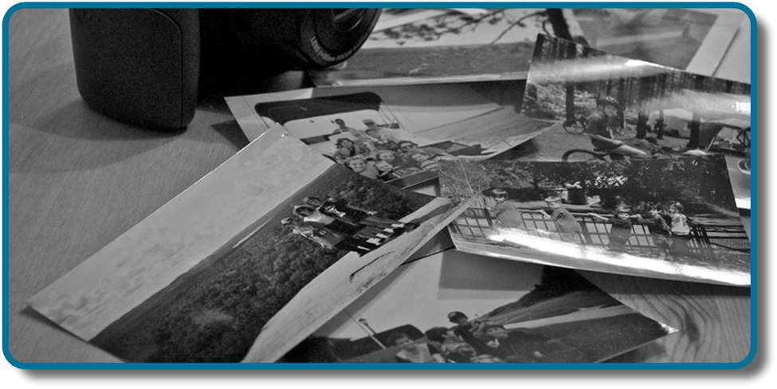

============
Introduction
============

.. contents::
   :depth: 3
..

class=“introduction”

class=“summary” title=“Summary”

class=“review-questions” title=“Review Questions”

class=“critical-thinking” title=“Critical Thinking Questions”

class=“personal-application” title=“Personal Application Questions”

class=“references” title=“References”

|A photograph shows a camera and a pile of photographs.|\ {:}

We may be top-notch learners, but if we don’t have a way to store what
we’ve learned, what good is the knowledge we’ve gained?

Take a few minutes to imagine what your day might be like if you could
not remember anything you had learned. You would have to figure out how
to get dressed. What clothing should you wear, and how do buttons and
zippers work? You would need someone to teach you how to brush your
teeth and tie your shoes. Who would you ask for help with these tasks,
since you wouldn’t recognize the faces of these people in your house?
Wait . . . is this even your house? Uh oh, your stomach begins to rumble
and you feel hungry. You’d like something to eat, but you don’t know
where the food is kept or even how to prepare it. Oh dear, this is
getting confusing. Maybe it would be best just go back to bed. A bed . .
. what is a bed?

We have an amazing capacity for memory, but how, exactly, do we process
and store information? Are there different kinds of memory, and if so,
what characterizes the different types? How, exactly, do we retrieve our
memories? And why do we forget? This chapter will explore these
questions as we learn about memory.

References
==========

Abel, M., & Bäuml, K.-H. T. (2013). Sleep can reduce proactive
interference. *Memory, 22*\ (4), 332–339.
doi:10.1080/09658211.2013.785570. Retrieved from
http://www.psychologie.uni-regensburg.de/Baeuml/papers\_in\_press/sleepPI.pdf

Anderson, N. S. (1969). The influence of acoustic similarity on serial
recall of letter sequences. *Quarterly Journal of Experimental
Psychology, 21*\ (3), 248–255.

Anderson, R. C. (1984). Role of the reader's schema in comprehension,
learning, and memory. In R. C. Anderson, J. Osborn, & R. J. Tierney
(Eds\ *.*), Learning to read in American schools: Basal Readers and
Content Texts (pp. 243–257). Hillsdale, NJ: Erlbaum.

Atkinson, R. C., & Shiffrin, R. M. (1968). Human memory: A proposed
system and its control processes. In K. W. Spence & J. T. Spence (Eds.),
The psychology of learning and motivation: Volume 2 (pp. 89–195). New
York, NY: Academic Press.

Baddeley, A. (2004). *Your memory: A user's guide*. Richmond Hill,
Canada: Firefly Books.

Baddeley, A. D., & Hitch, G. (1974). Working memory\ *.* In G. H. Bower
(Ed.), *The psychology of learning and motivation: Advances in research
and theory* (Vol. 8, pp. 47–89). New York, NY: Academic Press.

Bayley, P. J., & Squire, L. R. (2002). Medial temporal lobe amnesia:
Gradual acquisition of factual information by nondeclarative memory.
*Journal of Neuroscience, 22*, 5741–5748.

Bellezza, F. S. (1981). Mnemonic devices: Classification,
characteristics and criteria. *Review of Educational Research, 51*,
247–275.

Benjamin N. Cardozo School of Law, Yeshiva University. (2009).
Reevaluating lineups: Why witnesses make mistakes and how to reduce the
chance of a misidentification. Retrieved from The Innocence Project
website: http://www.innocenceproject.org/docs/Eyewitness\_ID\_Report.pdf

Blockland, A. (1996). Acetylcholine: A neurotransmitter for learning and
memory? *Brain Research Reviews, 21*, 285–300.

Bodie, G. D., Powers, W. G., & Fitch-Hauser, M. (2006). Chunking,
priming, and active learning: Toward an innovative approach to teaching
communication-related skills. *Interactive Learning Environment,*
*14*\ (2), 119–135.

Bousfield, W. (1935). The occurrence of clustering in the recall of
randomly arranged associates. *Journal of General Psychology, 49*,
229–240.

Bransford, J. D., & McCarrell, N. S. (1974). A sketch of a cognitive
approach to comprehension. In W. B. Weimer & D. J. Palermo (Eds.),
Cognition and the symbolic processes (pp. 189–229). Hillsdale, NJ:
Lawrence Erlbaum Associates.

Briere, J., & Conte, J. (1993). Self-reported amnesia for abuse in
adults molested as children. *Journal of Traumatic Stress, 6*, 21–31.

Carli, L. (1999). Cognitive reconstruction, hindsight, and reactions to
victims and perpetrators. *Personality and Social Psychology Bulletin,
25*\ (8), 966–979. doi:10.1177/01461672992511005

Ceci, S. J., & Bruck, M. (1993). Child witness: Translating research
into policy. *Social Policy Report, 7*\ (3), 1–30.

Ceci, S. J., & Bruck, M. (1995). Jeopardy in the courtroom: A scientific
analysis of children’s testimony. Washington, DC: American Psychological
Association.

Cheit, R. E. (2007). *The recovered memory project.* Retrieved from
http://blogs.brown.edu/recoveredmemory/.

Christianson, S. A. (1992). *The handbook of emotion and memory:
Research and theory*. Hillsdale, NJ: Erlbaum.

Clark, R. E., Zola, S. M., & Squire, L. R. (2000). Impaired recognition
memory in rats after damage to the hippocampus. *The Journal of
Neuroscience, 20*\ (23), 8853–8860.

Corkin, S. (1965). Tactually-guided maze learning in man: Effects of
unilateral cortical excisions and bilateral hippocampal lesions.
*Neuropsychologia, 3*, 339–351.

Corkin, S. (1968). Acquisition of motor skill after bilateral medial
temporal-lobe excision. *Neuropsychologia, 6*, 255–264.

Corkin, S., Amaral D. G., González, R. G., Johnson, K. A., & Hyman, B.
T. (1997). H. M.’s medial temporal lobe lesion: Findings from magnetic
resonance imaging. *Journal of Neuroscience, 17*\ (10), 3964–3979.

Craik, F. I. M., & Lockhart, R. S. (1972). Levels of processing: A
framework for memory research. *Journal of Verbal Learning and Verbal
Behavior, 11*, 671–684.

Craik, F. I. M., Moroz, T. M., Moscovitch, M., Stuss, D. T., Winocur,
G., Tulving, E., & Kapur, S. (1999). In search of the self: A positron
emission tomography study. *Psychological Science, 10*\ (1), 26–34.

Craik, F. I. M., & Tulving, E. (1975). Depth of processing and the
retention of words in episodic memory. *Journal of Experimental
Psychology, 104*\ (3), 268–294.

Craik, F. I. M., & Watkins, M. J. (1973). The role of rehearsal in
short-term memory. *Journal of Verbal Learning and Verbal Behavior, 12*,
599–607.

Green, J. T., & Woodruff-Pak, D. S. (2000). Eyeblink classical
conditioning in aging animals. In D. S. Woodruff-Pak & J. E. Steinmetz
(Eds.), *Eyeblink classical conditioning: Animal models* (Vol. 2,
pp.155–178). Boston, MA: Kluwer Academic.

Greenberg, D. L. (2004). President Bush's false [flashbulb] memory of
9/11/01. *Applied. Cognitive Psychology, 18*\ (3), 363–370.
doi:10.1002/acp.1016

Devilly, G. J. (2007). If nothing happened why do I still hurt? An
update on the memory wars. *InPsych, 29*\ (2), 16–18.

Ebbinghaus, H. (1964). *Memory: A contribution to experimental
psychology* (H. A. Ruger & C. E. Bussenius, Trans.). New York, NY:
Dover. (Original work published 1885)

Goodman, G. S. (2006). Children’s eyewitness memory: A modern history
and contemporary commentary. *Journal of Social Issues, 62*, 811–832.

Hassabis D., & Maguire E. A. (2007). Deconstructing episodic memory with
construction. *Trends in Cognitive Sciences*, *11*\ (7), 299–306.

Jacobs, J. (1887). Experiments on “prehension.” *Mind, 12*, 75–79.

Josselyn, J. A. (2010). Continuing the search for the engram: Examining
the mechanism of fear memories. *Journal of Psychiatry Neuroscience,
35*\ (4), 221–228.

Kapur, S., Craik, F. I. M., Tulving, E., Wilson, A. A., Houle, S., &
Brown, G. M. (1994). Neuroanatomical correlates of encoding in episodic
memory: Levels of processing effect. *Proceedings of the National
Academy of Sciences of the United States of America, 91*\ (6), 208–2011.

Lashley K. S. (1950). In search of the engram. *Society of Experimental
Biology Symposium, 4: Psychological Mechanisms in Animal Behavior*.
Cambridge, UK: Cambridge University Press.

Loftus, E. F., & Palmer, J. C. (1974). Reconstruction of auto-mobile
destruction: An example of the interaction between language and memory.
*Journal of Verbal Learning and Verbal Behavior, 13*, 585–589.

MacLeod, C. M., Gopie, N., Hourihan, K. L., Neary, K. R., & Ozubko, J.
D. (2010). The production effect: Delineation of a phenomenon. *Journal
of Experimental Psychology: Learning, Memory, and Cognition, 36*\ (3),
671–685.

Mayford, M., Siegelbaum, S. A., & Kandel, E. R. (2012). Synapses and
memory storage. New York, NY: Cold Spring Harbor Perspectives in
Biology, Cold Spring Harbor Laboratory Press.

McGaugh, J. L. (2003). *Memory and emotion: The making of lasting
memories*. New York, NY: Columbia University Press.

McLeod, S. A. (2011). Anterograde amnesia [Web log post]. Retrieved from
http://www.simplypsychology.org/anterograde-amnesia.html

Miller, G. A. (1956). The magical number seven, plus or minus two: Some
limits on our capacity for processing information. *Psychological
Review, 68*, 81–87.

Myhrer, T. (2003). Neurotransmitter systems involved in learning and
memory in the rat: A meta-analysis based on studies of four behavioral
tasks. *Brain Research Reviews, 41*\ (2–3), 268–287.

Newseum. (n.d.). G-men and journalists: D. C. sniper [Web log post].
Retrieved from
http://www.newseum.org/exhibits-and-theaters/temporary-exhibits/g-men-and-journalists/sniper/

Nickerson, R. S., & Adams, M. J. (1979). Long-term memory for a common
object. *Cognitive Psychology, 11*\ (3), 287–307.

Paivio, A. (1986). *Mental representations: A dual coding approach*. New
York, NY: Oxford University Press.

Parker, E. S., Cahill, L., & McGaugh, J. L. (2006). A case of unusual
autobiographical remembering. *Neurocase, 12*, 35–49.

Payne, B. K., Jacoby, L. L., & Lambert, A. J. (2004). Memory monitoring
and the control of stereotype distortion. *Journal of Experimental
Social Psychology, 40*, 52–64.

Pew Research Center (2011, September 1). Ten years after 9/11: United in
remembrance, divided over policies. Washington, DC: People Press.

Pipe, M.-E. (1996). Children’s eyewitness memory. New Zealand Journal of
Psychology, 25(2), 36–43.

Pipe, M.-E., Lamb, M., Orbach, Y., & Esplin, P. W. (2004). Recent
research on children’s testimony about experienced and witnessed events.
Developmental Review, 24, 440–468.

Roediger, H. L., & DeSoto, K. A. (in press). The psychology of
reconstructive memory. In J. Wright (Ed.), *International Encyclopedia
of the Social and Behavioral sciences,* 2e. Oxford, UK: Elsevier.

Roediger, H. L., III, & McDermott, K. B. (2000). Tricks of memory.
*Current Directions in Psychological Science, 9,* 123–127.

Rogers, T. B., Kuiper, N. A., & Kirker, W. S. (1977). Self-reference and
the encoding of personal information. *Journal of Personal Social
Psychology, 35*\ (9), 677–688.

Schacter, D. (2001). *The seven sins of memory: How the mind forgets and
remembers.* New York, NY: Houghton Mifflin.

Steinmetz, J. E. (1999). A renewed interest in human classical eyeblink
conditioning. *Psychological Science, 10*, 24–25.

Tigner, R. B. (1999). Putting memory research to good use. *College
Teaching*, *47*\ (4), 149–152.

Tulving, E. (1972). Episodic and semantic memory. In E. Tulving & W.
Dolandson (Eds.), *Organization of memory* (pp. 381–403). New York, NY:
Academic Press.

Tulving, E. (2002, February). Episodic memory: From mind to brain.
*Annual Review of* *Psychology, 53*, 1–25.
doi:10.1146/annurev.psych.53.100901.135114

van Praag, H. (2008). Neurogenesis and exercise: Past and future
directions. *NeuroMolecular Medicine, 10*\ (2), 128–140.

Wells, G. L., & Quinlivan, D. S. (2009). Suggestive eyewitness
identification procedures and the Supreme Court’s reliability test in
light of eyewitness science: 30 years later. *Law and Human Behavior,
33*, 1–24. doi:10.1007/s10979-008-9130-3

Wrubel, B. (Writer), & Spiller, M. (Director). (2010). The Old Wagon
[Television series episode]. In S. Levitan & C. Lloyd (Executive
producers), *Modern Family*. 20th Century Fox Television.

Yogo, M., & Fujihara, S. (2008). Working memory capacity can be improved
by expressive writing: A randomized experiment in a Japanese sample.
*British Journal of Health Psychology, 13*\ (1), 77–80.
doi:10.1348/135910707X252440

