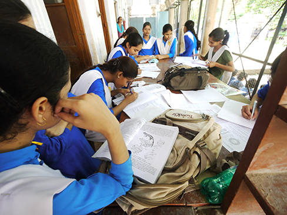

======================
Ways to Enhance Memory
======================

.. contents::
   :depth: 3
..

.. container::

   By the end of this section, you will be able to: \* Recognize and
   apply memory-enhancing strategies \* Recognize and apply effective
   study techniques

Most of us suffer from memory failures of one kind or another, and most
of us would like to improve our memories so that we don’t forget where
we put the car keys or, more importantly, the material we need to know
for an exam. In this section, we’ll look at some ways to help you
remember better, and at some strategies for more effective studying.

MEMORY-ENHANCING STRATEGIES
===========================

What are some everyday ways we can improve our memory, including recall?
To help make sure information goes from short-term memory to long-term
memory, you can use **memory-enhancing strategies**\ {:
data-type=“term”}. One strategy is **rehearsal**\ {: data-type=“term”
.no-emphasis}, or the conscious repetition of information to be
remembered (Craik & Watkins, 1973). Think about how you learned your
multiplication tables as a child. You may recall that 6 x 6 = 36, 6 x 7
= 42, and 6 x 8 = 48. Memorizing these facts is rehearsal.

Another strategy is **chunking**\ {: data-type=“term”}: you organize
information into manageable bits or chunks (Bodie, Powers, &
Fitch-Hauser, 2006). Chunking is useful when trying to remember
information like dates and phone numbers. Instead of trying to remember
5205550467, you remember the number as 520-555-0467. So, if you met an
interesting person at a party and you wanted to remember his phone
number, you would naturally chunk it, and you could repeat the number
over and over, which is the rehearsal strategy.

.. container:: psychology link-to-learning

   Try this `fun activity <http://openstax.org/l/memgame>`__ that
   employs a memory-enhancing strategy.

You could also enhance memory by using **elaborative rehearsal**\ {:
data-type=“term”}: a technique in which you think about the meaning of
the new information and its relation to knowledge already stored in your
memory (Tigner, 1999). For example, in this case, you could remember
that 520 is an area code for Arizona and the person you met is from
Arizona. This would help you better remember the 520 prefix. If the
information is retained, it goes into long-term memory.

**Mnemonic devices**\ {: data-type=“term”} are memory aids that help us
organize information for encoding (`[link] <#Figure_08_04_Knuckles>`__).
They are especially useful when we want to recall larger bits of
information such as steps, stages, phases, and parts of a system
(Bellezza, 1981). Brian needs to learn the order of the planets in the
solar system, but he’s having a hard time remembering the correct order.
His friend Kelly suggests a mnemonic device that can help him remember.
Kelly tells Brian to simply remember the name Mr. VEM J. SUN, and he can
easily recall the correct order of the planets: **M**\ ercury,
**V**\ enus, **E**\ arth, **M**\ ars, **J**\ upiter, **S**\ aturn,
**U**\ ranus, and **N**\ eptune. You might use a mnemonic device to help
you remember someone’s name, a mathematical formula, or the order of
mathematical operations.

|A photograph shows a person’s two hands clenched into fists so the
knuckles show. The knuckles are labeled with the months and the number
of days in each month, with the knuckle protrusions corresponding to the
months with 31 days, and the indentations between knuckles corresponding
to February and the months with 30 days.|\ {: #Figure_08_04_Knuckles}

If you have ever watched the television show *Modern Family*, you might
have seen Phil Dunphy explain how he remembers names:

The other day I met this guy named Carl. Now, I might forget that name,
but he was wearing a Grateful Dead t-shirt. What’s a band like the
Grateful Dead? Phish. Where do fish live? The ocean. What else lives in
the ocean? Coral. Hello, Co-arl. (Wrubel & Spiller, 2010)

It seems the more vivid or unusual the mnemonic, the easier it is to
remember. The key to using any mnemonic successfully is to find a
strategy that works for you.

.. container:: psychology link-to-learning

   Watch this fascinating `TED Talks
   lecture <http://openstax.org/l/foer>`__ titled “Feats of Memory
   Anyone Can Do.” The lecture is given by Joshua Foer, a science writer
   who “accidentally” won the U. S. Memory Championships. He explains a
   mnemonic device called the memory palace.

Some other strategies that are used to improve memory include expressive
writing and saying words aloud. Expressive writing helps boost your
short-term memory, particularly if you write about a traumatic
experience in your life. Masao Yogo and Shuji Fujihara (2008) had
participants write for 20-minute intervals several times per month. The
participants were instructed to write about a traumatic experience,
their best possible future selves, or a trivial topic. The researchers
found that this simple writing task increased short-term memory capacity
after five weeks, but only for the participants who wrote about
traumatic experiences. Psychologists can’t explain why this writing task
works, but it does.

What if you want to remember items you need to pick up at the store?
Simply say them out loud to yourself. A series of studies (MacLeod,
Gopie, Hourihan, Neary, & Ozubko, 2010) found that saying a word out
loud improves your memory for the word because it increases the word’s
distinctiveness. Feel silly, saying random grocery items aloud? This
technique works equally well if you just mouth the words. Using these
techniques increased participants’ memory for the words by more than
10%. These techniques can also be used to help you study.

HOW TO STUDY EFFECTIVELY
========================

Based on the information presented in this chapter, here are some
strategies and suggestions to help you hone your study techniques
(`[link] <#Figure_08_04_Study>`__). The key with any of these strategies
is to figure out what works best for you.

|A photograph shows students studying.|\ {: #Figure_08_04_Study}

-  **Use elaborative rehearsal**: In a famous article, Craik and
   Lockhart (1972) discussed their belief that information we process
   more deeply goes into long-term memory. Their theory is called
   **levels of processing**\ {: data-type=“term”}. If we want to
   remember a piece of information, we should think about it more deeply
   and link it to other information and memories to make it more
   meaningful. For example, if we are trying to remember that the
   hippocampus is involved with memory processing, we might envision a
   hippopotamus with excellent memory and then we could better remember
   the hippocampus.
-  **Apply the self-reference effect**: As you go through the process of
   elaborative rehearsal, it would be even more beneficial to make the
   material you are trying to memorize personally meaningful to you. In
   other words, make use of the self-reference effect. Write notes in
   your own words. Write definitions from the text, and then rewrite
   them in your own words. Relate the material to something you have
   already learned for another class, or think how you can apply the
   concepts to your own life. When you do this, you are building a web
   of retrieval cues that will help you access the material when you
   want to remember it.
-  **Don’t forget the forgetting curve**: As you know, the information
   you learn drops off rapidly with time. Even if you think you know the
   material, study it again right before test time to increase the
   likelihood the information will remain in your memory. Overlearning
   can help prevent storage decay.
-  **Rehearse, rehearse, rehearse**: Review the material over time, in
   spaced and organized study sessions. Organize and study your notes,
   and take practice quizzes/exams. Link the new information to other
   information you already know well.
-  **Be aware of interference**: To reduce the likelihood of
   interference, study during a quiet time without interruptions or
   distractions (like television or music).
-  **Keep moving**: Of course you already know that exercise is good for
   your body, but did you also know it’s also good for your mind?
   Research suggests that regular aerobic exercise (anything that gets
   your heart rate elevated) is beneficial for memory (van Praag, 2008).
   Aerobic exercise promotes neurogenesis: the growth of new brain cells
   in the hippocampus, an area of the brain known to play a role in
   memory and learning.
-  **Get enough sleep**: While you are sleeping, your brain is still at
   work. During sleep the brain organizes and consolidates information
   to be stored in long-term memory (Abel & Bäuml, 2013).
-  **Make use of mnemonic devices**: As you learned earlier in this
   chapter, mnemonic devices often help us to remember and recall
   information. There are different types of mnemonic devices, such as
   the acronym. An acronym is a word formed by the first letter of each
   of the words you want to remember. For example, even if you live near
   one, you might have difficulty recalling the names of all five Great
   Lakes. What if I told you to think of the word Homes? HOMES is an
   acronym that represents Huron, Ontario, Michigan, Erie, and Superior:
   the five Great Lakes. Another type of mnemonic device is an acrostic:
   you make a phrase of all the first letters of the words. For example,
   if you are taking a math test and you are having difficulty
   remembering *the order of operations*, recalling the following
   sentence will help you: “Please Excuse My Dear Aunt Sally,” because
   the order of mathematical operations is Parentheses, Exponents,
   Multiplication, Division, Addition, Subtraction. There also are
   jingles, which are rhyming tunes that contain key words related to
   the concept, such as *i before e, except after c*.

Summary
=======

There are many ways to combat the inevitable failures of our memory
system. Some common strategies that can be used in everyday situations
include mnemonic devices, rehearsal, self-referencing, and adequate
sleep. These same strategies also can help you to study more
effectively.

Review Questions
================

.. container::

   .. container::

      When you are learning how to play the piano, the statement “Every
      good boy does fine” can help you remember the notes E, G, B, D,
      and F for the lines of the treble clef. This is an example of a
      (an) \________.

      1. jingle
      2. acronym
      3. acrostic
      4. acoustic {: type=“a”}

   .. container::

      C

.. container::

   .. container::

      According to a study by Yogo and Fujihara (2008), if you want to
      improve your short-term memory, you should spend time writing
      about \________.

      1. your best possible future self
      2. a traumatic life experience
      3. a trivial topic
      4. your grocery list {: type=“a”}

   .. container::

      B

.. container::

   .. container::

      The self-referencing effect refers to \________.

      1. making the material you are trying to memorize personally
         meaningful to you
      2. making a phrase of all the first letters of the words you are
         trying to memorize
      3. making a word formed by the first letter of each of the words
         you are trying to memorize
      4. saying words you want to remember out loud to yourself {:
         type=“a”}

   .. container::

      A

.. container::

   .. container::

      Memory aids that help organize information for encoding are
      \________.

      1. mnemonic devices
      2. memory-enhancing strategies
      3. elaborative rehearsal
      4. effortful processing {: type=“a”}

   .. container::

      A

Critical Thinking Questions
===========================

.. container::

   .. container::

      What is the self-reference effect, and how can it help you study
      more effectively?

   .. container::

      The self-reference effect is the tendency an individual to have
      better memory for information that relates to oneself than
      information that is not personally relevant. You can use the
      self-reference effect to relate the material to something you have
      already learned for another class, or think how you can apply the
      concepts to your life. When you do this, you are building a web of
      retrieval cues that will help you access the material when you
      want to remember it.

.. container::

   .. container::

      You and your roommate spent all of last night studying for your
      psychology test. You think you know the material; however, you
      suggest that you study again the next morning an hour prior to the
      test. Your roommate asks you to explain why you think this is a
      good idea. What do you tell her?

   .. container::

      You remind her about Ebbinghaus’s forgetting curve: the
      information you learn drops off rapidly with time. Even if you
      think you know the material, you should study it again right
      before test time to increase the likelihood the information will
      remain in your memory. Overlearning can help prevent storage
      decay.

Personal Application Questions
==============================

.. container::

   .. container::

      Create a mnemonic device to help you remember a term or concept
      from this chapter.

.. container::

   .. container::

      What is an effective study technique that you have used? How is it
      similar to/different from the strategies suggested in this
      chapter?

.. container::

   .. rubric:: Glossary
      :name: glossary

   {: data-type=“glossary-title”}

   chunking
      organizing information into manageable bits or chunks ^
   elaborative rehearsal
      thinking about the meaning of the new information and its relation
      to knowledge already stored in your memory ^
   levels of processing
      information that is thought of more deeply becomes more meaningful
      and thus better committed to memory ^
   memory-enhancing strategy
      technique to help make sure information goes from short-term
      memory to long-term memory ^
   mnemonic device
      memory aids that help organize information for encoding

.. |A photograph shows a person’s two hands clenched into fists so the knuckles show. The knuckles are labeled with the months and the number of days in each month, with the knuckle protrusions corresponding to the months with 31 days, and the indentations between knuckles corresponding to February and the months with 30 days.| image:: ../resources/CNX_Psych_08_04_Knuckles.jpg

