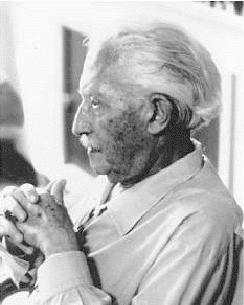
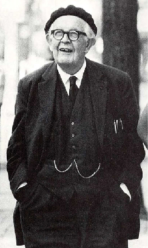

=================
Lifespan Theories
=================

.. contents::
   :depth: 3
..

.. container::

   By the end of this section, you will be able to: \* Discuss Freud’s
   theory of psychosexual development \* Describe the major tasks of
   child and adult psychosocial development according to Erikson \*
   Discuss Piaget’s view of cognitive development and apply the stages
   to understanding childhood cognition \* Describe Kohlberg’s theory of
   moral development

There are many theories regarding how babies and children grow and
develop into happy, healthy adults. We explore several of these theories
in this section.

PSYCHOSEXUAL THEORY OF DEVELOPMENT
==================================

Sigmund **Freud**\ {: data-type=“term” .no-emphasis} (1856–1939)
believed that personality develops during early childhood. For Freud,
childhood experiences shape our personalities and behavior as adults.
Freud viewed development as discontinuous; he believed that each of us
must pass through a series of stages during childhood, and that if we
lack proper nurturance and parenting during a stage, we may become
stuck, or fixated, in that stage. Freud’s stages are called the stages
of **psychosexual development**\ {: data-type=“term”}. According to
Freud, children’s pleasure-seeking urges are focused on a different area
of the body, called an erogenous zone, at each of the five stages of
development: oral, anal, phallic, latency, and genital.

While most of Freud’s ideas have not found support in modern research,
we cannot discount the contributions that Freud has made to the field of
psychology. Psychologists today dispute Freud's psychosexual stages as a
legitimate explanation for how one's personality develops, but what we
can take away from Freud’s theory is that personality is shaped, in some
part, by experiences we have in childhood. These stages are discussed in
detail in the chapter on personality.

PSYCHOSOCIAL THEORY OF DEVELOPMENT
==================================

Erik **Erikson**\ {: data-type=“term” .no-emphasis} (1902–1994)
(`[link] <#Figure_09_03_Erikson>`__), another stage theorist, took
Freud’s theory and modified it as psychosocial theory. Erikson’s
psychosocial development theory emphasizes the social nature of our
development rather than its sexual nature. While Freud believed that
personality is shaped only in childhood, Erikson proposed that
personality development takes place all through the lifespan. Erikson
suggested that how we interact with others is what affects our sense of
self, or what he called the ego identity.

|A photograph depicts Erik Erikson in his later years.|\ {:
#Figure_09_03_Erikson}

Erikson proposed that we are motivated by a need to achieve competence
in certain areas of our lives. According to psychosocial theory, we
experience eight stages of development over our lifespan, from infancy
through late adulthood. At each stage there is a conflict, or task, that
we need to resolve. Successful completion of each developmental task
results in a sense of competence and a healthy personality. Failure to
master these tasks leads to feelings of inadequacy.

According to Erikson (1963), trust is the basis of our development
during infancy (birth to 12 months). Therefore, the primary task of this
stage is trust versus mistrust. Infants are dependent upon their
caregivers, so caregivers who are responsive and sensitive to their
infant’s needs help their baby to develop a sense of trust; their baby
will see the world as a safe, predictable place. Unresponsive caregivers
who do not meet their baby’s needs can engender feelings of anxiety,
fear, and mistrust; their baby may see the world as unpredictable.

As toddlers (ages 1–3 years) begin to explore their world, they learn
that they can control their actions and act on the environment to get
results. They begin to show clear preferences for certain elements of
the environment, such as food, toys, and clothing. A toddler’s main task
is to resolve the issue of autonomy versus shame and doubt, by working
to establish independence. This is the “me do it” stage. For example, we
might observe a budding sense of autonomy in a 2-year-old child who
wants to choose her clothes and dress herself. Although her outfits
might not be appropriate for the situation, her input in such basic
decisions has an effect on her sense of independence. If denied the
opportunity to act on her environment, she may begin to doubt her
abilities, which could lead to low self-esteem and feelings of shame.

Once children reach the preschool stage (ages 3–6 years), they are
capable of initiating activities and asserting control over their world
through social interactions and play. According to Erikson, preschool
children must resolve the task of initiative versus guilt. By learning
to plan and achieve goals while interacting with others, preschool
children can master this task. Those who do will develop self-confidence
and feel a sense of purpose. Those who are unsuccessful at this
stage—with their initiative misfiring or stifled—may develop feelings of
guilt. How might over-controlling parents stifle a child’s initiative?

During the elementary school stage (ages 6–12), children face the task
of industry versus inferiority. Children begin to compare themselves to
their peers to see how they measure up. They either develop a sense of
pride and accomplishment in their schoolwork, sports, social activities,
and family life, or they feel inferior and inadequate when they don’t
measure up. What are some things parents and teachers can do to help
children develop a sense of competence and a belief in themselves and
their abilities?

In adolescence (ages 12–18), children face the task of identity versus
role confusion. According to Erikson, an adolescent’s main task is
developing a sense of self. Adolescents struggle with questions such as
“Who am I?” and “What do I want to do with my life?” Along the way, most
adolescents try on many different selves to see which ones fit.
Adolescents who are successful at this stage have a strong sense of
identity and are able to remain true to their beliefs and values in the
face of problems and other people’s perspectives. What happens to
apathetic adolescents, who do not make a conscious search for identity,
or those who are pressured to conform to their parents’ ideas for the
future? These teens will have a weak sense of self and experience role
confusion. They are unsure of their identity and confused about the
future.

People in early adulthood (i.e., 20s through early 40s) are concerned
with intimacy versus isolation. After we have developed a sense of self
in adolescence, we are ready to share our life with others. Erikson said
that we must have a strong sense of self before developing intimate
relationships with others. Adults who do not develop a positive
self-concept in adolescence may experience feelings of loneliness and
emotional isolation.

When people reach their 40s, they enter the time known as middle
adulthood, which extends to the mid-60s. The social task of middle
adulthood is generativity versus stagnation. Generativity involves
finding your life’s work and contributing to the development of others,
through activities such as volunteering, mentoring, and raising
children. Those who do not master this task may experience stagnation,
having little connection with others and little interest in productivity
and self-improvement.

From the mid-60s to the end of life, we are in the period of development
known as late adulthood. Erikson’s task at this stage is called
integrity versus despair. He said that people in late adulthood reflect
on their lives and feel either a sense of satisfaction or a sense of
failure. People who feel proud of their accomplishments feel a sense of
integrity, and they can look back on their lives with few regrets.
However, people who are not successful at this stage may feel as if
their life has been wasted. They focus on what “would have,” “should
have,” and “could have” been. They face the end of their lives with
feelings of bitterness, depression, and despair.
`[link] <#Table_09_02_01>`__ summarizes the stages of Erikson’s theory.

.. raw:: html

   <table id="Table_09_02_01" summary="A table outlines Erikson’s Psychosocial Stages of Development. It contains four columns which are labeled “Stage; Age (years); Developmental Task; and Description.” Each of the following eight rows corresponds to Erikson’s eight psychosocial stages of development. From left to right, the first row reads: “1; 0–1; trust vs. mistrust; and trust (or mistrust) that basic needs, such as nourishment and affection, will be met.” The second row reads: “2; 1–3; autonomy vs. shame/doubt; and sense of independence in many tasks develops.” The third row reads: “3; 3–6; initiative vs. guilt; and take initiative on some activities, may develop guilt when success not met or boundaries overstepped.” The fourth row reads: “4; 7–11; industry vs. inferiority; and develop self-confidence in abilities when competent or sense of inferiority when not.” The fifth row reads: “5; 12–18; identity vs. confusion; and experiment with and develop identity and roles.” The sixth row reads: “6; 19–29; intimacy vs. isolation; and establish intimacy and relationships with others.” The seventh row reads: “7; 30–64; generativity vs. stagnation; and contribute to society and be part of a family.” The eighth row reads: “8; 65–; integrity vs. despair; and assess and make sense of life and meaning of contributions.”">

.. raw:: html

   <caption>

Erikson’s Psychosocial Stages of Development

.. raw:: html

   </caption>

.. raw:: html

   <colgroup>

.. raw:: html

   <col data-align="center" />

.. raw:: html

   <col data-align="center" />

.. raw:: html

   <col />

.. raw:: html

   <col />

.. raw:: html

   </colgroup>

.. raw:: html

   <thead>

.. raw:: html

   <tr>

.. raw:: html

   <th>

Stage

.. raw:: html

   </th>

.. raw:: html

   <th>

Age (years)

.. raw:: html

   </th>

.. raw:: html

   <th>

Developmental Task

.. raw:: html

   </th>

.. raw:: html

   <th>

Description

.. raw:: html

   </th>

.. raw:: html

   </tr>

.. raw:: html

   </thead>

.. raw:: html

   <tbody>

.. raw:: html

   <tr>

.. raw:: html

   <td>

1

.. raw:: html

   </td>

.. raw:: html

   <td>

0–1

.. raw:: html

   </td>

.. raw:: html

   <td>

Trust vs. mistrust

.. raw:: html

   </td>

.. raw:: html

   <td>

Trust (or mistrust) that basic needs, such as nourishment and affection,
will be met

.. raw:: html

   </td>

.. raw:: html

   </tr>

.. raw:: html

   <tr>

.. raw:: html

   <td>

2

.. raw:: html

   </td>

.. raw:: html

   <td>

1–3

.. raw:: html

   </td>

.. raw:: html

   <td>

Autonomy vs. shame/doubt

.. raw:: html

   </td>

.. raw:: html

   <td>

Develop a sense of independence in many tasks

.. raw:: html

   </td>

.. raw:: html

   </tr>

.. raw:: html

   <tr>

.. raw:: html

   <td>

3

.. raw:: html

   </td>

.. raw:: html

   <td>

3–6

.. raw:: html

   </td>

.. raw:: html

   <td>

Initiative vs. guilt

.. raw:: html

   </td>

.. raw:: html

   <td>

Take initiative on some activities—may develop guilt when unsuccessful
or boundaries overstepped

.. raw:: html

   </td>

.. raw:: html

   </tr>

.. raw:: html

   <tr>

.. raw:: html

   <td>

4

.. raw:: html

   </td>

.. raw:: html

   <td>

7–11

.. raw:: html

   </td>

.. raw:: html

   <td>

Industry vs. inferiority

.. raw:: html

   </td>

.. raw:: html

   <td>

Develop self-confidence in abilities when competent or sense of
inferiority when not

.. raw:: html

   </td>

.. raw:: html

   </tr>

.. raw:: html

   <tr>

.. raw:: html

   <td>

5

.. raw:: html

   </td>

.. raw:: html

   <td>

12–18

.. raw:: html

   </td>

.. raw:: html

   <td>

Identity vs. confusion

.. raw:: html

   </td>

.. raw:: html

   <td>

Experiment with and develop identity and roles

.. raw:: html

   </td>

.. raw:: html

   </tr>

.. raw:: html

   <tr>

.. raw:: html

   <td>

6

.. raw:: html

   </td>

.. raw:: html

   <td>

19–29

.. raw:: html

   </td>

.. raw:: html

   <td>

Intimacy vs. isolation

.. raw:: html

   </td>

.. raw:: html

   <td>

Establish intimacy and relationships with others

.. raw:: html

   </td>

.. raw:: html

   </tr>

.. raw:: html

   <tr>

.. raw:: html

   <td>

7

.. raw:: html

   </td>

.. raw:: html

   <td>

30–64

.. raw:: html

   </td>

.. raw:: html

   <td>

Generativity vs. stagnation

.. raw:: html

   </td>

.. raw:: html

   <td>

Contribute to society and be part of a family

.. raw:: html

   </td>

.. raw:: html

   </tr>

.. raw:: html

   <tr>

.. raw:: html

   <td>

8

.. raw:: html

   </td>

.. raw:: html

   <td>

65–

.. raw:: html

   </td>

.. raw:: html

   <td>

Integrity vs. despair

.. raw:: html

   </td>

.. raw:: html

   <td>

Assess and make sense of life and meaning of contributions

.. raw:: html

   </td>

.. raw:: html

   </tr>

.. raw:: html

   </tbody>

.. raw:: html

   </table>

COGNITIVE THEORY OF DEVELOPMENT
===============================

Jean **Piaget**\ {: data-type=“term” .no-emphasis} (1896–1980) is
another stage theorist who studied childhood development
(`[link] <#Figure_09_03_Piaget>`__). Instead of approaching development
from a psychoanalytical or psychosocial perspective, Piaget focused on
children’s cognitive growth. He believed that thinking is a central
aspect of development and that children are naturally inquisitive.
However, he said that children do not think and reason like adults
(Piaget, 1930, 1932). His theory of cognitive development holds that our
cognitive abilities develop through specific stages, which exemplifies
the discontinuity approach to development. As we progress to a new
stage, there is a distinct shift in how we think and reason.

|A photograph depicts Jean Piaget in his later years.|\ {:
#Figure_09_03_Piaget}

Piaget said that children develop schemata to help them understand the
world. **Schemata**\ {: data-type=“term”} are concepts (mental models)
that are used to help us categorize and interpret information. By the
time children have reached adulthood, they have created schemata for
almost everything. When children learn new information, they adjust
their schemata through two processes: assimilation and accommodation.
First, they assimilate new information or experiences in terms of their
current schemata: **assimilation**\ {: data-type=“term”} is when they
take in information that is comparable to what they already know.
**Accommodation**\ {: data-type=“term”} describes when they change their
schemata based on new information. This process continues as children
interact with their environment.

For example, 2-year-old Blake learned the schema for dogs because his
family has a Labrador retriever. When Blake sees other dogs in his
picture books, he says, “Look mommy, dog!” Thus, he has assimilated them
into his schema for dogs. One day, Blake sees a sheep for the first time
and says, “Look mommy, dog!” Having a basic schema that a dog is an
animal with four legs and fur, Blake thinks all furry, four-legged
creatures are dogs. When Blake’s mom tells him that the animal he sees
is a sheep, not a dog, Blake must accommodate his schema for dogs to
include more information based on his new experiences. Blake’s schema
for dog was too broad, since not all furry, four-legged creatures are
dogs. He now modifies his schema for dogs and forms a new one for sheep.

Like Freud and Erikson, Piaget thought development unfolds in a series
of stages approximately associated with age ranges. He proposed a theory
of cognitive development that unfolds in four stages: sensorimotor,
preoperational, concrete operational, and formal operational
(`[link] <#Table_09_02_02>`__).

.. raw:: html

   <table id="Table_09_02_02" summary="A four columned table outlines Piaget&#39;s stages of cognitive development. From left to right, the rows are labeled “Age (years); Stage; Description; and Developmental issues.” The first row contains “0-2; sensorimotor; world experienced through senses and actions; and object permanence, stranger anxiety.” The second row contains “2-6; preoperational; use words and images to represent things, but lack logical reasoning; and pretend play, egocentrism, language development.” The third row contains “7-11; concrete operational; understand concrete events and analogies logically, perform arithmetical operations; and conservation, mathematical transformations” The fourth row contains “12-; formal operational; formal operations, utilize abstract reasoning; and abstract logic, moral reasoning.”">

.. raw:: html

   <caption>

Piaget’s Stages of Cognitive Development

.. raw:: html

   </caption>

.. raw:: html

   <thead>

.. raw:: html

   <tr>

.. raw:: html

   <th>

Age (years)

.. raw:: html

   </th>

.. raw:: html

   <th>

Stage

.. raw:: html

   </th>

.. raw:: html

   <th>

Description

.. raw:: html

   </th>

.. raw:: html

   <th>

Developmental issues

.. raw:: html

   </th>

.. raw:: html

   </tr>

.. raw:: html

   </thead>

.. raw:: html

   <tbody>

.. raw:: html

   <tr>

.. raw:: html

   <td>

0–2

.. raw:: html

   </td>

.. raw:: html

   <td>

Sensorimotor

.. raw:: html

   </td>

.. raw:: html

   <td>

World experienced through senses and actions

.. raw:: html

   </td>

.. raw:: html

   <td>

Object permanence

.. raw:: html

   

Stranger anxiety

.. raw:: html

   </td>

.. raw:: html

   </tr>

.. raw:: html

   <tr>

.. raw:: html

   <td>

2–6

.. raw:: html

   </td>

.. raw:: html

   <td>

Preoperational

.. raw:: html

   </td>

.. raw:: html

   <td>

Use words and images to represent things, but lack logical reasoning

.. raw:: html

   </td>

.. raw:: html

   <td>

Pretend play

.. raw:: html

   

Egocentrism

.. raw:: html

   

Language development

.. raw:: html

   </td>

.. raw:: html

   </tr>

.. raw:: html

   <tr>

.. raw:: html

   <td>

7–11

.. raw:: html

   </td>

.. raw:: html

   <td>

Concrete operational

.. raw:: html

   </td>

.. raw:: html

   <td>

Understand concrete events and analogies logically; perform arithmetical
operations

.. raw:: html

   </td>

.. raw:: html

   <td>

Conservation

.. raw:: html

   

Mathematical transformations

.. raw:: html

   </td>

.. raw:: html

   </tr>

.. raw:: html

   <tr>

.. raw:: html

   <td>

12–

.. raw:: html

   </td>

.. raw:: html

   <td>

Formal operational

.. raw:: html

   </td>

.. raw:: html

   <td>

Formal operations

.. raw:: html

   

Utilize abstract reasoning

.. raw:: html

   </td>

.. raw:: html

   <td>

Abstract logic

.. raw:: html

   

Moral reasoning

.. raw:: html

   </td>

.. raw:: html

   </tr>

.. raw:: html

   </tbody>

.. raw:: html

   </table>

The first stage is the **sensorimotor**\ {: data-type=“term”} stage,
which lasts from birth to about 2 years old. During this stage, children
learn about the world through their senses and motor behavior. Young
children put objects in their mouths to see if the items are edible, and
once they can grasp objects, they may shake or bang them to see if they
make sounds. Between 5 and 8 months old, the child develops **object
permanence**\ {: data-type=“term”}, which is the understanding that even
if something is out of sight, it still exists (Bogartz, Shinskey, &
Schilling, 2000). According to Piaget, young infants do not remember an
object after it has been removed from sight. Piaget studied infants’
reactions when a toy was first shown to an infant and then hidden under
a blanket. Infants who had already developed object permanence would
reach for the hidden toy, indicating that they knew it still existed,
whereas infants who had not developed object permanence would appear
confused.

.. container:: psychology link-to-learning

   Please take a few minutes to view this `brief
   video <http://openstax.org/l/piaget>`__ demonstrating different
   children’s ability to understand object permanence.

In Piaget’s view, around the same time children develop object
permanence, they also begin to exhibit stranger anxiety, which is a fear
of unfamiliar people. Babies may demonstrate this by crying and turning
away from a stranger, by clinging to a caregiver, or by attempting to
reach their arms toward familiar faces such as parents. Stranger anxiety
results when a child is unable to assimilate the stranger into an
existing schema; therefore, she can’t predict what her experience with
that stranger will be like, which results in a fear response.

Piaget’s second stage is the **preoperational stage**\ {:
data-type=“term”}, which is from approximately 2 to 7 years old. In this
stage, children can use symbols to represent words, images, and ideas,
which is why children in this stage engage in pretend play. A child’s
arms might become airplane wings as he zooms around the room, or a child
with a stick might become a brave knight with a sword. Children also
begin to use language in the preoperational stage, but they cannot
understand adult logic or mentally manipulate information (the term
*operational* refers to logical manipulation of information, so children
at this stage are considered to be *pre*-operational). Children’s logic
is based on their own personal knowledge of the world so far, rather
than on conventional knowledge. For example, dad gave a slice of pizza
to 10-year-old Keiko and another slice to her 3-year-old brother, Kenny.
Kenny’s pizza slice was cut into five pieces, so Kenny told his sister
that he got more pizza than she did. Children in this stage cannot
perform mental operations because they have not developed an
understanding of **conservation**\ {: data-type=“term”}, which is the
idea that even if you change the appearance of something, it is still
equal in size as long as nothing has been removed or added.

.. container:: psychology link-to-learning

   This `video <http://openstax.org/l/piaget2>`__ shows a 4.5-year-old
   boy in the preoperational stage as he responds to Piaget’s
   conservation tasks.

During this stage, we also expect children to display
**egocentrism**\ {: data-type=“term”}, which means that the child is not
able to take the perspective of others. A child at this stage thinks
that everyone sees, thinks, and feels just as they do. Let’s look at
Kenny and Keiko again. Keiko’s birthday is coming up, so their mom takes
Kenny to the toy store to choose a present for his sister. He selects an
Iron Man action figure for her, thinking that if he likes the toy, his
sister will too. An egocentric child is not able to infer the
perspective of other people and instead attributes his own perspective.

.. container:: psychology link-to-learning

   Piaget developed the Three-Mountain Task to determine the level of
   egocentrism displayed by children. Children view a 3-dimensional
   mountain scene from one viewpoint, and are asked what another person
   at a different viewpoint would see in the same scene. Watch the
   Three-Mountain Task in action in this `short
   video <http://openstax.org/l/WonderYears>`__ from the University of
   Minnesota and the Science Museum of Minnesota.

Piaget’s third stage is the **concrete operational stage**\ {:
data-type=“term”}, which occurs from about 7 to 11 years old. In this
stage, children can think logically about real (concrete) events; they
have a firm grasp on the use of numbers and start to employ memory
strategies. They can perform mathematical operations and understand
transformations, such as addition is the opposite of subtraction, and
multiplication is the opposite of division. In this stage, children also
master the concept of conservation: Even if something changes shape, its
mass, volume, and number stay the same. For example, if you pour water
from a tall, thin glass to a short, fat glass, you still have the same
amount of water. Remember Keiko and Kenny and the pizza? How did Keiko
know that Kenny was wrong when he said that he had more pizza?

Children in the concrete operational stage also understand the principle
of **reversibility**\ {: data-type=“term”}, which means that objects can
be changed and then returned back to their original form or condition.
Take, for example, water that you poured into the short, fat glass: You
can pour water from the fat glass back to the thin glass and still have
the same amount (minus a couple of drops).

The fourth, and last, stage in Piaget’s theory is the **formal
operational stage**\ {: data-type=“term”}, which is from about age 11 to
adulthood. Whereas children in the concrete operational stage are able
to think logically only about concrete events, children in the formal
operational stage can also deal with abstract ideas and hypothetical
situations. Children in this stage can use abstract thinking to problem
solve, look at alternative solutions, and test these solutions. In
adolescence, a renewed egocentrism occurs. For example, a 15-year-old
with a very small pimple on her face might think it is huge and
incredibly visible, under the mistaken impression that others must share
her perceptions.

Beyond Formal Operational Thought
---------------------------------

As with other major contributors of theories of development, several of
Piaget’s ideas have come under criticism based on the results of further
research. For example, several contemporary studies support a model of
development that is more continuous than Piaget’s discrete stages
(Courage & Howe, 2002; Siegler, 2005, 2006). Many others suggest that
children reach cognitive milestones earlier than Piaget describes
(Baillargeon, 2004; de Hevia & Spelke, 2010).

According to Piaget, the highest level of cognitive development is
formal operational thought, which develops between 11 and 20 years old.
However, many developmental psychologists disagree with Piaget,
suggesting a fifth stage of cognitive development, known as the
postformal stage (Basseches, 1984; Commons & Bresette, 2006; Sinnott,
1998). In postformal thinking, decisions are made based on situations
and circumstances, and logic is integrated with emotion as adults
develop principles that depend on contexts. One way that we can see the
difference between an adult in postformal thought and an adolescent in
formal operations is in terms of how they handle emotionally charged
issues.

It seems that once we reach adulthood our problem solving abilities
change: As we attempt to solve problems, we tend to think more deeply
about many areas of our lives, such as relationships, work, and politics
(Labouvie-Vief & Diehl, 1999). Because of this, postformal thinkers are
able to draw on past experiences to help them solve new problems.
Problem-solving strategies using postformal thought vary, depending on
the situation. What does this mean? Adults can recognize, for example,
that what seems to be an ideal solution to a problem at work involving a
disagreement with a colleague may not be the best solution to a
disagreement with a significant other.

THEORY OF MORAL DEVELOPMENT
===========================

A major task beginning in childhood and continuing into adolescence is
discerning right from wrong. Psychologist Lawrence **Kohlberg**\ {:
data-type=“term” .no-emphasis} (1927–1987) extended upon the foundation
that Piaget built regarding cognitive development. Kohlberg believed
that moral development, like cognitive development, follows a series of
stages. To develop this theory, Kohlberg posed moral dilemmas to people
of all ages, and then he analyzed their answers to find evidence of
their particular stage of moral development. Before reading about the
stages, take a minute to consider how you would answer one of Kohlberg's
best-known moral dilemmas, commonly known as the Heinz dilemma:

   In Europe, a woman was near death from a special kind of cancer.
   There was one drug that the doctors thought might save her. It was a
   form of radium that a druggist in the same town had recently
   discovered. The drug was expensive to make, but the druggist was
   charging ten times what the drug cost him to make. He paid $200 for
   the radium and charged $2,000 for a small dose of the drug. The sick
   woman's husband, Heinz, went to everyone he knew to borrow the money,
   but he could only get together about $1,000, which is half of what it
   cost. He told the druggist that his wife was dying and asked him to
   sell it cheaper or let him pay later. But the druggist said: “No, I
   discovered the drug and I'm going to make money from it.” So Heinz
   got desperate and broke into the man's store to steal the drug for
   his wife. Should the husband have done that? (Kohlberg, 1969, p. 379)

How would you answer this dilemma? Kohlberg was not interested in
whether you answer yes or no to the dilemma: Instead, he was interested
in the reasoning behind your answer.

After presenting people with this and various other moral dilemmas,
Kohlberg reviewed people’s responses and placed them in different
**stages of moral reasoning**\ {: data-type=“term”}
(`[link] <#Figure_09_03_KohlStage>`__). According to Kohlberg, an
individual progresses from the capacity for pre-conventional morality
(before age 9) to the capacity for conventional morality (early
adolescence), and toward attaining post-conventional morality (once
formal operational thought is attained), which only a few fully achieve.
Kohlberg placed in the highest stage responses that reflected the
reasoning that Heinz should steal the drug because his wife’s life is
more important than the pharmacist making money. The value of a human
life overrides the pharmacist’s greed.

|Nine boxes are arranged in rows and columns of three. The top left box
contains “Level 1, Pre-conventional Morality.” A line connects this box
with another box to the right containing “Stage 1, Obedience and
punishment: behavior driven by avoiding punishment.” To the right is
another box connected by a line containing “Stage 2, Individual
interest: behavior driven by self-interest and rewards.” The middle left
box contains “Level 2, Conventional Morality.” A line connects this box
with another box to the right containing “Stage 3, Interpersonal:
behavior driven by social approval.” To the right is another box
connected by a line containing “Stage 4, Authority: behavior driven by
obeying authority and conforming to social order.” The lower left box
contains “Level 3, Post-conventional Morality.” A line connects this box
with another box to the right containing “Stage 5, Social contract:
behavior driven by balance of social order and individual rights.” To
the right is another box connected by a line containing “Stage 6,
Universal ethics: behavior driven by internal moral principles.”|\ {:
#Figure_09_03_KohlStage}

It is important to realize that even those people who have the most
sophisticated, post-conventional reasons for some choices may make other
choices for the simplest of pre-conventional reasons. Many psychologists
agree with Kohlberg's theory of moral development but point out that
moral reasoning is very different from moral behavior. Sometimes what we
say we would do in a situation is not what we actually do in that
situation. In other words, we might “talk the talk,” but not “walk the
walk.”

How does this theory apply to males and females? Kohlberg (1969) felt
that more males than females move past stage four in their moral
development. He went on to note that women seem to be deficient in their
moral reasoning abilities. These ideas were not well received by Carol
Gilligan, a research assistant of Kohlberg, who consequently developed
her own ideas of moral development. In her groundbreaking book, *In a
Different Voice: Psychological Theory and Women’s Development*, Gilligan
(1982) criticized her former mentor’s theory because it was based only
on upper class White men and boys. She argued that women are not
deficient in their moral reasoning—she proposed that males and females
reason differently. Girls and women focus more on staying connected and
the importance of interpersonal relationships. Therefore, in the Heinz
dilemma, many girls and women respond that Heinz should not steal the
medicine. Their reasoning is that if he steals the medicine, is
arrested, and is put in jail, then he and his wife will be separated,
and she could die while he is still in prison.

Summary
=======

There are many theories regarding how babies and children grow and
develop into happy, healthy adults. Sigmund Freud suggested that we pass
through a series of psychosexual stages in which our energy is focused
on certain erogenous zones on the body. Eric Erikson modified Freud’s
ideas and suggested a theory of psychosocial development. Erikson said
that our social interactions and successful completion of social tasks
shape our sense of self. Jean Piaget proposed a theory of cognitive
development that explains how children think and reason as they move
through various stages. Finally, Lawrence Kohlberg turned his attention
to moral development. He said that we pass through three levels of moral
thinking that build on our cognitive development.

Review Questions
================

.. container::

   .. container::

      The idea that even if something is out of sight, it still exists
      is called \________.

      1. egocentrism
      2. object permanence
      3. conservation
      4. reversibility {: type=“a”}

   .. container::

      B

.. container::

   .. container::

      Which theorist proposed that moral thinking proceeds through a
      series of stages?

      1. Sigmund Freud
      2. Erik Erikson
      3. John Watson
      4. Lawrence Kohlberg {: type=“a”}

   .. container::

      D

.. container::

   .. container::

      According to Erikson’s theory of psychosocial development, what is
      the main task of the adolescent?

      1. developing autonomy
      2. feeling competent
      3. forming an identity
      4. forming intimate relationships {: type=“a”}

   .. container::

      C

Critical Thinking Questions
===========================

.. container::

   .. container::

      What is the difference between assimilation and accommodation?
      Provide examples of each.

   .. container::

      Assimilation is when we take in information that is comparable to
      what we already know. Accommodation is when we change our schemata
      based on new information. An example of assimilation is a child’s
      schema of “dog” based on the family’s golden retriever being
      expanded to include two newly adopted golden retrievers. An
      example of accommodation is that same child’s schema of “dog”
      being adjusted to exclude other four-legged furry animals such as
      sheep and foxes.

.. container::

   .. container::

      Why was Carol Gilligan critical of Kohlberg’s theory of moral
      development?

   .. container::

      Gilligan criticized Kohlberg because his theory was based on the
      responses of upper class White men and boys, arguing that it was
      biased against women. While Kohlberg concluded that women must be
      deficient in their moral reasoning abilities, Gilligan disagreed,
      suggesting that female moral reasoning is not deficient, just
      different.

.. container::

   .. container::

      What is egocentrism? Provide an original example.

   .. container::

      Egocentrism is the inability to take the perspective of another
      person. This type of thinking is common in young children in the
      preoperational stage of cognitive development. An example might be
      that upon seeing his mother crying, a young child gives her his
      favorite stuffed animal to make her feel better.

Personal Application Questions
==============================

.. container::

   .. container::

      Explain how you would use your understanding of one of the major
      developmental theories to deal with each of the difficulties
      listed below:

      1. Your infant daughter puts everything in her mouth, including
         the dog’s food.
      2. Your eight-year-old son is failing math; all he cares about is
         baseball.
      3. Your two-year-old daughter refuses to wear the clothes you pick
         for her every morning, which makes getting dressed a
         twenty-minute battle.
      4. Your sixty-eight-year-old neighbor is chronically depressed and
         feels she has wasted her life.
      5. Your 18-year-old daughter has decided not to go to college.
         Instead she’s moving to Colorado to become a ski instructor.
      6. Your 11-year-old son is the class bully. {: type=“A”}

.. container::

   .. rubric:: Glossary
      :name: glossary

   {: data-type=“glossary-title”}

   assimilation
      adjustment of a schema by adding information similar to what is
      already known ^
   accommodation
      adjustment of a schema by changing a scheme to accommodate new
      information different from what was already known ^
   concrete operational stage
      third stage in Piaget’s theory of cognitive development; from
      about 7 to 11 years old, children can think logically about real
      (concrete) events ^
   conservation
      idea that even if you change the appearance of something, it is
      still equal in size, volume, or number as long as nothing is added
      or removed ^
   egocentrism
      preoperational child’s difficulty in taking the perspective of
      others ^
   formal operational stage
      final stage in Piaget’s theory of cognitive development; from age
      11 and up, children are able to deal with abstract ideas and
      hypothetical situations ^
   object permanence
      idea that even if something is out of sight, it still exists ^
   preoperational stage
      second stage in Piaget’s theory of cognitive development; from
      ages 2 to 7, children learn to use symbols and language but do not
      understand mental operations and often think illogically ^
   psychosexual development
      process proposed by Freud in which pleasure-seeking urges focus on
      different erogenous zones of the body as humans move through five
      stages of life ^
   psychosocial development
      process proposed by Erikson in which social tasks are mastered as
      humans move through eight stages of life from infancy to adulthood
      ^
   reversibility
      principle that objects can be changed, but then returned back to
      their original form or condition ^
   schema
      (plural = schemata) concept (mental model) that is used to help us
      categorize and interpret information ^
   sensorimotor stage
      first stage in Piaget’s theory of cognitive development; from
      birth through age 2, a child learns about the world through senses
      and motor behavior ^
   stage of moral reasoning
      process proposed by Kohlberg; humans move through three stages of
      moral development

.. |Nine boxes are arranged in rows and columns of three. The top left box contains “Level 1, Pre-conventional Morality.” A line connects this box with another box to the right containing “Stage 1, Obedience and punishment: behavior driven by avoiding punishment.” To the right is another box connected by a line containing “Stage 2, Individual interest: behavior driven by self-interest and rewards.” The middle left box contains “Level 2, Conventional Morality.” A line connects this box with another box to the right containing “Stage 3, Interpersonal: behavior driven by social approval.” To the right is another box connected by a line containing “Stage 4, Authority: behavior driven by obeying authority and conforming to social order.” The lower left box contains “Level 3, Post-conventional Morality.” A line connects this box with another box to the right containing “Stage 5, Social contract: behavior driven by balance of social order and individual rights.” To the right is another box connected by a line containing “Stage 6, Universal ethics: behavior driven by internal moral principles.”| image:: ../resources/CNX_Psych_09_03_KohlStage.jpg
