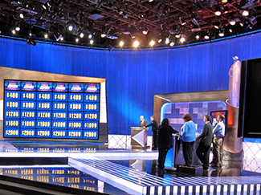
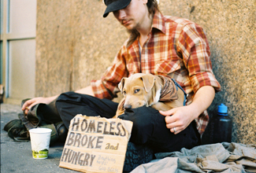

==========================
What Is Social Psychology?
==========================

.. contents::
   :depth: 3
..

.. container::

   By the end of this section, you will be able to: \* Define social
   psychology \* Describe situational versus dispositional influences on
   behavior \* Describe the fundamental attribution error

**Social psychology**\ {: data-type=“term”} examines how people affect
one another, and it looks at the power of the situation. Social
psychologists assert that an individual’s thoughts, feelings, and
behaviors are very much influenced by social situations. Essentially,
people will change their behavior to align with the social situation at
hand. If we are in a new situation or are unsure how to behave, we will
take our cues from other individuals.

The field of social psychology studies topics at both the intra- and
interpersonal levels. **Intrapersonal**\ {: data-type=“term”
.no-emphasis} topics (those that pertain to the individual) include
emotions and attitudes, the self, and social cognition (the ways in
which we think about ourselves and others). **Interpersonal**\ {:
data-type=“term” .no-emphasis} topics (those that pertain to dyads and
groups) include helping behavior
(`[link] <#CNX_Psych_12_01_helping>`__), aggression, prejudice and
discrimination, attraction and close relationships, and group processes
and intergroup relationships.

|A photograph shows several people pushing a car up an incline.|\ {:
#CNX_Psych_12_01_helping}

Social psychologists focus on how people construe or interpret
situations and how these interpretations influence their thoughts,
feelings, and behaviors (Ross & Nisbett, 1991). Thus, social psychology
studies individuals in a social context and how situational variables
interact to influence behavior. In this chapter, we discuss the
intrapersonal processes of self-presentation, cognitive dissonance and
attitude change, and the interpersonal processes of conformity and
obedience, aggression and altruism, and, finally, love and attraction.

SITUATIONAL AND DISPOSITIONAL INFLUENCES ON BEHAVIOR
====================================================

Behavior is a product of both the situation (e.g., cultural influences,
social roles, and the presence of bystanders) and of the person (e.g.,
personality characteristics). Subfields of psychology tend to focus on
one influence or behavior over others. **Situationism**\ {:
data-type=“term”} is the view that our behavior and actions are
determined by our immediate environment and surroundings. In contrast,
**dispositionism**\ {: data-type=“term”} holds that our behavior is
determined by internal factors (Heider, 1958). An **internal
factor**\ {: data-type=“term”} is an attribute of a person and includes
personality traits and temperament. Social psychologists have tended to
take the situationist perspective, whereas personality psychologists
have promoted the dispositionist perspective. Modern approaches to
social psychology, however, take both the situation and the individual
into account when studying human behavior (Fiske, Gilbert, & Lindzey,
2010). In fact, the field of social-personality psychology has emerged
to study the complex interaction of internal and situational factors
that affect human behavior (Mischel, 1977; Richard, Bond, &
Stokes-Zoota, 2003).

FUNDAMENTAL ATTRIBUTION ERROR
=============================

In the United States, the predominant culture tends to favor a
dispositional approach in explaining human behavior. Why do you think
this is? We tend to think that people are in control of their own
behaviors, and, therefore, any behavior change must be due to something
internal, such as their personality, habits, or temperament. According
to some social psychologists, people tend to overemphasize internal
factors as explanations—or attributions—for the behavior of other
people. They tend to assume that the behavior of another person is a
*trait* of that person, and to underestimate the power of the situation
on the behavior of others. They tend to fail to recognize when the
behavior of another is due to situational variables, and thus to the
person’s *state*. This erroneous assumption is called the **fundamental
attribution error**\ {: data-type=“term”} (Ross, 1977; Riggio & Garcia,
2009). To better understand, imagine this scenario: Greg returns home
from work, and upon opening the front door his wife happily greets him
and inquires about his day. Instead of greeting his wife, Greg yells at
her, “Leave me alone!” Why did Greg yell at his wife? How would someone
committing the fundamental attribution error explain Greg’s behavior?
The most common response is that Greg is a mean, angry, or unfriendly
person (his traits). This is an internal or dispositional explanation.
However, imagine that Greg was just laid off from his job due to company
downsizing. Would your explanation for Greg’s behavior change? Your
revised explanation might be that Greg was frustrated and disappointed
for losing his job; therefore, he was in a bad mood (his state). This is
now an external or situational explanation for Greg’s behavior.

The fundamental attribution error is so powerful that people often
overlook obvious situational influences on behavior. A classic example
was demonstrated in a series of experiments known as the quizmaster
study (Ross, Amabile, & Steinmetz, 1977). Student participants were
randomly assigned to play the role of a questioner (the quizmaster) or a
contestant in a quiz game. Questioners developed difficult questions to
which they knew the answers, and they presented these questions to the
contestants. The contestants answered the questions correctly only 4 out
of 10 times (`[link] <#CNX_Psych_12_01_quizshow>`__). After the task,
the questioners and contestants were asked to rate their own general
knowledge compared to the average student. Questioners did not rate
their general knowledge higher than the contestants, but the contestants
rated the questioners’ intelligence higher than their own. In a second
study, observers of the interaction also rated the questioner as having
more general knowledge than the contestant. The obvious influence on
performance is the situation. The questioners wrote the questions, so of
course they had an advantage. Both the contestants and observers made an
internal attribution for the performance. They concluded that the
questioners must be more intelligent than the contestants.

|A photograph shows the game show Jeopardy.|\ {:
#CNX_Psych_12_01_quizshow}

As demonstrated in the example above, the fundamental attribution error
is considered a powerful influence in how we explain the behaviors of
others. However, it should be noted that some researchers have suggested
that the fundamental attribution error may not be as powerful as it is
often portrayed. In fact, a recent review of more than 173 published
studies suggests that several factors (e.g., high levels of idiosyncrasy
of the character and how well hypothetical events are explained) play a
role in determining just how influential the fundamental attribution
error is (Malle, 2006).

IS THE FUNDAMENTAL ATTRIBUTION ERROR A UNIVERSAL PHENOMENON?
============================================================

You may be able to think of examples of the fundamental attribution
error in your life. Do people in all cultures commit the fundamental
attribution error? Research suggests that they do not. People from an
**individualistic culture**\ {: data-type=“term”}, that is, a culture
that focuses on individual achievement and autonomy, have the greatest
tendency to commit the fundamental attribution error. Individualistic
cultures, which tend to be found in western countries such as the United
States, Canada, and the United Kingdom, promote a focus on the
individual. Therefore, a person’s disposition is thought to be the
primary explanation for her behavior. In contrast, people from a
**collectivistic culture**\ {: data-type=“term”}, that is, a culture
that focuses on communal relationships with others, such as family,
friends, and community (`[link] <#CNX_Psych_12_01_cultures>`__), are
less likely to commit the fundamental attribution error (Markus &
Kitayama, 1991; Triandis, 2001).

|Three photographs show three groups of people: a family preparing a
meal, a group of men sitting on a porch, and a group of women playing
mahjong.|\ {: #CNX_Psych_12_01_cultures}

Why do you think this is the case? Collectivistic cultures, which tend
to be found in east Asian countries and in Latin American and African
countries, focus on the group more than on the individual (Nisbett,
Peng, Choi, & Norenzayan, 2001). This focus on others provides a broader
perspective that takes into account both situational and cultural
influences on behavior; thus, a more nuanced explanation of the causes
of others’ behavior becomes more likely. `[link] <#fs-idm158708336>`__
summarizes compares individualistic and collectivist cultures.

.. raw:: html

   <table summary="...">

.. raw:: html

   <caption>

Characteristics of Individualistic and Collectivistic Cultures

.. raw:: html

   </caption>

.. raw:: html

   <colgroup>

.. raw:: html

   <col data-width="400" />

.. raw:: html

   <col data-width="400" />

.. raw:: html

   </colgroup>

.. raw:: html

   <thead>

.. raw:: html

   <tr>

.. raw:: html

   <th data-align="center">

Individualistic Culture

.. raw:: html

   </th>

.. raw:: html

   <th data-align="center">

Collectivistic Culture

.. raw:: html

   </th>

.. raw:: html

   </tr>

.. raw:: html

   </thead>

.. raw:: html

   <tbody>

.. raw:: html

   <tr>

.. raw:: html

   <td>

Achievement oriented

.. raw:: html

   </td>

.. raw:: html

   <td>

Relationship oriented

.. raw:: html

   </td>

.. raw:: html

   </tr>

.. raw:: html

   <tr>

.. raw:: html

   <td>

Focus on autonomy

.. raw:: html

   </td>

.. raw:: html

   <td>

Focus on group autonomy

.. raw:: html

   </td>

.. raw:: html

   </tr>

.. raw:: html

   <tr>

.. raw:: html

   <td>

Dispositional perspective

.. raw:: html

   </td>

.. raw:: html

   <td>

Situational perspective

.. raw:: html

   </td>

.. raw:: html

   </tr>

.. raw:: html

   <tr>

.. raw:: html

   <td>

Independent

.. raw:: html

   </td>

.. raw:: html

   <td>

Interdependent

.. raw:: html

   </td>

.. raw:: html

   </tr>

.. raw:: html

   <tr>

.. raw:: html

   <td>

Analytic thinking style

.. raw:: html

   </td>

.. raw:: html

   <td>

Holistic thinking style

.. raw:: html

   </td>

.. raw:: html

   </tr>

.. raw:: html

   </tbody>

.. raw:: html

   </table>

ACTOR-OBSERVER BIAS
===================

Returning to our earlier example, Greg knew that he lost his job, but an
observer would not know. So a naïve observer would tend to attribute
Greg’s hostile behavior to Greg’s disposition rather than to the true,
situational cause. Why do you think we underestimate the influence of
the situation on the behaviors of others? One reason is that we often
don’t have all the information we need to make a situational explanation
for another person’s behavior. The only information we might have is
what is observable. Due to this lack of information we have a tendency
to assume the behavior is due to a dispositional, or internal, factor.
When it comes to explaining our own behaviors, however, we have much
more information available to us. If you came home from school or work
angry and yelled at your dog or a loved one, what would your explanation
be? You might say you were very tired or feeling unwell and needed quiet
time—a situational explanation. The **actor-observer bias**\ {:
data-type=“term”} is the phenomenon of attributing other people’s
behavior to internal factors (fundamental attribution error) while
attributing our own behavior to situational forces (Jones & Nisbett,
1971; Nisbett, Caputo, Legant, & Marecek, 1973; Choi & Nisbett, 1998).
As actors of behavior, we have more information available to explain our
own behavior. However as observers, we have less information available;
therefore, we tend to default to a dispositionist perspective.

One study on the actor-observer bias investigated reasons male
participants gave for why they liked their girlfriend (Nisbett et al.,
1973). When asked why participants liked their own girlfriend,
participants focused on internal, dispositional qualities of their
girlfriends (for example, her pleasant personality). The participants’
explanations rarely included causes internal to themselves, such as
dispositional traits (for example, “I need companionship.”). In
contrast, when speculating why a male friend likes his girlfriend,
participants were equally likely to give dispositional and external
explanations. This supports the idea that actors tend to provide few
internal explanations but many situational explanations for their own
behavior. In contrast, observers tend to provide more dispositional
explanations for a friend’s behavior
(`[link] <#CNX_Psych_12_01_biasgraph>`__).

|A bar graph compares “own reasons for liking girlfriend” to “friend’s
reasons for liking girlfriend.” In the former, situational traits are
about twice as high as dispositional traits, while in the latter,
situational and dispositional traits are nearly equal.|\ {:
#CNX_Psych_12_01_biasgraph}

SELF-SERVING BIAS
=================

Following an outcome, self-serving bias are those attributions that
enable us to see ourselves in favorable light (for example, making
internal attributions for success and external attributions for
failures). When you do well at a task, for example acing an exam, it is
in your best interest to make a dispositional attribution for your
behavior (“I’m smart,”) instead of a situational one (“The exam was
easy,”). The tendency of an individual to take credit by making
dispositional or internal attributions for positive outcomes but
situational or external attributions for negative outcomes is known as
the **self-serving bias**\ {: data-type=“term”} (Miller & Ross, 1975).
This bias serves to protect self-esteem. You can imagine that if people
always made situational attributions for their behavior, they would
never be able to take credit and feel good about their accomplishments.

We can understand self-serving bias by digging more deeply into
**attribution**\ {: data-type=“term”}, a belief about the cause of a
result. One model of attribution proposes three main dimensions: locus
of control (internal versus external), stability (stable versus
unstable), and controllability (controllable versus uncontrollable). In
this context, stability refers the extent to which the circumstances
that result in a given outcome are changeable. The circumstances are
considered stable if they are unlikely to change. Controllability refers
to the extent to which the circumstances that are associated with a
given outcome can be controlled. Obviously, those things that we have
the power to control would be labeled controllable (Weiner, 1979).

Consider the example of how we explain our favorite sports team’s wins.
Research shows that we make internal, stable, and controllable
attributions for our team’s victory
(`[link] <#CNX_Psych_12_01_winning>`__) (Grove, Hanrahan, & McInman,
1991). For example, we might tell ourselves that our team is talented
(internal), consistently works hard (stable), and uses effective
strategies (controllable). In contrast, we are more likely to make
external, unstable, and uncontrollable attributions when our favorite
team loses. For example, we might tell ourselves that the other team has
more experienced players or that the referees were unfair (external),
the other team played at home (unstable), and the cold weather affected
our team’s performance (uncontrollable).

|A photograph shows a hockey team.|\ {: #CNX_Psych_12_01_winning}

JUST-WORLD HYPOTHESIS
=====================

One consequence of westerners’ tendency to provide dispositional
explanations for behavior is victim blame (Jost & Major, 2001). When
people experience bad fortune, others tend to assume that they somehow
are responsible for their own fate. A common ideology, or worldview, in
the United States is the just-world hypothesis. The **just-world
hypothesis**\ {: data-type=“term”} is the belief that people get the
outcomes they deserve (Lerner & Miller, 1978). In order to maintain the
belief that the world is a fair place, people tend to think that good
people experience positive outcomes, and bad people experience negative
outcomes (Jost, Banaji, & Nosek, 2004; Jost & Major, 2001). The ability
to think of the world as a fair place, where people get what they
deserve, allows us to feel that the world is predictable and that we
have some control over our life outcomes (Jost et al., 2004; Jost &
Major, 2001). For example, if you want to experience positive outcomes,
you just need to work hard to get ahead in life.

Can you think of a negative consequence of the just-world hypothesis?
One negative consequence is people’s tendency to blame poor individuals
for their plight. What common explanations are given for why people live
in poverty? Have you heard statements such as, “The poor are lazy and
just don’t want to work” or “Poor people just want to live off the
government”? What types of explanations are these, dispositional or
situational? These dispositional explanations are clear examples of the
fundamental attribution error. Blaming poor people for their poverty
ignores situational factors that impact them, such as high unemployment
rates, recession, poor educational opportunities, and the familial cycle
of poverty (`[link] <#CNX_Psych_12_01_homeless>`__). Other research
shows that people who hold just-world beliefs have negative attitudes
toward people who are unemployed and people living with AIDS (Sutton &
Douglas, 2005). In the United States and other countries, victims of
sexual assault may find themselves blamed for their abuse. Victim
advocacy groups, such as Domestic Violence Ended (DOVE), attend court in
support of victims to ensure that blame is directed at the perpetrators
of sexual violence, not the victims.

|A photograph shows a homeless person and a dog sitting on a sidewalk
with a sign reading, “homeless, broke, and hungry.”|\ {:
#CNX_Psych_12_01_homeless}

Summary
=======

Social psychology is the subfield of psychology that studies the power
of the situation to influence individuals’ thoughts, feelings, and
behaviors. Psychologists categorize the causes of human behavior as
those due to internal factors, such as personality, or those due to
external factors, such as cultural and other social influences. Behavior
is better explained, however, by using both approaches. Lay people tend
to over-rely on dispositional explanations for behavior and ignore the
power of situational influences, a perspective called the fundamental
attribution error. People from individualistic cultures are more likely
to display this bias versus people from collectivistic cultures. Our
explanations for our own and others behaviors can be biased due to not
having enough information about others’ motivations for behaviors and by
providing explanations that bolster our self-esteem.

Review Questions
================

.. container::

   .. container::

      As a field, social psychology focuses on \_______\_ in predicting
      human behavior.

      1. personality traits
      2. genetic predispositions
      3. biological forces
      4. situational factors {: type=“a”}

   .. container::

      D

.. container::

   .. container::

      Making internal attributions for your successes and making
      external attributions for your failures is an example of
      \________.

      1. actor-observer bias
      2. fundamental attribution error
      3. self-serving bias
      4. just-world hypothesis {: type=“a”}

   .. container::

      C

.. container::

   .. container::

      Collectivistic cultures are to \_______\_ as individualistic
      cultures are to \________.

      1. dispositional; situational
      2. situational; dispositional
      3. autonomy; group harmony
      4. just-world hypothesis; self-serving bias {: type=“a”}

   .. container::

      B

.. container::

   .. container::

      According to the actor-observer bias, we have more information
      about \________.

      1. situational influences on behavior
      2. influences on our own behavior
      3. influences on others’ behavior
      4. dispositional influences on behavior {: type=“a”}

   .. container::

      B

Critical Thinking Questions
===========================

.. container::

   .. container::

      Compare and contrast situational influences and dispositional
      influences and give an example of each. Explain how situational
      influences and dispositional influences might explain
      inappropriate behavior.

   .. container::

      A situationism view is that our behaviors are determined by the
      situation—for example, a person who is late for work claims that
      heavy traffic caused the delay. A dispositional view is that our
      behaviors are determined by personality traits—for example, a
      driver in a road rage incident claims the driver who cut her off
      is an aggressive person. Thus, a situational view tends to provide
      an excuse for inappropriate behavior, and a dispositional view
      tends to lay blame for inappropriate behavior.

.. container::

   .. container::

      Provide an example of how people from individualistic and
      collectivistic cultures would differ in explaining why they won an
      important sporting event.

   .. container::

      People from individualistic cultures would tend to attribute
      athletic success to individual hard work and ability. People from
      collectivistic cultures would tend attribute athletic success to
      the team working together and the support and encouragement of the
      coach.

Personal Application Questions
==============================

.. container::

   .. container::

      Provide a personal example of an experience in which your behavior
      was influenced by the power of the situation.

.. container::

   .. container::

      Think of an example in the media of a sports figure—player or
      coach—who gives a self-serving attribution for winning or losing.
      Examples might include accusing the referee of incorrect calls, in
      the case of losing, or citing their own hard work and talent, in
      the case of winning.

.. container::

   .. rubric:: Glossary
      :name: glossary

   {: data-type=“glossary-title”}

   actor-observer bias
      phenomenon of explaining other people’s behaviors are due to
      internal factors and our own behaviors are due to situational
      forces ^
   attribution
      explanation for the behavior of other people ^
   collectivist culture
      culture that focuses on communal relationships with others such as
      family, friends, and community ^
   dispositionism
      describes a perspective common to personality psychologists, which
      asserts that our behavior is determined by internal factors, such
      as personality traits and temperament ^
   fundamental attribution error
      tendency to overemphasize internal factors as attributions for
      behavior and underestimate the power of the situation ^
   individualistic culture
      culture that focuses on individual achievement and autonomy ^
   internal factor
      internal attribute of a person, such as personality traits or
      temperament ^
   just-world hypothesis
      ideology common in the United States that people get the outcomes
      they deserve ^
   self-serving bias
      tendency for individuals to take credit by making dispositional or
      internal attributions for positive outcomes and situational or
      external attributions for negative outcomes ^
   situationism
      describes a perspective that behavior and actions are determined
      by the immediate environment and surroundings; a view promoted by
      social psychologists ^
   social psychology
      field of psychology that examines how people impact or affect each
      other, with particular focus on the power of the situation

.. |Three photographs show three groups of people: a family preparing a meal, a group of men sitting on a porch, and a group of women playing mahjong.| image:: ../resources/CNX_Psych_12_01_cultures.jpg
.. |A bar graph compares “own reasons for liking girlfriend” to “friend’s reasons for liking girlfriend.” In the former, situational traits are about twice as high as dispositional traits, while in the latter, situational and dispositional traits are nearly equal.| image:: ../resources/CNX_Psych_12_01_biasgraph.jpg

