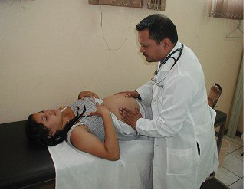
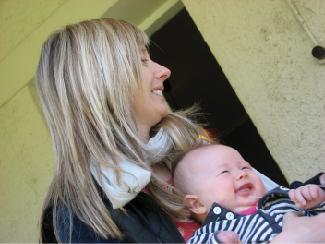
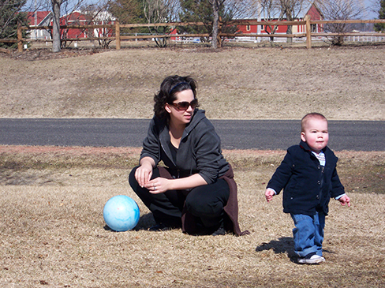
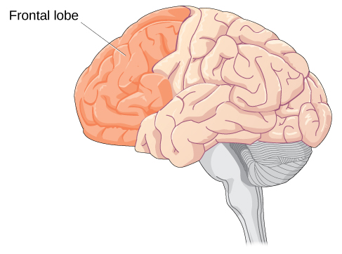
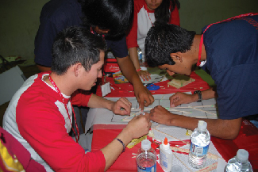

=====================
Stages of Development
=====================

.. contents::
   :depth: 3
..

.. container::

   By the end of this section, you will be able to: \* Describe the
   stages of prenatal development and recognize the importance of
   prenatal care \* Discuss physical, cognitive, and emotional
   development that occurs from infancy through childhood \* Discuss
   physical, cognitive, and emotional development that occurs during
   adolescence \* Discuss physical, cognitive, and emotional development
   that occurs in adulthood

From the moment we are born until the moment we die, we continue to
develop.

As discussed at the beginning of this chapter, developmental
psychologists often divide our development into three areas: physical
development, cognitive development, and psychosocial development.
Mirroring Erikson’s stages, lifespan development is divided into
different stages that are based on age. We will discuss prenatal,
infant, child, adolescent, and adult development.

PRENATAL DEVELOPMENT
====================

How did you come to be who you are? From beginning as a one-cell
structure to your birth, your **prenatal development**\ {:
data-type=“term” .no-emphasis} occurred in an orderly and delicate
sequence.

There are three stages of prenatal development: germinal, embryonic, and
fetal. Let’s take a look at what happens to the developing baby in each
of these stages.

Germinal Stage (Weeks 1–2)
--------------------------

In the discussion of biopsychology earlier in the book, you learned
about genetics and DNA. A mother and father’s DNA is passed on to the
child at the moment of conception. **Conception**\ {: data-type=“term”}
occurs when sperm fertilizes an egg and forms a zygote
(`[link] <#Figure_09_02_Conception>`__). A **zygote**\ {:
data-type=“term”} begins as a one-cell structure that is created when a
sperm and egg merge. The genetic makeup and sex of the baby are set at
this point. During the first week after conception, the zygote divides
and multiplies, going from a one-cell structure to two cells, then four
cells, then eight cells, and so on. This process of cell division is
called **mitosis**\ {: data-type=“term”}. Mitosis is a fragile process,
and fewer than one-half of all zygotes survive beyond the first two
weeks (Hall, 2004). After 5 days of mitosis there are 100 cells, and
after 9 months there are billions of cells. As the cells divide, they
become more specialized, forming different organs and body parts. In the
germinal stage, the mass of cells has yet to attach itself to the lining
of the mother’s uterus. Once it does, the next stage begins.

|A microscopic picture shows a single sperm fusing with the ovum.|\ {:
#Figure_09_02_Conception}

Embryonic Stage (Weeks 3–8)
---------------------------

After the zygote divides for about 7–10 days and has 150 cells, it
travels down the fallopian tubes and implants itself in the lining of
the uterus. Upon implantation, this multi-cellular organism is called an
**embryo**\ {: data-type=“term”}. Now blood vessels grow, forming the
placenta. The **placenta**\ {: data-type=“term”} is a structure
connected to the uterus that provides nourishment and oxygen from the
mother to the developing embryo via the umbilical cord. Basic structures
of the embryo start to develop into areas that will become the head,
chest, and abdomen. During the embryonic stage, the heart begins to beat
and organs form and begin to function. The neural tube forms along the
back of the embryo, developing into the spinal cord and brain.

Fetal Stage (Weeks 9–40)
------------------------

When the organism is about nine weeks old, the embryo is called a fetus.
At this stage, the fetus is about the size of a kidney bean and begins
to take on the recognizable form of a human being as the “tail” begins
to disappear.

From 9–12 weeks, the sex organs begin to differentiate. At about 16
weeks, the fetus is approximately 4.5 inches long. Fingers and toes are
fully developed, and fingerprints are visible. By the time the fetus
reaches the sixth month of development (24 weeks), it weighs up to 1.4
pounds. Hearing has developed, so the fetus can respond to sounds. The
internal organs, such as the lungs, heart, stomach, and intestines, have
formed enough that a fetus born prematurely at this point has a chance
to survive outside of the mother’s womb. Throughout the fetal stage the
brain continues to grow and develop, nearly doubling in size from weeks
16 to 28. Around 36 weeks, the fetus is almost ready for birth. It
weighs about 6 pounds and is about 18.5 inches long, and by week 37 all
of the fetus’s organ systems are developed enough that it could survive
outside the mother’s uterus without many of the risks associated with
premature birth. The fetus continues to gain weight and grow in length
until approximately 40 weeks. By then, the fetus has very little room to
move around and birth becomes imminent. The progression through the
stages is shown in `[link] <#Figure_09_02_Stages>`__.

|The growth of a fetus is shown using nine pictures in different stages
of development. For each stage, there is a picture of a fetus which gets
progressively larger and more mature. The first stage is labeled “9
weeks; fetal stage begins.” The second stage is labeled “12 weeks; sex
organs differentiate.” The third stage is labeled “16 weeks; fingers and
toes develop.” The fourth stage is labeled “20 weeks; hearing begins.”
The fifth stage is labeled “24 weeks; lungs begin to develop.” The sixth
stage is labeled “28 weeks; brain grows rapidly.” The seventh stage is
labeled “32 weeks; bones fully develop.” The eighth stage is labeled “36
weeks; muscles fully develop.” The ninth stage is labeled “40 weeks;
full-term development.”|\ {: #Figure_09_02_Stages}

.. container:: psychology link-to-learning

   For an amazing look at prenatal development and the process of birth,
   view the video `Life’s Greatest
   Miracle <http://openstax.org/l/miracle>`__ from Nova and PBS.

Prenatal Influences
-------------------

During each prenatal stage, genetic and environmental factors can affect
development. The developing fetus is completely dependent on the mother
for life. It is important that the mother takes good care of herself and
receives **prenatal care**\ {: data-type=“term”}, which is medical care
during pregnancy that monitors the health of both the mother and the
fetus (`[link] <#Figure_09_02_Prenatal>`__). According to the National
Institutes of Health ([NIH], 2013), routine prenatal care is important
because it can reduce the risk of complications to the mother and fetus
during pregnancy. In fact, women who are trying to become pregnant or
who may become pregnant should discuss pregnancy planning with their
doctor. They may be advised, for example, to take a vitamin containing
folic acid, which helps prevent certain birth defects, or to monitor
aspects of their diet or exercise routines.

|A pregnant woman is lying on a table being examined by a doctor. The
doctor's hands are on her belly.|\ {: #Figure_09_02_Prenatal}

Recall that when the zygote attaches to the wall of the mother’s uterus,
the placenta is formed. The placenta provides nourishment and oxygen to
the fetus. Most everything the mother ingests, including food, liquid,
and even medication, travels through the placenta to the fetus, hence
the common phrase “eating for two.” Anything the mother is exposed to in
the environment affects the fetus; if the mother is exposed to something
harmful, the child can show life-long effects.

A **teratogen**\ {: data-type=“term”} is any environmental
agent—biological, chemical, or physical—that causes damage to the
developing embryo or fetus. There are different types of teratogens.
Alcohol and most drugs cross the placenta and affect the fetus. Alcohol
is not safe to drink in any amount during pregnancy. Alcohol use during
pregnancy has been found to be the leading preventable cause of mental
retardation in children in the United States (Maier & West, 2001).
Excessive maternal drinking while pregnant can cause fetal alcohol
spectrum disorders with life-long consequences for the child ranging in
severity from minor to major (`[link] <#Table_09_03_01>`__). Fetal
alcohol spectrum disorders (FASD) are a collection of birth defects
associated with heavy consumption of alcohol during pregnancy.
Physically, children with FASD may have a small head size and abnormal
facial features. Cognitively, these children may have poor judgment,
poor impulse control, higher rates of ADHD, learning issues, and lower
IQ scores. These developmental problems and delays persist into
adulthood (Streissguth et al., 2004). Based on studies conducted on
animals, it also has been suggested that a mother’s alcohol consumption
during pregnancy may predispose her child to like alcohol (Youngentob et
al., 2007).

.. raw:: html

   <table id="Table_09_03_01" summary="A two column table describes the potential effects of fetal alcohol syndrome. The columns are labeled “facial feature” and “potential effect of fetal alcohol syndrome.” From left to right, the first row reads “head size” and “below-average head circumference.” The second row reads “eyes” and “smaller than average eye opening, skin folds at corners of eyes.” The third row reads “nose” and “low nasal bridge, short nose.” The fourth row reads “midface” and “smaller than average midface size.” The fifth row reads “lip and philtrum” and “thin upper ilp, indistinct philtrum.”">

.. raw:: html

   <caption>

Fetal Alcohol Syndrome Facial Features

.. raw:: html

   </caption>

.. raw:: html

   <thead>

.. raw:: html

   <tr>

.. raw:: html

   <th>

Facial Feature

.. raw:: html

   </th>

.. raw:: html

   <th>

Potential Effect of Fetal Alcohol Syndrome

.. raw:: html

   </th>

.. raw:: html

   </tr>

.. raw:: html

   </thead>

.. raw:: html

   <tbody>

.. raw:: html

   <tr>

.. raw:: html

   <td>

Head size

.. raw:: html

   </td>

.. raw:: html

   <td>

Below-average head circumference

.. raw:: html

   </td>

.. raw:: html

   </tr>

.. raw:: html

   <tr>

.. raw:: html

   <td>

Eyes

.. raw:: html

   </td>

.. raw:: html

   <td>

Smaller than average eye opening, skin folds at corners of eyes

.. raw:: html

   </td>

.. raw:: html

   </tr>

.. raw:: html

   <tr>

.. raw:: html

   <td>

Nose

.. raw:: html

   </td>

.. raw:: html

   <td>

Low nasal bridge, short nose

.. raw:: html

   </td>

.. raw:: html

   </tr>

.. raw:: html

   <tr>

.. raw:: html

   <td>

Midface

.. raw:: html

   </td>

.. raw:: html

   <td>

Smaller than average midface size

.. raw:: html

   </td>

.. raw:: html

   </tr>

.. raw:: html

   <tr>

.. raw:: html

   <td>

Lip and philtrum

.. raw:: html

   </td>

.. raw:: html

   <td>

Thin upper lip, indistinct philtrum

.. raw:: html

   </td>

.. raw:: html

   </tr>

.. raw:: html

   </tbody>

.. raw:: html

   </table>

Smoking is also considered a teratogen because nicotine travels through
the placenta to the fetus. When the mother smokes, the developing baby
experiences a reduction in blood oxygen levels. According to the Centers
for Disease Control and Prevention (2013), smoking while pregnant can
result in premature birth, low-birth-weight infants, stillbirth, and
sudden infant death syndrome (SIDS).

Heroin, cocaine, methamphetamine, almost all prescription medicines, and
most over-the counter medications are also considered teratogens. Babies
born with a heroin addiction need heroin just like an adult addict. The
child will need to be gradually weaned from the heroin under medical
supervision; otherwise, the child could have seizures and die. Other
teratogens include radiation, viruses such as HIV and herpes, and
rubella (German measles). Women in the United States are much less
likely to be afflicted with rubella because most women received
childhood immunizations or vaccinations that protect the body from
disease.

Each organ of the fetus develops during a specific period in the
pregnancy, called the **critical or sensitive period**\ {:
data-type=“term”} (`[link] <#Figure_09_02_Stages>`__). For example,
research with primate models of FASD has demonstrated that the time
during which a developing fetus is exposed to alcohol can dramatically
affect the appearance of facial characteristics associated with fetal
alcohol syndrome. Specifically, this research suggests that alcohol
exposure that is limited to day 19 or 20 of gestation can lead to
significant facial abnormalities in the offspring (Ashley, Magnuson,
Omnell, & Clarren, 1999). Given regions of the brain also show sensitive
periods during which they are most susceptible to the teratogenic
effects of alcohol (Tran & Kelly, 2003).

.. container:: psychology what-do-you-think

   .. container::

      Should Women Who Use Drugs During Pregnancy Be Arrested and
      Jailed?

   As you now know, women who use drugs or alcohol during pregnancy can
   cause serious lifelong harm to their child. Some people have
   advocated mandatory screenings for women who are pregnant and have a
   history of drug abuse, and if the women continue using, to arrest,
   prosecute, and incarcerate them (Figdor & Kaeser, 1998). This policy
   was tried in Charleston, South Carolina, as recently as 20 years ago.
   The policy was called the Interagency Policy on Management of
   Substance Abuse During Pregnancy, and had disastrous results.

      The Interagency Policy applied to patients attending the
      obstetrics clinic at MUSC, which primarily serves patients who are
      indigent or on Medicaid. It did not apply to private obstetrical
      patients. The policy required patient education about the harmful
      effects of substance abuse during pregnancy. . . . [A] statement
      also warned patients that protection of unborn and newborn
      children from the harms of illegal drug abuse could involve the
      Charleston police, the Solicitor of the Ninth Judicial Court, and
      the Protective Services Division of the Department of Social
      Services (DSS). (Jos, Marshall, & Perlmutter, 1995, pp. 120–121)

   This policy seemed to deter women from seeking prenatal care,
   deterred them from seeking other social services, and was applied
   solely to low-income women, resulting in lawsuits. The program was
   canceled after 5 years, during which 42 women were arrested. A
   federal agency later determined that the program involved human
   experimentation without the approval and oversight of an
   institutional review board (IRB). What were the flaws in the program
   and how would you correct them? What are the ethical implications of
   charging pregnant women with child abuse?

INFANCY THROUGH CHILDHOOD
=========================

The average newborn weighs approximately 7.5 pounds. Although small, a
newborn is not completely helpless because his reflexes and sensory
capacities help him interact with the environment from the moment of
birth. All healthy babies are born with **newborn reflexes**\ {:
data-type=“term”}: inborn automatic responses to particular forms of
stimulation. Reflexes help the newborn survive until it is capable of
more complex behaviors—these reflexes are crucial to survival. They are
present in babies whose brains are developing normally and usually
disappear around 4–5 months old. Let’s take a look at some of these
newborn reflexes. The rooting reflex is the newborn’s response to
anything that touches her cheek: When you stroke a baby’s cheek, she
naturally turns her head in that direction and begins to suck. The
sucking reflex is the automatic, unlearned, sucking motions that infants
do with their mouths. Several other interesting newborn reflexes can be
observed. For instance, if you put your finger into a newborn’s hand,
you will witness the grasping reflex, in which a baby automatically
grasps anything that touches his palms. The Moro reflex is the newborn’s
response when she feels like she is falling. The baby spreads her arms,
pulls them back in, and then (usually) cries. How do you think these
reflexes promote survival in the first months of life?

.. container:: psychology link-to-learning

   Take a few minutes to view this brief `video
   clip <http://openstax.org/l/newflexes>`__ illustrating several
   newborn reflexes.

What can young infants see, hear, and smell? Newborn infants’ sensory
abilities are significant, but their senses are not yet fully developed.
Many of a newborn’s innate preferences facilitate interaction with
caregivers and other humans. Although vision is their least developed
sense, newborns already show a preference for faces. Babies who are just
a few days old also prefer human voices, they will listen to voices
longer than sounds that do not involve speech (Vouloumanos & Werker,
2004), and they seem to prefer their mother’s voice over a stranger’s
voice (Mills & Melhuish, 1974). In an interesting experiment, 3-week-old
babies were given pacifiers that played a recording of the infant’s
mother’s voice and of a stranger’s voice. When the infants heard their
mother’s voice, they sucked more strongly at the pacifier (Mills &
Melhuish, 1974). Newborns also have a strong sense of smell. For
instance, newborn babies can distinguish the smell of their own mother
from that of others. In a study by MacFarlane (1978), 1-week-old babies
who were being breastfed were placed between two gauze pads. One gauze
pad was from the bra of a nursing mother who was a stranger, and the
other gauze pad was from the bra of the infant’s own mother. More than
two-thirds of the week-old babies turned toward the gauze pad with their
mother’s scent.

Physical Development
--------------------

In infancy, toddlerhood, and early childhood, the body’s physical
development is rapid (`[link] <#Figure_09_04_Growth>`__). On average,
newborns weigh between 5 and 10 pounds, and a newborn’s weight typically
doubles in six months and triples in one year. By 2 years old the weight
will have quadrupled, so we can expect that a 2 year old should weigh
between 20 and 40 pounds. The average length of a newborn is 19.5
inches, increasing to 29.5 inches by 12 months and 34.4 inches by 2
years old (WHO Multicentre Growth Reference Study Group, 2006).

|A collage of four photographs depicting babies is shown. From left to
right they get progressively older. The far left photograph is a bundled
up sleeping newborn. To the right is a picture of a toddler next to a
toy giraffe. To the right is a baby blowing out a single candle. To the
far right is a child on a swing set.|\ {: #Figure_09_04_Growth}

During infancy and childhood, growth does not occur at a steady rate
(Carel, Lahlou, Roger, & Chaussain, 2004). Growth slows between 4 and 6
years old: During this time children gain 5–7 pounds and grow about 2–3
inches per year. Once girls reach 8–9 years old, their growth rate
outpaces that of boys due to a pubertal growth spurt. This growth spurt
continues until around 12 years old, coinciding with the start of the
menstrual cycle. By 10 years old, the average girl weighs 88 pounds, and
the average boy weighs 85 pounds.

We are born with all of the brain cells that we will ever have—about
100–200 billion neurons (nerve cells) whose function is to store and
transmit information (Huttenlocher & Dabholkar, 1997). However, the
nervous system continues to grow and develop. Each neural pathway forms
thousands of new connections during infancy and toddlerhood. This period
of rapid neural growth is called blooming. Neural pathways continue to
develop through puberty. The blooming period of neural growth is then
followed by a period of pruning, where neural connections are reduced.
It is thought that pruning causes the brain to function more
efficiently, allowing for mastery of more complex skills (Hutchinson,
2011). Blooming occurs during the first few years of life, and pruning
continues through childhood and into adolescence in various areas of the
brain.

The size of our brains increases rapidly. For example, the brain of a
2-year-old is 55% of its adult size, and by 6 years old the brain is
about 90% of its adult size (Tanner, 1978). During early childhood (ages
3–6), the frontal lobes grow rapidly. Recalling our discussion of the 4
lobes of the brain earlier in this book, the frontal lobes are
associated with planning, reasoning, memory, and impulse control.
Therefore, by the time children reach school age, they are
developmentally capable of controlling their attention and behavior.
Through the elementary school years, the frontal, temporal, occipital,
and parietal lobes all grow in size. The brain growth spurts experienced
in childhood tend to follow Piaget’s sequence of cognitive development,
so that significant changes in neural functioning account for cognitive
advances (Kolb & Whishaw, 2009; Overman, Bachevalier, Turner, & Peuster,
1992).

Motor development occurs in an orderly sequence as infants move from
reflexive reactions (e.g., sucking and rooting) to more advanced motor
functioning. For instance, babies first learn to hold their heads up,
then to sit with assistance, and then to sit unassisted, followed later
by crawling and then walking.

**Motor skills**\ {: data-type=“term”} refer to our ability to move our
bodies and manipulate objects. **Fine motor skills**\ {:
data-type=“term”} focus on the muscles in our fingers, toes, and eyes,
and enable coordination of small actions (e.g., grasping a toy, writing
with a pencil, and using a spoon). **Gross motor skills**\ {:
data-type=“term”} focus on large muscle groups that control our arms and
legs and involve larger movements (e.g., balancing, running, and
jumping).

As motor skills develop, there are certain developmental milestones that
young children should achieve (`[link] <#Table_09_03_02>`__). For each
milestone there is an average age, as well as a range of ages in which
the milestone should be reached. An example of a developmental milestone
is sitting. On average, most babies sit alone at 7 months old. Sitting
involves both coordination and muscle strength, and 90% of babies
achieve this milestone between 5 and 9 months old. In another example,
babies on average are able to hold up their head at 6 weeks old, and 90%
of babies achieve this between 3 weeks and 4 months old. If a baby is
not holding up his head by 4 months old, he is showing a delay. If the
child is displaying delays on several milestones, that is reason for
concern, and the parent or caregiver should discuss this with the
child’s pediatrician. Some developmental delays can be identified and
addressed through early intervention.

.. raw:: html

   <table id="Table_09_03_02" summary="A five column table describes developmental milestones from the ages of two through five. From left to right, the columns are labeled “age (years), physical, personal/social, language, and cognitive.” The contents of the first row, respectively, are “2; kicks a ball, walks up and down stairs; plays alongside other children, copies adults; points to objects when named, puts 2-4 words together in a sentence; and sorts shapes and colors, follows 2-step instructions.” The second row contains “3; climbs and runs, pedals tricycle; takes turns, expresses many emotions, dresses self; names familiar things, uses pronouns; and plays make believe, works toys with parts (levers, handles).” The third row contains “4; catches balls, uses scissors; prefers social play to solo play, knows likes and interests; knows songs and rhymes by memory; and names colors and numbers, begins writing letters.” The fourth row contains “5; hops and swings, uses fork and spoon; distinguishes real from pretend, likes to please friends; speaks clearly, uses full sentences; and counts to 10 or higher, prints some letters and copies basic shapes.”">

.. raw:: html

   <caption>

Developmental Milestones, Ages 2–5 Years

.. raw:: html

   </caption>

.. raw:: html

   <thead>

.. raw:: html

   <tr>

.. raw:: html

   <th>

Age (years)

.. raw:: html

   </th>

.. raw:: html

   <th>

Physical

.. raw:: html

   </th>

.. raw:: html

   <th>

Personal/Social

.. raw:: html

   </th>

.. raw:: html

   <th>

Language

.. raw:: html

   </th>

.. raw:: html

   <th>

Cognitive

.. raw:: html

   </th>

.. raw:: html

   </tr>

.. raw:: html

   </thead>

.. raw:: html

   <tbody>

.. raw:: html

   <tr valign="top">

.. raw:: html

   <td>

2

.. raw:: html

   </td>

.. raw:: html

   <td>

Kicks a ball; walks up and down stairs

.. raw:: html

   </td>

.. raw:: html

   <td>

Plays alongside other children; copies adults

.. raw:: html

   </td>

.. raw:: html

   <td>

Points to objects when named; puts 2–4 words together in a sentence

.. raw:: html

   </td>

.. raw:: html

   <td>

Sorts shapes and colors; follows 2-step instructions

.. raw:: html

   </td>

.. raw:: html

   </tr>

.. raw:: html

   <tr valign="top">

.. raw:: html

   <td>

3

.. raw:: html

   </td>

.. raw:: html

   <td>

Climbs and runs; pedals tricycle

.. raw:: html

   </td>

.. raw:: html

   <td>

Takes turns; expresses many emotions; dresses self

.. raw:: html

   </td>

.. raw:: html

   <td>

Names familiar things; uses pronouns

.. raw:: html

   </td>

.. raw:: html

   <td>

Plays make believe; works toys with parts (levers, handles)

.. raw:: html

   </td>

.. raw:: html

   </tr>

.. raw:: html

   <tr valign="top">

.. raw:: html

   <td>

4

.. raw:: html

   </td>

.. raw:: html

   <td>

Catches balls; uses scissors

.. raw:: html

   </td>

.. raw:: html

   <td>

Prefers social play to solo play; knows likes and interests

.. raw:: html

   </td>

.. raw:: html

   <td>

Knows songs and rhymes by memory

.. raw:: html

   </td>

.. raw:: html

   <td>

Names colors and numbers; begins writing letters

.. raw:: html

   </td>

.. raw:: html

   </tr>

.. raw:: html

   <tr valign="top">

.. raw:: html

   <td>

5

.. raw:: html

   </td>

.. raw:: html

   <td>

Hops and swings; uses fork and spoon

.. raw:: html

   </td>

.. raw:: html

   <td>

Distinguishes real from pretend; likes to please friends

.. raw:: html

   </td>

.. raw:: html

   <td>

Speaks clearly; uses full sentences

.. raw:: html

   </td>

.. raw:: html

   <td>

Counts to 10 or higher; prints some letters and copies basic shapes

.. raw:: html

   </td>

.. raw:: html

   </tr>

.. raw:: html

   </tbody>

.. raw:: html

   </table>

Cognitive Development
---------------------

In addition to rapid physical growth, young children also exhibit
significant development of their cognitive abilities. Piaget thought
that children’s ability to understand objects—such as learning that a
rattle makes a noise when shaken—was a cognitive skill that develops
slowly as a child matures and interacts with the environment. Today,
developmental psychologists think Piaget was incorrect. Researchers have
found that even very young children understand objects and how they work
long before they have experience with those objects (Baillargeon, 1987;
Baillargeon, Li, Gertner, & Wu, 2011). For example, children as young as
3 months old demonstrated knowledge of the properties of objects that
they had only viewed and did not have prior experience with them. In one
study, 3-month-old infants were shown a truck rolling down a track and
behind a screen. The box, which appeared solid but was actually hollow,
was placed next to the track. The truck rolled past the box as would be
expected. Then the box was placed on the track to block the path of the
truck. When the truck was rolled down the track this time, it continued
unimpeded. The infants spent significantly more time looking at this
impossible event (`[link] <#Figure_09_04_TruckBox>`__). Baillargeon
(1987) concluded that they knew solid objects cannot pass through each
other. Baillargeon’s findings suggest that very young children have an
understanding of objects and how they work, which Piaget (1954) would
have said is beyond their cognitive abilities due to their limited
experiences in the world.

|Image A shows a toy truck coasting along a track unobstructed. Image B
shows a toy truck coasting along a track with a box in the background.
Image C shows a truck coasting along a track and going through what
appears to be an obstruction.|\ {: #Figure_09_04_TruckBox}

Just as there are physical milestones that we expect children to reach,
there are also cognitive milestones. It is helpful to be aware of these
milestones as children gain new abilities to think, problem solve, and
communicate. For example, infants shake their head “no” around 6–9
months, and they respond to verbal requests to do things like “wave
bye-bye” or “blow a kiss” around 9–12 months. Remember Piaget’s ideas
about object permanence? We can expect children to grasp the concept
that objects continue to exist even when they are not in sight by around
8 months old. Because toddlers (i.e., 12–24 months old) have mastered
object permanence, they enjoy games like hide and seek, and they realize
that when someone leaves the room they will come back (Loop, 2013).
Toddlers also point to pictures in books and look in appropriate places
when you ask them to find objects.

Preschool-age children (i.e., 3–5 years old) also make steady progress
in cognitive development. Not only can they count, name colors, and tell
you their name and age, but they can also make some decisions on their
own, such as choosing an outfit to wear. Preschool-age children
understand basic time concepts and sequencing (e.g., before and after),
and they can predict what will happen next in a story. They also begin
to enjoy the use of humor in stories. Because they can think
symbolically, they enjoy pretend play and inventing elaborate characters
and scenarios. One of the most common examples of their cognitive growth
is their blossoming curiosity. Preschool-age children love to ask “Why?”

An important cognitive change occurs in children this age. Recall that
Piaget described 2–3 year olds as egocentric, meaning that they do not
have an awareness of others’ points of view. Between 3 and 5 years old,
children come to understand that people have thoughts, feelings, and
beliefs that are different from their own. This is known as
theory-of-mind (TOM). Children can use this skill to tease others,
persuade their parents to purchase a candy bar, or understand why a
sibling might be angry. When children develop TOM, they can recognize
that others have false beliefs (Dennett, 1987; Callaghan et al., 2005).

.. container:: psychology link-to-learning

   False-belief tasks are useful in determining a child’s acquisition of
   theory-of-mind (TOM). Take a look at this `video
   clip <http://openstax.org/l/crayons>`__ showing a false-belief task
   involving a box of crayons.

Cognitive skills continue to expand in middle and late childhood (6–11
years old). Thought processes become more logical and organized when
dealing with concrete information (`[link] <#Figure_09_04_Game>`__).
Children at this age understand concepts such as the past, present, and
future, giving them the ability to plan and work toward goals.
Additionally, they can process complex ideas such as addition and
subtraction and cause-and-effect relationships. However, children’s
attention spans tend to be very limited until they are around 11 years
old. After that point, it begins to improve through adulthood.

|A photograph of children playing baseball is shown. Five children are
in the picture, two on one team, and three on the other.|\ {:
#Figure_09_04_Game}

One well-researched aspect of cognitive development is language
acquisition. As mentioned earlier, the order in which children learn
language structures is consistent across children and cultures (Hatch,
1983). You’ve also learned that some psychological researchers have
proposed that children possess a biological predisposition for language
acquisition.

Starting before birth, babies begin to develop language and
communication skills. At birth, babies apparently recognize their
mother’s voice and can discriminate between the language(s) spoken by
their mothers and foreign languages, and they show preferences for faces
that are moving in synchrony with audible language (Blossom & Morgan,
2006; Pickens, 1994; Spelke & Cortelyou, 1981).

Children communicate information through gesturing long before they
speak, and there is some evidence that gesture usage predicts subsequent
language development (Iverson & Goldin-Meadow, 2005). In terms of
producing spoken language, babies begin to coo almost immediately.
Cooing is a one-syllable combination of a consonant and a vowel sound
(e.g., coo or ba). Interestingly, babies replicate sounds from their own
languages. A baby whose parents speak French will coo in a different
tone than a baby whose parents speak Spanish or Urdu. After cooing, the
baby starts to babble. Babbling begins with repeating a syllable, such
as ma-ma, da-da, or ba-ba. When a baby is about 12 months old, we expect
her to say her first word for meaning, and to start combining words for
meaning at about 18 months.

At about 2 years old, a toddler uses between 50 and 200 words; by 3
years old they have a vocabulary of up to 1,000 words and can speak in
sentences. During the early childhood years, children's vocabulary
increases at a rapid pace. This is sometimes referred to as the
“vocabulary spurt” and has been claimed to involve an expansion in
vocabulary at a rate of 10–20 new words per week. Recent research may
indicate that while some children experience these spurts, it is far
from universal (as discussed in Ganger & Brent, 2004). It has been
estimated that, 5 year olds understand about 6,000 words, speak 2,000
words, and can define words and question their meanings. They can rhyme
and name the days of the week. Seven year olds speak fluently and use
slang and clichés (Stork & Widdowson, 1974).

What accounts for such dramatic language learning by children?
Behaviorist B. F. Skinner thought that we learn language in response to
reinforcement or feedback, such as through parental approval or through
being understood. For example, when a two-year-old child asks for juice,
he might say, “me juice,” to which his mother might respond by giving
him a cup of apple juice. Noam Chomsky (1957) criticized Skinner’s
theory and proposed that we are all born with an innate capacity to
learn language. Chomsky called this mechanism a language acquisition
device (LAD). Who is correct? Both Chomsky and Skinner are right.
Remember that we are a product of both nature and nurture. Researchers
now believe that language acquisition is partially inborn and partially
learned through our interactions with our linguistic environment
(Gleitman & Newport, 1995; Stork & Widdowson, 1974).

Attachment
----------

Psychosocial development occurs as children form relationships, interact
with others, and understand and manage their feelings. In social and
emotional development, forming healthy attachments is very important and
is the major social milestone of infancy. **Attachment**\ {:
data-type=“term”} is a long-standing connection or bond with others.
Developmental psychologists are interested in how infants reach this
milestone. They ask such questions as: How do parent and infant
attachment bonds form? How does neglect affect these bonds? What
accounts for children’s attachment differences?

Researchers Harry Harlow, John Bowlby, and Mary Ainsworth conducted
studies designed to answer these questions. In the 1950s, Harlow
conducted a series of experiments on monkeys. He separated newborn
monkeys from their mothers. Each monkey was presented with two surrogate
mothers. One surrogate monkey was made out of wire mesh, and she could
dispense milk. The other monkey was softer and made from cloth: This
monkey did not dispense milk. Research shows that the monkeys preferred
the soft, cuddly cloth monkey, even though she did not provide any
nourishment. The baby monkeys spent their time clinging to the cloth
monkey and only went to the wire monkey when they needed to be fed.
Prior to this study, the medical and scientific communities generally
thought that babies become attached to the people who provide their
nourishment. However, Harlow (1958) concluded that there was more to the
mother-child bond than nourishment. Feelings of comfort and security are
the critical components to maternal-infant bonding, which leads to
healthy psychosocial development.

.. container:: psychology link-to-learning

   Harlow’s studies of monkeys were performed before modern ethics
   guidelines were in place, and today his experiments are widely
   considered to be unethical and even cruel. Watch this
   `video <http://openstax.org/l/monkeystudy>`__ to see actual footage
   of Harlow’s monkey studies.

Building on the work of Harlow and others, John Bowlby developed the
concept of attachment theory. He defined attachment as the affectional
bond or tie that an infant forms with the mother (Bowlby, 1969). An
infant must form this bond with a primary caregiver in order to have
normal social and emotional development. In addition, Bowlby proposed
that this attachment bond is very powerful and continues throughout
life. He used the concept of secure base to define a healthy attachment
between parent and child (1988). A **secure base**\ {: data-type=“term”}
is a parental presence that gives the child a sense of safety as he
explores his surroundings. Bowlby said that two things are needed for a
healthy attachment: The caregiver must be responsive to the child’s
physical, social, and emotional needs; and the caregiver and child must
engage in mutually enjoyable interactions (Bowlby, 1969)
(`[link] <#Figure_09_04_BabySmile>`__).

|A person is shown holding an infant.|\ {: #Figure_09_04_BabySmile}

While Bowlby thought attachment was an all-or-nothing process, Mary
Ainsworth’s (1970) research showed otherwise. Ainsworth wanted to know
if children differ in the ways they bond, and if so, why. To find the
answers, she used the Strange Situation procedure to study attachment
between mothers and their infants (1970). In the Strange Situation, the
mother (or primary caregiver) and the infant (age 12-18 months) are
placed in a room together. There are toys in the room, and the caregiver
and child spend some time alone in the room. After the child has had
time to explore her surroundings, a stranger enters the room. The mother
then leaves her baby with the stranger. After a few minutes, she returns
to comfort her child.

Based on how the infants/toddlers responded to the separation and
reunion, Ainsworth identified three types of parent-child attachments:
secure, avoidant, and resistant (Ainsworth & Bell, 1970). A fourth
style, known as disorganized attachment, was later described (Main &
Solomon, 1990). The most common type of attachment—also considered the
healthiest—is called **secure attachment**\ {: data-type=“term”}
(`[link] <#Figure_09_04_Secure>`__). In this type of attachment, the
toddler prefers his parent over a stranger. The attachment figure is
used as a secure base to explore the environment and is sought out in
times of stress. Securely attached children were distressed when their
caregivers left the room in the Strange Situation experiment, but when
their caregivers returned, the securely attached children were happy to
see them. Securely attached children have caregivers who are sensitive
and responsive to their needs.

|A photograph shows a person squatting down next to a small child who is
standing up.|\ {: #Figure_09_04_Secure}

With **avoidant attachment**\ {: data-type=“term”}, the child is
unresponsive to the parent, does not use the parent as a secure base,
and does not care if the parent leaves. The toddler reacts to the parent
the same way she reacts to a stranger. When the parent does return, the
child is slow to show a positive reaction. Ainsworth theorized that
these children were most likely to have a caregiver who was insensitive
and inattentive to their needs (Ainsworth, Blehar, Waters, & Wall,
1978).

In cases of **resistant attachment**\ {: data-type=“term”}, children
tend to show clingy behavior, but then they reject the attachment
figure’s attempts to interact with them (Ainsworth & Bell, 1970). These
children do not explore the toys in the room, as they are too fearful.
During separation in the Strange Situation, they became extremely
disturbed and angry with the parent. When the parent returns, the
children are difficult to comfort. Resistant attachment is the result of
the caregivers’ inconsistent level of response to their child.

Finally, children with **disorganized attachment**\ {: data-type=“term”}
behaved oddly in the Strange Situation. They freeze, run around the room
in an erratic manner, or try to run away when the caregiver returns
(Main & Solomon, 1990). This type of attachment is seen most often in
kids who have been abused. Research has shown that abuse disrupts a
child’s ability to regulate their emotions.

While Ainsworth’s research has found support in subsequent studies, it
has also met criticism. Some researchers have pointed out that a child’s
temperament may have a strong influence on attachment (Gervai, 2009;
Harris, 2009), and others have noted that attachment varies from culture
to culture, a factor not accounted for in Ainsworth’s research
(Rothbaum, Weisz, Pott, Miyake, & Morelli, 2000; van Ijzendoorn &
Sagi-Schwartz, 2008).

.. container:: psychology link-to-learning

   Watch this `video <http://openstax.org/l/strangesitu>`__ to view a
   clip of the Strange Situation. Try to identify which type of
   attachment baby Lisa exhibits.

Self-Concept
------------

Just as attachment is the main psychosocial milestone of infancy, the
primary psychosocial milestone of childhood is the development of a
positive sense of self. How does self-awareness develop? Infants don’t
have a self-concept, which is an understanding of who they are. If you
place a baby in front of a mirror, she will reach out to touch her
image, thinking it is another baby. However, by about 18 months a
toddler will recognize that the person in the mirror is herself. How do
we know this? In a well-known experiment, a researcher placed a red dot
of paint on children’s noses before putting them in front of a mirror
(Amsterdam, 1972). Commonly known as the mirror test, this behavior is
demonstrated by humans and a few other species and is considered
evidence of self-recognition (Archer, 1992). At 18 months old they would
touch their own noses when they saw the paint, surprised to see a spot
on their faces. By 24–36 months old children can name and/or point to
themselves in pictures, clearly indicating self-recognition.

Children from 2–4 years old display a great increase in social behavior
once they have established a self-concept. They enjoy playing with other
children, but they have difficulty sharing their possessions. Also,
through play children explore and come to understand their gender roles
and can label themselves as a girl or boy (Chick, Heilman-Houser, &
Hunter, 2002). By 4 years old, children can cooperate with other
children, share when asked, and separate from parents with little
anxiety. Children at this age also exhibit autonomy, initiate tasks, and
carry out plans. Success in these areas contributes to a positive sense
of self. Once children reach 6 years old, they can identify themselves
in terms of group memberships: “I’m a first grader!” School-age children
compare themselves to their peers and discover that they are competent
in some areas and less so in others (recall Erikson’s task of industry
versus inferiority). At this age, children recognize their own
personality traits as well as some other traits they would like to have.
For example, 10-year-old Layla says, “I’m kind of shy. I wish I could be
more talkative like my friend Alexa.”

Development of a positive self-concept is important to healthy
development. Children with a positive self-concept tend to be more
confident, do better in school, act more independently, and are more
willing to try new activities (Maccoby, 1980; Ferrer & Fugate, 2003).
Formation of a positive self-concept begins in Erikson’s toddlerhood
stage, when children establish autonomy and become confident in their
abilities. Development of self-concept continues in elementary school,
when children compare themselves to others. When the comparison is
favorable, children feel a sense of competence and are motivated to work
harder and accomplish more. Self-concept is re-evaluated in Erikson’s
adolescence stage, as teens form an identity. They internalize the
messages they have received regarding their strengths and weaknesses,
keeping some messages and rejecting others. Adolescents who have
achieved identity formation are capable of contributing positively to
society (Erikson, 1968).

What can parents do to nurture a healthy self-concept? Diana Baumrind
(1971, 1991) thinks parenting style may be a factor. The way we parent
is an important factor in a child’s socioemotional growth. Baumrind
developed and refined a theory describing four parenting styles:
authoritative, authoritarian, permissive, and uninvolved. With the
**authoritative style**\ {: data-type=“term”}, the parent gives
reasonable demands and consistent limits, expresses warmth and
affection, and listens to the child’s point of view. Parents set rules
and explain the reasons behind them. They are also flexible and willing
to make exceptions to the rules in certain cases—for example,
temporarily relaxing bedtime rules to allow for a nighttime swim during
a family vacation. Of the four parenting styles, the authoritative style
is the one that is most encouraged in modern American society. American
children raised by authoritative parents tend to have high self-esteem
and social skills. However, effective parenting styles vary as a
function of culture and, as Small (1999) points out, the authoritative
style is not necessarily preferred or appropriate in all cultures.

In **authoritarian style**\ {: data-type=“term”}, the parent places high
value on conformity and obedience. The parents are often strict, tightly
monitor their children, and express little warmth. In contrast to the
authoritative style, authoritarian parents probably would not relax
bedtime rules during a vacation because they consider the rules to be
set, and they expect obedience. This style can create anxious,
withdrawn, and unhappy kids. However, it is important to point out that
authoritarian parenting is as beneficial as the authoritative style in
some ethnic groups (Russell, Crockett, & Chao, 2010). For instance,
first-generation Chinese American children raised by authoritarian
parents did just as well in school as their peers who were raised by
authoritative parents (Russell et al., 2010).

For parents who employ the **permissive style**\ {: data-type=“term”} of
parenting, the kids run the show and anything goes. Permissive parents
make few demands and rarely use punishment. They tend to be very
nurturing and loving, and may play the role of friend rather than
parent. In terms of our example of vacation bedtimes, permissive parents
might not have bedtime rules at all—instead they allow the child to
choose his bedtime whether on vacation or not. Not surprisingly,
children raised by permissive parents tend to lack self-discipline, and
the permissive parenting style is negatively associated with grades
(Dornbusch, Ritter, Leiderman, Roberts, & Fraleigh, 1987). The
permissive style may also contribute to other risky behaviors such as
alcohol abuse (Bahr & Hoffman, 2010), risky sexual behavior especially
among female children (Donenberg, Wilson, Emerson, & Bryant, 2002), and
increased display of disruptive behaviors by male children (Parent et
al., 2011). However, there are some positive outcomes associated with
children raised by permissive parents. They tend to have higher
self-esteem, better social skills, and report lower levels of depression
(Darling, 1999).

With the **uninvolved style**\ {: data-type=“term”} of parenting, the
parents are indifferent, uninvolved, and sometimes referred to as
neglectful. They don’t respond to the child’s needs and make relatively
few demands. This could be because of severe depression or substance
abuse, or other factors such as the parents’ extreme focus on work.
These parents may provide for the child’s basic needs, but little else.
The children raised in this parenting style are usually emotionally
withdrawn, fearful, anxious, perform poorly in school, and are at an
increased risk of substance abuse (Darling, 1999).

As you can see, parenting styles influence childhood adjustment, but
could a child’s temperament likewise influence parenting?
**Temperament**\ {: data-type=“term”} refers to innate traits that
influence how one thinks, behaves, and reacts with the environment.
Children with easy temperaments demonstrate positive emotions, adapt
well to change, and are capable of regulating their emotions.
Conversely, children with difficult temperaments demonstrate negative
emotions and have difficulty adapting to change and regulating their
emotions. Difficult children are much more likely to challenge parents,
teachers, and other caregivers (Thomas, 1984). Therefore, it’s possible
that easy children (i.e., social, adaptable, and easy to soothe) tend to
elicit warm and responsive parenting, while demanding, irritable,
withdrawn children evoke irritation in their parents or cause their
parents to withdraw (Sanson & Rothbart, 1995).

.. container:: psychology everyday-connection

   .. container::

      The Importance of Play and Recess

   According to the American Academy of Pediatrics (2007), unstructured
   play is an integral part of a child’s development. It builds
   creativity, problem solving skills, and social relationships. Play
   also allows children to develop a theory-of-mind as they
   imaginatively take on the perspective of others.

   Outdoor play allows children the opportunity to directly experience
   and sense the world around them. While doing so, they may collect
   objects that they come across and develop lifelong interests and
   hobbies. They also benefit from increased exercise, and engaging in
   outdoor play can actually increase how much they enjoy physical
   activity. This helps support the development of a healthy heart and
   brain. Unfortunately, research suggests that today’s children are
   engaging in less and less outdoor play (Clements, 2004). Perhaps, it
   is no surprise to learn that lowered levels of physical activity in
   conjunction with easy access to calorie-dense foods with little
   nutritional value are contributing to alarming levels of childhood
   obesity (Karnik & Kanekar, 2012).

   Despite the adverse consequences associated with reduced play, some
   children are over scheduled and have little free time to engage in
   unstructured play. In addition, some schools have taken away recess
   time for children in a push for students to do better on standardized
   tests, and many schools commonly use loss of recess as a form of
   punishment. Do you agree with these practices? Why or why not?

ADOLESCENCE
===========

Adolescence is a socially constructed concept. In pre-industrial
society, children were considered adults when they reached physical
maturity, but today we have an extended time between childhood and
adulthood called adolescence. **Adolescence**\ {: data-type=“term”} is
the period of development that begins at puberty and ends at emerging
adulthood, which is discussed later. In the United States, adolescence
is seen as a time to develop independence from parents while remaining
connected to them (`[link] <#Figure_09_04_Adolescent>`__). The typical
age range of adolescence is from 12 to 18 years, and this stage of
development also has some predictable physical, cognitive, and
psychosocial milestones.

|Several people are congregated by the beach. There is a net in the
background.|\ {: #Figure_09_04_Adolescent}

.. _physical-development-1:

Physical Development
--------------------

As noted above, adolescence begins with puberty. While the sequence of
physical changes in puberty is predictable, the onset and pace of
puberty vary widely. Several physical changes occur during puberty, such
as **adrenarche**\ {: data-type=“term”} and **gonadarche**\ {:
data-type=“term”}, the maturing of the adrenal glands and sex glands,
respectively. Also during this time, primary and secondary sexual
characteristics develop and mature. **Primary sexual
characteristics**\ {: data-type=“term”} are organs specifically needed
for reproduction, like the uterus and ovaries in females and testes in
males. **Secondary sexual characteristics**\ {: data-type=“term”} are
physical signs of sexual maturation that do not directly involve sex
organs, such as development of breasts and hips in girls, and
development of facial hair and a deepened voice in boys. Girls
experience **menarche**\ {: data-type=“term”}, the beginning of
menstrual periods, usually around 12–13 years old, and boys experience
**spermarche**\ {: data-type=“term”}, the first ejaculation, around
13–14 years old.

During puberty, both sexes experience a rapid increase in height (i.e.,
growth spurt). For girls this begins between 8 and 13 years old, with
adult height reached between 10 and 16 years old. Boys begin their
growth spurt slightly later, usually between 10 and 16 years old, and
reach their adult height between 13 and 17 years old. Both nature (i.e.,
genes) and nurture (e.g., nutrition, medications, and medical
conditions) can influence height.

Because rates of physical development vary so widely among teenagers,
puberty can be a source of pride or embarrassment. Early maturing boys
tend to be stronger, taller, and more athletic than their later maturing
peers. They are usually more popular, confident, and independent, but
they are also at a greater risk for substance abuse and early sexual
activity (Flannery, Rowe, & Gulley, 1993; Kaltiala-Heino, Rimpela,
Rissanen, & Rantanen, 2001). Early maturing girls may be teased or
overtly admired, which can cause them to feel self-conscious about their
developing bodies. These girls are at a higher risk for depression,
substance abuse, and eating disorders (Ge, Conger, & Elder, 2001;
Graber, Lewinsohn, Seeley, & Brooks-Gunn, 1997; Striegel-Moore &
Cachelin, 1999). Late blooming boys and girls (i.e., they develop more
slowly than their peers) may feel self-conscious about their lack of
physical development. Negative feelings are particularly a problem for
late maturing boys, who are at a higher risk for depression and conflict
with parents (Graber et al., 1997) and more likely to be bullied
(Pollack & Shuster, 2000).

The adolescent brain also remains under development. Up until puberty,
brain cells continue to bloom in the frontal region. Adolescents engage
in increased risk-taking behaviors and emotional outbursts possibly
because the frontal lobes of their brains are still developing
(`[link] <#Figure_09_04_TeenBrain>`__). Recall that this area is
responsible for judgment, impulse control, and planning, and it is still
maturing into early adulthood (Casey, Tottenham, Liston, & Durston,
2005).

|An illustration of a brain is shown with the frontal lobe labeled.|\ {:
#Figure_09_04_TeenBrain}

.. container:: psychology link-to-learning

   According to neuroscientist Jay Giedd in the Frontline video “Inside
   the Teenage Brain” (2013), “It’s sort of unfair to expect [teens] to
   have adult levels of organizational skills or decision-making before
   their brains are finished being built.” Watch this segment on `“The
   Wiring of the Adolescent
   Brain” <http://openstax.org/l/wiringbrain>`__ to find out more about
   the developing brain during adolescence.

.. _cognitive-development-1:

Cognitive Development
---------------------

More complex thinking abilities emerge during adolescence. Some
researchers suggest this is due to increases in processing speed and
efficiency rather than as the result of an increase in mental
capacity—in other words, due to improvements in existing skills rather
than development of new ones (Bjorkland, 1987; Case, 1985). During
adolescence, teenagers move beyond concrete thinking and become capable
of abstract thought. Recall that Piaget refers to this stage as formal
operational thought. Teen thinking is also characterized by the ability
to consider multiple points of view, imagine hypothetical situations,
debate ideas and opinions (e.g., politics, religion, and justice), and
form new ideas (`[link] <#Figure_09_04_Reasoning>`__). In addition, it’s
not uncommon for adolescents to question authority or challenge
established societal norms.

**Cognitive empathy**\ {: data-type=“term”}, also known as
theory-of-mind (which we discussed earlier with regard to egocentrism),
relates to the ability to take the perspective of others and feel
concern for others (Shamay-Tsoory, Tomer, & Aharon-Peretz, 2005).
Cognitive empathy begins to increase in adolescence and is an important
component of social problem solving and conflict avoidance. According to
one longitudinal study, levels of cognitive empathy begin rising in
girls around 13 years old, and around 15 years old in boys (Van der
Graaff et al., 2013). Teens who reported having supportive fathers with
whom they could discuss their worries were found to be better able to
take the perspective of others (Miklikowska, Duriez, & Soenens, 2011).

|A picture shows four people gathered around a table attempting to
figure out a problem together.|\ {: #Figure_09_04_Reasoning}

Psychosocial Development
------------------------

Adolescents continue to refine their sense of self as they relate to
others. Erikson referred to the task of the adolescent as one of
identity versus role confusion. Thus, in Erikson’s view, an adolescent’s
main questions are “Who am I?” and “Who do I want to be?” Some
adolescents adopt the values and roles that their parents expect for
them. Other teens develop identities that are in opposition to their
parents but align with a peer group. This is common as peer
relationships become a central focus in adolescents’ lives.

As adolescents work to form their identities, they pull away from their
parents, and the peer group becomes very important (Shanahan, McHale,
Osgood, & Crouter, 2007). Despite spending less time with their parents,
most teens report positive feelings toward them (Moore, Guzman, Hair,
Lippman, & Garrett, 2004). Warm and healthy parent-child relationships
have been associated with positive child outcomes, such as better grades
and fewer school behavior problems, in the United States as well as in
other countries (Hair et al., 2005).

It appears that most teens don’t experience adolescent storm and stress
to the degree once famously suggested by G. Stanley Hall, a pioneer in
the study of adolescent development. Only small numbers of teens have
major conflicts with their parents (Steinberg & Morris, 2001), and most
disagreements are minor. For example, in a study of over 1,800 parents
of adolescents from various cultural and ethnic groups, Barber (1994)
found that conflicts occurred over day-to-day issues such as homework,
money, curfews, clothing, chores, and friends. These types of arguments
tend to decrease as teens develop (Galambos & Almeida, 1992).

Emerging Adulthood
------------------

The next stage of development is **emerging adulthood**\ {:
data-type=“term”}. This is a relatively newly defined period of lifespan
development spanning from 18 years old to the mid-20s, characterized as
an in-between time where identity exploration is focused on work and
love.

When does a person become an adult? There are many ways to answer this
question. In the United States, you are legally considered an adult at
18 years old. But other definitions of adulthood vary widely; in
sociology, for example, a person may be considered an adult when she
becomes self-supporting, chooses a career, gets married, or starts a
family. The ages at which we achieve these milestones vary from person
to person as well as from culture to culture. For example, in the
African country of Malawi, 15-year-old Njemile was married at 14 years
old and had her first child at 15 years old. In her culture she is
considered an adult. Children in Malawi take on adult responsibilities
such as marriage and work (e.g., carrying water, tending babies, and
working fields) as early as 10 years old. In stark contrast,
independence in Western cultures is taking longer and longer,
effectively delaying the onset of adult life.

Why is it taking twentysomethings so long to grow up? It seems that
emerging adulthood is a product of both Western culture and our current
times (Arnett, 2000). People in developed countries are living longer,
allowing the freedom to take an extra decade to start a career and
family. Changes in the workforce also play a role. For example, 50 years
ago, a young adult with a high school diploma could immediately enter
the work force and climb the corporate ladder. That is no longer the
case. Bachelor’s and even graduate degrees are required more and more
often—even for entry-level jobs (Arnett, 2000). In addition, many
students are taking longer (five or six years) to complete a college
degree as a result of working and going to school at the same time.
After graduation, many young adults return to the family home because
they have difficulty finding a job. Changing cultural expectations may
be the most important reason for the delay in entering adult roles.
Young people are spending more time exploring their options, so they are
delaying marriage and work as they change majors and jobs multiple
times, putting them on a much later timetable than their parents
(Arnett, 2000).

ADULTHOOD
=========

Adulthood begins around 20 years old and has three distinct stages:
early, middle, and late. Each stage brings its own set of rewards and
challenges.

.. _physical-development-2:

Physical Development
--------------------

By the time we reach early adulthood (20 to early 40s), our physical
maturation is complete, although our height and weight may increase
slightly. In young adulthood, our physical abilities are at their peak,
including muscle strength, reaction time, sensory abilities, and cardiac
functioning. Most professional athletes are at the top of their game
during this stage. Many women have children in the young adulthood
years, so they may see additional weight gain and breast changes.

Middle adulthood extends from the 40s to the 60s
(`[link] <#Figure_09_04_Exercise>`__). Physical decline is gradual. The
skin loses some elasticity, and wrinkles are among the first signs of
aging. Visual acuity decreases during this time. Women experience a
gradual decline in fertility as they approach the onset of menopause,
the end of the menstrual cycle, around 50 years old. Both men and women
tend to gain weight: in the abdominal area for men and in the hips and
thighs for women. Hair begins to thin and turn gray.

|A picture shows a person in a harness ascending a climbing wall.|\ {:
#Figure_09_04_Exercise}

Late adulthood is considered to extend from the 60s on. This is the last
stage of physical change. The skin continues to lose elasticity,
reaction time slows further, and muscle strength diminishes. Smell,
taste, hearing, and vision, so sharp in our twenties, decline
significantly. The brain may also no longer function at optimal levels,
leading to problems like memory loss, dementia, and Alzheimer’s disease
in later years.

.. container:: psychology link-to-learning

   Aging doesn’t mean a person can’t explore new pursuits, learn new
   skills, and continue to grow. Watch this inspiring story about `Neil
   Unger <http://openstax.org/l/Unger>`__ who is a newbie to the world
   of skateboarding at 60 years old.

.. _cognitive-development-2:

Cognitive Development
---------------------

Because we spend so many years in adulthood (more than any other stage),
cognitive changes are numerous. In fact, research suggests that adult
cognitive development is a complex, ever changing process that may be
even more active than cognitive development in infancy and early
childhood (Fischer, Yan, & Stewart, 2003).

.. container:: psychology link-to-learning

   There is good news for the middle age brain. View this `brief
   video <http://openstax.org/l/oldbrain>`__ to find out what it is.

Unlike our physical abilities, which peak in our mid-20s and then begin
a slow decline, our cognitive abilities remain steady throughout early
and middle adulthood. Our crystalized intelligence (information, skills,
and strategies we have gathered through a lifetime of experience) tends
to hold steady as we age—it may even improve. For example, adults show
relatively stable to increasing scores on intelligence tests until their
mid-30s to mid-50s (Bayley & Oden, 1955). However, in late adulthood we
begin to experience a decline in another area of our cognitive
abilities—fluid intelligence (information processing abilities,
reasoning, and memory). These processes become slower. How can we delay
the onset of cognitive decline? Mental and physical activity seems to
play a part (`[link] <#Figure_09_04_Cognitive>`__). Research has found
adults who engage in mentally and physically stimulating activities
experience less cognitive decline and have a reduced incidence of mild
cognitive impairment and dementia (Hertzog, Kramer, Wilson, &
Lindenberger, 2009; Larson et al., 2006; Podewils et al., 2005).

|A picture shows three people at a table leaning over a board game.|\ {:
#Figure_09_04_Cognitive}

.. _psychosocial-development-1:

Psychosocial Development
------------------------

There are many theories about the social and emotional aspects of aging.
Some aspects of healthy aging include activities, social connectedness,
and the role of a person’s culture. According to many theorists,
including George Vaillant (2002), who studied and analyzed over 50 years
of data, we need to have and continue to find meaning throughout our
lives. For those in early and middle adulthood, meaning is found through
work (Sterns & Huyck, 2001) and family life (Markus, Ryff, Curan, &
Palmersheim, 2004). These areas relate to the tasks that Erikson
referred to as generativity and intimacy. As mentioned previously,
adults tend to define themselves by what they do—their careers. Earnings
peak during this time, yet job satisfaction is more closely tied to work
that involves contact with other people, is interesting, provides
opportunities for advancement, and allows some independence (Mohr &
Zoghi, 2006) than it is to salary (Iyengar, Wells, & Schwartz, 2006).
How might being unemployed or being in a dead-end job challenge adult
well-being?

Positive relationships with significant others in our adult years have
been found to contribute to a state of well-being (Ryff & Singer, 2009).
Most adults in the United States identify themselves through their
relationships with family—particularly with spouses, children, and
parents (Markus et al., 2004). While raising children can be stressful,
especially when they are young, research suggests that parents reap the
rewards down the road, as adult children tend to have a positive effect
on parental well-being (Umberson, Pudrovska, & Reczek, 2010). Having a
stable marriage has also been found to contribute to well-being
throughout adulthood (Vaillant, 2002).

Another aspect of positive aging is believed to be social connectedness
and social support. As we get older, **socioemotional selectivity
theory**\ {: data-type=“term”} suggests that our social support and
friendships dwindle in number, but remain as close, if not more close
than in our earlier years (Carstensen, 1992)
(`[link] <#Figure_09_04_Support>`__).

|Four people are sitting on a bench looking off in the same
direction.|\ {: #Figure_09_04_Support}

.. container:: psychology link-to-learning

   To learn more, view this `video <http://openstax.org/l/aginginusa>`__
   on aging in America.

Summary
=======

At conception the egg and sperm cell are united to form a zygote, which
will begin to divide rapidly. This marks the beginning of the first
stage of prenatal development (germinal stage), which lasts about two
weeks. Then the zygote implants itself into the lining of the woman’s
uterus, marking the beginning of the second stage of prenatal
development (embryonic stage), which lasts about six weeks. The embryo
begins to develop body and organ structures, and the neural tube forms,
which will later become the brain and spinal cord. The third phase of
prenatal development (fetal stage) begins at 9 weeks and lasts until
birth. The body, brain, and organs grow rapidly during this stage.
During all stages of pregnancy it is important that the mother receive
prenatal care to reduce health risks to herself and to her developing
baby.

Newborn infants weigh about 7.5 pounds. Doctors assess a newborn’s
reflexes, such as the sucking, rooting, and Moro reflexes. Our physical,
cognitive, and psychosocial skills grow and change as we move through
developmental stages from infancy through late adulthood. Attachment in
infancy is a critical component of healthy development. Parenting styles
have been found to have an effect on childhood outcomes of well-being.
The transition from adolescence to adulthood can be challenging due to
the timing of puberty, and due to the extended amount of time spent in
emerging adulthood. Although physical decline begins in middle
adulthood, cognitive decline does not begin until later. Activities that
keep the body and mind active can help maintain good physical and
cognitive health as we age. Social supports through family and friends
remain important as we age.

Review Questions
================

.. container::

   .. container::

      Which of the following is the correct order of prenatal
      development?

      1. zygote, fetus, embryo
      2. fetus, embryo zygote
      3. fetus, zygote, embryo
      4. zygote, embryo, fetus {: type=“a”}

   .. container::

      D

.. container::

   .. container::

      The time during fetal growth when specific parts or organs develop
      is known as \________.

      1. critical period
      2. mitosis
      3. conception
      4. pregnancy {: type=“a”}

   .. container::

      A

.. container::

   .. container::

      What begins as a single-cell structure that is created when a
      sperm and egg merge at conception?

      1. embryo
      2. fetus
      3. zygote
      4. infant {: type=“a”}

   .. container::

      C

.. container::

   .. container::

      Using scissors to cut out paper shapes is an example of \________.

      1. gross motor skills
      2. fine motor skills
      3. large motor skills
      4. small motor skills {: type=“a”}

   .. container::

      B

.. container::

   .. container::

      The child uses the parent as a base from which to explore her
      world in which attachment style?

      1. secure
      2. insecure avoidant
      3. insecure ambivalent-resistant
      4. disorganized {: type=“a”}

   .. container::

      A

.. container::

   .. container::

      The frontal lobes become fully developed \________.

      1. at birth
      2. at the beginning of adolescence
      3. at the end of adolescence
      4. by 25 years old {: type=“a”}

   .. container::

      D

Critical Thinking Questions
===========================

.. container::

   .. container::

      What are some known teratogens, and what kind of damage can they
      do to the developing fetus?

   .. container::

      Alcohol is a teratogen. Excessive drinking can cause mental
      retardation in children. The child can also have a small head and
      abnormal facial features, which are characteristic of fetal
      alcohol syndrome (FAS). Another teratogen is nicotine. Smoking
      while pregnant can lead to low-birth weight, premature birth,
      stillbirth, and SIDS.

.. container::

   .. container::

      What is prenatal care and why is it important?

   .. container::

      Prenatal care is medical care during pregnancy that monitors the
      health of both the mother and fetus. It’s important to receive
      prenatal care because it can reduce complications to the mother
      and fetus during pregnancy.

.. container::

   .. container::

      Describe what happens in the embryonic stage of development.
      Describe what happens in the fetal stage of development.

   .. container::

      In the embryonic stage, basic structures of the embryo start to
      develop into areas that will become the head, chest, and abdomen.
      The heart begins to beat and organs form and begin to function.
      The neural tube forms along the back of the embryo, developing
      into the spinal cord and brain. In the fetal stage, the brain and
      body continue to develop. Fingers and toes develop along with
      hearing, and internal organs form.

.. container::

   .. container::

      What makes a personal quality part of someone’s personality?

   .. container::

      The particular quality or trait must be part of an enduring
      behavior pattern, so that it is a consistent or predictable
      quality.

.. container::

   .. container::

      Describe some of the newborn reflexes. How might they promote
      survival?

   .. container::

      The sucking reflex is the automatic, unlearned sucking motions
      that infants do with their mouths. It may help promote survival
      because this action helps the baby take in nourishment. The
      rooting reflex is the newborn’s response to anything that touches
      her cheek. When you stroke a baby’s cheek she will naturally turn
      her head that way and begin to suck. This may aid survival because
      it helps the newborn locate a source of food.

.. container::

   .. container::

      Compare and contrast the four parenting styles and describe the
      kinds of childhood outcomes we can expect with each.

   .. container::

      With the authoritative style, children are given reasonable
      demands and consistent limits, warmth and affection are expressed,
      the parent listens to the child’s point of view, and the child
      initiates positive standards. Children raised by authoritative
      parents tend to have high self-esteem and social skills. Another
      parenting style is authoritarian: The parent places a high value
      on conformity and obedience. The parents are often strict, tightly
      monitor their children, and express little warmth. This style can
      create anxious, withdrawn, and unhappy kids. The third parenting
      style is permissive: Parents make few demands, rarely use
      punishment, and give their children free rein. Children raised by
      permissive parents tend to lack self-discipline, which contributes
      to poor grades and alcohol abuse. However, they have higher
      self-esteem, better social skills, and lower levels of depression.
      The fourth style is the uninvolved parent: They are indifferent,
      uninvolved, and sometimes called neglectful. The children raised
      in this parenting style are usually emotionally withdrawn,
      fearful, anxious, perform poorly in school, and are at an
      increased risk of substance abuse.

.. container::

   .. container::

      What is emerging adulthood and what are some factors that have
      contributed to this new stage of development?

   .. container::

      Emerging adulthood is a relatively new period of lifespan
      development from 18 years old to the mid-20s, characterized as a
      transitional time in which identity exploration focuses on work
      and love. According to Arnett, changing cultural expectations
      facilitate the delay to full adulthood. People are spending more
      time exploring their options, so they are delaying marriage and
      work as they change majors and jobs multiple times, putting them
      on a much later timetable than their parents.

Personal Application Questions
==============================

.. container::

   .. container::

      Which parenting style describes how you were raised? Provide an
      example or two to support your answer.

.. container::

   .. container::

      Would you describe your experience of puberty as one of pride or
      embarrassment? Why?

.. container::

   .. container::

      Your best friend is a smoker who just found out she is pregnant.
      What would you tell her about smoking and pregnancy?

.. container::

   .. container::

      Imagine you are a nurse working at a clinic that provides prenatal
      care for pregnant women. Your patient, Anna, has heard that it’s a
      good idea to play music for her unborn baby, and she wants to know
      when her baby’s hearing will develop. What will you tell her?

.. container::

   .. rubric:: Glossary
      :name: glossary

   {: data-type=“glossary-title”}

   adolescence
      period of development that begins at puberty and ends at early
      adulthood ^
   adrenarche
      maturing of the adrenal glands ^
   attachment
      long-standing connection or bond with others ^
   authoritarian parenting style
      parents place a high value on conformity and obedience, are often
      rigid, and express little warmth to the child ^
   authoritative parenting style
      parents give children reasonable demands and consistent limits,
      express warmth and affection, and listen to the child’s point of
      view ^
   avoidant attachment
      characterized by child’s unresponsiveness to parent, does not use
      the parent as a secure base, and does not care if parent leaves ^
   cognitive empathy
      ability to take the perspective of others and to feel concern for
      others ^
   conception
      when a sperm fertilizes an egg and forms a zygote ^
   critical (sensitive) period
      time during fetal growth when specific parts or organs develop ^
   disorganized attachment
      characterized by the child’s odd behavior when faced with the
      parent; type of attachment seen most often with kids that are
      abused ^
   embryo
      multi-cellular organism in its early stages of development ^
   emerging adulthood
      newly defined period of lifespan development from 18 years old to
      the mid-20s; young people are taking longer to complete college,
      get a job, get married, and start a family ^
   fine motor skills
      use of muscles in fingers, toes, and eyes to coordinate small
      actions ^
   gonadarche
      maturing of the sex glands ^
   gross motor skills
      use of large muscle groups to control arms and legs for large body
      movements ^
   menarche
      beginning of menstrual period; around 12–13 years old ^
   mitosis
      process of cell division ^
   motor skills
      ability to move our body and manipulate objects ^
   newborn reflexes
      inborn automatic response to a particular form of stimulation that
      all healthy babies are born with ^
   permissive parenting style
      parents make few demands and rarely use punishment ^
   placenta
      structure connected to the uterus that provides nourishment and
      oxygen to the developing baby ^
   prenatal care
      medical care during pregnancy that monitors the health of both the
      mother and the fetus ^
   primary sexual characteristics
      organs specifically needed for reproduction ^
   resistant attachment
      characterized by the child’s tendency to show clingy behavior and
      rejection of the parent when she attempts to interact with the
      child ^
   secondary sexual characteristics
      physical signs of sexual maturation that do not directly involve
      sex organs ^
   secure attachment
      characterized by the child using the parent as a secure base from
      which to explore ^
   secure base
      parental presence that gives the infant/toddler a sense of safety
      as he explores his surroundings ^
   socioemotional selectivity theory
      social support/friendships dwindle in number, but remain as close,
      if not more close than in earlier years ^
   spermarche
      first male ejaculation ^
   temperament
      innate traits that influence how one thinks, behaves, and reacts
      with the environment ^
   teratogen
      biological, chemical, or physical environmental agent that causes
      damage to the developing embryo or fetus ^
   uninvolved parenting style
      parents are indifferent, uninvolved, and sometimes referred to as
      neglectful; they don’t respond to the child’s needs and make
      relatively few demands ^
   zygote
      structure created when a sperm and egg merge at conception; begins
      as a single cell and rapidly divides to form the embryo and
      placenta

.. |The growth of a fetus is shown using nine pictures in different stages of development. For each stage, there is a picture of a fetus which gets progressively larger and more mature. The first stage is labeled “9 weeks; fetal stage begins.” The second stage is labeled “12 weeks; sex organs differentiate.” The third stage is labeled “16 weeks; fingers and toes develop.” The fourth stage is labeled “20 weeks; hearing begins.” The fifth stage is labeled “24 weeks; lungs begin to develop.” The sixth stage is labeled “28 weeks; brain grows rapidly.” The seventh stage is labeled “32 weeks; bones fully develop.” The eighth stage is labeled “36 weeks; muscles fully develop.” The ninth stage is labeled “40 weeks; full-term development.”| image:: ../resources/CNX_Psych_09_02_Stages.jpg

.. |A collage of four photographs depicting babies is shown. From left to right they get progressively older. The far left photograph is a bundled up sleeping newborn. To the right is a picture of a toddler next to a toy giraffe. To the right is a baby blowing out a single candle. To the far right is a child on a swing set.| image:: ../resources/CNX_Psych_09_04_Growth.jpg
.. |Image A shows a toy truck coasting along a track unobstructed. Image B shows a toy truck coasting along a track with a box in the background. Image C shows a truck coasting along a track and going through what appears to be an obstruction.| image:: ../resources/CNX_Psych_09_04_TruckBox.jpg
.. |A photograph of children playing baseball is shown. Five children are in the picture, two on one team, and three on the other.| image:: ../resources/CNX_Psych_09_04_Game.jpg

