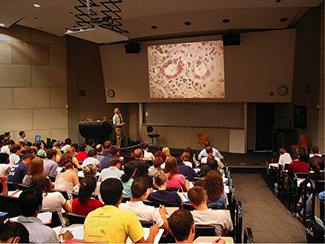
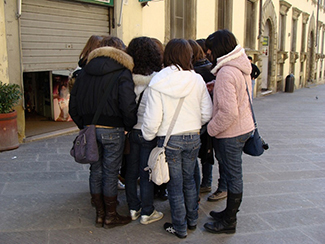

=================
Self-presentation
=================

.. contents::
   :depth: 3
..

.. container::

   By the end of this section, you will be able to: \* Describe social
   roles and how they influence behavior \* Explain what social norms
   are and how they influence behavior \* Define script \* Describe the
   findings of Zimbardo’s Stanford prison experiment

As you’ve learned, social psychology is the study of how people affect
one another’s thoughts, feelings, and behaviors. We have discussed
situational perspectives and social psychology’s emphasis on the ways in
which a person’s environment, including culture and other social
influences, affect behavior. In this section, we examine situational
forces that have a strong influence on human behavior including social
roles, social norms, and scripts. We discuss how humans use the social
environment as a source of information, or cues, on how to behave.
Situational influences on our behavior have important consequences, such
as whether we will help a stranger in an emergency or how we would
behave in an unfamiliar environment.

SOCIAL ROLES
============

One major social determinant of human behavior is our social roles. A
**social role**\ {: data-type=“term”} is a pattern of behavior that is
expected of a person in a given setting or group (Hare, 2003). Each one
of us has several social roles. You may be, at the same time, a student,
a parent, an aspiring teacher, a son or daughter, a spouse, and a
lifeguard. How do these social roles influence your behavior? Social
roles are defined by culturally shared knowledge. That is, nearly
everyone in a given culture knows what behavior is expected of a person
in a given role. For example, what is the social role for a student? If
you look around a college classroom you will likely see students
engaging in studious behavior, taking notes, listening to the professor,
reading the textbook, and sitting quietly at their desks
(`[link] <#CNX_Psych_12_02_classroom>`__). Of course you may see
students deviating from the expected studious behavior such as texting
on their phones or using Facebook on their laptops, but in all cases,
the students that you observe are attending class—a part of the social
role of students.

|A photograph shows students in a classroom.|\ {:
#CNX_Psych_12_02_classroom}

Social roles, and our related behavior, can vary across different
settings. How do you behave when you are engaging in the role of son or
daughter and attending a family function? Now imagine how you behave
when you are engaged in the role of employee at your workplace. It is
very likely that your behavior will be different. Perhaps you are more
relaxed and outgoing with your family, making jokes and doing silly
things. But at your workplace you might speak more professionally, and
although you may be friendly, you are also serious and focused on
getting the work completed. These are examples of how our social roles
influence and often dictate our behavior to the extent that identity and
personality can vary with context (that is, in different social groups)
(Malloy, Albright, Kenny, Agatstein & Winquist, 1997).

SOCIAL NORMS
============

As discussed previously, social roles are defined by a culture’s shared
knowledge of what is expected behavior of an individual in a specific
role. This shared knowledge comes from social norms. A **social
norm**\ {: data-type=“term”} is a group’s expectation of what is
appropriate and acceptable behavior for its members—how they are
supposed to behave and think (Deutsch & Gerard, 1955; Berkowitz, 2004).
How are we expected to act? What are we expected to talk about? What are
we expected to wear? In our discussion of social roles we noted that
colleges have social norms for students’ behavior in the role of student
and workplaces have social norms for employees’ behaviors in the role of
employee. Social norms are everywhere including in families, gangs, and
on social media outlets. What are some social norms on Facebook?

.. container:: psychology connect-the-concepts

   .. container::

      Tweens, Teens, and Social Norms

   My 11-year-old daughter, Jessica, recently told me she needed shorts
   and shirts for the summer, and that she wanted me to take her to a
   store at the mall that is popular with preteens and teens to buy
   them. I have noticed that many girls have clothes from that store, so
   I tried teasing her. I said, “All the shirts say ‘Aero’ on the front.
   If you are wearing a shirt like that and you have a substitute
   teacher, and the other girls are all wearing that type of shirt,
   won’t the substitute teacher think you are all named ‘Aero’?”

   My daughter replied, in typical 11-year-old fashion, “Mom, you are
   not funny. Can we please go shopping?”

   I tried a different tactic. I asked Jessica if having clothing from
   that particular store will make her popular. She replied, “No, it
   will not make me popular. It is what the popular kids wear. It will
   make me feel happier.” How can a label or name brand make someone
   feel happier? Think back to what you’ve learned about **lifespan
   development**\ {: data-type=“term” .no-emphasis}. What is it about
   pre-teens and young teens that make them want to fit in
   (`[link] <#CNX_Psych_12_02_preteens>`__)? Does this change over time?
   Think back to your high school experience, or look around your
   college campus. What is the main name brand clothing you see? What
   messages do we get from the media about how to fit in?

   |A photograph shows a group of young people dressed similarly.|\ {:
   #CNX_Psych_12_02_preteens}

SCRIPTS
=======

Because of social roles, people tend to know what behavior is expected
of them in specific, familiar settings. A **script**\ {:
data-type=“term”} is a person’s knowledge about the sequence of events
expected in a specific setting (Schank & Abelson, 1977). How do you act
on the first day of school, when you walk into an elevator, or are at a
restaurant? For example, at a restaurant in the United States, if we
want the server’s attention, we try to make eye contact. In Brazil, you
would make the sound “psst” to get the server’s attention. You can see
the cultural differences in scripts. To an American, saying “psst” to a
server might seem rude, yet to a Brazilian, trying to make eye contact
might not seem an effective strategy. Scripts are important sources of
information to guide behavior in given situations. Can you imagine being
in an unfamiliar situation and not having a script for how to behave?
This could be uncomfortable and confusing. How could you find out about
social norms in an unfamiliar culture?

ZIMBARDO’S STANFORD PRISON EXPERIMENT
=====================================

The famous **Stanford prison experiment**\ {: data-type=“term”},
conducted by social psychologist Philip **Zimbardo**\ {:
data-type=“term” .no-emphasis} and his colleagues at Stanford
University, demonstrated the power of social roles, social norms, and
scripts. In the summer of 1971, an advertisement was placed in a
California newspaper asking for male volunteers to participate in a
study about the psychological effects of prison life. More than 70 men
volunteered, and these volunteers then underwent psychological testing
to eliminate candidates who had underlying psychiatric issues, medical
issues, or a history of crime or drug abuse. The pool of volunteers was
whittled down to 24 healthy male college students. Each student was paid
$15 per day and was randomly assigned to play the role of either a
prisoner or a guard in the study. Based on what you have learned about
research methods, why is it important that participants were randomly
assigned?

A mock prison was constructed in the basement of the psychology building
at Stanford. Participants assigned to play the role of prisoners were
“arrested” at their homes by Palo Alto police officers, booked at a
police station, and subsequently taken to the mock prison. The
experiment was scheduled to run for several weeks. To the surprise of
the researchers, both the “prisoners” and “guards” assumed their roles
with zeal. In fact, on day 2, some of the prisoners revolted, and the
guards quelled the rebellion by threatening the prisoners with night
sticks. In a relatively short time, the guards came to harass the
prisoners in an increasingly sadistic manner, through a complete lack of
privacy, lack of basic comforts such as mattresses to sleep on, and
through degrading chores and late-night counts.

The prisoners, in turn, began to show signs of severe anxiety and
hopelessness—they began tolerating the guards’ abuse. Even the Stanford
professor who designed the study and was the head researcher, Philip
Zimbardo, found himself acting as if the prison was real and his role,
as prison supervisor, was real as well. After only six days, the
experiment had to be ended due to the participants’ deteriorating
behavior. Zimbardo explained,

   At this point it became clear that we had to end the study. We had
   created an overwhelmingly powerful situation—a situation in which
   prisoners were withdrawing and behaving in pathological ways, and in
   which some of the guards were behaving sadistically. Even the “good”
   guards felt helpless to intervene, and none of the guards quit while
   the study was in progress. Indeed, it should be noted that no guard
   ever came late for his shift, called in sick, left early, or demanded
   extra pay for overtime work. (Zimbardo, 2013) {: display=“block”}

The Stanford prison experiment demonstrated the power of social roles,
norms, and scripts in affecting human behavior. The guards and prisoners
enacted their social roles by engaging in behaviors appropriate to the
roles: The guards gave orders and the prisoners followed orders. Social
norms require guards to be authoritarian and prisoners to be submissive.
When prisoners rebelled, they violated these social norms, which led to
upheaval. The specific acts engaged by the guards and the prisoners
derived from scripts. For example, guards degraded the prisoners by
forcing them do push-ups and by removing all privacy. Prisoners rebelled
by throwing pillows and trashing their cells. Some prisoners became so
immersed in their roles that they exhibited symptoms of mental
breakdown; however, according to Zimbardo, none of the participants
suffered long term harm (Alexander, 2001).

The Stanford Prison Experiment has some parallels with the abuse of
prisoners of war by U.S. Army troops and CIA personnel at the Abu Ghraib
prison in 2003 and 2004. The offenses at Abu **Ghraib**\ {:
data-type=“term” .no-emphasis} were documented by photographs of the
abuse, some taken by the abusers themselves
(`[link] <#CNX_Psych_12_02_AbuGhraib>`__).

|A photograph shows a person standing on a box with arms held out. The
person is covered in shawl-like attire and a full hood that covers the
face completely.|\ {: #CNX_Psych_12_02_AbuGhraib}

.. container:: psychology link-to-learning

   Visit this `website <http://openstax.org/l/Stanford_psych>`__ to hear
   an NPR interview with Philip **Zimbardo**\ {: data-type=“term”
   .no-emphasis} where he discusses the parallels between the Stanford
   prison experiment and the Abu Ghraib prison in Iraq.

Summary
=======

Human behavior is largely influenced by our social roles, norms, and
scripts. In order to know how to act in a given situation, we have
shared cultural knowledge of how to behave depending on our role in
society. Social norms dictate the behavior that is appropriate or
inappropriate for each role. Each social role has scripts that help
humans learn the sequence of appropriate behaviors in a given setting.
The famous Stanford prison experiment is an example of how the power of
the situation can dictate the social roles, norms, and scripts we follow
in a given situation, even if this behavior is contrary to our typical
behavior.

Review Questions
================

.. container::

   .. container::

      A(n) \_______\_ is a set of group expectations for appropriate
      thoughts and behaviors of its members.

      1. social role
      2. social norm
      3. script
      4. attribution {: type=“a”}

   .. container::

      B

.. container::

   .. container::

      On his first day of soccer practice, Jose suits up in a t-shirt,
      shorts, and cleats and runs out to the field to join his
      teammates. Jose’s behavior is reflective of \________.

      1. a script
      2. social influence
      3. good athletic behavior
      4. normative behavior {: type=“a”}

   .. container::

      A

.. container::

   .. container::

      When it comes to buying clothes, teenagers often follow social
      norms; this is likely motivated by \________.

      1. following parents’ rules
      2. saving money
      3. fitting in
      4. looking good {: type=“a”}

   .. container::

      C

.. container::

   .. container::

      In the Stanford prison experiment, even the lead researcher
      succumbed to his role as a prison supervisor. This is an example
      of the power of \_______\_ influencing behavior.

      1. scripts
      2. social norms
      3. conformity
      4. social roles {: type=“a”}

   .. container::

      D

Critical Thinking Questions
===========================

.. container::

   .. container::

      Why didn’t the “good” guards in the Stanford prison experiment
      object to other guards’ abusive behavior? Were the student
      prisoners simply weak people? Why didn’t they object to being
      abused?

   .. container::

      The good guards were fulfilling their social roles and they did
      not object to other guards’ abusive behavior because of the power
      of the situation. In addition, the prison supervisor’s behavior
      sanctioned the guards’ negative treatment of prisoners. The
      prisoners were not weak people; they were recruited because they
      were healthy, mentally stable adults. The power of their social
      role influenced them to engage in subservient prisoner behavior.
      The script for prisoners is to accept abusive behavior from
      authority figures, especially for punishment, when they do not
      follow the rules.

.. container::

   .. container::

      Describe how social roles, social norms, and scripts were evident
      in the Stanford prison experiment. How can this experiment be
      applied to everyday life? Are there any more recent examples where
      people started fulfilling a role and became abusive?

   .. container::

      Social roles were in play as each participant acted out behaviors
      appropriate to his role as prisoner, guard, or supervisor. Scripts
      determined the specific behaviors the guards and prisoners
      displayed, such as humiliation and passivity. The social norms of
      a prison environment sanctions abuse of prisoners since they have
      lost many of their human rights and became the property of the
      government. This experiment can be applied to other situations in
      which social norms, roles, and scripts dictate our behavior, such
      as in mob behavior. A more recent example of similar behavior was
      the abuse of prisoners by American soldiers who were working as
      prison guards at the Abu Ghraib prison in Iraq.

Personal Application Questions
==============================

.. container::

   .. container::

      Try attending a religious service very different from your own and
      see how you feel and behave without knowing the appropriate
      script. Or, try attending an important, personal event that you
      have never attended before, such as a bar mitzvah (a coming-of-age
      ritual in Jewish culture), a quinceañera (in some Latin American
      cultures a party is given to a girl who is turning 15 years old),
      a wedding, a funeral, or a sporting event new to you, such as
      horse racing or bull riding. Observe and record your feelings and
      behaviors in this unfamiliar setting for which you lack the
      appropriate script. Do you silently observe the action, or do you
      ask another person for help interpreting the behaviors of people
      at the event? Describe in what ways your behavior would change if
      you were to attend a similar event in the future?

.. container::

   .. container::

      Name and describe at least three social roles you have adopted for
      yourself. Why did you adopt these roles? What are some roles that
      are expected of you, but that you try to resist?

.. container::

   .. rubric:: Glossary
      :name: glossary

   {: data-type=“glossary-title”}

   script
      person’s knowledge about the sequence of events in a specific
      setting ^
   social norm
      group’s expectations regarding what is appropriate and acceptable
      for the thoughts and behavior of its members ^
   social role
      socially defined pattern of behavior that is expected of a person
      in a given setting or group ^
   stanford prison experiment
      Stanford University conducted an experiment in a mock prison that
      demonstrated the power of social roles, social norms, and scripts

.. |A photograph shows a person standing on a box with arms held out. The person is covered in shawl-like attire and a full hood that covers the face completely.| image:: ../resources/CNX_Psych_12_02_AbuGhraib.jpg
