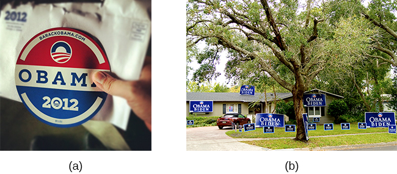

========================
Attitudes and Persuasion
========================

.. contents::
   :depth: 3
..

.. container::

   By the end of this section, you will be able to: \* Define attitude
   \* Describe how people’s attitudes are internally changed through
   cognitive dissonance \* Explain how people’s attitudes are externally
   changed through persuasion \* Describe the peripheral and central
   routes to persuasion

Social psychologists have documented how the power of the situation can
influence our behaviors. Now we turn to how the power of the situation
can influence our attitudes and beliefs. **Attitude**\ {:
data-type=“term”} is our evaluation of a person, an idea, or an object.
We have attitudes for many things ranging from products that we might
pick up in the supermarket to people around the world to political
policies. Typically, attitudes are favorable or unfavorable: positive or
negative (Eagly & Chaiken, 1993). And, they have three components: an
affective component (feelings), a behavioral component (the effect of
the attitude on behavior), and a cognitive component (belief and
knowledge) (Rosenberg & Hovland, 1960).

For example, you may hold a positive attitude toward recycling. This
attitude should result in positive feelings toward recycling (such as
“It makes me feel good to recycle” or “I enjoy knowing that I make a
small difference in reducing the amount of waste that ends up in
landfills”). Certainly, this attitude should be reflected in our
behavior: You actually recycle as often as you can. Finally, this
attitude will be reflected in favorable thoughts (for example,
“Recycling is good for the environment” or “Recycling is the responsible
thing to do”).

Our attitudes and beliefs are not only influenced by external forces,
but also by internal influences that we control. Like our behavior, our
attitudes and thoughts are not always changed by situational pressures,
but they can be consciously changed by our own free will. In this
section we discuss the conditions under which we would want to change
our own attitudes and beliefs.

WHAT IS COGNITIVE DISSONANCE?
=============================

Social psychologists have documented that feeling good about ourselves
and maintaining positive self-esteem is a powerful motivator of human
behavior (Tavris & Aronson, 2008). In the United States, members of the
predominant culture typically think very highly of themselves and view
themselves as good people who are above average on many desirable traits
(Ehrlinger, Gilovich, & Ross, 2005). Often, our behavior, attitudes, and
beliefs are affected when we experience a threat to our self-esteem or
positive self-image. Psychologist Leon Festinger (1957) defined
**cognitive dissonance**\ {: data-type=“term”} as psychological
discomfort arising from holding two or more inconsistent attitudes,
behaviors, or cognitions (thoughts, beliefs, or opinions). Festinger’s
theory of cognitive dissonance states that when we experience a conflict
in our behaviors, attitudes, or beliefs that runs counter to our
positive self-perceptions, we experience psychological discomfort
(dissonance). For example, if you believe smoking is bad for your health
but you continue to smoke, you experience conflict between your belief
and behavior (`[link] <#CNX_Psych_12_03_dissonance>`__).

|A diagram shows the process of cognitive dissonance. Two disparate
statements (“I am a smoker” and “Smoking is bad for your health”) are
joined as an example of cognitive dissonance. A flow diagram joins them
in a process labeled, “Remove dissonance tension,” with two resulting
flows. The first flow path shows the warning on a pack of cigarettes
with a checkmark imposed over the image that is labeled, “Smoking is bad
for your health.” The path then shows a photograph of an arm with a
nicotine patch that is labeled, “I quit smoking.” The second flow path
shows the warning on a pack of cigarettes with an X imposed over the
image and is labeled, “Research is inconclusive,” then shows a
photograph of a person smoking labeled, “I am still a smoker.”|\ {:
#CNX_Psych_12_03_dissonance}

Later research documented that only conflicting cognitions that threaten
individuals’ positive self-image cause dissonance (Greenwald & Ronis,
1978). Additional research found that dissonance is not only
psychologically uncomfortable but also can cause physiological arousal
(Croyle & Cooper, 1983) and activate regions of the brain important in
emotions and cognitive functioning (van Veen, Krug, Schooler, & Carter,
2009). When we experience cognitive dissonance, we are motivated to
decrease it because it is psychologically, physically, and mentally
uncomfortable. We can reduce **cognitive dissonance**\ {:
data-type=“term” .no-emphasis} by bringing our cognitions, attitudes,
and behaviors in line—that is, making them harmonious. This can be done
in different ways, such as:

-  changing our discrepant behavior (e.g., stop smoking),
-  changing our cognitions through rationalization or denial (e.g.,
   telling ourselves that health risks can be reduced by smoking
   filtered cigarettes),
-  adding a new cognition (e.g., “Smoking suppresses my appetite so I
   don’t become overweight, which is good for my health.”).

A classic example of cognitive dissonance is John, a 20-year-old who
enlists in the military. During boot camp he is awakened at 5:00 a.m.,
is chronically sleep deprived, yelled at, covered in sand flea bites,
physically bruised and battered, and mentally exhausted
(`[link] <#CNX_Psych_12_03_marines>`__). It gets worse. Recruits that
make it to week 11 of boot camp have to do 54 hours of continuous
training.

|A photograph shows a person doing pushups while a military leader
stands over the person; other people are doing jumping jacks in the
background.|\ {: #CNX_Psych_12_03_marines}

Not surprisingly, John is miserable. No one likes to be miserable. In
this type of situation, people can change their beliefs, their
attitudes, or their behaviors. The last option, a change of behaviors,
is not available to John. He has signed on to the military for four
years, and he cannot legally leave.

If John keeps thinking about how miserable he is, it is going to be a
very long four years. He will be in a constant state of cognitive
dissonance. As an alternative to this misery, John can change his
beliefs or attitudes. He can tell himself, “I am becoming stronger,
healthier, and sharper. I am learning discipline and how to defend
myself and my country. What I am doing is really important.” If this is
his belief, he will realize that he is becoming stronger through his
challenges. He then will feel better and not experience cognitive
dissonance, which is an uncomfortable state.

The Effect of Initiation
------------------------

The military example demonstrates the observation that a difficult
**initiation**\ {: data-type=“term” .no-emphasis} into a group
influences us to like the group *more*, due to the justification of
effort. We do not want to have wasted time and effort to join a group
that we eventually leave. A classic experiment by Aronson and Mills
(1959) demonstrated this justification of effort effect. College
students volunteered to join a campus group that would meet regularly to
discuss the psychology of sex. Participants were randomly assigned to
one of three conditions: no initiation, an easy initiation, and a
difficult initiation into the group. After participating in the first
discussion, which was deliberately made very boring, participants rated
how much they liked the group. Participants who underwent a difficult
initiation process to join the group rated the group more favorably than
did participants with an easy initiation or no initiation
(`[link] <#CNX_Psych_12_03_justification>`__).

|A bar graph has an x-axis labeled, “Difficulty of initiation” and a
y-axis labeled, “Relative magnitude of liking a group.” The liking of
the group is low to moderate for the groups whose difficulty of
initiation was “none” or “easy,” but high for the group whose difficulty
of initiation was “difficult.”|\ {: #CNX_Psych_12_03_justification}

Similar effects can be seen in a more recent study of how student effort
affects course evaluations. Heckert, Latier, Ringwald-Burton, and Drazen
(2006) surveyed 463 undergraduates enrolled in courses at a midwestern
university about the amount of effort that their courses required of
them. In addition, the students were also asked to evaluate various
aspects of the course. Given what you’ve just read, it will come as no
surprise that those courses that were associated with the highest level
of effort were evaluated as being more valuable than those that did not.
Furthermore, students indicated that they learned more in courses that
required more effort, regardless of the grades that they received in
those courses (Heckert et al., 2006).

Besides the classic military example and group initiation, can you think
of other examples of **cognitive dissonance**\ {: data-type=“term”
.no-emphasis}? Here is one: Marco and Maria live in Fairfield County,
Connecticut, which is one of the wealthiest areas in the United States
and has a very high cost of living. Marco telecommutes from home and
Maria does not work outside of the home. They rent a very small house
for more than $3000 a month. Maria shops at consignment stores for
clothes and economizes where she can. They complain that they never have
any money and that they cannot buy anything new. When asked why they do
not move to a less expensive location, since Marco telecommutes, they
respond that Fairfield County is beautiful, they love the beaches, and
they feel comfortable there. How does the theory of cognitive dissonance
apply to Marco and Maria’s choices?

PERSUASION
==========

In the previous section we discussed that the motivation to reduce
cognitive dissonance leads us to change our attitudes, behaviors, and/or
cognitions to make them consonant. **Persuasion**\ {: data-type=“term”}
is the process of changing our attitude toward something based on some
kind of communication. Much of the persuasion we experience comes from
outside forces. How do people convince others to change their attitudes,
beliefs, and behaviors (`[link] <#CNX_Psych_12_03_persuasion>`__)? What
communications do you receive that attempt to persuade you to change
your attitudes, beliefs, and behaviors?

|A photograph shows the back of a car that is covered in numerous bumper
stickers.|\ {: #CNX_Psych_12_03_persuasion}

A subfield of social psychology studies persuasion and social influence,
providing us with a plethora of information on how humans can be
persuaded by others.

Yale Attitude Change Approach
-----------------------------

The topic of persuasion has been one of the most extensively researched
areas in social psychology (Fiske et al., 2010). During the Second World
War, Carl **Hovland**\ {: data-type=“term” .no-emphasis} extensively
researched persuasion for the U.S. Army. After the war, Hovland
continued his exploration of persuasion at Yale University. Out of this
work came a model called the **Yale attitude change approach**\ {:
data-type=“term” .no-emphasis}, which describes the conditions under
which people tend to change their attitudes. Hovland demonstrated that
certain features of the source of a persuasive message, the content of
the message, and the characteristics of the audience will influence the
persuasiveness of a message (Hovland, Janis, & Kelley, 1953).

Features of the source of the persuasive message include the credibility
of the speaker (Hovland & Weiss, 1951) and the physical attractiveness
of the speaker (Eagly & Chaiken, 1975; Petty, Wegener, & Fabrigar,
1997). Thus, speakers who are credible, or have expertise on the topic,
and who are deemed as trustworthy are more persuasive than less credible
speakers. Similarly, more attractive speakers are more persuasive than
less attractive speakers. The use of famous actors and athletes to
advertise products on television and in print relies on this principle.
The immediate and long term impact of the persuasion also depends,
however, on the credibility of the messenger (Kumkale & Albarracín,
2004).

Features of the message itself that affect persuasion include subtlety
(the quality of being important, but not obvious) (Petty & Cacioppo,
1986; Walster & Festinger, 1962); sidedness (that is, having more than
one side) (Crowley & Hoyer, 1994; Igou & Bless, 2003; Lumsdaine & Janis,
1953); timing (Haugtvedt & Wegener, 1994; Miller & Campbell, 1959), and
whether both sides are presented. Messages that are more subtle are more
persuasive than direct messages. Arguments that occur first, such as in
a debate, are more influential if messages are given back-to-back.
However, if there is a delay after the first message, and before the
audience needs to make a decision, the last message presented will tend
to be more persuasive (Miller & Campbell, 1959).

Features of the audience that affect persuasion are attention
(Albarracín & Wyer, 2001; Festinger & Maccoby, 1964), intelligence,
self-esteem (Rhodes & Wood, 1992), and age (Krosnick & Alwin, 1989). In
order to be persuaded, audience members must be paying attention. People
with lower intelligence are more easily persuaded than people with
higher intelligence; whereas people with moderate self-esteem are more
easily persuaded than people with higher or lower self-esteem (Rhodes &
Wood, 1992). Finally, younger adults aged 18–25 are more persuadable
than older adults.

Elaboration Likelihood Model
----------------------------

An especially popular model that describes the dynamics of persuasion is
the elaboration likelihood model of persuasion (Petty & Cacioppo, 1986).
The **elaboration likelihood model**\ {: data-type=“term” .no-emphasis}
considers the variables of the attitude change approach—that is,
features of the source of the persuasive message, contents of the
message, and characteristics of the audience are used to determine when
attitude change will occur. According to the elaboration likelihood
model of persuasion, there are two main routes that play a role in
delivering a persuasive message: central and peripheral
(`[link] <#CNX_Psych_12_03_Persuasion2>`__).

|A diagram shows two routes of persuasion. A box on the left is labeled
“persuasive message” and arrows from the box separate into two routes:
the central and peripheral routes, each with boxes describing the
characteristics of the audience, processing, and persuasion. The
audience is “motivated, analytical” in the central route, and “not
motivated, not analytical” in the peripheral route. Processing in the
central route is “high effort; evaluate message” and in the peripheral
route is “low effort; persuaded by cues outside of message.” Persuasion
in the central route is “lasting change in attitude” and in the
peripheral route is “temporary change in attitude.”|\ {:
#CNX_Psych_12_03_Persuasion2}

The **central route**\ {: data-type=“term”} is logic driven and uses
data and facts to convince people of an argument’s worthiness. For
example, a car company seeking to persuade you to purchase their model
will emphasize the car’s safety features and fuel economy. This is a
direct route to persuasion that focuses on the quality of the
information. In order for the central route of persuasion to be
effective in changing attitudes, thoughts, and behaviors, the argument
must be strong and, if successful, will result in lasting attitude
change.

The central route to persuasion works best when the target of
persuasion, or the audience, is analytical and willing to engage in
processing of the information. From an advertiser’s perspective, what
products would be best sold using the central route to persuasion? What
audience would most likely be influenced to buy the product? One example
is buying a computer. It is likely, for example, that small business
owners might be especially influenced by the focus on the computer’s
quality and features such as processing speed and memory capacity.

The **peripheral route**\ {: data-type=“term”} is an indirect route that
uses peripheral cues to associate positivity with the message (Petty &
Cacioppo, 1986). Instead of focusing on the facts and a product’s
quality, the peripheral route relies on association with positive
characteristics such as positive emotions and celebrity endorsement. For
example, having a popular athlete advertise athletic shoes is a common
method used to encourage young adults to purchase the shoes. This route
to attitude change does not require much effort or information
processing. This method of persuasion may promote positivity toward the
message or product, but it typically results in less permanent attitude
or behavior change. The audience does not need to be analytical or
motivated to process the message. In fact, a peripheral route to
persuasion may not even be noticed by the audience, for example in the
strategy of product placement. Product placement refers to putting a
product with a clear brand name or brand identity in a TV show or movie
to promote the product (Gupta & Lord, 1998). For example, one season of
the reality series *American Idol* prominently showed the panel of
judges drinking out of cups that displayed the Coca-Cola logo. What
other products would be best sold using the peripheral route to
persuasion? Another example is clothing: A retailer may focus on
celebrities that are wearing the same style of clothing.

Foot-in-the-door Technique
--------------------------

Researchers have tested many persuasion strategies that are effective in
selling products and changing people’s attitude, ideas, and behaviors.
One effective strategy is the foot-in-the-door technique (Cialdini,
2001; Pliner, Hart, Kohl, & Saari, 1974). Using the **foot-in-the-door
technique**\ {: data-type=“term”}, the persuader gets a person to agree
to bestow a small favor or to buy a small item, only to later request a
larger favor or purchase of a bigger item. The foot-in-the-door
technique was demonstrated in a study by Freedman and Fraser (1966) in
which participants who agreed to post small sign in their yard or sign a
petition were more likely to agree to put a large sign in their yard
than people who declined the first request
(`[link] <#CNX_Psych_12_03_signs>`__). Research on this technique also
illustrates the principle of consistency (Cialdini, 2001): Our past
behavior often directs our future behavior, and we have a desire to
maintain consistency once we have a committed to a behavior.

|Photograph A shows a campaign button. Photograph B shows a yard filled
with numerous signs.|\ {: #CNX_Psych_12_03_signs}

A common application of foot-in-the-door is when teens ask their parents
for a small permission (for example, extending curfew by a half hour)
and then asking them for something larger. Having granted the smaller
request increases the likelihood that parents will acquiesce with the
later, larger request.

How would a store owner use the foot-in-the-door technique to sell you
an expensive product? For example, say that you are buying the latest
model smartphone, and the salesperson suggests you purchase the best
data plan. You agree to this. The salesperson then suggests a bigger
purchase—the three-year extended warranty. After agreeing to the smaller
request, you are more likely to also agree to the larger request. You
may have encountered this if you have bought a car. When salespeople
realize that a buyer intends to purchase a certain model, they might try
to get the customer to pay for many or most available options on the
car.

Summary
=======

Attitudes are our evaluations or feelings toward a person, idea, or
object and typically are positive or negative. Our attitudes and beliefs
are influenced not only by external forces, but also by internal
influences that we control. An internal form of attitude change is
cognitive dissonance or the tension we experience when our thoughts,
feelings, and behaviors are in conflict. In order to reduce dissonance,
individuals can change their behavior, attitudes, or cognitions, or add
a new cognition. External forces of persuasion include advertising; the
features of advertising that influence our behaviors include the source,
message, and audience. There are two primary routes to persuasion. The
central route to persuasion uses facts and information to persuade
potential consumers. The peripheral route uses positive association with
cues such as beauty, fame, and positive emotions.

Review Questions
================

.. container::

   .. container::

      Attitudes describe our \_______\_ of people, objects, and ideas.

      1. treatment
      2. evaluations
      3. cognitions
      4. knowledge {: type=“a”}

   .. container::

      B

.. container::

   .. container::

      Cognitive dissonance causes discomfort because it disrupts our
      sense of \________.

      1. dependency
      2. unpredictability
      3. consistency
      4. power {: type=“a”}

   .. container::

      C

.. container::

   .. container::

      In order for the central route to persuasion to be effective, the
      audience must be \_______\_ and \________.

      1. analytical; motivated
      2. attentive; happy
      3. intelligent; unemotional
      4. gullible; distracted {: type=“a”}

   .. container::

      A

.. container::

   .. container::

      Examples of cues used in peripheral route persuasion include all
      of the following *except* \________.

      1. celebrity endorsement
      2. positive emotions
      3. attractive models
      4. factual information {: type=“a”}

   .. container::

      D

Critical Thinking Questions
===========================

.. container::

   .. container::

      Give an example (one *not* used in class or your text) of
      cognitive dissonance and how an individual might resolve this.

   .. container::

      One example is choosing which college to attend—the public school
      close to home or the Ivy League school out of state. Since both
      schools are desirable, the student is likely to experience
      cognitive dissonance in making this decision. In order to justify
      choosing the public school close to home, the student could change
      her cognition about Ivy League school, asserting that it is too
      expensive and the quality of education at the public school is
      just as good. She could change her attitude toward the Ivy League
      school and determine that the students there are too stuffy and
      wouldn’t make good classmates.

.. container::

   .. container::

      Imagine that you work for an advertising agency, and you’ve been
      tasked with developing an advertising campaign to increase sales
      of Bliss Soda. How would you develop an advertisement for this
      product that uses a central route of persuasion? How would you
      develop an ad using a peripheral route of persuasion?

   .. container::

      Although potential answers will vary, advertisements using the
      central route of persuasion might involve a doctor listing logical
      reasons for drinking this product. For example, the doctor might
      cite research suggesting that the soda is better than alternatives
      because of its reduced calorie content, lack of adverse health
      consequences, etc. An advertisement using a peripheral route of
      persuasion might show very attractive people consuming the product
      while spending time on a beautiful, sunny beach.

Personal Application Questions
==============================

.. container::

   .. container::

      Cognitive dissonance often arises after making an important
      decision, called post-decision dissonance (or in popular terms,
      buyer’s remorse). Describe a recent decision you made that caused
      dissonance and describe how you resolved it.

.. container::

   .. container::

      Describe a time when you or someone you know used the
      foot-in-the-door technique to gain someone’s compliance.

.. container::

   .. rubric:: Glossary
      :name: glossary

   {: data-type=“glossary-title”}

   attitude
      evaluations of or feelings toward a person, idea, or object that
      are typically positive or negative ^
   central route persuasion
      logic-driven arguments using data and facts to convince people of
      an argument’s worthiness ^
   cognitive dissonance
      psychological discomfort that arises from a conflict in a person’s
      behaviors, attitudes, or beliefs that runs counter to one’s
      positive self-perception ^
   foot-in-the-door technique
      persuasion of one person by another person, encouraging a person
      to agree to a small favor, or to buy a small item, only to later
      request a larger favor or purchase of a larger item ^
   peripheral route persuasion
      one person persuades another person; an indirect route that relies
      on association of peripheral cues (such as positive emotions and
      celebrity endorsement) to associate positivity with a message ^
   persuasion
      process of changing our attitude toward something based on some
      form of communication

.. |A diagram shows the process of cognitive dissonance. Two disparate statements (“I am a smoker” and “Smoking is bad for your health”) are joined as an example of cognitive dissonance. A flow diagram joins them in a process labeled, “Remove dissonance tension,” with two resulting flows. The first flow path shows the warning on a pack of cigarettes with a checkmark imposed over the image that is labeled, “Smoking is bad for your health.” The path then shows a photograph of an arm with a nicotine patch that is labeled, “I quit smoking.” The second flow path shows the warning on a pack of cigarettes with an X imposed over the image and is labeled, “Research is inconclusive,” then shows a photograph of a person smoking labeled, “I am still a smoker.”| image:: ../resources/CNX_Psych_12_03_dissonance.jpg
.. |A photograph shows a person doing pushups while a military leader stands over the person; other people are doing jumping jacks in the background.| image:: ../resources/CNX_Psych_12_03_marinesn.jpg
.. |A bar graph has an x-axis labeled, “Difficulty of initiation” and a y-axis labeled, “Relative magnitude of liking a group.” The liking of the group is low to moderate for the groups whose difficulty of initiation was “none” or “easy,” but high for the group whose difficulty of initiation was “difficult.”| image:: ../resources/CNX_Psych_12_03_justification.jpg

.. |A diagram shows two routes of persuasion. A box on the left is labeled “persuasive message” and arrows from the box separate into two routes: the central and peripheral routes, each with boxes describing the characteristics of the audience, processing, and persuasion. The audience is “motivated, analytical” in the central route, and “not motivated, not analytical” in the peripheral route. Processing in the central route is “high effort; evaluate message” and in the peripheral route is “low effort; persuaded by cues outside of message.” Persuasion in the central route is “lasting change in attitude” and in the peripheral route is “temporary change in attitude.”| image:: ../resources/CNX_Psych_12_03_Persuasion2.jpg

