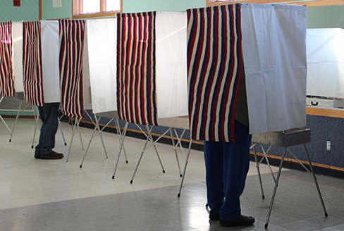
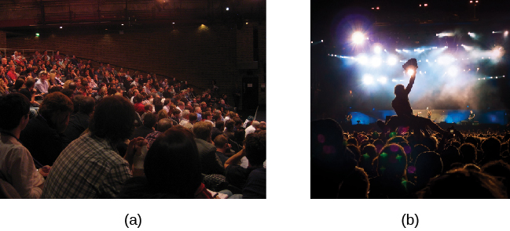
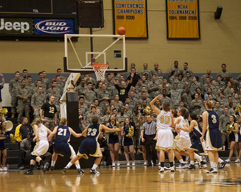

=====================================
Conformity, Compliance, and Obedience
=====================================

.. contents::
   :depth: 3
..

.. container::

   By the end of this section, you will be able to: \* Explain the Asch
   effect \* Define conformity and types of social influence \* Describe
   Stanley Milgram’s experiment and its implications \* Define
   groupthink, social facilitation, and social loafing

In this section, we discuss additional ways in which people influence
others. The topics of conformity, social influence, obedience, and group
processes demonstrate the power of the social situation to change our
thoughts, feelings, and behaviors. We begin this section with a
discussion of a famous social psychology experiment that demonstrated
how susceptible humans are to outside social pressures.

CONFORMITY
==========

Solomon **Asch**\ {: data-type=“term” .no-emphasis} conducted several
experiments in the 1950s to determine how people are affected by the
thoughts and behaviors of other people. In one study, a group of
participants was shown a series of printed line segments of different
lengths: a, b, and c (`[link] <#CNX_Psych_12_04_Asch>`__). Participants
were then shown a fourth line segment: x. They were asked to identify
which line segment from the first group (a, b, or c) most closely
resembled the fourth line segment in length.

|A drawing has two boxes: in the first is a line labeled “x” and in the
second are three lines of different lengths from each other, labeled
“a,” “b,” and “c.”|\ {: #CNX_Psych_12_04_Asch}

Each group of participants had only one true, naïve subject. The
remaining members of the group were confederates of the researcher. A
**confederate**\ {: data-type=“term”} is a person who is aware of the
experiment and works for the researcher. Confederates are used to
manipulate social situations as part of the research design, and the
true, naïve participants believe that confederates are, like them,
uninformed participants in the experiment. In Asch’s study, the
confederates identified a line segment that was obviously shorter than
the target line—a wrong answer. The naïve participant then had to
identify aloud the line segment that best matched the target line
segment.

How often do you think the true participant aligned with the
confederates’ response? That is, how often do you think the group
influenced the participant, and the participant gave the wrong answer?
Asch (1955) found that 76% of participants conformed to group pressure
at least once by indicating the incorrect line. **Conformity**\ {:
data-type=“term”} is the change in a person’s behavior to go along with
the group, even if he does not agree with the group. Why would people
give the wrong answer? What factors would increase or decrease someone
giving in or conforming to group pressure?

The **Asch effect**\ {: data-type=“term”} is the influence of the group
majority on an individual’s judgment.

What factors make a person more likely to yield to group pressure?
Research shows that the size of the majority, the presence of another
dissenter, and the public or relatively private nature of responses are
key influences on conformity.

-  The size of the majority: The greater the number of people in the
   majority, the more likely an individual will conform. There is,
   however, an upper limit: a point where adding more members does not
   increase conformity. In Asch’s study, conformity increased with the
   number of people in the majority—up to seven individuals. At numbers
   beyond seven, conformity leveled off and decreased slightly (Asch,
   1955).
-  The presence of another dissenter: If there is at least one
   dissenter, conformity rates drop to near zero (Asch, 1955).
-  The public or private nature of the responses: When responses are
   made publicly (in front of others), conformity is more likely;
   however, when responses are made privately (e.g., writing down the
   response), conformity is less likely (Deutsch & Gerard, 1955).

The finding that conformity is more likely to occur when responses are
public than when they are private is the reason government elections
require voting in secret, so we are not coerced by others
(`[link] <#CNX_Psych_12_04_voting>`__). The **Asch effect**\ {:
data-type=“term” .no-emphasis} can be easily seen in children when they
have to publicly vote for something. For example, if the teacher asks
whether the children would rather have extra recess, no homework, or
candy, once a few children vote, the rest will comply and go with the
majority. In a different classroom, the majority might vote differently,
and most of the children would comply with that majority. When someone’s
vote changes if it is made in public versus private, this is known as
compliance. Compliance can be a form of conformity. Compliance is going
along with a request or demand, even if you do not agree with the
request. In Asch’s studies, the participants complied by giving the
wrong answers, but privately did not accept that the obvious wrong
answers were correct.

|A photograph shows a row of curtained voting booths; two are occupied
by people.|\ {: #CNX_Psych_12_04_voting}

Now that you have learned about the Asch line experiments, why do you
think the participants conformed? The correct answer to the line segment
question was obvious, and it was an easy task. Researchers have
categorized the motivation to conform into two types: normative social
influence and informational social influence (Deutsch & Gerard, 1955).

In **normative social influence**\ {: data-type=“term”}, people conform
to the group norm to fit in, to feel good, and to be accepted by the
group. However, with **informational social influence**\ {:
data-type=“term”}, people conform because they believe the group is
competent and has the correct information, particularly when the task or
situation is ambiguous. What type of social influence was operating in
the Asch conformity studies? Since the line judgment task was
unambiguous, participants did not need to rely on the group for
information. Instead, participants complied to fit in and avoid
ridicule, an instance of normative social influence.

An example of informational social influence may be what to do in an
emergency situation. Imagine that you are in a movie theater watching a
film and what seems to be smoke comes in the theater from under the
emergency exit door. You are not certain that it is smoke—it might be a
special effect for the movie, such as a fog machine. When you are
uncertain you will tend to look at the behavior of others in the
theater. If other people show concern and get up to leave, you are
likely to do the same. However, if others seem unconcerned, you are
likely to stay put and continue watching the movie
(`[link] <#CNX_Psych_12_04_audience>`__).

|Photograph A shows people seated in an auditorium. Photograph B shows a
person crowd surfing.|\ {: #CNX_Psych_12_04_audience}

How would you have behaved if you were a participant in Asch’s study?
Many students say they would not conform, that the study is outdated,
and that people nowadays are more independent. To some extent this may
be true. Research suggests that overall rates of conformity may have
reduced since the time of Asch’s research. Furthermore, efforts to
replicate Asch’s study have made it clear that many factors determine
how likely it is that someone will demonstrate conformity to the group.
These factors include the participant’s age, gender, and socio-cultural
background (Bond & Smith, 1996; Larsen, 1990; Walker & Andrade, 1996).

.. container:: psychology link-to-learning

   Watch this `video <http://openstax.org/l/Asch2>`__ to see a
   replication of the Asch experiment.

STANLEY MILGRAM’S EXPERIMENT
============================

Conformity is one effect of the influence of others on our thoughts,
feelings, and behaviors. Another form of social influence is obedience
to authority. **Obedience**\ {: data-type=“term”} is the change of an
individual’s behavior to comply with a demand by an authority figure.
People often comply with the request because they are concerned about a
consequence if they do not comply. To demonstrate this phenomenon, we
review another classic social psychology experiment.

Stanley **Milgram**\ {: data-type=“term” .no-emphasis} was a social
psychology professor at Yale who was influenced by the trial of Adolf
Eichmann, a Nazi war criminal. Eichmann’s defense for the atrocities he
committed was that he was “just following orders.” Milgram (1963) wanted
to test the validity of this defense, so he designed an experiment and
initially recruited 40 men for his experiment. The volunteer
participants were led to believe that they were participating in a study
to improve learning and memory. The participants were told that they
were to teach other students (learners) correct answers to a series of
test items. The participants were shown how to use a device that they
were told delivered electric shocks of different intensities to the
learners. The participants were told to shock the learners if they gave
a wrong answer to a test item—that the shock would help them to learn.
The participants gave (or believed they gave) the learners shocks, which
increased in 15-volt increments, all the way up to 450 volts. The
participants did not know that the learners were confederates and that
the confederates did not actually receive shocks.

In response to a string of incorrect answers from the learners, the
participants obediently and repeatedly shocked them. The confederate
learners cried out for help, begged the participant teachers to stop,
and even complained of heart trouble. Yet, when the researcher told the
participant-teachers to continue the shock, 65% of the participants
continued the shock to the maximum voltage and to the point that the
learner became unresponsive (`[link] <#CNX_Psych_12_04_milgram>`__).
What makes someone obey authority to the point of potentially causing
serious harm to another person?

|A graph shows the voltage of shock given on the x-axis, and the
percentage of participants who delivered voltage on the y-axis. All or
nearly all participants delivered slight to moderate shock (15–135
volts); with strong to very strong shock (135–255 volts), the
participation percentage dropped to about 80%; with intense to extremely
intense shock (255–375 volts), the participation percentage dropped to
about 65%; the participation percentage remained at about 65% for severe
shock (375–435 volts) and XXX (435–450 volts).|\ {:
#CNX_Psych_12_04_milgram}

Several variations of the original **Milgram**\ {: data-type=“term”
.no-emphasis} experiment were conducted to test the boundaries of
obedience. When certain features of the situation were changed,
participants were less likely to continue to deliver shocks (Milgram,
1965). For example, when the setting of the experiment was moved to an
office building, the percentage of participants who delivered the
highest shock dropped to 48%. When the learner was in the same room as
the teacher, the highest shock rate dropped to 40%. When the teachers’
and learners’ hands were touching, the highest shock rate dropped to
30%. When the researcher gave the orders by phone, the rate dropped to
23%. These variations show that when the humanity of the person being
shocked was increased, obedience decreased. Similarly, when the
authority of the experimenter decreased, so did obedience.

This case is still very applicable today. What does a person do if an
authority figure orders something done? What if the person believes it
is incorrect, or worse, unethical? In a study by Martin and Bull (2008),
midwives privately filled out a questionnaire regarding best practices
and expectations in delivering a baby. Then, a more senior midwife and
supervisor asked the junior midwives to do something they had previously
stated they were opposed to. Most of the junior midwives were obedient
to authority, going against their own beliefs.

GROUPTHINK
==========

When in group settings, we are often influenced by the thoughts,
feelings, and behaviors around us. Whether it is due to normative or
informational social influence, groups have power to influence
individuals. Another phenomenon of group conformity is groupthink.
**Groupthink**\ {: data-type=“term”} is the modification of the opinions
of members of a group to align with what they believe is the group
consensus (Janis, 1972). In group situations, the group often takes
action that individuals would not perform outside the group setting
because groups make more extreme decisions than individuals do.
Moreover, groupthink can hinder opposing trains of thought. This
elimination of diverse opinions contributes to faulty decision by the
group.

.. container:: psychology dig-deeper

   .. container::

      Groupthink in the U.S. Government

   There have been several instances of groupthink in the U.S.
   government. One example occurred when the United States led a small
   coalition of nations to invade Iraq in March 2003. This invasion
   occurred because a small group of advisors and former President
   George W. Bush were convinced that Iraq represented a significant
   terrorism threat with a large stockpile of weapons of mass
   destruction at its disposal. Although some of these individuals may
   have had some doubts about the credibility of the information
   available to them at the time, in the end, the group arrived at a
   consensus that Iraq had weapons of mass destruction and represented a
   significant threat to national security. It later came to light that
   Iraq did not have weapons of mass destruction, but not until the
   invasion was well underway. As a result, 6000 American soldiers were
   killed and many more civilians died. How did the Bush administration
   arrive at their conclusions? Here is a video of Colin Powell
   discussing the information he had, 10 years after his famous United
   Nations speech,

   https://www.youtube.com/watch?v=vU6KMYlDyWc (“Colin Powell regrets,”
   2011).

   Do you see evidence of groupthink?

Why does groupthink occur? There are several causes of groupthink, which
makes it preventable. When the group is highly cohesive, or has a strong
sense of connection, maintaining group harmony may become more important
to the group than making sound decisions. If the group leader is
directive and makes his opinions known, this may discourage group
members from disagreeing with the leader. If the group is isolated from
hearing alternative or new viewpoints, groupthink may be more likely.
How do you know when groupthink is occurring?

There are several symptoms of groupthink including the following:

-  perceiving the group as invulnerable or invincible—believing it can
   do no wrong
-  believing the group is morally correct
-  self-censorship by group members, such as withholding information to
   avoid disrupting the group consensus
-  the quashing of dissenting group members’ opinions
-  the shielding of the group leader from dissenting views
-  perceiving an illusion of unanimity among group members
-  holding stereotypes or negative attitudes toward the out-group or
   others’ with differing viewpoints (Janis, 1972)

Given the causes and symptoms of groupthink, how can it be avoided?
There are several strategies that can improve group decision making
including seeking outside opinions, voting in private, having the leader
withhold position statements until all group members have voiced their
views, conducting research on all viewpoints, weighing the costs and
benefits of all options, and developing a contingency plan (Janis, 1972;
Mitchell & Eckstein, 2009).

GROUP POLARIZATION
==================

Another phenomenon that occurs within group settings is group
polarization. **Group polarization**\ {: data-type=“term”} (Teger &
Pruitt, 1967) is the strengthening of an original group attitude after
the discussion of views within a group. That is, if a group initially
favors a viewpoint, after discussion the group consensus is likely a
stronger endorsement of the viewpoint. Conversely, if the group was
initially opposed to a viewpoint, group discussion would likely lead to
stronger opposition. Group polarization explains many actions taken by
groups that would not be undertaken by individuals. Group polarization
can be observed at political conventions, when platforms of the party
are supported by individuals who, when not in a group, would decline to
support them. A more everyday example is a group’s discussion of how
attractive someone is. Does your opinion change if you find someone
attractive, but your friends do not agree? If your friends vociferously
agree, might you then find this person even more attractive?

Social Facilitation
-------------------

Not all intergroup interactions lead to the negative outcomes we have
described. Sometimes being in a group situation can improve performance.
**Social facilitation**\ {: data-type=“term”} occurs when an individual
performs better when an audience is watching than when the individual
performs the behavior alone. This typically occurs when people are
performing a task for which they are skilled. Can you think of an
example in which having an audience could improve performance? One
common example is sports. Skilled basketball players will be more likely
to make a free throw basket when surrounded by a cheering audience than
when playing alone in the gym (`[link] <#CNX_Psych_12_04_freethrow>`__).
However, there are instances when even skilled athletes can have
difficulty under pressure. For example, if an athlete is less skilled or
nervous about making a free throw, having an audience may actually
hinder rather than help. In sum, social facilitation is likely to occur
for easy tasks, or tasks at which we are skilled, but worse performance
may occur when performing in front of others, depending on the task.

|A photograph shows a basketball game.|\ {: #CNX_Psych_12_04_freethrow}

Social Loafing
--------------

Another way in which a group presence can affect our performance is
social loafing. **Social loafing**\ {: data-type=“term”} is the exertion
of less effort by a person working together with a group. Social loafing
occurs when our individual performance cannot be evaluated separately
from the group. Thus, group performance declines on easy tasks (Karau &
Williams, 1993). Essentially individual group members loaf and let other
group members pick up the slack. Because each individual’s efforts
cannot be evaluated, individuals become less motivated to perform well.
For example, consider a group of people cooperating to clean litter from
the roadside. Some people will exert a great amount of effort, while
others will exert little effort. Yet the entire job gets done, and it
may not be obvious who worked hard and who didn’t.

As a college student you may have experienced social loafing while
working on a group project. Have you ever had to contribute more than
your fair share because your fellow group members weren’t putting in the
work? This may happen when a professor assigns a group grade instead of
individual grades. If the professor doesn’t know how much effort each
student contributed to a project, some students may be inclined to let
more conscientious students do more of the work. The chance of social
loafing in student work groups increases as the size of the group
increases (Shepperd & Taylor, 1999).

Interestingly, the opposite of social loafing occurs when the task is
complex and difficult (Bond & Titus, 1983; Geen, 1989). Remember the
previous discussion of choking under pressure? This happens when you
perform a difficult task and your individual performance can be
evaluated. In a group setting, such as the student work group, if your
individual performance cannot be evaluated, there is less pressure for
you to do well, and thus less anxiety or physiological arousal (Latané,
Williams, & Harkens, 1979). This puts you in a relaxed state in which
you can perform your best, if you choose (Zajonc, 1965). If the task is
a difficult one, many people feel motivated and believe that their group
needs their input to do well on a challenging project (Jackson &
Williams, 1985). Given what you learned about social loafing, what
advice would you give a new professor about how to design group
projects? If you suggested that individuals’ efforts should not be
evaluated, to prevent the anxiety of choking under pressure, but that
the task must be challenging, you have a good understanding of the
concepts discussed in this section. Alternatively, you can suggest that
individuals’ efforts should be evaluated, but the task should be easy so
as to facilitate performance. Good luck trying to convince your
professor to only assign easy projects.

`[link] <#Table_12_04_01>`__ summarizes the types of social influence
you have learned about in this chapter.

.. raw:: html

   <table id="Table_12_04_01" summary="This table has two columns and ten rows. The first row is a header row with these headings: “Types of social influence” and “Description.” Row 2 describes “conformity” as “Changing your behavior to go along with the group even if you do not agree with the group.” Row 3 describes “Compliance” as “Going along with a request or demand.” Row 4 describes “Normative social influence” as “Conformity to a group norm to fit in, feel good, and be accepted by the group.” Row 5 describes “Informational social influence” as “Conformity to a group norm prompted by the belief that the group is competent and has the correct information.” Row 6 describes “Obedience” as “Changing your behavior to please an authority figure or to avoid aversive consequences.” Row 7 describes “Groupthink” as “Group members modify their opinions to match what they believe is the group consensus.” Row 8 describes “Group polarization” as “Strengthening of the original group attitude after discussing views within a group.” Row 9 describes “Social facilitation” as “Improved performance when an audience is watching versus when the individual performs the behavior alone.” Row 10 describes “Social loafing ” as “Exertion of less effort by a person working in a group because individual performance cannot be evaluated separately from the group, thus causing performance decline on easy tasks.”">

.. raw:: html

   <caption>

Types of Social Influence

.. raw:: html

   </caption>

.. raw:: html

   <colgroup>

.. raw:: html

   <col data-width="200" />

.. raw:: html

   <col data-width="400" />

.. raw:: html

   </colgroup>

.. raw:: html

   <thead>

.. raw:: html

   <tr>

.. raw:: html

   <th data-align="center">

Type of Social Influence

.. raw:: html

   </th>

.. raw:: html

   <th data-align="center">

Description

.. raw:: html

   </th>

.. raw:: html

   </tr>

.. raw:: html

   </thead>

.. raw:: html

   <tbody>

.. raw:: html

   <tr>

.. raw:: html

   <td>

Conformity

.. raw:: html

   </td>

.. raw:: html

   <td>

Changing your behavior to go along with the group even if you do not
agree with the group

.. raw:: html

   </td>

.. raw:: html

   </tr>

.. raw:: html

   <tr>

.. raw:: html

   <td>

Compliance

.. raw:: html

   </td>

.. raw:: html

   <td>

Going along with a request or demand

.. raw:: html

   </td>

.. raw:: html

   </tr>

.. raw:: html

   <tr>

.. raw:: html

   <td>

Normative social influence

.. raw:: html

   </td>

.. raw:: html

   <td>

Conformity to a group norm to fit in, feel good, and be accepted by the
group

.. raw:: html

   </td>

.. raw:: html

   </tr>

.. raw:: html

   <tr>

.. raw:: html

   <td>

Informational social influence

.. raw:: html

   </td>

.. raw:: html

   <td>

Conformity to a group norm prompted by the belief that the group is
competent and has the correct information

.. raw:: html

   </td>

.. raw:: html

   </tr>

.. raw:: html

   <tr>

.. raw:: html

   <td>

Obedience

.. raw:: html

   </td>

.. raw:: html

   <td>

Changing your behavior to please an authority figure or to avoid
aversive consequences

.. raw:: html

   </td>

.. raw:: html

   </tr>

.. raw:: html

   <tr>

.. raw:: html

   <td>

Groupthink

.. raw:: html

   </td>

.. raw:: html

   <td>

Group members modify their opinions to match what they believe is the
group consensus

.. raw:: html

   </td>

.. raw:: html

   </tr>

.. raw:: html

   <tr>

.. raw:: html

   <td>

Group polarization

.. raw:: html

   </td>

.. raw:: html

   <td>

Strengthening of the original group attitude after discussing views
within a group

.. raw:: html

   </td>

.. raw:: html

   </tr>

.. raw:: html

   <tr>

.. raw:: html

   <td>

Social facilitation

.. raw:: html

   </td>

.. raw:: html

   <td>

Improved performance when an audience is watching versus when the
individual performs the behavior alone

.. raw:: html

   </td>

.. raw:: html

   </tr>

.. raw:: html

   <tr>

.. raw:: html

   <td>

Social loafing

.. raw:: html

   </td>

.. raw:: html

   <td>

Exertion of less effort by a person working in a group because
individual performance cannot be evaluated separately from the group,
thus causing performance decline on easy tasks

.. raw:: html

   </td>

.. raw:: html

   </tr>

.. raw:: html

   </tbody>

.. raw:: html

   </table>

Summary
=======

The power of the situation can lead people to conform, or go along with
the group, even in the face of inaccurate information. Conformity to
group norms is driven by two motivations, the desire to fit in and be
liked and the desire to be accurate and gain information from the group.
Authority figures also have influence over our behaviors, and many
people become obedient and follow orders even if the orders are contrary
to their personal values. Conformity to group pressures can also result
in groupthink, or the faulty decision-making process that results from
cohesive group members trying to maintain group harmony. Group
situations can improve human behavior through facilitating performance
on easy tasks, but inhibiting performance on difficult tasks. The
presence of others can also lead to social loafing when individual
efforts cannot be evaluated.

Review Questions
================

.. container::

   .. container::

      In the Asch experiment, participants conformed due to \_______\_
      social influence.

      1. informational
      2. normative
      3. inspirational
      4. persuasive {: type=“a”}

   .. container::

      B

.. container::

   .. container::

      Under what conditions will informational social influence be more
      likely?

      1. when individuals want to fit in
      2. when the answer is unclear
      3. when the group has expertise
      4. both b and c {: type=“a”}

   .. container::

      D

.. container::

   .. container::

      Social loafing occurs when \________.

      1. individual performance cannot be evaluated
      2. the task is easy
      3. both a and b
      4. none of the above {: type=“a”}

   .. container::

      C

.. container::

   .. container::

      If group members modify their opinions to align with a perceived
      group consensus, then \_______\_ has occurred.

      1. group cohesion
      2. social facilitation
      3. groupthink
      4. social loafing {: type=“a”}

   .. container::

      C

Critical Thinking Questions
===========================

.. container::

   .. container::

      Describe how seeking outside opinions can prevent groupthink.

   .. container::

      Outsiders can serve as a quality control by offering diverse views
      and views that may differ from the leader’s opinion. The outsider
      can also remove the illusion of invincibility by having the
      group’s action held up to outside scrutiny. An outsider may offer
      additional information and uncover information that group members
      withheld.

.. container::

   .. container::

      Compare and contrast social loafing and social facilitation.

   .. container::

      In social loafing individual performance cannot be evaluated;
      however, in social facilitation individual performance can be
      evaluated. Social loafing and social facilitation both occur for
      easy or well-known tasks and when individuals are relaxed.

Personal Application Questions
==============================

.. container::

   .. container::

      Conduct a conformity study the next time you are in an elevator.
      After you enter the elevator, stand with your back toward the
      door. See if others conform to your behavior. Watch this
      `video <https://www.youtube.com/watch?v=dDAbdMv14Is>`__ for a
      candid camera demonstration of this phenomenon. Did your results
      turn out as expected?

.. container::
   :name: eip-idm34308320

   .. container::
      :name: eip-idm34082016

      Most students adamantly state that they would never have turned up
      the voltage in the Milligram experiment. Do you think you would
      have refused to shock the learner? Looking at your own past
      behavior, what evidence suggests that you would go along with the
      order to increase the voltage?

.. container::

   .. rubric:: Glossary
      :name: glossary

   {: data-type=“glossary-title”}

   Asch effect
      group majority influences an individual’s judgment, even when that
      judgment is inaccurate ^
   confederate
      person who works for a researcher and is aware of the experiment,
      but who acts as a participant; used to manipulate social
      situations as part of the research design ^
   conformity
      when individuals change their behavior to go along with the group
      even if they do not agree with the group ^
   group polarization
      strengthening of the original group attitude after discussing
      views within the group ^
   groupthink
      group members modify their opinions to match what they believe is
      the group consensus ^
   informational social influence
      conformity to a group norm prompted by the belief that the group
      is competent and has the correct information ^
   normative social influence
      conformity to a group norm to fit in, feel good, and be accepted
      by the group ^
   obedience
      change of behavior to please an authority figure or to avoid
      aversive consequences ^
   social facilitation
      improved performance when an audience is watching versus when the
      individual performs the behavior alone ^
   social loafing
      exertion of less effort by a person working in a group because
      individual performance cannot be evaluated separately from the
      group, thus causing performance decline on easy tasks

.. |A drawing has two boxes: in the first is a line labeled “x” and in the second are three lines of different lengths from each other, labeled “a,” “b,” and “c.”| image:: ../resources/CNX_Psych_12_04_Asch.jpg

.. |A graph shows the voltage of shock given on the x-axis, and the percentage of participants who delivered voltage on the y-axis. All or nearly all participants delivered slight to moderate shock (15–135 volts); with strong to very strong shock (135–255 volts), the participation percentage dropped to about 80%; with intense to extremely intense shock (255–375 volts), the participation percentage dropped to about 65%; the participation percentage remained at about 65% for severe shock (375–435 volts) and XXX (435–450 volts).| image:: ../resources/CNX_Psych_12_04_milgram.jpg

