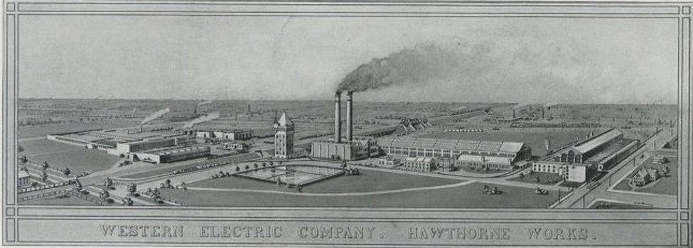
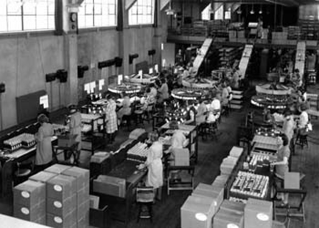

=================================================
What Is Industrial and Organizational Psychology?
=================================================

.. contents::
   :depth: 3
..

.. container::

   By the end of this section, you will be able to: \* Understand the
   scope of study in the field of industrial and organizational
   psychology \* Describe the history of industrial and organizational
   psychology

In 2012, people who worked in the United States spent an average of 56.4
hours per week working (Bureau of Labor Statistics—U.S. Department of
Labor, 2013). Sleeping was the only other activity they spent more time
on with an average of 61.2 hours per week. The workday is a significant
portion of workers’ time and energy. It impacts their lives and their
family’s lives in positive and negative physical and psychological ways.
**Industrial and organizational (I-O) psychology**\ {: data-type=“term”}
is a branch of psychology that studies how human behavior and psychology
affect work and how they are affected by work.

Industrial and organizational psychologists work in four main contexts:
academia, government, consulting firms, and business. Most I-O
psychologists have a master’s or doctorate degree. The field of I-O
psychology can be divided into three broad areas
(`[link] <#CNX_Psych_13_01_IOTypes>`__ and
`[link] <#CNX_Psych_13_01_HumFact>`__): industrial, organizational, and
human factors. **Industrial psychology**\ {: data-type=“term”} is
concerned with describing job requirements and assessing individuals for
their ability to meet those requirements. In addition, once employees
are hired, industrial psychology studies and develops ways to train,
evaluate, and respond to those evaluations. As a consequence of its
concern for candidate characteristics, industrial psychology must also
consider issues of legality regarding discrimination in hiring.
**Organizational psychology**\ {: data-type=“term”} is a discipline
interested in how the relationships among employees affect those
employees and the performance of a business. This includes studying
worker satisfaction, motivation, and commitment. This field also studies
management, leadership, and organizational culture, as well as how an
organization’s structures, management and leadership styles, social
norms, and role expectations affect individual behavior. As a result of
its interest in worker wellbeing and relationships, organizational
psychology also considers the subjects of harassment, including sexual
harassment, and workplace violence. **Human factors psychology**\ {:
data-type=“term”} is the study of how workers interact with the tools of
work and how to design those tools to optimize workers’ productivity,
safety, and health. These studies can involve interactions as
straightforward as the fit of a desk, chair, and computer to a human
having to sit on the chair at the desk using the computer for several
hours each day. They can also include the examination of how humans
interact with complex displays and their ability to interpret them
accurately and quickly. In Europe, this field is referred to as
ergonomics.

|Photograph A shows two people sitting across from one another and
conversing. Photograph B shows a room full of people sitting in front of
computers.|\ {: #CNX_Psych_13_01_IOTypes}

|An illustration shows a person seated at a desk. Measurements are
provided showing the proper distance and angle from work equipment. The
labels are as follows: Viewing distance from head to monitor should be
19–24 inches.” For the viewing angle, the eyes should be about level
with the top of the screen. The chair should provide lumbar support for
the lower back. The forearm and upper arm should be at a 90 degree
angle, with wrists straight over the keyboard. The seat back angle
should also be 90 degrees, as should the angle of the bend of the knees.
The top of the knees should be between 23 and 28 inches from the floor.
If this distance cannot be met due to short stature, a footrest should
be used below the feet. The seat should have an adjustable height to
help in posturing oneself according to these suggested angles and
distances.|\ {: #CNX_Psych_13_01_HumFact}

.. container:: psychology link-to-learning

   Find out what I-O psychologists do on the `Society for Industrial and
   Organizational Psychology (SIOP) <http://openstax.org/l/siop>`__
   website—a professional organization for people working in the
   discipline. This site also offers several I-O psychologist profiles.

THE HISTORICAL DEVELOPMENT OF INDUSTRIAL AND ORGANIZATIONAL PSYCHOLOGY
======================================================================

Industrial and organizational psychology had its origins in the early
20th century. Several influential early psychologists studied issues
that today would be categorized as industrial psychology: James Cattell
(1860–1944) at Columbia, Hugo Münsterberg (1863–1916) at Harvard, Walter
Dill Scott (1869–1955) at Northwestern, Robert Yerkes (1876–1956) and
Walter Bingham (1880–1952) at Dartmouth, and Lillian Gilbreth
(1878–1972) at Purdue. Cattell, Münsterberg, and Scott had been students
of Wilhelm Wundt, the father of experimental psychology. Some of these
researchers had been involved in work in the area of industrial
psychology before World War I. Cattell’s contribution to industrial
psychology is largely reflected in his founding of a psychological
consulting company, which is still operating today called the
Psychological Corporation, and in the accomplishments of students at
Columbia in the area of industrial psychology. In 1913, Münsterberg
published *Psychology and Industrial Efficiency*, which covered topics
such as employee selection, employee training, and effective
advertising.

**Scott**\ {: data-type=“term” .no-emphasis} was one of the first
psychologists to apply psychology to advertising, management, and
personnel selection. In 1903, Scott published two books: The Theory of
Advertising and *Psychology of Advertising*. They are the first books to
describe the use of psychology in the business world. By 1911 he
published two more books, *Influencing Men in Business* and *Increasing
Human Efficiency in Business*. In 1916 a newly formed division in the
Carnegie Institute of Technology hired Scott to conduct applied research
on employee selection (Katzell & Austin, 1992).

The focus of all this research was in what we now know as industrial
psychology; it was only later in the century that the field of
organizational psychology developed as an experimental science (Katzell
& Austin, 1992). In addition to their academic positions, these
researchers also worked directly for businesses as consultants.

The involvement of the United States in World War I in April 1917
catalyzed the participation in the military effort of psychologists
working in this area. At that time Yerkes was the president of the
25-year-old **American Psychological Association (APA)**\ {:
data-type=“term” .no-emphasis}. The APA is a professional association in
the United States for clinical and research psychologists. Today the APA
performs a number of functions including holding conferences,
accrediting university degree programs, and publishing scientific
journals. Yerkes organized a group under the Surgeon General’s Office
(SGO) that developed methods for screening and selecting enlisted men.
They developed the Army Alpha test to measure mental abilities. The Army
Beta test was a non-verbal form of the test that was administered to
illiterate and non-English-speaking draftees. Scott and Bingham
organized a group under the Adjutant General’s Office (AGO) with the
goal to develop selection methods for officers. They created a catalogue
of occupational needs for the Army, essentially a job-description system
and a system of performance ratings and occupational skill tests for
officers (Katzell & Austin, 1992).

After the war, work on personnel selection continued. For example,
Millicent Pond, who received a PhD from Yale University, worked at
several businesses and was director of employment test research at
Scoville Manufacturing Company. She researched the selection of factory
workers, comparing the results of pre-employment tests with various
indicators of job performance. These studies were published in a series
of research articles in the *Journal of Personnel Research* in the late
1920s (Vinchur & Koppes, 2014).

From 1929 to 1932 Elton Mayo (1880–1949) and his colleagues began a
series of studies at a plant near Chicago, Western Electric’s Hawthorne
Works (`[link] <#CNX_Psych_13_01_Hawthorne>`__). This long-term project
took industrial psychology beyond just employee selection and placement
to a study of more complex problems of interpersonal relations,
motivation, and organizational dynamics. These studies mark the origin
of organizational psychology. They began as research into the effects of
the physical work environment (e.g., level of lighting in a factory),
but the researchers found that the psychological and social factors in
the factory were of more interest than the physical factors. These
studies also examined how human interaction factors, such as
supervisorial style, enhanced or decreased productivity.

|An image of a factory complex with two functioning smokestacks and a
number of buildings is shown.|\ {: #CNX_Psych_13_01_Hawthorne}

Analysis of the findings by later researchers led to the term the
**Hawthorne effect**\ {: data-type=“term”}, which describes the increase
in performance of individuals who are noticed, watched, and paid
attention to by researchers or supervisors
`[link] <#CNX_Psych_13_01_Employees>`__). What the original researchers
found was that any change in a variable, such as lighting levels, led to
an improvement in productivity; this was true even when the change was
negative, such as a return to poor lighting. The effect faded when the
attention faded (Roethlisberg & Dickson, 1939). The Hawthorne-effect
concept endures today as an important experimental consideration in many
fields and a factor that has to be controlled for in an experiment. In
other words, an experimental treatment of some kind may produce an
effect simply because it involves greater attention of the researchers
on the participants (McCarney et al., 2007).

|A photograph shows a warehouse full of people working with machines
along assembly lines.|\ {: #CNX_Psych_13_01_Employees}

.. container:: psychology link-to-learning

   Watch this `video <http://openstax.org/l/ATT>`__ to hear first-hand
   accounts of the original Hawthorne studies from those who
   participated in the research.

In the 1930s, researchers began to study employees’ feelings about their
jobs. Kurt Lewin also conducted research on the effects of various
leadership styles, team structure, and team dynamics (Katzell & Austin,
1992). Lewin is considered the founder of social psychology and much of
his work and that of his students produced results that had important
influences in organizational psychology. Lewin and his students’
research included an important early study that used children to study
the effect of leadership style on aggression, group dynamics, and
satisfaction (Lewin, Lippitt, & White, 1939). Lewin was also responsible
for coining the term *group dynamics*, and he was involved in studies of
group interactions, cooperation, competition, and communication that
bear on organizational psychology.

Parallel to these studies in industrial and organizational psychology,
the field of human factors psychology was also developing. Frederick
**Taylor**\ {: data-type=“term” .no-emphasis} was an engineer who saw
that if one could redesign the workplace there would be an increase in
both output for the company and wages for the workers. In 1911 he put
forward his theory in a book titled, *The Principles of Scientific
Management* (`[link] <#CNX_Psych_13_01_Taylor>`__). His book examines
management styles, personnel selection and training, as well as the work
itself, using time and motion studies.

|Photograph A shows Frederick Taylor. Photograph B shows the cover of
Taylor’s book titled The Principles of Scientific Management. Across the
top it reads “The Principles of Scientific Management. Below that it
says “by Frederick Winslow Taylor, M.E., Sc.D. Past president of the
American Society of Mechanical Engineers.” Below that is a picture of a
hand passing a torch to another hand, with foreign lettering behind. At
the bottom it reads “Harper and Brothers Publishers. New York and
London. 1919.” Photograph C shows a steam hammer.|\ {:
#CNX_Psych_13_01_Taylor}

One of the examples of Taylor’s theory in action involved workers
handling heavy iron ingots. Taylor showed that the workers could be more
productive by taking work rests. This method of rest increased worker
productivity from 12.5 to 47.0 tons moved per day with less reported
fatigue as well as increased wages for the workers who were paid by the
ton. At the same time, the company’s cost was reduced from 9.2 cents to
3.9 cents per ton. Despite these increases in productivity, Taylor’s
theory received a great deal of criticism at the time because it was
believed that it would exploit workers and reduce the number of workers
needed. Also controversial was the underlying concept that only a
manager could determine the most efficient method of working, and that
while at work, a worker was incapable of this. Taylor’s theory was
underpinned by the notion that a worker was fundamentally lazy and the
goal of Taylor’s scientific management approach was to maximize
productivity without much concern for worker well-being. His approach
was criticized by unions and those sympathetic to workers (Van De Water,
1997).

**Gilbreth**\ {: data-type=“term” .no-emphasis} was another influential
I-O psychologist who strove to find ways to increase productivity
(`[link] <#CNX_Psych_13_01_Gilbreth>`__). Using time and motion studies,
Gilbreth and her husband, Frank, worked to make workers more efficient
by reducing the number of motions required to perform a task. She not
only applied these methods to industry but also to the home, office,
shops, and other areas. She investigated employee fatigue and time
management stress and found many employees were motivated by money and
job satisfaction. In 1914, Gilbreth wrote the book title, *The
Psychology of Management: The Function of the Mind in Determining,
Teaching, and Installing Methods of Least Waste*, and she is known as
the mother of modern management. Some of Gilbreth’s contributions are
still in use today: you can thank her for the idea to put shelves inside
on refrigerator doors, and she also came up with the concept of using a
foot pedal to operate the lid of trash can (Gilbreth, 1914, 1998;
Koppes, 1997; Lancaster, 2004). Gilbreth was the first woman to join the
American Society of Mechanical Engineers in 1926, and in 1966 she was
awarded the Hoover Medal of the American Society of Civil Engineers.

Taylor and Gilbreth’s work improved productivity, but these innovations
also improved the fit between technology and the human using it. The
study of machine–human fit is known as ergonomics or human factors
psychology.

|Photograph A shows Lillian Gilbreth. Photograph B shows an open
refrigerator with shelves inside and on the door. Photograph C shows a
person stepping on a garbage can's foot-pedal, which causes the lid to
open, and inserting garbage into the garbage can.|\ {:
#CNX_Psych_13_01_Gilbreth}

FROM WWII TO TODAY
==================

World War II also drove the expansion of industrial psychology. Bingham
was hired as the chief psychologist for the War Department (now the
Department of Defense) and developed new systems for job selection,
classification, training, ad performance review, plus methods for team
development, morale change, and attitude change (Katzell & Austin,
1992). Other countries, such as Canada and the United Kingdom, likewise
saw growth in I-O psychology during World War II (McMillan, Stevens, &
Kelloway, 2009). In the years after the war, both industrial psychology
and organizational psychology became areas of significant research
effort. Concerns about the fairness of employment tests arose, and the
ethnic and gender biases in various tests were evaluated with mixed
results. In addition, a great deal of research went into studying job
satisfaction and employee motivation (Katzell & Austin, 1992). Today,
I-O psychology is a diverse and deep field of research and practice, as
you will learn about in the rest of this chapter. The **Society for
Industrial and Organizational Psychology (SIOP)**\ {: data-type=“term”
.no-emphasis}, a division of the APA, lists 8,000 members (SIOP, 2014)
and the Bureau of Labor Statistics—U.S. Department of Labor (2013) has
projected this profession will have the greatest growth of all job
classifications in the 20 years following 2012. On average, a person
with a master’s degree in industrial-organizational psychology will earn
over $80,000 a year, while someone with a doctorate will earn over
$110,000 a year (Khanna, Medsker, & Ginter, 2012).

Summary
=======

The field of I-O psychology had its birth in industrial psychology and
the use of psychological concepts to aid in personnel selection.
However, with research such as the Hawthorne study, it was found that
productivity was affected more by human interaction and not physical
factors; the field of industrial psychology expanded to include
organizational psychology. Both WWI and WWII had a strong influence on
the development of an expansion of industrial psychology in the United
States and elsewhere: The tasks the psychologists were assigned led to
development of tests and research in how the psychological concepts
could assist industry and other areas. This movement aided in expanding
industrial psychology to include organizational psychology.

Review Questions
================

.. container::

   .. container::

      Who was the first psychologist to use psychology in advertising?

      1. Hugo Münsterberg
      2. Elton Mayo
      3. Walter Dill Scott
      4. Walter Bingham {: type=“a”}

   .. container::

      C

.. container::

   .. container::

      Which test designed for the Army was used for recruits who were
      not fluent in English?

      1. Army Personality
      2. Army Alpha
      3. Army Beta
      4. Army Intelligence {: type=“a”}

   .. container::

      C

.. container::

   .. container::

      Which area of I-O psychology measures job satisfaction?

      1. industrial psychology
      2. organizational psychology
      3. human factors psychology
      4. advertising psychology {: type=“a”}

   .. container::

      B

.. container::

   .. container::

      Which statement best describes the Hawthorne effect?

      1. Giving workers rest periods seems like it should decrease
         productivity, but it actually increases productivity.
      2. Social relations among workers have a greater effect on
         productivity than physical environment.
      3. Changes in light levels improve working conditions and
         therefore increase productivity.
      4. The attention of researchers on subjects causes the effect the
         experimenter is looking for. {: type=“a”}

   .. container::

      D

Critical Thinking Questions
===========================

.. container::

   .. container::

      What societal and management attitudes might have caused
      organizational psychology to develop later than industrial
      psychology?

   .. container::

      Answers will vary. The student should allude to the fact that
      organizational psychology finds social relations of employees
      important and that historically workers were thought of more as
      individual machines rather than a social group.

.. container::

   .. container::

      Many of the examples of I-O psychology are applications to
      businesses. Name four different non-business contexts that I-O
      psychology could impact?

   .. container::

      Answers will vary. The student should identify organizations that
      are dedicated to accomplishing specific tasks, in the general
      sense. Examples are hospitals, non-profit organizations,
      government agencies (including the military), law enforcement,
      universities, schools, and so on.

Personal Application Question
=============================

.. container::

   .. container::

      Which of the broad areas of I-O psychology interests you the most
      and why?

.. container::

   .. rubric:: Glossary
      :name: glossary

   {: data-type=“glossary-title”}

   Hawthorne effect
      increase in performance of individuals who are noticed, watched,
      and paid attention to by researchers or supervisors ^
   human factors psychology
      branch of psychology that studies how workers interact with the
      tools of work and how to design those tools to optimize workers’
      productivity, safety, and health ^
   industrial and organizational (I-O) psychology
      field in psychology that applies scientific principles to the
      study of work and the workplace ^
   industrial psychology
      branch of psychology that studies job characteristics, applicant
      characteristics, and how to match them; also studies employee
      training and performance appraisal ^
   organizational psychology
      branch of psychology that studies the interactions between people
      working in organizations and the effects of those interactions on
      productivity

.. |Photograph A shows two people sitting across from one another and conversing. Photograph B shows a room full of people sitting in front of computers.| image:: ../resources/CNX_Psych_13_01_IOTypes.jpg
.. |An illustration shows a person seated at a desk. Measurements are provided showing the proper distance and angle from work equipment. The labels are as follows: Viewing distance from head to monitor should be 19–24 inches.” For the viewing angle, the eyes should be about level with the top of the screen. The chair should provide lumbar support for the lower back. The forearm and upper arm should be at a 90 degree angle, with wrists straight over the keyboard. The seat back angle should also be 90 degrees, as should the angle of the bend of the knees. The top of the knees should be between 23 and 28 inches from the floor. If this distance cannot be met due to short stature, a footrest should be used below the feet. The seat should have an adjustable height to help in posturing oneself according to these suggested angles and distances.| image:: ../resources/CNX_Psych_13_01_HumFact.jpg

.. |Photograph A shows Frederick Taylor. Photograph B shows the cover of Taylor’s book titled The Principles of Scientific Management. Across the top it reads “The Principles of Scientific Management. Below that it says “by Frederick Winslow Taylor, M.E., Sc.D. Past president of the American Society of Mechanical Engineers.” Below that is a picture of a hand passing a torch to another hand, with foreign lettering behind. At the bottom it reads “Harper and Brothers Publishers. New York and London. 1919.” Photograph C shows a steam hammer.| image:: ../resources/CNX_Psych_13_01_Taylor.jpg
.. |Photograph A shows Lillian Gilbreth. Photograph B shows an open refrigerator with shelves inside and on the door. Photograph C shows a person stepping on a garbage can's foot-pedal, which causes the lid to open, and inserting garbage into the garbage can.| image:: ../resources/CNX_Psych_13_01_Gilbreth.jpg
