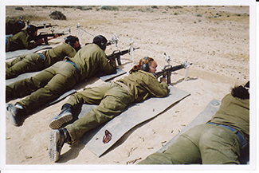
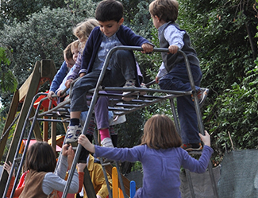

============================
Prejudice and Discrimination
============================

.. contents::
   :depth: 3
..

.. container::

   By the end of this section, you will be able to: \* Define and
   distinguish among prejudice, stereotypes, and discrimination \*
   Provide examples of prejudice, stereotypes, and discrimination \*
   Explain why prejudice and discrimination exist

Human conflict can result in crime, war, and mass murder, such as
genocide. Prejudice and discrimination often are root causes of human
conflict, which explains how strangers come to hate one another to the
extreme of causing others harm. Prejudice and discrimination affect
everyone. In this section we will examine the definitions of prejudice
and discrimination, examples of these concepts, and causes of these
biases.

|Photograph A shows a sign written in German. Photograph B shows a man
drinking at a drinking fountain. Photograph C shows two people holding
signs with hate messages.|\ {: #CNX_Psych_12_05_Discrimination}

UNDERSTANDING PREJUDICE AND DISCRIMINATION
==========================================

As we discussed in the opening story of Trayvon Martin, humans are very
diverse and although we share many similarities, we also have many
differences. The social groups we belong to help form our identities
(Tajfel, 1974). These differences may be difficult for some people to
reconcile, which may lead to prejudice toward people who are different.
**Prejudice**\ {: data-type=“term”} is a negative attitude and feeling
toward an individual based solely on one’s membership in a particular
social group (Allport, 1954; Brown, 2010). Prejudice is common against
people who are members of an unfamiliar cultural group. Thus, certain
types of education, contact, interactions, and building relationships
with members of different cultural groups can reduce the tendency toward
prejudice. In fact, simply imagining interacting with members of
different cultural groups might affect prejudice. Indeed, when
experimental participants were asked to imagine themselves positively
interacting with someone from a different group, this led to an
increased positive attitude toward the other group and an increase in
positive traits associated with the other group. Furthermore, imagined
social interaction can reduce anxiety associated with inter-group
interactions (Crisp & Turner, 2009). What are some examples of social
groups that you belong to that contribute to your identity? Social
groups can include gender, race, ethnicity, nationality, social class,
religion, sexual orientation, profession, and many more. And, as is true
for social roles, you can simultaneously be a member of more than one
social group. An example of prejudice is having a negative attitude
toward people who are not born in the United States. Although people
holding this prejudiced attitude do not know all people who were not
born in the United States, they dislike them due to their status as
foreigners.

Can you think of a prejudiced attitude you have held toward a group of
people? How did your prejudice develop? Prejudice often begins in the
form of a **stereotype**\ {: data-type=“term”}—that is, a specific
belief or assumption about individuals based solely on their membership
in a group, regardless of their individual characteristics. Stereotypes
become overgeneralized and applied to all members of a group. For
example, someone holding prejudiced attitudes toward older adults, may
believe that older adults are slow and incompetent (Cuddy, Norton, &
Fiske, 2005; Nelson, 2004). We cannot possibly know each individual
person of advanced age to know that all older adults are slow and
incompetent. Therefore, this negative belief is overgeneralized to all
members of the group, even though many of the individual group members
may in fact be spry and intelligent.

Another example of a well-known stereotype involves beliefs about racial
differences among athletes. As Hodge, Burden, Robinson, and Bennett
(2008) point out, Black male athletes are often believed to be more
athletic, yet less intelligent, than their White male counterparts.
These beliefs persist despite a number of high profile examples to the
contrary. Sadly, such beliefs often influence how these athletes are
treated by others and how they view themselves and their own
capabilities. Whether or not you agree with a stereotype, stereotypes
are generally well-known within in a given culture (Devine, 1989).

Sometimes people will act on their prejudiced attitudes toward a group
of people, and this behavior is known as discrimination.
**Discrimination**\ {: data-type=“term”} is negative action toward an
individual as a result of one’s membership in a particular group
(Allport, 1954; Dovidio & Gaertner, 2004). As a result of holding
negative beliefs (stereotypes) and negative attitudes (prejudice) about
a particular group, people often treat the target of prejudice poorly,
such as excluding older adults from their circle of friends.
`[link] <#Table_12_05_01>`__ summarizes the characteristics of
stereotypes, prejudice, and discrimination. Have you ever been the
target of discrimination? If so, how did this negative treatment make
you feel?

.. raw:: html

   <table id="Table_12_05_01" summary="A table contains four columns and four rows. The first row is the header row, with labels of “item,” “function,” “connection,” and “example.” The three items are “stereotype,” “prejudice,” and “discrimination.” Stereotype’s “function” is “Cognitive; thoughts about people”; its “connection” is “Overgeneralized beliefs about people may lead to prejudice”; its “example” is ‘Yankees fans are arrogant and obnoxious.” Prejudice’s “function” is “Affective; feelings about people, both positive and negative”; its “connection” is “Feelings may influence treatment of others, leading to discrimination”; its “example” is “I hate Yankees fans; they make me angry.” Discrimination’s “function” is “Behavior; positive or negative treatment of others”; its “connection” is “Holding stereotypes and harboring prejudice may lead to excluding, avoiding, and biased treatment of group members”; its “example” is “I would never hire nor become friends with a person if I knew he or she were a Yankees fan.”">

.. raw:: html

   <caption>

Connecting Stereotypes, Prejudice, and Discrimination

.. raw:: html

   </caption>

.. raw:: html

   <colgroup>

.. raw:: html

   <col data-width="150" />

.. raw:: html

   <col data-width="180" />

.. raw:: html

   <col />

.. raw:: html

   <col />

.. raw:: html

   </colgroup>

.. raw:: html

   <thead>

.. raw:: html

   <tr>

.. raw:: html

   <th data-align="center">

Item

.. raw:: html

   </th>

.. raw:: html

   <th data-align="center">

Function

.. raw:: html

   </th>

.. raw:: html

   <th data-align="center">

Connection

.. raw:: html

   </th>

.. raw:: html

   <th data-align="center">

Example

.. raw:: html

   </th>

.. raw:: html

   </tr>

.. raw:: html

   </thead>

.. raw:: html

   <tbody>

.. raw:: html

   <tr>

.. raw:: html

   <td>

Stereotype

.. raw:: html

   </td>

.. raw:: html

   <td>

Cognitive; thoughts about people

.. raw:: html

   </td>

.. raw:: html

   <td>

Overgeneralized beliefs about people may lead to prejudice.

.. raw:: html

   </td>

.. raw:: html

   <td>

“Yankees fans are arrogant and obnoxious.”

.. raw:: html

   </td>

.. raw:: html

   </tr>

.. raw:: html

   <tr>

.. raw:: html

   <td>

Prejudice

.. raw:: html

   </td>

.. raw:: html

   <td>

Affective; feelings about people, both positive and negative

.. raw:: html

   </td>

.. raw:: html

   <td>

Feelings may influence treatment of others, leading to discrimination.

.. raw:: html

   </td>

.. raw:: html

   <td>

“I hate Yankees fans; they make me angry.”

.. raw:: html

   </td>

.. raw:: html

   </tr>

.. raw:: html

   <tr>

.. raw:: html

   <td>

Discrimination

.. raw:: html

   </td>

.. raw:: html

   <td>

Behavior; positive or negative treatment of others

.. raw:: html

   </td>

.. raw:: html

   <td>

Holding stereotypes and harboring prejudice may lead to excluding,
avoiding, and biased treatment of group members.

.. raw:: html

   </td>

.. raw:: html

   <td>

“I would never hire nor become friends with a person if I knew he or she
were a Yankees fan.”

.. raw:: html

   </td>

.. raw:: html

   </tr>

.. raw:: html

   </tbody>

.. raw:: html

   </table>

So far, we’ve discussed stereotypes, prejudice, and discrimination as
negative thoughts, feelings, and behaviors because these are typically
the most problematic. However, it is important to also point out that
people can hold positive thoughts, feelings, and behaviors toward
individuals based on group membership; for example, they would show
preferential treatment for people who are like themselves—that is, who
share the same gender, race, or favorite sports team.

.. container:: psychology link-to-learning

   This `video <http://openstax.org/l/racismexp>`__ demonstrates the
   concepts of prejudice, stereotypes, and discrimination. In the video,
   a social experiment is conducted in a park where three people try to
   steal a bike out in the open. The race and gender of the thief is
   varied: a White male teenager, a Black male teenager, and a White
   female. Does anyone try to stop them? The treatment of the teenagers
   in the video demonstrates the concept of racism.

TYPES OF PREJUDICE AND DISCRIMINATION
=====================================

When we meet strangers we automatically process three pieces of
information about them: their race, gender, and age (Ito & Urland,
2003). Why are these aspects of an unfamiliar person so important? Why
don’t we instead notice whether their eyes are friendly, whether they
are smiling, their height, the type of clothes they are wearing?
Although these secondary characteristics are important in forming a
first impression of a stranger, the social categories of race, gender,
and age provide a wealth of information about an individual. This
information, however, often is based on stereotypes. We may have
different expectations of strangers depending on their race, gender, and
age. What stereotypes and prejudices do you hold about people who are
from a race, gender, and age group different from your own?

Racism
------

**Racism**\ {: data-type=“term”} is **prejudice**\ {: data-type=“term”
.no-emphasis} and **discrimination**\ {: data-type=“term” .no-emphasis}
against an individual based solely on one’s membership in a specific
racial group (such as toward African Americans, Asian Americans,
Latinos, Native Americans, European Americans). What are some
stereotypes of various racial or ethnic groups? Research suggests
cultural stereotypes for Asian Americans include cold, sly, and
intelligent; for Latinos, cold and unintelligent; for European
Americans, cold and intelligent; and for African Americans, aggressive,
athletic, and more likely to be law breakers (Devine & Elliot, 1995;
Fiske, Cuddy, Glick, & Xu, 2002; Sommers & Ellsworth, 2000; Dixon &
Linz, 2000).

Racism exists for many racial and ethnic groups. For example, Blacks are
significantly more likely to have their vehicles searched during traffic
stops than Whites, particularly when Blacks are driving in predominately
White neighborhoods, (a phenomenon often termed “DWB,” or “driving while
Black.”) (Rojek, Rosenfeld, & Decker, 2012)

Mexican Americans and other Latino groups also are targets of racism
from the police and other members of the community. For example, when
purchasing items with a personal check, Latino shoppers are more likely
than White shoppers to be asked to show formal identification (Dovidio
et al., 2010).

In one case of alleged harassment by the police, several East Haven,
Connecticut, police officers were arrested on federal charges due to
reportedly continued harassment and brutalization of Latinos. When the
accusations came out, the mayor of East Haven was asked, “What are you
doing for the Latino community today?” The Mayor responded, “I might
have tacos when I go home, I’m not quite sure yet” (“East Haven Mayor,”
2012) This statement undermines the important issue of racial profiling
and police harassment of Latinos, while belittling Latino culture by
emphasizing an interest in a food product stereotypically associated
with Latinos.

Racism is prevalent toward many other groups in the United States
including Native Americans, Arab Americans, Jewish Americans, and Asian
Americans. Have you witnessed racism toward any of these racial or
ethnic groups? Are you aware of racism in your community?

One reason modern forms of racism, and prejudice in general, are hard to
detect is related to the dual attitudes model (Wilson, Lindsey, &
Schooler, 2000). Humans have two forms of attitudes: explicit attitudes,
which are conscious and controllable, and implicit attitudes, which are
unconscious and uncontrollable (Devine, 1989; Olson & Fazio, 2003).
Because holding egalitarian views is socially desirable (Plant & Devine,
1998), most people do not show extreme racial bias or other prejudices
on measures of their explicit attitudes. However, measures of implicit
attitudes often show evidence of mild to strong racial bias or other
prejudices (Greenwald, McGee, & Schwartz, 1998; Olson & Fazio, 2003).

Sexism
------

**Sexism**\ {: data-type=“term”} is **prejudice**\ {: data-type=“term”
.no-emphasis} and **discrimination**\ {: data-type=“term” .no-emphasis}
toward individuals based on their sex. Typically, sexism takes the form
of men holding biases against women, but either sex can show sexism
toward their own or their opposite sex. Like racism, sexism may be
subtle and difficult to detect. Common forms of sexism in modern society
include gender role expectations, such as expecting women to be the
caretakers of the household. Sexism also includes people’s expectations
for how members of a gender group should behave. For example, women are
expected to be friendly, passive, and nurturing, and when women behave
in an unfriendly, assertive, or neglectful manner they often are
disliked for violating their gender role (Rudman, 1998). Research by
Laurie Rudman (1998) finds that when female job applicants self-promote,
they are likely to be viewed as competent, but they may be disliked and
are less likely to be hired because they violated gender expectations
for modesty. Sexism can exist on a societal level such as in hiring,
employment opportunities, and education. Women are less likely to be
hired or promoted in male-dominated professions such as engineering,
aviation, and construction (`[link] <#CNX_Psych_12_05_woman>`__) (Blau,
Ferber, & Winkler, 2010; Ceci & Williams, 2011). Have you ever
experienced or witnessed sexism? Think about your family members’ jobs
or careers. Why do you think there are differences in the jobs women and
men have, such as more women nurses but more male surgeons (Betz, 2008)?

|A photograph shows an armed female soldier among a group of
soldiers.|\ {: #CNX_Psych_12_05_woman}

Ageism
------

People often form judgments and hold expectations about people based on
their age. These judgments and expectations can lead to **ageism**\ {:
data-type=“term”}, or **prejudice**\ {: data-type=“term” .no-emphasis}
and **discrimination**\ {: data-type=“term” .no-emphasis} toward
individuals based solely on their age. Typically, ageism occurs against
older adults, but ageism also can occur toward younger adults. Think of
expectations you hold for older adults. How could someone’s expectations
influence the feelings they hold toward individuals from older age
groups? Ageism is widespread in U.S. culture (Nosek, 2005), and a common
ageist attitude toward older adults is that they are incompetent,
physically weak, and slow (Greenberg, Schimel, & Martens, 2002) and some
people consider older adults less attractive. Some cultures, however,
including some Asian, Latino, and African American cultures, both
outside and within the United States afford older adults respect and
honor.

Ageism can also occur toward younger adults. What expectations do you
hold toward younger people? Does society expect younger adults to be
immature and irresponsible? How might these two forms of ageism affect a
younger and older adult who are applying for a sales clerk position?

Homophobia
----------

Another form of prejudice is **homophobia**\ {: data-type=“term”}:
**prejudice**\ {: data-type=“term” .no-emphasis} and
**discrimination**\ {: data-type=“term” .no-emphasis} of individuals
based solely on their sexual orientation. Like ageism,
**homophobia**\ {: data-type=“term” .no-emphasis} is a widespread
prejudice in U.S. society that is tolerated by many people (Herek &
McLemore, 2013; Nosek, 2005). Negative feelings often result in
discrimination, such as the exclusion of lesbian, gay, bisexual, and
transgender (LGBT) people from social groups and the avoidance of LGBT
neighbors and co-workers. This discrimination also extends to employers
deliberately declining to hire qualified LGBT job applicants. Have you
experienced or witnessed homophobia? If so, what stereotypes, prejudiced
attitudes, and discrimination were evident?

.. container:: psychology dig-deeper

   .. container::

      Research into Homophobia

   Some people are quite passionate in their hatred for nonheterosexuals
   in our society. In some cases, people have been tortured and/or
   murdered simply because they were not heterosexual. This passionate
   response has led some researchers to question what motives might
   exist for homophobic people. Adams, Wright, & Lohr (1996) conducted a
   study investigating this issue and their results were quite an
   eye-opener.

   In this experiment, male college students were given a scale that
   assessed how homophobic they were; those with extreme scores were
   recruited to participate in the experiment. In the end, 64 men agreed
   to participate and were split into 2 groups: homophobic men and
   nonhomophobic men. Both groups of men were fitted with a penile
   plethysmograph, an instrument that measures changes in blood flow to
   the penis and serves as an objective measurement of sexual arousal.

   All men were shown segments of sexually explicit videos. One of these
   videos involved a sexual interaction between a man and a woman
   (heterosexual clip). One video displayed two females engaged in a
   sexual interaction (homosexual female clip), and the final video
   displayed two men engaged in a sexual interaction (homosexual male
   clip). Changes in penile tumescence were recorded during all three
   clips, and a subjective measurement of sexual arousal was also
   obtained. While both groups of men became sexually aroused to the
   heterosexual and female homosexual video clips, only those men who
   were identified as homophobic showed sexual arousal to the homosexual
   male video clip. While all men reported that their erections
   indicated arousal for the heterosexual and female homosexual clips,
   the homophobic men indicated that they were not sexually aroused
   (despite their erections) to the male homosexual clips. Adams et
   al. (1996) suggest that these findings may indicate that homophobia
   is related to homosexual arousal that the homophobic individuals
   either deny or are unaware.

WHY DO PREJUDICE AND DISCRIMINATION EXIST?
==========================================

**Prejudice**\ {: data-type=“term” .no-emphasis} and
**discrimination**\ {: data-type=“term” .no-emphasis} persist in society
due to social learning and conformity to social norms. Children learn
prejudiced attitudes and beliefs from society: their parents, teachers,
friends, the media, and other sources of socialization, such as Facebook
(O’Keeffe & Clarke-Pearson, 2011). If certain types of prejudice and
discrimination are acceptable in a society, there may be normative
pressures to conform and share those prejudiced beliefs, attitudes, and
behaviors. For example, public and private schools are still somewhat
segregated by social class. Historically, only children from wealthy
families could afford to attend private schools, whereas children from
middle- and low-income families typically attended public schools. If a
child from a low-income family received a merit scholarship to attend a
private school, how might the child be treated by classmates? Can you
recall a time when you held prejudiced attitudes or beliefs or acted in
a discriminatory manner because your group of friends expected you to?

STEREOTYPES AND SELF-FULFILLING PROPHECY
========================================

When we hold a **stereotype**\ {: data-type=“term” .no-emphasis} about a
person, we have expectations that he or she will fulfill that
stereotype. A **self-fulfilling prophecy**\ {: data-type=“term”} is an
expectation held by a person that alters his or her behavior in a way
that tends to make it true. When we hold stereotypes about a person, we
tend to treat the person according to our expectations. This treatment
can influence the person to act according to our stereotypic
expectations, thus confirming our stereotypic beliefs. Research by
Rosenthal and Jacobson (1968) found that disadvantaged students whose
teachers expected them to perform well had higher grades than
disadvantaged students whose teachers expected them to do poorly.

Consider this example of cause and effect in a self-fulfilling prophecy:
If an employer expects an openly gay male job applicant to be
incompetent, the potential employer might treat the applicant negatively
during the interview by engaging in less conversation, making little eye
contact, and generally behaving coldly toward the applicant (Hebl,
Foster, Mannix, & Dovidio, 2002). In turn, the job applicant will
perceive that the potential employer dislikes him, and he will respond
by giving shorter responses to interview questions, making less eye
contact, and generally disengaging from the interview. After the
interview, the employer will reflect on the applicant’s behavior, which
seemed cold and distant, and the employer will conclude, based on the
applicant’s poor performance during the interview, that the applicant
was in fact incompetent. Thus, the employer’s stereotype—gay men are
incompetent and do not make good employees—is reinforced. Do you think
this job applicant is likely to be hired? Treating individuals according
to stereotypic beliefs can lead to prejudice and discrimination.

Another dynamic that can reinforce stereotypes is confirmation bias.
When interacting with the target of our prejudice, we tend to pay
attention to information that is consistent with our stereotypic
expectations and ignore information that is inconsistent with our
expectations. In this process, known as **confirmation bias**\ {:
data-type=“term”}, we seek out information that supports our stereotypes
and ignore information that is inconsistent with our stereotypes (Wason
& Johnson-Laird, 1972). In the job interview example, the employer may
not have noticed that the job applicant was friendly and engaging, and
that he provided competent responses to the interview questions in the
beginning of the interview. Instead, the employer focused on the job
applicant’s performance in the later part of the interview, after the
applicant changed his demeanor and behavior to match the interviewer’s
negative treatment.

Have you ever fallen prey to the self-fulfilling prophecy or
confirmation bias, either as the source or target of such bias? How
might we stop the cycle of the self-fulfilling prophecy? Social class
stereotypes of individuals tend to arise when information about the
individual is ambiguous. If information is unambiguous, stereotypes do
not tend to arise (Baron et al., 1995).

IN-GROUPS AND OUT-GROUPS
========================

As discussed previously in this section, we all belong to a gender,
race, age, and social economic group. These groups provide a powerful
source of our identity and self-esteem (Tajfel & Turner, 1979). These
groups serve as our in-groups. An **in-group**\ {: data-type=“term”} is
a group that we identify with or see ourselves as belonging to. A group
that we don’t belong to, or an **out-group**\ {: data-type=“term”}, is a
group that we view as fundamentally different from us. For example, if
you are female, your gender in-group includes all females, and your
gender out-group includes all males
(`[link] <#CNX_Psych_12_05_children>`__). People often view gender
groups as being fundamentally different from each other in personality
traits, characteristics, social roles, and interests. Because we often
feel a strong sense of belonging and emotional connection to our
in-groups, we develop in-group bias: a preference for our own group over
other groups. This **in-group bias**\ {: data-type=“term”} can result in
prejudice and discrimination because the out-group is perceived as
different and is less preferred than our in-group.

|A photograph shows children climbing on playground equipment.|\ {:
#CNX_Psych_12_05_children}

Despite the group dynamics that seem only to push groups toward
conflict, there are forces that promote reconciliation between groups:
the expression of empathy, of acknowledgment of past suffering on both
sides, and the halt of destructive behaviors.

One function of prejudice is to help us feel good about ourselves and
maintain a positive self-concept. This need to feel good about ourselves
extends to our in-groups: We want to feel good and protect our
in-groups. We seek to resolve threats individually and at the in-group
level. This often happens by blaming an out-group for the problem.
**Scapegoating**\ {: data-type=“term”} is the act of blaming an
out-group when the in-group experiences frustration or is blocked from
obtaining a goal (Allport, 1954).

Summary
=======

As diverse individuals, humans can experience conflict when interacting
with people who are different from each other. Prejudice, or negative
feelings and evaluations, is common when people are from a different
social group (i.e., out-group). Negative attitudes toward out-groups can
lead to discrimination. Prejudice and discrimination against others can
be based on gender, race, ethnicity, social class, sexual orientation,
or a variety of other social identities. In-group’s who feel threatened
may blame the out-groups for their plight, thus using the out-group as a
scapegoat for their frustration.

Review Questions
================

.. container::

   .. container::

      Prejudice is to \_______\_ as discrimination is to \________.

      1. feelings; behavior
      2. thoughts; feelings
      3. feelings; thoughts
      4. behavior; feelings {: type=“a”}

   .. container::

      A

.. container::

   .. container::

      Which of the following is *not* a type of prejudice?

      1. homophobia
      2. racism
      3. sexism
      4. individualism {: type=“a”}

   .. container::

      D

.. container::

   .. container::

      \_______\_ occurs when the out-group is blamed for the in-group’s
      frustration.

      1. stereotyping
      2. in-group bias
      3. scapegoating
      4. ageism {: type=“a”}

   .. container::

      C

.. container::

   .. container::

      When we seek out information that supports our stereotypes we are
      engaged in \________.

      1. scapegoating
      2. confirmation bias
      3. self-fulfilling prophecy
      4. in-group bias {: type=“a”}

   .. container::

      B

Critical Thinking Questions
===========================

.. container::

   .. container::

      Some people seem more willing to openly display prejudice
      regarding sexual orientation than prejudice regarding race and
      gender. Speculate on why this might be.

   .. container::

      In the United States, many people believe that sexual orientation
      is a choice, and there is some debate in the research literature
      as to the extent sexual orientation is biological or influenced by
      social factors. Because race and gender are not chosen, many
      Americans believe it is unfair to negatively judge women or racial
      minority groups for a characteristic that is determined by
      genetics. In addition, many people in the United States practice
      religions that believe homosexuality is wrong.

.. container::

   .. container::

      When people blame a scapegoat, how do you think they choose
      evidence to support the blame?

   .. container::

      One way in which they might do this is to selectively attend to
      information that would bolster their argument. Furthermore, they
      may actively seek out information to confirm their assertions.

Personal Application Questions
==============================

.. container::

   .. container::

      Give an example when you felt that someone was prejudiced against
      you. What do you think caused this attitude? Did this person
      display any discrimination behaviors and, if so, how?

.. container::

   .. container::

      Give an example when you felt prejudiced against someone else. How
      did you discriminate against them? Why do you think you did this?

.. container::

   .. rubric:: Glossary
      :name: glossary

   {: data-type=“glossary-title”}

   ageism
      prejudice and discrimination toward individuals based solely on
      their age ^
   confirmation bias
      seeking out information that supports our stereotypes while
      ignoring information that is inconsistent with our stereotypes ^
   discrimination
      negative actions toward individuals as a result of their
      membership in a particular group ^
   homophobia
      prejudice and discrimination against individuals based solely on
      their sexual orientation ^
   in-group
      group that we identify with or see ourselves as belonging to ^
   in-group bias
      preference for our own group over other groups ^
   out-group
      group that we don’t belong to—one that we view as fundamentally
      different from us ^
   prejudice
      negative attitudes and feelings toward individuals based solely on
      their membership in a particular group ^
   racism
      prejudice and discrimination toward individuals based solely on
      their race ^
   scapegoating
      act of blaming an out-group when the in-group experiences
      frustration or is blocked from obtaining a goal ^
   self-fulfilling prophecy
      treating stereotyped group members according to our biased
      expectations only to have this treatment influence the individual
      to act according to our stereotypic expectations, thus confirming
      our stereotypic beliefs ^
   sexism
      prejudice and discrimination toward individuals based on their sex
      ^
   stereotype
      specific beliefs or assumptions about individuals based solely on
      their membership in a group, regardless of their individual
      characteristics

.. |Photograph A shows a sign written in German. Photograph B shows a man drinking at a drinking fountain. Photograph C shows two people holding signs with hate messages.| image:: ../resources/CNX_Psych_12_05_Discrimination.jpg

