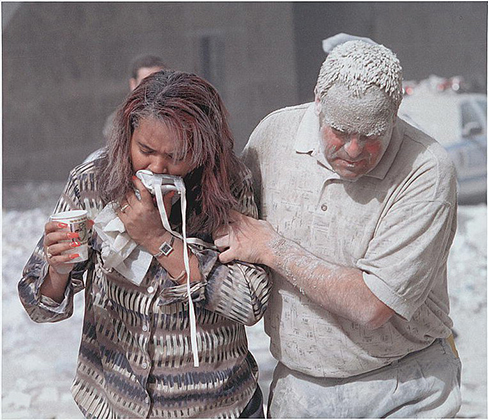
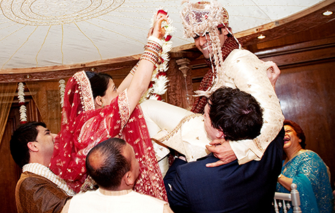
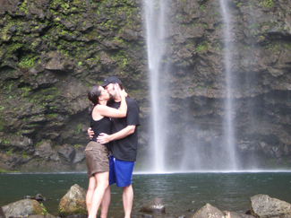

==================
Prosocial Behavior
==================

.. contents::
   :depth: 3
..

.. container::

   By the end of this section, you will be able to: \* Describe altruism
   \* Describe conditions that influence the formation of relationships
   \* Identify what attracts people to each other \* Describe the
   triangular theory of love \* Explain social exchange theory in
   relationships

You’ve learned about many of the negative behaviors of social
psychology, but the field also studies many positive social interactions
and behaviors. What makes people like each other? With whom are we
friends? Whom do we date? Researchers have documented several features
of the situation that influence whether we form relationships with
others. There are also universal traits that humans find attractive in
others. In this section we discuss conditions that make forming
relationships more likely, what we look for in friendships and romantic
relationships, the different types of love, and a theory explaining how
our relationships are formed, maintained, and terminated.

PROSOCIAL BEHAVIOR AND ALTRUISM
===============================

Do you voluntarily help others? Voluntary behavior with the intent to
help other people is called **prosocial behavior**\ {:
data-type=“term”}. Why do people help other people? Is personal benefit
such as feeling good about oneself the only reason people help one
another? Research suggests there are many other reasons.
**Altruism**\ {: data-type=“term”} is people’s desire to help others
even if the costs outweigh the benefits of helping. In fact, people
acting in altruistic ways may disregard the personal costs associated
with helping (`[link] <#CNX_Psych_12_06_altruism>`__). For example, news
accounts of the 9/11 terrorist attacks on the World Trade Center in New
York reported an employee in the first tower helped his co-workers make
it to the exit stairwell. After helping a co-worker to safety he went
back in the burning building to help additional co-workers. In this case
the costs of helping were great, and the hero lost his life in the
destruction (Stewart, 2002).

|A photograph shows two people covered in dust; one appears to be
helping the other.|\ {: #CNX_Psych_12_06_altruism}

Some researchers suggest that altruism operates on empathy.
**Empathy**\ {: data-type=“term”} is the capacity to understand another
person’s perspective, to feel what he or she feels. An empathetic person
makes an emotional connection with others and feels compelled to help
(Batson, 1991). Other researchers argue that altruism is a form of
selfless helping that is not motivated by benefits or feeling good about
oneself. Certainly, after helping, people feel good about themselves,
but some researchers argue that this is a consequence of altruism, not a
cause. Other researchers argue that helping is always self-serving
because our egos are involved, and we receive benefits from helping
(Cialdini, Brown, Lewis, Luce, & Neuberg 1997). It is challenging to
determine experimentally the true motivation for helping, whether is it
largely self-serving (egoism) or selfless (altruism). Thus, a debate on
whether pure altruism exists continues.

.. container:: psychology link-to-learning

   See this excerpt from the popular TV series `Friends
   episode <http://openstax.org/l/friendsclip>`__ for a discussion of
   the egoism versus altruism debate.

FORMING RELATIONSHIPS
=====================

What do you think is the single most influential factor in determining
with whom you become friends and whom you form romantic relationships?
You might be surprised to learn that the answer is simple: the people
with whom you have the most contact. This most important factor is
proximity. You are more likely to be friends with people you have
regular contact with. For example, there are decades of research that
shows that you are more likely to become friends with people who live in
your dorm, your apartment building, or your immediate neighborhood than
with people who live farther away (Festinger, Schachler, & Back, 1950).
It is simply easier to form relationships with people you see often
because you have the opportunity to get to know them.

Similarity is another factor that influences who we form relationships
with. We are more likely to become friends or lovers with someone who is
similar to us in background, attitudes, and lifestyle. In fact, there is
no evidence that opposites attract. Rather, we are attracted to people
who are most like us (`[link] <#CNX_Psych_12_07_wedding>`__) (McPherson,
Smith-Lovin, & Cook, 2001). Why do you think we are attracted to people
who are similar to us? Sharing things in common will certainly make it
easy to get along with others and form connections. When you and another
person share similar music taste, hobbies, food preferences, and so on,
deciding what to do with your time together might be easy.
**Homophily**\ {: data-type=“term”} is the tendency for people to form
social networks, including friendships, marriage, business
relationships, and many other types of relationships, with others who
are similar (McPherson et al., 2001).

|A photograph shows a bride and groom in a wedding ceremony.|\ {:
#CNX_Psych_12_07_wedding}

But, homophily limits our exposure to diversity (McPherson et al.,
2001). By forming relationships only with people who are similar to us,
we will have homogenous groups and will not be exposed to different
points of view. In other words, because we are likely to spend time with
those who are most like ourselves, we will have limited exposure to
those who are different than ourselves, including people of different
races, ethnicities, social-economic status, and life situations.

Once we form relationships with people, we desire reciprocity.
**Reciprocity**\ {: data-type=“term”} is the give and take in
relationships. We contribute to relationships, but we expect to receive
benefits as well. That is, we want our relationships to be a two way
street. We are more likely to like and engage with people who like us
back. Self-disclosure is part of the two way street.
**Self-disclosure**\ {: data-type=“term”} is the sharing of personal
information (Laurenceau, Barrett, & Pietromonaco, 1998). We form more
intimate connections with people with whom we disclose important
information about ourselves. Indeed, self-disclosure is a characteristic
of healthy intimate relationships, as long as the information disclosed
is consistent with our own views (Cozby, 1973).

ATTRACTION
==========

We have discussed how proximity and similarity lead to the formation of
relationships, and that reciprocity and self-disclosure are important
for relationship maintenance. But, what features of a person do we find
attractive? We don’t form relationships with everyone that lives or
works near us, so how is it that we decide which specific individuals we
will select as friends and lovers?

Researchers have documented several characteristics in men and women
that humans find attractive. First we look for friends and lovers who
are physically attractive. People differ in what they consider
attractive, and attractiveness is culturally influenced. Research,
however, suggests that some universally attractive features in women
include large eyes, high cheekbones, a narrow jaw line, a slender build
(Buss, 1989), and a lower waist-to-hip ratio (Singh, 1993). For men,
attractive traits include being tall, having broad shoulders, and a
narrow waist (Buss, 1989). Both men and women with high levels of facial
and body symmetry are generally considered more attractive than
asymmetric individuals (Fink, Neave, Manning, & Grammer, 2006;
Penton-Voak et al., 2001; Rikowski & Grammer, 1999). Social traits that
people find attractive in potential female mates include warmth,
affection, and social skills; in males, the attractive traits include
achievement, leadership qualities, and job skills (Regan & Berscheid,
1997). Although humans want mates who are physically attractive, this
does not mean that we look for the most attractive person possible. In
fact, this observation has led some to propose what is known as the
matching hypothesis which asserts that people tend to pick someone they
view as their equal in physical attractiveness and social desirability
(Taylor, Fiore, Mendelsohn, & Cheshire, 2011). For example, you and most
people you know likely would say that a very attractive movie star is
out of your league. So, even if you had proximity to that person, you
likely would not ask them out on a date because you believe you likely
would be rejected. People weigh a potential partner’s attractiveness
against the likelihood of success with that person. If you think you are
particularly unattractive (even if you are not), you likely will seek
partners that are fairly unattractive (that is, unattractive in physical
appearance or in behavior).

STERNBERG’S TRIANGULAR THEORY OF LOVE
=====================================

We typically love the people with whom we form relationships, but the
type of love we have for our family, friends, and lovers differs. Robert
Sternberg (1986) proposed that there are three components of love:
intimacy, passion, and commitment. These three components form a
triangle that defines multiple types of love: this is known as
Sternberg’s **triangular theory of love**\ {: data-type=“term”}
(`[link] <#CNX_Psych_12_07_love>`__). Intimacy is the sharing of details
and intimate thoughts and emotions. Passion is the physical
attraction—the flame in the fire. Commitment is standing by the
person—the “in sickness and health” part of the relationship.

|Diagram shows a triangle. The interior of the triangle is labeled,
“Consummate love; intimacy + passion + commitment.” The peak of the
triangle is labeled, “Liking; intimacy.” The left side of the triangle
is labeled, “Romantic love; passion + intimacy.” The right side of the
triangle is labeled, “Companionate love; intimacy + commitment.” The
bottom left corner of the triangle is labeled, “Infatuation; passion.”
The bottom side of the triangle is labeled, “Fatuous love; passion +
commitment.” The bottom right corner of the triangle is labeled, “Empty
love; commitment.”|\ {: #CNX_Psych_12_07_love}

Sternberg (1986) states that a healthy relationship will have all three
components of love—intimacy, passion, and commitment—which is described
as **consummate love**\ {: data-type=“term”}
(`[link] <#CNX_Psych_12_07_couple>`__). However, different aspects of
love might be more prevalent at different life stages. Other forms of
love include liking, which is defined as having intimacy but no passion
or commitment. Infatuation is the presence of passion without intimacy
or commitment. Empty love is having commitment without intimacy or
passion. **Companionate love**\ {: data-type=“term”}, which is
characteristic of close friendships and family relationships, consists
of intimacy and commitment but no passion. **Romantic love**\ {:
data-type=“term”} is defined by having passion and intimacy, but no
commitment. Finally, fatuous love is defined by having passion and
commitment, but no intimacy, such as a long term sexual love affair. Can
you describe other examples of relationships that fit these different
types of love?

|Photograph shows a couple embracing and kissing next to a
waterfall.|\ {: #CNX_Psych_12_07_couple}

SOCIAL EXCHANGE THEORY
======================

We have discussed why we form relationships, what attracts us to others,
and different types of love. But what determines whether we are
satisfied with and stay in a relationship? One theory that provides an
explanation is social exchange theory. According to **social exchange
theory**\ {: data-type=“term”}, we act as naïve economists in keeping a
tally of the ratio of costs and benefits of forming and maintaining a
relationship with others (`[link] <#CNX_Psych_12_07_exchange>`__)
(Rusbult & Van Lange, 2003).

|An illustration shows a balance scale, with one side labeled “positives
or benefits” appearing heavier than the other side, which is labeled
“negatives or costs.”|\ {: #CNX_Psych_12_07_exchange}

People are motivated to maximize the benefits of social exchanges, or
relationships, and minimize the costs. People prefer to have more
benefits than costs, or to have nearly equal costs and benefits, but
most people are dissatisfied if their social exchanges create more costs
than benefits. Let’s discuss an example. If you have ever decided to
commit to a romantic relationship, you probably considered the
advantages and disadvantages of your decision. What are the benefits of
being in a committed romantic relationship? You may have considered
having companionship, intimacy, and passion, but also being comfortable
with a person you know well. What are the costs of being in a committed
romantic relationship? You may think that over time boredom from being
with only one person may set in; moreover, it may be expensive to share
activities such as attending movies and going to dinner. However, the
benefits of dating your romantic partner presumably outweigh the costs,
or you wouldn’t continue the relationship.

Summary
=======

Altruism is a pure form of helping others out of empathy, which can be
contrasted with egoistic motivations for helping. Forming relationships
with others is a necessity for social beings. We typically form
relationships with people who are close to us in proximity and people
with whom we share similarities. We expect reciprocity and
self-disclosure in our relationships. We also want to form relationships
with people who are physically attractive, though standards for
attractiveness vary by culture and gender. There are many types of love
that are determined by various combinations of intimacy, passion, and
commitment; consummate love, which is the ideal form of love, contains
all three components. When determining satisfaction and whether to
maintain a relationship, individuals often use a social exchange
approach and weigh the costs and benefits of forming and maintaining a
relationship.

Review Questions
================

.. container::

   .. container::

      Altruism is a form of prosocial behavior that is motivated by
      \________.

      1. feeling good about oneself
      2. selfless helping of others
      3. earning a reward
      4. showing bravery to bystanders {: type=“a”}

   .. container::

      B

.. container::

   .. container::

      After moving to a new apartment building, research suggests that
      Sam will be most likely to become friends with \________.

      1. his next door neighbor
      2. someone who lives three floors up in the apartment building
      3. someone from across the street
      4. his new postal delivery person {: type=“a”}

   .. container::

      A

.. container::

   .. container::

      What trait do both men and women tend to look for in a romantic
      partner?

      1. sense of humor
      2. social skills
      3. leadership potential
      4. physical attractiveness {: type=“a”}

   .. container::

      D

.. container::

   .. container::

      According to the triangular theory of love, what type of love is
      defined by passion and intimacy but no commitment?

      1. consummate love
      2. empty love
      3. romantic love
      4. liking {: type=“a”}

   .. container::

      C

.. container::

   .. container::

      According to social exchange theory, humans want to maximize the
      \_______\_ and minimize the \_______\_ in relationships.

      1. intimacy; commitment
      2. benefits; costs
      3. costs; benefits
      4. passion; intimacy {: type=“a”}

   .. container::

      B

Critical Thinking Questions
===========================

.. container::

   .. container::

      Describe what influences whether relationships will be formed.

   .. container::

      Proximity is a major situational factor in relationship formation;
      people who have frequent contact are more likely to form
      relationships. Whether or not individuals will form a relationship
      is based on non-situational factors such as similarity,
      reciprocity, self-disclosure, and physical attractiveness. In
      relationships, people seek reciprocity (i.e., a give and take in
      costs and benefits), self-disclosure of intimate information, and
      physically attractive partners.

.. container::

   .. container::

      The evolutionary theory argues that humans are motivated to
      perpetuate their genes and reproduce. Using an evolutionary
      perspective, describe traits in men and women that humans find
      attractive.

   .. container::

      Traits that promote reproduction in females warmth, affection, and
      social skills; women with these traits are presumably better able
      to care for children. Traits that are desired in males include
      achievement, leadership qualities, and job skills; men with these
      traits are thought to be better able to financially provide for
      their families.

Personal Application Questions
==============================

.. container::

   .. container::

      Think about your recent friendships and romantic relationship(s).
      What factors do you think influenced the development of these
      relationships? What attracted you to becoming friends or romantic
      partners?

.. container::

   .. container::

      Have you ever used a social exchange theory approach to determine
      how satisfied you were in a relationship, either a friendship or
      romantic relationship? Have you ever had the costs outweigh the
      benefits of a relationship? If so, how did you address this
      imbalance?

.. container::

   .. rubric:: Glossary
      :name: glossary

   {: data-type=“glossary-title”}

   altruism
      humans’ desire to help others even if the costs outweigh the
      benefits of helping ^
   companionate love
      type of love consisting of intimacy and commitment, but not
      passion; associated with close friendships and family
      relationships ^
   consummate love
      type of love occurring when intimacy, passion, and commitment are
      all present ^
   empathy
      capacity to understand another person’s perspective—to feel what
      he or she feels ^
   homophily
      tendency for people to form social networks, including
      friendships, marriage, business relationships, and many other
      types of relationships, with others who are similar ^
   prosocial behavior
      voluntary behavior with the intent to help other people ^
   reciprocity
      give and take in relationships ^
   romantic love
      type of love consisting of intimacy and passion, but no commitment
      ^
   self-disclosure
      sharing personal information in relationships ^
   social exchange theory
      humans act as naïve economists in keeping a tally of the ratio of
      costs and benefits of forming and maintain a relationship, with
      the goal to maximize benefits and minimize costs ^
   triangular theory of love
      model of love based on three components: intimacy, passion, and
      commitment; several types of love exist, depending on the presence
      or absence of each of these components

.. |Diagram shows a triangle. The interior of the triangle is labeled, “Consummate love; intimacy + passion + commitment.” The peak of the triangle is labeled, “Liking; intimacy.” The left side of the triangle is labeled, “Romantic love; passion + intimacy.” The right side of the triangle is labeled, “Companionate love; intimacy + commitment.” The bottom left corner of the triangle is labeled, “Infatuation; passion.” The bottom side of the triangle is labeled, “Fatuous love; passion + commitment.” The bottom right corner of the triangle is labeled, “Empty love; commitment.”| image:: ../resources/CNX_Psych_12_07_love.jpg

.. |An illustration shows a balance scale, with one side labeled “positives or benefits” appearing heavier than the other side, which is labeled “negatives or costs.”| image:: ../resources/CNX_Psych_12_07_exchange.jpg
