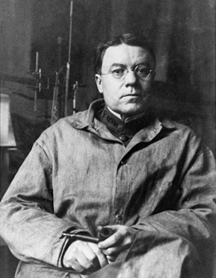
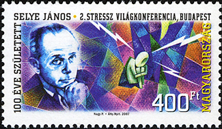

===============
What Is Stress?
===============

.. contents::
   :depth: 3
..

.. container::

   By the end of this section, you will be able to: \* Differentiate
   between stimulus-based and response-based definitions of stress \*
   Define stress as a process \* Differentiate between good stress and
   bad stress \* Describe the early contributions of Walter Cannon and
   Hans Selye to the stress research field \* Understand the
   physiological basis of stress and describe the general adaptation
   syndrome

The term **stress**\ {: data-type=“term” .no-emphasis} as it relates to
the human condition first emerged in scientific literature in the 1930s,
but it did not enter the popular vernacular until the 1970s (Lyon,
2012). Today, we often use the term loosely in describing a variety of
unpleasant feeling states; for example, we often say we are stressed out
when we feel frustrated, angry, conflicted, overwhelmed, or fatigued.
Despite the widespread use of the term, stress is a fairly vague concept
that is difficult to define with precision.

Researchers have had a difficult time agreeing on an acceptable
definition of stress. Some have conceptualized stress as a demanding or
threatening event or situation (e.g., a high-stress job, overcrowding,
and long commutes to work). Such conceptualizations are known as
stimulus-based definitions because they characterize stress as a
stimulus that causes certain reactions. Stimulus-based definitions of
stress are problematic, however, because they fail to recognize that
people differ in how they view and react to challenging life events and
situations. For example, a conscientious student who has studied
diligently all semester would likely experience less stress during final
exams week than would a less responsible, unprepared student.

Others have conceptualized stress in ways that emphasize the
physiological responses that occur when faced with demanding or
threatening situations (e.g., increased arousal). These
conceptualizations are referred to as response-based definitions because
they describe stress as a response to environmental conditions. For
example, the endocrinologist Hans **Selye**\ {: data-type=“term”
.no-emphasis}, a famous stress researcher, once defined stress as the
“response of the body to any demand, whether it is caused by, or results
in, pleasant or unpleasant conditions” (Selye, 1976, p. 74). Selye’s
definition of stress is response-based in that it conceptualizes stress
chiefly in terms of the body’s physiological reaction to any demand that
is placed on it. Neither stimulus-based nor response-based definitions
provide a complete definition of stress. Many of the physiological
reactions that occur when faced with demanding situations (e.g.,
accelerated heart rate) can also occur in response to things that most
people would not consider to be genuinely stressful, such as receiving
unanticipated good news: an unexpected promotion or raise.

A useful way to conceptualize **stress**\ {: data-type=“term”} is to
view it as a process whereby an individual perceives and responds to
events that he appraises as overwhelming or threatening to his
well-being (Lazarus & Folkman, 1984). A critical element of this
definition is that it emphasizes the importance of how we appraise—that
is, judge—demanding or threatening events (often referred to as
**stressors**\ {: data-type=“term”}); these appraisals, in turn,
influence our reactions to such events. Two kinds of appraisals of a
stressor are especially important in this regard: primary and secondary
appraisals. A **primary appraisal**\ {: data-type=“term”} involves
judgment about the degree of potential harm or threat to well-being that
a stressor might entail. A stressor would likely be appraised as a
threat if one anticipates that it could lead to some kind of harm, loss,
or other negative consequence; conversely, a stressor would likely be
appraised as a challenge if one believes that it carries the potential
for gain or personal growth. For example, an employee who is promoted to
a leadership position would likely perceive the promotion as a much
greater threat if she believed the promotion would lead to excessive
work demands than if she viewed it as an opportunity to gain new skills
and grow professionally. Similarly, a college student on the cusp of
graduation may face the change as a threat or a challenge
(`[link] <#CNX_Psych_14_01_Graduation>`__).

|A photo shows a smiling person wearing a graduation cap and gown.|\ {:
#CNX_Psych_14_01_Graduation}

The perception of a threat triggers a **secondary appraisal**\ {:
data-type=“term”}: judgment of the options available to cope with a
stressor, as well as perceptions of how effective such options will be
(Lyon, 2012) (`[link] <#CNX_Psych_14_01_Appraisals>`__). As you may
recall from what you learned about self-efficacy, an individual’s belief
in his ability to complete a task is important (Bandura, 1994). A threat
tends to be viewed as less catastrophic if one believes something can be
done about it (Lazarus & Folkman, 1984). Imagine that two middle-aged
women, Robin and Maria, perform breast self-examinations one morning and
each woman notices a lump on the lower region of her left breast.
Although both women view the breast lump as a potential threat (primary
appraisal), their secondary appraisals differ considerably. In
considering the breast lump, some of the thoughts racing through Robin’s
mind are, “Oh my God, I could have breast cancer! What if the cancer has
spread to the rest of my body and I cannot recover? What if I have to go
through chemotherapy? I’ve heard that experience is awful! What if I
have to quit my job? My husband and I won’t have enough money to pay the
mortgage. Oh, this is just horrible…I can’t deal with it!” On the other
hand, Maria thinks, “Hmm, this may not be good. Although most times
these things turn out to be benign, I need to have it checked out. If it
turns out to be breast cancer, there are doctors who can take care of it
because the medical technology today is quite advanced. I’ll have a lot
of different options, and I’ll be just fine.” Clearly, Robin and Maria
have different outlooks on what might turn out to be a very serious
situation: Robin seems to think that little could be done about it,
whereas Maria believes that, worst case scenario, a number of options
that are likely to be effective would be available. As such, Robin would
clearly experience greater stress than would Maria.

|A concept map begins with a box titled “Stressor” at the top with an
arrow underneath that leads to a box labeled “Primary appraisal:
challenge or threat?” Below “Primary appraisal: challenge or threat?” is
a line leading to the word “challenge” on the left side and “threat” on
the right side. Below the word “challenge” is a box labeled “Potential
for gain or growth.” There are no additional lines, arrows, or boxes
under “Potential for gain or growth.” Below the word “threat,” there is
a box labeled “May lead to harm, loss, or negative consequences.”
Underneath the box, there is an arrow leading to another box labeled
“Secondary appraisal: potential options and how effective?” The box has
a line underneath that leads to the words “effective option” on the left
side and “ineffective/no option” on the right side. Below the words
“effective option,” there is an arrow leading to a box labeled “Low
threat.” Below the words “ineffective/no option,” there is an arrow
leading to a box labeled “High threat.”|\ {:
#CNX_Psych_14_01_Appraisals}

To be sure, some stressors are inherently more stressful than others in
that they are more threatening and leave less potential for variation in
cognitive appraisals (e.g., objective threats to one’s health or
safety). Nevertheless, appraisal will still play a role in augmenting or
diminishing our reactions to such events (Everly & Lating, 2002).

If a person appraises an event as harmful and believes that the demands
imposed by the event exceed the available resources to manage or adapt
to it, the person will subjectively experience a state of stress. In
contrast, if one does not appraise the same event as harmful or
threatening, she is unlikely to experience stress. According to this
definition, environmental events trigger stress reactions by the way
they are interpreted and the meanings they are assigned. In short,
stress is largely in the eye of the beholder: it’s not so much what
happens to you as it is how you respond (Selye, 1976).

GOOD STRESS?
============

Although stress carries a negative connotation, at times it may be of
some benefit. Stress can motivate us to do things in our best interests,
such as study for exams, visit the doctor regularly, exercise, and
perform to the best of our ability at work. Indeed, Selye (1974) pointed
out that not all stress is harmful. He argued that stress can sometimes
be a positive, motivating force that can improve the quality of our
lives. This kind of stress, which Selye called **eustress**\ {:
data-type=“term”} (from the Greek *eu* = “good”), is a good kind of
stress associated with positive feelings, optimal health, and
performance. A moderate amount of stress can be beneficial in
challenging situations. For example, athletes may be motivated and
energized by pregame stress, and students may experience similar
beneficial stress before a major exam. Indeed, research shows that
moderate stress can enhance both immediate and delayed recall of
educational material. Male participants in one study who memorized a
scientific text passage showed improved memory of the passage
immediately after exposure to a mild stressor as well as one day
following exposure to the stressor (Hupbach & Fieman, 2012).

Increasing one’s level of stress will cause performance to change in a
predictable way. As shown in `[link] <#CNX_Psych_14_01_Performance>`__,
as stress increases, so do performance and general well-being
(eustress); when stress levels reach an optimal level (the highest point
of the curve), performance reaches its peak. A person at this stress
level is colloquially at the top of his game, meaning he feels fully
energized, focused, and can work with minimal effort and maximum
efficiency. But when stress exceeds this optimal level, it is no longer
a positive force—it becomes excessive and debilitating, or what Selye
termed **distress**\ {: data-type=“term”} (from the Latin *dis* =
“bad”). People who reach this level of stress feel burned out; they are
fatigued, exhausted, and their performance begins to decline. If the
stress remains excessive, health may begin to erode as well (Everly &
Lating, 2002).

|A graph features a bell curve that has a line going through the middle
labeled “Optimal level.” The curve is labeled “eustress” on the left
side and “distress” on the right side. The x-axis is labeled “Stress
level” and moves from low to high, and the y-axis is labeled
“Performance level” and moves from low to high.” The graph shows that
stress levels increase with performance levels and that once stress
levels reach optimal level, they move from eustress to distress.|\ {:
#CNX_Psych_14_01_Performance}

THE PREVALENCE OF STRESS
========================

Stress is everywhere and, as shown in
`[link] <#CNX_Psych_14_01_StressRise>`__, it has been on the rise over
the last several years. Each of us is acquainted with stress—some are
more familiar than others. In many ways, stress feels like a load you
just can’t carry—a feeling you experience when, for example, you have to
drive somewhere in a crippling blizzard, when you wake up late the
morning of an important job interview, when you run out of money before
the next pay period, and before taking an important exam for which you
realize you are not fully prepared.

|A pie chart is labeled “Change in Stress Levels Over Past 5 Years” and
split into three sections. The largest section is labeled “Increased”
and accounts for 44% of the pie chart. The second largest section is
labeled “Stayed the same” and accounts for 31% of the pie chart. The
smallest section is labeled “Decreased” and accounts for 25% of the pie
chart.|\ {: #CNX_Psych_14_01_StressRise}

Stress is an experience that evokes a variety of responses, including
those that are physiological (e.g., accelerated heart rate, headaches,
or gastrointestinal problems), cognitive (e.g., difficulty concentrating
or making decisions), and behavioral (e.g., drinking alcohol, smoking,
or taking actions directed at eliminating the cause of the stress).
Although stress can be positive at times, it can have deleterious health
implications, contributing to the onset and progression of a variety of
physical illnesses and diseases (Cohen & Herbert, 1996).

The scientific study of how stress and other psychological factors
impact health falls within the realm of **health psychology**\ {:
data-type=“term”}, a subfield of psychology devoted to understanding the
importance of psychological influences on health, illness, and how
people respond when they become ill (Taylor, 1999). Health psychology
emerged as a discipline in the 1970s, a time during which there was
increasing awareness of the role behavioral and lifestyle factors play
in the development of illnesses and diseases (Straub, 2007). In addition
to studying the connection between stress and illness, health
psychologists investigate issues such as why people make certain
lifestyle choices (e.g., smoking or eating unhealthy food despite
knowing the potential adverse health implications of such behaviors).
Health psychologists also design and investigate the effectiveness of
interventions aimed at changing unhealthy behaviors. Perhaps one of the
more fundamental tasks of health psychologists is to identify which
groups of people are especially at risk for negative health outcomes,
based on psychological or behavioral factors. For example, measuring
differences in stress levels among demographic groups and how these
levels change over time can help identify populations who may have an
increased risk for illness or disease.

`[link] <#CNX_Psych_14_01_StressLev>`__ depicts the results of three
national surveys in which several thousand individuals from different
demographic groups completed a brief stress questionnaire; the surveys
were administered in 1983, 2006, and 2009 (Cohen & Janicki-Deverts,
2012). All three surveys demonstrated higher stress in women than in
men. Unemployed individuals reported high levels of stress in all three
surveys, as did those with less education and income; retired persons
reported the lowest stress levels. However, from 2006 to 2009 the
greatest increase in stress levels occurred among men, Whites, people
aged 45–64, college graduates, and those with full-time employment. One
interpretation of these findings is that concerns surrounding the
2008–2009 economic downturn (e.g., threat of or actual job loss and
substantial loss of retirement savings) may have been especially
stressful to White, college-educated, employed men with limited time
remaining in their working careers.

|Graphs a through f show mean stress scores in 1983, 2006, and 2009, and
how they have been impacted by different factors. Graph a shows the
relationship between mean stress score and sex. The mean stress score
for men steadily increased from 12 in 1983 to a little over 14 in 2006
to a little over 15 in 2009. The mean stress score for women increased
rapidly from a little under 13 in 1983 to 16 in 2006 and remained the
same in 2009. The graph indicates that the mean stress score for women
is higher than the mean stress score for men overall. Graph b shows the
relationship between mean stress score and age. The mean stress scores
for people under 25 years old increased from a little over 14 in 1983 to
a little over 18 in 2006, and then decreased to 17 in 2009. The mean
stress scores for people 25 to 34 years old increased from a little
under 14 in 1983 to 18 in 2006, then decreased to a little over 16 in
2009. The mean stress scores for people 35–44 years old increased from
13 in 1983 to a little under 17 in 2006, then decreased to a little over
16 in 2009. The mean stress scores for people 45–54 years old from a
little under 13 in 1983 to 15 in 2006, then increased to a little under
17 in 2009. The mean stress scores for people 55–64 years old steadily
increased from 12 in 1983 to a little over 13 in 2006 to a little over
14 in 2009. The mean stress scores for people 65 years old or older
decreased from 12 in 1983 to a little under 11 in 2006, then slightly
increased to 11 in 2009. Graph c shows the relationship between mean
stress score and race. The mean stress scores for White people steadily
increased from a little under 13 in 1983 to 15 in 2006 to a little over
15 in 2009. The mean stress scores for Black people increased from a
little over 15 in 1983 to a little over 16 in 2006, then slightly
decreased to a little over 15 in 2009. The mean stress scores for
Hispanic people steadily increased from 14 in 1983 to a little under 16
in 2006 to 17 in 2009. The mean stress score for people classified as
“Other” increased from 14 in 1983 to a little over 17 in 2006 where it
remained. Graph d shows the relationship between mean stress scores and
education. The mean stress scores for those with less than a high school
education steadily increased from a little over 14 in 1983 to a little
over 17 in 2006 to 19 in 2009. The mean stress scores for those with a
high school education increased from 12 in 1983 to a little over 16 in
2006 and remained the same in 2009. The mean stress scores for those
with some college education increased from 12 in 1983 to a little over
15 in 2006, then slightly increased to a little under 16 in 2009. The
mean stress scores for those with a bachelor’s degree steadily increased
from 12 in 1983 to a little over 13 in 2006 to 15 in 2009. The mean
stress scores for those with advanced degrees also steadily increased,
from a little over 11 in 1983 to 13 in 2006 to a little under 15 in
2009. Graph e shows the relationship between mean stress scores and
employment status. The mean stress scores for those with full time
employment status steadily increased from a little over 12 in 1983 to 15
in 2006 to 16 in 2009. The mean stress scores for those with part time
employment status increased from 14 in 1983 to 16 in 2006, then
decreased to 15 in 2009.The mean stress scores for those who were
unemployed rapidly increased from a little over 16 in 1983 to 20 in
2006, then decreased back to a little over 16 in 2009. The mean stress
scores for those who were retired remained lower than the other groups,
remaining at a little under 12 in 1983 and 2006, then slightly
increasing to a little over 12 in 2009. Graph f shows the relationship
between the mean stress score and income in U.S. dollars. The mean
stress scores for those with an income of $25,000 or lower steadily
increased from a little over 15 in 1983 to 17 in 2006 to a little under
18 in 2009. The mean stress scores for those with an income of $25,001
to $35,000 steadily increased from 14 in 1983 to 16 in 2006 to a little
under 17 in 2009. The mean stress scores for those with an income of
$35,001–$50,000 steadily increased from a little under 13 in 1983 to a
little over 15 in 2006 to a little over 16 in 2009. The mean stress
scores for those with an income of $50,001–$75,000 increased rapidly
from 12 in 1983 to a little under 15 in 2006, then slightly increased to
a little over 15 in 2009. The mean stress scores for those with an
income of $75,001 or more steadily increased from 12 in 1983 to a little
under 13 in 2006 to a little over 14 in 2009.|\ {:
#CNX_Psych_14_01_StressLev}

EARLY CONTRIBUTIONS TO THE STUDY OF STRESS
==========================================

As previously stated, scientific interest in stress goes back nearly a
century. One of the early pioneers in the study of stress was Walter
**Cannon**\ {: data-type=“term” .no-emphasis}, an eminent American
physiologist at Harvard Medical School
(`[link] <#CNX_Psych_14_01_Cannon>`__). In the early part of the 20th
century, Cannon was the first to identify the body’s physiological
reactions to stress.

|A photo of Walter Cannon is shown.|\ {: #CNX_Psych_14_01_Cannon}

Cannon and the Fight-or-Flight Response
---------------------------------------

Imagine that you are hiking in the beautiful mountains of Colorado on a
warm and sunny spring day. At one point during your hike, a large,
frightening-looking black bear appears from behind a stand of trees and
sits about 50 yards from you. The bear notices you, sits up, and begins
to lumber in your direction. In addition to thinking, “This is
definitely not good,” a constellation of physiological reactions begins
to take place inside you. Prompted by a deluge of epinephrine
(adrenaline) and norepinephrine (noradrenaline) from your adrenal
glands, your pupils begin to dilate. Your heart starts to pound and
speeds up, you begin to breathe heavily and perspire, you get
butterflies in your stomach, and your muscles become tense, preparing
you to take some kind of direct action. Cannon proposed that this
reaction, which he called the **fight-or-flight response**\ {:
data-type=“term”}, occurs when a person experiences very strong
emotions—especially those associated with a perceived threat (Cannon,
1932). During the fight-or-flight response, the body is rapidly aroused
by activation of both the sympathetic nervous system and the endocrine
system (`[link] <#CNX_Psych_14_01_FightFlight>`__). This arousal helps
prepare the person to either fight or flee from a perceived threat.

|A figure shows the basic outline of a human body and indicates the
body’s various responses to fight or flight, including: pupils dilate,
heart rate increases, muscles tense and may tremble, respiration
quickens, bronchial tubes dilate, and perspiration begins.|\ {:
#CNX_Psych_14_01_FightFlight}

According to Cannon, the fight-or-flight response is a built-in
mechanism that assists in maintaining homeostasis—an internal
environment in which physiological variables such as blood pressure,
respiration, digestion, and temperature are stabilized at levels optimal
for survival. Thus, Cannon viewed the fight-or-flight response as
adaptive because it enables us to adjust internally and externally to
changes in our surroundings, which is helpful in species survival.

Selye and the General Adaptation Syndrome
-----------------------------------------

Another important early contributor to the stress field was Hans
**Selye**\ {: data-type=“term” .no-emphasis}, mentioned earlier. He
would eventually become one of the world’s foremost experts in the study
of stress (`[link] <#CNX_Psych_14_01_Hans_Selye>`__). As a young
assistant in the biochemistry department at McGill University in the
1930s, Selye was engaged in research involving sex hormones in rats.
Although he was unable to find an answer for what he was initially
researching, he incidentally discovered that when exposed to prolonged
negative stimulation (stressors)—such as extreme cold, surgical injury,
excessive muscular exercise, and shock—the rats showed signs of adrenal
enlargement, thymus and lymph node shrinkage, and stomach ulceration.
Selye realized that these responses were triggered by a coordinated
series of physiological reactions that unfold over time during continued
exposure to a stressor. These physiological reactions were nonspecific,
which means that regardless of the type of stressor, the same pattern of
reactions would occur. What Selye discovered was the **general
adaptation syndrome**\ {: data-type=“term”}, the body’s nonspecific
physiological response to stress.

|A stamp featuring Hans Selye is shown.|\ {:
#CNX_Psych_14_01_Hans_Selye}

The general adaptation syndrome, shown in
`[link] <#CNX_Psych_14_01_Adaptation>`__, consists of three stages: (1)
alarm reaction, (2) stage of resistance, and (3) stage of exhaustion
(Selye, 1936; 1976). **Alarm reaction**\ {: data-type=“term”} describes
the body’s immediate reaction upon facing a threatening situation or
emergency, and it is roughly analogous to the fight-or-flight response
described by Cannon. During an alarm reaction, you are alerted to a
stressor, and your body alarms you with a cascade of physiological
reactions that provide you with the energy to manage the situation. A
person who wakes up in the middle of the night to discover her house is
on fire, for example, is experiencing an alarm reaction.

|A graph shows the three stages of Selye’s general adaption syndrome:
alarm reaction, resistance, and exhaustion. The x-axis represents time
while the y-axis represents stress levels. The x-axis is labeled “Time”
and the y-axis is labeled “Stress resistance.” The graph shows that an
increase in time and stress ultimately leads to exhaustion.|\ {:
#CNX_Psych_14_01_Adaptation}

If exposure to a stressor is prolonged, the organism will enter the
**stage of resistance**\ {: data-type=“term”}. During this stage, the
initial shock of alarm reaction has worn off and the body has adapted to
the stressor. Nevertheless, the body also remains on alert and is
prepared to respond as it did during the alarm reaction, although with
less intensity. For example, suppose a child who went missing is still
missing 72 hours later. Although the parents would obviously remain
extremely disturbed, the magnitude of physiological reactions would
likely have diminished over the 72 intervening hours due to some
adaptation to this event.

If exposure to a stressor continues over a longer period of time, the
**stage of exhaustion**\ {: data-type=“term”} ensues. At this stage, the
person is no longer able to adapt to the stressor: the body’s ability to
resist becomes depleted as physical wear takes its toll on the body’s
tissues and organs. As a result, illness, disease, and other permanent
damage to the body—even death—may occur. If a missing child still
remained missing after three months, the long-term stress associated
with this situation may cause a parent to literally faint with
exhaustion at some point or even to develop a serious and irreversible
illness.

In short, Selye’s general adaptation syndrome suggests that stressors
tax the body via a three-phase process—an initial jolt, subsequent
readjustment, and a later depletion of all physical resources—that
ultimately lays the groundwork for serious health problems and even
death. It should be pointed out, however, that this model is a
response-based conceptualization of stress, focusing exclusively on the
body’s physical responses while largely ignoring psychological factors
such as appraisal and interpretation of threats. Nevertheless, Selye’s
model has had an enormous impact on the field of stress because it
offers a general explanation for how stress can lead to physical damage
and, thus, disease. As we shall discuss later, prolonged or repeated
stress has been implicated in development of a number of disorders such
as hypertension and coronary artery disease.

THE PHYSIOLOGICAL BASIS OF STRESS
=================================

What goes on inside our bodies when we experience stress? The
physiological mechanisms of stress are extremely complex, but they
generally involve the work of two systems—the **sympathetic nervous
system**\ {: data-type=“term” .no-emphasis} and the
**hypothalamic-pituitary-adrenal (HPA) axis**\ {: data-type=“term”}.
When a person first perceives something as stressful (Selye’s alarm
reaction), the sympathetic nervous system triggers arousal via the
release of adrenaline from the adrenal glands. Release of these hormones
activates the fight-or-flight responses to stress, such as accelerated
heart rate and respiration. At the same time, the HPA axis, which is
primarily endocrine in nature, becomes especially active, although it
works much more slowly than the sympathetic nervous system. In response
to stress, the hypothalamus (one of the limbic structures in the brain)
releases corticotrophin-releasing factor, a hormone that causes the
pituitary gland to release adrenocorticotropic hormone (ACTH)
(`[link] <#CNX_Psych_14_01_HPAAxis>`__). The ACTH then activates the
adrenal glands to secrete a number of hormones into the bloodstream; an
important one is cortisol, which can affect virtually every organ within
the body. **Cortisol**\ {: data-type=“term”} is commonly known as a
stress hormone and helps provide that boost of energy when we first
encounter a stressor, preparing us to run away or fight. However,
sustained elevated levels of cortisol weaken the immune system.

|A figure shows an outline of the human body that indicates various
parties of the body related to the hypothalamic-pituitary-adrenal axis.
The hypothalamus, pituitary gland, and adrenal glands are labeled. There
is an arrow from hypothalamus to pituitary gland and another arrow from
pituitary gland to adrenal glands. These arrows represent the flow
between these organs.|\ {: #CNX_Psych_14_01_HPAAxis}

In short bursts, this process can have some favorable effects, such as
providing extra energy, improving **immune system**\ {: data-type=“term”
.no-emphasis} functioning temporarily, and decreasing pain sensitivity.
However, extended release of cortisol—as would happen with prolonged or
chronic stress—often comes at a high price. High levels of cortisol have
been shown to produce a number of harmful effects. For example,
increases in cortisol can significantly weaken our immune system (Glaser
& Kiecolt-Glaser, 2005), and high levels are frequently observed among
depressed individuals (Geoffroy, Hertzman, Li, & Power, 2013). In
summary, a stressful event causes a variety of physiological reactions
that activate the adrenal glands, which in turn release epinephrine,
norepinephrine, and cortisol. These hormones affect a number of bodily
processes in ways that prepare the stressed person to take direct
action, but also in ways that may heighten the potential for illness.

When stress is extreme or chronic, it can have profoundly negative
consequences. For example, stress often contributes to the development
of certain psychological disorders, including post-traumatic stress
disorder, major depressive disorder, and other serious psychiatric
conditions. Additionally, we noted earlier that stress is linked to the
development and progression of a variety of physical illnesses and
diseases. For example, researchers in one study found that people
injured during the September 11, 2001, World Trade Center disaster or
who developed post-traumatic stress symptoms afterward later suffered
significantly elevated rates of heart disease (Jordan, Miller-Archie,
Cone, Morabia, & Stellman, 2011). Another investigation yielded that
self-reported stress symptoms among aging and retired Finnish food
industry workers were associated with morbidity 11 years later. This
study also predicted the onset of musculoskeletal, nervous system, and
endocrine and metabolic disorders (Salonen, Arola, Nygård, & Huhtala,
2008). Another study reported that male South Korean manufacturing
employees who reported high levels of work-related stress were more
likely to catch the common cold over the next several months than were
those employees who reported lower work-related stress levels (Park et
al., 2011). Later, you will explore the mechanisms through which stress
can produce physical illness and disease.

Summary
=======

Stress is a process whereby an individual perceives and responds to
events appraised as overwhelming or threatening to one’s well-being. The
scientific study of how stress and emotional factors impact health and
well-being is called health psychology, a field devoted to studying the
general impact of psychological factors on health. The body’s primary
physiological response during stress, the fight-or-flight response, was
first identified in the early 20th century by Walter Cannon. The
fight-or-flight response involves the coordinated activity of both the
sympathetic nervous system and the hypothalamic-pituitary-adrenal (HPA)
axis. Hans Selye, a noted endocrinologist, referred to these
physiological reactions to stress as part of general adaptation
syndrome, which occurs in three stages: alarm reaction (fight-or-flight
reactions begin), resistance (the body begins to adapt to continuing
stress), and exhaustion (adaptive energy is depleted, and stress begins
to take a physical toll).

Review Questions
================

.. container::

   .. container::

      Negative effects of stress are most likely to be experienced when
      an event is perceived as \________.

      1. negative, but it is likely to affect one’s friends rather than
         oneself
      2. challenging
      3. confusing
      4. threatening, and no clear options for dealing with it are
         apparent {: type=“a”}

   .. container::

      D

.. container::

   .. container::

      Between 2006 and 2009, the greatest increases in stress levels
      were found to occur among \________.

      1. Blacks
      2. those aged 45–64
      3. the unemployed
      4. those without college degrees {: type=“a”}

   .. container::

      B

.. container::

   .. container::

      At which stage of Selye’s general adaptation syndrome is a person
      especially vulnerable to illness?

      1. exhaustion
      2. alarm reaction
      3. fight-or-flight
      4. resistance {: type=“a”}

   .. container::

      A

.. container::

   .. container::

      During an encounter judged as stressful, cortisol is released by
      the \________.

      1. sympathetic nervous system
      2. hypothalamus
      3. pituitary gland
      4. adrenal glands {: type=“a”}

   .. container::

      D

Critical Thinking Questions
===========================

.. container::

   .. container::

      Provide an example (other than the one described earlier) of a
      situation or event that could be appraised as either threatening
      or challenging.

   .. container::

      Answers will vary. One example is divorce. People may perceive a
      divorce as a threat if they believe it will result in loneliness,
      change of lifestyle (due to loss of additional income), or
      humiliation in the eyes of their family. However, divorce may be
      perceived as a challenge if they view it as an opportunity to find
      somebody more compatible, and if they consider the process of
      finding a new partner a pleasant one, perhaps involving mystery
      and excitement.

.. container::

   .. container::

      Provide an example of a stressful situation that may cause a
      person to become seriously ill. How would Selye’s general
      adaptation syndrome explain this occurrence?

   .. container::

      Answers will vary. One example is when somebody’s spouse dies or
      is unexpectedly diagnosed with a fatal disease. In both cases, the
      stress experienced by the surviving spouse would be intense,
      continuous, and—according the general adaptation syndrome—would
      eventually increase vulnerability to illness or disease
      (exhaustion stage).

Personal Application Question
=============================

.. container::

   .. container::

      Think of a time in which you and others you know (family members,
      friends, and classmates) experienced an event that some viewed as
      threatening and others viewed as challenging. What were some of
      the differences in the reactions of those who experienced the
      event as threatening compared to those who viewed the event as
      challenging? Why do you think there were differences in how these
      individuals judged the same event?

.. container::

   .. rubric:: Glossary
      :name: glossary

   {: data-type=“glossary-title”}

   alarm reaction
      first stage of the general adaptation syndrome; characterized as
      the body’s immediate physiological reaction to a threatening
      situation or some other emergency; analogous to the
      fight-or-flight response ^
   cortisol
      stress hormone released by the adrenal glands when encountering a
      stressor; helps to provide a boost of energy, thereby preparing
      the individual to take action ^
   distress
      bad form of stress; usually high in intensity; often leads to
      exhaustion, fatigue, feeling burned out; associated with erosions
      in performance and health ^
   eustress
      good form of stress; low to moderate in intensity; associated with
      positive feelings, as well as optimal health and performance ^
   fight-or-flight response
      set of physiological reactions (increases in blood pressure, heart
      rate, respiration rate, and sweat) that occur when an individual
      encounters a perceived threat; these reactions are produced by
      activation of the sympathetic nervous system and the endocrine
      system ^
   general adaptation syndrome
      Hans Selye’s three-stage model of the body’s physiological
      reactions to stress and the process of stress adaptation: alarm
      reaction, stage of resistance, and stage of exhaustion ^
   health psychology
      subfield of psychology devoted to studying psychological
      influences on health, illness, and how people respond when they
      become ill ^
   hypothalamic-pituitary-adrenal (HPA) axis
      set of structures found in both the limbic system (hypothalamus)
      and the endocrine system (pituitary gland and adrenal glands) that
      regulate many of the body’s physiological reactions to stress
      through the release of hormones ^
   primary appraisal
      judgment about the degree of potential harm or threat to
      well-being that a stressor might entail ^
   secondary appraisal
      judgment of options available to cope with a stressor and their
      potential effectiveness ^
   stage of exhaustion
      third stage of the general adaptation syndrome; the body’s ability
      to resist stress becomes depleted; illness, disease, and even
      death may occur ^
   stage of resistance
      second stage of the general adaptation syndrome; the body adapts
      to a stressor for a period of time ^
   stress
      process whereby an individual perceives and responds to events
      that one appraises as overwhelming or threatening to one’s
      well-being ^
   stressors
      environmental events that may be judged as threatening or
      demanding; stimuli that initiate the stress process

.. |A concept map begins with a box titled “Stressor” at the top with an arrow underneath that leads to a box labeled “Primary appraisal: challenge or threat?” Below “Primary appraisal: challenge or threat?” is a line leading to the word “challenge” on the left side and “threat” on the right side. Below the word “challenge” is a box labeled “Potential for gain or growth.” There are no additional lines, arrows, or boxes under “Potential for gain or growth.” Below the word “threat,” there is a box labeled “May lead to harm, loss, or negative consequences.” Underneath the box, there is an arrow leading to another box labeled “Secondary appraisal: potential options and how effective?” The box has a line underneath that leads to the words “effective option” on the left side and “ineffective/no option” on the right side. Below the words “effective option,” there is an arrow leading to a box labeled “Low threat.” Below the words “ineffective/no option,” there is an arrow leading to a box labeled “High threat.”| image:: ../resources/CNX_Psych_14_01_Appraisals.jpg
.. |A graph features a bell curve that has a line going through the middle labeled “Optimal level.” The curve is labeled “eustress” on the left side and “distress” on the right side. The x-axis is labeled “Stress level” and moves from low to high, and the y-axis is labeled “Performance level” and moves from low to high.” The graph shows that stress levels increase with performance levels and that once stress levels reach optimal level, they move from eustress to distress.| image:: ../resources/CNX_Psych_14_01_Performance.jpg
.. |A pie chart is labeled “Change in Stress Levels Over Past 5 Years” and split into three sections. The largest section is labeled “Increased” and accounts for 44% of the pie chart. The second largest section is labeled “Stayed the same” and accounts for 31% of the pie chart. The smallest section is labeled “Decreased” and accounts for 25% of the pie chart.| image:: ../resources/CNX_Psych_14_01_StressRise.jpg
.. |Graphs a through f show mean stress scores in 1983, 2006, and 2009, and how they have been impacted by different factors. Graph a shows the relationship between mean stress score and sex. The mean stress score for men steadily increased from 12 in 1983 to a little over 14 in 2006 to a little over 15 in 2009. The mean stress score for women increased rapidly from a little under 13 in 1983 to 16 in 2006 and remained the same in 2009. The graph indicates that the mean stress score for women is higher than the mean stress score for men overall. Graph b shows the relationship between mean stress score and age. The mean stress scores for people under 25 years old increased from a little over 14 in 1983 to a little over 18 in 2006, and then decreased to 17 in 2009. The mean stress scores for people 25 to 34 years old increased from a little under 14 in 1983 to 18 in 2006, then decreased to a little over 16 in 2009. The mean stress scores for people 35–44 years old increased from 13 in 1983 to a little under 17 in 2006, then decreased to a little over 16 in 2009. The mean stress scores for people 45–54 years old from a little under 13 in 1983 to 15 in 2006, then increased to a little under 17 in 2009. The mean stress scores for people 55–64 years old steadily increased from 12 in 1983 to a little over 13 in 2006 to a little over 14 in 2009. The mean stress scores for people 65 years old or older decreased from 12 in 1983 to a little under 11 in 2006, then slightly increased to 11 in 2009. Graph c shows the relationship between mean stress score and race. The mean stress scores for White people steadily increased from a little under 13 in 1983 to 15 in 2006 to a little over 15 in 2009. The mean stress scores for Black people increased from a little over 15 in 1983 to a little over 16 in 2006, then slightly decreased to a little over 15 in 2009. The mean stress scores for Hispanic people steadily increased from 14 in 1983 to a little under 16 in 2006 to 17 in 2009. The mean stress score for people classified as “Other” increased from 14 in 1983 to a little over 17 in 2006 where it remained. Graph d shows the relationship between mean stress scores and education. The mean stress scores for those with less than a high school education steadily increased from a little over 14 in 1983 to a little over 17 in 2006 to 19 in 2009. The mean stress scores for those with a high school education increased from 12 in 1983 to a little over 16 in 2006 and remained the same in 2009. The mean stress scores for those with some college education increased from 12 in 1983 to a little over 15 in 2006, then slightly increased to a little under 16 in 2009. The mean stress scores for those with a bachelor’s degree steadily increased from 12 in 1983 to a little over 13 in 2006 to 15 in 2009. The mean stress scores for those with advanced degrees also steadily increased, from a little over 11 in 1983 to 13 in 2006 to a little under 15 in 2009. Graph e shows the relationship between mean stress scores and employment status. The mean stress scores for those with full time employment status steadily increased from a little over 12 in 1983 to 15 in 2006 to 16 in 2009. The mean stress scores for those with part time employment status increased from 14 in 1983 to 16 in 2006, then decreased to 15 in 2009.The mean stress scores for those who were unemployed rapidly increased from a little over 16 in 1983 to 20 in 2006, then decreased back to a little over 16 in 2009. The mean stress scores for those who were retired remained lower than the other groups, remaining at a little under 12 in 1983 and 2006, then slightly increasing to a little over 12 in 2009. Graph f shows the relationship between the mean stress score and income in U.S. dollars. The mean stress scores for those with an income of $25,000 or lower steadily increased from a little over 15 in 1983 to 17 in 2006 to a little under 18 in 2009. The mean stress scores for those with an income of $25,001 to $35,000 steadily increased from 14 in 1983 to 16 in 2006 to a little under 17 in 2009. The mean stress scores for those with an income of $35,001–$50,000 steadily increased from a little under 13 in 1983 to a little over 15 in 2006 to a little over 16 in 2009. The mean stress scores for those with an income of $50,001–$75,000 increased rapidly from 12 in 1983 to a little under 15 in 2006, then slightly increased to a little over 15 in 2009. The mean stress scores for those with an income of $75,001 or more steadily increased from 12 in 1983 to a little under 13 in 2006 to a little over 14 in 2009.| image:: ../resources/CNX_Psych_14_01_StressLev.jpg

.. |A figure shows the basic outline of a human body and indicates the body’s various responses to fight or flight, including: pupils dilate, heart rate increases, muscles tense and may tremble, respiration quickens, bronchial tubes dilate, and perspiration begins.| image:: ../resources/CNX_Psych_14_01_Fightflight.jpg

.. |A graph shows the three stages of Selye’s general adaption syndrome: alarm reaction, resistance, and exhaustion. The x-axis represents time while the y-axis represents stress levels. The x-axis is labeled “Time” and the y-axis is labeled “Stress resistance.” The graph shows that an increase in time and stress ultimately leads to exhaustion.| image:: ../resources/CNX_Psych_14_01_Adaptation.jpg
.. |A figure shows an outline of the human body that indicates various parties of the body related to the hypothalamic-pituitary-adrenal axis. The hypothalamus, pituitary gland, and adrenal glands are labeled. There is an arrow from hypothalamus to pituitary gland and another arrow from pituitary gland to adrenal glands. These arrows represent the flow between these organs.| image:: ../resources/CNX_Psych_14_01_HPAAxis.jpg
