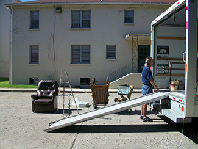

=========
Stressors
=========

.. contents::
   :depth: 3
..

.. container::

   By the end of this section, you will be able to: \* Describe
   different types of possible stressors \* Explain the importance of
   life changes as potential stressors \* Describe the Social
   Readjustment Rating Scale \* Understand the concepts of job strain
   and job burnout

For an individual to experience **stress**\ {: data-type=“term”
.no-emphasis}, he must first encounter a potential **stressor**\ {:
data-type=“term” .no-emphasis}. In general, stressors can be placed into
one of two broad categories: chronic and acute. Chronic stressors
include events that persist over an extended period of time, such as
caring for a parent with dementia, long-term unemployment, or
imprisonment. Acute stressors involve brief focal events that sometimes
continue to be experienced as overwhelming well after the event has
ended, such as falling on an icy sidewalk and breaking your leg (Cohen,
Janicki-Deverts, & Miller, 2007). Whether chronic or acute, potential
stressors come in many shapes and sizes. They can include major
traumatic events, significant life changes, daily hassles, as well as
other situations in which a person is regularly exposed to threat,
challenge, or danger.

TRAUMATIC EVENTS
================

Some stressors involve traumatic events or situations in which a person
is exposed to actual or threatened death or serious injury. Stressors in
this category include exposure to military combat, threatened or actual
physical assaults (e.g., physical attacks, sexual assault, robbery,
childhood abuse), terrorist attacks, natural disasters (e.g.,
earthquakes, floods, hurricanes), and automobile accidents. Men,
non-Whites, and individuals in lower socioeconomic status (SES) groups
report experiencing a greater number of traumatic events than do women,
Whites, and individuals in higher SES groups (Hatch & Dohrenwend, 2007).
Some individuals who are exposed to stressors of extreme magnitude
develop post-traumatic stress disorder (PTSD): a chronic stress reaction
characterized by experiences and behaviors that may include intrusive
and painful memories of the stressor event, jumpiness, persistent
negative emotional states, detachment from others, angry outbursts, and
avoidance of reminders of the event (American Psychiatric Association
[APA], 2013).

LIFE CHANGES
============

Most stressors that we encounter are not nearly as intense as the ones
described above. Many potential stressors we face involve events or
situations that require us to make changes in our ongoing lives and
require time as we adjust to those changes. Examples include death of a
close family member, marriage, divorce, and moving
(`[link] <#CNX_Psych_14_02_Moving>`__).

|A photo shows a person next to the back of a moving truck unloading
furniture.|\ {: #CNX_Psych_14_02_Moving}

In the 1960s, psychiatrists Thomas **Holmes**\ {: data-type=“term”
.no-emphasis} and Richard **Rahe**\ {: data-type=“term” .no-emphasis}
wanted to examine the link between life stressors and physical illness,
based on the hypothesis that life events requiring significant changes
in a person’s normal life routines are stressful, whether these events
are desirable or undesirable. They developed the **Social Readjustment
Rating Scale (SRRS)**\ {: data-type=“term”}, consisting of 43 life
events that require varying degrees of personal readjustment (Holmes &
Rahe, 1967). Many life events that most people would consider pleasant
(e.g., holidays, retirement, marriage) are among those listed on the
SRRS; these are examples of eustress. Holmes and Rahe also proposed that
life events can add up over time, and that experiencing a cluster of
stressful events increases one’s risk of developing physical illnesses.

In developing their scale, Holmes and Rahe asked 394 participants to
provide a numerical estimate for each of the 43 items; each estimate
corresponded to how much readjustment participants felt each event would
require. These estimates resulted in mean value scores for each
event—often called life change units (LCUs) (Rahe, McKeen, & Arthur,
1967). The numerical scores ranged from 11 to 100, representing the
perceived magnitude of life change each event entails. Death of a spouse
ranked highest on the scale with 100 LCUs, and divorce ranked second
highest with 73 LCUs. In addition, personal injury or illness, marriage,
and job termination also ranked highly on the scale with 53, 50, and 47
LCUs, respectively. Conversely, change in residence (20 LCUs), change in
eating habits (15 LCUs), and vacation (13 LCUs) ranked low on the scale
(`[link] <#Table_14_02_01>`__). Minor violations of the law ranked the
lowest with 11 LCUs. To complete the scale, participants checked yes for
events experienced within the last 12 months. LCUs for each checked item
are totaled for a score quantifying the amount of life change. Agreement
on the amount of adjustment required by the various life events on the
SRRS is highly consistent, even cross-culturally (Holmes & Masuda,
1974).

.. raw:: html

   <table id="Table_14_02_01" summary="A table shows life change units for different life events. The first column of the first row is labeled “life event,” and the second column is labeled “life change units. Beginning in row two, death of a close family member is 63 life change units, personal injury or illness is 53 life change units, dismissal from work is 47 life change units, change in financial state is 38 life change units, change to different line of work is 36 life change units, outstanding personal achievement is 28 life change units, beginning or ending school is 26 life change units, change in living conditions is 25 life change units, change in working hours or conditions is 20 life change units, change in residence is 20 life change units, change in schools is 20 life change units, change in social activities is 18 life change units, change in sleeping habits is 16 life change units, change in eating habits is 15 life change units, and minor violation of law is 11 life change units.">

.. raw:: html

   <caption>

Some Stressors on the Social Readjustment Rating Scale (Holmes & Rahe,
1967)

.. raw:: html

   </caption>

.. raw:: html

   <thead>

.. raw:: html

   <tr>

.. raw:: html

   <th data-align="center">

Life event

.. raw:: html

   </th>

.. raw:: html

   <th>

Life change units

.. raw:: html

   </th>

.. raw:: html

   </tr>

.. raw:: html

   </thead>

.. raw:: html

   <tbody>

.. raw:: html

   <tr>

.. raw:: html

   <td>

Death of a close family member

.. raw:: html

   </td>

.. raw:: html

   <td>

63

.. raw:: html

   </td>

.. raw:: html

   </tr>

.. raw:: html

   <tr>

.. raw:: html

   <td>

Personal injury or illness

.. raw:: html

   </td>

.. raw:: html

   <td>

53

.. raw:: html

   </td>

.. raw:: html

   </tr>

.. raw:: html

   <tr>

.. raw:: html

   <td>

Dismissal from work

.. raw:: html

   </td>

.. raw:: html

   <td>

47

.. raw:: html

   </td>

.. raw:: html

   </tr>

.. raw:: html

   <tr>

.. raw:: html

   <td>

Change in financial state

.. raw:: html

   </td>

.. raw:: html

   <td>

38

.. raw:: html

   </td>

.. raw:: html

   </tr>

.. raw:: html

   <tr>

.. raw:: html

   <td>

Change to different line of work

.. raw:: html

   </td>

.. raw:: html

   <td>

36

.. raw:: html

   </td>

.. raw:: html

   </tr>

.. raw:: html

   <tr>

.. raw:: html

   <td>

Outstanding personal achievement

.. raw:: html

   </td>

.. raw:: html

   <td>

28

.. raw:: html

   </td>

.. raw:: html

   </tr>

.. raw:: html

   <tr>

.. raw:: html

   <td>

Beginning or ending school

.. raw:: html

   </td>

.. raw:: html

   <td>

26

.. raw:: html

   </td>

.. raw:: html

   </tr>

.. raw:: html

   <tr>

.. raw:: html

   <td>

Change in living conditions

.. raw:: html

   </td>

.. raw:: html

   <td>

25

.. raw:: html

   </td>

.. raw:: html

   </tr>

.. raw:: html

   <tr>

.. raw:: html

   <td>

Change in working hours or conditions

.. raw:: html

   </td>

.. raw:: html

   <td>

20

.. raw:: html

   </td>

.. raw:: html

   </tr>

.. raw:: html

   <tr>

.. raw:: html

   <td>

Change in residence

.. raw:: html

   </td>

.. raw:: html

   <td>

20

.. raw:: html

   </td>

.. raw:: html

   </tr>

.. raw:: html

   <tr>

.. raw:: html

   <td>

Change in schools

.. raw:: html

   </td>

.. raw:: html

   <td>

20

.. raw:: html

   </td>

.. raw:: html

   </tr>

.. raw:: html

   <tr>

.. raw:: html

   <td>

Change in social activities

.. raw:: html

   </td>

.. raw:: html

   <td>

18

.. raw:: html

   </td>

.. raw:: html

   </tr>

.. raw:: html

   <tr>

.. raw:: html

   <td>

Change in sleeping habits

.. raw:: html

   </td>

.. raw:: html

   <td>

16

.. raw:: html

   </td>

.. raw:: html

   </tr>

.. raw:: html

   <tr>

.. raw:: html

   <td>

Change in eating habits

.. raw:: html

   </td>

.. raw:: html

   <td>

15

.. raw:: html

   </td>

.. raw:: html

   </tr>

.. raw:: html

   <tr>

.. raw:: html

   <td>

Minor violation of the law

.. raw:: html

   </td>

.. raw:: html

   <td>

11

.. raw:: html

   </td>

.. raw:: html

   </tr>

.. raw:: html

   </tbody>

.. raw:: html

   </table>

Extensive research has demonstrated that accumulating a high number of
life change units within a brief period of time (one or two years) is
related to a wide range of physical illnesses (even accidents and
athletic injuries) and mental health problems (Monat & Lazarus, 1991;
Scully, Tosi, & Banning, 2000). In an early demonstration, researchers
obtained LCU scores for U.S. and Norwegian Navy personnel who were about
to embark on a six-month voyage. A later examination of medical records
revealed positive (but small) correlations between LCU scores prior to
the voyage and subsequent illness symptoms during the ensuing six-month
journey (Rahe, 1974). In addition, people tend to experience more
physical symptoms, such as backache, upset stomach, diarrhea, and acne,
on specific days in which self-reported LCU values are considerably
higher than normal, such as the day of a family member’s wedding (Holmes
& Holmes, 1970).

The Social Readjustment Rating Scale (SRRS) provides researchers a
simple, easy-to-administer way of assessing the amount of stress in
people’s lives, and it has been used in hundreds of studies (Thoits,
2010). Despite its widespread use, the scale has been subject to
criticism. First, many of the items on the SRRS are vague; for example,
death of a close friend could involve the death of a long-absent
childhood friend that requires little social readjustment (Dohrenwend,
2006). In addition, some have challenged its assumption that undesirable
life events are no more stressful than desirable ones (Derogatis &
Coons, 1993). However, most of the available evidence suggests that, at
least as far as mental health is concerned, undesirable or negative
events are more strongly associated with poor outcomes (such as
depression) than are desirable, positive events (Hatch & Dohrenwend,
2007). Perhaps the most serious criticism is that the scale does not
take into consideration respondents’ appraisals of the life events it
contains. As you recall, appraisal of a stressor is a key element in the
conceptualization and overall experience of stress. Being fired from
work may be devastating to some but a welcome opportunity to obtain a
better job for others. The SRRS remains one of the most well-known
instruments in the study of stress, and it is a useful tool for
identifying potential stress-related health outcomes (Scully et al.,
2000).

.. container:: psychology link-to-learning

   Go to this `site <http://openstax.org/l/SRRS>`__ to complete the SRRS
   scale and determine the total number of LCUs you have experienced
   over the last year.

.. container:: psychology connect-the-concepts

   .. container::

      Correlational Research

   The Holmes and Rahe Social Readjustment Rating Scale (SRRS) uses the
   **correlational research**\ {: data-type=“term” .no-emphasis} method
   to identify the connection between stress and health. That is,
   respondents’ LCU scores are correlated with the number or frequency
   of self-reported symptoms indicating health problems. These
   correlations are typically positive—as LCU scores increase, the
   number of symptoms increase. Consider all the thousands of studies
   that have used this scale to correlate stress and illness symptoms:
   If you were to assign an average correlation coefficient to this body
   of research, what would be your best guess? How strong do you think
   the correlation coefficient would be? Why can’t the SRRS show a
   causal relationship between stress and illness? If it were possible
   to show causation, do you think stress causes illness or illness
   causes stress?

HASSLES
=======

Potential stressors do not always involve major life events. **Daily
hassles**\ {: data-type=“term”}—the minor irritations and annoyances
that are part of our everyday lives (e.g., rush hour traffic, lost keys,
obnoxious coworkers, inclement weather, arguments with friends or
family)—can build on one another and leave us just as stressed as life
change events (`[link] <#CNX_Psych_14_02_DailyHass>`__) (Kanner, Coyne,
Schaefer, & Lazarus, 1981).

|Photograph A shows heavy traffic going both ways on a scenic road.
Photograph B shows a crowded bus with people sitting in the seats and
standing in the aisles.|\ {: #CNX_Psych_14_02_DailyHass}

Researchers have demonstrated that the frequency of daily hassles is
actually a better predictor of both physical and psychological health
than are life change units. In a well-known study of San Francisco
residents, the frequency of daily hassles was found to be more strongly
associated with physical health problems than were life change events
(DeLongis, Coyne, Dakof, Folkman, & Lazarus, 1982). In addition, daily
minor hassles, especially interpersonal conflicts, often lead to
negative and distressed mood states (Bolger, DeLongis, Kessler, &
Schilling, 1989). Cyber hassles that occur on social media may represent
a new source of stress. In one investigation, undergraduates who, over a
10-week period, reported greater Facebook-induced stress (e.g., guilt or
discomfort over rejecting friend requests and anger or sadness over
being unfriended by another) experienced increased rates of upper
respiratory infections, especially if they had larger social networks
(Campisi et al., 2012). Clearly, daily hassles can add up and take a
toll on us both emotionally and physically.

OTHER STRESSORS
===============

Stressors can include situations in which one is frequently exposed to
challenging and unpleasant events, such as difficult, demanding, or
unsafe working conditions. Although most jobs and occupations can at
times be demanding, some are clearly more stressful than others
(`[link] <#CNX_Psych_14_02_Guard>`__). For example, most people would
likely agree that a firefighter’s work is inherently more stressful than
that of a florist. Equally likely, most would agree that jobs containing
various unpleasant elements, such as those requiring exposure to loud
noise (heavy equipment operator), constant harassment and threats of
physical violence (prison guard), perpetual frustration (bus driver in a
major city), or those mandating that an employee work alternating day
and night shifts (hotel desk clerk), are much more demanding—and thus,
more stressful—than those that do not contain such elements.
`[link] <#Table_14_02_02>`__ lists several occupations and some of the
specific stressors associated with those occupations (Sulsky & Smith,
2005).

|Photograph A shows uniformed police officers marching with synchronized
arms swinging. Photograph B shows firefighters fighting a fire.|\ {:
#CNX_Psych_14_02_Guard}

.. raw:: html

   <table id="Table_14_02_02" summary="A table shows stressors associated with different occupations. The first column of the first row is labeled “occupation,, and the second column is labeled “stressors specific to occupation (Sulsky &amp; Smith, 2005).” Beginning in row two, police officer has the specific stressors of physical dangers, excessive paperwork, red tape, dealing with court system, coworker and supervisor conflict, lack of support from the public. Firefighter has the specific stressors of uncertainty over whether a serious fire or hazard awaits after an alarm. Social worker has the specific stressors of little positive feedback from jobs or from the public, unsafe work environments, frustration in dealing with bureaucracy, excessive paperwork, sense of personal responsibility for clients, work overload. Teacher has the specific stressors of excessive paperwork, lack of adequate supplies or facilities, work overload, lack of positive feedback, vandalism, threat of physical violence. Nurse has the specific stressors of work overload, heavy physical work, patient concerns (dealing with death and medical concerns), interpersonal problems with other medical staff (especially physicians. Emergency medical worker has the specific stressors of unpredictable and extreme nature of the job, inexperience. Air traffic controller has the specific stressors of little control over potential crisis situations and workload, fear of causing an accident, peak traffic situations, general work environment. Clerical and secretarial work has the specific stressors of little control over job mobility, unsupportive supervisors, work overload, lack of perceived control. Managerial work has the specific stressors of work overload, conflict and ambiguity in defining the managerial role, difficult work relationships.">

.. raw:: html

   <caption>

Occupations and Their Related Stressors

.. raw:: html

   </caption>

.. raw:: html

   <thead>

.. raw:: html

   <tr>

.. raw:: html

   <th>

Occupation

.. raw:: html

   </th>

.. raw:: html

   <th data-align="center">

Stressors Specific to Occupation (Sulsky & Smith, 2005)

.. raw:: html

   </th>

.. raw:: html

   </tr>

.. raw:: html

   </thead>

.. raw:: html

   <tbody>

.. raw:: html

   <tr>

.. raw:: html

   <td>

Police officer

.. raw:: html

   </td>

.. raw:: html

   <td>

physical dangers, excessive paperwork, red tape, dealing with court
system, coworker and supervisor conflict, lack of support from the
public

.. raw:: html

   </td>

.. raw:: html

   </tr>

.. raw:: html

   <tr>

.. raw:: html

   <td>

Firefighter

.. raw:: html

   </td>

.. raw:: html

   <td>

uncertainty over whether a serious fire or hazard awaits after an alarm

.. raw:: html

   </td>

.. raw:: html

   </tr>

.. raw:: html

   <tr>

.. raw:: html

   <td>

Social worker

.. raw:: html

   </td>

.. raw:: html

   <td>

little positive feedback from jobs or from the public, unsafe work
environments, frustration in dealing with bureaucracy, excessive
paperwork, sense of personal responsibility for clients, work overload

.. raw:: html

   </td>

.. raw:: html

   </tr>

.. raw:: html

   <tr>

.. raw:: html

   <td>

Teacher

.. raw:: html

   </td>

.. raw:: html

   <td>

Excessive paperwork, lack of adequate supplies or facilities, work
overload, lack of positive feedback, vandalism, threat of physical
violence

.. raw:: html

   </td>

.. raw:: html

   </tr>

.. raw:: html

   <tr>

.. raw:: html

   <td>

Nurse

.. raw:: html

   </td>

.. raw:: html

   <td>

Work overload, heavy physical work, patient concerns (dealing with death
and medical concerns), interpersonal problems with other medical staff
(especially physicians)

.. raw:: html

   </td>

.. raw:: html

   </tr>

.. raw:: html

   <tr>

.. raw:: html

   <td>

Emergency medical worker

.. raw:: html

   </td>

.. raw:: html

   <td>

Unpredictable and extreme nature of the job, inexperience

.. raw:: html

   </td>

.. raw:: html

   </tr>

.. raw:: html

   <tr>

.. raw:: html

   <td>

Air traffic controller

.. raw:: html

   </td>

.. raw:: html

   <td>

Little control over potential crisis situations and workload, fear of
causing an accident, peak traffic situations, general work environment

.. raw:: html

   </td>

.. raw:: html

   </tr>

.. raw:: html

   <tr>

.. raw:: html

   <td>

Clerical and secretarial work

.. raw:: html

   </td>

.. raw:: html

   <td>

Little control over job mobility, unsupportive supervisors, work
overload, lack of perceived control

.. raw:: html

   </td>

.. raw:: html

   </tr>

.. raw:: html

   <tr>

.. raw:: html

   <td>

Managerial work

.. raw:: html

   </td>

.. raw:: html

   <td>

Work overload, conflict and ambiguity in defining the managerial role,
difficult work relationships

.. raw:: html

   </td>

.. raw:: html

   </tr>

.. raw:: html

   </tbody>

.. raw:: html

   </table>

Although the specific stressors for these occupations are diverse, they
seem to share two common denominators: heavy workload and uncertainty
about and lack of control over certain aspects of a job. Both of these
factors contribute to **job strain**\ {: data-type=“term”}, a work
situation that combines excessive job demands and workload with little
discretion in decision making or job control (Karasek & Theorell, 1990).
Clearly, many occupations other than the ones listed in
`[link] <#Table_14_02_02>`__ involve at least a moderate amount of job
strain in that they often involve heavy workloads and little job control
(e.g., inability to decide when to take breaks). Such jobs are often
low-status and include those of factory workers, postal clerks,
supermarket cashiers, taxi drivers, and short-order cooks. Job strain
can have adverse consequences on both physical and mental health; it has
been shown to be associated with increased risk of hypertension (Schnall
& Landsbergis, 1994), heart attacks (Theorell et al., 1998), recurrence
of heart disease after a first heart attack (Aboa-Éboulé et al., 2007),
significant weight loss or gain (Kivimäki et al., 2006), and major
depressive disorder (Stansfeld, Shipley, Head, & Fuhrer, 2012). A
longitudinal study of over 10,000 British civil servants reported that
workers under 50 years old who earlier had reported high job strain were
68% more likely to later develop heart disease than were those workers
under 50 years old who reported little job strain (Chandola et al.,
2008).

Some people who are exposed to chronically stressful work conditions can
experience **job burnout**\ {: data-type=“term”}, which is a general
sense of emotional exhaustion and cynicism in relation to one’s job
(Maslach & Jackson, 1981). Job burnout occurs frequently among those in
human service jobs (e.g., social workers, teachers, therapists, and
police officers). Job burnout consists of three dimensions. The first
dimension is exhaustion—a sense that one’s emotional resources are
drained or that one is at the end of her rope and has nothing more to
give at a psychological level. Second, job burnout is characterized by
depersonalization: a sense of emotional detachment between the worker
and the recipients of his services, often resulting in callous, cynical,
or indifferent attitudes toward these individuals. Third, job burnout is
characterized by diminished personal accomplishment, which is the
tendency to evaluate one’s work negatively by, for example, experiencing
dissatisfaction with one’s job-related accomplishments or feeling as
though one has categorically failed to influence others’ lives through
one’s work.

Job strain appears to be one of the greatest risk factors leading to job
burnout, which is most commonly observed in workers who are older (ages
55–64), unmarried, and whose jobs involve manual labor. Heavy alcohol
consumption, physical inactivity, being overweight, and having a
physical or lifetime mental disorder are also associated with job
burnout (Ahola, et al., 2006). In addition, depression often co-occurs
with job burnout. One large-scale study of over 3,000 Finnish employees
reported that half of the participants with severe job burnout had some
form of depressive disorder (Ahola et al., 2005). Job burnout is often
precipitated by feelings of having invested considerable energy, effort,
and time into one’s work while receiving little in return (e.g., little
respect or support from others or low pay) (Tatris, Peeters, Le Blanc,
Schreurs, & Schaufeli, 2001).

As an illustration, consider CharlieAnn, a nursing assistant who worked
in a nursing home. CharlieAnn worked long hours for little pay in a
difficult facility. Her supervisor was domineering, unpleasant, and
unsupportive; he was disrespectful of CharlieAnn’s personal time,
frequently informing her at the last minute she must work several
additional hours after her shift ended or that she must report to work
on weekends. CharlieAnn had very little autonomy at her job. She had
little say in her day-to-day duties and how to perform them, and she was
not permitted to take breaks unless her supervisor explicitly told her
that she could. CharlieAnn did not feel as though her hard work was
appreciated, either by supervisory staff or by the residents of the
home. She was very unhappy over her low pay, and she felt that many of
the residents treated her disrespectfully.

After several years, CharlieAnn began to hate her job. She dreaded going
to work in the morning, and she gradually developed a callous, hostile
attitude toward many of the residents. Eventually, she began to feel as
though she could no longer help the nursing home residents. CharlieAnn’s
absenteeism from work increased, and one day she decided that she had
had enough and quit. She now has a job in sales, vowing never to work in
nursing again.

.. container:: psychology link-to-learning

   A humorous example illustrating lack of supervisory support can be
   found in the 1999 comedy *Office Space*. Follow `this
   link <http://openstax.org/l/officespace>`__ to view a brief excerpt
   in which a sympathetic character’s insufferable boss makes a
   last-minute demand that he “go ahead and come in” to the office on
   both Saturday and Sunday.

Finally, our close relationships with friends and family—particularly
the negative aspects of these relationships—can be a potent source of
stress. Negative aspects of close relationships can include adverse
exchanges and conflicts, lack of emotional support or confiding, and
lack of reciprocity. All of these can be overwhelming, threatening to
the relationship, and thus stressful. Such stressors can take a toll
both emotionally and physically. A longitudinal investigation of over
9,000 British civil servants found that those who at one point had
reported the highest levels of negative interactions in their closest
relationship were 34% more likely to experience serious heart problems
(fatal or nonfatal heart attacks) over a 13–15 year period, compared to
those who experienced the lowest levels of negative interaction (De
Vogli, Chandola & Marmot, 2007).

Summary
=======

Stressors can be chronic (long term) or acute (short term), and can
include traumatic events, significant life changes, daily hassles, and
situations in which people are frequently exposed to challenging and
unpleasant events. Many potential stressors include events or situations
that require us to make changes in our lives, such as a divorce or
moving to a new residence. Thomas Holmes and Richard Rahe developed the
Social Readjustment Rating Scale (SRRS) to measure stress by assigning a
number of life change units to life events that typically require some
adjustment, including positive events. Although the SRRS has been
criticized on a number of grounds, extensive research has shown that the
accumulation of many LCUs is associated with increased risk of illness.
Many potential stressors also include daily hassles, which are minor
irritations and annoyances that can build up over time. In addition,
jobs that are especially demanding, offer little control over one’s
working environment, or involve unfavorable working conditions can lead
to job strain, thereby setting the stage for job burnout.

Review Questions
================

.. container::

   .. container::

      According to the Holmes and Rahe scale, which life event requires
      the greatest amount of readjustment?

      1. marriage
      2. personal illness
      3. divorce
      4. death of spouse {: type=“a”}

   .. container::

      D

.. container::

   .. container::

      While waiting to pay for his weekly groceries at the supermarket,
      Paul had to wait about 20 minutes in a long line at the checkout
      because only one cashier was on duty. When he was finally ready to
      pay, his debit card was declined because he did not have enough
      money left in his checking account. Because he had left his credit
      cards at home, he had to place the groceries back into the cart
      and head home to retrieve a credit card. While driving back to his
      home, traffic was backed up two miles due to an accident. These
      events that Paul had to endure are best characterized as
      \________.

      1. chronic stressors
      2. acute stressors
      3. daily hassles
      4. readjustment occurrences {: type=“a”}

   .. container::

      C

.. container::

   .. container::

      What is one of the major criticisms of the Social Readjustment
      Rating Scale?

      1. It has too few items.
      2. It was developed using only people from the New England region
         of the United States.
      3. It does not take into consideration how a person appraises an
         event.
      4. None of the items included are positive. {: type=“a”}

   .. container::

      C

.. container::

   .. container::

      Which of the following is not a dimension of job burnout?

      1. depersonalization
      2. hostility
      3. exhaustion
      4. diminished personal accomplishment {: type=“a”}

   .. container::

      B

Critical Thinking Questions
===========================

.. container::

   .. container::

      Review the items on the Social Readjustment Rating Scale. Select
      one of the items and discuss how it might bring about distress and
      eustress.

   .. container::

      Answers will vary. For example, many people look forward to
      celebrating the Christmas holiday, but it can be stressful in that
      it requires some degree of readjustment. Getting together with
      family may bring eustress, while the schedule and travel demands
      of may bring distress. Giving gifts to others and seeing their
      enjoyment may bring eustress, but the financial burden associated
      with buying presents could produce distress. Each of these things
      requires making some minor adjustments to one’s life, and thus is
      considered somewhat stressful.

.. container::

   .. container::

      Job burnout tends to be high in people who work in human service
      jobs. Considering the three dimensions of job burnout, explain how
      various job aspects unique to being a police officer might lead to
      job burnout in that line of work.

   .. container::

      Answers will vary. Many calls that police officers make can be
      emotionally draining (e.g., tragic deaths, suicides, and children
      who live in squalid conditions), which might eventually lead to
      feelings of exhaustion that one can no longer deal with such
      things. Depersonalization may occur if a police officer works in
      an environment in which she feels disrespected and unappreciated,
      which may lead to cynical and callous feelings toward the public.
      Constant disrespect from others may diminish a police officer’s
      sense of personal accomplishment.

Personal Application Question
=============================

.. container::

   .. container::

      Suppose you want to design a study to examine the relationship
      between stress and illness, but you cannot use the Social
      Readjustment Rating Scale. How would you go about measuring
      stress? How would you measure illness? What would you need to do
      in order to tell if there is a cause-effect relationship between
      stress and illness?

.. container::

   .. rubric:: Glossary
      :name: glossary

   {: data-type=“glossary-title”}

   daily hassles
      minor irritations and annoyances that are part of our everyday
      lives and are capable of producing stress ^
   job burnout
      general sense of emotional exhaustion and cynicism in relation to
      one’s job; consists of three dimensions: exhaustion,
      depersonalization, and sense of diminished personal accomplishment
      ^
   job strain
      work situation involving the combination of excessive job demands
      and workload with little decision making latitude or job control ^
   Social Readjustment Rating Scale (SRRS)
      popular scale designed to measure stress; consists of 43
      potentially stressful events, each of which has a numerical value
      quantifying how much readjustment is associated with the event

.. |Photograph A shows heavy traffic going both ways on a scenic road. Photograph B shows a crowded bus with people sitting in the seats and standing in the aisles.| image:: ../resources/CNX_Psych_14_02_DailyHass.jpg
.. |Photograph A shows uniformed police officers marching with synchronized arms swinging. Photograph B shows firefighters fighting a fire.| image:: ../resources/CNX_Psych_14_02_Guard.jpg
