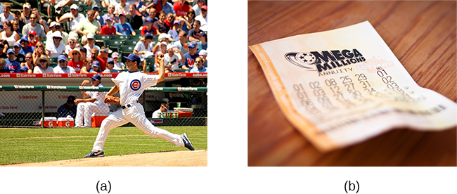

========================
The Pursuit of Happiness
========================

.. contents::
   :depth: 3
..

.. container::

   By the end of this section, you will be able to: \* Define and
   discuss happiness, including its determinants \* Describe the field
   of positive psychology and identify the kinds of problems it
   addresses \* Explain the meaning of positive affect and discuss its
   importance in health outcomes \* Describe the concept of flow and its
   relationship to happiness and fulfillment

Although the study of **stress**\ {: data-type=“term” .no-emphasis} and
how it affects us physically and psychologically is fascinating, it
is—admittedly—somewhat of a grim topic. Psychology is also interested in
the study of a more upbeat and encouraging approach to human affairs—the
quest for happiness.

HAPPINESS
=========

America’s founders declared that its citizens have an unalienable right
to pursue happiness. But what is happiness? When asked to define the
term, people emphasize different aspects of this elusive state. Indeed,
happiness is somewhat ambiguous and can be defined from different
perspectives (Martin, 2012). Some people, especially those who are
highly committed to their religious faith, view happiness in ways that
emphasize virtuosity, reverence, and enlightened spirituality. Others
see happiness as primarily contentment—the inner peace and joy that come
from deep satisfaction with one’s surroundings, relationships with
others, accomplishments, and oneself. Still others view happiness mainly
as pleasurable engagement with their personal environment—having a
career and hobbies that are engaging, meaningful, rewarding, and
exciting. These differences, of course, are merely differences in
emphasis. Most people would probably agree that each of these views, in
some respects, captures the essence of happiness.

Elements of Happiness
---------------------

Some psychologists have suggested that happiness consists of three
distinct elements: the pleasant life, the good life, and the meaningful
life, as shown in `[link] <#CNX_Psych_14_05_Happiness>`__ (Seligman,
2002; Seligman, Steen, Park, & Peterson, 2005). The pleasant life is
realized through the attainment of day-to-day pleasures that add fun,
joy, and excitement to our lives. For example, evening walks along the
beach and a fulfilling sex life can enhance our daily pleasure and
contribute to the pleasant life. The good life is achieved through
identifying our unique skills and abilities and engaging these talents
to enrich our lives; those who achieve the good life often find
themselves absorbed in their work or their recreational pursuits. The
meaningful life involves a deep sense of fulfillment that comes from
using our talents in the service of the greater good: in ways that
benefit the lives of others or that make the world a better place. In
general, the happiest people tend to be those who pursue the full
life—they orient their pursuits toward all three elements (Seligman et
al., 2005).

|A Venn diagram features three circles: one labeled “Good life: using
skills for enrichment,” one labeled “Pleasant life: enjoying daily
pleasures,” and another labeled: Meaningful life: contributing to the
greater good.” All three circles overlap at a section labeled
“Happiness.”|\ {: #CNX_Psych_14_05_Happiness}

For practical purposes, a precise definition of **happiness**\ {:
data-type=“term”} might incorporate each of these elements: an enduring
state of mind consisting of joy, contentment, and other positive
emotions, plus the sense that one’s life has meaning and value
(Lyubomirsky, 2001). The definition implies that happiness is a
long-term state—what is often characterized as subjective
well-being—rather than merely a transient positive mood we all
experience from time to time. It is this enduring happiness that has
captured the interests of psychologists and other social scientists.

The study of happiness has grown dramatically in the last three decades
(Diener, 2013). One of the most basic questions that happiness
investigators routinely examine is this: How happy are people in
general? The average person in the world tends to be relatively happy
and tends to indicate experiencing more positive feelings than negative
feelings (Diener, Ng, Harter, & Arora, 2010). When asked to evaluate
their current lives on a scale ranging from 0 to 10 (with 0 representing
“worst possible life” and 10 representing “best possible life”), people
in more than 150 countries surveyed from 2010–2012 reported an average
score of 5.2. People who live in North America, Australia, and New
Zealand reported the highest average score at 7.1, whereas those living
Sub-Saharan Africa reported the lowest average score at 4.6 (Helliwell,
Layard, & Sachs, 2013). Worldwide, the five happiest countries are
Denmark, Norway, Switzerland, the Netherlands, and Sweden; the United
States is ranked 17th happiest (`[link] <#CNX_Psych_14_05_Denmark>`__)
(Helliwell et al., 2013).

|Photograph A shows a row of buildings by the water in Denmark.
Photograph B shows an aerial view of a city in the United States
including several skyscrapers.|\ {: #CNX_Psych_14_05_Denmark}

Several years ago, a Gallup survey of more than 1,000 U.S. adults found
that 52% reported that they were “very happy.” In addition, more than 8
in 10 indicated that they were “very satisfied” with their lives
(Carroll, 2007). However, a recent poll of 2,345 U.S. adults
surprisingly revealed that only one-third reported they are “very
happy.” The poll also revealed that the happiness levels of certain
groups, including minorities, recent college graduates, and the
disabled, have trended downward in recent years (Gregoire, 2013).
Although it is difficult to explain this apparent decline in happiness,
it may be connected to the challenging economic conditions the United
States has endured over the last several years. Of course, this
presumption would imply that happiness is closely tied to one’s
finances. But, is it? This question brings us to the next important
issue: What factors influence happiness?

Factors Connected to Happiness
------------------------------

What really makes people happy? What factors contribute to sustained joy
and contentment? Is it money, attractiveness, material possessions, a
rewarding occupation, a satisfying relationship? Extensive research over
the years has examined this question. One finding is that age is related
to happiness: Life satisfaction usually increases the older people get,
but there do not appear to be gender differences in happiness (Diener,
Suh, Lucas, & Smith, 1999). Although it is important to point out that
much of this work has been correlational, many of the key findings (some
of which may surprise you) are summarized below.

Family and other social relationships appear to be key factors
correlated with happiness. Studies show that married people report being
happier than those who are single, divorced, or widowed (Diener et al.,
1999). Happy individuals also report that their marriages are fulfilling
(Lyubomirsky, King, & Diener, 2005). In fact, some have suggested that
satisfaction with marriage and family life is the strongest predictor of
happiness (Myers, 2000). Happy people tend to have more friends, more
high-quality social relationships, and stronger social support networks
than less happy people (Lyubomirsky et al., 2005). Happy people also
have a high frequency of contact with friends (Pinquart & Sörensen,
2000).

Can money buy happiness? In general, extensive research suggests that
the answer is yes, but with several caveats. While a nation’s per capita
gross domestic product (GDP) is associated with happiness levels
(Helliwell et al., 2013), changes in GDP (which is a less certain index
of household income) bear little relationship to changes in happiness
(Diener, Tay, & Oishi, 2013). On the whole, residents of affluent
countries tend to be happier than residents of poor countries; within
countries, wealthy individuals are happier than poor individuals, but
the association is much weaker (Diener & Biswas-Diener, 2002). To the
extent that it leads to increases in purchasing power, increases in
income are associated with increases in happiness (Diener, Oishi, &
Ryan, 2013). However, income within societies appears to correlate with
happiness only up to a point. In a study of over 450,000 U.S. residents
surveyed by the Gallup Organization, Kahneman and Deaton (2010) found
that well-being rises with annual income, but only up to $75,000. The
average increase in reported well-being for people with incomes greater
than $75,000 was null. As implausible as these findings might seem—after
all, higher incomes would enable people to indulge in Hawaiian
vacations, prime seats as sporting events, expensive automobiles, and
expansive new homes—higher incomes may impair people’s ability to savor
and enjoy the small pleasures of life (Kahneman, 2011). Indeed,
researchers in one study found that participants exposed to a subliminal
reminder of wealth spent less time savoring a chocolate candy bar and
exhibited less enjoyment of this experience than did participants who
were not reminded of wealth (Quoidbach, Dunn, Petrides, & Mikolajczak,
2010).

What about education and employment? Happy people, compared to those who
are less happy, are more likely to graduate from college and secure more
meaningful and engaging jobs. Once they obtain a job, they are also more
likely to succeed (Lyubomirsky et al., 2005). While education shows a
positive (but weak) correlation with happiness, intelligence is not
appreciably related to happiness (Diener et al., 1999).

Does religiosity correlate with happiness? In general, the answer is yes
(Hackney & Sanders, 2003). However, the relationship between religiosity
and happiness depends on societal circumstances. Nations and states with
more difficult living conditions (e.g., widespread hunger and low life
expectancy) tend to be more highly religious than societies with more
favorable living conditions. Among those who live in nations with
difficult living conditions, religiosity is associated with greater
well-being; in nations with more favorable living conditions, religious
and nonreligious individuals report similar levels of well-being
(Diener, Tay, & Myers, 2011).

Clearly the living conditions of one’s nation can influence factors
related to happiness. What about the influence of one’s culture? To the
extent that people possess characteristics that are highly valued by
their culture, they tend to be happier (Diener, 2012). For example,
self-esteem is a stronger predictor of life satisfaction in
individualistic cultures than in collectivistic cultures (Diener,
Diener, & Diener, 1995), and extraverted people tend to be happier in
extraverted cultures than in introverted cultures (Fulmer et al., 2010).

So we’ve identified many factors that exhibit some correlation to
happiness. What factors don’t show a correlation? Researchers have
studied both parenthood and physical attractiveness as potential
contributors to happiness, but no link has been identified. Although
people tend to believe that parenthood is central to a meaningful and
fulfilling life, aggregate findings from a range of countries indicate
that people who do not have children are generally happier than those
who do (Hansen, 2012). And although one’s perceived level of
attractiveness seems to predict happiness, a person’s objective physical
attractiveness is only weakly correlated with her happiness (Diener,
Wolsic, & Fujita, 1995).

Life Events and Happiness
-------------------------

An important point should be considered regarding happiness. People are
often poor at affective forecasting: predicting the intensity and
duration of their future emotions (Wilson & Gilbert, 2003). In one
study, nearly all newlywed spouses predicted their marital satisfaction
would remain stable or improve over the following four years; despite
this high level of initial optimism, their marital satisfaction actually
declined during this period (Lavner, Karner, & Bradbury, 2013). In
addition, we are often incorrect when estimating how our long-term
happiness would change for the better or worse in response to certain
life events. For example, it is easy for many of us to imagine how
euphoric we would feel if we won the lottery, were asked on a date by an
attractive celebrity, or were offered our dream job. It is also easy to
understand how long-suffering fans of the Chicago Cubs baseball team,
which has not won a World Series championship since 1908, think they
would feel permanently elated if their team would finally win another
World Series. Likewise, it easy to predict that we would feel
permanently miserable if we suffered a crippling accident or if a
romantic relationship ended.

However, something similar to sensory adaptation often occurs when
people experience emotional reactions to life events. In much the same
way our senses adapt to changes in stimulation (e.g., our eyes adapting
to bright light after walking out of the darkness of a movie theater
into the bright afternoon sun), we eventually adapt to changing
emotional circumstances in our lives (Brickman & Campbell, 1971; Helson,
1964). When an event that provokes positive or negative emotions occurs,
at first we tend to experience its emotional impact at full intensity.
We feel a burst of pleasure following such things as a marriage
proposal, birth of a child, acceptance to law school, an inheritance,
and the like; as you might imagine, lottery winners experience a surge
of happiness after hitting the jackpot (Lutter, 2007). Likewise, we
experience a surge of misery following widowhood, a divorce, or a layoff
from work. In the long run, however, we eventually adjust to the
emotional new normal; the emotional impact of the event tends to erode,
and we eventually revert to our original baseline happiness levels.
Thus, what was at first a thrilling lottery windfall or World Series
championship eventually loses its luster and becomes the status quo
(`[link] <#CNX_Psych_14_05_Cubs>`__). Indeed, dramatic life events have
much less long-lasting impact on happiness than might be expected
(Brickman, Coats, & Janoff-Bulman, 1978).

|Photograph A shows a pitcher for the Cubs on the mound. Photograph B
shows a lottery ticket.|\ {: #CNX_Psych_14_05_Cubs}

Recently, some have raised questions concerning the extent to which
important life events can permanently alter people’s happiness set
points (Diener, Lucas, & Scollon, 2006). Evidence from a number of
investigations suggests that, in some circumstances, happiness levels do
not revert to their original positions. For example, although people
generally tend to adapt to marriage so that it no longer makes them
happier or unhappier than before, they often do not fully adapt to
unemployment or severe disabilities (Diener, 2012).
`[link] <#CNX_Psych_14_05_AdaptationCh>`__, which is based on
longitudinal data from a sample of over 3,000 German respondents, shows
life satisfaction scores several years before, during, and after various
life events, and it illustrates how people adapt (or fail to adapt) to
these events. German respondents did not get lasting emotional boosts
from marriage; instead, they reported brief increases in happiness,
followed by quick adaptation. In contrast, widows and those who had been
laid off experienced sizeable decreases in happiness that appeared to
result in long-term changes in life satisfaction (Diener et al., 2006).
Further, longitudinal data from the same sample showed that happiness
levels changed significantly over time for nearly a quarter of
respondents, with 9% showing major changes (Fujita & Diener, 2005).
Thus, long-term happiness levels can and do change for some people.

|A chart compares life satisfaction scores in the years before and after
significant life events. Life satisfaction is steady in the five years
before and after marriage. There is a gradual incline that peaks in the
year of marriage and declines slightly in the years following. With
respect to unemployment, life satisfaction five years before is roughly
the same as it is with marriage at that time, but begins to decline
sharply around 2 years before unemployment. One year after unemployment,
life satisfaction has risen slightly, but then becomes steady at a much
lower level than at five years before. With respect to the death of a
spouse, life satisfaction five years before is about the same as
marriage at that time, but steadily declines until the death, when it
starts to gradually rise again. After five years, the person who has
suffered the death of a spouse has roughly the same life satisfaction as
the person who was unemployed.|\ {: #CNX_Psych_14_05_AdaptationCh}

Increasing Happiness
--------------------

Some recent findings about happiness provide an optimistic picture,
suggesting that real changes in happiness are possible. For example,
thoughtfully developed well-being interventions designed to augment
people’s baseline levels of happiness may increase happiness in ways
that are permanent and long-lasting, not just temporary. These changes
in happiness may be targeted at individual, organizational, and societal
levels (Diener et al., 2006). Researchers in one study found that a
series of happiness interventions involving such exercises as writing
down three good things that occurred each day led to increases in
happiness that lasted over six months (Seligman et al., 2005).

Measuring **happiness**\ {: data-type=“term” .no-emphasis} and
well-being at the societal level over time may assist policy makers in
determining if people are generally happy or miserable, as well as when
and why they might feel the way they do. Studies show that average
national happiness scores (over time and across countries) relate
strongly to six key variables: per capita gross domestic product (GDP,
which reflects a nation’s economic standard of living), social support,
freedom to make important life choices, healthy life expectancy, freedom
from perceived corruption in government and business, and generosity
(Helliwell et al., 2013). Investigating why people are happy or unhappy
might help policymakers develop programs that increase happiness and
well-being within a society (Diener et al., 2006). Resolutions about
contemporary political and social issues that are frequent topics of
debate—such as poverty, taxation, affordable health care and housing,
clean air and water, and income inequality—might be best considered with
people’s happiness in mind.

POSITIVE PSYCHOLOGY
===================

In 1998, **Seligman**\ {: data-type=“term” .no-emphasis} (the same
person who conducted the learned helplessness experiments mentioned
earlier), who was then president of the American Psychological
Association, urged psychologists to focus more on understanding how to
build human strength and psychological well-being. In deliberately
setting out to create a new direction and new orientation for
psychology, Seligman helped establish a growing movement and field of
research called positive psychology (Compton, 2005). In a very general
sense, **positive psychology**\ {: data-type=“term”} can be thought of
as the science of happiness; it is an area of study that seeks to
identify and promote those qualities that lead to greater fulfillment in
our lives. This field looks at people’s strengths and what helps
individuals to lead happy, contented lives, and it moves away from
focusing on people’s pathology, faults, and problems. According to
Seligman and Csikszentmihalyi (2000), positive psychology,

   at the subjective level is about valued subjective experiences:
   well-being, contentment, and satisfaction (in the past); hope and
   optimism (for the future); and… happiness (in the present). At the
   individual level, it is about positive individual traits: the
   capacity for love and vocation, courage, interpersonal skill,
   aesthetic sensibility, perseverance, forgiveness, originality, future
   mindedness, spirituality, high talent, and wisdom. (p. 5)

Some of the topics studied by positive psychologists include altruism
and empathy, creativity, forgiveness and compassion, the importance of
positive emotions, enhancement of immune system functioning, savoring
the fleeting moments of life, and strengthening virtues as a way to
increase authentic happiness (Compton, 2005). Recent efforts in the
field of positive psychology have focused on extending its principles
toward peace and well-being at the level of the global community. In a
war-torn world in which conflict, hatred, and distrust are common, such
an extended “positive peace psychology” could have important
implications for understanding how to overcome oppression and work
toward global peace (Cohrs, Christie, White, & Das, 2013).

.. container:: psychology dig-deeper

   .. container::

      The Center for Investigating Healthy Minds

   On the campus of the University of Wisconsin–Madison, the Center for
   Investigating Healthy Minds at the Waisman Center conducts rigorous
   scientific research on healthy aspects of the mind, such as kindness,
   forgiveness, compassion, and mindfulness. Established in 2008 and led
   by renowned neuroscientist Dr. Richard J. Davidson, the Center
   examines a wide range of ideas, including such things as a kindness
   curriculum in schools, neural correlates of prosocial behavior,
   psychological effects of Tai Chi training, digital games to foster
   prosocial behavior in children, and the effectiveness of yoga and
   breathing exercises in reducing symptoms of post-traumatic stress
   disorder.

   According to its website, the Center was founded after Dr. Davidson
   was challenged by His Holiness, the 14th Dalai Lama, “to apply the
   rigors of science to study positive qualities of mind” (Center for
   Investigating Health Minds, 2013). The Center continues to conduct
   scientific research with the aim of developing mental health training
   approaches that help people to live happier, healthier lives).

Positive Affect and Optimism
----------------------------

Taking a cue from positive psychology, extensive research over the last
10-15 years has examined the importance of positive psychological
attributes in physical well-being. Qualities that help promote
psychological well-being (e.g., having meaning and purpose in life, a
sense of autonomy, positive emotions, and satisfaction with life) are
linked with a range of favorable health outcomes (especially improved
cardiovascular health) mainly through their relationships with
biological functions and health behaviors (such as diet, physical
activity, and sleep quality) (Boehm & Kubzansky, 2012). The quality that
has received attention is **positive affect**\ {: data-type=“term”},
which refers to pleasurable engagement with the environment, such as
happiness, joy, enthusiasm, alertness, and excitement (Watson, Clark, &
Tellegen, 1988). The characteristics of positive affect, as with
negative affect (discussed earlier), can be brief, long-lasting, or
trait-like (Pressman & Cohen, 2005). Independent of age, gender, and
income, positive affect is associated with greater social connectedness,
emotional and practical support, adaptive coping efforts, and lower
depression; it is also associated with longevity and favorable
physiological functioning (Steptoe, O’Donnell, Marmot, & Wardle, 2008).

Positive affect also serves as a protective factor against heart
disease. In a 10-year study of Nova Scotians, the rate of heart disease
was 22% lower for each one-point increase on the measure of positive
affect, from 1 (no positive affect expressed) to 5 (extreme positive
affect) (Davidson, Mostofsky, & Whang, 2010). In terms of our health,
the expression, “don’t worry, be happy” is helpful advice indeed. There
has also been much work suggesting that **optimism**\ {:
data-type=“term”}—the general tendency to look on the bright side of
things—is also a significant predictor of positive health outcomes.

Although positive affect and optimism are related in some ways, they are
not the same (Pressman & Cohen, 2005). Whereas positive affect is mostly
concerned with positive feeling states, optimism has been regarded as a
generalized tendency to expect that good things will happen (Chang,
2001). It has also been conceptualized as a tendency to view life’s
stressors and difficulties as temporary and external to oneself
(Peterson & Steen, 2002). Numerous studies over the years have
consistently shown that optimism is linked to longevity, healthier
behaviors, fewer postsurgical complications, better immune functioning
among men with prostate cancer, and better treatment adherence
(Rasmussen & Wallio, 2008). Further, optimistic people report fewer
physical symptoms, less pain, better physical functioning, and are less
likely to be rehospitalized following heart surgery (Rasmussen, Scheier,
& Greenhouse, 2009).

Flow
====

Another factor that seems to be important in fostering a deep sense of
well-being is the ability to derive flow from the things we do in life.
**Flow**\ {: data-type=“term”} is described as a particular experience
that is so engaging and engrossing that it becomes worth doing for its
own sake (Csikszentmihalyi, 1997). It is usually related to creative
endeavors and leisure activities, but it can also be experienced by
workers who like their jobs or students who love studying
(Csikszentmihalyi, 1999). Many of us instantly recognize the notion of
flow. In fact, the term derived from respondents’ spontaneous use of the
term when asked to describe how it felt when what they were doing was
going well. When people experience flow, they become involved in an
activity to the point where they feel they lose themselves in the
activity. They effortlessly maintain their concentration and focus, they
feel as though they have complete control of their actions, and time
seems to pass more quickly than usual (Csikszentmihalyi, 1997). Flow is
considered a pleasurable experience, and it typically occurs when people
are engaged in challenging activities that require skills and knowledge
they know they possess. For example, people would be more likely report
flow experiences in relation to their work or hobbies than in relation
to eating. When asked the question, “Do you ever get involved in
something so deeply that nothing else seems to matter, and you lose
track of time?” about 20% of Americans and Europeans report having these
flow-like experiences regularly (Csikszentmihalyi, 1997).

Although wealth and material possessions are nice to have, the notion of
flow suggests that neither are prerequisites for a happy and fulfilling
life. Finding an activity that you are truly enthusiastic about,
something so absorbing that doing it is reward itself (whether it be
playing tennis, studying Arabic, writing children’s novels, or cooking
lavish meals) is perhaps the real key. According to Csikszentmihalyi
(1999), creating conditions that make flow experiences possible should
be a top social and political priority. How might this goal be achieved?
How might flow be promoted in school systems? In the workplace? What
potential benefits might be accrued from such efforts?

In an ideal world, scientific research endeavors should inform us on how
to bring about a better world for all people. The field of positive
psychology promises to be instrumental in helping us understand what
truly builds hope, optimism, happiness, healthy relationships, flow, and
genuine personal fulfillment.

Summary
=======

Happiness is conceptualized as an enduring state of mind that consists
of the capacity to experience pleasure in daily life, as well as the
ability to engage one’s skills and talents to enrich one’s life and the
lives of others. Although people around the world generally report that
they are happy, there are differences in average happiness levels across
nations. Although people have a tendency to overestimate the extent to
which their happiness set points would change for the better or for the
worse following certain life events, researchers have identified a
number of factors that are consistently related to happiness. In recent
years, positive psychology has emerged as an area of study seeking to
identify and promote qualities that lead to greater happiness and
fulfillment in our lives. These components include positive affect,
optimism, and flow.

Review Questions
================

.. container::

   .. container::

      Which of the following is *not* one of the presumed components of
      happiness?

      1. using our talents to help improve the lives of others
      2. learning new skills
      3. regular pleasurable experiences
      4. identifying and using our talents to enrich our lives {:
         type=“a”}

   .. container::

      B

.. container::

   .. container::

      Researchers have identified a number of factors that are related
      to happiness. Which of the following is *not* one of them?

      1. age
      2. annual income up to $75,000
      3. physical attractiveness
      4. marriage {: type=“a”}

   .. container::

      C

.. container::

   .. container::

      How does positive affect differ from optimism?

      1. Optimism is more scientific than positive affect.
      2. Positive affect is more scientific than optimism.
      3. Positive affect involves feeling states, whereas optimism
         involves expectations.
      4. Optimism involves feeling states, whereas positive affect
         involves expectations. {: type=“a”}

   .. container::

      C

.. container::

   .. container::

      Carson enjoys writing mystery novels, and has even managed to
      publish some of his work. When he’s writing, Carson becomes
      extremely focused on his work; in fact, he becomes so absorbed
      that that he often loses track of time, often staying up well past
      3 a.m. Carson’s experience best illustrates the concept of
      \________.

      1. happiness set point
      2. adaptation
      3. positive affect
      4. flow {: type=“a”}

   .. container::

      D

Critical Thinking Questions
===========================

.. container::

   .. container::

      In considering the three dimensions of happiness discussed in this
      section (the pleasant life, the good life, and the meaningful
      life), what are some steps you could take to improve your personal
      level of happiness?

   .. container::

      Answers will vary, but may include mentioning things that boost
      positive emotions (the pleasant life), developing and using skills
      and talents (the good life), and using one’s talents to help
      others (the meaningful life).

.. container::

   .. container::

      The day before the drawing of a $300 million Powerball lottery,
      you notice that a line of people waiting to buy their Powerball
      tickets is stretched outside the door of a nearby convenience
      store. Based on what you’ve learned, provide some perspective on
      why these people are doing this, and what would likely happen if
      one of these individuals happened to pick the right numbers.

   .. container::

      These individuals’ affective forecasting is such that they believe
      their lives would be immeasurably happier if they won the lottery.
      Although winning would certainly lead to a surge of euphoria in
      the short term, long term they would likely adjust, and their
      happiness levels would likely return to normal. This fact is lost
      on most people, especially when considering the intensity and
      duration of their emotions following a major life event.

Personal Application Question
=============================

.. container::

   .. container::

      Think of an activity you participate in that you find engaging and
      absorbing. For example, this might be something like playing video
      games, reading, or a hobby. What are your experiences typically
      like while engaging in this activity? Do your experiences conform
      to the notion of flow? If so, how? Do you think these experiences
      have enriched your life? Why or why not?

.. container::

   .. rubric:: Glossary
      :name: glossary

   {: data-type=“glossary-title”}

   flow
      state involving intense engagement in an activity; usually is
      experienced when participating in creative, work, and leisure
      endeavors ^
   happiness
      enduring state of mind consisting of joy, contentment, and other
      positive emotions; the sense that one’s life has meaning and value
      ^
   optimism
      tendency toward a positive outlook and positive expectations ^
   positive affect
      state or a trait that involves pleasurable engagement with the
      environment, the dimensions of which include happiness, joy,
      enthusiasm, alertness, and excitement ^
   positive psychology
      scientific area of study seeking to identify and promote those
      qualities that lead to happy, fulfilled, and contented lives

.. |A Venn diagram features three circles: one labeled “Good life: using skills for enrichment,” one labeled “Pleasant life: enjoying daily pleasures,” and another labeled: Meaningful life: contributing to the greater good.” All three circles overlap at a section labeled “Happiness.”| image:: ../resources/CNX_Psych_14_05_Happiness.jpg
.. |Photograph A shows a row of buildings by the water in Denmark. Photograph B shows an aerial view of a city in the United States including several skyscrapers.| image:: ../resources/CNX_Psych_14_05_Denmark.jpg

.. |A chart compares life satisfaction scores in the years before and after significant life events. Life satisfaction is steady in the five years before and after marriage. There is a gradual incline that peaks in the year of marriage and declines slightly in the years following. With respect to unemployment, life satisfaction five years before is roughly the same as it is with marriage at that time, but begins to decline sharply around 2 years before unemployment. One year after unemployment, life satisfaction has risen slightly, but then becomes steady at a much lower level than at five years before. With respect to the death of a spouse, life satisfaction five years before is about the same as marriage at that time, but steadily declines until the death, when it starts to gradually rise again. After five years, the person who has suffered the death of a spouse has roughly the same life satisfaction as the person who was unemployed.| image:: ../resources/CNX_Psych_14_05_AdaptationCh.jpg
