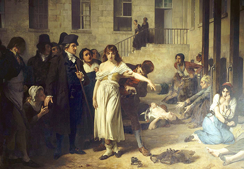

By the end of this section, you will be able to:
* Explain how people with psychological disorders have been treated throughout the ages
* Discuss deinstitutionalization
* Discuss the ways in which mental health services are delivered today
* Distinguish between voluntary and involuntary treatment

Before we explore the various approaches to therapy used today, let’s begin our study of therapy by looking at how many people experience mental illness and how many receive treatment. According to the U.S. Department of Health and Human Services (2013), 19% of U.S. adults experienced mental illness in 2012. For teens (ages 13–18), the rate is similar to that of adults, and for children ages 8–15, current estimates suggest that 13% experience mental illness in a given year (National Institute of Mental Health \[NIMH\], n.d.-a)

With many different treatment options available, approximately how many people receive mental health treatment per year? According to the Substance Abuse and Mental Health Services Administration (SAMHSA), in 2008, 13.4% of adults received treatment for a mental health issue (NIMH, n.d.-b). These percentages, shown in [\[link\]](#CNX_Psych_16_01_AdultTreat), reflect the number of adults who received care in inpatient and outpatient settings and/or used prescription medication for psychological disorders.

 {: #CNX_Psych_16_01_AdultTreat}

Children and adolescents also receive mental health services. The Centers for Disease Control and Prevention\'s National Health and Nutrition Examination Survey (NHANES) found that approximately half (50.6%) of children with mental disorders had received treatment for their disorder within the past year (NIMH, n.d.-c). However, there were some differences between treatment rates by category of disorder ([\[link\]](#CNX_Psych_16_01_ChildTreat)). For example, children with anxiety disorders were least likely to have received treatment in the past year, while children with ADHD or a conduct disorder were more likely to receive treatment. Can you think of some possible reasons for these differences in receiving treatment?

 ![A bar graph is titled &#x201C;U.S. Child Mental Health Treatment (Ages 8&#x2013;15).&#x201D; Below this title the source is given: &#x201C;National Institute of Mental Health, n.d.-c&#x201D; The x axis is labeled &#x201C;Type of disorder,&#x201D; and the y axis is labeled &#x201C;Percent with disorder.&#x201D; For children diagnosed with &#x201C;Anxiety disorders,&#x201D; around 32 percent receive treatment. For &#x201C;Mood disorder,&#x201D; around 42 percent receive treatment. For &#x201C;Conduct disorder,&#x201D; around 46 percent receive treatment. For &#x201C;ADHD,&#x201D; around 48 percent receive treatment. For &#x201C;Any disorder,&#x201D; around 50 percent receive treatment.](../resources/CNX_Psych_16_01_ChildTreat.jpg "About one-third to one-half of U.S. adolescents (ages 8&#x2013;15) with mental disorders receive treatment, with behavior-related disorders more likely to be treated."){: #CNX_Psych_16_01_ChildTreat}

Considering the many forms of treatment for mental health disorders available today, how did these forms of treatment emerge? Let’s take a look at the history of mental health treatment from the past (with some questionable approaches in light of modern understanding of mental illness) to where we are today.

### TREATMENT IN THE PAST

For much of history, the mentally ill have been treated very poorly. It was believed that mental illness was caused by demonic possession, witchcraft, or an angry god (Szasz, 1960). For example, in medieval times, abnormal behaviors were viewed as a sign that a person was possessed by demons. If someone was considered to be possessed, there were several forms of treatment to release spirits from the individual. The most common treatment was exorcism, often conducted by priests or other religious figures: Incantations and prayers were said over the person’s body, and she may have been given some medicinal drinks. Another form of treatment for extreme cases of mental illness was trephining: A small hole was made in the afflicted individual’s skull to release spirits from the body. Most people treated in this manner died. In addition to exorcism and trephining, other practices involved execution or imprisonment of people with psychological disorders. Still others were left to be homeless beggars. Generally speaking, most people who exhibited strange behaviors were greatly misunderstood and treated cruelly. The prevailing theory of psychopathology in earlier history was the idea that mental illness was the result of demonic possession by either an evil spirit or an evil god because early beliefs incorrectly attributed all unexplainable phenomena to deities deemed either good or evil.

From the late 1400s to the late 1600s, a common belief perpetuated by some religious organizations was that some people made pacts with the devil and committed horrible acts, such as eating babies (Blumberg, 2007). These people were considered to be witches and were tried and condemned by courts—they were often burned at the stake. Worldwide, it is estimated that tens of thousands of mentally ill people were killed after being accused of being witches or under the influence of witchcraft (Hemphill, 1966)

By the 18th century, people who were considered odd and unusual were placed in asylums ([\[link\]](#CNX_Psych_16_01_Goya)). **Asylums**{: data-type="term"} were the first institutions created for the specific purpose of housing people with psychological disorders, but the focus was ostracizing them from society rather than treating their disorders. Often these people were kept in windowless dungeons, beaten, chained to their beds, and had little to no contact with caregivers.

 {: #CNX_Psych_16_01_Goya}

In the late 1700s, a French physician, Philippe **Pinel**{: data-type="term" .no-emphasis}, argued for more humane treatment of the mentally ill. He suggested that they be unchained and talked to, and that’s just what he did for patients at La Salpêtrière in Paris in 1795 ([\[link\]](#CNX_Psych_16_01_Pinel)). Patients benefited from this more humane treatment, and many were able to leave the hospital.

 {: #CNX_Psych_16_01_Pinel}

In the 19th century, Dorothea **Dix**{: data-type="term" .no-emphasis} led reform efforts for mental health care in the United States ([\[link\]](#CNX_Psych_16_01_Dix)). She investigated how those who are mentally ill and poor were cared for, and she discovered an underfunded and unregulated system that perpetuated abuse of this population (Tiffany, 1891). Horrified by her findings, Dix began lobbying various state legislatures and the U.S. Congress for change (Tiffany, 1891). Her efforts led to the creation of the first mental asylums in the United States.

 {: #CNX_Psych_16_01_Dix}

Despite reformers’ efforts, however, a typical asylum was filthy, offered very little treatment, and often kept people for decades. At Willard Psychiatric Center in upstate New York, for example, one treatment was to submerge patients in cold baths for long periods of time. Electroshock treatment was also used, and the way the treatment was administered often broke patients’ backs; in 1943, doctors at Willard administered 1,443 shock treatments (Willard Psychiatric Center, 2009). (Electroshock is now called electroconvulsive treatment, and the therapy is still used, but with safeguards and under anesthesia. A brief application of electric stimulus is used to produce a generalized seizure. Controversy continues over its effectiveness versus the side effects.) Many of the wards and rooms were so cold that a glass of water would be frozen by morning (Willard Psychiatric Center, 2009). Willard’s doors were not closed until 1995. Conditions like these remained commonplace until well into the 20th century.

Starting in 1954 and gaining popularity in the 1960s, antipsychotic medications were introduced. These proved a tremendous help in controlling the symptoms of certain psychological disorders, such as psychosis. Psychosis was a common diagnosis of individuals in mental hospitals, and it was often evidenced by symptoms like hallucinations and delusions, indicating a loss of contact with reality. Then in 1963, Congress passed and John F. Kennedy signed the Mental Retardation Facilities and Community Mental Health Centers Construction Act, which provided federal support and funding for community mental health centers (National Institutes of Health, 2013). This legislation changed how mental health services were delivered in the United States. It started the process of **deinstitutionalization**{: data-type="term"}, the closing of large asylums, by providing for people to stay in their communities and be treated locally. In 1955, there were 558,239 severely mentally ill patients institutionalized at public hospitals (Torrey, 1997). By 1994, by percentage of the population, there were 92% fewer hospitalized individuals (Torrey, 1997).

### MENTAL HEALTH TREATMENT TODAY

Today, there are community mental health centers across the nation. They are located in neighborhoods near the homes of clients, and they provide large numbers of people with mental health services of various kinds and for many kinds of problems. Unfortunately, part of what occurred with deinstitutionalization was that those released from institutions were supposed to go to newly created centers, but the system was not set up effectively. Centers were underfunded, staff was not trained to handle severe illnesses such as schizophrenia, there was high staff burnout, and no provision was made for the other services people needed, such as housing, food, and job training. Without these supports, those people released under deinstitutionalization often ended up homeless. Even today, a large portion of the homeless population is considered to be mentally ill ([\[link\]](#CNX_Psych_16_01_Homeless)). Statistics show that 26% of homeless adults living in shelters experience mental illness (U.S. Department of Housing and Urban Development \[HUD\], 2011).

  Of the homeless individuals in U.S. shelters, about one-quarter have a severe mental illness (HUD, 2011). (b) Correctional institutions also report a high number of individuals living with mental illness. (credit a: modification of work by C.G.P. Grey; credit b: modification of work by Bart Everson)"){: #CNX_Psych_16_01_Homeless}

Another group of the mentally ill population is involved in the corrections system. According to a 2006 special report by the Bureau of Justice Statistics (BJS), approximately 705,600 mentally ill adults were incarcerated in the state prison system, and another 78,800 were incarcerated in the federal prison system. A further 479,000 were in local jails. According to the study, “people with mental illnesses are overrepresented in probation and parole populations at estimated rates ranging from two to four times the general population” (Prins &amp; Draper, 2009, p. 23). The Treatment Advocacy Center reported that the growing number of mentally ill inmates has placed a burden on the correctional system (Torrey et al., 2014).

Today, instead of asylums, there are psychiatric hospitals run by state governments and local community hospitals focused on short-term care. In all types of hospitals, the emphasis is on short-term stays, with the average length of stay being less than two weeks and often only several days. This is partly due to the very high cost of psychiatric hospitalization, which can be about $800 to $1000 per night (Stensland, Watson, &amp; Grazier, 2012). Therefore, insurance coverage often limits the length of time a person can be hospitalized for treatment. Usually individuals are hospitalized only if they are an imminent threat to themselves or others.

  
View this [timeline][1] showing the history of mental institutions in the United States.

Most people suffering from mental illnesses are not hospitalized. If someone is feeling very depressed, complains of hearing voices, or feels anxious all the time, he or she might seek psychological treatment. A friend, spouse, or parent might refer someone for treatment. The individual might go see his primary care physician first and then be referred to a mental health practitioner.

Some people seek treatment because they are involved with the state’s child protective services—that is, their children have been removed from their care due to abuse or neglect. The parents might be referred to psychiatric or substance abuse facilities and the children would likely receive treatment for trauma. If the parents are interested in and capable of becoming better parents, the goal of treatment might be family reunification. For other children whose parents are unable to change—for example, the parent or parents who are heavily addicted to drugs and refuse to enter treatment—the goal of therapy might be to help the children adjust to foster care and/or adoption ([\[link\]](#CNX_Psych_16_01_Children)).

 "){: #CNX_Psych_16_01_Children}

Some people seek therapy because the criminal justice system referred them or required them to go. For some individuals, for example, attending weekly counseling sessions might be a condition of parole. If an individual is mandated to attend therapy, she is seeking services involuntarily. **Involuntary treatment**{: data-type="term"} refers to therapy that is not the individual’s choice. Other individuals might voluntarily seek treatment. **Voluntary treatment**{: data-type="term"} means the person chooses to attend therapy to obtain relief from symptoms.

Psychological treatment can occur in a variety of places. An individual might go to a community mental health center or a practitioner in private or community practice. A child might see a school counselor, school psychologist, or school social worker. An incarcerated person might receive group therapy in prison. There are many different types of treatment providers, and licensing requirements vary from state to state. Besides psychologists and psychiatrists, there are clinical social workers, marriage and family therapists, and trained religious personnel who also perform counseling and therapy.

A range of funding sources pay for mental health treatment: health insurance, government, and private pay. In the past, even when people had health insurance, the coverage would not always pay for mental health services. This changed with the Mental Health Parity and Addiction Equity Act of 2008, which requires group health plans and insurers to make sure there is parity of mental health services (U.S. Department of Labor, n.d.). This means that co-pays, total number of visits, and deductibles for mental health and substance abuse treatment need to be equal to and cannot be more restrictive or harsher than those for physical illnesses and medical/surgical problems.

Finding treatment sources is also not always easy: there may be limited options, especially in rural areas and low-income urban areas; waiting lists; poor quality of care available for indigent patients; and financial obstacles such as co-pays, deductibles, and time off from work. Over 85% of the l,669 federally designated mental health professional shortage areas are rural; often primary care physicians and law enforcement are the first-line mental health providers (Ivey, Scheffler, &amp; Zazzali, 1998), although they do not have the specialized training of a mental health professional, who often would be better equipped to provide care. Availability, accessibility, and acceptability (the stigma attached to mental illness) are all problems in rural areas. Approximately two-thirds of those with symptoms receive no care at all (U.S. Department of Health and Human Services, 2005; Wagenfeld, Murray, Mohatt, &amp; DeBruiynb, 1994). At the end of 2013, the U.S. Department of Agriculture announced an investment of $50 million to help improve access and treatment for mental health problems as part of the Obama administration’s effort to strengthen rural communities.

### Summary

It was once believed that people with psychological disorders, or those exhibiting strange behavior, were possessed by demons. These people were forced to take part in exorcisms, were imprisoned, or executed. Later, asylums were built to house the mentally ill, but the patients received little to no treatment, and many of the methods used were cruel. Philippe Pinel and Dorothea Dix argued for more humane treatment of people with psychological disorders. In the mid-1960s, the deinstitutionalization movement gained support and asylums were closed, enabling people with mental illness to return home and receive treatment in their own communities. Some did go to their family homes, but many became homeless due to a lack of resources and support mechanisms.

Today, instead of asylums, there are psychiatric hospitals run by state governments and local community hospitals, with the emphasis on short-term stays. However, most people suffering from mental illness are not hospitalized. A person suffering symptoms could speak with a primary care physician, who most likely would refer him to someone who specializes in therapy. The person can receive outpatient mental health services from a variety of sources, including psychologists, psychiatrists, marriage and family therapists, school counselors, clinical social workers, and religious personnel. These therapy sessions would be covered through insurance, government funds, or private (self) pay.

### Review Questions

Who of the following does not support the humane and improved treatment of mentally ill persons?

1.  Philippe Pinel
2.  medieval priests
3.  Dorothea Dix
4.  All of the above
{: type="a"}

B

The process of closing large asylums and providing for people to stay in the community to be treated locally is known as \_\_\_\_\_\_\_\_.

1.  deinstitutionalization
2.  exorcism
3.  deactivation
4.  decentralization
{: type="a"}

A

Joey was convicted of domestic violence. As part of his sentence, the judge has ordered that he attend therapy for anger management. This is considered \_\_\_\_\_\_\_\_ treatment.

1.  involuntary
2.  voluntary
3.  forced
4.  mandatory
{: type="a"}

A

Today, most people with psychological problems are not hospitalized. Typically they are only hospitalized if they \_\_\_\_\_\_\_\_.

1.  have schizophrenia
2.  have insurance
3.  are an imminent threat to themselves or others
4.  require therapy
{: type="a"}

C

### Critical Thinking Questions

People with psychological disorders have been treated poorly throughout history. Describe some efforts to improve treatment, include explanations for the success or lack thereof.

Beginning in the Middle Ages and up until the mid-20th century, the mentally ill were misunderstood and treated cruelly. In the 1700s, Philippe Pinel advocated for patients to be unchained, and he was able to affect this in a Paris hospital. In the 1800s, Dorothea Dix urged the government to provide better funded and regulated care, which led to the creation of asylums, but treatment generally remained quite poor. Federally mandated deinstitutionalization in the 1960s began the elimination of asylums, but it was often inadequate in providing the infrastructure for replacement treatment.

Usually someone is hospitalized only if they are an imminent threat to themselves or others. Describe a situation that might meet these criteria.

Frank is severely depressed. He lost his job one year ago and has not been able to find another one. A few months after losing his job, his home was foreclosed and his wife left him. Lately, he has been thinking that he would be better off dead. He’s begun giving his possessions away and has purchased a handgun. He plans to kill himself on what would have been his 20th wedding anniversary, which is coming up in a few weeks.

### Personal Application Questions

Do you think there is a stigma associated with mentally ill persons today? Why or why not?

What are some places in your community that offer mental health services? Would you feel comfortable seeking assistance at one of these facilities? Why or why not?

### Glossary
{: data-type="glossary-title"}

asylum
: institution created for the specific purpose of housing people with psychological disorders
^

deinstitutionalization
: process of closing large asylums and integrating people back into the community where they can be treated locally
^

involuntary treatment
: therapy that is mandated by the courts or other systems
^

voluntary treatment
: therapy that a person chooses to attend in order to obtain relief from her symptoms

[1]: http://openstax.org/l/timeline
