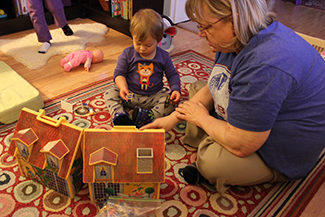

=========================================
Mental Health Treatment: Past and Present
=========================================

.. contents::
   :depth: 3
..

.. container::

   By the end of this section, you will be able to: \* Explain how
   people with psychological disorders have been treated throughout the
   ages \* Discuss deinstitutionalization \* Discuss the ways in which
   mental health services are delivered today \* Distinguish between
   voluntary and involuntary treatment

Before we explore the various approaches to therapy used today, let’s
begin our study of therapy by looking at how many people experience
mental illness and how many receive treatment. According to the U.S.
Department of Health and Human Services (2013), 19% of U.S. adults
experienced mental illness in 2012. For teens (ages 13–18), the rate is
similar to that of adults, and for children ages 8–15, current estimates
suggest that 13% experience mental illness in a given year (National
Institute of Mental Health [NIMH], n.d.-a)

With many different treatment options available, approximately how many
people receive mental health treatment per year? According to the
Substance Abuse and Mental Health Services Administration (SAMHSA), in
2008, 13.4% of adults received treatment for a mental health issue
(NIMH, n.d.-b). These percentages, shown in
`[link] <#CNX_Psych_16_01_AdultTreat>`__, reflect the number of adults
who received care in inpatient and outpatient settings and/or used
prescription medication for psychological disorders.

|A bar graph is titled “U.S. Adult Mental Health Treatment, 2004–2008.”
Below this title the source is given: “National Institute of Mental
Health, n.d.-b” The x axis is labeled “Year,” and the y axis is labeled
“Percent of adults.” In the years 2004, 2005 and 2006, the percentage of
adults who received treatment hovered at 13 percent or just below. For
the years 2007 and 2008, the percentage rose slightly closer to 14
percent.|\ {: #CNX_Psych_16_01_AdultTreat}

Children and adolescents also receive mental health services. The
Centers for Disease Control and Prevention's National Health and
Nutrition Examination Survey (NHANES) found that approximately half
(50.6%) of children with mental disorders had received treatment for
their disorder within the past year (NIMH, n.d.-c). However, there were
some differences between treatment rates by category of disorder
(`[link] <#CNX_Psych_16_01_ChildTreat>`__). For example, children with
anxiety disorders were least likely to have received treatment in the
past year, while children with ADHD or a conduct disorder were more
likely to receive treatment. Can you think of some possible reasons for
these differences in receiving treatment?

|A bar graph is titled “U.S. Child Mental Health Treatment (Ages 8–15).”
Below this title the source is given: “National Institute of Mental
Health, n.d.-c” The x axis is labeled “Type of disorder,” and the y axis
is labeled “Percent with disorder.” For children diagnosed with “Anxiety
disorders,” around 32 percent receive treatment. For “Mood disorder,”
around 42 percent receive treatment. For “Conduct disorder,” around 46
percent receive treatment. For “ADHD,” around 48 percent receive
treatment. For “Any disorder,” around 50 percent receive treatment.|\ {:
#CNX_Psych_16_01_ChildTreat}

Considering the many forms of treatment for mental health disorders
available today, how did these forms of treatment emerge? Let’s take a
look at the history of mental health treatment from the past (with some
questionable approaches in light of modern understanding of mental
illness) to where we are today.

TREATMENT IN THE PAST
=====================

For much of history, the mentally ill have been treated very poorly. It
was believed that mental illness was caused by demonic possession,
witchcraft, or an angry god (Szasz, 1960). For example, in medieval
times, abnormal behaviors were viewed as a sign that a person was
possessed by demons. If someone was considered to be possessed, there
were several forms of treatment to release spirits from the individual.
The most common treatment was exorcism, often conducted by priests or
other religious figures: Incantations and prayers were said over the
person’s body, and she may have been given some medicinal drinks.
Another form of treatment for extreme cases of mental illness was
trephining: A small hole was made in the afflicted individual’s skull to
release spirits from the body. Most people treated in this manner died.
In addition to exorcism and trephining, other practices involved
execution or imprisonment of people with psychological disorders. Still
others were left to be homeless beggars. Generally speaking, most people
who exhibited strange behaviors were greatly misunderstood and treated
cruelly. The prevailing theory of psychopathology in earlier history was
the idea that mental illness was the result of demonic possession by
either an evil spirit or an evil god because early beliefs incorrectly
attributed all unexplainable phenomena to deities deemed either good or
evil.

From the late 1400s to the late 1600s, a common belief perpetuated by
some religious organizations was that some people made pacts with the
devil and committed horrible acts, such as eating babies (Blumberg,
2007). These people were considered to be witches and were tried and
condemned by courts—they were often burned at the stake. Worldwide, it
is estimated that tens of thousands of mentally ill people were killed
after being accused of being witches or under the influence of
witchcraft (Hemphill, 1966)

By the 18th century, people who were considered odd and unusual were
placed in asylums (`[link] <#CNX_Psych_16_01_Goya>`__). **Asylums**\ {:
data-type=“term”} were the first institutions created for the specific
purpose of housing people with psychological disorders, but the focus
was ostracizing them from society rather than treating their disorders.
Often these people were kept in windowless dungeons, beaten, chained to
their beds, and had little to no contact with caregivers.

|A painting depicts the inside of a mental asylum in the early
1800s.|\ {: #CNX_Psych_16_01_Goya}

In the late 1700s, a French physician, Philippe **Pinel**\ {:
data-type=“term” .no-emphasis}, argued for more humane treatment of the
mentally ill. He suggested that they be unchained and talked to, and
that’s just what he did for patients at La Salpêtrière in Paris in 1795
(`[link] <#CNX_Psych_16_01_Pinel>`__). Patients benefited from this more
humane treatment, and many were able to leave the hospital.

|A painting, set inside an asylum, depicts a person removing the chains
from a patient. There are several other people in the scene, but the
focus is on these two characters.|\ {: #CNX_Psych_16_01_Pinel}

In the 19th century, Dorothea **Dix**\ {: data-type=“term” .no-emphasis}
led reform efforts for mental health care in the United States
(`[link] <#CNX_Psych_16_01_Dix>`__). She investigated how those who are
mentally ill and poor were cared for, and she discovered an underfunded
and unregulated system that perpetuated abuse of this population
(Tiffany, 1891). Horrified by her findings, Dix began lobbying various
state legislatures and the U.S. Congress for change (Tiffany, 1891). Her
efforts led to the creation of the first mental asylums in the United
States.

|A portrait of Dorothea Dix is shown.|\ {: #CNX_Psych_16_01_Dix}

Despite reformers’ efforts, however, a typical asylum was filthy,
offered very little treatment, and often kept people for decades. At
Willard Psychiatric Center in upstate New York, for example, one
treatment was to submerge patients in cold baths for long periods of
time. Electroshock treatment was also used, and the way the treatment
was administered often broke patients’ backs; in 1943, doctors at
Willard administered 1,443 shock treatments (Willard Psychiatric Center,
2009). (Electroshock is now called electroconvulsive treatment, and the
therapy is still used, but with safeguards and under anesthesia. A brief
application of electric stimulus is used to produce a generalized
seizure. Controversy continues over its effectiveness versus the side
effects.) Many of the wards and rooms were so cold that a glass of water
would be frozen by morning (Willard Psychiatric Center, 2009). Willard’s
doors were not closed until 1995. Conditions like these remained
commonplace until well into the 20th century.

Starting in 1954 and gaining popularity in the 1960s, antipsychotic
medications were introduced. These proved a tremendous help in
controlling the symptoms of certain psychological disorders, such as
psychosis. Psychosis was a common diagnosis of individuals in mental
hospitals, and it was often evidenced by symptoms like hallucinations
and delusions, indicating a loss of contact with reality. Then in 1963,
Congress passed and John F. Kennedy signed the Mental Retardation
Facilities and Community Mental Health Centers Construction Act, which
provided federal support and funding for community mental health centers
(National Institutes of Health, 2013). This legislation changed how
mental health services were delivered in the United States. It started
the process of **deinstitutionalization**\ {: data-type=“term”}, the
closing of large asylums, by providing for people to stay in their
communities and be treated locally. In 1955, there were 558,239 severely
mentally ill patients institutionalized at public hospitals (Torrey,
1997). By 1994, by percentage of the population, there were 92% fewer
hospitalized individuals (Torrey, 1997).

MENTAL HEALTH TREATMENT TODAY
=============================

Today, there are community mental health centers across the nation. They
are located in neighborhoods near the homes of clients, and they provide
large numbers of people with mental health services of various kinds and
for many kinds of problems. Unfortunately, part of what occurred with
deinstitutionalization was that those released from institutions were
supposed to go to newly created centers, but the system was not set up
effectively. Centers were underfunded, staff was not trained to handle
severe illnesses such as schizophrenia, there was high staff burnout,
and no provision was made for the other services people needed, such as
housing, food, and job training. Without these supports, those people
released under deinstitutionalization often ended up homeless. Even
today, a large portion of the homeless population is considered to be
mentally ill (`[link] <#CNX_Psych_16_01_Homeless>`__). Statistics show
that 26% of homeless adults living in shelters experience mental illness
(U.S. Department of Housing and Urban Development [HUD], 2011).

|Photograph A shows a person sitting on a bench slumped over. In the
background an American flag hangs vertically. Photograph B shows a
prison yard from afar. There are several people gathered around a
basketball court.|\ {: #CNX_Psych_16_01_Homeless}

Another group of the mentally ill population is involved in the
corrections system. According to a 2006 special report by the Bureau of
Justice Statistics (BJS), approximately 705,600 mentally ill adults were
incarcerated in the state prison system, and another 78,800 were
incarcerated in the federal prison system. A further 479,000 were in
local jails. According to the study, “people with mental illnesses are
overrepresented in probation and parole populations at estimated rates
ranging from two to four times the general population” (Prins & Draper,
2009, p. 23). The Treatment Advocacy Center reported that the growing
number of mentally ill inmates has placed a burden on the correctional
system (Torrey et al., 2014).

Today, instead of asylums, there are psychiatric hospitals run by state
governments and local community hospitals focused on short-term care. In
all types of hospitals, the emphasis is on short-term stays, with the
average length of stay being less than two weeks and often only several
days. This is partly due to the very high cost of psychiatric
hospitalization, which can be about $800 to $1000 per night (Stensland,
Watson, & Grazier, 2012). Therefore, insurance coverage often limits the
length of time a person can be hospitalized for treatment. Usually
individuals are hospitalized only if they are an imminent threat to
themselves or others.

.. container:: psychology link-to-learning

   View this `timeline <http://openstax.org/l/timeline>`__ showing the
   history of mental institutions in the United States.

Most people suffering from mental illnesses are not hospitalized. If
someone is feeling very depressed, complains of hearing voices, or feels
anxious all the time, he or she might seek psychological treatment. A
friend, spouse, or parent might refer someone for treatment. The
individual might go see his primary care physician first and then be
referred to a mental health practitioner.

Some people seek treatment because they are involved with the state’s
child protective services—that is, their children have been removed from
their care due to abuse or neglect. The parents might be referred to
psychiatric or substance abuse facilities and the children would likely
receive treatment for trauma. If the parents are interested in and
capable of becoming better parents, the goal of treatment might be
family reunification. For other children whose parents are unable to
change—for example, the parent or parents who are heavily addicted to
drugs and refuse to enter treatment—the goal of therapy might be to help
the children adjust to foster care and/or adoption
(`[link] <#CNX_Psych_16_01_Children>`__).

|An adult and a small child are depicted sitting on a rug next to a toy
house.|\ {: #CNX_Psych_16_01_Children}

Some people seek therapy because the criminal justice system referred
them or required them to go. For some individuals, for example,
attending weekly counseling sessions might be a condition of parole. If
an individual is mandated to attend therapy, she is seeking services
involuntarily. **Involuntary treatment**\ {: data-type=“term”} refers to
therapy that is not the individual’s choice. Other individuals might
voluntarily seek treatment. **Voluntary treatment**\ {:
data-type=“term”} means the person chooses to attend therapy to obtain
relief from symptoms.

Psychological treatment can occur in a variety of places. An individual
might go to a community mental health center or a practitioner in
private or community practice. A child might see a school counselor,
school psychologist, or school social worker. An incarcerated person
might receive group therapy in prison. There are many different types of
treatment providers, and licensing requirements vary from state to
state. Besides psychologists and psychiatrists, there are clinical
social workers, marriage and family therapists, and trained religious
personnel who also perform counseling and therapy.

A range of funding sources pay for mental health treatment: health
insurance, government, and private pay. In the past, even when people
had health insurance, the coverage would not always pay for mental
health services. This changed with the Mental Health Parity and
Addiction Equity Act of 2008, which requires group health plans and
insurers to make sure there is parity of mental health services (U.S.
Department of Labor, n.d.). This means that co-pays, total number of
visits, and deductibles for mental health and substance abuse treatment
need to be equal to and cannot be more restrictive or harsher than those
for physical illnesses and medical/surgical problems.

Finding treatment sources is also not always easy: there may be limited
options, especially in rural areas and low-income urban areas; waiting
lists; poor quality of care available for indigent patients; and
financial obstacles such as co-pays, deductibles, and time off from
work. Over 85% of the l,669 federally designated mental health
professional shortage areas are rural; often primary care physicians and
law enforcement are the first-line mental health providers (Ivey,
Scheffler, & Zazzali, 1998), although they do not have the specialized
training of a mental health professional, who often would be better
equipped to provide care. Availability, accessibility, and acceptability
(the stigma attached to mental illness) are all problems in rural areas.
Approximately two-thirds of those with symptoms receive no care at all
(U.S. Department of Health and Human Services, 2005; Wagenfeld, Murray,
Mohatt, & DeBruiynb, 1994). At the end of 2013, the U.S. Department of
Agriculture announced an investment of $50 million to help improve
access and treatment for mental health problems as part of the Obama
administration’s effort to strengthen rural communities.

Summary
=======

It was once believed that people with psychological disorders, or those
exhibiting strange behavior, were possessed by demons. These people were
forced to take part in exorcisms, were imprisoned, or executed. Later,
asylums were built to house the mentally ill, but the patients received
little to no treatment, and many of the methods used were cruel.
Philippe Pinel and Dorothea Dix argued for more humane treatment of
people with psychological disorders. In the mid-1960s, the
deinstitutionalization movement gained support and asylums were closed,
enabling people with mental illness to return home and receive treatment
in their own communities. Some did go to their family homes, but many
became homeless due to a lack of resources and support mechanisms.

Today, instead of asylums, there are psychiatric hospitals run by state
governments and local community hospitals, with the emphasis on
short-term stays. However, most people suffering from mental illness are
not hospitalized. A person suffering symptoms could speak with a primary
care physician, who most likely would refer him to someone who
specializes in therapy. The person can receive outpatient mental health
services from a variety of sources, including psychologists,
psychiatrists, marriage and family therapists, school counselors,
clinical social workers, and religious personnel. These therapy sessions
would be covered through insurance, government funds, or private (self)
pay.

Review Questions
================

.. container::

   .. container::

      Who of the following does not support the humane and improved
      treatment of mentally ill persons?

      1. Philippe Pinel
      2. medieval priests
      3. Dorothea Dix
      4. All of the above {: type=“a”}

   .. container::

      B

.. container::

   .. container::

      The process of closing large asylums and providing for people to
      stay in the community to be treated locally is known as \________.

      1. deinstitutionalization
      2. exorcism
      3. deactivation
      4. decentralization {: type=“a”}

   .. container::

      A

.. container::

   .. container::

      Joey was convicted of domestic violence. As part of his sentence,
      the judge has ordered that he attend therapy for anger management.
      This is considered \_______\_ treatment.

      1. involuntary
      2. voluntary
      3. forced
      4. mandatory {: type=“a”}

   .. container::

      A

.. container::

   .. container::

      Today, most people with psychological problems are not
      hospitalized. Typically they are only hospitalized if they
      \________.

      1. have schizophrenia
      2. have insurance
      3. are an imminent threat to themselves or others
      4. require therapy {: type=“a”}

   .. container::

      C

Critical Thinking Questions
===========================

.. container::

   .. container::

      People with psychological disorders have been treated poorly
      throughout history. Describe some efforts to improve treatment,
      include explanations for the success or lack thereof.

   .. container::

      Beginning in the Middle Ages and up until the mid-20th century,
      the mentally ill were misunderstood and treated cruelly. In the
      1700s, Philippe Pinel advocated for patients to be unchained, and
      he was able to affect this in a Paris hospital. In the 1800s,
      Dorothea Dix urged the government to provide better funded and
      regulated care, which led to the creation of asylums, but
      treatment generally remained quite poor. Federally mandated
      deinstitutionalization in the 1960s began the elimination of
      asylums, but it was often inadequate in providing the
      infrastructure for replacement treatment.

.. container::

   .. container::

      Usually someone is hospitalized only if they are an imminent
      threat to themselves or others. Describe a situation that might
      meet these criteria.

   .. container::

      Frank is severely depressed. He lost his job one year ago and has
      not been able to find another one. A few months after losing his
      job, his home was foreclosed and his wife left him. Lately, he has
      been thinking that he would be better off dead. He’s begun giving
      his possessions away and has purchased a handgun. He plans to kill
      himself on what would have been his 20th wedding anniversary,
      which is coming up in a few weeks.

Personal Application Questions
==============================

.. container::

   .. container::

      Do you think there is a stigma associated with mentally ill
      persons today? Why or why not?

.. container::

   .. container::

      What are some places in your community that offer mental health
      services? Would you feel comfortable seeking assistance at one of
      these facilities? Why or why not?

.. container::

   .. rubric:: Glossary
      :name: glossary

   {: data-type=“glossary-title”}

   asylum
      institution created for the specific purpose of housing people
      with psychological disorders ^
   deinstitutionalization
      process of closing large asylums and integrating people back into
      the community where they can be treated locally ^
   involuntary treatment
      therapy that is mandated by the courts or other systems ^
   voluntary treatment
      therapy that a person chooses to attend in order to obtain relief
      from her symptoms

.. |A bar graph is titled “U.S. Adult Mental Health Treatment, 2004–2008.” Below this title the source is given: “National Institute of Mental Health, n.d.-b” The x axis is labeled “Year,” and the y axis is labeled “Percent of adults.” In the years 2004, 2005 and 2006, the percentage of adults who received treatment hovered at 13 percent or just below. For the years 2007 and 2008, the percentage rose slightly closer to 14 percent.| image:: ../resources/CNX_Psych_16_01_AdultTreat.jpg
.. |A bar graph is titled “U.S. Child Mental Health Treatment (Ages 8–15).” Below this title the source is given: “National Institute of Mental Health, n.d.-c” The x axis is labeled “Type of disorder,” and the y axis is labeled “Percent with disorder.” For children diagnosed with “Anxiety disorders,” around 32 percent receive treatment. For “Mood disorder,” around 42 percent receive treatment. For “Conduct disorder,” around 46 percent receive treatment. For “ADHD,” around 48 percent receive treatment. For “Any disorder,” around 50 percent receive treatment.| image:: ../resources/CNX_Psych_16_01_ChildTreat.jpg

.. |A painting, set inside an asylum, depicts a person removing the chains from a patient. There are several other people in the scene, but the focus is on these two characters.| image:: ../resources/CNX_Psych_16_01_Pinel.jpg

.. |Photograph A shows a person sitting on a bench slumped over. In the background an American flag hangs vertically. Photograph B shows a prison yard from afar. There are several people gathered around a basketball court.| image:: ../resources/CNX_Psych_16_01_Homeless.jpg

