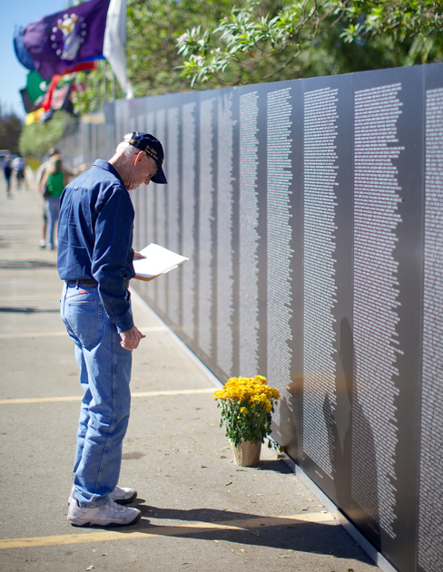

=============================
Posttraumatic Stress Disorder
=============================

.. contents::
   :depth: 3
..

.. container::

   By the end of this section, you will be able to: \* Describe the
   nature and symptoms of posttraumatic stress disorder \* Identify the
   risk factors associated with this disorder \* Understand the role of
   learning and cognitive factors in its development

Extremely stressful or traumatic events, such as combat, natural
disasters, and terrorist attacks, place the people who experience them
at an increased risk for developing psychological disorders such as
**posttraumatic stress disorder (PTSD)**\ {: data-type=“term”}.
Throughout much of the 20th century, this disorder was called *shell
shock* and *combat neurosis* because its symptoms were observed in
soldiers who had engaged in wartime combat. By the late 1970s it had
become clear that women who had experienced sexual traumas (e.g., rape,
domestic battery, and incest) often experienced the same set of symptoms
as did soldiers (Herman, 1997). The term *posttraumatic stress disorder*
was developed given that these symptoms could happen to anyone who
experienced psychological trauma.

A BROADER DEFINITION OF PTSD
============================

PTSD was listed among the anxiety disorders in previous DSM editions. In
DSM-5, it is now listed among a group called Trauma-and-Stressor-Related
Disorders. For a person to be diagnosed with PTSD, she must be exposed
to, witness, or experience the details of a traumatic experience (e.g.,
a first responder), one that involves “actual or threatened death,
serious injury, or sexual violence” (APA, 2013, p. 271). These
experiences can include such events as combat, threatened or actual
physical attack, sexual assault, natural disasters, terrorist attacks,
and automobile accidents. This criterion makes PTSD the only disorder
listed in the DSM in which a cause (extreme trauma) is explicitly
specified.

Symptoms of PTSD include intrusive and distressing memories of the
event, **flashbacks**\ {: data-type=“term”} (states that can last from a
few seconds to several days, during which the individual relives the
event and behaves as if the event were occurring at that moment [APA,
2013]), avoidance of stimuli connected to the event, persistently
negative emotional states (e.g., fear, anger, guilt, and shame),
feelings of detachment from others, irritability, proneness toward
outbursts, and an exaggerated startle response (jumpiness). For PTSD to
be diagnosed, these symptoms must occur for at least one month.

Roughly 7% of adults in the United States, including 9.7% of women and
3.6% of men, experience PTSD in their lifetime (National Comorbidity
Survey, 2007), with higher rates among people exposed to mass trauma and
people whose jobs involve duty-related trauma exposure (e.g., police
officers, firefighters, and emergency medical personnel) (APA, 2013).
Nearly 21% of residents of areas affected by Hurricane Katrina suffered
from PTSD one year following the hurricane (Kessler et al., 2008), and
12.6% of Manhattan residents were observed as having PTSD 2–3 years
after the 9/11 terrorist attacks (DiGrande et al., 2008).

RISK FACTORS FOR PTSD
=====================

Of course, not everyone who experiences a traumatic event will go on to
develop PTSD; several factors strongly predict the development of PTSD:
trauma experience, greater trauma severity, lack of immediate social
support, and more subsequent life stress (Brewin, Andrews, & Valentine,
2000). Traumatic events that involve harm by others (e.g., combat, rape,
and sexual molestation) carry greater risk than do other traumas (e.g.,
natural disasters) (Kessler, Sonnega, Bromet, Hughes, & Nelson, 1995).
Factors that increase the risk of PTSD include female gender, low
socioeconomic status, low intelligence, personal history of mental
disorders, history of childhood adversity (abuse or other trauma during
childhood), and family history of mental disorders (Brewin et al.,
2000). Personality characteristics such as neuroticism and somatization
(the tendency to experience physical symptoms when one encounters
stress) have been shown to elevate the risk of PTSD (Bramsen,
Dirkzwager, & van der Ploeg, 2000). People who experience childhood
adversity and/or traumatic experiences during adulthood are at
significantly higher risk of developing PTSD if they possess one or two
short versions of a gene that regulates the neurotransmitter serotonin
(Xie et al., 2009). This suggests a possible diathesis-stress
interpretation of PTSD: its development is influenced by the interaction
of psychosocial and biological factors.

SUPPORT FOR SUFFERERS OF PTSD
=============================

Research has shown that social support following a traumatic event can
reduce the likelihood of PTSD (Ozer, Best, Lipsey, & Weiss, 2003).
Social support is often defined as the comfort, advice, and assistance
received from relatives, friends, and neighbors. Social support can help
individuals cope during difficult times by allowing them to discuss
feelings and experiences and providing a sense of being loved and
appreciated. A 14-year study of 1,377 American Legionnaires who had
served in the Vietnam War found that those who perceived less social
support when they came home were more likely to develop PTSD than were
those who perceived greater support
(`[link] <#Figure_15_06_Memorial>`__). In addition, those who became
involved in the community were less likely to develop PTSD, and they
were more likely to experience a remission of PTSD than were those who
were less involved (Koenen, Stellman, Stellman, & Sommer, 2003).

|A photograph shows a person looking at the Vietnam Traveling Memorial
Wall.|\ {: #Figure_15_06_Memorial}

LEARNING AND THE DEVELOPMENT OF PTSD
====================================

PTSD learning models suggest that some symptoms are developed and
maintained through classical conditioning. The traumatic event may act
as an unconditioned stimulus that elicits an unconditioned response
characterized by extreme fear and anxiety. Cognitive, emotional,
physiological, and environmental cues accompanying or related to the
event are conditioned stimuli. These traumatic reminders evoke
conditioned responses (extreme fear and anxiety) similar to those caused
by the event itself (Nader, 2001). A person who was in the vicinity of
the Twin Towers during the 9/11 terrorist attacks and who developed PTSD
may display excessive hypervigilance and distress when planes fly
overhead; this behavior constitutes a conditioned response to the
traumatic reminder (conditioned stimulus of the sight and sound of an
airplane). Differences in how conditionable individuals are help to
explain differences in the development and maintenance of PTSD symptoms
(Pittman, 1988). Conditioning studies demonstrate facilitated
acquisition of conditioned responses and delayed extinction of
conditioned responses in people with PTSD (Orr et al., 2000).

Cognitive factors are important in the development and maintenance of
PTSD. One model suggests that two key processes are crucial:
disturbances in memory for the event, and negative appraisals of the
trauma and its aftermath (Ehlers & Clark, 2000). According to this
theory, some people who experience traumas do not form coherent memories
of the trauma; memories of the traumatic event are poorly encoded and,
thus, are fragmented, disorganized, and lacking in detail. Therefore,
these individuals are unable remember the event in a way that gives it
meaning and context. A rape victim who cannot coherently remember the
event may remember only bits and pieces (e.g., the attacker repeatedly
telling her she is stupid); because she was unable to develop a fully
integrated memory, the fragmentary memory tends to stand out. Although
unable to retrieve a complete memory of the event, she may be haunted by
intrusive fragments involuntarily triggered by stimuli associated with
the event (e.g., memories of the attacker’s comments when encountering a
person who resembles the attacker). This interpretation fits previously
discussed material concerning PTSD and conditioning. The model also
proposes that negative appraisals of the event (“I deserved to be raped
because I’m stupid”) may lead to dysfunctional behavioral strategies
(e.g., avoiding social activities where men are likely to be present)
that maintain PTSD symptoms by preventing both a change in the nature of
the memory and a change in the problematic appraisals.

Summary
=======

Posttraumatic stress disorder (PTSD) was described through much of the
20th century and was referred to as shell shock and combat neurosis in
the belief that its symptoms were thought to emerge from the stress of
active combat. Today, PTSD is defined as a disorder in which the
experience of a traumatic or profoundly stressful event, such as combat,
sexual assault, or natural disaster, produces a constellation of
symptoms that must last for one month or more. These symptoms include
intrusive and distressing memories of the event, flashbacks, avoidance
of stimuli or situations that are connected to the event, persistently
negative emotional states, feeling detached from others, irritability,
proneness toward outbursts, and a tendency to be easily startled. Not
everyone who experiences a traumatic event will develop PTSD; a variety
of risk factors associated with its development have been identified.

Review Questions
================

.. container::

   .. container::

      Symptoms of PTSD include all of the following *except* \________.

      1. intrusive thoughts or memories of a traumatic event
      2. avoidance of things that remind one of a traumatic event
      3. jumpiness
      4. physical complaints that cannot be explained medically {:
         type=“a”}

   .. container::

      D

.. container::

   .. container::

      Which of the following elevates the risk for developing PTSD?

      1. severity of the trauma
      2. frequency of the trauma
      3. high levels of intelligence
      4. social support {: type=“a”}

   .. container::

      A

Critical Thinking Question
==========================

.. container::

   .. container::

      List some of the risk factors associated with the development of
      PTSD following a traumatic event.

   .. container::

      Risk factors associated with PTSD include gender (female), low
      socioeconomic status, low intelligence, personal and family
      history of mental illness, and childhood abuse or trauma.
      Personality factors, including neuroticism and somatization, may
      also serve as risk factors. Also, certain versions of a gene that
      regulates serotonin may constitute a diathesis.

.. container::

   .. rubric:: Glossary
      :name: glossary

   {: data-type=“glossary-title”}

   flashback
      psychological state lasting from a few seconds to several days,
      during which one relives a traumatic event and behaves as though
      the event were occurring at that moment ^
   posttraumatic stress disorder (PTSD)
      experiencing a profoundly traumatic event leads to a constellation
      of symptoms that include intrusive and distressing memories of the
      event, avoidance of stimuli connected to the event, negative
      emotional states, feelings of detachment from others,
      irritability, proneness toward outbursts, hypervigilance, and a
      tendency to startle easily; these symptoms must occur for at least
      one month

