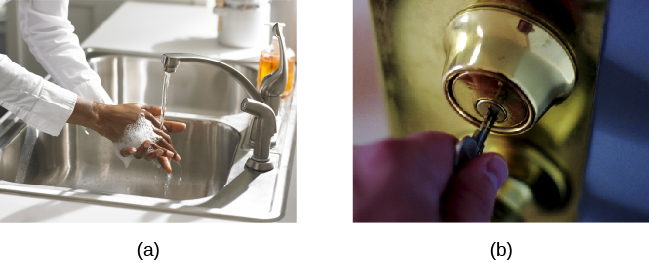

==========================================
Obsessive-Compulsive and Related Disorders
==========================================

.. contents::
   :depth: 3
..

.. container::

   By the end of this section, you will be able to: \* Describe the main
   features and prevalence of obsessive-compulsive disorder, body
   dysmorphic disorder, and hoarding disorder \* Understand some of the
   factors in the development of obsessive-compulsive disorder

**Obsessive-compulsive and related disorders**\ {: data-type=“term”} are
a group of overlapping disorders that generally involve intrusive,
unpleasant thoughts and repetitive behaviors. Many of us experience
unwanted thoughts from time to time (e.g., craving double cheeseburgers
when dieting), and many of us engage in repetitive behaviors on occasion
(e.g., pacing when nervous). However, obsessive-compulsive and related
disorders elevate the unwanted thoughts and repetitive behaviors to a
status so intense that these cognitions and activities disrupt daily
life. Included in this category are obsessive-compulsive disorder (OCD),
body dysmorphic disorder, and hoarding disorder.

OBSESSIVE-COMPULSIVE DISORDER
=============================

People with **obsessive-compulsive disorder (OCD)**\ {:
data-type=“term”} experience thoughts and urges that are intrusive and
unwanted (obsessions) and/or the need to engage in repetitive behaviors
or mental acts (compulsions). A person with this disorder might, for
example, spend hours each day washing his hands or constantly checking
and rechecking to make sure that a stove, faucet, or light has been
turned off.

Obsessions are more than just unwanted thoughts that seem to randomly
jump into our head from time to time, such as recalling an insensitive
remark a coworker made recently, and they are more significant than
day-to-day worries we might have, such as justifiable concerns about
being laid off from a job. Rather, obsessions are characterized as
persistent, unintentional, and unwanted thoughts and urges that are
highly intrusive, unpleasant, and distressing (APA, 2013). Common
**obsessions**\ {: data-type=“term” .no-emphasis} include concerns about
germs and contamination, doubts (“Did I turn the water off?”), order and
symmetry (“I need all the spoons in the tray to be arranged a certain
way”), and urges that are aggressive or lustful. Usually, the person
knows that such thoughts and urges are irrational and thus tries to
suppress or ignore them, but has an extremely difficult time doing so.
These obsessive symptoms sometimes overlap, such that someone might have
both contamination and aggressive obsessions (Abramowitz & Siqueland,
2013).

Compulsions are repetitive and ritualistic acts that are typically
carried out primarily as a means to minimize the distress that
obsessions trigger or to reduce the likelihood of a feared event (APA,
2013). **Compulsions**\ {: data-type=“term” .no-emphasis} often include
such behaviors as repeated and extensive hand washing, cleaning,
checking (e.g., that a door is locked), and ordering (e.g., lining up
all the pencils in a particular way), and they also include such mental
acts as counting, praying, or reciting something to oneself
(`[link] <#Figure_15_05_OCD>`__). Compulsions characteristic of OCD are
not performed out of pleasure, nor are they connected in a realistic way
to the source of the distress or feared event. Approximately 2.3% of the
U.S. population will experience OCD in their lifetime (Ruscio, Stein,
Chiu, & Kessler, 2010) and, if left untreated, OCD tends to be a chronic
condition creating lifelong interpersonal and psychological problems
(Norberg, Calamari, Cohen, & Riemann, 2008).

|Photo A shows a person washing his or her hands. Photo B shows a person
placing a key into the keyhole on a door.|\ {: #Figure_15_05_OCD}

BODY DYSMORPHIC DISORDER
========================

An individual with **body dysmorphic disorder**\ {: data-type=“term”} is
preoccupied with a perceived flaw in her physical appearance that is
either nonexistent or barely noticeable to other people (APA, 2013).
These perceived physical defects cause the person to think she is
unattractive, ugly, hideous, or deformed. These preoccupations can focus
on any bodily area, but they typically involve the skin, face, or hair.
The preoccupation with imagined physical flaws drives the person to
engage in repetitive and ritualistic behavioral and mental acts, such as
constantly looking in the mirror, trying to hide the offending body
part, comparisons with others, and, in some extreme cases, cosmetic
surgery (Phillips, 2005). An estimated 2.4% of the adults in the United
States meet the criteria for body dysmorphic disorder, with slightly
higher rates in women than in men (APA, 2013).

HOARDING DISORDER
=================

Although hoarding was traditionally considered to be a symptom of OCD,
considerable evidence suggests that hoarding represents an entirely
different disorder (Mataix-Cols et al., 2010). People with **hoarding
disorder**\ {: data-type=“term”} cannot bear to part with personal
possessions, regardless of how valueless or useless these possessions
are. As a result, these individuals accumulate excessive amounts of
usually worthless items that clutter their living areas
(`[link] <#Figure_15_05_Hoarding>`__). Often, the quantity of cluttered
items is so excessive that the person is unable use his kitchen, or
sleep in his bed. People who suffer from this disorder have great
difficulty parting with items because they believe the items might be of
some later use, or because they form a sentimental attachment to the
items (APA, 2013). Importantly, a diagnosis of hoarding disorder is made
only if the hoarding is not caused by another medical condition and if
the hoarding is not a symptom of another disorder (e.g., schizophrenia)
(APA, 2013).

|A photograph shows a small room containing tall piles of boxes,
overflowing with papers, binders, and various other possessions. Much of
the furniture and floor are concealed beneath these other objects.|\ {:
#Figure_15_05_Hoarding}

CAUSES OF OCD
=============

The results of family and twin studies suggest that OCD has a moderate
genetic component. The disorder is five times more frequent in the
first-degree relatives of people with OCD than in people without the
disorder (Nestadt et al., 2000). Additionally, the concordance rate of
OCD among identical twins is around 57%; however, the concordance rate
for fraternal twins is 22% (Bolton, Rijsdijk, O’Connor, Perrin, & Eley,
2007). Studies have implicated about two dozen potential genes that may
be involved in OCD; these genes regulate the function of three
neurotransmitters: serotonin, dopamine, and glutamate (Pauls, 2010).
Many of these studies included small sample sizes and have yet to be
replicated. Thus, additional research needs to be done in this area.

A brain region that is believed to play a critical role in OCD is the
**orbitofrontal cortex**\ {: data-type=“term”} (Kopell & Greenberg,
2008), an area of the frontal lobe involved in learning and
decision-making (Rushworth, Noonan, Boorman, Walton, & Behrens, 2011)
(`[link] <#Figure_15_05_Orbito>`__). In people with OCD, the
orbitofrontal cortex becomes especially hyperactive when they are
provoked with tasks in which, for example, they are asked to look at a
photo of a toilet or of pictures hanging crookedly on a wall (Simon,
Kaufmann, Müsch, Kischkel, & Kathmann, 2010). The orbitofrontal cortex
is part of a series of brain regions that, collectively, is called the
OCD circuit; this circuit consists of several interconnected regions
that influence the perceived emotional value of stimuli and the
selection of both behavioral and cognitive responses (Graybiel & Rauch,
2000). As with the orbitofrontal cortex, other regions of the OCD
circuit show heightened activity during symptom provocation (Rotge et
al., 2008), which suggests that abnormalities in these regions may
produce the symptoms of OCD (Saxena, Bota, & Brody, 2001). Consistent
with this explanation, people with OCD show a substantially higher
degree of connectivity of the orbitofrontal cortex and other regions of
the OCD circuit than do those without OCD (Beucke et al., 2013).

|An illustration of the brain identifies the location of three areas and
their associated disorders: the anterior cingulate cortex (hoarding
disorder), the prefrontal cortex (body dysmorphic disorder), and the
orbitofrontal cortex (obsessive-compulsive disorder).|\ {:
#Figure_15_05_Orbito}

The findings discussed above were based on imaging studies, and they
highlight the potential importance of brain dysfunction in OCD. However,
one important limitation of these findings is the inability to explain
differences in obsessions and compulsions. Another limitation is that
the correlational relationship between neurological abnormalities and
OCD symptoms cannot imply causation (Abramowitz & Siqueland, 2013).

.. container:: psychology connect-the-concepts

   .. container::

      Conditioning and OCD

   The symptoms of OCD have been theorized to be learned responses,
   acquired and sustained as the result of a combination of two forms of
   learning: **classical conditioning**\ {: data-type=“term”
   .no-emphasis} and **operant conditioning**\ {: data-type=“term”
   .no-emphasis} (Mowrer, 1960; Steinmetz, Tracy, & Green, 2001).
   Specifically, the acquisition of OCD may occur first as the result of
   classical conditioning, whereby a neutral stimulus becomes associated
   with an unconditioned stimulus that provokes anxiety or distress.
   When an individual has acquired this association, subsequent
   encounters with the neutral stimulus trigger anxiety, including
   obsessive thoughts; the anxiety and obsessive thoughts (which are now
   a conditioned response) may persist until she identifies some
   strategy to relieve it. Relief may take the form of a ritualistic
   behavior or mental activity that, when enacted repeatedly, reduces
   the anxiety. Such efforts to relieve anxiety constitute an example of
   negative reinforcement (a form of operant conditioning). Recall from
   the chapter on learning that negative reinforcement involves the
   strengthening of behavior through its ability to remove something
   unpleasant or aversive. Hence, compulsive acts observed in OCD may be
   sustained because they are negatively reinforcing, in the sense that
   they reduce anxiety triggered by a conditioned stimulus.

   Suppose an individual with OCD experiences obsessive thoughts about
   germs, contamination, and disease whenever she encounters a doorknob.
   What might have constituted a viable unconditioned stimulus? Also,
   what would constitute the conditioned stimulus, unconditioned
   response, and conditioned response? What kinds of compulsive
   behaviors might we expect, and how do they reinforce themselves? What
   is decreased? Additionally, and from the standpoint of learning
   theory, how might the symptoms of OCD be treated successfully?

Summary
=======

Obsessive-compulsive and related disorders are a group of DSM-5
disorders that overlap somewhat in that they each involve intrusive
thoughts and/or repetitive behaviors. Perhaps the most recognized of
these disorders is obsessive-compulsive disorder, in which a person is
obsessed with unwanted, unpleasant thoughts and/or compulsively engages
in repetitive behaviors or mental acts, perhaps as a way of coping with
the obsessions. Body dysmorphic disorder is characterized by the
individual becoming excessively preoccupied with one or more perceived
flaws in his physical appearance that are either nonexistent or
unnoticeable to others. Preoccupation with the perceived physical
defects causes the person to experience significant anxiety regarding
how he appears to others. Hoarding disorder is characterized by
persistent difficulty in discarding or parting with objects, regardless
of their actual value, often resulting in the accumulation of items that
clutter and congest her living area.

Review Questions
================

.. container::

   .. container::

      Which of the following best illustrates a compulsion?

      1. mentally counting backward from 1,000
      2. persistent fear of germs
      3. thoughts of harming a neighbor
      4. falsely believing that a spouse has been cheating {: type=“a”}

   .. container::

      A

.. container::

   .. container::

      Research indicates that the symptoms of OCD \________.

      1. are similar to the symptoms of panic disorder
      2. are triggered by low levels of stress hormones
      3. are related to hyperactivity in the orbitofrontal cortex
      4. are reduced if people are asked to view photos of stimuli that
         trigger the symptoms {: type=“a”}

   .. container::

      C

Critical Thinking Questions
===========================

.. container::

   .. container::

      Discuss the common elements of each of the three disorders covered
      in this section: obsessive-compulsive disorder, body dysmorphic
      disorder, and hoarding disorder.

   .. container::

      Each of the three disorders is characterized by repetitive
      thoughts and urges, as well as an uncontrollable need to engage in
      repetitive behavior and mental acts. For example, repetitive
      thoughts include concerns over contamination (OCD), imaged
      physical defects (body dysmorphic disorder), and over discarding
      one’s possessions (hoarding disorder). An uncontrollable need to
      engage in repetitive behaviors and mental acts include persistent
      hand-washing (OCD), constantly looking in the mirror (body
      dysmorphic disorder), and engaging in efforts to acquire new
      possessions (hoarding disorder).

.. container::

   .. rubric:: Glossary
      :name: glossary

   {: data-type=“glossary-title”}

   body dysmorphic disorder
      involves excessive preoccupation with an imagined defect in
      physical appearance ^
   hoarding disorder
      characterized by persistent difficulty in parting with
      possessions, regardless of their actual value or usefulness ^
   obsessive-compulsive and related disorders
      group of overlapping disorders listed in the DSM-5 that involves
      intrusive, unpleasant thoughts and/or repetitive behaviors ^
   obsessive-compulsive disorder
      characterized by the tendency to experience intrusive and unwanted
      thoughts and urges (obsession) and/or the need to engage in
      repetitive behaviors or mental acts (compulsions) in response to
      the unwanted thoughts and urges ^
   orbitofrontal cortex
      area of the frontal lobe involved in learning and decision-making

.. |A photograph shows a small room containing tall piles of boxes, overflowing with papers, binders, and various other possessions. Much of the furniture and floor are concealed beneath these other objects.| image:: ../resources/CNX_Psych_15_05_Hoarding.jpg
.. |An illustration of the brain identifies the location of three areas and their associated disorders: the anterior cingulate cortex (hoarding disorder), the prefrontal cortex (body dysmorphic disorder), and the orbitofrontal cortex (obsessive-compulsive disorder).| image:: ../resources/CNX_Psych_15_05_Orbito.jpg
