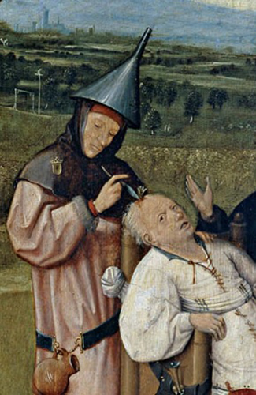
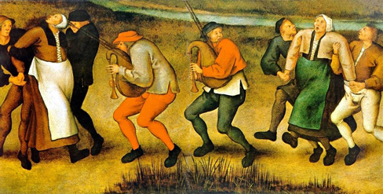

=======================================
Perspectives on Psychological Disorders
=======================================

.. contents::
   :depth: 3
..

.. container::

   By the end of this section, you will be able to: \* Discuss
   supernatural perspectives on the origin of psychological disorders,
   in their historical context \* Describe modern biological and
   psychological perspectives on the origin of psychological disorders
   \* Identify which disorders generally show the highest degree of
   heritability \* Describe the diathesis-stress model and its
   importance to the study of psychopathology

Scientists and mental health professionals may adopt different
perspectives in attempting to understand or explain the underlying
mechanisms that contribute to the development of a psychological
disorder. The perspective used in explaining a psychological disorder is
extremely important, in that it will consist of explicit assumptions
regarding how best to study the disorder, its etiology, and what kinds
of therapies or treatments are most beneficial. Different perspectives
provide alternate ways for how to think about the nature of
psychopathology.

SUPERNATURAL PERSPECTIVES OF PSYCHOLOGICAL DISORDERS
====================================================

For centuries, psychological disorders were viewed from a
**supernatural**\ {: data-type=“term”} perspective: attributed to a
force beyond scientific understanding. Those afflicted were thought to
be practitioners of black magic or possessed by spirits
(`[link] <#Figure_15_03_Madness>`__) (Maher & Maher, 1985). For example,
convents throughout Europe in the 16th and 17th centuries reported
hundreds of nuns falling into a state of frenzy in which the afflicted
foamed at the mouth, screamed and convulsed, sexually propositioned
priests, and confessed to having carnal relations with devils or Christ.
Although, today, these cases would suggest serious mental illness; at
the time, these events were routinely explained as possession by
devilish forces (Waller, 2009a). Similarly, grievous fits by young girls
are believed to have precipitated the witch panic in New England late in
the 17th century (Demos, 1983). Such beliefs in supernatural causes of
mental illness are still held in some societies today; for example,
beliefs that supernatural forces cause mental illness are common in some
cultures in modern-day Nigeria (Aghukwa, 2012).

|The Extraction of the Stone of Madness is shown.|\ {:
#Figure_15_03_Madness}

.. container:: psychology dig-deeper

   .. container::

      Dancing Mania

   Between the 11th and 17th centuries, a curious epidemic swept across
   Western Europe. Groups of people would suddenly begin to dance with
   wild abandon. This compulsion to dance—referred to as **dancing
   mania**\ {: data-type=“term” .no-emphasis}—sometimes gripped
   thousands of people at a time (`[link] <#Figure_15_03_Mania>`__).
   Historical accounts indicate that those afflicted would sometimes
   dance with bruised and bloody feet for days or weeks, screaming of
   terrible visions and begging priests and monks to save their souls
   (Waller, 2009b). What caused dancing mania is not known, but several
   explanations have been proposed, including spider venom and ergot
   poisoning (“Dancing Mania,” 2011).

   |A painting shows a group of pilgrims dancing in a way that appears
   inconsistent and aimless.|\ {: #Figure_15_03_Mania}

   Historian John Waller (2009a, 2009b) has provided a comprehensive and
   convincing explanation of dancing mania that suggests the phenomenon
   was attributable to a combination of three factors: psychological
   distress, social contagion, and belief in supernatural forces. Waller
   argued that various disasters of the time (such as famine, plagues,
   and floods) produced high levels of psychological distress that could
   increase the likelihood of succumbing to an involuntary trance state.
   Waller indicated that anthropological studies and accounts of
   possession rituals show that people are more likely to enter a trance
   state if they expect it to happen, and that entranced individuals
   behave in a ritualistic manner, their thoughts and behavior shaped by
   the spiritual beliefs of their culture. Thus, during periods of
   extreme physical and mental distress, all it took were a few
   people—believing themselves to have been afflicted with a dancing
   curse—to slip into a spontaneous trance and then act out the part of
   one who is cursed by dancing for days on end.

BIOLOGICAL PERSPECTIVES OF PSYCHOLOGICAL DISORDERS
==================================================

The biological perspective views psychological disorders as linked to
biological phenomena, such as genetic factors, chemical imbalances, and
brain abnormalities; it has gained considerable attention and acceptance
in recent decades (Wyatt & Midkiff, 2006). Evidence from many sources
indicates that most psychological disorders have a genetic component; in
fact, there is little dispute that some disorders are largely due to
genetic factors. The graph in `[link] <#Figure_15_03_Heritability>`__
shows **heritability**\ {: data-type=“term” .no-emphasis} estimates for
schizophrenia.

|A bar graph has an x-axis labeled “Percent risk of developing
schizophrenia” and a y-axis labeled “relationship to person with
schizophrenia.” A series of relationships are correlated with the
percentage risk, shown with brackets indicating the generic
relationship. The general population has a 1% risk. First cousins have
2% risk; they share 12.5% of genes. The next relationships are
uncles/aunts, nephews/nieces, grandchildren, and half-siblings; they
share 25% of genes and the risk ranges from about 3–6%. The next
relationships are parents, siblings, children, and fraternal twins; they
share 50% of genes and the risks are about 6, 9, 13, and 17%,
respectively. Identical twins share 100% of genes and have about a 48%
risk.|\ {: #Figure_15_03_Heritability}

Findings such as these have led many of today’s researchers to search
for specific genes and genetic mutations that contribute to mental
disorders. Also, sophisticated neural imaging technology in recent
decades has revealed how abnormalities in brain structure and function
might be directly involved in many disorders, and advances in our
understanding of neurotransmitters and hormones have yielded insights
into their possible connections. The biological perspective is currently
thriving in the study of psychological disorders.

THE DIATHESIS-STRESS MODEL OF PSYCHOLOGICAL DISORDERS
=====================================================

Despite advances in understanding the biological basis of psychological
disorders, the psychosocial perspective is still very important. This
perspective emphasizes the importance of learning, stress, faulty and
self-defeating thinking patterns, and environmental factors. Perhaps the
best way to think about psychological disorders, then, is to view them
as originating from a combination of biological and psychological
processes. Many develop not from a single cause, but from a delicate
fusion between partly biological and partly psychosocial factors.

The **diathesis-stress model**\ {: data-type=“term”} (Zuckerman, 1999)
integrates biological and psychosocial factors to predict the likelihood
of a disorder. This diathesis-stress model suggests that people with an
underlying predisposition for a disorder (i.e., a diathesis) are more
likely than others to develop a disorder when faced with adverse
environmental or psychological events (i.e., stress), such as childhood
maltreatment, negative life events, trauma, and so on. A diathesis is
not always a biological vulnerability to an illness; some diatheses may
be psychological (e.g., a tendency to think about life events in a
pessimistic, self-defeating way).

The key assumption of the diathesis-stress model is that both factors,
diathesis and stress, are necessary in the development of a disorder.
Different models explore the relationship between the two factors: the
level of stress needed to produce the disorder is inversely proportional
to the level of diathesis.

Summary
=======

Psychopathology is very complex, involving a plethora of etiological
theories and perspectives. For centuries, psychological disorders were
viewed primarily from a supernatural perspective and thought to arise
from divine forces or possession from spirits. Some cultures continue to
hold this supernatural belief. Today, many who study psychopathology
view mental illness from a biological perspective, whereby psychological
disorders are thought to result largely from faulty biological
processes. Indeed, scientific advances over the last several decades
have provided a better understanding of the genetic, neurological,
hormonal, and biochemical bases of psychopathology. The psychological
perspective, in contrast, emphasizes the importance of psychological
factors (e.g., stress and thoughts) and environmental factors in the
development of psychological disorders. A contemporary, promising
approach is to view disorders as originating from an integration of
biological and psychosocial factors. The diathesis-stress model suggests
that people with an underlying diathesis, or vulnerability, for a
psychological disorder are more likely than those without the diathesis
to develop the disorder when faced with stressful events.

Review Questions
================

.. container::

   .. container::

      The diathesis-stress model presumes that psychopathology results
      from \________.

      1. vulnerability and adverse experiences
      2. biochemical factors
      3. chemical imbalances and structural abnormalities in the brain
      4. adverse childhood experiences {: type=“a”}

   .. container::

      A

.. container::

   .. container::

      Dr. Anastasia believes that major depressive disorder is caused by
      an over-secretion of cortisol. His view on the cause of major
      depressive disorder reflects a \_______\_ perspective.

      1. psychological
      2. supernatural
      3. biological
      4. diathesis-stress {: type=“a”}

   .. container::

      C

Critical Thinking Question
==========================

.. container::

   .. container::

      Why is the perspective one uses in explaining a psychological
      disorder important?

   .. container::

      The perspective one uses in explaining a psychological disorder
      consists of assumptions that will guide how to best study and
      understand the nature of a disorder, including its causes, and how
      to most effectively treat the disorder.

Personal Application Question
=============================

.. container::

   .. container::

      Even today, some believe that certain occurrences have
      supernatural causes. Think of an event, recent or historical, for
      which others have provided supernatural explanation.

.. container::

   .. rubric:: Glossary
      :name: glossary

   {: data-type=“glossary-title”}

   diathesis-stress model
      suggests that people with a predisposition for a disorder (a
      diathesis) are more likely to develop the disorder when faced with
      stress; model of psychopathology ^
   supernatural
      describes a force beyond scientific understanding

.. |A bar graph has an x-axis labeled “Percent risk of developing schizophrenia” and a y-axis labeled “relationship to person with schizophrenia.” A series of relationships are correlated with the percentage risk, shown with brackets indicating the generic relationship. The general population has a 1% risk. First cousins have 2% risk; they share 12.5% of genes. The next relationships are uncles/aunts, nephews/nieces, grandchildren, and half-siblings; they share 25% of genes and the risk ranges from about 3–6%. The next relationships are parents, siblings, children, and fraternal twins; they share 50% of genes and the risks are about 6, 9, 13, and 17%, respectively. Identical twins share 100% of genes and have about a 48% risk.| image:: ../resources/CNX_Psych_15_03_Heritability.jpg
