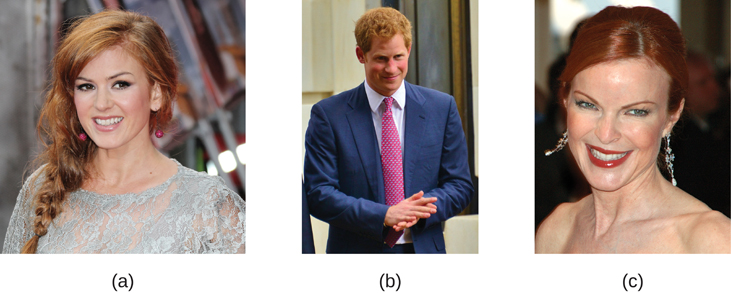

=================================
What Are Psychological Disorders?
=================================

.. contents::
   :depth: 3
..

.. container::

   By the end of this section, you will be able to: \* Understand the
   problems inherent in defining the concept of psychological disorder
   \* Describe what is meant by harmful dysfunction \* Identify the
   formal criteria that thoughts, feelings, and behaviors must meet to
   be considered abnormal and, thus, symptomatic of a psychological
   disorder

A **psychological disorder**\ {: data-type=“term”} is a condition
characterized by abnormal thoughts, feelings, and behaviors.
**Psychopathology**\ {: data-type=“term”} is the study of psychological
disorders, including their symptoms, **etiology**\ {: data-type=“term”}
(i.e., their causes), and treatment. The term *psychopathology* can also
refer to the manifestation of a psychological disorder. Although
consensus can be difficult, it is extremely important for mental health
professionals to agree on what kinds of thoughts, feelings, and
behaviors are truly abnormal in the sense that they genuinely indicate
the presence of psychopathology. Certain patterns of behavior and inner
experience can easily be labeled as abnormal and clearly signify some
kind of psychological disturbance. The person who washes his hands 40
times per day and the person who claims to hear the voices of demons
exhibit behaviors and inner experiences that most would regard as
abnormal: beliefs and behaviors that suggest the existence of a
psychological disorder. But, consider the nervousness a young man feels
when talking to attractive women or the loneliness and longing for home
a freshman experiences during her first semester of college—these
feelings may not be regularly present, but they fall in the range of
normal. So, what kinds of thoughts, feelings, and behaviors represent a
true psychological disorder? Psychologists work to distinguish
psychological disorders from inner experiences and behaviors that are
merely situational, idiosyncratic, or unconventional.

DEFINITION OF A PSYCHOLOGICAL DISORDER
======================================

Perhaps the simplest approach to conceptualizing psychological disorders
is to label behaviors, thoughts, and inner experiences that are
atypical, distressful, dysfunctional, and sometimes even dangerous, as
signs of a disorder. For example, if you ask a classmate for a date and
you are rejected, you probably would feel a little dejected. Such
feelings would be normal. If you felt extremely depressed—so much so
that you lost interest in activities, had difficulty eating or sleeping,
felt utterly worthless, and contemplated suicide—your feelings would be
**atypical**\ {: data-type=“term”}, would deviate from the norm, and
could signify the presence of a psychological disorder. Just because
something is atypical, however, does not necessarily mean it is
disordered.

For example, only about 4% of people in the United States have red hair,
so red hair is considered an atypical characteristic
(`[link] <#Figure_15_01_Red_Hair>`__), but it is not considered
disordered, it’s just unusual. And it is less unusual in Scotland, where
approximately 13% of the population has red hair (“DNA Project Aims,”
2012). As you will learn, some disorders, although not exactly typical,
are far from atypical, and the rates in which they appear in the
population are surprisingly high.

|Photograph A shows Isla Fischer. Photograph B shows Prince Harry.
Photograph C shows Marcia Cross.|\ {: #Figure_15_01_Red_Hair}

If we can agree that merely being atypical is an insufficient criterion
for a having a psychological disorder, is it reasonable to consider
behavior or inner experiences that differ from widely expected cultural
values or expectations as disordered? Using this criterion, a woman who
walks around a subway platform wearing a heavy winter coat in July while
screaming obscenities at strangers may be considered as exhibiting
symptoms of a psychological disorder. Her actions and clothes violate
socially accepted rules governing appropriate dress and behavior; these
characteristics are atypical.

CULTURAL EXPECTATIONS
=====================

Violating cultural expectations is not, in and of itself, a satisfactory
means of identifying the presence of a psychological disorder. Since
behavior varies from one **culture**\ {: data-type=“term” .no-emphasis}
to another, what may be expected and considered appropriate in one
culture may not be viewed as such in other cultures. For example,
returning a stranger’s smile is expected in the United States because a
pervasive social norm dictates that we reciprocate friendly gestures. A
person who refuses to acknowledge such gestures might be considered
socially awkward—perhaps even disordered—for violating this expectation.
However, such expectations are not universally shared. Cultural
expectations in Japan involve showing reserve, restraint, and a concern
for maintaining privacy around strangers. Japanese people are generally
unresponsive to smiles from strangers (Patterson et al., 2007). Eye
contact provides another example. In the United States and Europe, eye
contact with others typically signifies honesty and attention. However,
most Latin-American, Asian, and African cultures interpret direct eye
contact as rude, confrontational, and aggressive (Pazain, 2010). Thus,
someone who makes eye contact with you could be considered appropriate
and respectful or brazen and offensive, depending on your culture
(`[link] <#Figure_15_01_Eye_Contact>`__).

|A photograph shows two people making eye contact during a
conversation.c|\ {: #Figure_15_01_Eye_Contact}

Hallucinations (seeing or hearing things that are not physically
present) in Western societies is a violation of cultural expectations,
and a person who reports such inner experiences is readily labeled as
psychologically disordered. In other cultures, visions that, for
example, pertain to future events may be regarded as normal experiences
that are positively valued (Bourguignon, 1970). Finally, it is important
to recognize that cultural norms change over time: what might be
considered typical in a society at one time may no longer be viewed this
way later, similar to how fashion trends from one era may elicit
quizzical looks decades later—imagine how a headband, legwarmers, and
the big hair of the 1980s would go over on your campus today.

.. container:: psychology dig-deeper

   .. container::

      The Myth of Mental Illness

   In the 1950s and 1960s, the concept of mental illness was widely
   criticized. One of the major criticisms focused on the notion that
   mental illness was a “myth that justifies psychiatric intervention in
   socially disapproved behavior” (Wakefield, 1992). Thomas Szasz
   (1960), a noted psychiatrist, was perhaps the biggest proponent of
   this view. Szasz argued that the notion of mental illness was
   invented by society (and the mental health establishment) to
   stigmatize and subjugate people whose behavior violates accepted
   social and legal norms. Indeed, Szasz suggested that what appear to
   be symptoms of mental illness are more appropriately characterized as
   “problems in living” (Szasz, 1960).

   In his 1961 book, *The Myth of Mental Illness: Foundations of a
   Theory of Personal Conduct*, Szasz expressed his disdain for the
   concept of mental illness and for the field of psychiatry in general
   (Oliver, 2006). The basis for Szasz’s attack was his contention that
   detectable abnormalities in bodily structures and functions (e.g.,
   infections and organ damage or dysfunction) represent the defining
   features of genuine illness or disease, and because symptoms of
   purported mental illness are not accompanied by such detectable
   abnormalities, so-called psychological disorders are not disorders at
   all. Szasz (1961/2010) proclaimed that “disease or illness can only
   affect the body; hence, there can be no mental illness” (p. 267).

   Today, we recognize the extreme level of psychological suffering
   experienced by people with psychological disorders: the painful
   thoughts and feelings they experience, the disordered behavior they
   demonstrate, and the levels of distress and impairment they exhibit.
   This makes it very difficult to deny the reality of mental illness.

   However controversial Szasz’s views and those of his supporters might
   have been, they have influenced the mental health community and
   society in several ways. First, lay people, politicians, and
   professionals now often refer to mental illness as mental health
   “problems,” implicitly acknowledging the “problems in living”
   perspective Szasz described (Buchanan-Barker & Barker, 2009). Also
   influential was Szasz’s view of homosexuality. Szasz was perhaps the
   first psychiatrist to openly challenge the idea that homosexuality
   represented a form of mental illness or disease (Szasz, 1965). By
   challenging the idea that homosexuality represented a form a mental
   illness, Szasz helped pave the way for the social and civil rights
   that gay and lesbian people now have (Barker, 2010). His work also
   inspired legal changes that protect the rights of people in
   psychiatric institutions and allow such individuals a greater degree
   of influence and responsibility over their lives (Buchanan-Barker &
   Barker, 2009).

HARMFUL DYSFUNCTION
===================

If none of the criteria discussed so far is adequate by itself to define
the presence of a psychological disorder, how can a disorder be
conceptualized? Many efforts have been made to identify the specific
dimensions of psychological disorders, yet none is entirely
satisfactory. No universal definition of psychological disorder exists
that can apply to all situations in which a disorder is thought to be
present (Zachar & Kendler, 2007). However, one of the more influential
conceptualizations was proposed by Wakefield (1992), who defined
psychological disorder as a **harmful dysfunction**\ {:
data-type=“term”}. Wakefield argued that natural internal
mechanisms—that is, psychological processes honed by evolution, such as
cognition, perception, and learning—have important functions, such as
enabling us to experience the world the way others do and to engage in
rational thought, problem solving, and communication. For example,
learning allows us to associate a fear with a potential danger in such a
way that the intensity of fear is roughly equal to the degree of actual
danger. Dysfunction occurs when an internal mechanism breaks down and
can no longer perform its normal function. But, the presence of a
dysfunction by itself does not determine a disorder. The dysfunction
must be harmful in that it leads to negative consequences for the
individual or for others, as judged by the standards of the individual’s
culture. The harm may include significant internal anguish (e.g., high
levels of anxiety or depression) or problems in day-to-day living (e.g.,
in one’s social or work life).

To illustrate, Janet has an extreme fear of spiders. Janet’s fear might
be considered a dysfunction in that it signals that the internal
mechanism of learning is not working correctly (i.e., a faulty process
prevents Janet from appropriately associating the magnitude of her fear
with the actual threat posed by spiders). Janet’s fear of spiders has a
significant negative influence on her life: she avoids all situations in
which she suspects spiders to be present (e.g., the basement or a
friend’s home), and she quit her job last month because she saw a spider
in the restroom at work and is now unemployed. According to the harmful
dysfunction model, Janet’s condition would signify a disorder because
(a) there is a dysfunction in an internal mechanism, and (b) the
dysfunction has resulted in harmful consequences. Similar to how the
symptoms of physical illness reflect dysfunctions in biological
processes, the symptoms of psychological disorders presumably reflect
dysfunctions in mental processes. The internal mechanism component of
this model is especially appealing because it implies that disorders may
occur through a breakdown of biological functions that govern various
psychological processes, thus supporting contemporary neurobiological
models of psychological disorders (Fabrega, 2007).

THE AMERICAN PSYCHIATRIC ASSOCIATION (APA) DEFINITION
=====================================================

Many of the features of the harmful dysfunction model are incorporated
in a formal definition of psychological disorder developed by the
**American Psychiatric Association**\ {: data-type=“term” .no-emphasis}
(APA). According to the APA (2013), a psychological disorder is a
condition that is said to consist of the following:

-  **There are significant disturbances in thoughts, feelings, and
   behaviors**. A person must experience inner states (e.g., thoughts
   and/or feelings) and exhibit behaviors that are clearly
   disturbed—that is, unusual, but in a negative, self-defeating way.
   Often, such disturbances are troubling to those around the individual
   who experiences them. For example, an individual who is
   uncontrollably preoccupied by thoughts of germs spends hours each day
   bathing, has inner experiences, and displays behaviors that most
   would consider atypical and negative (disturbed) and that would
   likely be troubling to family members.
-  **The disturbances reflect some kind of biological, psychological, or
   developmental dysfunction**. Disturbed patterns of inner experiences
   and behaviors should reflect some flaw (dysfunction) in the internal
   biological, psychological, and developmental mechanisms that lead to
   normal, healthy psychological functioning. For example, the
   hallucinations observed in schizophrenia could be a sign of brain
   abnormalities.
-  **The disturbances lead to significant distress or disability in
   one’s life**. A person’s inner experiences and behaviors are
   considered to reflect a psychological disorder if they cause the
   person considerable distress, or greatly impair his ability to
   function as a normal individual (often referred to as functional
   impairment, or occupational and social impairment). As an
   illustration, a person’s fear of social situations might be so
   distressing that it causes the person to avoid all social situations
   (e.g., preventing that person from being able to attend class or
   apply for a job).
-  **The disturbances do not reflect expected or culturally approved
   responses to certain events**. Disturbances in thoughts, feelings,
   and behaviors must be socially unacceptable responses to certain
   events that often happen in life. For example, it is perfectly
   natural (and expected) that a person would experience great sadness
   and might wish to be left alone following the death of a close family
   member. Because such reactions are in some ways culturally expected,
   the individual would not be assumed to signify a mental disorder.

Some believe that there is no essential criterion or set of criteria
that can definitively distinguish all cases of disorder from nondisorder
(Lilienfeld & Marino, 1999). In truth, no single approach to defining a
psychological disorder is adequate by itself, nor is there universal
agreement on where the boundary is between disordered and not
disordered. From time to time we all experience anxiety, unwanted
thoughts, and moments of sadness; our behavior at other times may not
make much sense to ourselves or to others. These inner experiences and
behaviors can vary in their intensity, but are only considered
disordered when they are highly disturbing to us and/or others, suggest
a dysfunction in normal mental functioning, and are associated with
significant distress or disability in social or occupational activities.

Summary
=======

Psychological disorders are conditions characterized by abnormal
thoughts, feelings, and behaviors. Although challenging, it is essential
for psychologists and mental health professionals to agree on what kinds
of inner experiences and behaviors constitute the presence of a
psychological disorder. Inner experiences and behaviors that are
atypical or violate social norms could signify the presence of a
disorder; however, each of these criteria alone is inadequate. Harmful
dysfunction describes the view that psychological disorders result from
the inability of an internal mechanism to perform its natural function.
Many of the features of harmful dysfunction conceptualization have been
incorporated in the APA’s formal definition of psychological disorders.
According to this definition, the presence of a psychological disorder
is signaled by significant disturbances in thoughts, feelings, and
behaviors; these disturbances must reflect some kind of dysfunction
(biological, psychological, or developmental), must cause significant
impairment in one’s life, and must not reflect culturally expected
reactions to certain life events.

Review Questions
================

.. container::

   .. container::

      In the harmful dysfunction definition of psychological disorders,
      dysfunction involves \________.

      1. the inability of an psychological mechanism to perform its
         function
      2. the breakdown of social order in one’s community
      3. communication problems in one’s immediate family
      4. all the above {: type=“a”}

   .. container::

      A

.. container::

   .. container::

      Patterns of inner experience and behavior are thought to reflect
      the presence of a psychological disorder if they \________.

      1. are highly atypical
      2. lead to significant distress and impairment in one’s life
      3. embarrass one’s friends and/or family
      4. violate the norms of one’s culture {: type=“a”}

   .. container::

      B

Critical Thinking Question
==========================

.. container::

   .. container::

      Discuss why thoughts, feelings, or behaviors that are merely
      atypical or unusual would not necessarily signify the presence of
      a psychological disorder. Provide an example.

   .. container::

      Just because something is atypical or unusual does not mean it is
      disordered. A person may experience atypical inner experiences or
      exhibit unusual behaviors, but she would not be considered
      disordered if they are not distressing, disturbing, or reflecting
      a dysfunction. For example, a classmate might stay up all night
      studying before exams; although atypical, this behavior is
      unlikely to possess any of the other criteria for psychological
      disorder mentioned previously.

Personal Application Question
=============================

.. container::

   .. container::

      Identify a behavior that is considered unusual or abnormal in your
      own culture; however, it would be considered normal and expected
      in another culture.

.. container::

   .. rubric:: Glossary
      :name: glossary

   {: data-type=“glossary-title”}

   atypical
      describes behaviors or feelings that deviate from the norm ^
   etiology
      cause or causes of a psychological disorder ^
   harmful dysfunction
      model of psychological disorders resulting from the inability of
      an internal mechanism to perform its natural function ^
   psychological disorder
      condition characterized by abnormal thoughts, feelings, and
      behaviors ^
   psychopathology
      study of psychological disorders, including their symptoms,
      causes, and treatment; manifestation of a psychological disorder

