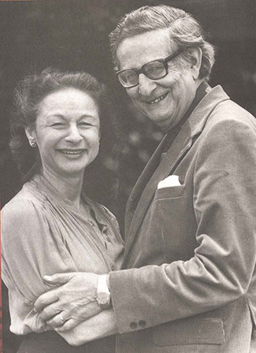

===============
Trait Theorists
===============

.. contents::
   :depth: 3
..

.. container::

   By the end of this section, you will be able to: \* Discuss early
   trait theories of Cattell and Eysenck \* Discuss the Big Five factors
   and describe someone who is high and low on each of the five traits

Trait theorists believe personality can be understood via the approach
that all people have certain **traits**\ {: data-type=“term”}, or
characteristic ways of behaving. Do you tend to be sociable or shy?
Passive or aggressive? Optimistic or pessimistic? Moody or
even-tempered? Early trait theorists tried to describe all human
personality traits. For example, one trait theorist, Gordon Allport
(Allport & Odbert, 1936), found 4,500 words in the English language that
could describe people. He organized these personality traits into three
categories: cardinal traits, central traits, and secondary traits. A
cardinal trait is one that dominates your entire personality, and hence
your life—such as Ebenezer Scrooge’s greed and Mother Theresa’s
altruism. Cardinal traits are not very common: Few people have
personalities dominated by a single trait. Instead, our personalities
typically are composed of multiple traits. Central traits are those that
make up our personalities (such as loyal, kind, agreeable, friendly,
sneaky, wild, and grouchy). Secondary traits are those that are not
quite as obvious or as consistent as central traits. They are present
under specific circumstances and include preferences and attitudes. For
example, one person gets angry when people try to tickle him; another
can only sleep on the left side of the bed; and yet another always
orders her salad dressing on the side. And you—although not normally an
anxious person—feel nervous before making a speech in front of your
English class.

In an effort to make the list of traits more manageable, Raymond Cattell
(1946, 1957) narrowed down the list to about 171 traits. However, saying
that a trait is either present or absent does not accurately reflect a
person’s uniqueness, because all of our personalities are actually made
up of the same traits; we differ only in the degree to which each trait
is expressed. Cattell (1957) identified 16 factors or dimensions of
personality: warmth, reasoning, emotional stability, dominance,
liveliness, rule-consciousness, social boldness, sensitivity, vigilance,
abstractedness, privateness, apprehension, openness to change,
self-reliance, perfectionism, and tension
(`[link] <#Table_11_07_01>`__). He developed a personality assessment
based on these 16 factors, called the 16PF. Instead of a trait being
present or absent, each dimension is scored over a continuum, from high
to low. For example, your level of warmth describes how warm, caring,
and nice to others you are. If you score low on this index, you tend to
be more distant and cold. A high score on this index signifies you are
supportive and comforting.

.. raw:: html

   <table id="Table_11_07_01" summary="A three column table compares low scores and high scores for personality factors measured by the 16PF Questionnaire. From left to right, the columns are labeled “Factor,” Low Score,” and “High Score.” The first row contains “warmth; reserved, detached; and outgoing, supportive.” The second row contains “intellect; concrete thinker; and analytical.” The third row contains “emotional stability; moody, irritable; and stable, calm.” The fourth row contains “aggressiveness; docile, submissive; and controlling, dominant.” The fifth row contains “liveliness; somber, prudent; and adventurous, spontaneous.” The sixth row contains “dutifulness; unreliable; and conscientious.” The seventh row contains “social assertiveness; shy, restrained; and uninhibited, bold.” The eighth row contains “sensitivity; tough-minded; and sensitive, caring.” The ninth row contains “paranoia; trusting; and suspicious.” The tenth row contains “abstractness; conventional; and imaginative.” The eleventh row contains “introversion; open, straightforward; and private, shrewd.” The twelfth row contains “anxiety; confident; and apprehensive.” The thirteenth row contains “openmindedness; closeminded, traditional; and curious, experimental.” The fourteenth row contains “independence; outgoing, social; and self-sufficient.” The fifteenth row contains “perfectionism; disorganized, casual; and organized, precise.” The sixteenth row contains “tension; relaxed; and stressed.”">

.. raw:: html

   <caption>

Personality Factors Measured by the 16PF Questionnaire

.. raw:: html

   </caption>

.. raw:: html

   <thead>

.. raw:: html

   <tr>

.. raw:: html

   <th>

Factor

.. raw:: html

   </th>

.. raw:: html

   <th>

Low Score

.. raw:: html

   </th>

.. raw:: html

   <th>

High Score

.. raw:: html

   </th>

.. raw:: html

   </tr>

.. raw:: html

   </thead>

.. raw:: html

   <tbody>

.. raw:: html

   <tr>

.. raw:: html

   <td>

Warmth

.. raw:: html

   </td>

.. raw:: html

   <td>

Reserved, detached

.. raw:: html

   </td>

.. raw:: html

   <td>

Outgoing, supportive

.. raw:: html

   </td>

.. raw:: html

   </tr>

.. raw:: html

   <tr>

.. raw:: html

   <td>

Intellect

.. raw:: html

   </td>

.. raw:: html

   <td>

Concrete thinker

.. raw:: html

   </td>

.. raw:: html

   <td>

Analytical

.. raw:: html

   </td>

.. raw:: html

   </tr>

.. raw:: html

   <tr>

.. raw:: html

   <td>

Emotional stability

.. raw:: html

   </td>

.. raw:: html

   <td>

Moody, irritable

.. raw:: html

   </td>

.. raw:: html

   <td>

Stable, calm

.. raw:: html

   </td>

.. raw:: html

   </tr>

.. raw:: html

   <tr>

.. raw:: html

   <td>

Aggressiveness

.. raw:: html

   </td>

.. raw:: html

   <td>

Docile, submissive

.. raw:: html

   </td>

.. raw:: html

   <td>

Controlling, dominant

.. raw:: html

   </td>

.. raw:: html

   </tr>

.. raw:: html

   <tr>

.. raw:: html

   <td>

Liveliness

.. raw:: html

   </td>

.. raw:: html

   <td>

Somber, prudent

.. raw:: html

   </td>

.. raw:: html

   <td>

Adventurous, spontaneous

.. raw:: html

   </td>

.. raw:: html

   </tr>

.. raw:: html

   <tr>

.. raw:: html

   <td>

Dutifulness

.. raw:: html

   </td>

.. raw:: html

   <td>

Unreliable

.. raw:: html

   </td>

.. raw:: html

   <td>

Conscientious

.. raw:: html

   </td>

.. raw:: html

   </tr>

.. raw:: html

   <tr>

.. raw:: html

   <td>

Social assertiveness

.. raw:: html

   </td>

.. raw:: html

   <td>

Shy, restrained

.. raw:: html

   </td>

.. raw:: html

   <td>

Uninhibited, bold

.. raw:: html

   </td>

.. raw:: html

   </tr>

.. raw:: html

   <tr>

.. raw:: html

   <td>

Sensitivity

.. raw:: html

   </td>

.. raw:: html

   <td>

Tough-minded

.. raw:: html

   </td>

.. raw:: html

   <td>

Sensitive, caring

.. raw:: html

   </td>

.. raw:: html

   </tr>

.. raw:: html

   <tr>

.. raw:: html

   <td>

Paranoia

.. raw:: html

   </td>

.. raw:: html

   <td>

Trusting

.. raw:: html

   </td>

.. raw:: html

   <td>

Suspicious

.. raw:: html

   </td>

.. raw:: html

   </tr>

.. raw:: html

   <tr>

.. raw:: html

   <td>

Abstractness

.. raw:: html

   </td>

.. raw:: html

   <td>

Conventional

.. raw:: html

   </td>

.. raw:: html

   <td>

Imaginative

.. raw:: html

   </td>

.. raw:: html

   </tr>

.. raw:: html

   <tr>

.. raw:: html

   <td>

Introversion

.. raw:: html

   </td>

.. raw:: html

   <td>

Open, straightforward

.. raw:: html

   </td>

.. raw:: html

   <td>

Private, shrewd

.. raw:: html

   </td>

.. raw:: html

   </tr>

.. raw:: html

   <tr>

.. raw:: html

   <td>

Anxiety

.. raw:: html

   </td>

.. raw:: html

   <td>

Confident

.. raw:: html

   </td>

.. raw:: html

   <td>

Apprehensive

.. raw:: html

   </td>

.. raw:: html

   </tr>

.. raw:: html

   <tr>

.. raw:: html

   <td>

Openmindedness

.. raw:: html

   </td>

.. raw:: html

   <td>

Closeminded, traditional

.. raw:: html

   </td>

.. raw:: html

   <td>

Curious, experimental

.. raw:: html

   </td>

.. raw:: html

   </tr>

.. raw:: html

   <tr>

.. raw:: html

   <td>

Independence

.. raw:: html

   </td>

.. raw:: html

   <td>

Outgoing, social

.. raw:: html

   </td>

.. raw:: html

   <td>

Self-sufficient

.. raw:: html

   </td>

.. raw:: html

   </tr>

.. raw:: html

   <tr>

.. raw:: html

   <td>

Perfectionism

.. raw:: html

   </td>

.. raw:: html

   <td>

Disorganized, casual

.. raw:: html

   </td>

.. raw:: html

   <td>

Organized, precise

.. raw:: html

   </td>

.. raw:: html

   </tr>

.. raw:: html

   <tr>

.. raw:: html

   <td>

Tension

.. raw:: html

   </td>

.. raw:: html

   <td>

Relaxed

.. raw:: html

   </td>

.. raw:: html

   <td>

Stressed

.. raw:: html

   </td>

.. raw:: html

   </tr>

.. raw:: html

   </tbody>

.. raw:: html

   </table>

.. container:: psychology link-to-learning

   Follow this `link <http://openstax.org/l/cattell>`__ to an assessment
   based on Cattell’s 16PF questionnaire to see which personality traits
   dominate your personality.

Psychologists Hans and Sybil **Eysenck**\ {: data-type=“term”
.no-emphasis} were personality theorists
(`[link] <#Figure_11_07_Eysenck>`__) who focused on **temperament**\ {:
data-type=“term”}, the inborn, genetically based personality differences
that you studied earlier in the chapter. They believed personality is
largely governed by biology. The Eysencks (Eysenck, 1990, 1992; Eysenck
& Eysenck, 1963) viewed people as having two specific personality
dimensions: extroversion/introversion and neuroticism/stability.

|A photograph shows Hans and Sybil Eysenck together.”|\ {:
#Figure_11_07_Eysenck}

According to their theory, people high on the trait of extroversion are
sociable and outgoing, and readily connect with others, whereas people
high on the trait of introversion have a higher need to be alone, engage
in solitary behaviors, and limit their interactions with others. In the
neuroticism/stability dimension, people high on neuroticism tend to be
anxious; they tend to have an overactive sympathetic nervous system and,
even with low stress, their bodies and emotional state tend to go into a
flight-or-fight reaction. In contrast, people high on stability tend to
need more stimulation to activate their flight-or-fight reaction and are
considered more emotionally stable. Based on these two dimensions, the
Eysencks’ theory divides people into four quadrants. These quadrants are
sometimes compared with the four temperaments described by the Greeks:
melancholic, choleric, phlegmatic, and sanguine
(`[link] <#Figure_11_04_Quadrants>`__).

|A circle is divided vertically and horizontally into four sections by
lines with arrows at the ends. Clockwise from the top, the arrows are
labeled “Unstable Emotions (Neurotic),” “Extroverted Personality,”
“Stable Emotions,” and “Introverted Personality.” The arcs around the
perimeter of the circle, clockwise beginning with the top right segment
are labeled “Choleric,” “Sanguine,” “Phlegmatic,” and “Melancholic.” The
sections inside each arc contain descriptive words. Inside the Choleric
arc are the words “touchy, restless, aggressive, excitable, impulsive,
and active.” Inside the Sanguine arc are the words “sociable, talkative,
responsive, easygoing, lively, and carefree.” Inside the Phlegmatic arc
are the words “passive, thoughtful, peaceful, controlled, reliable, and
calm.” Inside the Melancholic arc are the words “moody, anxious, rigid,
pessimistic, unsociable, and quiet.”|\ {: #Figure_11_04_Quadrants}

Later, the Eysencks added a third dimension: psychoticism versus
superego control (Eysenck, Eysenck & Barrett, 1985). In this dimension,
people who are high on psychoticism tend to be independent thinkers,
cold, nonconformists, impulsive, antisocial, and hostile, whereas people
who are high on superego control tend to have high impulse control—they
are more altruistic, empathetic, cooperative, and conventional (Eysenck,
Eysenck & Barrett, 1985).

While Cattell’s 16 factors may be too broad, the Eysenck’s two-factor
system has been criticized for being too narrow. Another personality
theory, called the **Five Factor Model**\ {: data-type=“term”},
effectively hits a middle ground, with its five factors referred to as
the Big Five personality traits. It is the most popular theory in
personality psychology today and the most accurate approximation of the
basic trait dimensions (Funder, 2001). The five traits are openness to
experience, conscientiousness, extroversion, agreeableness, and
neuroticism (`[link] <#Figure_11_07_BigFive>`__). A helpful way to
remember the traits is by using the mnemonic OCEAN.

In the Five Factor Model, each person has each trait, but they occur
along a spectrum. Openness to experience is characterized by
imagination, feelings, actions, and ideas. People who score high on this
trait tend to be curious and have a wide range of interests.
Conscientiousness is characterized by competence, self-discipline,
thoughtfulness, and achievement-striving (goal-directed behavior).
People who score high on this trait are hardworking and dependable.
Numerous studies have found a positive correlation between
conscientiousness and academic success (Akomolafe, 2013;
Chamorro-Premuzic & Furnham, 2008; Conrad & Patry, 2012; Noftle &
Robins, 2007; Wagerman & Funder, 2007). Extroversion is characterized by
sociability, assertiveness, excitement-seeking, and emotional
expression. People who score high on this trait are usually described as
outgoing and warm. Not surprisingly, people who score high on both
extroversion and openness are more likely to participate in adventure
and risky sports due to their curious and excitement-seeking nature
(Tok, 2011). The fourth trait is agreeableness, which is the tendency to
be pleasant, cooperative, trustworthy, and good-natured. People who
score low on agreeableness tend to be described as rude and
uncooperative, yet one recent study reported that men who scored low on
this trait actually earned more money than men who were considered more
agreeable (Judge, Livingston, & Hurst, 2012). The last of the Big Five
traits is neuroticism, which is the tendency to experience negative
emotions. People high on neuroticism tend to experience emotional
instability and are characterized as angry, impulsive, and hostile.
Watson and Clark (1984) found that people reporting high levels of
neuroticism also tend to report feeling anxious and unhappy. In
contrast, people who score low in neuroticism tend to be calm and
even-tempered.

|A diagram includes five vertically stacked arrows, which point to the
left and right. A dimension's first letter, name, and description are
included inside of each arrow. A box to the left of each arrow includes
traits associated with a low score for that arrow's dimension. A box to
the right of each arrow includes traits associated with a high score for
that arrow's dimension. The top arrow includes the trait “openness,”
which is described with the words, “imagination,” “feelings,” “actions,”
and “ideas.” The box to the left of that arrow includes the words,
“practical,” “conventional,” and “prefers routine,” while the box to the
right of that arrow includes the words, “curious,” “wide range of
interests,” and “independent.” The next arrow includes the trait
“conscientiousness,” which is described with the words, “competence,”
“self-discipline,” “thoughtfulness,” and “goal-driven.” The box to the
left of that arrow includes the words, “impulsive,” “careless,” and
“disorganized,” while the box to the right of that arrow includes the
words, “hardworking,” “dependable,” and “organized.” The next arrow
includes the trait “extroversion,” which is described with the words,
“sociability,” “assertiveness,” and “emotional expression.” The box to
the left of that arrow includes the words, “quiet,” “reserved,” and
“withdrawn,” while the box to the right of that arrow includes the
words, “outgoing,” “warm,” and “seeks adventure.” The next arrow
includes the trait “agreeableness,” which is described with the words,
“cooperative,” “trustworthy,” and “good-natured.” The box to the left of
that arrow includes the words, “critical,” “uncooperative,” and
“suspicious,” while the box to the right of that arrow includes the
words, “helpful,” “trusting,” and “empathetic.” The next arrow includes
the trait “neuroticism,” which is described as “tendency toward unstable
emotions.” The box to the left of that arrow includes the words, “calm,”
“even-tempered,” and “secure,” while the box to the right of that arrow
includes the words, “anxious,” “unhappy,” and “prone to negative
emotions.”|\ {: #Figure_11_07_BigFive}

The Big Five personality factors each represent a range between two
extremes. In reality, most of us tend to lie somewhere midway along the
continuum of each factor, rather than at polar ends. It’s important to
note that the Big Five traits are relatively stable over our lifespan,
with some tendency for the traits to increase or decrease slightly.
Researchers have found that conscientiousness increases through young
adulthood into middle age, as we become better able to manage our
personal relationships and careers (Donnellan & Lucas, 2008).
Agreeableness also increases with age, peaking between 50 to 70 years
(Terracciano, McCrae, Brant, & Costa, 2005). Neuroticism and
extroversion tend to decline slightly with age (Donnellan & Lucas;
Terracciano et al.). Additionally, The Big Five traits have been shown
to exist across ethnicities, cultures, and ages, and may have
substantial biological and genetic components (Jang, Livesley, & Vernon,
1996; Jang et al., 2006; McCrae & Costa, 1997; Schmitt et al., 2007).

.. container:: psychology link-to-learning

   To find out about your personality and where you fall on the Big Five
   traits, follow this `link <http://openstax.org/l/big5>`__ to take the
   Big Five personality test.

Summary
=======

Trait theorists attempt to explain our personality by identifying our
stable characteristics and ways of behaving. They have identified
important dimensions of personality. The Five Factor Model is the most
widely accepted trait theory today. The five factors are openness,
conscientiousness, extroversion, agreeableness, and neuroticism. These
traits occur along a continuum.

Review Questions
================

.. container::

   .. container::

      According to the Eysencks’ theory, people who score high on
      neuroticism tend to be \________.

      1. calm
      2. stable
      3. outgoing
      4. anxious {: type=“a”}

   .. container::

      D

Critical Thinking Questions
===========================

.. container::

   .. container::

      How stable are the Big Five traits over one’s lifespan?

   .. container::

      The Big Five traits are relatively stable over our lifespan with a
      tendency for the traits to increase or decrease slightly.
      Researchers have found that conscientiousness increases through
      young adulthood into middle age, as we become better able to
      manage our personal relationships and careers. Agreeableness also
      increases with age, peaking between 50 to 70 years. However,
      neuroticism and extroversion tend to decline slightly with age.

.. container::

   .. container::

      Compare the personality of someone who scores high on
      agreeableness to someone who scores low on agreeableness.

   .. container::

      A person with a high score on agreeableness is typically pleasant,
      cooperative, trustworthy and good-natured. People who score low on
      agreeableness tend to be described as rude and uncooperative. They
      may be difficult with which to work.

Personal Application Questions
==============================

.. container::

   .. container::

      Review the Big Five personality traits shown in
      `[link] <#Figure_11_07_BigFive>`__. On which areas would you
      expect you’d score high? In which areas does the low score more
      accurately describe you?

.. container::

   .. rubric:: Glossary
      :name: glossary

   {: data-type=“glossary-title”}

   Five Factor Model
      theory that personality is composed of five factors or traits,
      including openness, conscientiousness, extroversion,
      agreeableness, and neuroticism ^
   traits
      characteristic ways of behaving

.. |A circle is divided vertically and horizontally into four sections by lines with arrows at the ends. Clockwise from the top, the arrows are labeled “Unstable Emotions (Neurotic),” “Extroverted Personality,” “Stable Emotions,” and “Introverted Personality.” The arcs around the perimeter of the circle, clockwise beginning with the top right segment are labeled “Choleric,” “Sanguine,” “Phlegmatic,” and “Melancholic.” The sections inside each arc contain descriptive words. Inside the Choleric arc are the words “touchy, restless, aggressive, excitable, impulsive, and active.” Inside the Sanguine arc are the words “sociable, talkative, responsive, easygoing, lively, and carefree.” Inside the Phlegmatic arc are the words “passive, thoughtful, peaceful, controlled, reliable, and calm.” Inside the Melancholic arc are the words “moody, anxious, rigid, pessimistic, unsociable, and quiet.”| image:: ../resources/CNX_Psych_11_04_Quadrants.jpg
.. |A diagram includes five vertically stacked arrows, which point to the left and right. A dimension's first letter, name, and description are included inside of each arrow. A box to the left of each arrow includes traits associated with a low score for that arrow's dimension. A box to the right of each arrow includes traits associated with a high score for that arrow's dimension. The top arrow includes the trait “openness,” which is described with the words, “imagination,” “feelings,” “actions,” and “ideas.” The box to the left of that arrow includes the words, “practical,” “conventional,” and “prefers routine,” while the box to the right of that arrow includes the words, “curious,” “wide range of interests,” and “independent.” The next arrow includes the trait “conscientiousness,” which is described with the words, “competence,” “self-discipline,” “thoughtfulness,” and “goal-driven.” The box to the left of that arrow includes the words, “impulsive,” “careless,” and “disorganized,” while the box to the right of that arrow includes the words, “hardworking,” “dependable,” and “organized.” The next arrow includes the trait “extroversion,” which is described with the words, “sociability,” “assertiveness,” and “emotional expression.” The box to the left of that arrow includes the words, “quiet,” “reserved,” and “withdrawn,” while the box to the right of that arrow includes the words, “outgoing,” “warm,” and “seeks adventure.” The next arrow includes the trait “agreeableness,” which is described with the words, “cooperative,” “trustworthy,” and “good-natured.” The box to the left of that arrow includes the words, “critical,” “uncooperative,” and “suspicious,” while the box to the right of that arrow includes the words, “helpful,” “trusting,” and “empathetic.” The next arrow includes the trait “neuroticism,” which is described as “tendency toward unstable emotions.” The box to the left of that arrow includes the words, “calm,” “even-tempered,” and “secure,” while the box to the right of that arrow includes the words, “anxious,” “unhappy,” and “prone to negative emotions.”| image:: ../resources/CNX_Psych_11_07_BigFive.jpg
